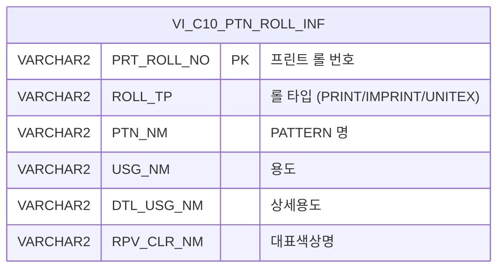

<h1 style="font-size: 40px; text-align: center; font-weight:
   bold; margin: 30px 0;">
  C106000080pop03 레거시 시스템 분석 종합 보고서
</h1>


# 1. 시스템 개요
- **서비스 ID**: C106000080pop03
- **업무명**: 패턴롤 관리 롤정보 팝업
- **분석 일시**: 2026-03-17 10:40 KST
- **전체 Activity 수**: 2개 (Built-in)
- **분석자**: Claude Opus 4.6 / Claude Sonnet 4.6
- **분석 도구**: /analyze-service C106000080pop03
- **문서 버전**: 1.0

# 비즈니스 프로세스 분석

## 시스템 목적

패턴롤 관리 화면(C106000080)에서 사용하는 **롤정보 검색 팝업**이다. 부모 화면에서 패턴롤 정보를 입력할 때, 사용자가 롤 코드를 직접 입력하는 대신 이 팝업을 통해 등록된 프린트 롤 목록을 검색하고 선택할 수 있도록 지원한다.

`C10APUSER.VI_C10_PTN_ROLL_INF` 뷰에서 프린트 롤 정보를 조회하며, 롤 코드, 구분(PRINT/IMPRINT/UNITEX), 대표색상명, PATTERN명 등 다양한 조건으로 LIKE 검색이 가능하다. 사용자가 그리드 행을 더블클릭하면 선택한 롤 정보(6개 컬럼값)를 부모 화면에 전달하고 팝업을 닫는다.

## 주요 유즈케이스

### UC-01: 프린트 롤 검색 조회

- **Actor**: CCL 공정 오퍼레이터
- **목적**: 등록된 프린트 롤 목록에서 조건에 맞는 롤을 검색하여 부모 화면에 선택 정보를 전달

- **전제조건**:
  - 부모 화면(C106000080)에서 팝업이 호출된 상태
  - `VI_C10_PTN_ROLL_INF` 뷰에 프린트 롤 데이터가 존재

- **주요 흐름**:
  1. 팝업 열림 시 자동으로 전체 프린트 롤 목록 조회 (onLoadGrid → find)
  2. 사용자가 검색 조건 입력 (Roll코드, 구분, 대표색상명, PATTERN명)
  3. 조회 버튼 클릭 → `C106000080pop03.select` 쿼리 실행
  4. Grid에 검색 결과 표시 (ROLL ID, 구분, PATTERN명, 용도, 상세용도, 대표색상)

- **대체 흐름**:
  - 검색 결과가 없는 경우: 빈 그리드 표시, 메시지바에 조회 결과 메시지 표시
  - 조건 미입력 시: LIKE '%' 패턴으로 전체 조회

- **후행조건**:
  - Grid에 검색 결과가 표시됨
  - 사용자가 행을 더블클릭하여 선택 가능한 상태

### UC-02: 롤 정보 선택 및 부모 화면 전달

- **Actor**: CCL 공정 오퍼레이터
- **목적**: 검색된 롤 목록에서 원하는 롤을 선택하여 부모 화면의 입력 필드에 자동 반영

- **전제조건**:
  - UC-01이 완료되어 Grid에 롤 목록이 표시된 상태

- **주요 흐름**:
  1. 사용자가 Grid 행 더블클릭
  2. `parentSetValue()` 함수 실행
  3. 선택 행의 6개 컬럼값(PRT_ROLL_NO, ROLL_TP, PTN_NM, USG_NM, DTL_USG_NM, RPV_CLR_NM) 추출
  4. `parent.pop3SetValue()` 호출하여 부모 화면에 값 전달
  5. `winClose()` 호출하여 팝업 닫기

- **대체 흐름**:
  - 닫기 버튼 클릭 시: 값 전달 없이 팝업 닫기 (winClose)

- **후행조건**:
  - 부모 화면의 해당 필드에 선택한 롤 정보가 반영됨
  - 팝업 창이 닫힘

### UC-03: 그리드 컨텍스트 메뉴 활용

- **Actor**: CCL 공정 오퍼레이터
- **목적**: 그리드 데이터를 클립보드 복사하거나 엑셀로 내보내기

- **전제조건**:
  - Grid에 데이터가 조회된 상태

- **주요 흐름**:
  1. 사용자가 Grid에서 우클릭하여 컨텍스트 메뉴 표시
  2. "복사" 선택 시: 선택된 셀 값을 클립보드에 복사 (`cellToClipboard`)
  3. "엑셀" 선택 시: Grid 데이터를 엑셀 파일로 내보내기 (`toExcel`)

- **대체 흐름**:
  - 행 미선택 상태에서 복사 시: 복사 동작 미수행

- **후행조건**:
  - 복사: 클립보드에 셀 값이 저장됨
  - 엑셀: 엑셀 파일 다운로드 시작

---
## 비즈니스 로직 상세

### 1. 롤 타입별 정렬 로직

- **목적**: 프린트 롤 목록을 업무 중요도 순서로 정렬하여 사용자의 검색 편의성 향상
- **처리 케이스**:

  **[케이스 1: DECODE 기반 롤 타입 우선순위 정렬]**
  ```
  조건: ORDER BY decode(ROLL_TP, 'PRINT', 1, 'IMPRINT', 2, 3), PRT_ROLL_NO
  처리:
    1. ROLL_TP가 'PRINT'이면 우선순위 1 (최우선)
    2. ROLL_TP가 'IMPRINT'이면 우선순위 2
    3. 그 외(UNITEX 등)는 우선순위 3
    4. 동일 우선순위 내에서는 PRT_ROLL_NO 오름차순 정렬
  ```

### 2. 다중 조건 LIKE 검색 패턴

- **목적**: 사용자가 입력한 다양한 조건을 조합하여 유연한 검색 지원
- **처리 케이스**:

  **[케이스 1: 롤 코드 전방 일치 검색]**
  ```
  조건: ROLL_CD 파라미터 입력 시
  처리:
    1. NVL(PRT_ROLL_NO, '%')로 NULL 처리
    2. :ROLL_CD || '%' 패턴으로 전방 일치 검색
    3. 미입력 시 빈 문자열 + '%' = '%'로 전체 조회
  ```

  **[케이스 2: 롤 타입 전방 일치 검색]**
  ```
  조건: ROLL_TP 파라미터 선택 시 (PRINT/IMPRINT/UNITEX)
  처리:
    1. :ROLL_TP || '%' 패턴으로 전방 일치 검색
    2. '전체' 선택 시 빈 문자열로 전체 조회
  ```

  **[케이스 3: 대표색상명/PATTERN명 부분 일치 검색]**
  ```
  조건: RPV_CLR_NM 또는 PTN_NM 파라미터 입력 시
  처리:
    1. NVL 처리 후 '%' || :파라미터 || '%' 패턴으로 부분 일치 검색
    2. 미입력 시 전체 조회
  ```

### 3. ROLL_CD 대문자 자동 변환

- **목적**: 롤 코드 입력 시 일관된 대문자 형식 보장
- **처리 케이스**:

  **[케이스 1: 입력값 실시간 대문자 변환]**
  ```
  조건: ROLL_CD 입력 필드에 키 입력 발생 시 (onkeyup)
  처리:
    1. 입력값을 toUpperCase()로 변환
    2. 변환된 값을 입력 필드에 즉시 반영
  ```

### 4. 데이터 변환 및 정렬 공식

- **목적**: SQL 쿼리 내 정렬 우선순위 및 검색 패턴을 수식으로 정리

- **계산 공식**:

  ```
  롤 타입 정렬 우선순위 (DECODE):
    정렬키 = DECODE(ROLL_TP, 'PRINT', 1, 'IMPRINT', 2, 3)
    → PRINT: 우선순위 1 (최우선)
    → IMPRINT: 우선순위 2
    → 그 외 (UNITEX 등): 우선순위 3
    → 동일 우선순위 내 PRT_ROLL_NO ASC 정렬

  LIKE 검색 패턴 (NVL 포함):
    롤코드: NVL(PRT_ROLL_NO, '%') LIKE :ROLL_CD || '%'      (전방일치)
    롤타입: ROLL_TP LIKE :ROLL_TP || '%'                      (전방일치, NVL 미적용)
    색상명: NVL(RPV_CLR_NM, '%') LIKE '%' || :RPV_CLR_NM || '%' (부분일치)
    패턴명: NVL(PTN_NM, '%') LIKE '%' || :PTN_NM || '%'        (부분일치)
    → 미입력 시 빈 문자열 + '%' = 전체 조회
  ```

---

# 데이터 요구사항

## 핵심 테이블

### 1. VI_C10_PTN_ROLL_INF (뷰) - 프린트 롤 정보 뷰
| 컬럼명 | 타입 | PK | 설명 |
|--------|------|----|------|
| PRT_ROLL_NO | STRING | ✅ | 프린트 롤 번호 (ROLL ID) |
| ROLL_TP | STRING | | 롤 타입 (PRINT/IMPRINT/UNITEX) |
| PTN_NM | STRING | | PATTERN 명 |
| USG_NM | STRING | | 용도 |
| DTL_USG_NM | STRING | | 상세용도 |
| RPV_CLR_NM | STRING | | 대표색상명 |

## 데이터 플로우

### 1. 조회

```
[팝업 열림 시 자동 조회 / 검색 조건 입력 후 조회]
화면 진입 (또는 조회 버튼 클릭)
→ C106000080pop03.select
  FROM C10APUSER.VI_C10_PTN_ROLL_INF
  WHERE NVL(PRT_ROLL_NO,'%') LIKE :ROLL_CD || '%'
    AND ROLL_TP LIKE :ROLL_TP || '%'
    AND NVL(RPV_CLR_NM,'%') LIKE '%' || :RPV_CLR_NM || '%'
    AND NVL(PTN_NM,'%') LIKE '%' || :PTN_NM || '%'
  ORDER BY decode(ROLL_TP, 'PRINT', 1, 'IMPRINT', 2, 3), PRT_ROLL_NO
→ Grid에 롤 목록 표시

[행 더블클릭 시 부모 화면 전달]
Grid 행 더블클릭
→ parentSetValue() 호출
→ parent.pop3SetValue(rowId, PRT_ROLL_NO, ROLL_TP, PTN_NM, USG_NM, DTL_USG_NM, RPV_CLR_NM)
→ winClose()
```

## SQL 일람표

| SQL 이름 | 쿼리 ID | 타입 | 출처 | 테이블 |
|---------|---------|-----|-------|-------|
| 칼라롤관리기준 팝업 조회 | C106000080pop03.select | SELECT | Service | VI_C10_PTN_ROLL_INF |

## ER 다이어그램 (핵심 관계)



관계 설명:
- `VI_C10_PTN_ROLL_INF`는 C10APUSER 스키마의 뷰로, 프린트 롤 정보를 통합 제공
- 단일 뷰만 참조하므로 테이블 간 관계는 없음 (뷰 내부에서 원본 테이블 조인 가능)

---

# 사용자 인터페이스 요구사항

## 화면 레이아웃 상세

### Layout 구조 (절대 좌표 기반)
```javascript
// initLayout 미사용 - 절대 좌표(position:absolute) 기반 팝업 레이아웃
// 전체 크기: 650px x 483px
{
  components: [
    {
      id: "C106000080pop03_Form_1",
      itemType: "form",
      position: "absolute",
      top: "0px", left: "0px",
      height: "60px", width: "650px"
    },
    {
      id: "C106000080pop03_Grid_1",
      itemType: "grid",
      position: "absolute",
      top: "61px", left: "1px",
      height: "401px", width: "648px"
    },
    {
      id: "C106000080pop03_messagebox",
      itemType: "messagebox",
      position: "absolute",
      top: "464px", left: "0px",
      height: "19px", width: "649px"
    }
  ]
}
```

## 입출력 요소

### Form 컴포넌트
**C106000080pop03_Form_1**
- Block 1 (641px):
  - ROLL_CD: Input - Roll코드 (inputWidth: 60px)
  - ROLL_TP: Combo - 구분 (inputWidth: 80px, 옵션: 전체(기본)/PRINT/IMPRINT/UNITEX)
  - find: Button - 조회 → find() 이벤트
  - winClose: Button - 닫기 → winClose() 이벤트
- Block 2 (641px):
  - RPV_CLR_NM: Input - 대표색상명 (inputWidth: 100px)
  - PTN_NM: Input - PATTERN명 (inputWidth: 100px)

### Grid 컴포넌트

**C106000080pop03_Grid_1 (프린트 롤 목록)**
- 편집 가능 여부: 아니오 (읽기 전용, 전 컬럼 ro 타입)
- Split: 없음 (split=0)
- 페이징: 사용 (rowCnt=2, pageset=true)
- 컨텍스트 메뉴: 사용 (복사/엑셀)
- 다중 선택: 사용 (multiselect=true)
- 컬럼 너비: % 단위
- 소스 뷰: VI_C10_PTN_ROLL_INF
- 주요 컬럼 (6개):

  **기본 정보**:
  - PRT_ROLL_NO: ro - ROLL ID (10%, 중앙정렬, 더블클릭 시 부모 화면에 값 전달)
  - ROLL_TP: ro - 구분 (10%, 중앙정렬)
  - PTN_NM: ro - PATTERN 명 (25%, 중앙정렬)

  **용도 정보**:
  - USG_NM: ro - 용도 (10%, 중앙정렬)
  - DTL_USG_NM: ro - 상세용도 (25%, 중앙정렬)

  **색상 정보**:
  - RPV_CLR_NM: ro - 대표색상 (20%, 중앙정렬)

## 화면 동작 흐름

### 1. 화면 초기 로딩
```
1. 부모 화면에서 팝업 호출 (rowId, cellIndex 파라미터 전달)
2. ui.initializeDHTMLX() 호출하여 DHTMLX 컴포넌트 초기화
3. pageConfiguration JSON 기반 Form, Grid, Messagebox 렌더링
4. Grid XLE 이벤트 바인딩 (onXLEEvent → onLoadGrid)
5. Grid 행 더블클릭 이벤트 바인딩 (rowDblClicked → parentSetValue)
6. onLoadGrid() 자동 실행:
   a. uiCommon.parameters()로 파라미터 구성
   b. find 명령으로 전체 롤 목록 자동 조회
   c. ROLL_CD 입력 필드에 onkeyup 이벤트 바인딩 (대문자 변환)
   d. XLE 이벤트 detach (1회성 실행 보장)
```

### 2. 조건 검색 조회
```
1. 사용자가 검색 조건 입력/선택:
   - Roll코드 입력 (자동 대문자 변환)
   - 구분 콤보 선택 (전체/PRINT/IMPRINT/UNITEX)
   - 대표색상명 입력
   - PATTERN명 입력
2. 조회 버튼 클릭
3. find(eventName, formDivObj, referenceItem) 함수 실행
4. uiCommon.parameters("C106000080pop03_Form_1", "C106000080pop03_Grid_1", "find") 호출
5. items[referenceItem].loadData(findUrl) 실행
6. C106000080pop03.select 쿼리 실행 (LIKE 검색)
7. Grid에 검색 결과 바인딩
8. findMessage() 콜백 → 메시지바에 조회 결과 메시지 표시
```

### 3. 롤 선택 및 값 전달
```
1. 사용자가 Grid 행 더블클릭
2. parentSetValue(rowId, cellIndex, parentEleByNm) 실행
3. Grid에서 선택 행의 6개 컬럼값 추출:
   - getCellValue(rowId, 0): PRT_ROLL_NO
   - getCellValue(rowId, 1): ROLL_TP
   - getCellValue(rowId, 2): PTN_NM
   - getCellValue(rowId, 3): USG_NM
   - getCellValue(rowId, 4): DTL_USG_NM
   - getCellValue(rowId, 5): RPV_CLR_NM
4. parent.pop3SetValue(rowId, ...6개 값) 호출하여 부모 화면에 전달
5. winClose() 호출하여 팝업 닫기
```

## JavaScript 모듈

**C106000080pop03.jsp** (인라인 스크립트)
- find(eventName, formDivObj, referenceItem): 조회 기능 (uiCommon.parameters로 파라미터 구성 → Grid loadData)
- save(eventName, formDivObj, referenceItem): 저장 기능 (Grid sendGrid - 실제 사용되지 않음)
- findMessage(referenceItem): 조회 후 메시지 표시 (uiCommon.message 호출)
- onGridContextMenuClick(id, gridObj, menuObj): 컨텍스트 메뉴 처리 (copy_row → cellToClipboard, excel_grid → toExcel)
- onLoadGrid(): 초기 데이터 로드 + ROLL_CD 대문자 변환 바인딩 + XLE 이벤트 detach
- parentSetValue(rowId, cellIndex, parentEleByNm): 행 더블클릭 시 부모 화면에 값 전달 후 창 닫기

## 주요 이벤트 핸들러

**find (조회 버튼 클릭)**
- 이벤트 타입: Form Button Click (command="find")
- 처리 내용:
  1. uiCommon.parameters()로 Form 입력값을 URL 파라미터로 구성
  2. Grid loadData()로 서버 조회 요청
  3. findMessage() 콜백으로 조회 결과 메시지 표시

**parentSetValue (Grid 행 더블클릭)**
- 이벤트 타입: Grid Row Double Click (rowDblClicked)
- 처리 내용:
  1. 선택 행에서 6개 컬럼값 추출
  2. parent.pop3SetValue()로 부모 화면에 값 전달 (부모 JSP 파라미터 rowId 포함)
  3. winClose()로 팝업 닫기

**onLoadGrid (Grid XLE 이벤트)**
- 이벤트 타입: Grid XLE Event (1회성)
- 처리 내용:
  1. 초기 전체 롤 목록 자동 조회 (find)
  2. ROLL_CD 입력 필드에 onkeyup 이벤트 바인딩 (toUpperCase)
  3. XLE 이벤트 detach하여 중복 실행 방지

**onGridContextMenuClick (컨텍스트 메뉴)**
- 이벤트 타입: Grid Context Menu Click
- 처리 내용:
  1. copy_row: 선택 셀 값 클립보드 복사 (cellToClipboard)
  2. excel_grid: Grid 전체 엑셀 내보내기 (toExcel)

---

# 특이사항 및 주의사항

## 1. 부모-자식 팝업 간 강한 결합
- **parent.pop3SetValue() 의존성**: 부모 화면(C106000080)에 `pop3SetValue` 함수가 반드시 정의되어 있어야 함. 부모 화면에서 이 함수명을 변경하면 팝업이 정상 동작하지 않음
- **rowId 파라미터 전달**: JSP scriptlet으로 `<%=rowId%>` 값을 JavaScript에 직접 삽입. 부모가 전달한 rowId를 pop3SetValue의 첫 번째 인자로 재전달하는 구조
- **cellIndex 미사용**: 부모에서 전달받은 cellIndex 파라미터는 JSP 변수로 선언되나 실제 JavaScript에서 사용되지 않음

## 2. save 함수 미사용 (Dead Code)
- **save() 함수 정의**: Form 버튼 이벤트용 save 함수가 정의되어 있으나, Form XML에 save 커맨드 버튼이 없어 실제로 호출되지 않음
- **프레임워크 관례**: GLUE Framework의 Form 이벤트 핸들러 템플릿에서 find/save가 기본 포함되는 패턴으로 추정

## 3. C10APUSER 스키마 직접 참조
- **스키마 하드코딩**: SQL에서 `C10APUSER.VI_C10_PTN_ROLL_INF`로 스키마를 직접 지정. 다른 서비스들이 주로 사용하는 MESAPUSER가 아닌 C10APUSER 스키마의 뷰를 참조
- **뷰 기반 조회**: 테이블이 아닌 뷰(VI_C10_PTN_ROLL_INF)를 사용하므로, 뷰 정의 변경 시 팝업 동작에 영향

## 4. NVL 기반 NULL 안전 검색
- **NVL 패턴**: PRT_ROLL_NO, RPV_CLR_NM, PTN_NM 컬럼에 NVL 처리. NULL 값이 있는 레코드도 검색에서 누락되지 않도록 '%'로 대체
- **ROLL_TP는 NVL 미적용**: ROLL_TP 컬럼은 NVL 없이 직접 LIKE 비교. NULL인 경우 검색에서 제외될 수 있음

## 5. XLE 이벤트 1회성 실행 패턴
- **detachEvent**: onLoadGrid()에서 Grid 데이터 로드 후 즉시 XLE 이벤트를 detach하여 중복 실행을 방지하는 패턴 사용. Grid 초기화 완료 후 이벤트가 재발화되는 것을 차단

---

# 참고 문서

- **Query SQL**: `src/query/C106000080pop03-query.glue_sql`
- **Service XML**: `src/service/C106000080pop03-service.xml`
- **JSP**: `WebContents/C106000080pop03.jsp`
- **Form XML**: `WebContents/header/kr/C106000080pop03/C106000080pop03_Form_1.xml`
- **Grid XML**: `WebContents/header/kr/C106000080pop03/C106000080pop03_Grid_1.xml`
