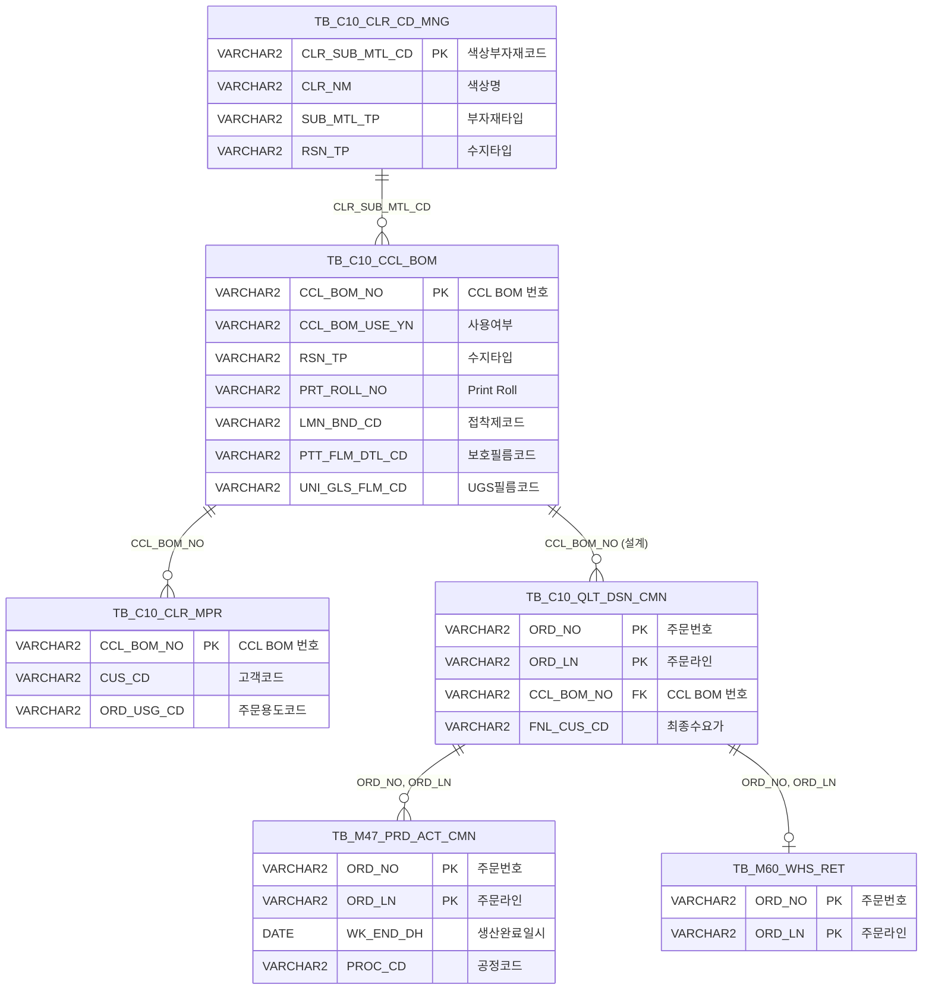

<h1 style="font-size: 40px; text-align: center; font-weight:
   bold; margin: 30px 0;">
  C106000090 레거시 시스템 분석 종합 보고서
</h1>


# 1. 시스템 개요
- **서비스 ID**: C106000090
- **업무명**: 코드사용조회
- **분석 일시**: 2026-03-17 (KST)
- **전체 Activity 수**: 20개 (Built-in 20개, Custom 0개)
- **분석자**: Claude Opus 4.6 / Sonnet
- **분석 도구**: /analyze-service C106000090
- **문서 버전**: 1.0

# 📊 비즈니스 프로세스 분석

## 시스템 목적

CCL(Color Coated Line) 공정에서 사용되는 각종 코드(칼라코드, CCL BOM, 수지타입, Print Roll, Ink코드, 보호필름코드, 접착제코드, 생산UGS필름코드)의 사용 현황을 조회하는 화면이다. 9가지 검색유형에 따라 코드 마스터 정보(Grid_1)와 해당 코드가 실제 사용된 주문/생산 이력(Grid_2)을 연동하여 조회한다.

이 서비스는 CCL 공정 품질설계 담당자가 특정 코드의 사용 이력을 추적하거나, 코드 변경 시 영향도를 분석할 때 활용된다. 예를 들어 특정 칼라코드가 어떤 주문에 사용되었는지, 특정 CCL BOM이 어떤 고객/용도에 적용되었는지를 파악할 수 있다. 또한 외부 화면(주문상세, 생산이력, 칼라물성)과의 연동 링크를 통해 상세 정보를 확인할 수 있다.

Custom Activity가 없고 모든 Activity가 SELECT 쿼리만 실행하는 단순 조회 서비스이므로, 핵심/상세 워크플로우 다이어그램은 생략한다.

## 주요 유즈케이스

### UC-01: 칼라코드 기반 사용 현황 조회

- **Actor**: CCL 품질설계 담당자
- **목적**: 특정 칼라코드(도료코드)가 어떤 CCL BOM에 매핑되어 있고, 어떤 주문/생산에 사용되었는지 추적

- **전제조건**:
  - 사용자가 시스템에 로그인되어 있음
  - 조회할 칼라코드를 알고 있음

- **주요 흐름**:
  1. 검색유형 라디오에서 "칼라코드" 선택 (SEARCH_CD_SEL=1)
  2. 코드 입력란에 칼라코드 입력 (FIND_CD)
  3. 조회 버튼 클릭 → C106000090_Grid1_CLRCD.select 실행
  4. Grid_1에 칼라코드 목록 표시 (코드, 색상명, 구분)
  5. Grid_1 행 선택 → C106000090_Grid2_CLRCD.select 실행
  6. Grid_2에 해당 칼라코드가 사용된 CCL BOM, 주문정보, 생산이력 표시

- **대체 흐름**:
  - 검색 결과 없음: Grid_1에 빈 결과 표시
  - Grid_2에서 주문번호(ORD_NO) 클릭: C104000020 화면으로 이동하여 주문상세 조회

- **후행조건**:
  - 사용자가 칼라코드의 사용 범위를 파악함
  - 필요 시 주문상세, 생산이력, 칼라물성 화면으로 이동 가능

### UC-02: CCL BOM 기반 사용 현황 조회

- **Actor**: CCL 품질설계 담당자
- **목적**: 특정 CCL BOM이 어떤 주문에 적용되었는지 확인하고, 기간별 사용 이력을 분석

- **전제조건**:
  - CCL BOM 번호를 알고 있거나, 외부 화면에서 CCL_BOM_NO 파라미터가 전달됨

- **주요 흐름**:
  1. 검색유형 "CCLBOM코드" 선택 (SEARCH_CD_SEL=2, 기본 선택)
  2. 기간 콤보 표시 (1년/3년/전체), 기본값 1년
  3. CCL BOM 번호 입력 후 조회 → C106000090_Grid1_CCLBOM.select 실행
  4. Grid_1에 CCL BOM 목록 표시 (BOM코드, 대표색상, 수지타입 등)
  5. Grid_1 행 선택 → C106000090_Grid2_CCLBOM.select 실행
  6. Grid_2에 주문정보, 생산완료일, Line, 설계확정자 등 상세 사용 이력 표시

- **대체 흐름**:
  - 외부 화면에서 CCL_BOM_NO 파라미터 전달 시: 자동으로 SEARCH_CD_SEL=2 설정 및 조회 실행
  - 기간 변경 시: SEARCH_TERM 값에 따라 조회 기간 필터 적용

- **후행조건**:
  - Grid_2에서 생산이력(PRD_WHS_OX) 클릭 시 M472020090 화면으로 이동
  - Grid_2에서 칼라물성(MPR_OX) 클릭 시 M472020030tab04 화면으로 이동

### UC-03: Print Roll 사용 현황 조회

- **Actor**: CCL 품질설계 담당자
- **목적**: 특정 Print Roll이 어떤 CCL BOM에 사용되고 있는지 파악

- **전제조건**:
  - Print Roll 번호를 알고 있거나, 외부 화면에서 ROLL_CD 파라미터가 전달됨

- **주요 흐름**:
  1. 검색유형 "Print Roll" 선택 (SEARCH_CD_SEL=4)
  2. Roll 번호 입력 후 조회 → C106000090_Grid1_PrintRoll.select 실행
  3. Grid_1에 Print Roll 목록 표시 (Roll번호, 대표색상, 패턴명)
  4. Grid_1 행 선택 → C106000090_Grid2_PrintRoll.select 실행
  5. Grid_2에 해당 Roll을 사용하는 CCL BOM 목록 표시

- **대체 흐름**:
  - 외부에서 ROLL_CD 파라미터 전달 시: 자동으로 SEARCH_CD_SEL=4 설정 및 조회 실행
  - "동일Print Roll" (SEARCH_CD_SEL=5) 선택 시: C106000090_Grid1_SamePrintRoll.select로 동일 Roll 사용 BOM 조회

- **후행조건**:
  - Print Roll의 사용 범위를 파악하여 Roll 교체 시 영향도 분석 가능

### UC-04: Ink코드/보호필름/접착제/UGS필름 사용 조회

- **Actor**: CCL 품질설계 담당자
- **목적**: 부자재(Ink, 보호필름, 접착제, UGS필름) 코드별 사용 현황을 조회

- **전제조건**:
  - 조회할 부자재 코드를 알고 있음

- **주요 흐름**:
  1. 검색유형에서 해당 부자재 선택 (Ink코드=6, 보호필름=7, 접착제=8, UGS필름=9)
  2. 코드 입력 후 조회 → 검색유형별 Grid_1 쿼리 실행
  3. Grid_1에 부자재 코드 목록 표시
  4. Grid_1 행 선택 → 검색유형별 Grid_2 쿼리 실행
  5. Grid_2에 해당 부자재가 사용된 CCL BOM 또는 주문 정보 표시

- **대체 흐름**:
  - Ink코드 조회 시: 전면1~4도, 후면1~4도 총 8개 필드에서 OR 조건으로 검색
  - 접착제코드 조회 시: CCL BOM과 색상매핑(CLR_MPR) 정보를 함께 조회

- **후행조건**:
  - 부자재 코드 변경 시 영향 받는 BOM 범위를 파악

---
## 비즈니스 로직 상세

### 1. 9가지 검색유형별 분기 라우팅

- **목적**: 사용자가 선택한 검색유형(SEARCH_CD_SEL)에 따라 서로 다른 SQL 쿼리 쌍(Grid_1용, Grid_2용)을 실행하여 적절한 코드 마스터와 사용 이력을 조회

- **처리 케이스**:

  **[케이스 1: 칼라코드 (SEARCH_CD_SEL=1)]**
  ```
    Grid_1: C106000090_Grid1_CLRCD.select
      → TB_C10_CLR_CD_MNG에서 SUB_MTL_TP IN ('S31','S32','S35','ZZZ','S38') 필터링
    Grid_2: C106000090_Grid2_CLRCD.select
      → TB_C10_CCL_BOM, TB_C10_CLR_MPR 조인하여 사용 BOM 조회
      → FUNC_DECODE01 함수로 코드값 변환
  ```

  **[케이스 2: CCLBOM코드 (SEARCH_CD_SEL=2)]**
  ```
    Grid_1: C106000090_Grid1_CCLBOM.select
      → TB_C10_CCL_BOM에서 CCL_BOM_NO LIKE 패턴 검색
    Grid_2: C106000090_Grid2_CCLBOM.select
      → TB_C10_QLT_DSN_CMN, TB_M47_PRD_ACT_CMN 조인하여 주문/생산 이력 조회
      → 기간(SEARCH_TERM) 필터 적용
  ```

  **[케이스 3: 수지타입 (SEARCH_CD_SEL=3)]**
  ```
    Grid_1: C106000090_Grid1_RSNTP.select → VI_M00_CODE_ACCESS 뷰에서 수지타입 코드 목록
    Grid_2: C106000090_Grid2_RSNTP.select → TB_C10_CLR_CD_MNG에서 해당 수지타입 색상 코드 조회
  ```

  **[케이스 4~5: Print Roll / 동일Print Roll]**
  ```
    Grid_1(4): C106000090_Grid1_PrintRoll.select → VI_M00_C10A1091 뷰에서 Roll 정보
    Grid_1(5): C106000090_Grid1_SamePrintRoll.select → TB_C10_CCL_BOM에서 동일 Roll BOM
    Grid_2(4): C106000090_Grid2_PrintRoll.select → 해당 Roll 사용 BOM 조회
    Grid_2(5): C106000090_Grid2_SamePrintRoll.select → 동일 Roll 사용 BOM 조회
  ```

  **[케이스 6~9: Ink/보호필름/접착제/UGS필름]**
  ```
    각 검색유형별 전용 Grid_1/Grid_2 쿼리 쌍 실행
    Ink코드: 전면/후면 1~4도 총 8개 필드 OR 조건 검색
    접착제: CCL_BOM + CLR_MPR 조인으로 BOM별 사용 현황
  ```

### 2. 스칼라 서브쿼리 기반 코드값 변환

- **목적**: 코드 테이블의 코드값을 사용자가 읽을 수 있는 의미명으로 변환하여 Grid에 표시

- **처리 케이스**:

  **[케이스 1: VI_M00_CODE_ACCESS 뷰 활용]**
  ```
    조건: GRP_CD별로 코드값 의미 조회
    처리:
      1. CUS_CD → GRP_CD='M00A0020' 조건으로 고객코드명 조회
      2. ORD_USG_CD → GRP_CD='C10_ORD_USG_CD' 조건으로 주문용도명 조회
      3. COT_MTH → GRP_CD='C10_COT_MTH' 조건으로 코팅방법명 조회
      4. LUS_RT_CD → GRP_CD='C10_LUS_RT_CD' 조건으로 광택률코드명 조회
      5. RSN_TP → GRP_CD='C10_RSN_TP' 조건으로 수지타입명 조회
  ```

  **[케이스 2: TB_M90_EMP_INF 직원정보 변환]**
  ```
    조건: MDF_PRS_ID (수정자 ID)
    처리: TB_M90_EMP_INF에서 EMP_NM 조회하여 수정자명으로 변환
  ```

  **[케이스 3: FUNC_DECODE01 함수 호출]**
  ```
    조건: C106000090_Grid2_CLRCD.select에서 사용
    처리: C10APUSER.FUNC_DECODE01 함수로 코드값을 디코딩
  ```

### 3. CCL BOM 사용 이력 기간 필터링

- **목적**: CCLBOM코드 검색유형에서만 기간 콤보를 활성화하여 사용 이력의 시간 범위를 제한

- **처리 케이스**:

  **[케이스 1: 1년 (SEARCH_TERM=12)]**
  ```
    조건: 기본 선택
    처리: 생산완료일(WK_END_DH) 기준 최근 12개월 이내 데이터만 조회
  ```

  **[케이스 2: 3년 (SEARCH_TERM=36)]**
  ```
    조건: 3년 선택
    처리: 생산완료일 기준 최근 36개월 이내 데이터만 조회
  ```

  **[케이스 3: 전체 (SEARCH_TERM=360)]**
  ```
    조건: 전체 선택
    처리: 기간 제한 없이 전체 데이터 조회
  ```

---

# 💾 데이터 요구사항

## 핵심 테이블

### 1. TB_C10_CCL_BOM - CCL BOM 마스터
| 컬럼명 | 타입 | PK | 설명 |
|--------|------|----|-----|
| CCL_BOM_NO | VARCHAR2 | ✅ | CCL BOM 번호 |
| CCL_BOM_USE_YN | VARCHAR2 | | 사용 여부 (Y/N) |
| HUE_CD_FRN | VARCHAR2 | | 전면 색조코드 |
| HUE_CD_BAK | VARCHAR2 | | 후면 색조코드 |
| HUE_CD_FRN_4COT ~ HUE_CD_FRN_1COT | VARCHAR2 | | 전면 1~4코트 색조코드 |
| HUE_CD_BAK_1COT ~ HUE_CD_BAK_4COT | VARCHAR2 | | 후면 1~4코트 색조코드 |
| HUE_CD_LMN | VARCHAR2 | | 라미나 색조코드 |
| PRT_ROLL_NO | VARCHAR2 | | 전면 Print Roll 번호 |
| PRT_ROLL_NO1 ~ PRT_ROLL_NO4 | VARCHAR2 | | 전면 1~4도 Print Roll |
| PRT_ROLL_BAK_NO1 ~ PRT_ROLL_BAK_NO4 | VARCHAR2 | | 후면 1~4도 Print Roll |
| PRT_INK_CD1 ~ PRT_INK_CD4 | VARCHAR2 | | 전면 1~4도 Ink코드 |
| PRT_INK_BAK_CD1 ~ PRT_INK_BAK_CD4 | VARCHAR2 | | 후면 1~4도 Ink코드 |
| CLR_SUB_MTL_CD_INK | VARCHAR2 | | Ink 색상코드 |
| PTT_FLM_DTL_CD | VARCHAR2 | | 보호필름 상세코드 |
| LMN_BND_CD | VARCHAR2 | | 라미네이팅 접착제코드 |
| UNI_GLS_FLM_CD | VARCHAR2 | | 생산 UGS 필름코드 |
| RSN_TP | VARCHAR2 | | 수지타입 |
| RSN_TP_FRN | VARCHAR2 | | 전면 수지 |
| COT_MTH | VARCHAR2 | | 코팅방법 |
| DTL_CLR_NM | VARCHAR2 | | 대표색상명 |
| RPV_CLR_NM | VARCHAR2 | | 대표색상 (Roll용) |
| PTN_NM | VARCHAR2 | | 패턴명 |

### 2. TB_C10_CLR_CD_MNG - 색상코드 관리
| 컬럼명 | 타입 | PK | 설명 |
|--------|------|----|-----|
| CLR_SUB_MTL_CD | VARCHAR2 | ✅ | 색상 부자재코드 |
| CLR_NM | VARCHAR2 | | 색상명 |
| SUB_MTL_TP | VARCHAR2 | | 부자재 타입 (S31:도료, S32:프라이머, S34:Ink, S35:보호필름, S36:라미필름, S38:기타, ZZZ:전체) |
| RSN_TP | VARCHAR2 | | 수지타입 |
| LUS_RT_CD | VARCHAR2 | | 광택률 코드 |
| USE_YN | VARCHAR2 | | 사용 여부 |
| LMN_BND_CD | VARCHAR2 | | 접착제코드 |
| PTT_FLM_DTL_CD | VARCHAR2 | | 보호필름 상세코드 |
| UNI_GLS_FLM_CD | VARCHAR2 | | UGS 필름코드 |
| MDF_PRS_ID | VARCHAR2 | | 수정자 ID |

### 3. TB_C10_CLR_MPR - 색상 매핑
| 컬럼명 | 타입 | PK | 설명 |
|--------|------|----|-----|
| CCL_BOM_NO | VARCHAR2 | ✅ | CCL BOM 번호 |
| CUS_CD | VARCHAR2 | | 고객코드 |
| ORD_USG_CD | VARCHAR2 | | 주문용도코드 |

### 4. TB_C10_QLT_DSN_CMN - 품질설계 공통
| 컬럼명 | 타입 | PK | 설명 |
|--------|------|----|-----|
| ORD_NO | VARCHAR2 | ✅ | 주문번호 |
| ORD_LN | VARCHAR2 | ✅ | 주문라인 |
| SPC_AVR | VARCHAR2 | | 규격약호 |
| ORD_USG_CD | VARCHAR2 | | 주문용도코드 |
| PRD_NM_CD | VARCHAR2 | | 품명코드 |
| FNL_CUS_CD | VARCHAR2 | | 최종수요가코드 |
| ORD_EXC_THK | NUMBER | | 주문두께 |
| ORD_EXC_WTH | NUMBER | | 주문폭 |
| MTL_PRD_ORD_YN | VARCHAR2 | | 소재생산주문여부 |
| MO_CVT_ORD_YN | VARCHAR2 | | MO전환주문여부 |
| QLT_DSN_CFM_PRS_ID | VARCHAR2 | | 설계확정자 ID |
| QLT_DSN_END_DH | DATE | | 설계완료일시 |

### 5. TB_M47_PRD_ACT_CMN - 생산실적 공통
| 컬럼명 | 타입 | PK | 설명 |
|--------|------|----|-----|
| ORD_NO | VARCHAR2 | | 주문번호 |
| ORD_LN | VARCHAR2 | | 주문라인 |
| WK_END_DH | DATE | | 생산완료일시 |
| PROC_CD | VARCHAR2 | | 공정코드 |
| PDN_PST_DD | DATE | | 생산전기일 |

### 6. TB_C10_CLR_CMP_MNG - 색상 업체 관리
| 컬럼명 | 타입 | PK | 설명 |
|--------|------|----|-----|
| PNT_CMP_NM | VARCHAR2 | | 페인트 업체코드명 |

## 데이터 플로우

### 1. 코드 마스터 조회 (Grid_1)

```
[검색유형 선택 + 코드 입력 → 조회]
사용자가 검색유형(1~9) 선택 후 코드 입력
→ Router(findRouter)가 SEARCH_CD_SEL 값으로 분기
→ 검색유형별 Grid_1 쿼리 실행:
  1(칼라코드): C106000090_Grid1_CLRCD.select
    FROM TB_C10_CLR_CD_MNG
    WHERE CLR_SUB_MTL_CD LIKE :FIND_CD||'%'
      AND SUB_MTL_TP IN ('S31','S32','S35','ZZZ','S38')
  2(CCLBOM): C106000090_Grid1_CCLBOM.select
    FROM TB_C10_CCL_BOM
    WHERE CCL_BOM_NO LIKE :FIND_CD||'%'
  3(수지타입): C106000090_Grid1_RSNTP.select
    FROM VI_M00_CODE_ACCESS
    WHERE GRP_CD = 'C10_RSN_TP'
  4(PrintRoll): C106000090_Grid1_PrintRoll.select
    FROM VI_M00_C10A1091
    WHERE PRT_ROLL_NO LIKE '%'||:FIND_CD||'%'
  5(동일PrintRoll): C106000090_Grid1_SamePrintRoll.select
    FROM TB_C10_CCL_BOM
  6(Ink): C106000090_Grid1_INK.select
    FROM TB_C10_CLR_CD_MNG
    WHERE SUB_MTL_TP = 'S34'
  7(보호필름): C106000090_Grid1_FLM.select
    FROM TB_C10_CLR_CD_MNG
    WHERE SUB_MTL_TP = 'S36'
  8(접착제): C106000090_Grid1_BND.select
    FROM TB_C10_CLR_CD_MNG
  9(UGS필름): C106000090_Grid1_FLMUGS.select
    FROM TB_C10_CLR_CD_MNG
→ Grid_1에 코드 목록 표시
```

### 2. 사용 이력 조회 (Grid_2)

```
[Grid_1 행 선택 → Grid_2 연동 조회]
Grid_1에서 코드 행 선택
→ useSelect 함수에서 선택된 코드값 추출
→ 검색유형별 Grid_2 쿼리 실행:
  1(칼라코드): C106000090_Grid2_CLRCD.select
    FROM TB_C10_CCL_BOM
    INNER JOIN TB_C10_CLR_MPR ON CCL_BOM_NO
    WHERE CLR_SUB_MTL_CD = 선택값
  2(CCLBOM): C106000090_Grid2_CCLBOM.select
    FROM TB_C10_QLT_DSN_CMN
    INNER JOIN TB_M47_PRD_ACT_CMN ON ORD_NO, ORD_LN
    LEFT JOIN TB_M60_WHS_RET ON ORD_NO, ORD_LN
    WHERE CCL_BOM_NO = 선택값
      AND 기간 필터 (SEARCH_TERM)
  3(수지타입): C106000090_Grid2_RSNTP.select
    FROM TB_C10_CLR_CD_MNG
    WHERE RSN_TP = 선택값
  4(PrintRoll): C106000090_Grid2_PrintRoll.select
    FROM TB_C10_CCL_BOM
    WHERE PRT_ROLL_NO1~4 = 선택값
  5(동일PrintRoll): C106000090_Grid2_SamePrintRoll.select
    FROM TB_C10_CCL_BOM
  6(Ink): C106000090_Grid2_INKCD.select
    FROM TB_C10_CCL_BOM
    WHERE PRT_INK_CD1~4 OR PRT_INK_BAK_CD1~4 = 선택값
  7(보호필름): C106000090_Grid2_FLMCD.select
    FROM TB_C10_CLR_MPR
  8(접착제): C106000090_Grid2_BND_CCLBOM.select
    FROM TB_C10_CCL_BOM A
    INNER JOIN TB_C10_CLR_MPR B ON A.CCL_BOM_NO = B.CCL_BOM_NO
    WHERE A.LMN_BND_CD = 선택값
  9(UGS필름): C106000090_Grid2_USGCD.select
    FROM TB_C10_CLR_MPR
→ Grid_2에 사용 이력 표시
→ 선택 코드와 일치하는 셀을 파란색 하이라이트
```

## SQL 일람표

| SQL 이름 | 쿼리 ID | 타입 | 출처 | 테이블 |
|---------|---------|-----|------|-------|
| 칼라코드 검색 | C106000090_Grid1_CLRCD.select | SELECT | Service | TB_C10_CLR_CD_MNG |
| CCLBOM 검색 | C106000090_Grid1_CCLBOM.select | SELECT | Service | TB_C10_CCL_BOM |
| 수지타입 검색 | C106000090_Grid1_RSNTP.select | SELECT | Service | VI_M00_CODE_ACCESS |
| Print Roll 검색 | C106000090_Grid1_PrintRoll.select | SELECT | Service | VI_M00_C10A1091 |
| 동일 Print Roll 검색 | C106000090_Grid1_SamePrintRoll.select | SELECT | Service | TB_C10_CCL_BOM, VI_M00_CODE_ACCESS |
| Ink코드 검색 | C106000090_Grid1_INK.select | SELECT | Service | TB_C10_CLR_CD_MNG, VI_M00_CODE_ACCESS |
| 보호필름 검색 | C106000090_Grid1_FLM.select | SELECT | Service | TB_C10_CLR_CD_MNG |
| 접착제 검색 | C106000090_Grid1_BND.select | SELECT | Service | TB_C10_CLR_CD_MNG |
| UGS필름 검색 | C106000090_Grid1_FLMUGS.select | SELECT | Service | TB_C10_CLR_CD_MNG |
| 칼라코드 사용 조회 | C106000090_Grid2_CLRCD.select | SELECT | Service | TB_C10_CCL_BOM, TB_C10_CLR_MPR |
| CCLBOM 사용 조회 | C106000090_Grid2_CCLBOM.select | SELECT | Service | TB_C10_QLT_DSN_CMN, TB_M47_PRD_ACT_CMN, TB_M60_WHS_RET, VI_M00_CODE_ACCESS, TB_M90_EMP_INF |
| 수지 사용 조회 | C106000090_Grid2_RSNTP.select | SELECT | Service | TB_C10_CLR_CD_MNG, VI_M00_CODE_ACCESS, TB_M90_EMP_INF |
| Print Roll 사용 조회 | C106000090_Grid2_PrintRoll.select | SELECT | Service | TB_C10_CCL_BOM |
| 동일 Print Roll 사용 조회 | C106000090_Grid2_SamePrintRoll.select | SELECT | Service | TB_C10_CCL_BOM |
| Ink코드 사용 조회 | C106000090_Grid2_INKCD.select | SELECT | Service | TB_C10_CCL_BOM |
| 보호필름 사용 조회 | C106000090_Grid2_FLMCD.select | SELECT | Service | TB_C10_CLR_MPR, VI_M00_CODE_ACCESS |
| 접착제 BOM 사용 조회 | C106000090_Grid2_BND_CCLBOM.select | SELECT | Service | TB_C10_CCL_BOM, TB_C10_CLR_MPR, VI_M00_CODE_ACCESS, TB_C10_CLR_CMP_MNG |
| UGS필름 사용 조회 | C106000090_Grid2_USGCD.select | SELECT | Service | TB_C10_CLR_MPR |

## PL/SQL 함수/프로시저

| # | 호출명 | 유형 | 용도 | 상세 분석 |
|---|--------|------|------|----------|
| 1 | FUNC_DECODE01 | 함수 | 코드값 디코딩 변환 | [분석 보고서](../../../dbms/C10APUSER/function/FUNC_DECODE01_analysis_report.md) |

## ER 다이어그램 (핵심 관계)



관계 설명:
- **TB_C10_CCL_BOM**이 중심 테이블로 색상코드(CLR_CD_MNG), 색상매핑(CLR_MPR), 품질설계(QLT_DSN_CMN)를 연결하는 허브 역할
- TB_C10_CLR_MPR: CCL_BOM_NO로 1:N 관계 (하나의 BOM에 여러 고객/용도 매핑)
- TB_C10_QLT_DSN_CMN: CCL_BOM_NO를 통해 품질설계 주문과 연결
- TB_M47_PRD_ACT_CMN: ORD_NO, ORD_LN으로 생산실적 연결

---

# 🖥️ 사용자 인터페이스 요구사항

## 화면 레이아웃 상세

### Layout 구조 (initLayout)
```javascript
{
  itemType: "layout",
  programId: "C106000090",
  dirType: "row",           // 수직 분할
  childSize: "60,",         // 상단 60px, 하단 나머지
  splitter: true,           // 크기 조정 가능
  messageBox: true,
  components: [
    {
      id: "search_area",
      height: "60px",
      component: {
        itemType: "form",
        formId: "C106000090_Form_1"   // 검색조건 폼
      }
    },
    {
      id: "content_area",
      height: "*",
      component: {
        itemType: "layout",
        dirType: "row",              // 수직 분할
        childSize: "30,*",           // 좌 30%, 우 나머지
        children: [
          {
            dirType: "col",          // 수평 분할
            childSize: "340,120,*",
            children: [
              { formId: "C106000090_Form_2" },    // 알림 메시지
              { menuId: "C106000090_Menu_2" },     // 새로고침 메뉴
              { formId: "C106000090_Form_3" }      // 범례 표시
            ]
          },
          {
            dirType: "col",          // 수평 분할
            childSize: "340,*",
            children: [
              { gridId: "C106000090_Grid_1" },     // 코드 목록
              { gridId: "C106000090_Grid_2" }      // 사용 상세
            ]
          }
        ]
      }
    }
  ]
}
```

## 입출력 요소

### Form 컴포넌트

**C106000090_Form_1** (검색 조건)
- SEARCH_CD_SEL: Radio - 검색유형 선택 (1:칼라코드, 2:CCLBOM코드(기본), 3:수지타입, 4:Print Roll, 5:동일Print Roll, 6:Ink코드, 7:보호필름코드, 8:접착제코드, 9:생산UGS필름코드) → OnRadioChanged 이벤트
- FIND_CD: Input - 코드 입력 (maxLength=18, inputWidth=90)
- SEARCH_TERM: Combo - 기간 선택 (12:1년(기본)/36:3년/360:전체) → CCLBOM코드 선택 시에만 표시
- find: Button - 조회 (초기 disabled) → find 함수 호출
- winClose: Button - 닫기 → 화면 닫기

**C106000090_Form_2** (알림 메시지)
- ALERT: Template - 현재 검색유형에 따른 안내 메시지 표시 (동적 업데이트, 흰색 글자)

**C106000090_Form_3** (범례)
- NOTICE: Template - 범례 안내 텍스트 (파란색 글자, "O:1급생산이력, △:상품할당등, X:이력없음")

### Grid 컴포넌트

**C106000090_Grid_1 (코드 목록)**
- 편집 가능 여부: 아니오 (읽기 전용)
- Split: 0 (고정 컬럼 없음)
- rowCnt: 22
- 기능: multiselect, smartRendering, contextmenu, pageset
- 주요 컬럼 (22개) - 검색유형에 따라 가변 표시:

  **칼라코드 검색 시 표시**:
  - CLR_SUB_MTL_CD: ro - 칼라코드 (22px, 중앙정렬)
  - CLR_NM: ro - 색상명 (*px, 좌측정렬)
  - SUB_MTL_TP: ro - 구분 (15px, 중앙정렬)

  **CCLBOM 검색 시 표시**:
  - CCL_BOM_NO: ro - BOM코드 (22px, 중앙정렬)
  - DTL_CLR_NM: ro - 대표색상 (*px, 좌측정렬)
  - RSN_TP_FRN: ro - 수지 (15px, 중앙정렬)

  **수지타입 검색 시 표시**:
  - RSN_TP: ro - 수지타입 (22px, 중앙정렬)
  - RSN_TP_NM: ro - 타입명 (*px, 좌측정렬)

  **Print Roll 검색 시 표시**:
  - PRT_ROLL_NO: ro - Print Roll (22px, 중앙정렬)
  - RPV_CLR_NM: ro - 대표색상 (30px, 좌측정렬)
  - PTN_NM: ro - 패턴명 (*px, 좌측정렬)

  **동일Print Roll 검색 시 표시**:
  - CCL_BOM_NO1: ro - CCL BOM (30px, 중앙정렬)
  - COT_MTH_NM: ro - 코팅방법 (*px, 좌측정렬)

  **Ink 검색 시 표시**:
  - CLR_SUB_MTL_CD_INK: ro - lnk코드 (22px, 중앙정렬)
  - CLR_NM_INK: ro - 대표색상 (30px, 좌측정렬)
  - RSN_TP_INK: ro - 수지타입 (*px, 좌측정렬)

  **보호필름 검색 시 표시**:
  - PTT_FLM_DTL_CD: ro - 보호필름상세코드 (*px, 중앙정렬)

  **접착제 검색 시 표시**:
  - LMN_BND_CD: ro - 접착제코드 (22px, 중앙정렬)
  - BND_CLR_NM: ro - 색상명 (*px, 좌측정렬)
  - BND_SUB_MTL_TP: ro - 구분 (15px, 중앙정렬)

  **UGS필름 검색 시 표시**:
  - UNI_GLS_FLM_CD: ro - 생산USG필름 (*px, 중앙정렬)

  **공통**:
  - TERM: ro - 기간 (*px, 중앙정렬)

**C106000090_Grid_2 (사용 상세)**
- 편집 가능 여부: 아니오 (읽기 전용)
- Split: 0
- rowCnt: 22
- 기능: multiselect, smartRendering, contextmenu, pageset, ahref 링크 컬럼
- 주요 컬럼 (72개) - 검색유형에 따라 가변 표시:

  **CCL BOM 정보 컬럼**:
  - CCL_BOM_NO: ro - CCL BOM (6px, 중앙정렬)
  - CCL_BOM_USE_YN: ro - 사용 (4px, 중앙정렬)
  - HUE_CD_FRN: ro - 전면 (5px, 중앙정렬)
  - HUE_CD_BAK: ro - 후면 (5px, 중앙정렬)
  - HUE_CD_FRN_4COT ~ HUE_CD_FRN_1COT: ro - T 4C~T 1C (각 7px, 중앙정렬)
  - HUE_CD_BAK_1COT ~ HUE_CD_BAK_4COT: ro - B 1C~B 4C (각 7px, 중앙정렬)
  - HUE_CD_LMN: ro - 라미나 (7px, 중앙정렬)

  **주문/설계 정보 컬럼**:
  - ORD_NO: ahref_idx - 주문번호 (9px, 중앙정렬, 클릭 시 C104000020 이동)
  - SPC_AVR: ro - 규격약호 (6px, 좌측정렬)
  - ORD_USG_CD: ro - 주문용도 (15px, 좌측정렬)
  - PRD_NM_CD: ro - 품명 (3px, 중앙정렬)
  - FNL_CUS_CD: ro - 최종수요가 (13px, 좌측정렬)
  - ORD_EXC_THK: ro - 두께 (4px, 우측정렬)
  - ORD_EXC_WTH: ro - 폭 (4px, 우측정렬)
  - MTL_PRD_ORD_YN: ro - 소재생산주문여부 (9px, 좌측정렬)
  - MO_CVT_ORD_YN: ro - MO전환주문여부 (9px, 좌측정렬)
  - QLT_DSN_CFM_PRS_ID: ro - 설계확정자 (6px, 좌측정렬)
  - QLT_DSN_END_DH: ro - 설계완료 (8px, 중앙정렬)

  **생산 정보 컬럼**:
  - WK_END_DH: ro - 생산완료 (9px, 중앙정렬)
  - PROC_CD_NM: ro - Line (5px, 중앙정렬)
  - PDN_PST_DD: ro - 생산전기일 (8px, 중앙정렬)

  **색상코드 정보 컬럼**:
  - CLR_SUB_MTL_CD: ro - 칼라코드 (10px, 중앙정렬)
  - USE_YN: ro - 사용 (6px, 중앙정렬)
  - CLR_NM: ro - 색상명 (25px, 좌측정렬)
  - SUB_MTL_TP: ro - 구분 (6px, 중앙정렬)
  - LUS_RT_NM: ro - 광택코드 (*px, 좌측정렬)
  - MDF_PRS_ID: ro - 수정자 (10px, 중앙정렬)
  - CLR_MDF_DH: ro - 수정일 (12px, 중앙정렬)

  **CCL BOM 상세 컬럼 (Print Roll)**:
  - CCL_BOM_NO1: ro - CCL BOM (12px, 중앙정렬)
  - CCL_BOM_USE_YN1: ro - 사용 (*px, 중앙정렬)
  - PRT_ROLL_NO1~4: ro - 전면1~4도 (각 10px, 중앙정렬)
  - PRT_ROLL_BAK_NO1~4: ro - 후면1~4도 (각 10px, 중앙정렬)

  **동일 Print Roll 컬럼**:
  - CCL_BOM_NO2: ro - CCL BOM (*px, 중앙정렬)
  - PRT_ROLL_NO1U~4U: ro - 전면1~4도 (각 11px, 중앙정렬)
  - PRT_ROLL_BAK_NO1U~4U: ro - 후면1~4도 (각 11px, 중앙정렬)

  **Ink 컬럼**:
  - CCL_BOM_NO_INK: ro - CCL BOM (12px, 중앙정렬)
  - CCL_BOM_USE_YN_INK: ro - 사용 (*px, 중앙정렬)
  - PRT_INK_CD1~4: ro - 전면1~4도 (각 10px, 중앙정렬)
  - PRT_INK_BAK_CD1~4: ro - 후면1~4도 (각 10px, 중앙정렬)

  **기타 컬럼**:
  - PTT_FLM_DTL_CD: ro - 보호필름 (7px, 중앙정렬)
  - CCL_BOM_NO3: ro - CCL BOM (12px, 중앙정렬)
  - FNL_CUS_CD (Grid_2): ro - 최종수요가 (10px, 중앙정렬)
  - FNL_CUS_CD_NM: ro - 최종수요가명 (24px, 좌측정렬)
  - ORD_USG_CD (Grid_2): ro - 주문용도 (8px, 중앙정렬)
  - ORD_USG_CD_NM: ro - 주문용도명 (22px, 좌측정렬)
  - PNT_CMP_NM: ro - 업체코드명 (30px, 좌측정렬)

  **링크 컬럼**:
  - PRD_WHS_OX: ahref_C106000090 - 생산이력 (5px, 중앙정렬, 클릭 시 M472020090 이동)
  - MPR_OX: ahref_C106000090 - 칼라물성 (5px, 중앙정렬, 클릭 시 M472020030tab04 이동)


## 화면 동작 흐름

### 1. 화면 초기 로딩
```
1. 화면 진입 (window.onload → onPageLoad)
2. ui.initializeDHTMLX 호출하여 레이아웃/컴포넌트 초기화
3. Form_1 로드 완료 (XLE 이벤트 → onFormLoad)
   - 기본 검색유형 CCLBOM코드(value=2) 선택됨
   - Grid_1, Grid_2 컬럼 표시/숨김 설정
   - Form_2 알림 메시지 업데이트
   - 기간 콤보(SEARCH_TERM) 표시
4. 외부 파라미터 확인
   - CCL_BOM_NO 파라미터 있으면 → SEARCH_CD_SEL=2, FIND_CD 설정 후 firstFind 자동 실행
   - ROLL_CD 파라미터 있으면 → SEARCH_CD_SEL=4, FIND_CD 설정 후 자동 조회
5. 조회 버튼 활성화
```

### 2. 검색유형 변경 시 동작
```
1. 사용자가 Form_1의 SEARCH_CD_SEL 라디오 변경
2. OnRadioChanged 이벤트 발생
   - CCLBOM코드(value=2) 선택 시: SEARCH_TERM 콤보 표시
   - 나머지 선택 시: SEARCH_TERM 콤보 숨김
3. onFormLoad 호출
   - radioValue에 따라 Grid_1, Grid_2 컬럼 동적 표시/숨김
   - Form_2 알림 메시지 검색유형에 맞게 업데이트
4. Grid_1, Grid_2 데이터 초기화
```

### 3. 조회 실행
```
1. 사용자가 코드 입력 후 조회 버튼 클릭 (또는 firstFind 자동 호출)
2. uiCommon.parameters(C106000090_Form_1) 호출하여 파라미터 구성
3. C106000090-service 서비스 호출 (find 액션)
4. Router(findRouter)가 SEARCH_CD_SEL 값으로 분기
   - 1→Findcolor, 2→Findcclbom, 3→Findrsntp, 4→Findcclbom1,
   - 5→Findcclbom2, 6→FindInk, 7→FindFlm, 8→FindBnd, 9→FindUgs
5. 해당 Grid_1 쿼리 실행 → Grid_1에 결과 바인딩
6. onGridLoad1 이벤트에서 onSelectStateChanged 핸들러 등록
```

### 4. Grid_1 → Grid_2 연동 조회
```
1. Grid_1에서 행 선택 (onSelectStateChanged)
2. useSelect 함수 호출
   - 선택된 행에서 코드값 추출 (검색유형별 다른 컬럼 인덱스)
3. 검색유형별 Grid_2 조회 함수 호출
   - useFindcolor / useFindcclbom / useFindrsntp / useFindcclbom1 /
   - useFindcclbom2 / useFindInk / useFindFlm / useFindBnd / useFindUgs
4. Grid_2 데이터 로드 완료 (onGridLoad2)
   - 선택된 코드값과 일치하는 셀을 파란색 배경으로 하이라이트
```

### 5. 외부 화면 이동
```
1. Grid_2의 링크 컬럼 클릭
   - ORD_NO 클릭 → Grid_doLink 호출
     → uiCommon.screenMove("C104000020", {ORD_NO, ORD_LN})
   - PRD_WHS_OX 클릭 → C106000090_doLink 호출
     → uiCommon.screenMove("M472020090", {ORD_NO, ORD_LN, callProgramId})
   - MPR_OX 클릭 → C106000090_doLink 호출
     → uiCommon.screenMove("M472020030tab04", {ORD_NO, ORD_LN, page_ID, PDN_PST_DD})
```


## JavaScript 모듈

**C106000090.jsp** (메인 화면 스크립트, 인라인)
- onPageLoad(): 화면 초기화, 외부 파라미터(CCL_BOM_NO, ROLL_CD) 수신 시 자동 조회
- firstFind(): Grid_1 초기 데이터 조회 (uiCommon.parameters 호출)
- find(): 조회 버튼 클릭 시 Grid_1 데이터 로드
- onFormLoad(): 검색유형 변경 시 Grid_1/Grid_2 컬럼 동적 표시/숨김, Form_2 메시지 업데이트
- onFormLoad2(): Form_3 로드 시 Form_2 알림 메시지 업데이트
- OnRadioChanged(): 검색유형 라디오 변경 시 기간 콤보 표시/숨김
- onGridLoad1(): Grid_1 로드 후 onSelectStateChanged 핸들러 등록
- onGridLoad2(): Grid_2 로드 후 코드값 일치 셀 파란색 하이라이트
- useSelect(): Grid_1 행 선택 시 검색유형별 Grid_2 연동 조회
- useFindcolor/useFindcclbom/useFindrsntp/useFindcclbom1/useFindcclbom2/useFindInk/useFindFlm/useFindBnd/useFindUgs(): 9가지 검색유형별 Grid_2 데이터 로드 함수
- Grid_doLink(id, ind): 주문번호 클릭 시 C104000020 화면 이동 (uiCommon.screenMove)
- C106000090_doLink(id, ind): 생산이력/칼라물성 클릭 시 M472020090/M472020030tab04 이동
- refresh(): Menu_2 새로고침 클릭 시 Grid_2 재조회
- remove/copy/undo/redo(): 컨텍스트 메뉴 기능
- onGridContextMenuClick(): 컬럼 이동, 필터, 엑셀 내보내기, 셀 복사 처리
- findMessage(): 메시지박스 표시

## 주요 이벤트 핸들러

**OnRadioChanged (검색유형 변경)**
- 이벤트 타입: Form onChange (SEARCH_CD_SEL)
- 처리 내용:
  1. CCLBOM코드(value=2) 선택 확인
  2. value=2이면 SEARCH_TERM 콤보 표시 (setItemShow)
  3. 나머지 값이면 SEARCH_TERM 콤보 숨김 (setItemHide)
  4. onFormLoad 호출하여 Grid 컬럼 재구성

**useSelect (Grid_1 행 선택)**
- 이벤트 타입: Grid onSelectStateChanged
- 처리 내용:
  1. 선택된 행의 인덱스 확인
  2. 검색유형(radioValue)에 따라 다른 컬럼 인덱스에서 코드값 추출
  3. 추출된 코드값으로 검색유형별 Grid_2 조회 함수 호출
  4. Grid_2 데이터 바인딩

**onGridLoad2 (Grid_2 로드 완료)**
- 이벤트 타입: Grid XLE (로드 완료)
- 처리 내용:
  1. Grid_2 전체 행/컬럼 순회
  2. 현재 선택된 코드값과 일치하는 셀 탐색
  3. 일치하는 셀 배경색을 파란색(#B0C4DE 등)으로 설정
  4. 사용자가 해당 코드의 사용 위치를 시각적으로 확인 가능


---

# 📌 특이사항 및 주의사항

## 1. 검색유형별 동적 컬럼 표시/숨김 복잡성
- **22개(Grid_1) + 72개(Grid_2) 컬럼**: 9가지 검색유형에 따라 Grid_1과 Grid_2의 컬럼이 동적으로 표시/숨김 처리된다. 현대화 시 이 동적 컬럼 로직을 정확히 재현해야 하며, 검색유형별로 표시되는 컬럼 조합이 모두 다르다.
- **Grid_2의 72개 컬럼**: 하나의 Grid에 72개 컬럼이 정의되어 있으나 실제로 동시에 표시되는 것은 일부분이다. 검색유형 변경 시 JavaScript에서 컬럼 표시/숨김을 제어한다.

## 2. 외부 화면 연동 파라미터 수신
- **ROLL_CD**: 외부 화면에서 Print Roll 코드를 전달받아 자동으로 SEARCH_CD_SEL=4로 설정하고 조회를 실행한다. `request.getParameter("ROLL_CD")`로 수신.
- **CCL_BOM_NO**: 외부 화면에서 CCL BOM 번호를 전달받아 SEARCH_CD_SEL=2로 설정하고 자동 조회를 실행한다.
- 현대화 시 이러한 화면 간 파라미터 전달 패턴을 URL 쿼리 파라미터 또는 라우팅 state로 정확히 대체해야 한다.

## 3. FUNC_DECODE01 함수 의존성
- C106000090_Grid2_CLRCD.select 쿼리에서 C10APUSER.FUNC_DECODE01 DB 함수를 호출하여 코드값 디코딩을 수행한다. 이 함수는 DB 레벨에서 실행되므로 현대화 시 애플리케이션 레벨 코드 변환 로직으로 대체하거나 동일 기능을 구현해야 한다.

## 4. 코드값 하이라이트 패턴
- Grid_2 로드 후 JavaScript에서 전체 셀을 순회하며 선택된 코드값과 일치하는 셀을 파란색으로 강조 표시하는 비표준 패턴이 사용된다. 대량 데이터 시 성능에 영향을 줄 수 있다.

## 5. Ink코드 OR 조건 검색
- C106000090_Grid2_INKCD.select에서 전면 4개(PRT_INK_CD1~4) + 후면 4개(PRT_INK_BAK_CD1~4) 총 8개 필드에 대해 OR 조건으로 검색한다. 인덱스 활용이 제한적일 수 있으며 성능 이슈가 발생할 수 있다.

---

# 📚 참고 문서

- **Query SQL**: `src/query/C106000090-query.glue_sql`
- **Service XML**: `src/service/C106000090-service.xml`
- **JSP**: `WebContents/C106000090.jsp`
- **Grid XML**: `WebContents/header/kr/C106000090/C106000090_Grid_1.xml`, `C106000090_Grid_2.xml`
- **Form XML**: `WebContents/header/kr/C106000090/C106000090_Form_1.xml`, `C106000090_Form_2.xml`, `C106000090_Form_3.xml`
- **Menu XML**: `WebContents/header/kr/C106000090/C106000090_Menu_2.xml`
- **PL/SQL 분석**: `docs/analysis/dbms/C10APUSER/function/FUNC_DECODE01_analysis_report.md`
