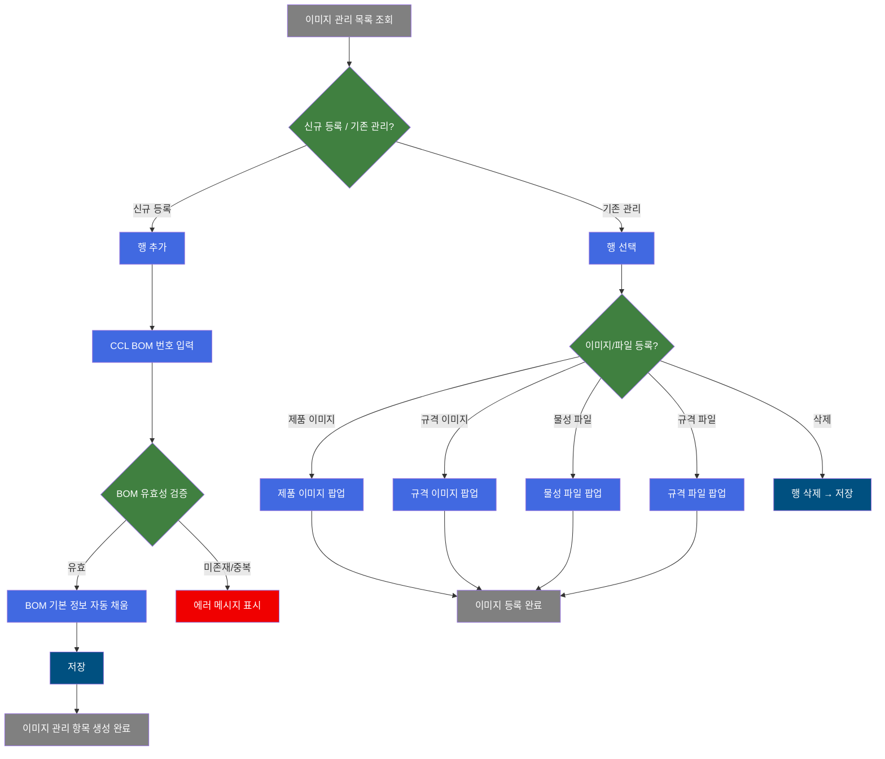
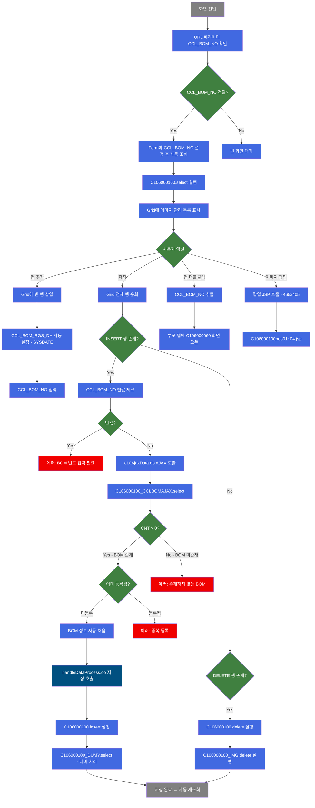
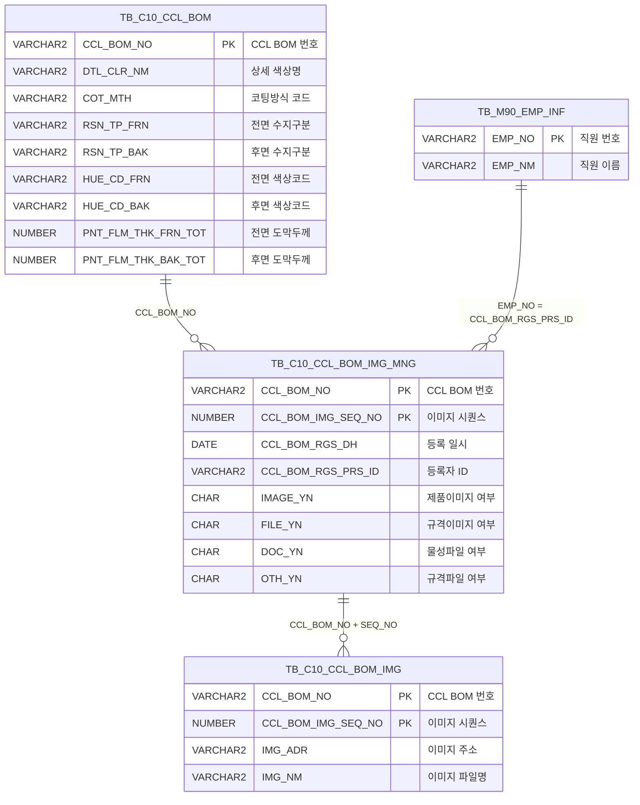

<h1 style="font-size: 40px; text-align: center; font-weight:
   bold; margin: 30px 0;">
  C106000100 레거시 시스템 분석 종합 보고서
</h1>


# 1. 시스템 개요
- **서비스 ID**: C106000100
- **업무명**: CCL BOM 이미지 관리
- **분석 일시**: 2026-03-17 10:50 (KST)
- **분석 시간**: 약 5분
- **전체 Activity 수**: 5개 (Built-in 5개, Custom 0개)
- **분석자**: Claude Opus 4.6
- **분석 도구**: /analyze-service C106000100
- **문서 버전**: 1.0

# 📊 비즈니스 프로세스 분석

## 시스템 목적

CCL(Color Coated Line) 공정의 BOM(Bill of Materials) 이미지를 관리하는 화면이다. CCL BOM 번호별로 제품 이미지, 규격 이미지, 물성 관련 파일, 규격 관련 파일의 등록 여부를 관리하며, 각 유형별 이미지/파일을 팝업 화면을 통해 등록·조회할 수 있다.

사용자는 CCL BOM 번호 또는 등록자명으로 기등록된 이미지 관리 정보를 검색하고, 신규 BOM 이미지 항목을 추가하거나 기존 항목을 삭제할 수 있다. 신규 행 추가 시에는 CCL BOM 번호의 유효성(존재 여부, 중복 여부)을 Ajax로 검증한 후 BOM 기본 정보(색상명, 코팅방식, 수지구분, 도막두께 등)를 자동으로 채워주는 기능을 제공한다.

이 화면은 CCL BOM 마스터(TB_C10_CCL_BOM)와 이미지 관리 테이블(TB_C10_CCL_BOM_IMG_MNG), 이미지 실제 데이터 테이블(TB_C10_CCL_BOM_IMG)을 연계하여 CCL 도장 공정의 BOM별 이미지·문서 관리 체계를 지원한다.

## 핵심 워크플로우 다이어그램



### 상세 워크플로우 다이어그램



## 주요 유즈케이스

### UC-01: CCL BOM 이미지 관리 정보 조회

- **Actor**: CCL 공정 오퍼레이터 / 관리자
- **목적**: 등록된 CCL BOM 이미지 관리 정보를 검색하여 각 BOM별 이미지/파일 등록 현황을 확인

- **전제조건**:
  - 사용자가 시스템에 로그인되어 있음
  - CCL BOM 마스터 데이터가 등록되어 있음

- **주요 흐름**:
  1. 사용자가 CCL BOM 번호 또는 등록자 이름을 Form에 입력
  2. 조회 버튼 클릭
  3. C106000100.select 쿼리 실행 — TB_C10_CCL_BOM_IMG_MNG 기준, TB_C10_CCL_BOM LEFT JOIN, VI_M00_CODE_ACCESS로 코드명 변환
  4. Grid에 이미지 관리 목록 표시 (BOM번호, 색상명, 코팅방식, 수지구분, 도막두께, 이미지 등록 여부 등)

- **대체 흐름**:
  - URL 파라미터로 CCL_BOM_NO가 전달된 경우: Form에 자동 설정 후 즉시 조회 실행 (firstFind)
  - 조회 결과 없음: 빈 Grid 표시

- **후행조건**:
  - Grid에 검색 결과가 표시됨
  - 사용자가 행 추가/삭제/이미지 팝업 등 후속 작업 가능 상태

### UC-02: 신규 CCL BOM 이미지 관리 항목 등록

- **Actor**: CCL 공정 오퍼레이터
- **목적**: 새로운 CCL BOM에 대한 이미지 관리 항목을 생성하여 향후 이미지/파일 등록의 기반을 마련

- **전제조건**:
  - CCL BOM 마스터(TB_C10_CCL_BOM)에 해당 BOM 번호가 등록되어 있음
  - 해당 BOM 번호로 이미지 관리 항목이 아직 등록되지 않았음

- **주요 흐름**:
  1. 메뉴에서 "행추가" 클릭 → Grid에 빈 행 삽입, 등록일(CCL_BOM_RGS_DH)에 현재 날짜 자동 설정
  2. CCL_BOM_NO 컬럼에 BOM 번호 입력
  3. 저장 버튼 클릭
  4. Ajax로 CCL BOM 유효성 검증 (c10AjaxData.do → C106000100_CCLBOMAJAX.select):
     - BOM 존재 여부 확인 (CNT 값 체크)
     - 중복 등록 여부 확인
  5. 검증 통과 시 BOM 기본 정보 자동 채움 (색상명, 코팅방식, 수지구분, 색상코드, 도막두께, 등록자 정보)
  6. 저장 확인 다이얼로그 표시 후 C106000100.insert 실행
  7. CCL_BOM_IMG_SEQ_NO는 서브쿼리로 자동 생성 (MAX+1)
  8. 저장 완료 후 자동 재조회 (onAfterUpdateFinishEvent → find)

- **대체 흐름**:
  - CCL_BOM_NO 빈값: "BOM번호를 입력해 주세요" 에러 메시지
  - BOM 미존재: "존재하지 않는 BOM입니다" 에러 메시지
  - 중복 등록: "이미 등록된 BOM입니다" 에러 메시지

- **후행조건**:
  - TB_C10_CCL_BOM_IMG_MNG에 새 레코드 생성 (IMAGE_YN='N', FILE_YN='N', DOC_YN='N')
  - Grid에 갱신된 목록 표시

### UC-03: 이미지/파일 등록 (팝업)

- **Actor**: CCL 공정 오퍼레이터
- **목적**: 특정 CCL BOM에 대해 제품 이미지, 규격 이미지, 물성 파일, 규격 파일을 등록

- **전제조건**:
  - 이미지 관리 항목이 이미 등록되어 있음 (UC-02 완료 상태)
  - Grid에서 대상 행이 선택되어 있음

- **주요 흐름**:
  1. Grid의 제품/규격1/물성/규격2 컬럼 중 해당 항목 클릭 또는 함수 호출
  2. 유형별 팝업 호출:
     - 제품 이미지: C106000100pop01.jsp (PRD_SPC_TP=1)
     - 규격 이미지: C106000100pop02.jsp (PRD_SPC_TP=2)
     - 물성 파일: C106000100pop03.jsp (PRD_SPC_TP=3)
     - 규격 파일: C106000100pop04.jsp (PRD_SPC_TP=4)
  3. 팝업 창(465×405)에서 파일 업로드 및 등록 처리
  4. 팝업 닫기 후 메인 화면 Grid 갱신

- **대체 흐름**:
  - 행 미선택 시: 알림 메시지 표시
  - 파일 업로드 실패: 팝업 내 에러 메시지 표시

- **후행조건**:
  - TB_C10_CCL_BOM_IMG에 이미지/파일 데이터 저장
  - TB_C10_CCL_BOM_IMG_MNG의 IMAGE_YN/FILE_YN/DOC_YN/OTH_YN 값 갱신

### UC-04: 이미지 관리 항목 삭제

- **Actor**: CCL 공정 오퍼레이터
- **목적**: 불필요한 CCL BOM 이미지 관리 항목 및 연관 이미지 데이터를 삭제

- **전제조건**:
  - Grid에서 삭제 대상 행이 선택되어 있음

- **주요 흐름**:
  1. Grid에서 삭제 대상 행 선택
  2. 메뉴에서 "삭제" 클릭 → 선택 행에 삭제 마킹
  3. 저장 버튼 클릭
  4. C106000100.delete 실행 → TB_C10_CCL_BOM_IMG_MNG에서 레코드 삭제
  5. C106000100_IMG.delete 실행 → TB_C10_CCL_BOM_IMG에서 연관 이미지 데이터 삭제
  6. 저장 완료 후 자동 재조회

- **대체 흐름**:
  - 행 미선택 시: "삭제할 행을 선택해 주세요" 알림 메시지

- **후행조건**:
  - TB_C10_CCL_BOM_IMG_MNG 및 TB_C10_CCL_BOM_IMG에서 해당 레코드 삭제됨

### UC-05: CCL BOM 상세 화면 이동

- **Actor**: CCL 공정 오퍼레이터
- **목적**: 이미지 관리 목록에서 특정 BOM의 상세 정보(C106000060 화면)를 빠르게 확인

- **전제조건**:
  - Grid에 조회 결과가 표시되어 있음

- **주요 흐름**:
  1. Grid 행 더블클릭
  2. 선택 행의 CCL_BOM_NO 추출
  3. 부모 탭에서 C106000060 화면 오픈 (CCL BOM 상세)

- **후행조건**:
  - C106000060 화면이 해당 CCL_BOM_NO로 조회된 상태로 표시됨

---

## 비즈니스 로직 상세

### 1. CCL BOM 번호 유효성 검증 및 자동 데이터 채움

- **목적**: 신규 이미지 관리 항목 등록 시, 입력된 CCL BOM 번호의 유효성을 검증하고 BOM 기본 정보를 자동으로 채워 사용자 입력 오류를 방지

- **처리 케이스**:

  **[케이스 1: BOM 존재 및 미등록]**
  ```
    조건: C106000100_CCLBOMAJAX.select 결과 CNT > 0 이고 이미지 관리 테이블에 미등록
    처리:
      1. TB_C10_CCL_BOM에서 CCL_BOM_NO로 BOM 기본 정보 조회
      2. VI_M00_CODE_ACCESS에서 COT_MTH(코팅방식), RSN_TP_FRN(전면수지), RSN_TP_BAK(후면수지) 코드명 조회
      3. UNION ALL로 TB_C10_CCL_BOM_IMG_MNG의 이미지 건수(CNT) 병합
      4. MAX 집계로 단일 행 반환
      5. Grid 컬럼에 자동 채움: DTL_CLR_NM, COT_MTH, RSN_TP_FRN, RSN_TP_BAK, HUE_CD_FRN, HUE_CD_BAK, PNT_FLM_THK_FRN_TOT, PNT_FLM_THK_BAK_TOT, CCL_BOM_RGS_PRS_ID, CCL_BOM_RGS_PRS_NM
  ```

  **[케이스 2: BOM 미존재]**
  ```
    조건: CCL_BOM_NO가 TB_C10_CCL_BOM에 없음 (CNT = 0 또는 NULL)
    처리:
      1. 에러 메시지 표시
      2. 저장 프로세스 중단
  ```

  **[케이스 3: 이미 등록된 BOM]**
  ```
    조건: CCL_BOM_NO가 TB_C10_CCL_BOM_IMG_MNG에 이미 존재
    처리:
      1. 중복 에러 메시지 표시
      2. 저장 프로세스 중단
  ```

### 2. 이미지 시퀀스 번호 자동 생성

- **목적**: CCL BOM별 이미지 관리 항목의 순서를 자동으로 부여
- **처리 케이스**:

  **[케이스 1: 기존 항목 존재]**
  ```
    조건: 해당 CCL_BOM_NO로 TB_C10_CCL_BOM_IMG_MNG에 기존 레코드 존재
    처리:
      1. 서브쿼리로 해당 CCL_BOM_NO의 MAX(CCL_BOM_IMG_SEQ_NO) 조회
      2. NVL(MAX, 0) + 1로 다음 시퀀스 번호 생성
  ```

  **[케이스 2: 첫 번째 항목]**
  ```
    조건: 해당 CCL_BOM_NO로 TB_C10_CCL_BOM_IMG_MNG에 레코드 없음
    처리:
      1. NVL(NULL, 0) + 1 = 1로 시퀀스 번호 1 부여
  ```

- **계산 공식**:
  ```
  CCL_BOM_IMG_SEQ_NO = NVL(MAX(CCL_BOM_IMG_SEQ_NO), 0) + 1
  WHERE CCL_BOM_NO = :CCL_BOM_NO
  ```

### 3. 코드값 → 의미명 변환

- **목적**: DB에 저장된 코드값을 사용자가 읽을 수 있는 의미명으로 변환하여 표시
- **처리 케이스**:

  **[케이스 1: 코팅방식 코드 변환]**
  ```
    조건: COT_MTH 코드값이 저장됨
    처리:
      1. VI_M00_CODE_ACCESS에서 GRP_CD = 'C10B0003' 조건으로 조회
      2. CD_V || ':' || CD_V_MEANING 형태로 코드값:의미명 연결 표시
  ```

  **[케이스 2: 수지구분 코드 변환 (전면/후면)]**
  ```
    조건: RSN_TP_FRN, RSN_TP_BAK 코드값이 저장됨
    처리:
      1. VI_M00_CODE_ACCESS에서 GRP_CD = 'C10B0004' 조건으로 조회
      2. CD_V || ':' || CD_V_MEANING 형태로 코드값:의미명 연결 표시
  ```

---

# 💾 데이터 요구사항

## 핵심 테이블

### 1. TB_C10_CCL_BOM_IMG_MNG - CCL BOM 이미지 관리 정보
| 컬럼명 | 타입 | PK | 설명 |
|--------|------|----|------|
| CCL_BOM_NO | VARCHAR2 | ✅ | CCL BOM 번호 |
| CCL_BOM_IMG_SEQ_NO | NUMBER | ✅ | 이미지 시퀀스 번호 |
| CCL_BOM_RGS_DH | DATE | | 등록 일시 |
| CCL_BOM_RGS_PRS_ID | VARCHAR2 | | 등록자 ID |
| IMAGE_YN | CHAR | | 제품 이미지 등록 여부 (Y/N) |
| FILE_YN | CHAR | | 규격 이미지 등록 여부 (Y/N) |
| DOC_YN | CHAR | | 물성 파일 등록 여부 (Y/N) |
| OTH_YN | CHAR | | 규격 파일 등록 여부 (Y/N) |
| INS_DH | DATE | | 등록 일시 (감사) |
| UPD_DH | DATE | | 수정 일시 (감사) |

### 2. TB_C10_CCL_BOM_IMG - CCL BOM 이미지 실데이터
| 컬럼명 | 타입 | PK | 설명 |
|--------|------|----|------|
| CCL_BOM_NO | VARCHAR2 | ✅ | CCL BOM 번호 |
| CCL_BOM_IMG_SEQ_NO | NUMBER | ✅ | 이미지 시퀀스 번호 |
| IMG_ADR | VARCHAR2 | | 이미지 주소 |
| IMG_NM | VARCHAR2 | | 이미지 파일명 |

### 3. TB_C10_CCL_BOM - CCL BOM 마스터 (참조)
| 컬럼명 | 타입 | PK | 설명 |
|--------|------|----|------|
| CCL_BOM_NO | VARCHAR2 | ✅ | CCL BOM 번호 |
| DTL_CLR_NM | VARCHAR2 | | 상세 색상명 |
| COT_MTH | VARCHAR2 | | 코팅방식 코드 |
| RSN_TP_FRN | VARCHAR2 | | 전면 수지구분 코드 |
| RSN_TP_BAK | VARCHAR2 | | 후면 수지구분 코드 |
| HUE_CD_FRN | VARCHAR2 | | 전면 색상코드 |
| HUE_CD_BAK | VARCHAR2 | | 후면 색상코드 |
| PNT_FLM_THK_FRN_TOT | NUMBER | | 전면 총 도막두께 |
| PNT_FLM_THK_BAK_TOT | NUMBER | | 후면 총 도막두께 |

### 4. VI_M00_CODE_ACCESS - 공통 코드 뷰 (참조)
| 컬럼명 | 타입 | PK | 설명 |
|--------|------|----|------|
| GRP_CD | VARCHAR2 | | 그룹 코드 (C10B0003: 코팅방식, C10B0004: 수지구분) |
| CD_V | VARCHAR2 | | 코드값 |
| CD_V_MEANING | VARCHAR2 | | 코드 의미명 |

### 5. TB_M90_EMP_INF - 직원 정보 (참조)
| 컬럼명 | 타입 | PK | 설명 |
|--------|------|----|------|
| EMP_NO | VARCHAR2 | ✅ | 직원 번호 |
| EMP_NM | VARCHAR2 | | 직원 이름 |

## 데이터 플로우

### 1. 조회

```
[이미지 관리 목록 조회]
화면 진입 또는 조회 버튼 클릭
→ C106000100.select
  FROM TB_C10_CCL_BOM_IMG_MNG A
  LEFT JOIN TB_C10_CCL_BOM B ON A.CCL_BOM_NO = B.CCL_BOM_NO(+)
  + 서브쿼리: VI_M00_CODE_ACCESS (GRP_CD='C10B0003' 코팅방식, GRP_CD='C10B0004' 수지구분)
  + 서브쿼리: TB_M90_EMP_INF (등록자명 조회)
  WHERE A.CCL_BOM_NO LIKE '%' || :CCL_BOM_NO || '%'
    AND EXISTS (등록자 이름 LIKE :CCL_BOM_RGS_PRS_ID_NM || '%')
→ Grid에 이미지 관리 목록 표시
```

### 2. CCL BOM 정보 조회 (Ajax 검증용)

```
[CCL BOM 유효성 검증 및 기본 정보 조회]
저장 시 INSERT 행의 CCL_BOM_NO에 대해
→ C106000100_CCLBOMAJAX.select
  UNION ALL 구조:
    1) TB_C10_CCL_BOM에서 기본 정보 (색상명, 코팅방식, 수지구분, 색상코드, 도막두께)
    2) TB_C10_CCL_BOM_IMG_MNG에서 이미지 건수 COUNT
  외부 MAX 집계로 단일 행 반환
  WHERE CCL_BOM_NO = :CCL_BOM_NO
→ CNT > 0이면 BOM 존재, Grid 자동 채움
→ CNT = 0이면 BOM 미존재 에러
```

### 3. 저장 (신규 등록)

```
[이미지 관리 항목 신규 등록]
저장 버튼 클릭 → 유효성 검증 통과 후
→ C106000100.insert
  INTO TB_C10_CCL_BOM_IMG_MNG (CCL_BOM_NO, CCL_BOM_IMG_SEQ_NO, CCL_BOM_RGS_DH, IMAGE_YN, FILE_YN, DOC_YN, ...)
  VALUES (:CCL_BOM_NO, 서브쿼리(MAX+1), SYSDATE, 'N', 'N', 'N', ...)
→ C106000100_DUMY.select (더미 처리 - SELECT 1 FROM DUAL)
→ TB_C10_CCL_BOM_IMG_MNG에 새 레코드 생성
```

### 4. 삭제

```
[이미지 관리 항목 및 연관 이미지 삭제]
삭제 마킹 후 저장 버튼 클릭
→ C106000100.delete
  DELETE FROM TB_C10_CCL_BOM_IMG_MNG
  WHERE CCL_BOM_NO = :CCL_BOM_NO AND CCL_BOM_IMG_SEQ_NO = :CCL_BOM_IMG_SEQ_NO
→ C106000100_IMG.delete
  DELETE FROM TB_C10_CCL_BOM_IMG
  WHERE CCL_BOM_NO = :CCL_BOM_NO AND CCL_BOM_IMG_SEQ_NO = :CCL_BOM_IMG_SEQ_NO
→ 이미지 관리 정보 및 이미지 실데이터 모두 삭제
```

## SQL 일람표

| SQL 이름 | 쿼리 ID | 타입 | 출처 | 테이블 |
|---------|---------|------|------|--------|
| 이미지 관리 목록 조회 | C106000100.select | SELECT | Service | TB_C10_CCL_BOM_IMG_MNG, TB_C10_CCL_BOM |
| CCL BOM 기본 정보 조회 | C106000100_CCLBOMAJAX.select | SELECT | Service | TB_C10_CCL_BOM, TB_C10_CCL_BOM_IMG_MNG |
| 더미 쿼리 | C106000100_DUMY.select | SELECT | Service | DUAL |
| 이미지 데이터 삭제 | C106000100_IMG.delete | DELETE | Service | TB_C10_CCL_BOM_IMG |
| 이미지 관리 항목 등록 | C106000100.insert | INSERT | Service | TB_C10_CCL_BOM_IMG_MNG |
| 이미지 관리 항목 수정 | C106000100.update | UPDATE | Service | EMP |
| 이미지 관리 항목 삭제 | C106000100.delete | DELETE | Service | TB_C10_CCL_BOM_IMG_MNG |

## ER 다이어그램 (핵심 관계)



관계 설명:
- TB_C10_CCL_BOM이 중심 마스터 테이블로, CCL_BOM_NO를 통해 이미지 관리 테이블과 1:N 관계
- TB_C10_CCL_BOM_IMG_MNG와 TB_C10_CCL_BOM_IMG는 복합 PK(CCL_BOM_NO + CCL_BOM_IMG_SEQ_NO) 기반 1:N 관계
- TB_M90_EMP_INF는 등록자 정보 참조용 (EMP_NO = CCL_BOM_RGS_PRS_ID)

---

# 🖥️ 사용자 인터페이스 요구사항

## 화면 레이아웃 상세

### Layout 구조 (initLayout)
```javascript
{
  itemType: "layout",
  dirType: "col",  // 수직 배치
  totalHeight: "586px",
  totalWidth: "981px",
  components: [
    {
      id: "form_area",
      height: "28px",
      component: {
        itemType: "form",
        formId: "C106000100_Form_1"
      }
    },
    {
      id: "menu_area",
      height: "25px",
      component: {
        itemType: "menu",
        menuId: "C106000100_Menu_1"
      }
    },
    {
      id: "grid_area",
      height: "511px",
      component: {
        itemType: "grid",
        gridId: "C106000100_Grid_1"
      }
    },
    {
      id: "statusbar_area",
      height: "19px",
      component: {
        itemType: "messagebox",
        id: "C106000100_messagebox"
      }
    }
  ]
}
```

## 입출력 요소

### Form 컴포넌트

**C106000100_Form_1**
- CCL_BOM_NO: input (75px) - CCL BOM 번호 검색어
- CCL_BOM_RGS_PRS_ID_NM: input (75px) - 등록자 이름 검색어
- find: button - 조회 버튼 → find 이벤트
- save: button - 저장 버튼 → save 이벤트
- winClose: button - 닫기 버튼 → 화면 닫기

### Grid 컴포넌트

**C106000100_Grid_1 (이미지 관리 목록)**
- 편집 가능 여부: 부분 편집 (CCL_BOM_NO만 편집 가능)
- Split: 없음 (split=0)
- 행 수: 22행
- Smart Rendering: 사용
- 다중 선택: 사용
- 컨텍스트 메뉴: 사용 (컬럼이동, 헤더필터, 편집가능, 엑셀내보내기)
- Pageset: 사용
- 주요 컬럼 (21개):

  **편집 가능 컬럼**:
  - CCL_BOM_NO: ed - BOM 번호 (6%, 중앙정렬, 편집가능, 배경색 FFFFC0)

  **BOM 기본 정보**:
  - DTL_CLR_NM: ro - 색상명 (15%, 좌측정렬)
  - COT_MTH: ro - 코팅방식 (10%, 중앙정렬)
  - RSN_TP_FRN: ro - 수지(T/전면) (9%, 좌측정렬)
  - RSN_TP_BAK: ro - 수지(B/후면) (9%, 좌측정렬)
  - HUE_CD_FRN: ro - 색상(T/전면) (5%, 중앙정렬)
  - HUE_CD_BAK: ro - 색상(B/후면) (5%, 중앙정렬)
  - PNT_FLM_THK_FRN_TOT: ro - 도막(T/전면) (5%, 중앙정렬)
  - PNT_FLM_THK_BAK_TOT: ro - 도막(B/후면) (5%, 중앙정렬)

  **등록 정보**:
  - CCL_BOM_RGS_PRS_NM: ro - 등록자명 (5%, 중앙정렬)
  - CCL_BOM_RGS_DH: ro - 등록일 (8%, 중앙정렬)

  **이미지/파일 등록 여부** (배경색 FFFFC0):
  - IMAGE_YN: ro - 제품 이미지 여부 (*, 중앙정렬)
  - FILE_YN: ro - 규격1 이미지 여부 (*, 중앙정렬)
  - DOC_YN: ro - 물성 파일 여부 (*, 중앙정렬)
  - OTH_YN: ro - 규격2 파일 여부 (*, 중앙정렬)

  **숨김 컬럼**:
  - CCL_BOM_RGS_PRS_ID: ro - 등록자 ID (숨김)
  - USER_NO: ro - 사용자 번호 (숨김)
  - CCL_BOM_IMG_SEQ_NO: ro - 이미지 시퀀스 번호 (숨김)
  - IMG_ADR: ro - 이미지 주소 (숨김)
  - IMG_NM: ro - 이미지 파일명 (숨김)
  - CNT: ro - 이미지 건수 (숨김)

### Menu 컴포넌트

**C106000100_Menu_1**
- refresh: "새로고침" (refresh.gif) → Grid 클리어 후 재조회
- add: "행추가" (new.gif) → Grid에 빈 행 삽입
- remove: "삭제" (remove.gif) → 선택 행 삭제 마킹

## 화면 동작 흐름

### 1. 화면 초기 로딩
```
1. 화면 진입
2. Form/Grid/Menu 초기화
3. URL 파라미터 확인 (firstFind 이벤트)
   - CCL_BOM_NO 파라미터 존재 시:
     a. Form의 CCL_BOM_NO에 값 설정
     b. find() 호출하여 자동 조회
     c. progressOff 처리
   - 파라미터 없으면: 빈 화면 대기
4. Grid XLE 이벤트: setReadonly 호출 → 기존 행의 CCL_BOM_NO 읽기전용 설정
5. 상태바(messagebox) 초기화
```

### 2. 이미지 관리 목록 조회
```
1. 사용자가 CCL BOM 번호 또는 등록자명 입력
2. 조회 버튼(find) 클릭
3. Form 파라미터 구성 + USER_NO 추가
4. gridC10Data.do URL 생성 (서비스: C106000100-service)
5. Grid에 데이터 로드 (C106000100.select 실행)
6. Grid 표시 후 setReadonly 호출 → CCL_BOM_NO 컬럼 읽기전용
```

### 3. 신규 행 추가 및 저장
```
1. 메뉴 "행추가" 클릭
2. Grid에 빈 행 삽입 (INSERT 상태)
3. setAutoData 호출 → CCL_BOM_RGS_DH에 현재 날짜 자동 설정
4. 사용자가 CCL_BOM_NO 입력
5. 저장 버튼 클릭
6. Grid 전체 행 순회:
   - INSERT 행: CCL_BOM_NO 빈값 체크 → Ajax 유효성 검증 → BOM 정보 자동 채움
   - UPDATE/DELETE 행: 직접 저장 처리
7. 저장 확인 다이얼로그 표시
8. handleDataProcess.do로 저장 요청
9. onAfterUpdateFinishEvent → find() 자동 재조회
```

### 4. 이미지/파일 등록 팝업
```
1. Grid에서 대상 행 선택
2. 이미지 유형별 함수 호출:
   - doImgPopUp(): C106000100pop01.jsp (PRD_SPC_TP=1, 제품이미지)
   - doImgPopUp1(): C106000100pop02.jsp (PRD_SPC_TP=2, 규격이미지)
   - doImgPopUp2(): C106000100pop03.jsp (PRD_SPC_TP=3, 물성파일)
   - doImgPopUp3(): C106000100pop04.jsp (PRD_SPC_TP=4, 규격파일)
3. 팝업 창 오픈 (465×405, 모달)
4. 파일 업로드 및 등록 처리
5. 팝업 닫기
```

### 5. 이미지 직접 조회
```
1. parentViewImg 함수 호출
2. C106000080pop02.jsp를 새 창(window.open)으로 열기
3. img_rgs_flags=04 파라미터로 이미지 조회
```

## JavaScript 모듈

**C106000100.jsp (메인 화면 스크립트 - 인라인)**
- find(): 이미지 관리 목록 조회 (Form 파라미터 + USER_NO → Grid 로드)
- save(): Grid 저장 처리 (INSERT 행 유효성 검증 → Ajax → 자동 채움 → 저장)
- doImgPopUp(): 제품 이미지 팝업 (C106000100pop01.jsp)
- doImgPopUp1(): 규격 이미지 팝업 (C106000100pop02.jsp)
- doImgPopUp2(): 물성 파일 팝업 (C106000100pop03.jsp)
- doImgPopUp3(): 규격 파일 팝업 (C106000100pop04.jsp)
- parentViewImg(): 이미지 조회 (C106000080pop02.jsp)
- setAutoData(idx): 행 추가 시 등록일 자동 설정
- setReadonly(rn): Grid 행의 CCL_BOM_NO 읽기전용 설정
- firstFind(rn): URL 파라미터 기반 초기 조회
- onAfterUpdateFinishEvent(): 저장 완료 후 자동 재조회
- doOnRowDblClicked(rId, cInd): 행 더블클릭 → C106000060 화면 이동
- onGridContextMenuClick(id): 컨텍스트 메뉴 처리 (컬럼이동, 헤더필터, 편집가능, 엑셀)
- copy(): 클립보드 복사
- undo(): 실행 취소
- redo(): 다시 실행

## 주요 이벤트 핸들러

**find (조회 버튼 클릭)**
- 이벤트 타입: Form Button Click
- 처리 내용:
  1. Form 파라미터(CCL_BOM_NO, CCL_BOM_RGS_PRS_ID_NM) 추출
  2. USER_NO 파라미터 추가
  3. gridC10Data.do URL 생성 (서비스: C106000100-service)
  4. Grid에 데이터 로드

**save (저장 버튼 클릭)**
- 이벤트 타입: Form Button Click
- 처리 내용:
  1. Grid 전체 행 순회
  2. INSERT 행: CCL_BOM_NO 빈값 체크
  3. c10AjaxData.do로 BOM 유효성 검증 (동기 Ajax)
  4. 응답값으로 BOM 존재 여부, 중복 여부 판단
  5. 검증 통과 시 Grid 컬럼 자동 채움 (10개 컬럼)
  6. 저장 확인 다이얼로그 → handleDataProcess.do 호출

**doOnRowDblClicked (행 더블클릭)**
- 이벤트 타입: Grid Row Double Click
- 처리 내용:
  1. 선택 행의 CCL_BOM_NO 추출
  2. 부모 탭(window.parent.mainTabbar)에서 C106000060 화면 오픈
  3. CCL_BOM_NO 파라미터 전달

**onGridContextMenuClick (컨텍스트 메뉴)**
- 이벤트 타입: Grid Context Menu Click
- 처리 내용:
  1. move_grid: 컬럼 이동 모드
  2. filter_grid: 헤더 필터 토글
  3. editable_grid: 편집 가능 모드 토글
  4. excel_grid: 엑셀 내보내기

---

# 📌 특이사항 및 주의사항

## 1. 더미 쿼리를 통한 이미지 처리 트릭
- **C106000100_DUMY.select**: `SELECT 1 FROM DUAL` — 실제 데이터 조회가 아닌 더미 쿼리가 GridSave의 `insert-sql`로 사용됨. CCLBOM이미지처리 Activity에서 이 더미 쿼리를 insert-sql로, C106000100_IMG.delete를 delete-sql로 설정하여 실질적으로는 이미지 삭제만 수행하는 비표준 패턴이다. insert 시에는 아무 동작도 하지 않게 하려는 의도로 보인다.

## 2. C106000100.update의 이상 대상 테이블
- **update 쿼리가 EMP 테이블을 대상으로 함**: CCL BOM 이미지 관리와 무관한 EMP(직원) 테이블에 대한 UPDATE 쿼리가 정의되어 있다. 실제 운영 환경에서는 사용되지 않는 것으로 추정되며, 개발/테스트 과정에서의 잔재일 가능성이 높다. 향후 정리 대상이다.

## 3. 저장 프로세스의 2단계 Activity 체인
- **저장 → CCLBOM이미지처리**: 저장 Activity가 성공하면 end가 아닌 CCLBOM이미지처리 Activity로 전이(transition)된다. 이 구조는 Grid 데이터 저장 후 이미지 관련 후처리(이미지 삭제)를 연쇄적으로 수행하는 패턴이다. 2개의 GridSave Activity가 체인으로 연결되어 별도 테이블을 각각 처리한다.

## 4. Ajax 기반 동기 유효성 검증
- **저장 시 INSERT 행마다 동기 Ajax 호출**: 여러 INSERT 행이 있을 경우 각 행에 대해 순차적으로 c10AjaxData.do를 호출하므로 성능 이슈가 발생할 수 있다. 대량 행 추가 시 응답 지연이 예상된다.

## 5. CCL_BOM_NO 공백 처리
- **CCLBOMAJAX 쿼리에서 공백 제거**: TB_C10_CCL_BOM_IMG_MNG 조회 시 `REPLACE(CCL_BOM_NO, ' ', '')`로 공백을 제거하여 비교한다. 이는 BOM 번호에 공백이 포함될 수 있는 데이터 품질 이슈를 우회하는 패턴이다.

## 6. 팝업 화면 PRD_SPC_TP 코드 체계
- **4종의 팝업이 PRD_SPC_TP 파라미터로 구분됨**: 제품이미지(1), 규격이미지(2), 물성(3), 규격_파일(4)의 4개 유형을 코드로 구분하여 동일 구조의 팝업(pop01~pop04)이 각각 별도 JSP로 존재한다. 유형 확장 시 별도 JSP 추가가 필요한 구조이다.

---

# 📚 참고 문서

- **Service XML**: `src/service/C106000100-service.xml`
- **Query SQL**: `src/query/C106000100-query.glue_sql`
- **JSP**: `WebContents/C106000100.jsp`
- **팝업 JSP**:
  - `WebContents/C106000100pop01.jsp` (제품 이미지)
  - `WebContents/C106000100pop02.jsp` (규격 이미지)
  - `WebContents/C106000100pop03.jsp` (물성 파일)
  - `WebContents/C106000100pop04.jsp` (규격 파일)
- **Form XML**: `WebContents/header/kr/C106000100/C106000100_Form_1.xml`
- **Grid XML**: `WebContents/header/kr/C106000100/C106000100_Grid_1.xml`
- **Menu XML**: `WebContents/header/kr/C106000100/C106000100_Menu_1.xml`
