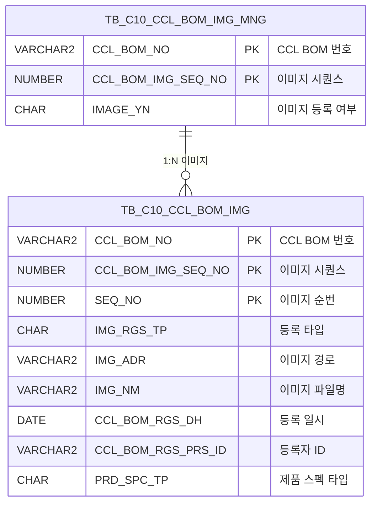

<h1 style="font-size: 40px; text-align: center; font-weight:
   bold; margin: 30px 0;">
  C106000100pop01 레거시 시스템 분석 종합 보고서
</h1>


# 1. 시스템 개요
- **서비스 ID**: C106000100pop01
- **업무명**: CCLBOM 이미지 등록/조회 팝업
- **분석 일시**: 2026-03-17 10:51 KST
- **전체 Activity 수**: 2 (Built-in 2개)
- **분석자**: Claude Opus 4.6 / Sonnet
- **분석 도구**: /analyze-service C106000100pop01
- **문서 버전**: 1.0

# 📊 비즈니스 프로세스 분석

## 시스템 목적

CCL(Color Coating Line) 공정에서 사용하는 BOM(Bill of Materials) 이미지를 관리하기 위한 팝업 화면이다. CCL BOM에 연결된 프린트 롤 이미지 파일을 업로드, 조회, 삭제하는 기능을 제공한다.

이 화면은 부모 화면(C106000100)에서 팝업으로 호출되며, CCL_BOM_NO와 CCL_BOM_IMG_SEQ_NO를 파라미터로 전달받아 해당 BOM의 이미지 목록을 조회한다. dhtmlXVault 컴포넌트를 통해 이미지 파일(jpg, gif)을 업로드하고, 업로드된 이미지를 그리드에서 확인하거나 삭제할 수 있다. 이미지 선택 시 부모 페이지에 이미지 정보를 전달하여 미리보기 기능을 지원한다.

## 주요 유즈케이스

### UC-01: CCL BOM 이미지 조회
- **Actor**: CCL 공정 오퍼레이터
- **목적**: 특정 CCL BOM에 등록된 프린트 롤 이미지 목록을 조회하여 이미지 등록 현황 확인

- **전제조건**:
  - 부모 화면(C106000100)에서 팝업이 호출됨
  - CCL_BOM_NO, CCL_BOM_IMG_SEQ_NO 파라미터가 전달됨
  - PRD_SPC_TP = '1' (제품 스펙 타입) 조건의 이미지가 존재함

- **주요 흐름**:
  1. 팝업 오픈 시 onVaultLoad 함수로 dhtmlXVault 컴포넌트 초기화
  2. 전달받은 CCL_BOM_NO, CCL_BOM_IMG_SEQ_NO로 onLoadGrid 호출
  3. C106000100pop01_Grid_1.select 쿼리 실행 (TB_C10_CCL_BOM_IMG 테이블 조회)
  4. 그리드에 CCL BOM, 순번, 구분(PC/모바일), 이미지명, 등록일자, 등록자 표시

- **대체 흐름**:
  - 등록된 이미지가 없는 경우: 빈 그리드 표시
  - PRD_SPC_TP가 '1'이 아닌 이미지는 조회 대상에서 제외

- **후행조건**:
  - 이미지 목록이 그리드에 표시됨
  - 이미지 링크 클릭 또는 삭제 작업 수행 가능

### UC-02: 이미지 파일 업로드
- **Actor**: CCL 공정 오퍼레이터
- **목적**: 프린트 롤 이미지를 시스템에 업로드하여 CCL BOM과 연결

- **전제조건**:
  - 팝업 화면이 열려 있음
  - 업로드할 이미지 파일이 jpg 또는 gif 형식임

- **주요 흐름**:
  1. dhtmlXVault 영역에 이미지 파일 드래그앤드롭 또는 파일 선택
  2. 파일 확장자 검증 (jpg, gif만 허용)
  3. 폼 필드 설정 (IMG_RGS_TP, IMG_RGS_FLAG=04, IMG_RGS_FLAG_ID=CCL_BOM_NO, IMG_RGS_FLAG_ID2=CCL_BOM_IMG_SEQ_NO, PRD_SPC_TP)
  4. `_uploadHandler3.jsp`로 파일 업로드 처리
  5. 서버에서 C106000100pop01.insert 쿼리로 TB_C10_CCL_BOM_IMG에 INSERT (SEQ_NO는 MAX+1 자동 채번)
  6. 업로드 완료 후 onLoadGrid 호출로 그리드 자동 재조회

- **대체 흐름**:
  - 허용되지 않는 확장자: 업로드 거부 메시지 표시
  - 업로드 실패: 에러 메시지 표시

- **후행조건**:
  - TB_C10_CCL_BOM_IMG에 새 레코드 삽입됨
  - 그리드에 업로드된 이미지 정보 표시됨

### UC-03: 이미지 삭제
- **Actor**: CCL 공정 오퍼레이터
- **목적**: 잘못 등록되거나 불필요한 이미지를 삭제

- **전제조건**:
  - 그리드에 삭제 대상 이미지가 표시되어 있음

- **주요 흐름**:
  1. 그리드의 삭제 컬럼 클릭
  2. 삭제 확인 다이얼로그 표시
  3. 확인 시 `_fileDeleteHandler3.jsp`로 Ajax 호출 (IMG_RGS_FLAG=04, IMG_RGS_FLAG_ID, IMG_RGS_FLAG_ID2, SEQ, PRD_SPC_TP, FILE_NAME 전달)
  4. 서버에서 C106000100pop01.delete 쿼리로 TB_C10_CCL_BOM_IMG에서 DELETE
  5. C106000100pop01.update 쿼리로 TB_C10_CCL_BOM_IMG_MNG의 IMAGE_YN 갱신 (이미지 존재 시 'Y', 없으면 'N')
  6. 삭제 완료 후 onLoadGrid 호출로 그리드 재조회

- **대체 흐름**:
  - 삭제 취소: 다이얼로그에서 취소 선택 시 작업 중단

- **후행조건**:
  - TB_C10_CCL_BOM_IMG에서 해당 레코드 삭제됨
  - TB_C10_CCL_BOM_IMG_MNG의 IMAGE_YN 플래그 갱신됨
  - 그리드에서 삭제된 이미지 제거됨

### UC-04: 이미지 미리보기 (부모 페이지 전달)
- **Actor**: CCL 공정 오퍼레이터
- **목적**: 등록된 이미지를 선택하여 부모 화면에서 미리보기

- **전제조건**:
  - 그리드에 이미지가 표시되어 있음
  - 부모 페이지에 parentViewImg 함수가 정의되어 있음

- **주요 흐름**:
  1. 그리드의 이미지 컬럼(ahref_idx 타입) 링크 클릭
  2. Grid_doLink 함수 호출
  3. 그리드에서 CHK_IMG_NM 값 추출
  4. parent.parentViewImg 호출로 부모 페이지에 이미지 정보 전달

- **대체 흐름**:
  - 부모 페이지가 닫힌 경우: JavaScript 에러 발생 가능

- **후행조건**:
  - 부모 페이지에서 선택된 이미지 표시됨

---
## 비즈니스 로직 상세

### 1. 이미지 등록 타입 분류 (DECODE)

- **목적**: 이미지 등록 타입 코드(IMG_RGS_TP)를 사용자 친화적 명칭으로 변환

- **처리 케이스**:

  **[케이스 1: 모바일 등록]**
  ```
    조건: IMG_RGS_TP = '2'
    처리: '모바일'로 표시
  ```

  **[케이스 2: PC 등록]**
  ```
    조건: IMG_RGS_TP ≠ '2' (기본값)
    처리: 'PC'로 표시
  ```

### 2. 이미지 경로 변환

- **목적**: 서버 저장 경로를 웹 접근 가능한 상대 경로로 변환

- **처리 케이스**:

  **[케이스 1: 경로 변환]**
  ```
    조건: IMG_ADR에 'IMG_UPLOAD' 문자열 포함
    처리:
      1. IMG_ADR에서 'IMG_UPLOAD' 위치부터 끝까지 추출 (SUBSTR + INSTR)
      2. 백슬래시(\)를 슬래시(/)로 변환 (REPLACE)
      3. 앞에 './' 접두사, 뒤에 '/' 접미사 추가
    결과: CHK_IMG_ADR 컬럼으로 출력
  ```

### 3. 이미지 시퀀스 자동 채번

- **목적**: 동일 CCL BOM의 이미지 순번을 자동으로 증가시켜 중복 없이 관리

- **처리 케이스**:

  **[케이스 1: 신규 이미지 등록]**
  ```
    조건: INSERT 시 SEQ_NO 값 결정
    처리:
      1. TB_C10_CCL_BOM_IMG에서 동일 CCL_BOM_NO, CCL_BOM_IMG_SEQ_NO의 MAX(SEQ_NO) 조회
      2. NVL 처리 (NULL이면 0)
      3. +1 하여 새 SEQ_NO 결정
    공식: SEQ_NO = NVL(MAX(SEQ_NO), 0) + 1
  ```

### 4. 이미지 등록여부 플래그 자동 갱신

- **목적**: 이미지 삭제/업로드 후 관리 테이블(TB_C10_CCL_BOM_IMG_MNG)의 IMAGE_YN 플래그를 자동으로 갱신

- **처리 케이스**:

  **[케이스 1: 이미지 존재]**
  ```
    조건: TB_C10_CCL_BOM_IMG에서 해당 BOM의 이미지 COUNT > 0
    처리: IMAGE_YN = 'Y'
  ```

  **[케이스 2: 이미지 미존재]**
  ```
    조건: TB_C10_CCL_BOM_IMG에서 해당 BOM의 이미지 COUNT = 0
    처리: IMAGE_YN = 'N'
  ```

---

# 💾 데이터 요구사항

## 핵심 테이블

### 1. TB_C10_CCL_BOM_IMG - (CCL BOM 이미지 관리)
| 컬럼명 | 타입 | PK | 설명 |
|--------|------|----|-----|
| CCL_BOM_NO | VARCHAR2 | ✅ | CCL BOM 번호 |
| CCL_BOM_IMG_SEQ_NO | NUMBER | ✅ | CCL BOM 이미지 시퀀스 번호 |
| SEQ_NO | NUMBER | ✅ | 이미지 순번 |
| IMG_RGS_TP | CHAR | | 이미지 등록 타입 ('2'=모바일, 기타=PC) |
| IMG_ADR | VARCHAR2 | | 이미지 저장 경로 (서버 물리 경로) |
| IMG_NM | VARCHAR2 | | 이미지 파일명 |
| CCL_BOM_RGS_DH | DATE | | 등록 일시 |
| CCL_BOM_RGS_PRS_ID | VARCHAR2 | | 등록자 ID |
| PRD_SPC_TP | CHAR | | 제품 스펙 타입 (조회 시 '1' 조건) |
| CREATED_OBJECT_TYPE | CHAR | | 생성 오브젝트 타입 |
| CREATED_OBJECT_ID | VARCHAR2 | | 생성자 ID |
| CREATED_PROGRAM_ID | VARCHAR2 | | 생성 프로그램 ID |
| CREATION_TIMESTAMP | TIMESTAMP | | 생성 타임스탬프 |
| LAST_UPDATED_OBJECT_TYPE | CHAR | | 최종수정 오브젝트 타입 |
| LAST_UPDATED_OBJECT_ID | VARCHAR2 | | 최종수정자 ID |
| LAST_UPDATE_PROGRAM_ID | VARCHAR2 | | 최종수정 프로그램 ID |
| LAST_UPDATE_TIMESTAMP | TIMESTAMP | | 최종수정 타임스탬프 |

### 2. TB_C10_CCL_BOM_IMG_MNG - (CCL BOM 이미지 관리 플래그)
| 컬럼명 | 타입 | PK | 설명 |
|--------|------|----|-----|
| CCL_BOM_NO | VARCHAR2 | ✅ | CCL BOM 번호 |
| CCL_BOM_IMG_SEQ_NO | NUMBER | ✅ | CCL BOM 이미지 시퀀스 번호 |
| IMAGE_YN | CHAR | | 이미지 등록 여부 ('Y'/'N') |
| LAST_UPDATED_OBJECT_TYPE | CHAR | | 최종수정 오브젝트 타입 |
| LAST_UPDATED_OBJECT_ID | VARCHAR2 | | 최종수정자 ID |
| LAST_UPDATE_PROGRAM_ID | VARCHAR2 | | 최종수정 프로그램 ID |
| LAST_UPDATE_TIMESTAMP | TIMESTAMP | | 최종수정 타임스탬프 |

## 데이터 플로우

### 1. 조회
```
[이미지 목록 조회]
팝업 오픈 / onLoadGrid 호출
→ C106000100pop01_Grid_1.select
  FROM TB_C10_CCL_BOM_IMG
  WHERE CCL_BOM_NO = :CCL_BOM_NO
    AND CCL_BOM_IMG_SEQ_NO = :CCL_BOM_IMG_SEQ_NO
    AND PRD_SPC_TP = '1'
  ORDER BY CCL_BOM_NO, CCL_BOM_IMG_SEQ_NO, SEQ_NO
→ Grid에 이미지 목록 표시 (DECODE로 등록타입 변환, 경로 변환 포함)
```

### 2. 업로드
```
[이미지 파일 업로드]
dhtmlXVault에서 파일 선택/드래그
→ _uploadHandler3.jsp 호출 (파일 서버 저장)
→ C106000100pop01.insert
  INTO TB_C10_CCL_BOM_IMG
  VALUES (CCL_BOM_NO, CCL_BOM_IMG_SEQ_NO, NVL(MAX(SEQ_NO),0)+1, ...)
→ onLoadGrid로 그리드 재조회
```

### 3. 삭제
```
[이미지 삭제]
그리드 삭제 버튼 클릭 → 확인 다이얼로그
→ _fileDeleteHandler3.jsp 호출
→ C106000100pop01.delete
  DELETE TB_C10_CCL_BOM_IMG
  WHERE CCL_BOM_NO = :IMG_RGS_FLAG_ID
    AND CCL_BOM_IMG_SEQ_NO = :IMG_RGS_FLAG_ID2
    AND SEQ_NO = :SEQ
→ C106000100pop01.update
  UPDATE TB_C10_CCL_BOM_IMG_MNG
  SET IMAGE_YN = DECODE(이미지 COUNT, 0, 'N', 'Y')
  WHERE CCL_BOM_NO = :IMG_RGS_FLAG_ID
    AND CCL_BOM_IMG_SEQ_NO = :IMG_RGS_FLAG_ID2
→ onLoadGrid로 그리드 재조회
```

## SQL 일람표
| SQL 이름 | 쿼리 ID | 타입 | 출처 | 테이블 |
|---------|---------|-----|-------|-------|
| 롤 이미지 조회 | C106000100pop01_Grid_1.select | SELECT | Service | TB_C10_CCL_BOM_IMG |
| CCLBOM 이미지 업로드 | C106000100pop01.insert | INSERT | JSP Handler | TB_C10_CCL_BOM_IMG |
| 프린트 롤 이미지 삭제 | C106000100pop01.delete | DELETE | JSP Handler | TB_C10_CCL_BOM_IMG |
| 이미지 등록여부 YN 갱신 | C106000100pop01.update | UPDATE | JSP Handler | TB_C10_CCL_BOM_IMG_MNG |

## ER 다이어그램 (핵심 관계)



관계 설명:
- TB_C10_CCL_BOM_IMG_MNG이 관리 테이블로 BOM별 이미지 등록 여부(IMAGE_YN)를 관리
- TB_C10_CCL_BOM_IMG가 실제 이미지 데이터를 저장하며, CCL_BOM_NO + CCL_BOM_IMG_SEQ_NO로 MNG 테이블과 연결
- 하나의 BOM(MNG)에 여러 개의 이미지(IMG)가 등록 가능 (1:N 관계, SEQ_NO로 구분)

---

# 🖥️ 사용자 인터페이스 요구사항

## 화면 레이아웃 상세

### Layout 구조 (절대 위치 기반)
```javascript
{
  type: "absolute",
  description: "레이아웃 컨테이너 없이 절대 위치 기반 div 배치",
  components: [
    {
      id: "vault1",
      type: "dhtmlxVault",
      position: { top: 0, left: 0 },
      description: "파일 업로드 컴포넌트 (dhtmlXVaultObject)"
    },
    {
      id: "C106000100pop01_Grid_1",
      type: "grid",
      position: { top: 260, left: 8, height: 70, width: 430 },
      description: "업로드된 이미지 목록 그리드"
    },
    {
      id: "C106000100pop01_MessageBox_1",
      type: "messagebox",
      position: { top: 332, left: 0, height: 23, width: 445 },
      description: "메시지 표시 영역"
    }
  ]
}
```

## 입출력 요소

### Grid 컴포넌트

**C106000100pop01_Grid_1 (이미지 목록)**
- 편집 가능 여부: 아니오 (읽기 전용, 모든 컬럼 ro 타입)
- Split: 없음 (0)
- Multiselect: 예
- 날짜 형식: %Y-%m-%d
- 컬럼 너비 단위: %
- 행 표시 수: 2
- Vertical: true
- 주요 컬럼 (11개):

  **표시 컬럼**:
  - CCL_BOM_NO: ro - CCL BOM 번호 (19%, 중앙정렬, 문자열 정렬)
  - SEQ_NO: ro - 순번 (8%, 중앙정렬, 문자열 정렬)
  - IMG_RGS_TP: ro - 구분 (11%, 중앙정렬) — DECODE로 '모바일'/'PC' 표시
  - IMG_NM: ahref_idx - 이미지 (*, 좌측정렬, 클릭 시 Grid_doLink 호출 → 부모 페이지에 이미지 전달)
  - CCL_BOM_RGS_DH: ro - 등록일자 (20%, 중앙정렬) — TO_CHAR YYYY-MM-DD 형식
  - CCL_BOM_RGS_PRS_ID: ro - 등록자 (16%, 중앙정렬)
  - DEL_IMG: ro - 삭제 (8%, 중앙정렬, 클릭 시 doImgDel 함수 호출)

  **숨김 컬럼**:
  - CCL_BOM_IMG_SEQ_NO: ro - 이미지 시퀀스 번호 (숨김, 우측정렬)
  - IMG_ADR: ro - 이미지 서버 경로 (숨김, 중앙정렬)
  - CHK_IMG_NM: ro - 이미지 파일명 체크용 (숨김, 중앙정렬)
  - CHK_IMG_ADR: ro - 이미지 웹 경로 체크용 (숨김, 중앙정렬)

## 화면 동작 흐름

### 1. 화면 초기 로딩
```
1. 부모 화면에서 팝업 오픈 (CCL_BOM_NO, CCL_BOM_IMG_SEQ_NO, rowId 등 파라미터 전달)
2. body onload → onVaultLoad() 호출
3. dhtmlXVaultObject 생성 및 초기화
   - imagePath: "/dhtmlx/codebase/imgs/"
   - 서버 핸들러 설정: _uploadHandler3.jsp, _getInfoHandler.jsp, _getIdHandler.jsp
   - 폼 필드 설정: IMG_RGS_TP, IMG_RGS_FLAG=04, IMG_RGS_FLAG_ID, IMG_RGS_FLAG_ID2, PRD_SPC_TP
   - 파일 확장자 필터: jpg, gif만 허용
4. onLoadGrid() 호출로 이미지 목록 초기 조회
   - parametersC10 함수로 URL 생성
   - gridC10Data.do 호출 (find 액션)
5. Grid에 이미지 목록 표시
```

### 2. 이미지 업로드 후 자동 재조회
```
1. 사용자가 Vault 영역에 이미지 파일 업로드
2. _uploadHandler3.jsp에서 파일 저장 및 DB INSERT 처리
3. 업로드 완료 이벤트 발생
4. onLoadGrid() 자동 호출
5. XLE 이벤트 처리 (onXleGrid) 후 detachEvent
6. 그리드에 새 이미지 포함된 목록 표시
```

### 3. 이미지 클릭 (부모 페이지 전달)
```
1. 그리드의 이미지 컬럼(ahref_idx) 링크 클릭
2. Grid_doLink(val, rowIdx) 호출
3. 그리드에서 CHK_IMG_NM 값 추출
4. parent.parentViewImg(CHK_IMG_NM) 호출
5. 부모 페이지에서 해당 이미지 미리보기 표시
```

### 4. 이미지 삭제
```
1. 그리드의 삭제 컬럼 클릭
2. doImgDel(rowIdx) 호출
3. 삭제 확인 다이얼로그 표시
4. 확인 시 _fileDeleteHandler3.jsp Ajax 호출
   - 파라미터: IMG_RGS_FLAG=04, IMG_RGS_FLAG_ID, IMG_RGS_FLAG_ID2, SEQ, PRD_SPC_TP, FILE_NAME
5. 서버에서 이미지 파일 삭제 + DB DELETE + MNG 테이블 IMAGE_YN 갱신
6. 삭제 완료 후 onLoadGrid() 호출
7. 그리드 재조회
```

## JavaScript 모듈

**C106000100pop01.jsp** (인라인 스크립트)
- onVaultLoad(): dhtmlXVault 컴포넌트 초기화 (body onload에서 호출)
- onLoadGrid(): 이미지 목록 그리드 데이터 조회 (parametersC10으로 URL 생성 → gridC10Data.do 호출)
- Grid_doLink(val, rowIdx): 그리드 이미지 링크 클릭 시 부모 페이지에 이미지 정보 전달 (parent.parentViewImg 호출)
- doImgDel(rowIdx): 이미지 삭제 처리 (_fileDeleteHandler3.jsp Ajax 호출)
- find(): 그리드 데이터 조회 (C106000100pop01-service find 호출)
- save(): 그리드 데이터 저장 (C106000100pop01-service save 호출)
- refresh(): 그리드 초기화 후 재조회
- add(): 그리드 신규 행 추가
- remove(): 그리드 선택 행 삭제
- copy(): 그리드 행 클립보드 복사
- undo() / redo(): 그리드 변경 Undo/Redo
- onGridContextMenuClick(): 컨텍스트 메뉴 처리 (컬럼 이동, 필터, 편집 모드, 엑셀 내보내기)
- findMessage(): MessageBox 앱 메시지 표시

## 주요 이벤트 핸들러

**onVaultLoad (Vault 초기화)**
- 이벤트 타입: body onload
- 처리 내용:
  1. dhtmlXVaultObject 인스턴스 생성
  2. 서버 핸들러 URL 설정 (_uploadHandler3.jsp, _getInfoHandler.jsp, _getIdHandler.jsp)
  3. 폼 필드 설정 (IMG_RGS_TP, IMG_RGS_FLAG, IMG_RGS_FLAG_ID, IMG_RGS_FLAG_ID2, PRD_SPC_TP)
  4. 파일 확장자 필터 설정 (jpg, gif)
  5. 업로드 완료 콜백에서 onLoadGrid 호출

**Grid_doLink (이미지 링크 클릭)**
- 이벤트 타입: Grid ahref_idx 클릭
- 처리 내용:
  1. 클릭된 행에서 CHK_IMG_NM 값 추출
  2. parent.parentViewImg(CHK_IMG_NM) 호출
  3. 부모 페이지에서 이미지 미리보기 갱신

**doImgDel (이미지 삭제)**
- 이벤트 타입: Grid 삭제 컬럼 클릭
- 처리 내용:
  1. 삭제 확인 다이얼로그 표시
  2. _fileDeleteHandler3.jsp Ajax 호출 (IMG_RGS_FLAG=04 + 키 파라미터들)
  3. 삭제 완료 후 onLoadGrid() 호출로 그리드 갱신

---

# 📌 특이사항 및 주의사항

## 1. dhtmlXVault 비표준 파일 업로드 패턴
- **별도 JSP 핸들러 사용**: 파일 업로드/삭제가 GLUE 프레임워크 서비스 XML 경유 없이 `_uploadHandler3.jsp`, `_fileDeleteHandler3.jsp` 등 별도 JSP 핸들러를 직접 호출한다. 이로 인해 서비스 XML에는 SELECT 쿼리만 정의되어 있고, INSERT/DELETE/UPDATE 쿼리는 JSP 핸들러에서 직접 실행된다.
- **현대화 시 주의**: 파일 업로드/삭제 로직을 API로 전환할 때 이 비표준 경로를 모두 포함해야 한다.

## 2. 부모-자식 페이지 간 직접 참조
- **parent 객체 직접 접근**: `parent.items`, `parent.parentViewImg` 등 부모 페이지의 JavaScript 객체를 직접 참조한다. 이는 팝업이 부모 페이지와 동일 도메인에 있어야만 동작하며, iframe/cross-origin 환경에서는 에러가 발생할 수 있다.

## 3. IMG_RGS_FLAG 하드코딩
- **고정값 '04'**: 업로드/삭제 시 IMG_RGS_FLAG 파라미터가 '04'로 하드코딩되어 있다. 이 값은 CCL BOM 이미지를 의미하는 것으로 추정되며, 다른 이미지 유형과 구분하는 플래그로 사용된다.

## 4. PRD_SPC_TP 필터링
- **조회 시 '1' 고정**: SELECT 쿼리에서 `PRD_SPC_TP = '1'` 조건이 하드코딩되어 있어, 특정 제품 스펙 타입의 이미지만 조회된다. 다른 PRD_SPC_TP 값의 이미지는 이 화면에서 관리할 수 없다.

## 5. SEQ_NO 채번 동시성 이슈
- **MAX+1 패턴**: `NVL(MAX(SEQ_NO),0)+1` 서브쿼리로 순번을 채번하므로, 동일 BOM에 대해 동시 업로드 시 SEQ_NO 중복이 발생할 수 있다. PK 제약조건에 의해 INSERT 실패로 이어질 가능성이 있다.

## 6. 파일 확장자 제한
- **jpg, gif만 허용**: png, bmp 등 다른 이미지 형식은 업로드할 수 없다. 클라이언트 측 확장자 검증만 수행하며, 서버 측 MIME 타입 검증 여부는 JSP 핸들러에 의존한다.

---

# 📚 참고 문서

- **Query SQL**: `src/query/C106000100pop01-query.glue_sql`
- **Service XML**: `src/service/C106000100pop01-service.xml`
- **JSP**: `WebContents/C106000100pop01.jsp`
- **Grid XML**: `WebContents/header/kr/C106000100pop01/C106000100pop01_Grid_1.xml`
