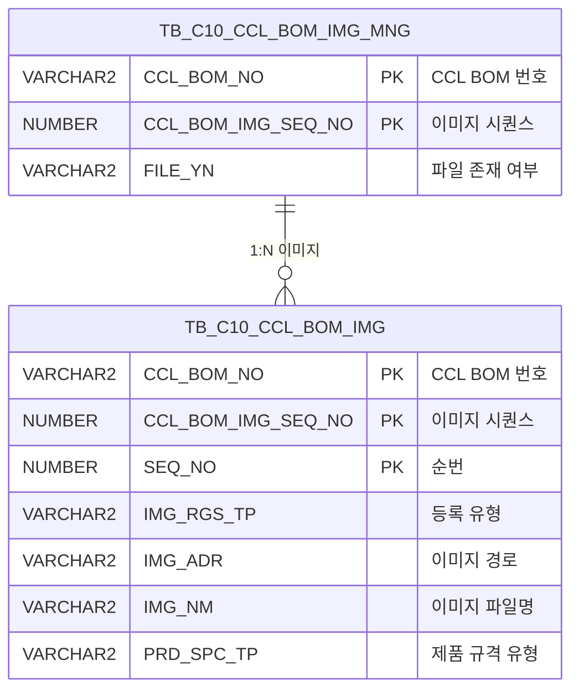

<h1 style="font-size: 40px; text-align: center; font-weight:
   bold; margin: 30px 0;">
  C106000100pop02 레거시 시스템 분석 종합 보고서
</h1>


# 1. 시스템 개요
- **서비스 ID**: C106000100pop02
- **업무명**: CCLBOM 규격 이미지 등록/조회 팝업
- **분석 일시**: 2026-03-17 11:00 KST
- **전체 Activity 수**: 2개 (Built-in)
- **분석자**: Claude Opus 4.6 + Sonnet
- **분석 도구**: /analyze-service C106000100pop02
- **문서 버전**: 1.0

# 📊 비즈니스 프로세스 분석

## 시스템 목적

본 서비스는 CCL(Color Coating Line) 공정의 BOM(Bill of Materials) 규격 이미지를 관리하는 팝업 화면이다. 부모 화면(C106000100)에서 특정 CCL BOM 항목을 선택한 후 이 팝업을 호출하여, 해당 BOM 규격에 연관된 이미지를 업로드/조회/삭제할 수 있다.

이미지는 `PRD_SPC_TP = '2'`(규격 유형) 조건으로 필터링되며, PC 또는 모바일에서 등록한 이미지를 구분하여 관리한다. dhtmlXVault 컴포넌트를 사용하여 jpg/gif 확장자만 업로드를 허용하고, 업로드/삭제 시 이미지 관리 테이블(TB_C10_CCL_BOM_IMG_MNG)의 FILE_YN 플래그도 자동 갱신된다.

서비스 XML 자체는 단순 조회(Router → FormSearch)만 수행하며, 이미지 업로드/삭제는 JSP 핸들러(`_uploadHandler3.jsp`, `_fileDeleteHandler3.jsp`)를 통해 직접 처리된다.

## 주요 유즈케이스

### UC-01: BOM 규격 이미지 목록 조회
- **Actor**: CCL 공정 오퍼레이터
- **목적**: 특정 CCL BOM 항목에 등록된 규격 이미지 목록을 조회하여 등록 현황 파악

- **전제조건**:
  - 부모 화면(C106000100)에서 CCL BOM 항목이 선택되어 있음
  - CCL_BOM_NO, CCL_BOM_IMG_SEQ_NO 파라미터가 팝업에 전달됨

- **주요 흐름**:
  1. 부모 화면에서 팝업 호출 시 URL 파라미터(CCL_BOM_NO, CCL_BOM_IMG_SEQ_NO, PRD_SPC_TP 등) 전달
  2. 팝업 로딩 시 dhtmlXVault 초기화 및 Grid 컴포넌트 초기화 (`ui.initializeDHTMLX()`)
  3. XLE 이벤트(`onXLEEvent`) 트리거로 `onLoadGrid()` 호출
  4. `C106000100pop02_Grid_1.select` 쿼리 실행 — TB_C10_CCL_BOM_IMG 테이블에서 PRD_SPC_TP='2' 조건으로 이미지 목록 조회
  5. Grid에 CCL BOM, 순번, 구분(PC/모바일), 이미지명, 등록일자, 등록자 표시

- **대체 흐름**:
  - 등록된 이미지가 없는 경우: Grid에 데이터 없이 빈 상태 표시

- **후행조건**:
  - 이미지 목록이 Grid에 표시됨
  - 사용자가 이미지 링크 클릭, 삭제, 신규 업로드 가능 상태

### UC-02: 규격 이미지 업로드
- **Actor**: CCL 공정 오퍼레이터
- **목적**: 새로운 규격 이미지를 등록하여 BOM 이미지 관리

- **전제조건**:
  - 팝업이 열려 있고 dhtmlXVault가 초기화됨
  - 업로드할 이미지 파일이 준비됨 (jpg 또는 gif)

- **주요 흐름**:
  1. dhtmlXVault 영역에 이미지 파일 추가 (드래그앤드롭 또는 파일 선택)
  2. `vault.onAddFile` 콜백에서 확장자 검증 (jpg, gif만 허용)
  3. `_uploadHandler3.jsp` 핸들러로 파일 업로드 — IMG_RGS_FLAG='04' 설정
  4. 핸들러 내부에서 `C106000100pop02.insert` 쿼리 실행:
     - SEQ_NO: 기존 최대값 + 1 자동 채번 (`NVL(MAX(SEQ_NO),0)+1`)
     - IMG_RGS_TP, IMG_ADR, IMG_NM 등록
     - CCL_BOM_RGS_DH = SYSDATE
  5. `C106000100pop02.update` 쿼리로 TB_C10_CCL_BOM_IMG_MNG.FILE_YN 갱신 (이미지 존재 시 'Y', 없으면 'N')
  6. `vault.onUploadComplete` 콜백 → `onLoadGrid()` 호출로 Grid 재조회

- **대체 흐름**:
  - 허용되지 않는 확장자: "jpg, gif 확장자만 등록하실수 있습니다." 알림 후 업로드 차단
  - 업로드 실패: "파일업로드에 실패하였습니다." 알림

- **후행조건**:
  - 이미지가 서버에 저장되고 TB_C10_CCL_BOM_IMG에 레코드 INSERT됨
  - TB_C10_CCL_BOM_IMG_MNG.FILE_YN이 'Y'로 갱신됨
  - Grid가 재조회되어 신규 이미지 표시

### UC-03: 규격 이미지 삭제
- **Actor**: CCL 공정 오퍼레이터
- **목적**: 불필요한 규격 이미지를 삭제

- **전제조건**:
  - Grid에 이미지 목록이 표시되어 있음
  - 삭제할 이미지 행 식별 가능

- **주요 흐름**:
  1. Grid의 '삭제' 컬럼 클릭 → `doImgDel(rowIdx)` 호출
  2. 선택 행에서 CCL_BOM_NO, CCL_BOM_IMG_SEQ_NO, SEQ_NO, FILE_NAME 추출
  3. 확인 대화상자: "선택한 이미지를 삭제하시겠습니까?"
  4. 확인 시 `_fileDeleteHandler3.jsp` AJAX 호출 (IMG_RGS_FLAG=04)
  5. 핸들러 내부에서 `C106000100pop02.delete` 쿼리로 TB_C10_CCL_BOM_IMG 레코드 삭제
  6. `C106000100pop02.update`로 TB_C10_CCL_BOM_IMG_MNG.FILE_YN 재산정
  7. `onLoadGrid()` 콜백으로 Grid 재조회

- **대체 흐름**:
  - 확인 대화상자에서 취소: 삭제 중단

- **후행조건**:
  - TB_C10_CCL_BOM_IMG에서 해당 레코드 삭제됨
  - FILE_YN이 남은 이미지 존재 여부에 따라 'Y' 또는 'N'으로 갱신
  - Grid 재조회로 삭제 반영

### UC-04: 이미지 미리보기
- **Actor**: CCL 공정 오퍼레이터
- **목적**: 등록된 이미지를 부모 화면에서 미리보기

- **전제조건**:
  - Grid에 이미지 목록이 표시되어 있음

- **주요 흐름**:
  1. Grid의 '이미지' 컬럼(IMG_NM) 링크 클릭 → `Grid_doLink(val, rowIdx)` 호출
  2. 클릭된 행에서 CHK_IMG_NM(이미지 파일명) 추출
  3. `parent.parentViewImg(rowId, CHK_IMG_NM)` 호출로 부모 화면에 이미지 표시

- **대체 흐름**:
  - 부모 화면의 parentViewImg 함수가 없는 경우: JavaScript 오류 발생 가능

- **후행조건**:
  - 부모 화면에서 선택된 이미지가 표시됨

---
## 비즈니스 로직 상세

### 1. 이미지 등록 유형 분류 (DECODE 변환)

- **목적**: 이미지 등록 경로(PC/모바일)를 코드값에서 사용자 친화적 명칭으로 변환
- **처리 케이스**:

  **[케이스 1: 모바일 등록]**
  ```
    조건: IMG_RGS_TP = '2'
    처리: '모바일'로 표시
  ```

  **[케이스 2: PC 등록]**
  ```
    조건: IMG_RGS_TP ≠ '2' (기본값)
    처리: 'PC'로 표시
  ```

### 2. 이미지 경로 변환 로직 (CHK_IMG_ADR 계산)

- **목적**: 서버 저장 경로에서 웹 접근 가능한 상대 경로를 생성
- **처리 케이스**:

  **[경로 변환 공식]**
  ```
    입력: IMG_ADR (서버 절대 경로, 역슬래시 포함)
    처리:
      1. IMG_ADR에서 'IMG_UPLOAD' 문자열 위치 탐색 (INSTR)
      2. 'IMG_UPLOAD'부터 끝까지 부분 문자열 추출 (SUBSTR)
      3. 역슬래시(\)를 슬래시(/)로 치환 (REPLACE)
      4. 앞에 './' 접두사, 끝에 '/' 접미사 추가
    출력: './IMG_UPLOAD/경로/' 형태의 웹 접근 가능 경로
  ```

### 3. SEQ_NO 자동 채번

- **목적**: 동일 CCL_BOM_NO + CCL_BOM_IMG_SEQ_NO 내에서 순번 자동 증가
- **계산 공식**:
  ```
  SEQ_NO = NVL(MAX(SEQ_NO), 0) + 1
    WHERE CCL_BOM_NO = :IMG_RGS_FLAG_ID
    AND CCL_BOM_IMG_SEQ_NO = :IMG_RGS_FLAG_ID2
  ```

### 4. FILE_YN 자동 갱신 로직

- **목적**: 이미지 업로드/삭제 후 BOM 이미지 관리 테이블의 파일 존재 여부 플래그를 자동 갱신
- **처리 케이스**:

  **[케이스 1: 이미지 존재]**
  ```
    조건: TB_C10_CCL_BOM_IMG에서 해당 BOM의 PRD_SPC_TP='2' 이미지 COUNT > 0
    처리: TB_C10_CCL_BOM_IMG_MNG.FILE_YN = 'Y'
  ```

  **[케이스 2: 이미지 미존재]**
  ```
    조건: COUNT = 0
    처리: TB_C10_CCL_BOM_IMG_MNG.FILE_YN = 'N'
  ```

### 5. 계산 공식 종합

- **목적**: 서비스 내 주요 계산/변환 로직을 수식으로 정리

- **계산 공식**:

  ```
  SEQ_NO 자동 채번:
    SEQ_NO = NVL(MAX(SEQ_NO), 0) + 1
    WHERE CCL_BOM_NO = :IMG_RGS_FLAG_ID AND CCL_BOM_IMG_SEQ_NO = :IMG_RGS_FLAG_ID2

  FILE_YN 자동 산정:
    FILE_YN = DECODE(
      (SELECT COUNT(*) FROM TB_C10_CCL_BOM_IMG
       WHERE CCL_BOM_NO = :CCL_BOM_NO AND CCL_BOM_IMG_SEQ_NO = :SEQ_NO AND PRD_SPC_TP = '2'),
      0, 'N',    -- 이미지 0건 → 'N'
      'Y'        -- 이미지 1건 이상 → 'Y'
    )

  이미지 경로 변환 (CHK_IMG_ADR):
    CHK_IMG_ADR = './' || REPLACE(SUBSTR(IMG_ADR, INSTR(IMG_ADR, 'IMG_UPLOAD')), '\', '/') || '/'
    → Windows 절대경로에서 'IMG_UPLOAD' 이후를 추출하여 웹 상대경로로 변환

  등록유형 변환 (DECODE):
    IMG_RGS_TP_표시 = DECODE(IMG_RGS_TP, '2', '모바일', 'PC')
  ```

---

# 💾 데이터 요구사항

## 핵심 테이블

### 1. TB_C10_CCL_BOM_IMG - (CCL BOM 이미지 정보)
| 컬럼명 | 타입 | PK | 설명 |
|--------|------|----|-----|
| CCL_BOM_NO | VARCHAR2 | ✅ | CCL BOM 번호 |
| CCL_BOM_IMG_SEQ_NO | NUMBER | ✅ | CCL BOM 이미지 시퀀스 번호 |
| SEQ_NO | NUMBER | ✅ | 순번 (자동 채번) |
| IMG_RGS_TP | VARCHAR2 |  | 이미지 등록 유형 ('1'=PC, '2'=모바일) |
| IMG_ADR | VARCHAR2 |  | 이미지 서버 저장 경로 |
| IMG_NM | VARCHAR2 |  | 이미지 파일명 |
| CCL_BOM_RGS_DH | DATE |  | BOM 이미지 등록 일시 |
| CCL_BOM_RGS_PRS_ID | VARCHAR2 |  | 등록자 ID |
| PRD_SPC_TP | VARCHAR2 |  | 제품 규격 유형 ('2' = 규격 이미지) |
| CREATED_OBJECT_TYPE | VARCHAR2 |  | 생성 객체 유형 |
| CREATED_OBJECT_ID | VARCHAR2 |  | 생성자 ID |
| CREATED_PROGRAM_ID | VARCHAR2 |  | 생성 프로그램 ID |
| CREATION_TIMESTAMP | TIMESTAMP |  | 생성 타임스탬프 |
| LAST_UPDATED_OBJECT_TYPE | VARCHAR2 |  | 최종 수정 객체 유형 |
| LAST_UPDATED_OBJECT_ID | VARCHAR2 |  | 최종 수정자 ID |
| LAST_UPDATE_PROGRAM_ID | VARCHAR2 |  | 최종 수정 프로그램 ID |
| LAST_UPDATE_TIMESTAMP | TIMESTAMP |  | 최종 수정 타임스탬프 |

### 2. TB_C10_CCL_BOM_IMG_MNG - (CCL BOM 이미지 관리)
| 컬럼명 | 타입 | PK | 설명 |
|--------|------|----|-----|
| CCL_BOM_NO | VARCHAR2 | ✅ | CCL BOM 번호 |
| CCL_BOM_IMG_SEQ_NO | NUMBER | ✅ | CCL BOM 이미지 시퀀스 번호 |
| FILE_YN | VARCHAR2 |  | 파일 존재 여부 ('Y'/'N') |
| LAST_UPDATED_OBJECT_TYPE | VARCHAR2 |  | 최종 수정 객체 유형 |
| LAST_UPDATED_OBJECT_ID | VARCHAR2 |  | 최종 수정자 ID |
| LAST_UPDATE_PROGRAM_ID | VARCHAR2 |  | 최종 수정 프로그램 ID |
| LAST_UPDATE_TIMESTAMP | TIMESTAMP |  | 최종 수정 타임스탬프 |

## 데이터 플로우

### 1. 조회
```
[이미지 목록 조회]
팝업 로딩 / 업로드 완료 / 삭제 완료
→ C106000100pop02_Grid_1.select
  FROM TB_C10_CCL_BOM_IMG
  WHERE CCL_BOM_NO = :CCL_BOM_NO
    AND CCL_BOM_IMG_SEQ_NO = :CCL_BOM_IMG_SEQ_NO
    AND PRD_SPC_TP = '2'
  ORDER BY CCL_BOM_NO, CCL_BOM_IMG_SEQ_NO, SEQ_NO
→ Grid에 이미지 목록 표시 (DECODE로 등록유형 변환, 경로 변환)
```

### 2. 업로드 (INSERT)
```
[이미지 파일 업로드]
dhtmlXVault 파일 업로드 완료
→ _uploadHandler3.jsp 핸들러 호출
→ C106000100pop02.insert
  INTO TB_C10_CCL_BOM_IMG
  VALUES (CCL_BOM_NO, CCL_BOM_IMG_SEQ_NO, 자동채번SEQ_NO, IMG_RGS_TP, FILE_ADDR, FILE_NAME, SYSDATE, ...)
→ C106000100pop02.update
  UPDATE TB_C10_CCL_BOM_IMG_MNG SET FILE_YN = DECODE(COUNT, 0, 'N', 'Y')
  WHERE CCL_BOM_NO, CCL_BOM_IMG_SEQ_NO
→ Grid 재조회
```

### 3. 삭제 (DELETE)
```
[이미지 삭제]
Grid 삭제 버튼 클릭 → 확인 대화상자
→ _fileDeleteHandler3.jsp 핸들러 호출
→ C106000100pop02.delete
  DELETE TB_C10_CCL_BOM_IMG
  WHERE CCL_BOM_NO = :IMG_RGS_FLAG_ID
    AND CCL_BOM_IMG_SEQ_NO = :IMG_RGS_FLAG_ID2
    AND SEQ_NO = :SEQ
→ C106000100pop02.update (FILE_YN 재산정)
→ Grid 재조회
```

## SQL 일람표

| SQL 이름 | 쿼리 ID | 타입 | 출처 | 테이블 |
|---------|---------|-----|-------|-------|
| CCLBOM 규격 이미지 조회 | C106000100pop02_Grid_1.select | SELECT | Service | TB_C10_CCL_BOM_IMG |
| CCLBOM 규격 이미지 업로드 | C106000100pop02.insert | INSERT | _uploadHandler3.jsp | TB_C10_CCL_BOM_IMG |
| CCLBOM 규격 이미지 삭제 | C106000100pop02.delete | DELETE | _fileDeleteHandler3.jsp | TB_C10_CCL_BOM_IMG |
| CCLBOM 규격 이미지 등록여부 갱신 | C106000100pop02.update | UPDATE | _uploadHandler3.jsp / _fileDeleteHandler3.jsp | TB_C10_CCL_BOM_IMG_MNG |

## ER 다이어그램 (핵심 관계)



관계 설명:
- **TB_C10_CCL_BOM_IMG_MNG**이 이미지 관리의 상위 테이블로 BOM별 이미지 존재 여부(FILE_YN)를 관리
- **TB_C10_CCL_BOM_IMG**는 실제 이미지 파일 정보를 저장하며, MNG 테이블과 CCL_BOM_NO + CCL_BOM_IMG_SEQ_NO로 1:N 관계
- 이미지 등록/삭제 시 MNG 테이블의 FILE_YN이 자동 갱신됨

---

# 🖥️ 사용자 인터페이스 요구사항

## 화면 레이아웃 상세

### Layout 구조
```javascript
{
  type: "flat",  // DHTMLX 레이아웃 분할 없이 div 직접 배치
  components: [
    {
      id: "vault1",
      type: "htmlObj",
      description: "dhtmlXVault 파일 업로드 컴포넌트"
    },
    {
      id: "C106000100pop02_Grid_1",
      type: "grid",
      position: "absolute, top:260px, left:8px, 430x70px"
    },
    {
      id: "C106000100pop02_MessageBox_1",
      type: "messagebox",
      position: "absolute, top:332px, left:0px, 445x23px"
    }
  ]
}
```

## 입출력 요소

### Vault 컴포넌트
**vault1 (파일 업로드)**
- 업로드 핸들러: `_uploadHandler3.jsp`
- 정보 조회: `_getInfoHandler.jsp`
- ID 조회: `_getIdHandler.jsp`
- 허용 확장자: jpg, gif
- 폼 필드:
  - IMG_RGS_TP: 이미지 등록 유형 (URL 파라미터, 1 고정)
  - IMG_RGS_FLAG: '04' (고정값 - CCL BOM 이미지 구분)
  - IMG_RGS_FLAG_ID: CCL_BOM_NO (URL 파라미터)
  - IMG_RGS_FLAG_ID2: CCL_BOM_IMG_SEQ_NO (URL 파라미터)
  - PRD_SPC_TP: 제품 규격 유형 (URL 파라미터)

### Grid 컴포넌트

**C106000100pop02_Grid_1 (이미지 목록)**
- 편집 가능 여부: 아니오 (읽기 전용)
- Split: 없음 (0)
- 컬럼 너비 단위: % (퍼센트)
- 멀티셀렉트: true
- 주요 컬럼 (11개):

  **기본 정보**:
  - CCL_BOM_NO: ro - CCL BOM 번호 (19%, 중앙정렬)
  - SEQ_NO: ro - 순번 (8%, 중앙정렬)
  - IMG_RGS_TP: ro - 구분 (PC/모바일) (11%, 중앙정렬)

  **이미지 정보**:
  - IMG_NM: ahref_idx - 이미지 파일명 (나머지%, 좌측정렬, 클릭 시 Grid_doLink → 부모 화면에 이미지 미리보기)

  **등록 정보**:
  - CCL_BOM_RGS_DH: ro - 등록일자 (20%, 중앙정렬)
  - CCL_BOM_RGS_PRS_ID: ro - 등록자 (16%, 중앙정렬)

  **액션**:
  - DEL_IMG: ro - 삭제 버튼 (8%, 중앙정렬, 클릭 시 doImgDel 함수 호출)

  **숨김 컬럼**:
  - CCL_BOM_IMG_SEQ_NO: ro - BOM 이미지 시퀀스 번호 (숨김)
  - IMG_ADR: ro - 이미지 서버 경로 (숨김)
  - CHK_IMG_NM: ro - 이미지 파일명 원본 (숨김, 링크 클릭 시 사용)
  - CHK_IMG_ADR: ro - 웹 접근 경로 (숨김, 경로 변환 결과)

## 화면 동작 흐름

### 1. 팝업 초기 로딩
```
1. 부모 화면에서 팝업 호출 (CCL_BOM_NO, CCL_BOM_IMG_SEQ_NO, rowId, parent_item, IMG_RGS_TP, PRD_SPC_TP 전달)
2. body onload → onVaultLoad() 실행
   - dhtmlXVaultObject 생성
   - setImagePath, setServerHandlers 설정
   - vault.create("vault1") → Vault UI 렌더링
   - setFormField로 업로드 파라미터 설정
   - onAddFile 콜백 등록 (확장자 검증)
   - onUploadComplete 콜백 등록 (Grid 재조회)
3. ui.initializeDHTMLX() → Grid, MessageBox 컴포넌트 초기화
4. onXLEEvent(onLoadGrid) → Grid 로딩 이벤트 바인딩
5. onLoadGrid() 호출 → parametersC10으로 파라미터 구성 → Grid 데이터 로드
```

### 2. 이미지 업로드
```
1. 사용자가 Vault 영역에 파일 추가
2. vault.onAddFile 콜백 → 확장자 검증 (jpg/gif 아니면 차단)
3. 파일 서버 전송 → _uploadHandler3.jsp 처리
4. vault.onUploadComplete 콜백
   - 업로드 실패 시: "파일업로드에 실패하였습니다." 알림
   - 성공 시: onLoadGrid() 호출
5. onLoadGrid()에서 parametersC10으로 파라미터 구성 → Grid 재조회
6. XLE 이벤트 핸들러 해제 (detachEvent) → 무한 루프 방지
```

### 3. 이미지 미리보기 (링크 클릭)
```
1. Grid의 IMG_NM 컬럼 링크 클릭
2. Grid_doLink(val, rowIdx) 호출
3. 클릭 행에서 CHK_IMG_NM 추출 (getGridCellData)
4. parent.parentViewImg(rowId, CHK_IMG_NM) 호출
5. 부모 화면에서 이미지 표시
```

### 4. 이미지 삭제
```
1. Grid의 DEL_IMG 컬럼 클릭
2. doImgDel(rowIdx) 호출
3. 선택 행에서 CCL_BOM_NO, CCL_BOM_IMG_SEQ_NO, SEQ_NO, FILE_NAME 추출
4. confirm("선택한 이미지를 삭제하시겠습니까?")
5. 확인 시: _fileDeleteHandler3.jsp AJAX GET 호출 (파라미터: IMG_RGS_FLAG=04, ID, SEQ, FILE_NAME)
6. 콜백으로 onLoadGrid() → Grid 재조회
```

## JavaScript 모듈

**C106000100pop02.jsp (인라인 스크립트)**
- `onVaultLoad()`: dhtmlXVault 초기화 및 업로드 핸들러 설정 (body onload 이벤트)
- `onLoadGrid()`: Grid 데이터 재조회 (parametersC10으로 파라미터 구성)
- `Grid_doLink(val, rowIdx)`: 이미지 링크 클릭 시 부모 화면의 parentViewImg 호출
- `doImgDel(rowIdx)`: 이미지 삭제 (confirm → _fileDeleteHandler3.jsp AJAX 호출)
- `find(eventName, formDivObj, referenceItem)`: 폼 조회 (uiCommon.parameters → Grid loadData)
- `save(eventName, formDivObj, referenceItem)`: 폼 저장 (Grid sendGrid)
- `add(referenceItem)`: 신규 행 추가
- `remove(referenceItem)`: 선택 행 삭제
- `copy(referenceItem)`: 행 클립보드 복사
- `undo(referenceItem)`: Grid undo
- `redo(referenceItem)`: Grid redo
- `onGridContextMenuClick(id, gridObj, menuObj)`: 컨텍스트 메뉴 (컬럼이동/필터/편집/엑셀)
- `findMessage(referenceItem)`: MessageBox 메시지 표시 (uiCommon.message)
- `ui.initializeDHTMLX()`: DHTMLX 컴포넌트 초기화 (pageConfiguration 기반)

## 주요 이벤트 핸들러

**onVaultLoad (body onload)**
- 이벤트 타입: Page Load
- 처리 내용:
  1. dhtmlXVaultObject 인스턴스 생성
  2. 이미지 경로 및 서버 핸들러 URL 설정
  3. Vault UI 생성 (`vault.create("vault1")`)
  4. 폼 필드 설정 (IMG_RGS_TP, IMG_RGS_FLAG, IMG_RGS_FLAG_ID, IMG_RGS_FLAG_ID2, PRD_SPC_TP)
  5. onAddFile 콜백: 확장자 검증
  6. onUploadComplete 콜백: 성공 시 Grid 재조회, 실패 시 알림

**onLoadGrid (XLE 이벤트 / 업로드 완료 / 삭제 완료)**
- 이벤트 타입: Custom Event
- 처리 내용:
  1. Grid 컴포넌트 참조 획득
  2. parametersC10으로 CCL_BOM_NO, CCL_BOM_IMG_SEQ_NO 커스텀 파라미터 구성
  3. Grid loadData로 데이터 재조회
  4. XLE 이벤트 핸들러 해제 (detachEvent) → 중복 조회 방지

**Grid_doLink (ahref_idx 클릭)**
- 이벤트 타입: Grid Cell Link Click
- 처리 내용:
  1. 부모 화면의 Grid 참조 획득 (`parent.items[parent_item]`)
  2. 클릭 행에서 CHK_IMG_NM(이미지 파일명) 추출
  3. `parent.parentViewImg(rowId, CHK_IMG_NM)` 호출로 부모 화면에 이미지 표시

---

# 📌 특이사항 및 주의사항

## 1. 서비스 XML과 실제 CRUD 불일치
- **서비스 XML은 SELECT만 정의**: 서비스 XML에는 Router → FormSearch(조회) 구조만 있으나, 실제로는 INSERT/DELETE/UPDATE 쿼리가 모두 존재
- **JSP 핸들러 직접 호출**: 이미지 업로드(`_uploadHandler3.jsp`)와 삭제(`_fileDeleteHandler3.jsp`)는 GLUE 서비스 프레임워크를 거치지 않고 JSP 핸들러를 직접 AJAX 호출. 이로 인해 서비스 XML 기반 분석만으로는 전체 CRUD 파악 불가

## 2. 경로 문자열 하드코딩 및 OS 종속성
- **역슬래시→슬래시 치환**: SQL에서 `REPLACE(SUBSTR(IMG_ADR, instr(IMG_ADR, 'IMG_UPLOAD')), '\', '/')`로 Windows 서버 경로를 웹 경로로 변환. Windows 서버 환경 전제
- **'IMG_UPLOAD' 문자열 하드코딩**: 이미지 저장 디렉토리명이 SQL에 하드코딩되어 있어, 디렉토리 구조 변경 시 쿼리 수정 필요
- **IMG_RGS_FLAG '04' 하드코딩**: Vault 설정에서 이미지 구분 플래그가 '04'로 하드코딩

## 3. XLE 이벤트 해제를 통한 무한루프 방지 패턴
- `onXLEEvent(onLoadGrid)`로 Grid 로딩 이벤트를 바인딩한 후, `onLoadGrid()` 내부에서 `detachEvent(onXleGrid)`로 즉시 해제
- 이는 Grid 데이터 로드 → XLE 이벤트 발생 → 재로드 → XLE 이벤트 발생... 의 무한루프를 방지하기 위한 패턴

## 4. 부모-자식 화면 간 직접 DOM 참조
- `parent.items[parent_item]`으로 부모 화면의 DHTMLX Grid 객체에 직접 접근
- `parent.parentViewImg()` 함수를 직접 호출하여 부모 화면에 이미지 표시
- iframe 기반 팝업 구조에서 부모 객체에 대한 강한 결합이 존재하며, 부모 화면 구조 변경 시 팝업 동작에 영향

## 5. 파일 확장자 제한 및 보안
- 클라이언트측에서만 확장자 검증 (jpg, gif). 서버측 검증은 `_uploadHandler3.jsp` 핸들러에 의존
- 이미지 파일 삭제 시 서버 파일 시스템의 물리 파일 삭제와 DB 레코드 삭제가 `_fileDeleteHandler3.jsp`에서 함께 처리됨

## 6. PRD_SPC_TP 필터링
- 본 팝업은 `PRD_SPC_TP = '2'` (규격 이미지)만 조회/등록하는 전용 화면
- 동일 테이블에 다른 PRD_SPC_TP 값의 이미지도 존재할 수 있으나, 이 팝업에서는 접근 불가

---

# 📚 참고 문서

- **Query SQL**: `src/query/C106000100pop02-query.glue_sql`
- **JSP**: `WebContents/C106000100pop02.jsp`
- **Grid XML**: `WebContents/header/kr/C106000100pop02/C106000100pop02_Grid_1.xml`
- **MessageBox XML**: `WebContents/header/kr/C106000100pop02/C106000100pop02_MessageBox_1.xml`
- **Service XML**: `src/service/C106000100pop02-service.xml`
- **공통 JS**: `WebContents/js/c10.ui.js`
