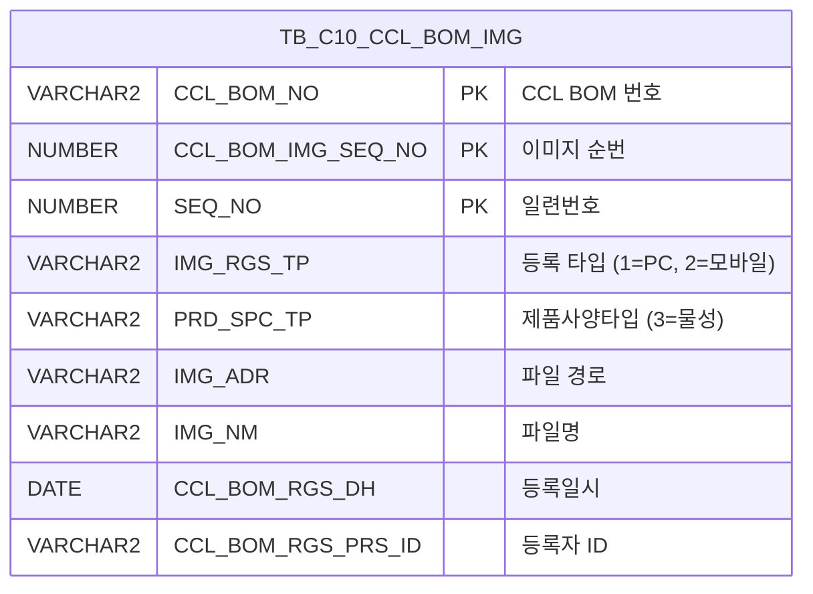

<h1 style="font-size: 40px; text-align: center; font-weight:
   bold; margin: 30px 0;">
  C106000100pop03 레거시 시스템 분석 종합 보고서
</h1>


# 1. 시스템 개요
- **서비스 ID**: C106000100pop03
- **업무명**: CCL BOM 물성파일 이미지 등록/조회 팝업
- **분석 일시**: 2026-03-17 (KST)
- **전체 Activity 수**: 2개 (Built-in 2개)
- **분석자**: Claude Opus 4.6
- **분석 도구**: /analyze-service C106000100pop03
- **문서 버전**: 1.0

# 📊 비즈니스 프로세스 분석

## 시스템 목적

C106000100pop03은 CCL(연속도장라인) 공정에서 사용되는 BOM(Bill of Materials) 관련 물성파일 이미지를 등록하고 조회하는 팝업 화면이다. 부모 화면(C106000100)에서 특정 CCL BOM을 선택한 후 이 팝업을 호출하면, 해당 BOM에 연결된 물성파일 목록을 조회하고, 새로운 파일을 업로드하거나 기존 파일을 다운로드/삭제할 수 있다.

이 서비스는 dhtmlXVault 컴포넌트를 통한 파일 업로드 기능과, Grid를 통한 등록된 파일 목록 조회/삭제 기능을 제공한다. 파일 관리는 JSP 핸들러(_uploadHandler3.jsp, _fileDownloadHandler.jsp, _fileDeleteHandler3.jsp)를 통해 서버 측에서 처리되며, Grid 데이터 조회는 GLUE 프레임워크의 FormSearch Activity를 통해 수행된다.

## 주요 유즈케이스

### UC-01: 물성파일 목록 조회
- **Actor**: CCL 공정 오퍼레이터
- **목적**: 특정 CCL BOM에 등록된 물성파일 이미지 목록을 조회하여 현재 등록 현황을 확인

- **전제조건**:
  - 부모 화면(C106000100)에서 CCL BOM 항목이 선택되어 있음
  - CCL_BOM_NO, CCL_BOM_IMG_SEQ_NO 파라미터가 전달됨

- **주요 흐름**:
  1. 부모 화면에서 팝업 호출 시 CCL_BOM_NO, CCL_BOM_IMG_SEQ_NO 파라미터 전달
  2. onVaultLoad 이벤트에서 Vault 컴포넌트 초기화 및 Grid 데이터 로드
  3. C106000100pop03_Grid_1.select 쿼리 실행 (TB_C10_CCL_BOM_IMG 테이블, PRD_SPC_TP='3' 조건)
  4. Grid에 CCL BOM 번호, 순번, 구분(PC/모바일), 파일명, 등록일자, 등록자, 삭제 버튼 표시

- **대체 흐름**:
  - 등록된 파일이 없는 경우: 빈 Grid 표시

- **후행조건**:
  - 등록된 물성파일 목록이 Grid에 표시됨
  - 사용자가 파일 다운로드/삭제/업로드 작업을 수행할 수 있는 상태

### UC-02: 물성파일 업로드
- **Actor**: CCL 공정 오퍼레이터
- **목적**: 새로운 물성파일 이미지를 CCL BOM에 등록

- **전제조건**:
  - 팝업이 열려있고 Vault 컴포넌트가 초기화됨
  - 업로드할 파일이 준비됨

- **주요 흐름**:
  1. Vault 영역에 파일을 드래그앤드롭 또는 선택하여 추가
  2. Vault가 _uploadHandler3.jsp로 파일 전송 (폼 필드: IMG_RGS_TP=1, IMG_RGS_FLAG=04, CCL_BOM_NO, CCL_BOM_IMG_SEQ_NO, PRD_SPC_TP)
  3. 서버에서 파일 저장 및 TB_C10_CCL_BOM_IMG 테이블에 레코드 등록
  4. 업로드 완료 시 onLoadGrid 콜백 호출로 Grid 데이터 자동 갱신

- **대체 흐름**:
  - 업로드 실패 시: Vault 컴포넌트 내 에러 표시

- **후행조건**:
  - 파일이 서버에 저장됨
  - Grid에 새로 등록된 파일이 표시됨

### UC-03: 물성파일 다운로드
- **Actor**: CCL 공정 오퍼레이터
- **목적**: 등록된 물성파일을 다운로드하여 확인

- **전제조건**:
  - Grid에 파일 목록이 표시되어 있음

- **주요 흐름**:
  1. Grid에서 파일명(IMG_NM) 링크 클릭
  2. Grid_doLink 이벤트 핸들러 실행
  3. IMG_ADR(파일 경로), IMG_NM(파일명) 추출
  4. _fileDownloadHandler.jsp 호출하여 파일 다운로드

- **대체 흐름**:
  - 파일이 서버에서 삭제된 경우: 다운로드 실패 에러

- **후행조건**:
  - 파일이 사용자 PC에 다운로드됨

### UC-04: 물성파일 삭제
- **Actor**: CCL 공정 오퍼레이터
- **목적**: 잘못 등록되었거나 불필요한 물성파일을 삭제

- **전제조건**:
  - Grid에 파일 목록이 표시되어 있음

- **주요 흐름**:
  1. Grid에서 삭제(DEL_IMG) 버튼 클릭
  2. doImgDel 이벤트 핸들러 실행
  3. 선택 행의 CCL_BOM_NO, CCL_BOM_IMG_SEQ_NO, SEQ_NO, CHK_IMG_NM 추출
  4. confirm 대화상자로 삭제 확인 요청
  5. 확인 시 _fileDeleteHandler3.jsp AJAX 호출 (IMG_RGS_FLAG=04, CCL_BOM_NO, CCL_BOM_IMG_SEQ_NO, SEQ_NO, PRD_SPC_TP, FILE_NAME)
  6. 서버에서 파일 삭제 및 DB 레코드 제거
  7. 삭제 완료 후 onLoadGrid 호출로 Grid 자동 갱신

- **대체 흐름**:
  - confirm에서 취소 선택 시: 삭제 중단, 현재 상태 유지

- **후행조건**:
  - 파일이 서버에서 삭제됨
  - Grid에서 해당 행이 제거됨

---
## 비즈니스 로직 상세

### 1. 이미지 등록 타입 코드 변환

- **목적**: DB에 저장된 이미지 등록 타입 코드값을 사용자가 이해할 수 있는 의미명으로 변환하여 Grid에 표시
- **처리 케이스**:

  **[케이스 1: DECODE 코드 변환]**
  ```
    조건: IMG_RGS_TP 컬럼값에 따른 변환
    처리:
      1. IMG_RGS_TP = '2' → '모바일' 표시
      2. IMG_RGS_TP ≠ '2' (기타 값) → 'PC' 표시 (기본값)
    SQL: DECODE(IMG_RGS_TP, '2', '모바일', 'PC')
  ```

### 2. 제품사양타입 기반 필터링

- **목적**: 물성파일 유형(PRD_SPC_TP='3')만 선별하여 조회
- **처리 케이스**:

  **[케이스 1: 물성파일 필터]**
  ```
    조건: PRD_SPC_TP = '3' (물성파일)
    처리:
      1. TB_C10_CCL_BOM_IMG 테이블에서 PRD_SPC_TP='3' 조건으로 필터
      2. CCL_BOM_NO, CCL_BOM_IMG_SEQ_NO 조건과 함께 적용
      3. SEQ_NO 순서로 정렬하여 반환
  ```

### 3. 파일 업로드/삭제 핸들러 플래그 체계

- **목적**: 파일 관리 JSP 핸들러에서 이미지 등록 구분을 위한 플래그 체계
- **처리 케이스**:

  **[케이스 1: 업로드 시 플래그 설정]**
  ```
    조건: Vault 업로드 시
    처리:
      1. IMG_RGS_FLAG = '04' (CCL BOM 물성파일 구분)
      2. IMG_RGS_FLAG_ID = CCL_BOM_NO (1차 식별키)
      3. IMG_RGS_FLAG_ID2 = CCL_BOM_IMG_SEQ_NO (2차 식별키)
      4. IMG_RGS_TP = 1 (PC 등록)
      5. PRD_SPC_TP = JSP 파라미터 전달값
  ```

---

# 💾 데이터 요구사항

## 핵심 테이블

### 1. TB_C10_CCL_BOM_IMG - CCL BOM 이미지 관리 테이블
| 컬럼명 | 타입 | PK | 설명 |
|--------|------|----|------|
| CCL_BOM_NO | VARCHAR2 | ✅ | CCL BOM 번호 |
| CCL_BOM_IMG_SEQ_NO | NUMBER | ✅ | CCL BOM 이미지 순번 |
| SEQ_NO | NUMBER | ✅ | 이미지 일련번호 |
| IMG_RGS_TP | VARCHAR2 | | 이미지 등록 타입 ('1'=PC, '2'=모바일) |
| PRD_SPC_TP | VARCHAR2 | | 제품 사양 타입 ('3'=물성파일) |
| IMG_ADR | VARCHAR2 | | 이미지 파일 경로 |
| IMG_NM | VARCHAR2 | | 이미지 파일명 |
| CCL_BOM_RGS_DH | DATE | | 등록 일시 |
| CCL_BOM_RGS_PRS_ID | VARCHAR2 | | 등록자 ID |

## 데이터 플로우

### 1. 조회
```
[물성파일 목록 조회]
팝업 진입 (CCL_BOM_NO, CCL_BOM_IMG_SEQ_NO 파라미터 전달)
→ C106000100pop03_Grid_1.select
  FROM TB_C10_CCL_BOM_IMG
  WHERE CCL_BOM_NO = :CCL_BOM_NO
    AND CCL_BOM_IMG_SEQ_NO = :CCL_BOM_IMG_SEQ_NO
    AND PRD_SPC_TP = '3'
  ORDER BY SEQ_NO
→ Grid에 물성파일 목록 표시
```

### 2. 파일 업로드
```
[물성파일 업로드]
사용자 파일 선택/드래그앤드롭
→ dhtmlXVault → _uploadHandler3.jsp
  폼 데이터: IMG_RGS_TP=1, IMG_RGS_FLAG=04, CCL_BOM_NO, CCL_BOM_IMG_SEQ_NO, PRD_SPC_TP
→ 서버 파일 저장 + TB_C10_CCL_BOM_IMG INSERT
→ onLoadGrid 콜백 → Grid 재조회
```

### 3. 파일 삭제
```
[물성파일 삭제]
Grid DEL_IMG 버튼 클릭 → confirm 확인
→ AJAX → _fileDeleteHandler3.jsp
  파라미터: IMG_RGS_FLAG=04, CCL_BOM_NO, CCL_BOM_IMG_SEQ_NO, SEQ_NO, PRD_SPC_TP, FILE_NAME
→ 서버 파일 삭제 + TB_C10_CCL_BOM_IMG DELETE
→ onLoadGrid 콜백 → Grid 재조회
```

## SQL 일람표
| SQL 이름 | 쿼리 ID | 타입 | 출처 | 테이블 |
|---------|---------|------|------|--------|
| 물성파일등록 조회 | C106000100pop03_Grid_1.select | SELECT | Service | TB_C10_CCL_BOM_IMG |

## ER 다이어그램 (핵심 관계)



관계 설명:
- TB_C10_CCL_BOM_IMG가 단일 테이블로 사용됨 (타 테이블 JOIN 없음)
- CCL_BOM_NO를 통해 부모 테이블(CCL BOM 마스터)과 논리적 1:N 관계
- CCL_BOM_NO + CCL_BOM_IMG_SEQ_NO + SEQ_NO 복합 PK로 개별 이미지 파일 식별

---

# 🖥️ 사용자 인터페이스 요구사항

## 화면 레이아웃 상세

### Layout 구조
```
팝업 페이지 (position:absolute 기반, initLayout 없음)
┌─────────────────────────────────────────┐
│  [Vault 파일 업로드 영역]                │  dhtmlXVault (vault1)
│  (드래그앤드롭 또는 파일 선택)            │  top 영역
│                                          │
├─────────────────────────────────────────┤
│  [Grid: 물성파일 목록]                   │  C106000100pop03_Grid_1
│  left:8px, top:260px                     │  430px × 70px
│  CCL BOM | 순번 | 구분 | 파일 | 등록일자 │
│  | 등록자 | 삭제                          │
├─────────────────────────────────────────┤
│  [MessageBox: 상태바]                    │  C106000100pop03_MessageBox_1
│  left:0px, top:332px                     │  445px × 23px
└─────────────────────────────────────────┘
```

## 입출력 요소

### Grid 컴포넌트

**C106000100pop03_Grid_1 (물성파일 목록)**
- 편집 가능 여부: 아니오 (읽기 전용)
- Split: 없음
- 컬럼 너비 단위: % (colwidthUnit=%)
- vertical: true (세로 표시)
- multiselect: true
- 주요 컬럼 (11개):

  **숨김 컬럼**:
  - CCL_BOM_IMG_SEQ_NO: ro - CCL BOM 이미지 순번 (숨김)
  - IMG_ADR: ro - 이미지 파일 경로 (숨김)
  - CHK_IMG_NM: ro - 체크 이미지 파일명 (숨김)
  - CHK_IMG_ADR: ro - 체크 이미지 경로 (숨김)

  **기본 정보**:
  - CCL_BOM_NO: ro - CCL BOM 번호 (19%, 중앙정렬)
  - SEQ_NO: ro - 순번 (8%, 중앙정렬)
  - IMG_RGS_TP: ro - 구분 (11%, 중앙정렬, DECODE로 PC/모바일 표시)

  **파일 정보**:
  - IMG_NM: ahref_idx - 파일명 (나머지 *, 좌측정렬, 클릭 시 _fileDownloadHandler.jsp로 파일 다운로드)
  - CCL_BOM_RGS_DH: ro - 등록일자 (20%, 중앙정렬, YYYY-MM-DD 포맷)
  - CCL_BOM_RGS_PRS_ID: ro - 등록자 (16%, 중앙정렬)

  **액션**:
  - DEL_IMG: ro - 삭제 버튼 (8%, 중앙정렬, 클릭 시 doImgDel 실행)

### 특수 컴포넌트

**vault1 (dhtmlXVault - 파일 업로드)**
- 컴포넌트 타입: dhtmlXVaultObject
- 업로드 핸들러: _uploadHandler3.jsp
- 정보 조회: _getInfoHandler.jsp
- ID 조회: _getIdHandler.jsp
- 폼 필드: IMG_RGS_TP(1), IMG_RGS_FLAG(04), CCL_BOM_NO, CCL_BOM_IMG_SEQ_NO, PRD_SPC_TP

## 화면 동작 흐름

### 1. 화면 초기 로딩
```
1. 부모 화면에서 팝업 호출 (CCL_BOM_NO, CCL_BOM_IMG_SEQ_NO, rowId, parent_item, IMG_RGS_TP, PRD_SPC_TP 파라미터 전달)
2. body onload → onVaultLoad() 실행
3. 부모 그리드 참조 설정 (parent_item, rowId로 부모 그리드 행 식별)
4. dhtmlXVaultObject 생성 및 초기화
   - 서버 핸들러 URL 설정 (_uploadHandler3.jsp, _getInfoHandler.jsp, _getIdHandler.jsp)
   - 폼 필드 설정 (IMG_RGS_TP, IMG_RGS_FLAG, CCL_BOM_NO, CCL_BOM_IMG_SEQ_NO, PRD_SPC_TP)
   - 업로드 완료 콜백 등록 → onLoadGrid
5. onLoadGrid() 호출 → parametersC10으로 Grid 데이터 로드
6. XLE 이벤트 콜백 등록 (items['C106000100pop03_Grid_1'].onXLEEvent(onLoadGrid))
```

### 2. 파일 업로드 후 Grid 갱신
```
1. 사용자가 Vault 영역에 파일 드래그앤드롭 또는 선택
2. Vault가 _uploadHandler3.jsp로 파일 전송
3. 서버에서 파일 저장 및 DB 레코드 생성
4. 업로드 완료 콜백 → onLoadGrid() 호출
5. parametersC10('C106000100pop03_Grid_1', 'find', customparam) 실행
6. C106000100pop03_Grid_1.select 쿼리 재실행
7. Grid에 갱신된 파일 목록 표시
```

### 3. 파일 다운로드
```
1. Grid에서 파일명(IMG_NM) 링크 클릭
2. Grid_doLink(id, ind) 이벤트 핸들러 실행
3. 클릭한 행에서 IMG_ADR(파일 경로), IMG_NM(파일명) 추출
4. _fileDownloadHandler.jsp 호출 (FILE_ADR, FILE_NM 파라미터)
5. 브라우저 파일 다운로드 실행
```

### 4. 파일 삭제
```
1. Grid에서 삭제(DEL_IMG) 컬럼 버튼 클릭
2. doImgDel(rowId) 이벤트 핸들러 실행
3. 선택 행에서 CCL_BOM_NO, CCL_BOM_IMG_SEQ_NO, SEQ_NO, CHK_IMG_NM 추출
4. confirm("삭제하시겠습니까?") 대화상자 표시
5. 확인 시 → AJAX로 _fileDeleteHandler3.jsp 호출
   - 파라미터: IMG_RGS_FLAG=04, IMG_RGS_FLAG_ID=CCL_BOM_NO, IMG_RGS_FLAG_ID2=CCL_BOM_IMG_SEQ_NO, SEQ=SEQ_NO, PRD_SPC_TP, FILE_NAME=CHK_IMG_NM
6. 서버에서 파일 삭제 + DB 레코드 제거
7. onLoadGrid() 호출 → Grid 갱신
```

## JavaScript 모듈

**C106000100pop03.jsp** (인라인 스크립트)
- onVaultLoad(): 페이지 초기화 - dhtmlXVaultObject 생성 및 설정, 부모 그리드 참조, 폼 필드 설정
- onLoadGrid(): Grid 데이터 리로드 - parametersC10 함수로 find 요청, 업로드/삭제 완료 후 콜백
- find(): 조회 기능 - uiCommon.parameters로 Grid 데이터 조회
- save(): 저장 기능 - sendGrid 호출
- add(): 행 추가
- remove(): 행 삭제
- copy(): 행 복사
- undo(): 변경 취소
- redo(): 변경 재적용
- Grid_doLink(id, ind): 파일명 링크 클릭 시 _fileDownloadHandler.jsp로 파일 다운로드
- doImgDel(rowId): 이미지 삭제 - confirm 확인 후 _fileDeleteHandler3.jsp AJAX 호출
- findMessage(): 상태바 메시지 표시
- onGridContextMenuClick(id, zoneId, cas): 컨텍스트 메뉴 - 컬럼 이동, 필터, 편집모드 토글, 엑셀 다운로드

## 주요 이벤트 핸들러

**onVaultLoad (페이지 로드)**
- 이벤트 타입: body onload
- 처리 내용:
  1. parent_item, rowId 파라미터로 부모 그리드 참조 설정
  2. dhtmlXVaultObject 인스턴스 생성 (vault1 div)
  3. 서버 핸들러 URL 설정 (upload, getInfo, getId)
  4. setFormData로 폼 필드 설정 (IMG_RGS_TP, IMG_RGS_FLAG, CCL_BOM_NO, CCL_BOM_IMG_SEQ_NO, PRD_SPC_TP)
  5. onUploadComplete 콜백에 onLoadGrid 등록
  6. onLoadGrid() 최초 호출

**Grid_doLink (파일 다운로드)**
- 이벤트 타입: Grid ahref_idx 셀 클릭
- 처리 내용:
  1. 클릭된 행의 IMG_ADR, IMG_NM 컬럼값 추출
  2. _fileDownloadHandler.jsp에 FILE_ADR, FILE_NM 전달
  3. 브라우저 파일 다운로드 트리거

**doImgDel (이미지 삭제)**
- 이벤트 타입: Grid DEL_IMG 버튼 클릭
- 처리 내용:
  1. 선택 행의 CCL_BOM_NO, CCL_BOM_IMG_SEQ_NO, SEQ_NO, CHK_IMG_NM 추출
  2. confirm 대화상자로 삭제 확인
  3. 확인 시 _fileDeleteHandler3.jsp AJAX 호출
  4. 성공 시 onLoadGrid() 호출로 Grid 갱신

**onGridContextMenuClick (컨텍스트 메뉴)**
- 이벤트 타입: Grid 우클릭 메뉴
- 처리 내용:
  1. move_grid: 컬럼 이동 모드 토글
  2. filter_grid: 헤더 필터 토글
  3. editable_grid: 편집 모드 토글
  4. excel_grid: 엑셀 다운로드

---

# 📌 특이사항 및 주의사항

## 1. initLayout 미사용 - absolute 포지셔닝 기반 레이아웃
- 일반적인 GLUE 프레임워크의 initLayout 패턴을 따르지 않고, HTML의 `position:absolute`를 사용하여 컴포넌트를 배치하는 팝업 전용 구조이다. 이로 인해 화면 크기 변경 시 레이아웃이 깨질 수 있으며, 반응형 처리가 불가하다.

## 2. 파일 관리가 GLUE 프레임워크 외부 JSP 핸들러로 처리
- 파일 업로드(_uploadHandler3.jsp), 다운로드(_fileDownloadHandler.jsp), 삭제(_fileDeleteHandler3.jsp)가 GLUE 서비스 체인이 아닌 별도 JSP 핸들러로 처리된다. 이는 GLUE 프레임워크의 트랜잭션 관리 범위 밖에서 동작하므로, 파일 저장과 DB 레코드 생성 간 정합성 이슈가 발생할 수 있다.

## 3. dhtmlXVault 외부 라이브러리 의존성
- DHTMLX 표준 컴포넌트가 아닌 dhtmlXVault(파일 업로드 전용 플러그인)를 사용한다. 이 컴포넌트는 Flash 기반에서 HTML5로 전환된 이력이 있으며, 브라우저 호환성에 주의가 필요하다.

## 4. IMG_RGS_FLAG 하드코딩
- 이미지 등록 플래그값 '04'가 JSP 내에 하드코딩되어 있다. 이 값은 CCL BOM 물성파일을 구분하는 키로 사용되며, 다른 화면에서도 동일한 핸들러를 사용할 경우 플래그값으로 구분한다. 공통 코드 테이블이 아닌 하드코딩이므로 변경 시 관련 모든 JSP를 확인해야 한다.

## 5. PRD_SPC_TP 필터 조건의 하드코딩
- SQL 쿼리에서 `PRD_SPC_TP = '3'`으로 물성파일 유형만 필터링하는데, 이 값이 쿼리 내에 하드코딩되어 있다. 다른 사양 타입의 이미지를 조회하려면 별도 쿼리가 필요하다.

---

# 📚 참고 문서

- **Service XML**: `src/service/C106000100pop03-service.xml`
- **Query SQL**: `src/query/C106000100pop03-query.glue_sql`
- **JSP**: `WebContents/C106000100pop03.jsp`
- **Grid XML**: `WebContents/header/kr/C106000100pop03/C106000100pop03_Grid_1.xml`
