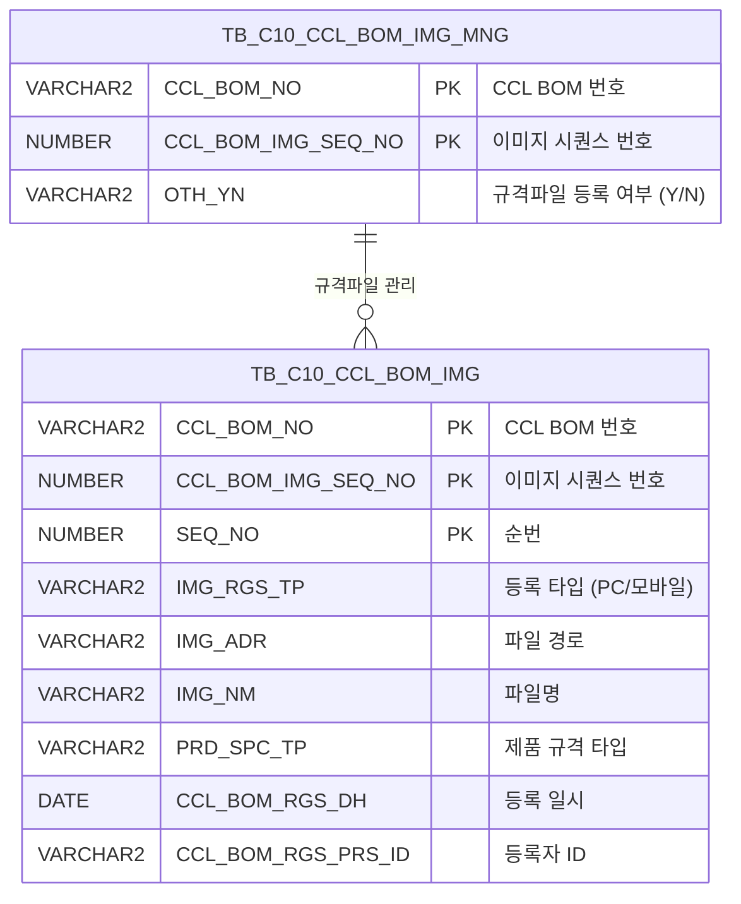

<h1 style="font-size: 40px; text-align: center; font-weight:
   bold; margin: 30px 0;">
  C106000100pop04 레거시 시스템 분석 종합 보고서
</h1>


# 1. 시스템 개요
- **서비스 ID**: C106000100pop04
- **업무명**: CCLBOM 규격파일(이미지) 등록 팝업
- **분석 일시**: 2026-03-17 11:02 (KST)
- **전체 Activity 수**: 2 (Built-in: 2, Custom: 0)
- **분석자**: Claude Opus 4.6 / Sonnet 4.6
- **분석 도구**: /analyze-service C106000100pop04
- **문서 버전**: 1.0

# 📊 비즈니스 프로세스 분석

## 시스템 목적

CCL(Continuous Coating Line) BOM에 연관된 규격파일(이미지)을 등록, 조회, 삭제하는 팝업 화면이다. 부모 화면(C106000100)에서 특정 CCL BOM 항목을 선택한 후 이 팝업을 호출하면, 해당 BOM의 규격파일 목록을 조회하고 파일 업로드(PC/모바일) 및 삭제 기능을 제공한다.

dhtmlxVault 컴포넌트를 활용하여 파일을 서버에 업로드하며, 업로드 완료 시 `TB_C10_CCL_BOM_IMG` 테이블에 파일 정보를 INSERT하고, `TB_C10_CCL_BOM_IMG_MNG` 테이블의 등록 여부(OTH_YN)를 자동 갱신한다. 파일 삭제 시에도 동일하게 등록 여부가 재계산된다.

서비스 XML 자체는 단순 조회(SELECT) 1개만 정의하고 있으며, INSERT/UPDATE/DELETE는 파일 핸들러 JSP(`_uploadHandler3.jsp`, `_fileDeleteHandler3.jsp`)에서 직접 쿼리 파일을 참조하여 실행한다.

<!-- 워크플로우 다이어그램 생략: Custom Activity 0개, 서비스 XML은 SELECT 쿼리만 사용하는 단순 조회 체인 -->

## 주요 유즈케이스

### UC-01: 규격파일 목록 조회
- **Actor**: CCL 공정 오퍼레이터
- **목적**: 특정 CCL BOM에 등록된 규격파일(이미지) 목록을 조회하여 등록 현황을 확인

- **전제조건**:
  - 부모 화면(C106000100)에서 CCL BOM 항목이 선택됨
  - CCL_BOM_NO, CCL_BOM_IMG_SEQ_NO 파라미터가 팝업에 전달됨

- **주요 흐름**:
  1. 팝업 화면 진입 시 URL 파라미터(CCL_BOM_NO, CCL_BOM_IMG_SEQ_NO)를 추출
  2. `onVaultLoad`에서 dhtmlxVault 초기화 및 `onLoadGrid` 콜백 연결
  3. `onLoadGrid` 함수에서 `C106000100pop04-service/find` 호출
  4. `C106000100pop04_Grid_1.select` 쿼리 실행 → `TB_C10_CCL_BOM_IMG` 테이블에서 PRD_SPC_TP='4' 조건으로 규격파일 목록 조회
  5. 그리드에 CCL BOM 번호, 순번, 구분(PC/모바일), 파일명, 등록일자, 등록자 표시

- **대체 흐름**:
  - 등록된 파일이 없는 경우: 그리드에 데이터 없음 표시

- **후행조건**:
  - 규격파일 목록이 그리드에 표시됨
  - 파일 다운로드 링크 및 삭제 버튼 사용 가능 상태

### UC-02: 규격파일 업로드
- **Actor**: CCL 공정 오퍼레이터
- **목적**: CCL BOM에 대한 규격파일(이미지)을 서버에 업로드하고 DB에 등록

- **전제조건**:
  - 팝업이 열려있고 CCL BOM 정보가 설정됨
  - 업로드할 파일이 준비됨

- **주요 흐름**:
  1. dhtmlxVault 영역에 파일을 드래그앤드롭 또는 파일 선택
  2. Vault가 `_uploadHandler3.jsp`로 파일 전송 (IMG_RGS_TP, IMG_RGS_FLAG='04', CCL_BOM_NO, CCL_BOM_IMG_SEQ_NO, PRD_SPC_TP 포함)
  3. 핸들러가 파일을 서버에 저장하고 `C106000100pop04.insert` 실행 → `TB_C10_CCL_BOM_IMG`에 INSERT
  4. SEQ_NO는 해당 BOM의 기존 최대값+1로 자동 채번 (서브쿼리)
  5. `C106000100pop04.update` 실행 → `TB_C10_CCL_BOM_IMG_MNG` 테이블의 OTH_YN을 이미지 존재 여부에 따라 'Y'/'N' 갱신
  6. 업로드 완료 콜백 `onUploadComplete` → `onLoadGrid` 호출로 그리드 자동 재조회

- **대체 흐름**:
  - 업로드 실패: 에러 메시지 표시

- **후행조건**:
  - 파일이 서버에 저장됨
  - `TB_C10_CCL_BOM_IMG`에 파일 정보 등록됨
  - `TB_C10_CCL_BOM_IMG_MNG`의 OTH_YN이 'Y'로 갱신됨
  - 그리드에 새로 업로드된 파일 표시

### UC-03: 규격파일 삭제
- **Actor**: CCL 공정 오퍼레이터
- **목적**: 잘못 등록되거나 불필요한 규격파일을 삭제

- **전제조건**:
  - 그리드에 규격파일 목록이 조회됨
  - 삭제할 파일이 선택됨

- **주요 흐름**:
  1. 그리드의 삭제(DEL_IMG) 컬럼 클릭
  2. 확인 다이얼로그 표시: "선택한 이미지를 삭제하시겠습니까?"
  3. 확인 시 `doImgDel` 함수에서 `_fileDeleteHandler3.jsp` 호출 (CCL_BOM_NO, CCL_BOM_IMG_SEQ_NO, SEQ_NO, CHK_IMG_NM 전달)
  4. 핸들러가 `C106000100pop04.delete` 실행 → `TB_C10_CCL_BOM_IMG`에서 해당 레코드 DELETE
  5. `C106000100pop04.update` 실행 → OTH_YN 재계산 (남은 파일 수 기반)
  6. 서버의 물리 파일 삭제
  7. `onLoadGrid` 호출로 그리드 재조회

- **대체 흐름**:
  - 취소 선택 시: 삭제 작업 중단, 화면 변경 없음
  - 파일이 이미 삭제된 경우: 에러 메시지 표시

- **후행조건**:
  - `TB_C10_CCL_BOM_IMG`에서 해당 레코드 삭제됨
  - 모든 파일 삭제 시 `TB_C10_CCL_BOM_IMG_MNG`의 OTH_YN이 'N'으로 갱신됨
  - 그리드에서 삭제된 파일 제거됨

### UC-04: 규격파일 다운로드
- **Actor**: CCL 공정 오퍼레이터
- **목적**: 등록된 규격파일을 다운로드하여 확인

- **전제조건**:
  - 그리드에 규격파일 목록이 조회됨

- **주요 흐름**:
  1. 그리드의 파일(IMG_NM) 컬럼 링크 클릭
  2. `Grid_doLink` 함수에서 IMG_ADR, IMG_NM 추출
  3. `_fileDownloadHandler.jsp` 호출하여 파일 다운로드

- **대체 흐름**:
  - 물리 파일이 서버에 없는 경우: 다운로드 실패 메시지

- **후행조건**:
  - 파일이 사용자 PC에 다운로드됨

---
## 비즈니스 로직 상세

### 1. 규격파일 등록 여부(OTH_YN) 자동 갱신 로직

- **목적**: 파일 업로드/삭제 시 해당 CCL BOM의 규격파일 등록 여부를 자동으로 관리
- **처리 케이스**:

  **[케이스 1: 파일 존재 시]**
  ```
    조건: TB_C10_CCL_BOM_IMG에서 해당 CCL_BOM_NO, CCL_BOM_IMG_SEQ_NO, PRD_SPC_TP='4' 조건으로 COUNT(IMG_NM) > 0
    처리:
      1. TB_C10_CCL_BOM_IMG_MNG 테이블의 OTH_YN을 'Y'로 UPDATE
      2. 감사 필드(LAST_UPDATED_OBJECT_TYPE/ID, LAST_UPDATE_PROGRAM_ID/TIMESTAMP) 갱신
  ```

  **[케이스 2: 파일 미존재 시]**
  ```
    조건: COUNT(IMG_NM) = 0 (모든 파일이 삭제됨)
    처리:
      1. TB_C10_CCL_BOM_IMG_MNG 테이블의 OTH_YN을 'N'으로 UPDATE
      2. 감사 필드 갱신
  ```

- **계산 공식**:
  ```
  OTH_YN = DECODE(COUNT(IMG_NM), 0, 'N', 'Y')

  WHERE 조건:
    CCL_BOM_NO = :IMG_RGS_FLAG_ID
    AND CCL_BOM_IMG_SEQ_NO = :IMG_RGS_FLAG_ID2
    AND PRD_SPC_TP = '4'
  ```

### 2. 순번(SEQ_NO) 자동 채번 로직

- **목적**: 파일 업로드 시 동일 BOM 내에서 고유한 순번을 자동 부여
- **처리 케이스**:

  **[케이스 1: 기존 파일 존재 시]**
  ```
    조건: 해당 CCL_BOM_NO + CCL_BOM_IMG_SEQ_NO 조합에 기존 레코드 존재
    처리:
      1. MAX(SEQ_NO) 조회
      2. SEQ_NO = MAX(SEQ_NO) + 1 부여
  ```

  **[케이스 2: 첫 번째 파일 등록 시]**
  ```
    조건: 기존 레코드 없음 (MAX(SEQ_NO) = NULL)
    처리:
      1. NVL(MAX(SEQ_NO), 0) + 1 = 1 부여
  ```

- **계산 공식**:
  ```
  SEQ_NO = NVL(MAX(SEQ_NO), 0) + 1
  WHERE CCL_BOM_NO = :IMG_RGS_FLAG_ID AND CCL_BOM_IMG_SEQ_NO = :IMG_RGS_FLAG_ID2
  ```

### 3. 등록 구분(IMG_RGS_TP) 코드 변환

- **목적**: 이미지 등록 경로를 사용자에게 의미 있는 명칭으로 표시
- **처리 케이스**:

  **[DECODE 변환 규칙]**
  ```
    '2' → '모바일' (모바일 기기에서 업로드)
    기타 → 'PC' (PC에서 업로드)
  ```

### 4. 파일 경로 변환 (CHK_IMG_ADR)

- **목적**: DB에 저장된 절대 경로를 웹 접근 가능한 상대 경로로 변환
- **처리 케이스**:

  **[경로 변환 규칙]**
  ```
    원본: IMG_ADR = 'D:\server\IMG_UPLOAD\c10\file.jpg'
    변환: './' + REPLACE(SUBSTR(IMG_ADR, INSTR(IMG_ADR, 'IMG_UPLOAD')), '\', '/') + '/'
    결과: './IMG_UPLOAD/c10/file.jpg/'
  ```

---

# 💾 데이터 요구사항

## 핵심 테이블

### 1. TB_C10_CCL_BOM_IMG - (CCL BOM 규격파일 이미지 정보)
| 컬럼명 | 타입 | PK | 설명 |
|--------|------|----|-----|
| CCL_BOM_NO | VARCHAR2 | ✅ | CCL BOM 번호 |
| CCL_BOM_IMG_SEQ_NO | NUMBER | ✅ | CCL BOM 이미지 시퀀스 번호 |
| SEQ_NO | NUMBER | ✅ | 순번 (자동 채번) |
| IMG_RGS_TP | VARCHAR2 | | 이미지 등록 타입 ('2'=모바일, 기타=PC) |
| IMG_ADR | VARCHAR2 | | 이미지 파일 서버 경로 |
| IMG_NM | VARCHAR2 | | 이미지 파일명 |
| PRD_SPC_TP | VARCHAR2 | | 제품 규격 타입 ('4'=규격파일) |
| CCL_BOM_RGS_DH | DATE | | BOM 등록 일시 |
| CCL_BOM_RGS_PRS_ID | VARCHAR2 | | BOM 등록자 ID |
| CREATED_OBJECT_TYPE | VARCHAR2 | | 생성 객체 타입 |
| CREATED_OBJECT_ID | VARCHAR2 | | 생성자 ID |
| CREATED_PROGRAM_ID | VARCHAR2 | | 생성 프로그램 ID |
| CREATION_TIMESTAMP | TIMESTAMP | | 생성 일시 |
| LAST_UPDATED_OBJECT_TYPE | VARCHAR2 | | 최종수정 객체 타입 |
| LAST_UPDATED_OBJECT_ID | VARCHAR2 | | 최종수정자 ID |
| LAST_UPDATE_PROGRAM_ID | VARCHAR2 | | 최종수정 프로그램 ID |
| LAST_UPDATE_TIMESTAMP | TIMESTAMP | | 최종수정 일시 |

### 2. TB_C10_CCL_BOM_IMG_MNG - (CCL BOM 규격파일 관리)
| 컬럼명 | 타입 | PK | 설명 |
|--------|------|----|-----|
| CCL_BOM_NO | VARCHAR2 | ✅ | CCL BOM 번호 |
| CCL_BOM_IMG_SEQ_NO | NUMBER | ✅ | CCL BOM 이미지 시퀀스 번호 |
| OTH_YN | VARCHAR2 | | 규격파일 등록 여부 ('Y'/'N') |
| LAST_UPDATED_OBJECT_TYPE | VARCHAR2 | | 최종수정 객체 타입 |
| LAST_UPDATED_OBJECT_ID | VARCHAR2 | | 최종수정자 ID |
| LAST_UPDATE_PROGRAM_ID | VARCHAR2 | | 최종수정 프로그램 ID |
| LAST_UPDATE_TIMESTAMP | TIMESTAMP | | 최종수정 일시 |

## 데이터 플로우

### 1. 조회
```
[규격파일 목록 조회]
팝업 진입 / 파일 업로드 완료 / 파일 삭제 완료
→ C106000100pop04_Grid_1.select
  FROM TB_C10_CCL_BOM_IMG
  WHERE CCL_BOM_NO = :CCL_BOM_NO
    AND CCL_BOM_IMG_SEQ_NO = :CCL_BOM_IMG_SEQ_NO
    AND PRD_SPC_TP = '4'
  ORDER BY CCL_BOM_NO, CCL_BOM_IMG_SEQ_NO, SEQ_NO
→ Grid에 규격파일 목록 표시
  (DECODE로 IMG_RGS_TP 코드→명칭 변환, TO_CHAR로 날짜 포맷팅)
```

### 2. 파일 업로드 (INSERT + UPDATE)
```
[규격파일 업로드]
dhtmlxVault 파일 업로드
→ _uploadHandler3.jsp
→ C106000100pop04.insert
  INTO TB_C10_CCL_BOM_IMG
  VALUES (CCL_BOM_NO, CCL_BOM_IMG_SEQ_NO, 자동채번SEQ_NO, IMG_RGS_TP, 파일경로, 파일명, SYSDATE, 등록자ID, ...)
→ C106000100pop04.update
  UPDATE TB_C10_CCL_BOM_IMG_MNG
  SET OTH_YN = DECODE(COUNT, 0, 'N', 'Y')
  WHERE CCL_BOM_NO = :IMG_RGS_FLAG_ID AND CCL_BOM_IMG_SEQ_NO = :IMG_RGS_FLAG_ID2
→ onLoadGrid 콜백으로 그리드 재조회
```

### 3. 파일 삭제 (DELETE + UPDATE)
```
[규격파일 삭제]
그리드 삭제 버튼 클릭 → 확인 다이얼로그
→ _fileDeleteHandler3.jsp
→ C106000100pop04.delete
  DELETE FROM TB_C10_CCL_BOM_IMG
  WHERE CCL_BOM_NO = :IMG_RGS_FLAG_ID
    AND CCL_BOM_IMG_SEQ_NO = :IMG_RGS_FLAG_ID2
    AND SEQ_NO = :SEQ
→ C106000100pop04.update (OTH_YN 재계산)
→ onLoadGrid 콜백으로 그리드 재조회
```

## SQL 일람표

| SQL 이름 | 쿼리 ID | 타입 | 출처 | 테이블 |
|---------|---------|-----|-------|-------|
| 규격파일 조회 | C106000100pop04_Grid_1.select | SELECT | Service | TB_C10_CCL_BOM_IMG |
| 규격파일 업로드 | C106000100pop04.insert | INSERT | _uploadHandler3.jsp | TB_C10_CCL_BOM_IMG |
| 등록여부 갱신 | C106000100pop04.update | UPDATE | _uploadHandler3.jsp / _fileDeleteHandler3.jsp | TB_C10_CCL_BOM_IMG_MNG |
| 규격파일 삭제 | C106000100pop04.delete | DELETE | _fileDeleteHandler3.jsp | TB_C10_CCL_BOM_IMG |

## ER 다이어그램 (핵심 관계)



관계 설명:
- `TB_C10_CCL_BOM_IMG_MNG`이 관리 테이블로 CCL BOM별 규격파일 등록 여부를 추적
- `TB_C10_CCL_BOM_IMG`이 실제 파일 정보 저장 (CCL_BOM_NO + CCL_BOM_IMG_SEQ_NO 기반 1:N 관계)
- 파일 INSERT/DELETE 시 MNG 테이블의 OTH_YN이 COUNT 기반으로 자동 갱신됨

---

# 🖥️ 사용자 인터페이스 요구사항

## 화면 레이아웃 상세

### Layout 구조
이 팝업은 DHTMLX Layout을 사용하지 않고 absolute positioning으로 직접 배치한다.

```
┌───────────────────────────────────────┐
│  dhtmlxVault (파일 업로드 영역)        │  height: ~250px
│  - 드래그앤드롭 파일 업로드            │
│  - _uploadHandler3.jsp 연동           │
├───────────────────────────────────────┤
│  Grid (규격파일 목록)                  │  top: 260px, height: 70px
│  - 11개 컬럼 (7개 표시, 4개 숨김)      │
├───────────────────────────────────────┤
│  MessageBox (상태 메시지)              │  top: 332px, height: 23px
└───────────────────────────────────────┘
```

## 입출력 요소

### Grid 컴포넌트

**C106000100pop04_Grid_1 (규격파일 목록)**
- 편집 가능 여부: 아니오 (읽기 전용, 모든 컬럼 ro)
- Split: 없음 (0)
- Multiselect: 사용
- Validation: 사용 (NotEmpty)
- 컬럼 너비 단위: % (percentage)
- 주요 컬럼 (11개):

  **표시 컬럼**:
  - CCL_BOM_NO: ro - CCL BOM 번호 (19%, 중앙정렬, 정렬 가능)
  - SEQ_NO: ro - 순번 (8%, 중앙정렬, 정렬 가능)
  - IMG_RGS_TP: ro - 구분 (11%, 중앙정렬) - DECODE로 'PC'/'모바일' 변환 표시
  - IMG_NM: ahref_idx - 파일 (나머지%, 좌측정렬) - 클릭 시 파일 다운로드
  - CCL_BOM_RGS_DH: ro - 등록일자 (20%, 중앙정렬) - YYYY-MM-DD 포맷
  - CCL_BOM_RGS_PRS_ID: ro - 등록자 (16%, 중앙정렬)
  - DEL_IMG: ro - 삭제 (8%, 중앙정렬) - 클릭 시 doImgDel 호출

  **숨김 컬럼**:
  - CCL_BOM_IMG_SEQ_NO: ro - 이미지 시퀀스 번호 (숨김)
  - IMG_ADR: ro - 이미지 서버 경로 (숨김) - 다운로드 시 사용
  - CHK_IMG_NM: ro - 확인용 이미지 파일명 (숨김) - 삭제 시 물리 파일 식별
  - CHK_IMG_ADR: ro - 확인용 이미지 경로 (숨김) - 웹 접근용 상대 경로

### Vault 컴포넌트

**vault1 (dhtmlxVault 파일 업로드)**
- 업로드 핸들러: `_uploadHandler3.jsp`
- 정보 조회 핸들러: `_getInfoHandler.jsp`
- ID 조회 핸들러: `_getIdHandler.jsp`
- 전달 파라미터:
  - IMG_RGS_TP: 이미지 등록 타입 (JSP 파라미터)
  - IMG_RGS_FLAG: '04' (고정값)
  - IMG_RGS_FLAG_ID: CCL_BOM_NO (JSP 파라미터)
  - IMG_RGS_FLAG_ID2: CCL_BOM_IMG_SEQ_NO (JSP 파라미터)
  - PRD_SPC_TP: 제품 규격 타입 (JSP 파라미터)

## 화면 동작 흐름

### 1. 화면 초기 로딩
```
1. 부모 화면에서 팝업 호출 (CCL_BOM_NO, CCL_BOM_IMG_SEQ_NO, PRD_SPC_TP, IMG_RGS_TP 전달)
2. body onload → onVaultLoad 실행
3. dhtmlXVaultObject 초기화
   - 업로드 URL 설정 (_uploadHandler3.jsp)
   - 폼 필드 설정 (IMG_RGS_TP, IMG_RGS_FLAG='04', IMG_RGS_FLAG_ID, IMG_RGS_FLAG_ID2, PRD_SPC_TP)
   - onUploadComplete 콜백에 onLoadGrid 연결
4. onLoadGrid 자동 호출 → 기존 규격파일 목록 조회
5. Grid에 규격파일 목록 표시
```

### 2. 파일 업로드 흐름
```
1. 사용자가 Vault 영역에 파일 드래그앤드롭 또는 파일 선택
2. dhtmlxVault가 _uploadHandler3.jsp로 파일 전송
3. 서버에서 파일 저장 + C106000100pop04.insert 실행
4. C106000100pop04.update로 OTH_YN 갱신
5. 업로드 완료 → onUploadComplete 콜백 발동
6. onLoadGrid 호출 → Grid 재조회로 새 파일 목록 표시
```

### 3. 파일 다운로드 흐름
```
1. Grid의 파일(IMG_NM) 컬럼 링크 클릭
2. Grid_doLink(id, ind) 함수 실행
3. IMG_ADR(서버 경로), IMG_NM(파일명) 추출
4. _fileDownloadHandler.jsp 호출하여 파일 다운로드
```

### 4. 파일 삭제 흐름
```
1. Grid의 삭제(DEL_IMG) 컬럼 클릭
2. doImgDel 함수 실행
3. 확인 다이얼로그: "선택한 이미지를 삭제하시겠습니까?"
4. 확인 시 _fileDeleteHandler3.jsp 호출
   - CCL_BOM_NO, CCL_BOM_IMG_SEQ_NO, SEQ_NO, CHK_IMG_NM 전달
5. 서버에서 C106000100pop04.delete 실행 → DB 레코드 삭제
6. C106000100pop04.update로 OTH_YN 재계산
7. 물리 파일 삭제
8. onLoadGrid 호출 → Grid 재조회
```

## JavaScript 모듈

**C106000100pop04.jsp** (메인 팝업 스크립트 - JSP 내장)
- onVaultLoad(): body onload 이벤트, dhtmlXVaultObject 초기화 및 업로드 설정
- onLoadGrid(): 그리드 데이터 로딩 (CCL_BOM_NO, CCL_BOM_IMG_SEQ_NO 파라미터로 C106000100pop04-service/find 호출)
- Grid_doLink(id, ind): 그리드 셀 링크 클릭 이벤트, _fileDownloadHandler.jsp로 파일 다운로드
- doImgDel(): 이미지 삭제 (확인 다이얼로그 → _fileDeleteHandler3.jsp 호출 → 그리드 재조회)
- findMessage(): 메시지박스 표시 (appMsg 사용자 데이터로 메시지 출력)
- onXleGrid(): XLE(엑셀 붙여넣기) 이벤트 핸들러 → onLoadGrid 콜백 연결

## 주요 이벤트 핸들러

**onUploadComplete (파일 업로드 완료)**
- 이벤트 타입: dhtmlxVault 업로드 완료 콜백
- 처리 내용:
  1. 업로드 완료 확인
  2. onLoadGrid 호출로 그리드 자동 재조회
  3. 새로 업로드된 파일이 목록에 표시됨

**Grid_doLink (파일 다운로드 링크 클릭)**
- 이벤트 타입: Grid Cell Link Click (ahref_idx)
- 처리 내용:
  1. 클릭된 행의 IMG_ADR(서버 경로) 추출
  2. 클릭된 행의 IMG_NM(파일명) 추출
  3. _fileDownloadHandler.jsp 호출하여 파일 다운로드

**doImgDel (이미지 삭제)**
- 이벤트 타입: Function Call (삭제 컬럼 클릭)
- 처리 내용:
  1. 클릭된 행의 CCL_BOM_NO, CCL_BOM_IMG_SEQ_NO, SEQ_NO, CHK_IMG_NM 추출
  2. 확인 다이얼로그 표시
  3. 확인 시 _fileDeleteHandler3.jsp 호출
  4. 삭제 완료 후 onLoadGrid로 재조회

---

# 📌 특이사항 및 주의사항

## 1. 서비스 XML과 실제 쿼리 불일치
- 서비스 XML(`C106000100pop04-service.xml`)에는 SELECT 쿼리 1개만 정의되어 있으나, 쿼리 파일(`C106000100pop04-query.glue_sql`)에는 INSERT, UPDATE, DELETE 쿼리가 추가로 존재
- 이 쿼리들은 파일 핸들러 JSP(`_uploadHandler3.jsp`, `_fileDeleteHandler3.jsp`)에서 직접 호출됨
- **주의**: 서비스 XML만으로는 전체 데이터 변경 흐름을 파악할 수 없음

## 2. Layout 미사용 - Absolute Positioning
- 일반적인 DHTMLX Layout 패턴을 사용하지 않고 CSS absolute positioning으로 컴포넌트를 직접 배치
- 팝업 크기 변경 시 레이아웃이 자동 조정되지 않을 수 있음
- Grid 높이가 70px로 매우 작아 2행 정도만 표시 가능 (rowCnt: 2, vertical: true)

## 3. 파일 경로 변환 로직의 OS 의존성
- `CHK_IMG_ADR` 계산에서 `REPLACE(..., '\', '/')` 사용 → Windows 파일 경로를 웹 경로로 변환
- 서버가 Linux로 변경될 경우 경로 구분자 변환이 불필요해지나, REPLACE가 영향을 주지 않으므로 호환성 문제는 없음
- `INSTR(IMG_ADR, 'IMG_UPLOAD')` 하드코딩으로 'IMG_UPLOAD' 디렉토리명 의존

## 4. PRD_SPC_TP 하드코딩
- SELECT 쿼리에서 `PRD_SPC_TP = '4'` 고정 조건으로 규격파일만 필터링
- 동일 테이블에 다른 PRD_SPC_TP 값의 파일도 저장되며, 이 팝업은 '4'(규격파일)만 관리
- IMG_RGS_FLAG = '04' 역시 하드코딩으로 Vault 폼 필드에 설정

## 5. SEQ_NO 동시성 이슈 가능성
- INSERT 시 `NVL(MAX(SEQ_NO), 0) + 1` 서브쿼리로 순번 채번
- 동시에 여러 사용자가 같은 BOM에 파일을 업로드하면 중복 SEQ_NO 발생 가능
- PK 제약 조건에 의해 후행 INSERT가 실패할 수 있음 (시퀀스 오브젝트 미사용)

---

# 📚 참고 문서

- **Query SQL**: `src/query/C106000100pop04-query.glue_sql`
- **Service XML**: `src/service/C106000100pop04-service.xml`
- **JSP**: `WebContents/C106000100pop04.jsp`
- **Grid XML**: `WebContents/header/kr/C106000100pop04/C106000100pop04_Grid_1.xml`
