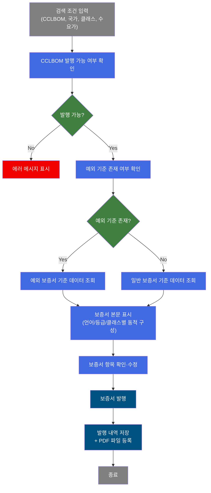
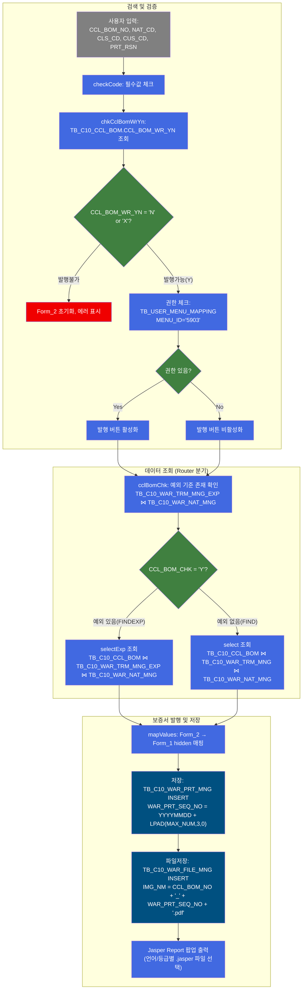
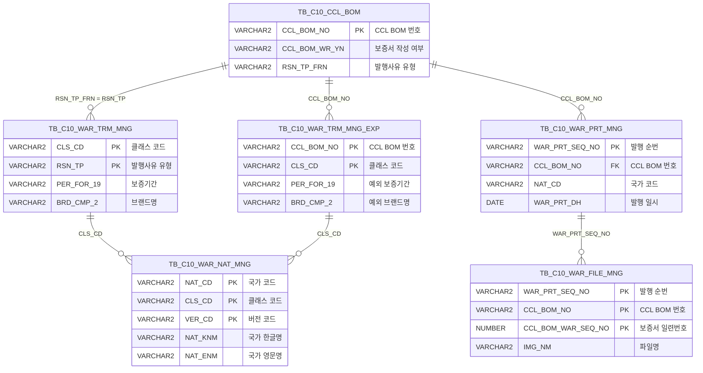

<h1 style="font-size: 40px; text-align: center; font-weight:
   bold; margin: 30px 0;">
  C106000110 레거시 시스템 분석 종합 보고서
</h1>


# 1. 시스템 개요
- **서비스 ID**: C106000110
- **업무명**: 보증서 출력관리
- **분석 일시**: 2026-03-17 11:08 KST
- **전체 Activity 수**: 11개 (Built-in 10, Common 1)
- **분석자**: Claude Opus 4.6 / Sonnet (Phase 4)
- **분석 도구**: /analyze-service C106000110
- **문서 버전**: 1.0

# 📊 비즈니스 프로세스 분석

## 시스템 목적

C106000110은 CCL(Color Coated Line) 공정에서 생산된 제품의 **품질 보증서(Warranty Certificate)를 조회·편집·발행**하는 서비스이다. CCL BOM 번호, 국가, 클래스(Class A/B), 최종수요가(고객) 정보를 기반으로 보증서 기준 데이터를 조회하고, 보증서 본문의 각 항목(보증기간, 브랜드명, 색상 변화 기준값, 부식 관통 기준 등)을 확인·수정한 뒤 발행 내역을 저장한다.

보증서는 **영문/한글** 두 가지 언어와 **PREMIUM/일반** 두 가지 등급, **Class A/Class B** 두 가지 클래스의 조합(총 8가지 경우의 수)에 따라 표시 항목과 보증 조건이 동적으로 변경된다. 발행 시에는 Jasper Report를 통해 PDF를 생성하고, 파일 관리 테이블에 자동 등록한다.

또한 특정 CCL BOM에 대해 **예외 보증서 기준**(TB_C10_WAR_TRM_MNG_EXP)이 존재하는 경우, 일반 기준 대신 예외 기준 데이터를 우선 적용하는 분기 로직이 포함되어 있다.

## 핵심 워크플로우 다이어그램



### 상세 워크플로우 다이어그램



## 주요 유즈케이스

### UC-01: 보증서 조회

- **Actor**: 품질관리 담당자
- **목적**: CCL BOM 번호 기반으로 해당 제품의 보증서 기준 데이터를 조회하여 보증 항목별 값을 확인

- **전제조건**:
  - 사용자가 시스템에 로그인되어 있음
  - 해당 CCL BOM에 대한 보증서 기준 데이터가 TB_C10_WAR_TRM_MNG 또는 TB_C10_WAR_TRM_MNG_EXP에 등록되어 있음
  - 국가별 보증서 관리 정보(TB_C10_WAR_NAT_MNG)가 설정되어 있음

- **주요 흐름**:
  1. 사용자가 CCL_BOM_NO, 국가(NAT_CD), 클래스(CLS_CD), 최종수요가(CUS_CD), 발행사유(PRT_RSN) 입력
  2. 조회 버튼 클릭 → checkCode 필수값 검증
  3. chkCclBomWrYn: CCLBOM 발행 가능 여부 확인 (C106000110_cclBomChk.select)
  4. 예외TB 조회: CCL BOM의 예외 기준 존재 여부 확인 (C106000110.cclBomChk)
  5. 예외CCLBOM유무(C10CmnRouter): CCL_BOM_CHK='Y'이면 FINDEXP(예외조회), 아니면 FIND(일반조회)로 분기
  6. Form_2에 보증서 본문 데이터 표시 → hiddenFormItem으로 DIV_CD/CLS_CD/radio1 기반 동적 show/hide

- **대체 흐름**:
  - CCLBOM 미등록 (CCL_BOM_WR_YN='X'): "해당 CCLBOM은 품질보증서가 등록되어있지 않습니다" 표시
  - CCLBOM 발행불가 (CCL_BOM_WR_YN='N'): "해당 CCLBOM은 품질보증서 발행이 불가합니다" 표시
  - 필수값 미입력: 해당 필드별 alert 메시지 표시

- **후행조건**:
  - 보증서 본문이 Form_2에 표시됨
  - 권한이 있는 경우 발행 버튼 활성화

### UC-02: 보증서 발행 (저장 및 PDF 생성)

- **Actor**: 보증서 발행 권한이 있는 품질관리 담당자
- **목적**: 보증서 내용을 확정하고 발행 이력을 저장한 후 PDF 보증서를 출력

- **전제조건**:
  - UC-01 조회가 완료되어 보증서 데이터가 Form_2에 표시된 상태
  - 사용자가 보증서 출력 권한(MENU_ID='5903')을 보유
  - 발행 버튼이 활성화된 상태

- **주요 흐름**:
  1. 사용자가 보증서 본문 항목(BRD_CMP_2, NAT_ENM, GT_MT, GT_FT 등) 확인/수정
  2. 발행 버튼 클릭 → checkCode 필수값 검증 → mapValues로 Form_2 값을 Form_1 hidden 필드에 매핑
  3. 저장: C106000110.insert 실행 → TB_C10_WAR_PRT_MNG에 발행 내역 INSERT (WAR_PRT_SEQ_NO 자동 채번)
  4. 파일저장: C106000110.Fileinsert 실행 → TB_C10_WAR_FILE_MNG에 파일 정보 INSERT
  5. prtRpt: 언어(KOR/ENG) × 등급(PREMIUM/일반) 조합으로 Jasper 파일 선택 → 팝업 출력

- **대체 흐름**:
  - 저장 실패: 에러 메시지 표시, 재시도 가능
  - 권한 없음: 발행 버튼 비활성화 상태로 발행 불가

- **후행조건**:
  - TB_C10_WAR_PRT_MNG에 발행 이력 저장됨
  - TB_C10_WAR_FILE_MNG에 PDF 파일 정보 등록됨
  - Jasper Report PDF가 팝업으로 출력됨

### UC-03: 언어/클래스별 보증서 항목 동적 전환

- **Actor**: 품질관리 담당자
- **목적**: 보증서의 언어(한글/영문)와 등급/클래스 조합에 따라 보증서 항목을 동적으로 전환하여 적절한 보증 조건을 표시

- **전제조건**:
  - 보증서 데이터가 조회되어 Form_2에 표시된 상태

- **주요 흐름**:
  1. 사용자가 radio1(한글/영문) 변경 → OnRadioChanged 이벤트 발생
  2. 영문 선택 시: 수치 입력 필드(PER_FOR_6, FA_TRM_7/8, FA_WAL_11/12 등) show, 한글 라벨 hide
  3. 한글 선택 시: 수치 입력 필드 hide, 한글 보증 조항 라벨 show
  4. DIV_CD(PREMIUM/일반)에 따라: PREMIUM이면 D항목(blockC) 숨김, 일반이면 표시
  5. CLS_CD(CLASSA/CLASSB)에 따라: 해당 클래스 보증 조건 라벨 표시, 나머지 숨김

- **대체 흐름**:
  - 데이터 미조회 상태에서 라디오 변경: Form_2가 빈 상태이므로 표시 변화 없음

- **후행조건**:
  - 선택된 조합에 해당하는 보증서 항목만 화면에 표시됨
  - BRD_CMP_2 계열 8개 필드 동기화 유지

### UC-04: 예외 보증서 기준 적용

- **Actor**: 품질관리 담당자
- **목적**: 특정 CCL BOM에 대해 고객/국가별 예외 보증 기준이 설정된 경우, 일반 기준 대신 예외 기준을 적용하여 보증서 발행

- **전제조건**:
  - TB_C10_WAR_TRM_MNG_EXP에 해당 CCL_BOM_NO + NAT_CD + CLS_CD 조합의 예외 기준이 등록됨

- **주요 흐름**:
  1. 조회 실행 시 cclBomChk 쿼리로 예외 기준 존재 여부 확인
  2. C10CmnRouter가 CCL_BOM_CHK='Y' 판정 → FINDEXP 경로로 분기
  3. selectExp 쿼리: TB_C10_WAR_TRM_MNG_EXP 테이블에서 예외 보증 기준 데이터 조회
  4. Form_2에 예외 기준 데이터 표시 (보증기간, 색변화 기준 등이 일반과 다를 수 있음)

- **대체 흐름**:
  - 예외 기준 미존재(CCL_BOM_CHK≠'Y'): FIND 경로로 분기하여 일반 기준(TB_C10_WAR_TRM_MNG) 조회

- **후행조건**:
  - 예외 보증 기준이 적용된 보증서 데이터가 표시됨

---

## 비즈니스 로직 상세

### 1. 예외/일반 보증서 기준 분기 로직

- **목적**: CCL BOM별로 예외 보증서 기준이 존재하는 경우 예외 기준을 우선 적용하고, 미존재 시 일반 기준을 조회
- **처리 케이스**:

  **[케이스 1: 예외 기준 존재]**
  ```
    조건: TB_C10_WAR_TRM_MNG_EXP에 CCL_BOM_NO + NAT_CD + CLS_CD 조합의 레코드 존재
    처리:
      1. cclBomChk 쿼리: CCL_BOM_CHK='Y' 반환
      2. C10CmnRouter: routers="CCL_BOM_CHK/Y/FINDEXP/FIND" → FINDEXP 경로
      3. selectExp 쿼리: TB_C10_CCL_BOM ⋈ TB_C10_WAR_TRM_MNG_EXP ⋈ TB_C10_WAR_NAT_MNG
      4. 예외 기준의 PER_FOR_19, BRD_CMP_2, NAT_ENM 등 조회
  ```

  **[케이스 2: 일반 기준 적용]**
  ```
    조건: 예외 기준 미존재 (CCL_BOM_CHK≠'Y')
    처리:
      1. C10CmnRouter: FIND 경로로 분기
      2. select 쿼리: TB_C10_CCL_BOM ⋈ TB_C10_WAR_TRM_MNG ⋈ TB_C10_WAR_NAT_MNG
      3. 일반 기준의 보증 항목 조회
      4. RSN_TP_FRN = RSN_TP 조인 조건으로 발행사유 유형별 기준 매칭
  ```

### 2. 보증서 발행번호 자동 채번

- **목적**: 보증서 발행 시 고유한 발행 순번(WAR_PRT_SEQ_NO)을 자동 생성
- **계산 공식**:

  ```
  WAR_PRT_SEQ_NO = TO_CHAR(SYSDATE, 'YYYYMMDD') || LPAD(MAX_NUM, 3, 0)

  MAX_NUM = (SELECT NVL(MAX(TO_NUMBER(SUBSTR(WAR_PRT_SEQ_NO,9,3))),0) + 1
             FROM C10APUSER.TB_C10_WAR_PRT_MNG
             WHERE SUBSTR(WAR_PRT_SEQ_NO,1,8) = TO_CHAR(SYSDATE,'YYYYMMDD'))

  예시:
  2026-03-17 첫 번째 발행: WAR_PRT_SEQ_NO = '20260317001'
  2026-03-17 두 번째 발행: WAR_PRT_SEQ_NO = '20260317002'
  ```

### 3. 보증서 PDF 파일명 생성 및 등록

- **목적**: 발행된 보증서를 PDF 파일로 관리
- **처리 케이스**:

  **[파일명 생성 규칙]**
  ```
    처리:
      1. IMG_NM = CCL_BOM_NO || '_' || WAR_PRT_SEQ_NO || '.pdf'
      2. CCL_BOM_RGS_DH = SYSDATE (등록 일시)
      3. TB_C10_WAR_FILE_MNG에 INSERT (MERGE 패턴: 존재 시 UPDATE)
  ```

### 4. 보증서 항목 동적 Show/Hide 규칙

- **목적**: DIV_CD(등급), CLS_CD(클래스), radio1(언어) 3개 조건의 조합으로 보증서 항목의 가시성을 제어
- **처리 케이스**:

  **[케이스 1: PREMIUM + Class A + 영문]**
  ```
    표시: A항목(부식관통), B항목(도막밀착성), C항목(초킹) — D항목(색변화) 숨김
    수치입력: PER_FOR_6/19, PE_FL_1/20, CH_TRM_13/14, CH_WAL_17/18, CH_ROF_15/16 표시
  ```

  **[케이스 2: 일반 + Class B + 영문]**
  ```
    표시: A~E항목 전체 표시 (D항목=색변화 포함)
    추가: FA_TRM_7/8, FA_WAL_11/12, FA_ROF_9/10 (색변화 delta E Hunter 값) 표시
    NAT_ENM_1 (국가명 확인 입력) 추가 표시
  ```

  **[케이스 3: 한글 선택 시]**
  ```
    처리: 영문 수치 입력 필드 일괄 hide, 한글 라벨로 전환
    동기화: BRD_CMP_2 계열 8개 필드 값 동기화 유지
  ```

---

# 💾 데이터 요구사항

## 핵심 테이블

### 1. TB_C10_CCL_BOM - (CCL BOM 기본 정보)
| 컬럼명 | 타입 | PK | 설명 |
|--------|------|----|-----|
| CCL_BOM_NO | VARCHAR2 | ✅ | CCL BOM 번호 |
| CCL_BOM_WR_YN | VARCHAR2(1) | | 보증서 작성 여부 (Y/N) |
| RSN_TP_FRN | VARCHAR2 | | 발행사유 유형 (외래키) |

### 2. TB_C10_WAR_TRM_MNG - (보증서 기준 관리)
| 컬럼명 | 타입 | PK | 설명 |
|--------|------|----|-----|
| CLS_CD | VARCHAR2 | ✅ | 클래스 코드 (CLASSA/CLASSB) |
| RSN_TP | VARCHAR2 | ✅ | 발행사유 유형 |
| PER_FOR_19 | VARCHAR2 | | 보증기간 (년) |
| BRD_CMP_2 | VARCHAR2 | | 브랜드/제품명 |
| PER_FOR_6 | VARCHAR2 | | 부식관통 보증기간 |
| PE_FL_20 | VARCHAR2 | | 도막밀착 보증기간 |
| PE_FL_1 | VARCHAR2 | | 도막밀착 보증기간 |
| FA_TRM_7 | VARCHAR2 | | 색변화 기준 (벽면 연수) |
| FA_TRM_8 | VARCHAR2 | | 색변화 기준 (벽면 연수) |
| FA_WAL_11 | VARCHAR2 | | 색변화 delta E (벽면) |
| FA_WAL_12 | VARCHAR2 | | 색변화 delta E (벽면) |
| FA_ROF_9 | VARCHAR2 | | 색변화 delta E (지붕) |
| FA_ROF_10 | VARCHAR2 | | 색변화 delta E (지붕) |
| CH_TRM_13 | VARCHAR2 | | 초킹 기준 (연수) |
| CH_TRM_14 | VARCHAR2 | | 초킹 기준 (연수) |
| CH_WAL_17 | VARCHAR2 | | 초킹 등급 (벽면) |
| CH_WAL_18 | VARCHAR2 | | 초킹 등급 (벽면) |
| CH_ROF_15 | VARCHAR2 | | 초킹 등급 (지붕) |
| CH_ROF_16 | VARCHAR2 | | 초킹 등급 (지붕) |

### 3. TB_C10_WAR_TRM_MNG_EXP - (보증서 예외 기준 관리)
| 컬럼명 | 타입 | PK | 설명 |
|--------|------|----|-----|
| CCL_BOM_NO | VARCHAR2 | ✅ | CCL BOM 번호 |
| CLS_CD | VARCHAR2 | ✅ | 클래스 코드 |
| PER_FOR_19 | VARCHAR2 | | 예외 보증기간 |
| BRD_CMP_2 | VARCHAR2 | | 예외 브랜드/제품명 |

### 4. TB_C10_WAR_NAT_MNG - (보증서 국가 관리)
| 컬럼명 | 타입 | PK | 설명 |
|--------|------|----|-----|
| NAT_CD | VARCHAR2 | ✅ | 국가 코드 |
| CLS_CD | VARCHAR2 | ✅ | 클래스 코드 |
| VER_CD | VARCHAR2 | ✅ | 버전 코드 |
| NAT_KNM | VARCHAR2 | | 국가 한글명 |
| NAT_ENM | VARCHAR2 | | 국가 영문명 |

### 5. C10APUSER.TB_C10_WAR_PRT_MNG - (보증서 발행 관리)
| 컬럼명 | 타입 | PK | 설명 |
|--------|------|----|-----|
| WAR_PRT_SEQ_NO | VARCHAR2(12) | ✅ | 발행 순번 (YYYYMMDD + 3자리 일련번호) |
| CCL_BOM_NO | VARCHAR2 | | CCL BOM 번호 |
| NAT_CD | VARCHAR2 | | 국가 코드 |
| WAR_PRT_EMP_ID | VARCHAR2 | | 발행자 사번 |
| WAR_PRT_DH | DATE | | 발행 일시 |
| FNL_CUS_CD | VARCHAR2 | | 최종수요가 코드 |
| PRT_RSN | VARCHAR2 | | 발행 사유 |
| BRD_CMP_2 | VARCHAR2 | | 브랜드/제품명 |
| GT_MT | VARCHAR2 | | 거리 (미터) |
| GT_FT | VARCHAR2 | | 거리 (피트) |
| SPC_TXT | VARCHAR2 | | 비고 텍스트 |

### 6. TB_C10_WAR_FILE_MNG - (보증서 파일 관리)
| 컬럼명 | 타입 | PK | 설명 |
|--------|------|----|-----|
| WAR_PRT_SEQ_NO | VARCHAR2 | ✅ | 발행 순번 |
| CCL_BOM_NO | VARCHAR2 | ✅ | CCL BOM 번호 |
| CCL_BOM_WAR_SEQ_NO | NUMBER | ✅ | 보증서 일련번호 |
| SEQ_NO | NUMBER | ✅ | 파일 일련번호 |
| IMG_RGS_TP | NUMBER | | 이미지 등록 유형 |
| IMG_ADR | VARCHAR2 | | 이미지 주소 |
| IMG_NM | VARCHAR2 | | 이미지 파일명 (CCL_BOM_NO_WAR_PRT_SEQ_NO.pdf) |
| CCL_BOM_RGS_DH | DATE | | 등록 일시 |
| PRD_SPC_TP | NUMBER | | 제품 규격 유형 |

### 7. M90APUSER.TB_SEC_USER / TB_USER_MENU_MAPPING - (권한 관리)
| 컬럼명 | 타입 | PK | 설명 |
|--------|------|----|-----|
| USER_ID | VARCHAR2 | ✅ | 사용자 ID |
| USER_NO | VARCHAR2 | | 사용자 번호 |
| MENU_ID | VARCHAR2 | | 메뉴 ID (5903=보증서출력) |

## 데이터 플로우

### 1. 조회 (일반 기준)
```
[보증서 기준 데이터 조회 - 일반]
검색 조건 입력 (CCL_BOM_NO, NAT_CD, CLS_CD, CUS_CD)
→ C106000110.cclBomChk
  FROM TB_C10_WAR_TRM_MNG_EXP TRM
  INNER JOIN TB_C10_WAR_NAT_MNG NAT ON TRM.CLS_CD = NAT.CLS_CD
  WHERE CCL_BOM_NO = :CCL_BOM_NO AND NAT_CD = :NAT_CD AND CLS_CD = :CLS_CD
→ CCL_BOM_CHK ≠ 'Y' → FIND 분기

→ C106000110.select
  FROM TB_C10_CCL_BOM A
  INNER JOIN TB_C10_WAR_TRM_MNG B ON A.RSN_TP_FRN = B.RSN_TP
  INNER JOIN TB_C10_WAR_NAT_MNG C ON B.CLS_CD = C.CLS_CD
  WHERE A.CCL_BOM_NO = :CCL_BOM_NO AND C.NAT_CD = :NAT_CD
    AND B.CLS_CD = :CLS_CD AND A.FNL_CUS_CD = :CUS_CD
→ Form_2에 보증서 본문 데이터 표시
```

### 2. 조회 (예외 기준)
```
[보증서 기준 데이터 조회 - 예외]
→ C106000110.cclBomChk → CCL_BOM_CHK = 'Y' → FINDEXP 분기

→ C106000110.selectExp
  FROM TB_C10_CCL_BOM A
  INNER JOIN TB_C10_WAR_TRM_MNG_EXP B ON A.CCL_BOM_NO = B.CCL_BOM_NO
  INNER JOIN TB_C10_WAR_NAT_MNG C ON B.CLS_CD = C.CLS_CD
  WHERE A.CCL_BOM_NO = :CCL_BOM_NO AND C.NAT_CD = :NAT_CD
    AND B.CLS_CD = :CLS_CD AND A.FNL_CUS_CD = :CUS_CD
→ Form_2에 예외 보증서 데이터 표시
```

### 3. 저장 (발행)
```
[보증서 발행 내역 저장]
발행 버튼 클릭
→ C106000110.insert
  INSERT INTO C10APUSER.TB_C10_WAR_PRT_MNG
    (WAR_PRT_SEQ_NO, CCL_BOM_NO, NAT_CD, WAR_PRT_EMP_ID, WAR_PRT_DH,
     FNL_CUS_CD, PRT_RSN, BRD_CMP_2, GT_MT, GT_FT, SPC_TXT)
  VALUES (자동채번, :CCL_BOM_NO, :NAT_CD, :ObjectId, SYSDATE,
          :CUS_CD, :PRT_RSN, :BRD_CMP_2, :GT_MT, :GT_FT, :SPC_TXT)
→ 발행 이력 저장 완료

→ C106000110.Fileinsert
  INSERT INTO TB_C10_WAR_FILE_MNG
    (WAR_PRT_SEQ_NO, CCL_BOM_NO, CCL_BOM_WAR_SEQ_NO, SEQ_NO,
     IMG_RGS_TP, IMG_ADR, IMG_NM, CCL_BOM_RGS_DH, PRD_SPC_TP)
  VALUES (최신발행번호, :CCL_BOM_NO, ...)
→ PDF 파일 정보 등록 완료
```

### 4. 콤보 데이터 조회
```
[국가 목록 조회]
→ C106000110_selNat.select
  SELECT DISTINCT NAT_CD, NAT_KNM
  FROM TB_C10_WAR_NAT_MNG
  WHERE VER_CD = (SELECT MAX(VER_CD) FROM TB_C10_WAR_NAT_MNG)
→ NAT_CD 콤보 데이터 바인딩

[클래스 목록 조회]
→ C106000110.selectClass
  SELECT CLS_CD
  FROM TB_C10_WAR_NAT_MNG
  WHERE NAT_CD = :NAT_CD
    AND VER_CD = (SELECT MAX(VER_CD) FROM TB_C10_WAR_NAT_MNG WHERE NAT_CD = :NAT_CD)
→ CLS_CD 콤보 데이터 바인딩 (NAT_CD 연동)
```

## SQL 일람표

| SQL 이름 | 쿼리 ID | 타입 | 출처 | 테이블 |
|---------|---------|-----|-------|-------|
| 예외기준조회 | C106000110.selectExp | SELECT | Service | TB_C10_CCL_BOM, TB_C10_WAR_TRM_MNG_EXP, TB_C10_WAR_NAT_MNG |
| 국가코드조회 | C106000110_selNat.select | SELECT | Service | TB_C10_WAR_NAT_MNG |
| 출력권한체크 | C106000110.selectAuthority | SELECT | Service | M90APUSER.TB_SEC_USER, M90APUSER.TB_USER_MENU_MAPPING |
| 클래스조회 | C106000110.selectClass | SELECT | Service | TB_C10_WAR_NAT_MNG |
| 예외BOM체크 | C106000110.cclBomChk | SELECT | Service | TB_C10_WAR_TRM_MNG_EXP, TB_C10_WAR_NAT_MNG |
| 보증서조회 | C106000110.select | SELECT | Service | TB_C10_CCL_BOM, TB_C10_WAR_TRM_MNG, TB_C10_WAR_NAT_MNG |
| CCLBOM발행확인 | C106000110_cclBomChk.select | SELECT | Service | TB_C10_CCL_BOM |
| 파일등록 | C106000110.Fileinsert | INSERT | Service | TB_C10_WAR_FILE_MNG, C10APUSER.TB_C10_WAR_PRT_MNG |
| 발행내역저장 | C106000110.insert | INSERT | Service | C10APUSER.TB_C10_WAR_PRT_MNG |

## ER 다이어그램 (핵심 관계)



관계 설명:
- **TB_C10_CCL_BOM**이 중심 테이블로 보증서 기준(일반/예외) 및 발행 관리와 연결
- TB_C10_WAR_TRM_MNG(일반 기준)과 TB_C10_WAR_TRM_MNG_EXP(예외 기준)는 병렬 관계
- TB_C10_WAR_NAT_MNG: CLS_CD를 통해 일반/예외 기준 모두와 연결
- TB_C10_WAR_PRT_MNG → TB_C10_WAR_FILE_MNG: WAR_PRT_SEQ_NO 기반 1:N 관계

---

# 🖥️ 사용자 인터페이스 요구사항

## 화면 레이아웃 상세

### Layout 구조 (절대좌표 배치)
```javascript
// initLayout 미사용 - div 절대좌표 배치 방식
{
  totalWidth: "964px",
  totalHeight: "1093px",
  components: [
    {
      id: "C106000110_Form_1",
      type: "form",
      position: { top: "0px", left: "0px" },
      size: { height: "61px", width: "964px" },
      description: "검색 조건 및 버튼 영역"
    },
    {
      id: "C106000110_Form_2",
      type: "form",
      position: { top: "61px", left: "0px" },
      size: { height: "1013px", width: "964px" },
      description: "보증서 본문 내용 입력 폼"
    },
    {
      id: "C106000110_messagebox",
      type: "messagebox",
      position: { top: "1072px", left: "0px" },
      size: { height: "19px", width: "962px" },
      description: "메시지 표시 영역"
    }
  ]
}
```

## 입출력 요소

### Form 컴포넌트

**C106000110_Form_1 (검색 조건/버튼 영역)**
- CCL_BOM_NO: Input - CCLBOM 번호 (75px, 필수, 영문 대문자 자동변환, Enter키 조회)
- NAT_CD: Combo - 국가 (130px, 필수, readonly, 선택 시 CLS_CD 콤보 동적 갱신)
- CLS_CD: Combo - 클래스 (80px, 필수, readonly, NAT_CD 연동)
- CUS_CD: Input - 최종수요가 코드 (60px, 필수, maxLength 6)
- template(serchIcon_CUS_CD): Template - 최종수요가 검색 아이콘 → masterPopup 호출
- find: Button - 조회
- prtRpt: LinkButton - 발행 (75px, 기본 disabled, 권한 시 활성화, 보증서 출력 팝업 호출)
- winClose: Button - 닫기
- PRT_RSN: Combo - 발행사유 (150px, 필수, static: 사전영업용/WARRANTY발급용)
- radio1: Radio - 한글/영문 선택 (기본=ENG, 변경 시 Form_2 항목 show/hide)

  **Hidden 필드 (20개 - Form_2 값 저장용)**:
  - PER_FOR_19, BRD_CMP_2, PER_FOR_6, FA_TRM_7, FA_TRM_8, FA_WAL_12, FA_WAL_11
  - FA_ROF_10, FA_ROF_9, CH_TRM_14, CH_TRM_13, CH_WAL_18, CH_WAL_17, CH_ROF_15, CH_ROF_16
  - PE_FL_20, PE_FL_1, CUS_NM, GT_MT, GT_FT, SPC_TXT

**C106000110_Form_2 (보증서 본문 입력 폼)**
- DIV_CD/CLS_CD/BRD_CMP_2_CHECK/WAR_PRT_SEQ_NO: Hidden - 상태 제어용
- PER_FOR_19: Input (35px, readonly) - 보증기간 (년)
- BRD_CMP_2: Input (100px) - 브랜드/제품명 (8개 동기화 필드의 원본)
- F_CCL_BOM_NO: Input (80px) - CCLBOM번호 표시용
- NAT_ENM: Input (150px) - 국가명 영문
- CUS_NM: Input (100px) - 최종수요가명
- SPC_TXT: Input (700px) - 비고 텍스트
- GT_MT: Input (35px) - 거리 (미터)
- GT_FT: Input (35px) - 거리 (피트)

  **보증 조건 수치 입력 (영문 시 표시)**:
  - PER_FOR_6: Input (35px) - 부식관통 보증기간
  - PER_FOR_19_1: Input (35px) - 보증기간 확인 (PER_FOR_19 동기화)
  - PE_FL_20/PE_FL_1: Input (35px) - 도막밀착 보증기간
  - FA_TRM_7/8: Input (35px) - 색변화 기준 연수 (일반등급 시 표시)
  - FA_WAL_11/12: Input (35px) - 색변화 delta E Hunter (벽면)
  - FA_ROF_9/10: Input (35px) - 색변화 delta E Hunter (지붕)
  - CH_TRM_13/14: Input (35px) - 초킹 기준 연수
  - CH_WAL_17/18: Input (35px) - 초킹 등급 (벽면)
  - CH_ROF_15/16: Input (35px) - 초킹 등급 (지붕)

  **브랜드명 동기화 필드**:
  - BRD_CMP_2_1~7: Input (100px) - BRD_CMP_2와 양방향 동기화 (총 8개)

  **보증서 조항 라벨 (약 40개)**:
  - SS_1~5: 서문 (DONGKUK CM provides the following warranty...)
  - S1_1~3: 1조 (부식관통 보증)
  - S1A0_1, S1A_1~3: A항목 (보증기간 기산일, 부식관통)
  - S1B_1~4: B항목 (도막밀착)
  - blockC 내 S1C_1~7: C→D항목 (색변화, PREMIUM이면 숨김)
  - S1D_2~5: D→E항목 (초킹)
  - S3~S9, SA~SE: 3~10조 (면책, 책임범위, 클레임 절차 등)

  **조건부 표시 라벨**:
  - primiumClassA/B: PREMIUM 등급 조건문
  - universalClassA/B: 일반 등급 조건문
  - labelD/labelChgToC: PREMIUM 여부에 따라 항목번호 변경 (D↔C)

## 화면 동작 흐름

### 1. 화면 초기 로딩
```
1. 화면 진입 (JSP 로드)
2. onFormLoadFunction: Form_1 초기화
   - comboList() 호출
   - NAT_CD 콤보 로드 (C106000110_selNat.select)
   - PRT_RSN 콤보 static 초기화 (사전영업용, WARRANTY발급용)
   - CCL_BOM_NO 입력 이벤트 바인딩 (대문자변환, Enter키 조회)
3. onFormLoadFunction2: Form_2 초기화
   - 기본 항목 hide 처리 (전체 보증 항목 초기 숨김)
   - ctl_tp 권한 확인 (C10A2184 EasyAccess 기준)
   - 권한 없으면 Form_2 전체 disable
4. 상태바(messagebox) 초기화
```

### 2. 보증서 조회
```
1. 사용자가 CCL_BOM_NO, NAT_CD, CLS_CD, CUS_CD, PRT_RSN 입력
2. NAT_CD 선택 시 → CLS_CD 콤보 동적 갱신 (C106000110.selectClass)
3. 조회 버튼(find) 클릭
4. checkCode(): 필수값 검증 (CCL_BOM_NO, NAT_CD, CLS_CD, PRT_RSN, CUS_CD)
5. chkCclBomWrYn(): AJAX 호출
   - c10AjaxData.do → C106000110_cclBomChk.select (발행가능 여부)
   - c10AjaxData.do → C106000110.selectAuthority (출력 권한)
6. 발행가능 시: basicFormData.do → C106000110-service (find 명령)
7. 서버: 예외TB 조회 → C10CmnRouter 분기 → 예외/일반 조회
8. Form_2에 데이터 바인딩 → hiddenFormItem() 호출
9. DIV_CD/CLS_CD/radio1 기반 동적 show/hide 처리
```

### 3. 보증서 발행 (PDF 출력)
```
1. 사용자가 Form_2 보증서 항목 확인/수정
2. 발행(prtRpt) 버튼 클릭
3. checkCode(): 필수값 재검증
4. mapValues('save'): Form_2 값 → Form_1 hidden 필드 매핑
5. handleDataProcess.do → C106000110-service (save 명령)
   - C106000110.insert: TB_C10_WAR_PRT_MNG INSERT
   - C106000110.Fileinsert: TB_C10_WAR_FILE_MNG INSERT
6. mapValues('prtRpt'): 출력 파라미터 문자열 생성 ($구분자)
7. 언어/등급별 Jasper 파일 선택:
   - ENG+일반 → C106000110.jasper
   - ENG+PREMIUM → C106000110_PREMIUM.jasper
   - KOR+일반 → C106000110_KOR.jasper
   - KOR+PREMIUM → C106000110_PREMIUM_KOR.jasper
8. iReport_list.jsp 팝업 오픈 (550x600)
```

### 4. 최종수요가 검색 팝업
```
1. serchIcon_CUS_CD 아이콘 클릭
2. masterPopup() 호출
3. masterGridData.do 팝업 오픈 (469x532)
   - CD_TP=CUS_CD, CATEGORY_GROUP_NM=SZ0000
4. 팝업에서 수요가 검색 및 선택
5. masterSetValue() 콜백: 선택된 코드를 Form_1.CUS_CD에 세팅
```

## JavaScript 모듈

**C106000110.jsp 내장 스크립트**
- onFormLoadFunction(): Form_1 초기화 (comboList, CCL_BOM_NO 이벤트 바인딩)
- onFormLoadFunction2(): Form_2 초기화 (항목 hide, ctl_tp 권한 체크)
- comboList(): NAT_CD/CLS_CD/PRT_RSN 콤보 초기화 (OrdlnComboData.do 호출)
- checkCode(): 필수값 입력 검증 (CCL_BOM_NO, NAT_CD, CLS_CD, PRT_RSN, CUS_CD)
- chkCclBomWrYn(): CCLBOM 발행가능 여부 + 권한 AJAX 체크 (c10AjaxData.do)
- hiddenFormItem(): Form_2 항목 동적 show/hide (DIV_CD/CLS_CD/radio1 조합)
- OnRadioChanged(): 한글/영문 전환 시 라벨 텍스트 및 입력필드 show/hide
- OnDataChanged(): BRD_CMP_2(8개), PER_FOR_19(2개), NAT_ENM(2개) 동기화
- mapValues(mode): Form_2 → Form_1 hidden 매핑 (save/prtRpt 모드)
- prtRpt(): Jasper Report 팝업 출력 (언어/등급별 파일 선택)
- masterPopup(): 최종수요가 검색 팝업 호출
- masterSetValue(): 팝업 선택값 콜백

## 주요 이벤트 핸들러

**OnRadioChanged (한글/영문 전환)**
- 이벤트 타입: Radio Change (radio1)
- 처리 내용:
  1. 선택 값(KOR/ENG) 확인
  2. ENG 선택: 영문 수치 입력 필드 show (PER_FOR_6, FA_TRM_7/8 등 약 15개)
  3. KOR 선택: 영문 수치 입력 필드 hide, 한글 라벨 표시
  4. hiddenFormItem() 재호출로 DIV_CD/CLS_CD 조건도 반영

**OnDataChanged (Form_2 값 동기화)**
- 이벤트 타입: Form Change
- 처리 내용:
  1. 변경된 필드 ID 확인
  2. BRD_CMP_2 계열: 어느 하나 변경 시 나머지 7개에 동일 값 복사
  3. PER_FOR_19 계열: PER_FOR_19 ↔ PER_FOR_19_1 동기화
  4. NAT_ENM 계열: NAT_ENM ↔ NAT_ENM_1 동기화

**comboList - NAT_CD 변경 시 CLS_CD 연동**
- 이벤트 타입: Combo Change (NAT_CD)
- 처리 내용:
  1. 선택된 NAT_CD 값 추출
  2. CLS_CD 콤보 클리어
  3. OrdlnComboData.do 호출 (NAT_CD 파라미터 전달)
  4. C106000110.selectClass 실행 → CLS_CD 콤보 재로드

---

# 📌 특이사항 및 주의사항

## 1. 다중 조건 조합에 의한 UI 동적 제어 복잡성
- **3개 조건의 8가지 조합**: DIV_CD(PREMIUM/일반) × CLS_CD(CLASSA/CLASSB) × radio1(KOR/ENG) = 8가지 경우의 수로 보증서 항목의 가시성이 결정됨. hiddenFormItem 함수에서 이 조합을 모두 처리해야 하며, 누락 시 잘못된 보증 조건이 표시될 위험이 있음.
- **항목번호 동적 변경**: PREMIUM 등급에서는 D항목(색변화)이 제거되면서 E항목이 C로 번호가 변경됨 (labelD → labelChgToC). 이 UI 트릭은 비즈니스 로직과 밀접하게 연결됨.

## 2. 필드 동기화 패턴의 특이성
- **BRD_CMP_2 8중 동기화**: 동일한 브랜드명이 보증서 본문 내 8개 위치에 반복 사용되어, 하나의 값 변경 시 나머지 7개 필드에 자동 복사. 이 양방향 동기화가 무한 루프를 방지하는 가드 로직이 필요함.
- **PER_FOR_19, NAT_ENM 이중 동기화**: 각각 2개 필드 간 동기화. OnDataChanged 핸들러에서 일괄 처리.

## 3. 발행번호 채번 방식의 동시성 위험
- **채번 공식**: `YYYYMMDD + LPAD(MAX+1, 3, 0)` 패턴으로 동일 날짜 내 순차 채번. SELECT MAX() 후 INSERT하는 방식이므로, 동시 발행 시 중복번호 충돌 가능성이 있음. 시퀀스 객체를 사용하지 않고 MAX+1 패턴 사용.
- **12자리 제한**: `YYYYMMDD` 8자리 + 3자리 일련번호 = 11자리. 하루 999건 초과 시 overflow 가능성.

## 4. 크로스 스키마 참조
- **MESAPUSER vs C10APUSER**: 조회는 MESAPUSER 스키마(mesdao)를 사용하지만, 발행 내역 저장은 `C10APUSER.TB_C10_WAR_PRT_MNG` 테이블에 직접 스키마를 명시하여 INSERT. DAO 설정과 쿼리 내 스키마 참조가 혼재되어 있음.
- **M90APUSER 권한 테이블**: 보증서 출력 권한 확인 시 M90APUSER 스키마의 TB_SEC_USER, TB_USER_MENU_MAPPING을 직접 참조.

## 5. Jasper Report 파일 4종 관리
- **4개 Jasper 파일**: C106000110.jasper, C106000110_PREMIUM.jasper, C106000110_KOR.jasper, C106000110_PREMIUM_KOR.jasper — 언어와 등급 조합별로 별도 리포트 템플릿 사용. 보증 조건 변경 시 4개 파일 모두 수정 필요.

## 6. 파일 관리 MERGE 패턴
- **Fileinsert 쿼리**: insert-sql과 update-sql이 동일한 `C106000110.Fileinsert`를 참조. 이는 MERGE(INSERT ... ON DUPLICATE UPDATE) 패턴으로 구현되어 있어, 동일 키 존재 시 UPDATE로 동작.

---

# 📚 참고 문서

- **Service XML**: `src/service/C106000110-service.xml`
- **Query SQL**: `src/query/C106000110-query.glue_sql`, `src/query/C106000110_selNat-query.glue_sql`, `src/query/C106000110_cclBomChk-query.glue_sql`
- **JSP**: `WebContents/C106000110.jsp`
- **Form XML**: `WebContents/header/kr/C106000110/C106000110_Form_1.xml`, `WebContents/header/kr/C106000110/C106000110_Form_2.xml`
- **Messagebox XML**: `WebContents/header/kr/C106000110/C106000110_messagebox.xml`
- **Jasper Report**: `C106000110.jasper`, `C106000110_PREMIUM.jasper`, `C106000110_KOR.jasper`, `C106000110_PREMIUM_KOR.jasper`
