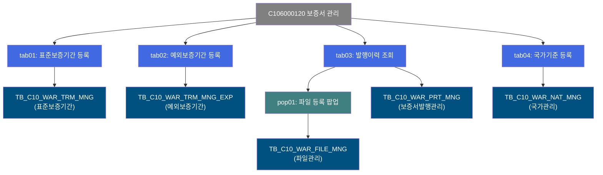
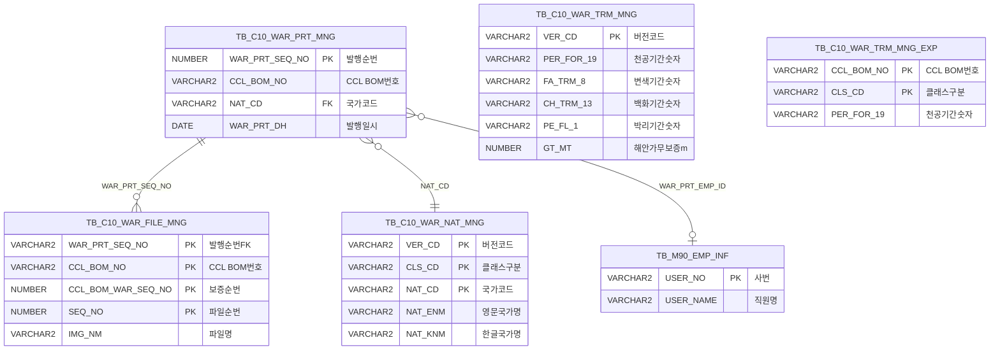

<h1 style="font-size: 40px; text-align: center; font-weight:
   bold; margin: 30px 0;">
  C106000120 레거시 시스템 분석 종합 보고서
</h1>


# 1. 시스템 개요
- **서비스 ID**: C106000120
- **업무명**: 보증서 관리
- **분석 일시**: 2026-03-17 12:03 KST
- **분석 시간**: ~15분 (전체 서브서비스 포함)
- **전체 Activity 수**: 0개 (부모 서비스는 빈 컨테이너, 서브서비스에 총 24개 Activity)
- **분석자**: Claude Opus 4.6 + Sonnet (Phase 4), Haiku (SQL cache)
- **분석 도구**: /analyze-service C106000120
- **문서 버전**: 1.0

# 📊 비즈니스 프로세스 분석

## 시스템 목적

C106000120은 CCL(Color Coating Line) 공정의 **보증서 관리 시스템**으로, 제품 품질 보증에 필요한 보증 기간 기준 데이터를 등록·관리하고, 발행된 보증서의 이력을 조회하며, 보증서에 사용되는 국가 기준 정보를 관리하는 종합 화면이다.

본 서비스는 `initial="end"`로 설정된 **부모 컨테이너 서비스**로, 자체 비즈니스 로직은 없으며 4개의 탭 서비스와 1개의 팝업 서비스로 구성된다. 각 탭은 보증서 관리의 서로 다른 업무 영역을 담당한다:

- **tab01 (표준보증기간 등록)**: 제품 보증 기간 기준값(천공/변색/백화/박리/해안가 무보증)을 버전 단위로 관리
- **tab02 (예외보증기간 등록)**: CCL BOM 기반 예외 보증 기간을 관리 (표준 기준의 예외 케이스)
- **tab03 (발행이력 조회)**: 발행된 보증서의 이력을 다양한 조건으로 조회
- **tab04 (국가기준 등록)**: 보증서에 사용되는 국가 코드/명칭 마스터를 버전 단위로 관리
- **pop01 (파일 등록 팝업)**: 보증서에 첨부하는 영문 보증서 파일을 업로드/삭제

이 시스템은 수출용 CCL 제품의 품질 보증을 위한 핵심 인프라로, 보증 기간 기준 데이터가 보증서 발행 시 자동으로 참조된다.

## 핵심 워크플로우 다이어그램



## 주요 유즈케이스

### UC-01: 표준 보증기간 기준 등록 (tab01)
- **Actor**: 보증서 관리 담당자
- **목적**: 제품 표준 보증 기간(천공/변색/백화/박리/해안가 무보증)을 버전 단위로 등록·관리
- **주요 흐름**: 조회/수정 모드 전환 → 최신 버전 데이터 편집 → 저장 → 버전 추가(일괄 복사) 지원
- **핵심 테이블**: C10APUSER.TB_C10_WAR_TRM_MNG (PK: VER_CD)

### UC-02: 예외 보증기간 등록 (tab02)
- **Actor**: 보증서 관리 담당자
- **목적**: CCL BOM 기반 예외 보증 기간을 등록하여 특정 제품의 보증 조건 개별 관리
- **주요 흐름**: CCLBOM번호 입력 → 해당 BOM의 보증 기간 조회/편집 → 저장
- **핵심 테이블**: C10APUSER.TB_C10_WAR_TRM_MNG_EXP (PK: CCL_BOM_NO + CLS_CD)

### UC-03: 보증서 발행이력 조회 (tab03)
- **Actor**: 품질보증 담당자 / 영업 담당자
- **목적**: 발행일자/발행자/국가/CCLBOM 조건으로 보증서 발행 이력 검색
- **주요 흐름**: 조건 입력 → 조회 → Grid에 발행 이력 표시 → 셀 클릭으로 파일 등록 팝업 호출
- **핵심 테이블**: C10APUSER.TB_C10_WAR_PRT_MNG (PK: WAR_PRT_SEQ_NO)

### UC-04: 국가기준 등록 (tab04)
- **Actor**: 보증서 관리 담당자
- **목적**: 보증서에 사용되는 국가 코드/영문명/한글명을 버전 단위로 관리
- **주요 흐름**: 조회/수정 모드 전환 → 국가 정보 편집 → 저장 → 버전 추가(일괄 복사) 지원
- **핵심 테이블**: C10APUSER.TB_C10_WAR_NAT_MNG (PK: VER_CD + CLS_CD + NAT_CD)

### UC-05: 영문 보증서 파일 관리 (pop01)
- **Actor**: 품질보증 담당자
- **목적**: 특정 보증서에 영문 보증서 파일을 업로드/다운로드/삭제
- **주요 흐름**: 부모 화면에서 파라미터 전달 → dhtmlXVault로 파일 업로드 → 파일 목록 Grid 표시 → 다운로드/삭제
- **핵심 테이블**: C10APUSER.TB_C10_WAR_FILE_MNG (PK: WAR_PRT_SEQ_NO + CCL_BOM_NO + CCL_BOM_WAR_SEQ_NO + SEQ_NO)

---

## 비즈니스 로직 상세

### 1. 버전 관리 체계 (tab01, tab04 공통)
- **목적**: 보증기간 기준 및 국가 기준 데이터를 버전 단위로 이력 관리
- **처리 케이스**:

  **[케이스 1: SETTING 라디오 분기]**
  ```
    SETTING='N' (조회 모드): VER_CD >= 0 → 전체 버전 조회, 읽기 전용
    SETTING='Y' (수정 모드): VER_CD >= MAX(VER_CD) → 최신 버전만 조회, 편집 가능
  ```

  **[케이스 2: 버전 추가 (INSERT...SELECT)]**
  ```
    처리:
      1. MAX(TO_NUMBER(VER_CD)) + 1 → 새 버전 번호 채번
      2. 현재 최신 버전의 전체 행을 새 버전으로 일괄 복사
      3. LAST_UPDATED_* 감사 컬럼만 현재 사용자/시각으로 갱신
  ```

### 2. 보증 기간 데이터 구조 (tab01, tab02, tab03 공통)
- **목적**: 천공/변색/백화/박리/해안가 무보증 등 보증 조건을 숫자값과 영문 표현으로 쌍 관리
- **컬럼 구조**:
  ```
  천공(Perforation): PER_FOR_19(숫자), PER_FOR_6(영문)
  변색(Fading): FA_TRM_7/8(기간), FA_ROF_9/10(Roof ΔE), FA_WAL_11/12(Wall ΔE)
  백화(Chalking): CH_TRM_13/14(기간), CH_ROF_15/16(Roof), CH_WAL_17/18(Wall)
  박리(Peel Flake): PE_FL_1(숫자), PE_FL_20(영문)
  해안가: GT_MT(미터), GT_FT(피트)
  ```

### 3. 파일 업로드/삭제 처리 (pop01)
- **목적**: dhtmlXVault 기반 파일 업로드 및 서버 측 파일 관리
- **처리 케이스**:

  **[업로드]**: `_uploadHandler4.jsp` → TB_C10_WAR_FILE_MNG INSERT (IMG_RGS_FLAG='07')
  **[삭제]**: `_fileDeleteHandler4.jsp` → TB_C10_WAR_FILE_MNG DELETE + TB_C10_CCL_BOM_IMG_MNG DOC_YN 갱신
  **[다운로드]**: `_fileDownloadHandler.jsp` → 서버 파일 경로(IMG_ADR)에서 파일 스트리밍

---

# 💾 데이터 요구사항

## 핵심 테이블

### 1. C10APUSER.TB_C10_WAR_TRM_MNG - (표준 보증기간 관리)
| 컬럼명 | 타입 | PK | 설명 |
|--------|------|----|------|
| VER_CD | VARCHAR2 | ✅ | 버전 코드 |
| 보증기간 컬럼 (27개) | VARCHAR2/NUMBER | | 천공/변색/백화/박리/해안가 관련 |
| 감사 컬럼 (8개) | 혼합 | | CREATED_*, LAST_UPDATED_* |

### 2. C10APUSER.TB_C10_WAR_TRM_MNG_EXP - (예외 보증기간 관리)
| 컬럼명 | 타입 | PK | 설명 |
|--------|------|----|------|
| CCL_BOM_NO | VARCHAR2 | ✅ | CCL BOM 번호 |
| CLS_CD | VARCHAR2 | ✅ | 클래스 구분 |
| 보증기간 컬럼 | VARCHAR2/NUMBER | | tab01과 동일 구조 |

### 3. C10APUSER.TB_C10_WAR_PRT_MNG - (보증서 발행 관리)
| 컬럼명 | 타입 | PK | 설명 |
|--------|------|----|------|
| WAR_PRT_SEQ_NO | NUMBER | ✅ | 발행 순번 |
| CCL_BOM_NO | VARCHAR2 | | CCL BOM 번호 |
| NAT_CD | VARCHAR2 | | 국가 코드 |
| WAR_PRT_DH | DATE | | 발행 일시 |
| 보증기간 컬럼 | VARCHAR2/NUMBER | | 발행 시점 보증 조건 스냅샷 |

### 4. C10APUSER.TB_C10_WAR_NAT_MNG - (국가 관리)
| 컬럼명 | 타입 | PK | 설명 |
|--------|------|----|------|
| VER_CD | VARCHAR2 | ✅ | 버전 코드 |
| CLS_CD | VARCHAR2 | ✅ | 클래스 구분 |
| NAT_CD | VARCHAR2 | ✅ | 국가 코드 |
| NAT_ENM | VARCHAR2 | | 영문 국가명 |
| NAT_KNM | VARCHAR2 | | 한글 국가명 |

### 5. C10APUSER.TB_C10_WAR_FILE_MNG - (보증서 파일 관리)
| 컬럼명 | 타입 | PK | 설명 |
|--------|------|----|------|
| WAR_PRT_SEQ_NO | VARCHAR2 | ✅ | 발행 순번 |
| CCL_BOM_NO | VARCHAR2 | ✅ | CCL BOM 번호 |
| CCL_BOM_WAR_SEQ_NO | NUMBER | ✅ | 보증 순번 |
| SEQ_NO | NUMBER | ✅ | 파일 순번 |
| IMG_ADR | VARCHAR2 | | 이미지 파일 경로 |
| IMG_NM | VARCHAR2 | | 이미지 파일명 |
| PRD_SPC_TP | VARCHAR2 | | 제품 규격 유형 |

## ER 다이어그램 (핵심 관계)



관계 설명:
- **TB_C10_WAR_PRT_MNG**가 발행 관리의 중심 테이블
- **TB_C10_WAR_FILE_MNG**: 발행 건별 첨부 파일 관리 (1:N)
- **TB_C10_WAR_NAT_MNG**: 국가 코드 마스터 (tab03 서브쿼리로 참조)
- **TB_C10_WAR_TRM_MNG / _EXP**: 보증 기간 기준 데이터 (표준/예외)
- **TB_M90_EMP_INF**: 발행자/수정자 직원명 변환

---

# 🔗 서브서비스

## 서브서비스 요약

| 서비스 ID | 설명 | Activity 수 | SQL 수 | 상세 분석 |
|-----------|------|------------|--------|----------|
| C106000120tab01 | 표준보증기간 등록 | 10 | 11 | [상세 분석](./C106000120tab01_legacy_analysis.md) |
| C106000120tab02 | 예외보증기간 등록 | 7 | 8 | [상세 분석](./C106000120tab02_legacy_analysis.md) |
| C106000120tab03 | 발행이력 조회 | 3 | 2 | [상세 분석](./C106000120tab03_legacy_analysis.md) |
| C106000120tab04 | 국가기준 등록 | 6 | 7 | [상세 분석](./C106000120tab04_legacy_analysis.md) |
| C106000120pop01 | 보증서 파일 등록 팝업 | 2 | 1 | [상세 분석](./C106000120pop01_legacy_analysis.md) |

### C106000120tab01 - 표준보증기간 등록
제품의 표준 보증 기간(천공/변색/백화/박리/해안가 무보증)을 버전 단위로 관리한다. 10개 built-in 액티비티, 11개 SQL 쿼리. SETTING 라디오로 조회/수정 모드를 전환하며, 수정 모드에서만 최신 버전 데이터를 편집할 수 있다. 버전 추가 기능으로 기존 데이터를 새 버전으로 일괄 복사한다.

### C106000120tab02 - 예외보증기간 등록
CCL BOM 단위의 예외 보증 기간을 관리한다. 7개 built-in 액티비티, 8개 SQL 쿼리. CCLBOM번호를 입력하여 해당 BOM의 보증 기간 데이터를 조회/편집/저장한다. tab01과 동일한 보증 기간 컬럼 구조를 공유하지만 PK가 CCL_BOM_NO + CLS_CD로 다르다.

### C106000120tab03 - 발행이력 조회
발행된 보증서의 이력을 조회하는 읽기 전용 탭이다. 3개 built-in 액티비티, 2개 SQL 쿼리. 발행일자/발행자/국가/CCLBOM번호 조건으로 검색하며, 국가 콤보는 발행 기간 내 실제 존재 국가만 동적 로드한다. 보증서 컬럼 클릭 시 pop01 팝업으로 파일 관리 가능.

### C106000120tab04 - 국가기준 등록
보증서에 사용되는 국가 코드/영문명/한글명을 버전 단위로 관리한다. 6개 built-in 액티비티, 7개 SQL 쿼리. tab01과 동일한 SETTING 라디오 기반 조회/수정 모드 전환 패턴. 버전 추가 기능 지원. "전송" 기능은 현재 미구현(더미 쿼리).

### C106000120pop01 - 보증서 파일 등록 팝업
보증서에 첨부하는 영문 보증서 파일을 업로드/조회/삭제하는 팝업 서비스이다. 2개 built-in 액티비티, 1개 SQL 쿼리. dhtmlXVault 컴포넌트로 파일 업로드, Grid에 파일 목록 표시, 파일 다운로드/삭제 지원. tab03에서 호출된다.

---

# 📌 특이사항 및 주의사항

## 1. 버전 관리의 VER_CD VARCHAR2/NUMBER 혼용
- tab01과 tab04 모두 VER_CD가 VARCHAR2 타입이지만 `TO_NUMBER(VER_CD)`, `MAX(TO_NUMBER(VER_CD))`로 숫자 비교를 반복 수행. 비숫자 값 입력 시 ORA-01722 오류 발생 가능. 동시 버전 추가 시 MAX 서브쿼리 경합으로 PK 중복 위험.

## 2. 보증 기간 컬럼의 대량 확장
- tab01/tab02/tab03 모두 보증 기간 관련 16~27개 컬럼이 존재하며, 숫자/영문 쌍 구조. Grid 가로 스크롤이 매우 길고, 컬럼 너비가 30~45%로 설정되어 실제 픽셀 기준으로 매우 넓은 그리드를 형성.

## 3. tab03의 이중 LIKE 발행자 검색 패턴
- FROM절 인라인 뷰(`USER_NAME LIKE '%' || :WAR_PRT_EMP_ID || '%'`)와 WHERE절(`NVL(B.USER_NAME,' ') LIKE :WAR_PRT_EMP_ID || '%'`)에서 이중 필터링. 양방향/전방 일치 범위 차이로 의도치 않은 결과 가능.

## 4. Grid 컬럼명과 실제 데이터 불일치 (tab04)
- CREATED_OBJECT_ID 헤더는 "등록자"이지만 실제 SQL은 LAST_UPDATED_OBJECT_ID(최종수정자)를 조회. CREATION_TIMESTAMP도 LAST_UPDATE_TIMESTAMP를 표시. 사용자에게 오해를 줄 수 있음.

## 5. pop01의 insert 쿼리 주석 불일치
- `C106000120pop01.insert` 쿼리의 SQL 주석에 `C106000120tab01.insertNewVer`이 남아있는 등 복사-붙여넣기 흔적이 여러 곳에서 발견됨.

## 6. 전송 기능 미구현 (tab01, tab04)
- 두 탭 모두 "전송" 버튼과 send 함수가 존재하나, 쿼리가 `SELECT 1 FROM DUAL`(더미)이거나 미구현 상태. UI에서는 확인 다이얼로그까지 표시되지만 실제 동작 없음.

---

# 📚 참고 문서

- **Service XML**: `src/service/C106000120-service.xml` (부모 컨테이너)
- **서브서비스 분석 보고서**:
  - [C106000120tab01 - 표준보증기간 등록](./C106000120tab01_legacy_analysis.md)
  - [C106000120tab02 - 예외보증기간 등록](./C106000120tab02_legacy_analysis.md)
  - [C106000120tab03 - 발행이력 조회](./C106000120tab03_legacy_analysis.md)
  - [C106000120tab04 - 국가기준 등록](./C106000120tab04_legacy_analysis.md)
  - [C106000120pop01 - 파일 등록 팝업](./C106000120pop01_legacy_analysis.md)
