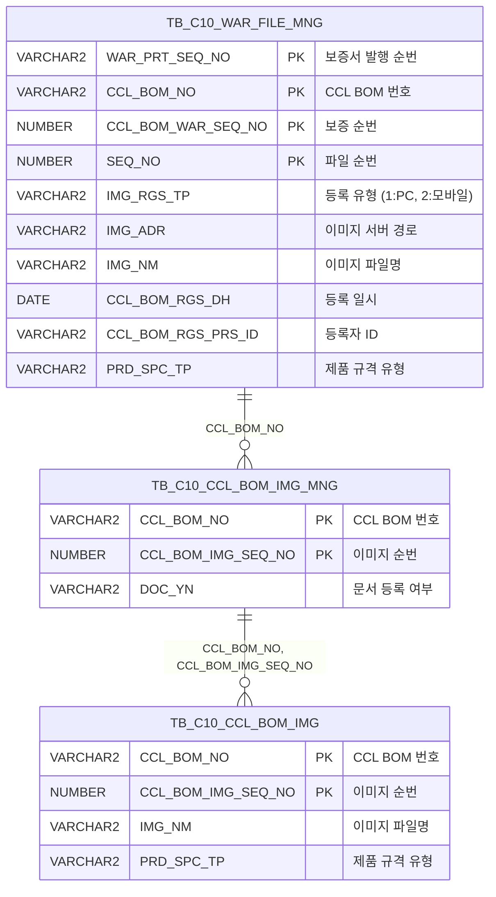

<h1 style="font-size: 40px; text-align: center; font-weight:
   bold; margin: 30px 0;">
  C106000120pop01 레거시 시스템 분석 종합 보고서
</h1>


# 1. 시스템 개요
- **서비스 ID**: C106000120pop01
- **업무명**: CCLBOM 보증서 파일 업로드 (영문 보증서 파일 관리)
- **분석 일시**: 2026-03-17 (KST)
- **전체 Activity 수**: 2개 (built-in)
- **분석자**: Claude Opus 4.6 / Sonnet 4.6
- **분석 도구**: /analyze-service C106000120pop01
- **문서 버전**: 1.0

# 📊 비즈니스 프로세스 분석

## 시스템 목적

C106000120pop01은 CCL 공정의 보증서 발행 화면(C106000120)에서 호출되는 **팝업 서비스**로, 특정 CCL BOM에 대한 영문 보증서 관련 파일(이미지/문서)을 업로드·조회·삭제하는 기능을 제공한다.

보증서 발행 시 첨부가 필요한 물성 파일(제품 규격 유형 PRD_SPC_TP='1')을 dhtmlXVault 컴포넌트를 통해 업로드하고, 업로드된 파일 목록을 그리드에 표시하며, 개별 파일의 다운로드 및 삭제를 지원한다. 파일은 `TB_C10_WAR_FILE_MNG` 테이블에서 관리되며, 보증서 발행 번호(WAR_PRT_SEQ_NO)와 CCL BOM 번호(CCL_BOM_NO)를 키로 사용한다.

이 팝업은 부모 화면에서 WAR_PRT_SEQ_NO, CCL_BOM_NO, CCL_BOM_WTY_SEQ_NO 등의 파라미터를 전달받아 해당 보증서에 속한 파일만 필터링하여 관리한다. 파일 업로드 완료 시 자동으로 그리드를 재조회하고, 파일 삭제 시에도 confirm 확인 후 삭제 및 재조회가 수행된다.

## 주요 유즈케이스

### UC-01: 보증서 파일 목록 조회
- **Actor**: CCL 보증서 담당자
- **목적**: 특정 CCL BOM 보증서에 첨부된 파일 목록을 조회하여 현재 등록 상태 확인

- **전제조건**:
  - 부모 화면(C106000120)에서 보증서 행을 선택한 상태
  - WAR_PRT_SEQ_NO, CCL_BOM_NO 파라미터가 전달됨
  - PRD_SPC_TP='1'(물성파일) 유형의 데이터가 존재

- **주요 흐름**:
  1. 부모 화면에서 팝업 호출 시 WAR_PRT_SEQ_NO, CCL_BOM_NO, CCL_BOM_WTY_SEQ_NO 등 파라미터 전달
  2. 팝업 로딩 시 `onVaultLoad()` → dhtmlXVault 초기화 및 폼 필드(IMG_RGS_FLAG=07 등) 설정
  3. `onLoadGrid()` 호출 → `C106000120pop01_Grid_1.select` 쿼리 실행
  4. `TB_C10_WAR_FILE_MNG` 테이블에서 PRD_SPC_TP='1' 조건으로 파일 목록 조회
  5. Grid에 CCL BOM, 순번, 구분(PC/모바일), 파일명(링크), 등록일자, 등록자, 삭제 버튼 표시

- **대체 흐름**:
  - 등록된 파일이 없는 경우: 빈 그리드 표시
  - 파라미터 누락 시: 조회 결과 없음

- **후행조건**:
  - 파일 목록이 Grid에 표시됨
  - 사용자가 파일 업로드/다운로드/삭제를 수행할 수 있는 상태

### UC-02: 보증서 파일 업로드
- **Actor**: CCL 보증서 담당자
- **목적**: 보증서 발행에 필요한 물성 파일을 서버에 업로드하고 DB에 등록

- **전제조건**:
  - 팝업이 열려있고 파일 목록이 조회된 상태
  - 업로드할 파일이 준비됨

- **주요 흐름**:
  1. dhtmlXVault 영역에서 파일 선택 또는 드래그앤드롭
  2. Vault가 `_uploadHandler4.jsp`로 파일 전송 (IMG_RGS_FLAG=07, IMG_RGS_FLAG_ID=WAR_PRT_SEQ_NO 등 폼 필드 포함)
  3. 서버에서 파일 저장 및 `C106000120pop01.insert` 쿼리로 DB 등록
  4. `vault.onUploadComplete` 이벤트 발생 → 업로드 성공 여부 확인
  5. 성공 시 `onLoadGrid()` 호출하여 그리드 재조회

- **대체 흐름**:
  - 업로드 실패 시: `vault.onUploadComplete`에서 실패 감지 → 알림 메시지 표시
  - 파일 크기 초과 등 서버 오류 시: 핸들러 JSP에서 에러 응답 반환

- **후행조건**:
  - 파일이 서버에 저장되고 `TB_C10_WAR_FILE_MNG` 테이블에 레코드 생성
  - Grid에 새로 업로드된 파일이 표시됨

### UC-03: 보증서 파일 삭제
- **Actor**: CCL 보증서 담당자
- **목적**: 잘못 등록되었거나 불필요한 보증서 파일을 삭제

- **전제조건**:
  - 팝업이 열려있고 삭제 대상 파일이 Grid에 표시된 상태

- **주요 흐름**:
  1. Grid의 "삭제" 컬럼 클릭
  2. `doImgDel()` 함수 실행 → confirm 대화상자 표시
  3. 확인 클릭 시 `_fileDeleteHandler4.jsp` 호출 (IMG_RGS_FLAG=07, SEQ, FILE_NAME 등 파라미터 전달)
  4. 서버에서 물리 파일 삭제 및 DB 레코드 삭제
  5. 삭제 완료 후 `onLoadGrid()` 호출하여 그리드 재조회

- **대체 흐름**:
  - confirm에서 취소 클릭 시: 삭제 취소, 현재 상태 유지
  - 서버 삭제 실패 시: 에러 메시지 표시

- **후행조건**:
  - 파일이 서버에서 삭제되고 DB 레코드 제거됨
  - Grid에서 삭제된 파일이 제거됨

### UC-04: 파일 다운로드
- **Actor**: CCL 보증서 담당자
- **목적**: 등록된 보증서 파일을 다운로드하여 내용 확인

- **전제조건**:
  - 파일 목록이 Grid에 표시된 상태
  - 다운로드할 파일이 존재

- **주요 흐름**:
  1. Grid의 "파일" 컬럼(ahref_idx 링크) 클릭
  2. `Grid_doLink()` 함수 실행 → 선택 행의 FILE_ADR, FILE_NM 추출
  3. `_fileDownloadHandler.jsp`로 요청 전송
  4. 브라우저에서 파일 다운로드 시작

- **대체 흐름**:
  - 파일이 서버에 존재하지 않는 경우: 다운로드 핸들러에서 에러 응답

- **후행조건**:
  - 사용자 PC에 파일 다운로드 완료

---
## 비즈니스 로직 상세

### 1. 이미지 등록 유형(IMG_RGS_TP) 코드 변환

- **목적**: DB에 저장된 이미지 등록 유형 코드를 사용자에게 의미 있는 텍스트로 변환하여 표시
- **처리 케이스**:

  **[케이스 1: PC 등록]**
  ```
    조건: IMG_RGS_TP 값이 '2'가 아닌 경우 (기본값)
    처리:
      1. DECODE(IMG_RGS_TP, '2', '모바일', 'PC') 적용
      2. Grid 구분 컬럼에 'PC' 표시
  ```

  **[케이스 2: 모바일 등록]**
  ```
    조건: IMG_RGS_TP = '2'
    처리:
      1. DECODE 함수에 의해 '모바일'로 변환
      2. Grid 구분 컬럼에 '모바일' 표시
  ```

### 2. 파일 경로 변환 (CHK_IMG_ADR)

- **목적**: DB에 저장된 서버 절대 경로를 웹 상대 경로로 변환하여 브라우저에서 접근 가능하도록 처리
- **처리 케이스**:

  **[케이스 1: 경로 변환]**
  ```
    조건: IMG_ADR에 'IMG_UPLOAD' 문자열이 포함된 경우
    처리:
      1. INSTR(IMG_ADR, 'IMG_UPLOAD')로 'IMG_UPLOAD' 시작 위치 탐색
      2. SUBSTR로 'IMG_UPLOAD' 이후 경로 추출
      3. REPLACE로 역슬래시(\)를 슬래시(/)로 변환
      4. 앞에 './' 접두어, 뒤에 '/' 접미어 추가하여 웹 상대 경로 생성
  ```

  **계산 공식**:
  ```
  CHK_IMG_ADR = './' || REPLACE(SUBSTR(IMG_ADR, INSTR(IMG_ADR, 'IMG_UPLOAD')), '\', '/') || '/'

  예시:
  IMG_ADR = 'D:\Server\IMG_UPLOAD\2026\03\file1.jpg'
  → INSTR 결과: 11 (IMG_UPLOAD 시작 위치)
  → SUBSTR 결과: 'IMG_UPLOAD\2026\03\file1.jpg'
  → REPLACE 결과: 'IMG_UPLOAD/2026/03/file1.jpg'
  → 최종: './IMG_UPLOAD/2026/03/file1.jpg/'
  ```

### 3. DOC_YN 자동 갱신 (update 쿼리)

- **목적**: 파일 업로드/삭제 시 해당 BOM의 보증서 문서 등록 여부(DOC_YN)를 자동 갱신
- **처리 케이스**:

  **[케이스 1: 파일 존재]**
  ```
    조건: TB_C10_CCL_BOM_IMG에서 PRD_SPC_TP='3' 조건으로 이미지 수 COUNT > 0
    처리:
      1. DOC_YN = 'Y'로 UPDATE
      2. TB_C10_CCL_BOM_IMG_MNG 테이블의 감사 컬럼 갱신
  ```

  **[케이스 2: 파일 미존재]**
  ```
    조건: COUNT 결과가 0
    처리:
      1. DOC_YN = 'N'으로 UPDATE
      2. 보증서 문서가 미등록 상태로 표시됨
  ```

---

# 💾 데이터 요구사항

## 핵심 테이블

### 1. TB_C10_WAR_FILE_MNG - (보증서 파일 관리)
| 컬럼명 | 타입 | PK | 설명 |
|--------|------|----|-----|
| WAR_PRT_SEQ_NO | VARCHAR2 | ✅ | 보증서 발행 순번 |
| CCL_BOM_NO | VARCHAR2 | ✅ | CCL BOM 번호 |
| CCL_BOM_WAR_SEQ_NO | NUMBER | ✅ | CCL BOM 보증 순번 (고정값 1) |
| SEQ_NO | NUMBER | ✅ | 파일 순번 |
| IMG_RGS_TP | VARCHAR2 |  | 이미지 등록 유형 (1:PC, 2:모바일) |
| IMG_ADR | VARCHAR2 |  | 이미지 서버 경로 |
| IMG_NM | VARCHAR2 |  | 이미지 파일명 |
| CCL_BOM_RGS_DH | DATE |  | 등록 일시 |
| CCL_BOM_RGS_PRS_ID | VARCHAR2 |  | 등록자 ID |
| PRD_SPC_TP | VARCHAR2 |  | 제품 규격 유형 (1:물성파일) |
| CREATED_OBJECT_TYPE | VARCHAR2 |  | 생성 객체 유형 |
| CREATED_OBJECT_ID | VARCHAR2 |  | 생성자 ID |
| CREATED_PROGRAM_ID | VARCHAR2 |  | 생성 프로그램 ID |
| CREATION_TIMESTAMP | TIMESTAMP |  | 생성 타임스탬프 |
| LAST_UPDATED_OBJECT_TYPE | VARCHAR2 |  | 최종 수정 객체 유형 |
| LAST_UPDATED_OBJECT_ID | VARCHAR2 |  | 최종 수정자 ID |
| LAST_UPDATE_PROGRAM_ID | VARCHAR2 |  | 최종 수정 프로그램 ID |
| LAST_UPDATE_TIMESTAMP | TIMESTAMP |  | 최종 수정 타임스탬프 |

### 2. TB_C10_CCL_BOM_IMG_MNG - (CCL BOM 이미지 관리 마스터)
| 컬럼명 | 타입 | PK | 설명 |
|--------|------|----|-----|
| CCL_BOM_NO | VARCHAR2 | ✅ | CCL BOM 번호 |
| CCL_BOM_IMG_SEQ_NO | NUMBER | ✅ | CCL BOM 이미지 순번 |
| DOC_YN | VARCHAR2 |  | 문서 등록 여부 (Y/N) |

### 3. TB_C10_CCL_BOM_IMG - (CCL BOM 이미지 상세)
| 컬럼명 | 타입 | PK | 설명 |
|--------|------|----|-----|
| CCL_BOM_NO | VARCHAR2 | ✅ | CCL BOM 번호 |
| CCL_BOM_IMG_SEQ_NO | NUMBER | ✅ | CCL BOM 이미지 순번 |
| IMG_NM | VARCHAR2 |  | 이미지 파일명 |
| PRD_SPC_TP | VARCHAR2 |  | 제품 규격 유형 |

## 데이터 플로우

### 1. 조회
```
[보증서 파일 목록 조회]
팝업 진입 (부모 화면에서 WAR_PRT_SEQ_NO, CCL_BOM_NO 전달)
→ C106000120pop01_Grid_1.select
  FROM C10APUSER.TB_C10_WAR_FILE_MNG
  WHERE WAR_PRT_SEQ_NO = :WAR_PRT_SEQ_NO
    AND CCL_BOM_NO = :CCL_BOM_NO
    AND CCL_BOM_WAR_SEQ_NO = 1
    AND PRD_SPC_TP = '1'
  ORDER BY WAR_PRT_SEQ_NO, CCL_BOM_NO, CCL_BOM_WAR_SEQ_NO, SEQ_NO
→ Grid에 파일 목록 표시 (CCL BOM, 순번, 구분, 파일명 링크, 등록일자, 등록자, 삭제)
```

### 2. 파일 업로드
```
[보증서 파일 업로드]
dhtmlXVault에서 파일 선택/드래그앤드롭
→ _uploadHandler4.jsp 호출 (IMG_RGS_FLAG=07, IMG_RGS_FLAG_ID, IMG_RGS_FLAG_ID1, IMG_RGS_FLAG_ID2, PRD_SPC_TP)
→ 서버 파일 저장 + C106000120pop01.insert
  INSERT INTO TB_C10_WAR_FILE_MNG (WAR_PRT_SEQ_NO, CCL_BOM_NO, CCL_BOM_WAR_SEQ_NO=1, SEQ_NO=1, ...)
→ vault.onUploadComplete 이벤트 → onLoadGrid() → Grid 재조회
```

### 3. 파일 삭제
```
[보증서 파일 삭제]
Grid 삭제 컬럼 클릭 → doImgDel() → confirm 확인
→ _fileDeleteHandler4.jsp 호출 (IMG_RGS_FLAG=07, SEQ, FILE_NAME 등)
→ 서버 파일 삭제 + C106000120pop01.delete
  DELETE FROM TB_C10_WAR_FILE_MNG
  WHERE WAR_PRT_SEQ_NO = :IMG_RGS_FLAG_ID
    AND CCL_BOM_NO = :IMG_RGS_FLAG_ID1
    AND CCL_BOM_WAR_SEQ_NO = 1
    AND SEQ_NO = :SEQ
→ 삭제 완료 후 onLoadGrid() → Grid 재조회
```

### 4. DOC_YN 갱신
```
[보증서 문서 등록여부 갱신]
파일 업로드/삭제 후
→ C106000120pop01.update
  UPDATE TB_C10_CCL_BOM_IMG_MNG
  SET DOC_YN = DECODE(
    (SELECT COUNT(IMG_NM) FROM TB_C10_CCL_BOM_IMG
     WHERE CCL_BOM_NO = :IMG_RGS_FLAG_ID
       AND CCL_BOM_IMG_SEQ_NO = :IMG_RGS_FLAG_ID2
       AND PRD_SPC_TP = '3'), 0, 'N', 'Y')
  WHERE CCL_BOM_NO = :IMG_RGS_FLAG_ID
    AND CCL_BOM_IMG_SEQ_NO = :IMG_RGS_FLAG_ID2
→ DOC_YN 상태 자동 동기화
```

## SQL 일람표

| SQL 이름 | 쿼리 ID | 타입 | 출처 | 테이블 |
|---------|---------|-----|-------|-------|
| 보증서 발행파일 조회 | C106000120pop01_Grid_1.select | SELECT | Service | TB_C10_WAR_FILE_MNG |
| 보증서 파일 등록 | C106000120pop01.insert | INSERT | 업로드 핸들러 JSP | TB_C10_WAR_FILE_MNG |
| 보증서 등록여부 갱신 | C106000120pop01.update | UPDATE | 업로드/삭제 핸들러 JSP | TB_C10_CCL_BOM_IMG_MNG |
| 보증서 파일 삭제 | C106000120pop01.delete | DELETE | 삭제 핸들러 JSP | TB_C10_WAR_FILE_MNG |

## ER 다이어그램 (핵심 관계)



관계 설명:
- `TB_C10_WAR_FILE_MNG`이 보증서 파일의 중심 테이블로 파일별 정보 관리
- `TB_C10_CCL_BOM_IMG_MNG`는 CCL BOM 단위의 이미지 관리 마스터로, DOC_YN(문서등록여부)을 관리
- `TB_C10_CCL_BOM_IMG`는 실제 이미지 상세 데이터로, update 쿼리에서 COUNT 조회 대상

---

# 🖥️ 사용자 인터페이스 요구사항

## 화면 레이아웃 상세

### Layout 구조
```javascript
// 레이아웃 컴포넌트 없이 DIV 직접 배치 (flat layout)
{
  type: "custom",
  dirType: "none",
  components: [
    {
      id: "vault1",
      type: "vault",
      position: "body onload 초기화",
      description: "dhtmlXVault 파일 업로드 영역"
    },
    {
      id: "C106000120pop01_Grid_1",
      type: "grid",
      position: "absolute; height:70px; width:430px; left:8px; top:260px",
      description: "업로드 파일 목록 그리드"
    },
    {
      id: "C106000120pop01_MessageBox_1",
      type: "messagebox",
      position: "absolute; height:23px; width:445px; left:0px; top:332px",
      description: "메시지 표시 영역"
    }
  ]
}
```

## 입출력 요소

### Vault 컴포넌트
**vault1** (dhtmlXVaultObject)
- 서버 핸들러:
  - 업로드: `_uploadHandler4.jsp`
  - 파일 정보: `_getInfoHandler.jsp`
  - ID 획득: `_getIdHandler.jsp`
- 폼 필드:
  - IMG_RGS_TP: JSP 파라미터 IMG_RGS_TP (고정값 1)
  - IMG_RGS_FLAG: 고정값 "07"
  - IMG_RGS_FLAG_ID: JSP 파라미터 WAR_PRT_SEQ_NO
  - IMG_RGS_FLAG_ID1: JSP 파라미터 CCL_BOM_NO
  - IMG_RGS_FLAG_ID2: JSP 파라미터 CCL_BOM_WTY_SEQ_NO
  - PRD_SPC_TP: JSP 파라미터 PRD_SPC_TP

### Grid 컴포넌트

**C106000120pop01_Grid_1 (보증서 파일 목록)**
- 편집 가능 여부: 아니오 (읽기 전용, 모든 컬럼 ro 타입)
- Split: 0 (고정 컬럼 없음)
- 서비스: C106000120pop01-service (find/save)
- 액션 URL: gridC10Data.do
- Multiselect: true
- 주요 컬럼 (12개):

  **표시 컬럼 (7개)**:
  - CCL_BOM_NO: ro - CCL BOM 번호 (19%, 중앙정렬, str 정렬)
  - SEQ_NO: ro - 순번 (8%, 중앙정렬, str 정렬)
  - IMG_RGS_TP: ro - 구분 (PC/모바일) (11%, 중앙정렬)
  - IMG_NM: ahref_idx - 파일명 링크 (나머지 영역, 좌측정렬, 클릭 시 Grid_doLink로 다운로드)
  - CCL_BOM_RGS_DH: ro - 등록일자 (20%, 중앙정렬)
  - CCL_BOM_RGS_PRS_ID: ro - 등록자 (16%, 중앙정렬)
  - DEL_IMG: ro - 삭제 (8%, 중앙정렬, 클릭 시 doImgDel로 삭제 처리)

  **숨김 컬럼 (5개)**:
  - CCL_BOM_WTY_SEQ_NO: ro - CCL BOM 보증 순번 (숨김)
  - IMG_ADR: ro - 이미지 서버 경로 (숨김)
  - CHK_IMG_NM: ro - 확인용 이미지 파일명 (숨김)
  - CHK_IMG_ADR: ro - 확인용 이미지 경로 (숨김, 웹 상대 경로로 변환된 값)
  - WAR_PRT_SEQ_NO: ro - 보증서 발행 순번 (숨김)

## 화면 동작 흐름

### 1. 팝업 초기 로딩
```
1. 부모 화면(C106000120)에서 팝업 호출
   - request.getParameter()로 WAR_PRT_SEQ_NO, CCL_BOM_NO, CCL_BOM_WTY_SEQ_NO, rowId, parent_item 수신
2. body onload → onVaultLoad() 실행
   - dhtmlXVaultObject 생성 및 초기화
   - vault.setFormFieldValue()로 폼 필드 6개 설정
   - vault.onUploadComplete 이벤트 핸들러 등록
3. ui.initializeDHTMLX (onXleGrid) 실행
   - DHTMLX Grid 초기화
   - XLE 이벤트(onLoadGrid) 등록
4. onLoadGrid() 호출
   - WAR_PRT_SEQ_NO, CCL_BOM_NO 파라미터로 C106000120pop01-service find 호출
   - Grid에 파일 목록 표시
5. 메시지 표시 영역(MessageBox) 초기화
```

### 2. 파일 업로드 흐름
```
1. 사용자가 dhtmlXVault 영역에서 파일 선택/드래그앤드롭
2. Vault가 _uploadHandler4.jsp로 파일 전송
   - IMG_RGS_FLAG=07, IMG_RGS_FLAG_ID(WAR_PRT_SEQ_NO), IMG_RGS_FLAG_ID1(CCL_BOM_NO) 등 폼 필드 포함
3. 서버에서 파일 저장 및 DB INSERT
4. vault.onUploadComplete 이벤트 발생
   - 성공 시: onLoadGrid() 호출 → Grid 재조회
   - 실패 시: 알림 메시지 표시
```

### 3. 파일 삭제 흐름
```
1. Grid의 DEL_IMG 컬럼 클릭
2. doImgDel(rowIdx) 함수 실행
   - 선택 행에서 IMG_RGS_FLAG=07, WAR_PRT_SEQ_NO, CCL_BOM_NO, CCL_BOM_WTY_SEQ_NO, SEQ, PRD_SPC_TP, FILE_NAME 추출
3. confirm("삭제하시겠습니까?") 대화상자 표시
4. 확인 클릭 시 _fileDeleteHandler4.jsp 호출
5. 서버에서 물리 파일 삭제 및 DB DELETE
6. 삭제 완료 후 onLoadGrid() → Grid 재조회
```

### 4. 파일 다운로드 흐름
```
1. Grid의 IMG_NM(파일) 컬럼 링크 클릭 (ahref_idx 타입)
2. Grid_doLink(filename, rowId) 함수 실행
3. 선택 행에서 FILE_ADR, FILE_NM 추출
4. _fileDownloadHandler.jsp로 다운로드 요청
5. 브라우저에서 파일 다운로드 실행
```

## JavaScript 모듈

**C106000120pop01.jsp** (팝업 인라인 스크립트)
- onVaultLoad(): dhtmlXVault 초기화 및 폼 필드 설정, onUploadComplete 이벤트 등록
- onLoadGrid(): WAR_PRT_SEQ_NO, CCL_BOM_NO 파라미터로 Grid 데이터 재조회
- Grid_doLink(filename, rowId): 파일명 링크 클릭 → _fileDownloadHandler.jsp로 파일 다운로드
- doImgDel(rowIdx): confirm 후 _fileDeleteHandler4.jsp 호출하여 파일 삭제, 완료 후 onLoadGrid
- findMessage(appMsg): MessageBox에 메시지 표시
- onGridContextMenuClick(id): 컨텍스트 메뉴 처리 (컬럼이동, 헤더필터, 편집가능, 엑셀출력)
- find(): 폼 파라미터로 Grid 데이터 로드
- save(): Grid 데이터 저장 (sendGrid)
- add(): Grid에 새 행 추가
- remove(): Grid에서 행 삭제
- copy(): Grid 행 클립보드 복사
- undo(): 마지막 작업 취소
- redo(): 취소된 작업 재실행

## 주요 이벤트 핸들러

**vault.onUploadComplete (파일 업로드 완료)**
- 이벤트 타입: Vault Upload Complete
- 처리 내용:
  1. 업로드 결과 상태 확인 (성공/실패)
  2. 성공 시 onLoadGrid() 호출하여 Grid 재조회
  3. 실패 시 알림 메시지 표시

**Grid_doLink (파일 링크 클릭)**
- 이벤트 타입: Grid Cell Click (ahref_idx 타입)
- 처리 내용:
  1. 클릭된 행의 FILE_ADR, FILE_NM 파라미터 추출
  2. _fileDownloadHandler.jsp로 다운로드 요청 전송
  3. 브라우저 파일 다운로드 실행

**doImgDel (파일 삭제)**
- 이벤트 타입: Grid Cell Click (DEL_IMG 컬럼)
- 처리 내용:
  1. 삭제 대상 행 정보 추출 (IMG_RGS_FLAG=07, WAR_PRT_SEQ_NO, CCL_BOM_NO, CCL_BOM_WTY_SEQ_NO, SEQ, PRD_SPC_TP, FILE_NAME)
  2. confirm 대화상자 표시
  3. 확인 시 _fileDeleteHandler4.jsp 호출
  4. 삭제 완료 후 onLoadGrid() → Grid 재조회

---

# 📌 특이사항 및 주의사항

## 1. IMG_RGS_FLAG 하드코딩
- **고정값 "07"**: Vault 폼 필드에서 IMG_RGS_FLAG를 항상 "07"로 하드코딩. 이 값은 "보증서 파일" 유형을 의미하는 것으로 추정되나, 코드 테이블 참조 없이 매직 넘버로 사용됨
- **PRD_SPC_TP='1' 고정 필터**: SELECT 쿼리에서 PRD_SPC_TP='1' 조건으로 물성파일만 필터링하나, UPDATE 쿼리에서는 PRD_SPC_TP='3' 조건으로 COUNT 확인 → 조회와 갱신 시 서로 다른 규격 유형 참조

## 2. CCL_BOM_WAR_SEQ_NO 고정값 패턴
- **INSERT/DELETE/SELECT 모두 CCL_BOM_WAR_SEQ_NO = 1 고정**: 현재 보증 순번이 항상 1로 고정되어 있어 실제로는 복수 보증 순번을 지원하지 않는 구조
- **SEQ_NO = 1 고정 (INSERT)**: INSERT 시 SEQ_NO도 1로 고정되어 있어, 동일 보증서에 여러 파일을 업로드하면 PK 충돌 가능성 있음 (실제로는 업로드 핸들러 JSP에서 SEQ_NO를 별도 채번할 가능성)

## 3. 파일 처리 핸들러 분리 아키텍처
- **4개의 별도 JSP 핸들러**: 업로드(_uploadHandler4.jsp), 정보조회(_getInfoHandler.jsp), ID획득(_getIdHandler.jsp), 다운로드(_fileDownloadHandler.jsp), 삭제(_fileDeleteHandler4.jsp) 등 파일 관련 처리가 모두 별도 JSP로 분리
- 이 JSP 핸들러들은 GLUE Service XML 체인이 아닌 직접 JDBC 또는 별도 프레임워크로 DB 접근할 가능성이 높음
- 서비스 XML에는 SELECT 쿼리(Grid 조회)만 포함되고, INSERT/UPDATE/DELETE 쿼리는 쿼리 파일에 존재하지만 핸들러 JSP에서 직접 호출하는 구조

## 4. 크로스 테이블 참조 주의
- **UPDATE 쿼리의 테이블 불일치**: UPDATE는 `TB_C10_CCL_BOM_IMG_MNG` 테이블을 갱신하면서, 서브쿼리로 `TB_C10_CCL_BOM_IMG` 테이블의 COUNT를 참조. SELECT/INSERT/DELETE는 `TB_C10_WAR_FILE_MNG` 테이블 대상
- 즉, 파일 업로드/삭제 시 3개의 서로 다른 테이블이 영향을 받으며, 트랜잭션 일관성 관리가 중요

## 5. 경로 변환 로직의 환경 의존성
- **IMG_ADR → 웹 상대 경로 변환**: `INSTR(IMG_ADR, 'IMG_UPLOAD')` 패턴으로 서버 경로의 특정 위치를 찾아 상대 경로로 변환하는데, 이는 서버 파일 시스템 구조에 강하게 의존
- Windows 역슬래시(\)를 슬래시(/)로 REPLACE하는 처리가 SQL에 포함되어 있어, 서버 OS가 변경되면 영향받을 수 있음

---

# 📚 참고 문서

- **Query SQL**: `src/query/C106000120pop01-query.glue_sql`
- **Service XML**: `src/service/C106000120pop01-service.xml`
- **JSP**: `WebContents/C106000120pop01.jsp`
- **Grid XML**: `WebContents/header/kr/C106000120pop01/C106000120pop01_Grid_1.xml`
