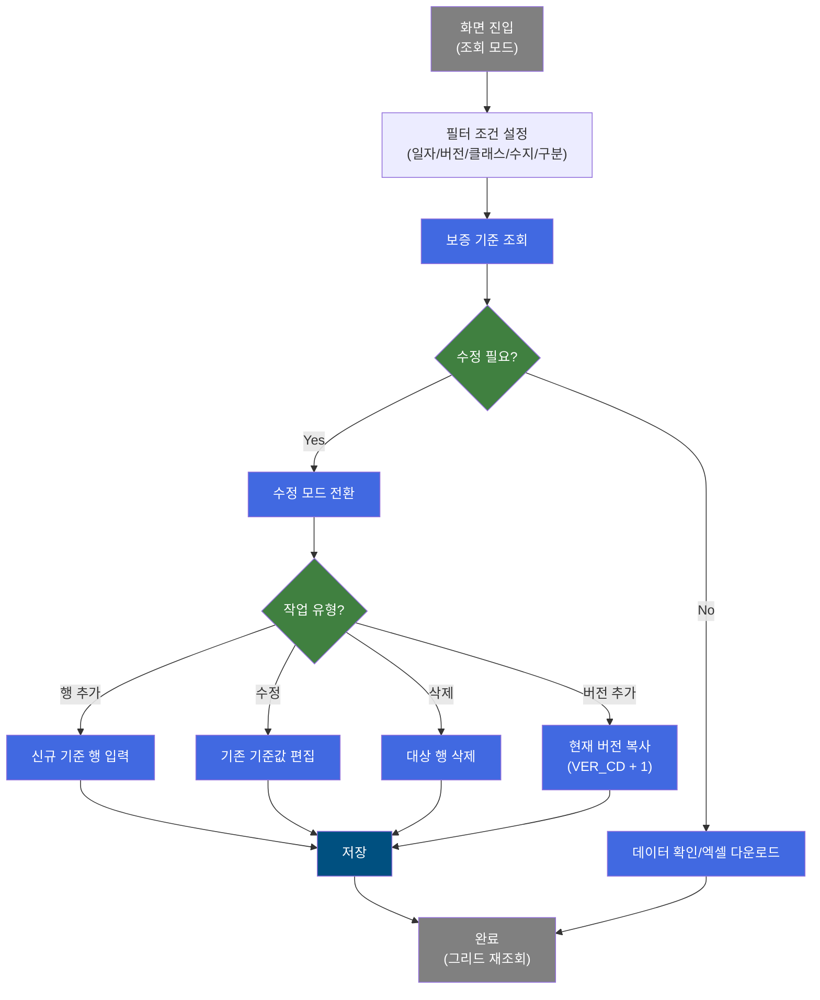
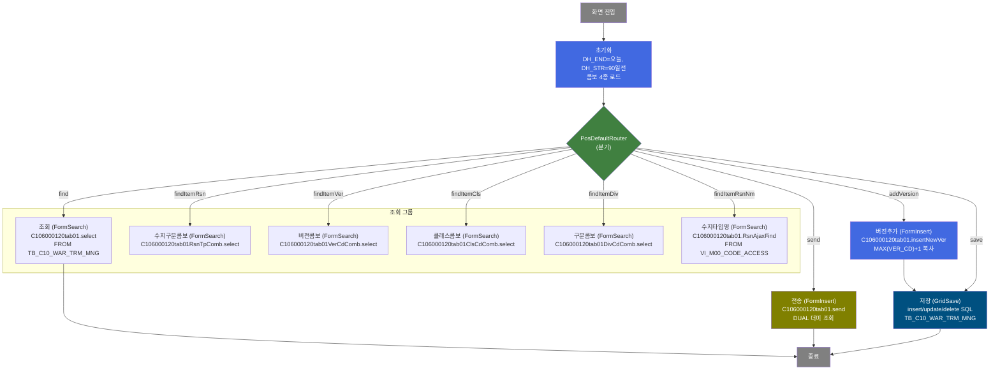
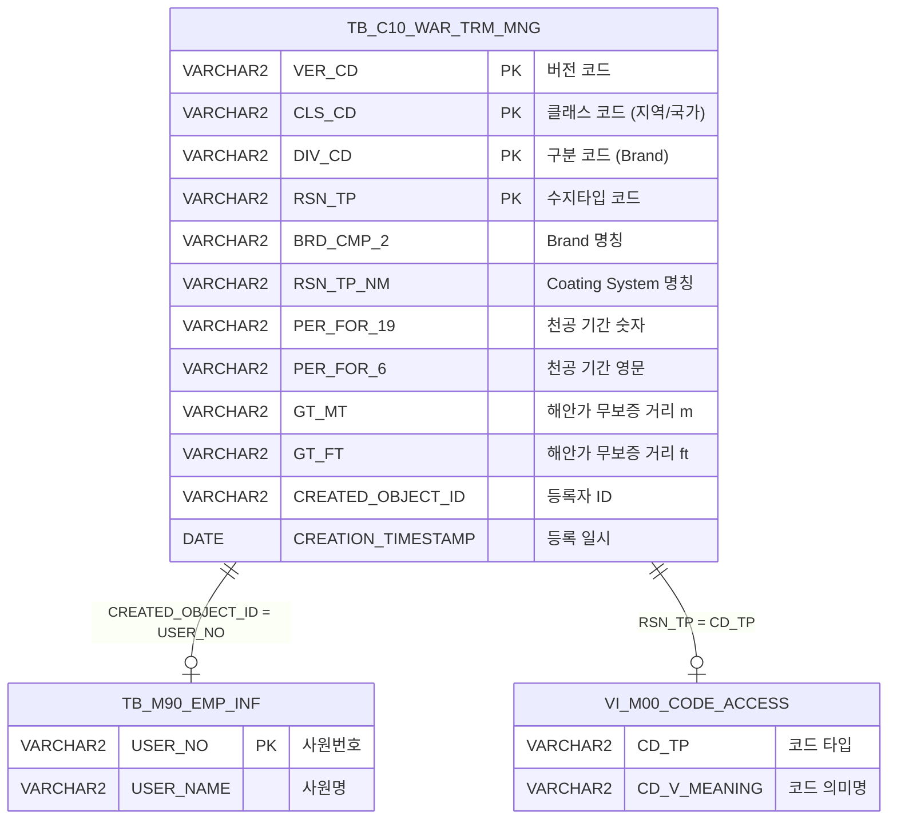

<h1 style="font-size: 40px; text-align: center; font-weight:
   bold; margin: 30px 0;">
  C106000120tab01 레거시 시스템 분석 종합 보고서
</h1>


# 1. 시스템 개요
- **서비스 ID**: C106000120tab01
- **업무명**: 보증서기준등록
- **분석 일시**: 2026-03-17 (KST)
- **분석 시간**: Phase 1~5 자동 분석
- **전체 Activity 수**: 10개 (built-in 10개, custom 0개)
- **분석자**: Claude Opus 4.6 + Sonnet (Phase 4)
- **분석 도구**: /analyze-service C106000120tab01
- **문서 버전**: 1.0

# 📊 비즈니스 프로세스 분석

## 시스템 목적

C10(CCL) 모듈의 **보증서 기준 등록** 화면으로, 컬러강판 제품의 품질 보증서에 기재되는 보증 기준 정보를 버전별로 관리하는 시스템이다. 보증서에는 천공(Perforation), 변색(Fading), 백화(Chalking), 박리(Peel/Flake) 등 각종 품질 항목에 대한 보증 기간과 범위를 지역/국가, Brand, Coating System 별로 차등 적용하며, 이 기준 데이터를 등록·수정·삭제·버전 추가할 수 있다.

보증 기준 데이터는 Roof(지붕)와 Wall(벽) 용도를 구분하여 관리하며, 해안가 무보증 거리(m/ft 단위) 정보도 포함한다. 버전 관리를 통해 기준 변경 이력을 추적하고, 조회/수정 모드를 분리하여 실수로 인한 데이터 변경을 방지한다. 전송 기능을 통해 확정된 기준 데이터를 외부 시스템으로 전달할 수 있다.

## 핵심 워크플로우 다이어그램



### 상세 워크플로우 다이어그램



## 주요 유즈케이스

### UC-01: 보증서 기준 조회
- **Actor**: 품질관리 담당자
- **목적**: 지역/국가별, Brand별, Coating System별 보증 기준 정보를 조회하여 현행 보증 조건을 확인

- **전제조건**:
  - 시스템에 로그인되어 있음
  - TB_C10_WAR_TRM_MNG 테이블에 기준 데이터가 등록되어 있음

- **주요 흐름**:
  1. 화면 진입 시 DH_END에 오늘 날짜, DH_STR에 90일 전 날짜가 자동 설정됨
  2. 버전/클래스/수지/구분 콤보가 날짜 범위 내 데이터 기반으로 자동 로드됨
  3. 필요 시 콤보 필터를 변경하여 조회 조건 설정
  4. 조회 버튼 클릭 → C106000120tab01.select 실행
  5. Grid에 보증 기준 목록 표시 (버전, 지역/국가, Brand, Coating System, 각 품질항목별 보증기간/범위)

- **대체 흐름**:
  - 조회 결과 없음: Grid에 데이터 미표시
  - 최신 버전만 조회: SETTING 라디오가 조회(N) 모드일 때 SETTING='N' 파라미터 전달

- **후행조건**:
  - 보증 기준 데이터가 Grid에 표시됨
  - 사용자가 엑셀 다운로드 또는 수정 모드 전환 가능

### UC-02: 보증서 기준 수정/등록/삭제
- **Actor**: 품질관리 담당자
- **목적**: 보증 기준 정보를 신규 등록, 수정 또는 삭제하여 최신 보증 조건을 유지

- **전제조건**:
  - UC-01로 조회가 완료된 상태
  - SETTING 라디오를 "수정(Y)"으로 전환하여 수정 모드 활성화

- **주요 흐름**:
  1. SETTING 라디오를 "수정(Y)"으로 변경 → 저장 버튼 활성화, 메뉴(행추가/복사/삭제) 표시
  2. 메뉴에서 "행추가" 클릭 → Grid에 빈 행 추가 후 기준값 입력
  3. 또는 기존 행의 편집 가능 컬럼(배경색 노란색)을 직접 편집
  4. 또는 행 선택 후 "삭제" 메뉴 클릭 → 행 삭제 상태로 표시 (취소선)
  5. 저장 버튼 클릭 → 확인 다이얼로그 → 모든 행을 updated 상태로 강제 설정 후 일괄 저장
  6. GridSave가 insert/update/delete SQL을 구분하여 실행
  7. 저장 완료 후 Grid 재조회 및 콤보 재로드

- **대체 흐름**:
  - "복사" 메뉴 클릭: 선택 행의 데이터를 복사하여 신규 행 추가

- **후행조건**:
  - TB_C10_WAR_TRM_MNG 테이블에 변경사항 반영
  - Grid에 최신 데이터가 재표시됨

### UC-03: 버전 추가
- **Actor**: 품질관리 담당자
- **목적**: 기존 보증 기준의 최신 버전 데이터를 새 버전으로 복사하여 버전 관리 수행

- **전제조건**:
  - 기존 버전의 보증 기준 데이터가 존재함

- **주요 흐름**:
  1. 수정 모드에서 버전추가 기능 실행
  2. C106000120tab01.insertNewVer 쿼리 실행
  3. MAX(VER_CD) 서브쿼리로 최신 버전 번호 조회
  4. VER_CD를 +1 증가시킨 새 버전으로 전체 기준 데이터 복사 INSERT
  5. 복사 완료 후 GridSave로 이동하여 추가 편집/저장 가능

- **대체 흐름**:
  - 버전 데이터 없음: INSERT 실패

- **후행조건**:
  - 새 버전 번호로 기존 데이터가 복사됨
  - 사용자가 새 버전의 기준값을 편집 가능

### UC-04: 보증서 기준 전송
- **Actor**: 품질관리 담당자
- **목적**: 확정된 보증 기준 데이터를 외부 시스템으로 전송

- **전제조건**:
  - 조회 완료 상태

- **주요 흐름**:
  1. "전송" 버튼 클릭 → 확인 다이얼로그 표시
  2. handleDataProcess.do로 폼 전송 (send 액션)
  3. C106000120tab01.send 쿼리 실행 (DUAL에서 상수 1 조회 → 전송 가능 확인)

- **대체 흐름**:
  - 전송 실패 시 에러 메시지 표시

- **후행조건**:
  - 보증 기준 데이터가 외부 시스템으로 전달됨

---

## 비즈니스 로직 상세

### 1. 버전 관리 로직

- **목적**: 보증 기준 데이터의 변경 이력을 버전별로 관리하여 과거 기준을 추적 가능하게 함
- **처리 케이스**:

  **[케이스 1: 신규 버전 복사]**
  ```
    조건: 버전추가 요청 시
    처리:
      1. MAX(VER_CD) 서브쿼리로 현재 최대 버전 번호 조회
      2. 최대 버전의 모든 레코드를 SELECT
      3. VER_CD를 MAX(VER_CD)+1로 설정하여 INSERT
      4. 감사 정보(ObjectType, ObjectId, ProgramId, Timestamp) 기록
  ```

  **[케이스 2: 최신 버전 수정]**
  ```
    조건: update 요청 시
    처리:
      1. CLS_CD, DIV_CD, RSN_TP로 대상 행 식별
      2. MAX(VER_CD) 서브쿼리로 최신 버전만 대상
      3. 모든 기준값(보증기간, 범위, 해안가 무보증 거리 등) 일괄 UPDATE
  ```

  **[케이스 3: 최신 버전 삭제]**
  ```
    조건: delete 요청 시
    처리:
      1. CLS_CD, DIV_CD, RSN_TP로 대상 행 식별
      2. MAX(VER_CD) 서브쿼리로 최신 버전만 삭제
  ```

### 2. 조회 필터링 로직

- **목적**: 다양한 조건으로 보증 기준 데이터를 필터링하여 원하는 데이터만 표시
- **처리 케이스**:

  **[케이스 1: 날짜 범위 + 다중 조건 필터]**
  ```
    조건: DH_STR, DH_END, VER_COMB, CLS_COMB, RSN_COMB, DIV_COMB 입력
    처리:
      1. CREATION_TIMESTAMP BETWEEN DH_STR AND DH_END+1 로 날짜 범위 필터
      2. DECODE 패턴으로 각 콤보 조건 적용:
         - DECODE(:VER_COMB, '전체', VER_CD, VER_CD) = DECODE(:VER_COMB, '전체', VER_CD, :VER_COMB)
         - 동일 패턴으로 CLS_COMB, RSN_COMB, DIV_COMB 적용
      3. SETTING='N'이면 최신 버전만 조회 (MAX(VER_CD) 조건 추가)
  ```

  **[케이스 2: 콤보 데이터 동적 로드]**
  ```
    조건: 날짜 범위 변경 시
    처리:
      1. DUAL UNION ALL + 날짜 범위 내 DISTINCT 값 GROUP BY
      2. "전체" 옵션을 첫 번째 행으로 포함
      3. 각 콤보(버전/클래스/수지/구분) 독립적으로 로드
  ```

### 3. 수지타입 코드 변환

- **목적**: 수지타입 코드값(RSN_TP)을 마스터 코드 테이블에서 의미명으로 변환
- **처리 케이스**:

  **[케이스 1: 스칼라 서브쿼리 코드 변환]**
  ```
    조건: 수지타입명 조회 요청 (RsnAjaxFind)
    처리:
      1. VI_M00_CODE_ACCESS 뷰에서 CD_TP = :RSN_TP, 카테고리 = 'SZ0000' 조건
      2. CD_V_MEANING 값을 반환하여 UI에 표시
  ```

### 4. 등록자명 변환

- **목적**: 등록자 ID를 사원 테이블에서 이름으로 변환하여 표시
- **처리 케이스**:

  **[스칼라 서브쿼리 방식]**
  ```
    조건: 메인 조회(select) 시
    처리:
      1. TB_C10_WAR_TRM_MNG.CREATED_OBJECT_ID를 키로
      2. M90APUSER.TB_M90_EMP_INF에서 USER_NO = CREATED_OBJECT_ID 매칭
      3. USER_NAME을 CREATED_OBJECT_ID 컬럼에 표시
  ```

---

# 💾 데이터 요구사항

## 핵심 테이블

### 1. TB_C10_WAR_TRM_MNG - (보증서 기준 관리)
| 컬럼명 | 타입 | PK | 설명 |
|--------|------|----|-----|
| VER_CD | VARCHAR2 | ✅ | 버전 코드 (자동 증가, MAX+1) |
| CLS_CD | VARCHAR2 | ✅ | 클래스 코드 (지역/국가) |
| DIV_CD | VARCHAR2 | ✅ | 구분 코드 (Brand) |
| RSN_TP | VARCHAR2 | ✅ | 수지타입 코드 (Coating System) |
| BRD_CMP_2 | VARCHAR2 | | Brand 명칭 |
| RSN_TP_NM | VARCHAR2 | | Coating System 명칭 |
| PER_FOR_19 | VARCHAR2 | | 천공(Perforation) 기간 숫자 |
| PER_FOR_6 | VARCHAR2 | | 천공(Perforation) 기간 영문 |
| FA_TRM_7 | VARCHAR2 | | 변색(Fading) 기간 영문 |
| FA_TRM_8 | VARCHAR2 | | 변색(Fading) 기간 숫자 |
| FA_ROF_9 | VARCHAR2 | | 변색 Roof 범위 숫자 |
| FA_ROF_10 | VARCHAR2 | | 변색 Roof 범위 영문 |
| FA_WAL_11 | VARCHAR2 | | 변색 Wall 범위 숫자 |
| FA_WAL_12 | VARCHAR2 | | 변색 Wall 범위 영문 |
| CH_TRM_13 | VARCHAR2 | | 백화(Chalking) 기간 숫자 |
| CH_TRM_14 | VARCHAR2 | | 백화(Chalking) 기간 영문 |
| CH_ROF_15 | VARCHAR2 | | 백화 Roof 범위 숫자 |
| CH_ROF_16 | VARCHAR2 | | 백화 Roof 범위 영문 |
| CH_WAL_17 | VARCHAR2 | | 백화 Wall 범위 숫자 |
| CH_WAL_18 | VARCHAR2 | | 백화 Wall 범위 영문 |
| PE_FL_1 | VARCHAR2 | | 박리(Peel/Flake) 기간 숫자 |
| PE_FL_20 | VARCHAR2 | | 박리(Peel/Flake) 기간 영문 |
| GT_MT | VARCHAR2 | | 해안가 무보증 거리 (m) |
| GT_FT | VARCHAR2 | | 해안가 무보증 거리 (ft) |
| CREATED_OBJECT_ID | VARCHAR2 | | 등록자 ID |
| CREATION_TIMESTAMP | DATE | | 등록 일시 |
| LAST_UPDATE_TIMESTAMP | DATE | | 최종 수정 일시 |

### 2. TB_M90_EMP_INF - (사원 정보, M90APUSER)
| 컬럼명 | 타입 | PK | 설명 |
|--------|------|----|-----|
| USER_NO | VARCHAR2 | ✅ | 사원번호 |
| USER_NAME | VARCHAR2 | | 사원명 |

### 3. VI_M00_CODE_ACCESS - (공통 코드 뷰, M00APUSER)
| 컬럼명 | 타입 | PK | 설명 |
|--------|------|----|-----|
| CD_TP | VARCHAR2 | | 코드 타입 |
| CD_V_MEANING | VARCHAR2 | | 코드 의미명 |

## 데이터 플로우

### 1. 조회
```
[보증 기준 데이터 조회]
화면 진입
→ C106000120tab01.select
  FROM C10APUSER.TB_C10_WAR_TRM_MNG A
  LEFT JOIN M90APUSER.TB_M90_EMP_INF (스칼라 서브쿼리, USER_NO = A.CREATED_OBJECT_ID)
  WHERE CREATION_TIMESTAMP BETWEEN :DH_STR AND :DH_END+1
    AND DECODE 패턴으로 VER_COMB, CLS_COMB, RSN_COMB, DIV_COMB 필터
    AND SETTING='N'이면 MAX(VER_CD) 최신 버전 조건 추가
→ Grid에 보증 기준 목록 표시 (VERSION 표시, 등록자명 변환)

[콤보 데이터 로드]
날짜 변경 시
→ C106000120tab01RsnTpComb.select / VerCdComb.select / ClsCdComb.select / DivCdComb.select
  FROM DUAL UNION ALL TB_C10_WAR_TRM_MNG (날짜 범위 내 DISTINCT GROUP BY)
→ 각 콤보에 "전체" + 유효 값 목록 표시

[수지타입명 조회]
→ C106000120tab01.RsnAjaxFind
  FROM M00APUSER.VI_M00_CODE_ACCESS
  WHERE CD_TP = :RSN_TP AND 카테고리 = 'SZ0000'
→ CD_V_MEANING 반환
```

### 2. 저장 (Insert/Update/Delete)
```
[신규 행 추가]
행추가 → 데이터 입력 → 저장
→ C106000120tab01.insert
  INSERT INTO C10APUSER.TB_C10_WAR_TRM_MNG
  VER_CD = (SELECT MAX(VER_CD) FROM TB_C10_WAR_TRM_MNG)
  + CLS_CD, DIV_CD, RSN_TP, BRD_CMP_2, RSN_TP_NM 및 각 품질항목 컬럼
  + 감사 정보 (ObjectType, ObjectId, ProgramId, Timestamp)

[기존 행 수정]
셀 편집 → 저장
→ C106000120tab01.update
  UPDATE C10APUSER.TB_C10_WAR_TRM_MNG
  SET 모든 기준값 컬럼 = 입력값
  WHERE CLS_CD, DIV_CD, RSN_TP 매칭 AND VER_CD = MAX(VER_CD)

[행 삭제]
행 선택 → 삭제 → 저장
→ C106000120tab01.delete
  DELETE FROM C10APUSER.TB_C10_WAR_TRM_MNG
  WHERE CLS_CD, DIV_CD, RSN_TP 매칭 AND VER_CD = MAX(VER_CD)
```

### 3. 버전 추가
```
[버전 복사]
버전추가 실행
→ C106000120tab01.insertNewVer
  INSERT INTO TB_C10_WAR_TRM_MNG
  SELECT (MAX(VER_CD)+1), CLS_CD, DIV_CD, ... (전체 컬럼)
  FROM TB_C10_WAR_TRM_MNG
  WHERE VER_CD = MAX(VER_CD)
→ 저장 Activity로 전이
```

### 4. 전송
```
[보증 기준 전송]
전송 버튼 클릭 → 확인 다이얼로그
→ C106000120tab01.send
  SELECT 1 FROM DUAL (전송 가능 확인)
→ handleDataProcess.do로 폼 전송
```

## SQL 일람표
| SQL 이름 | 쿼리 ID | 타입 | 출처 | 테이블 |
|---------|---------|-----|-------|-------|
| 보증 기준 조회 | C106000120tab01.select | SELECT | Service | TB_C10_WAR_TRM_MNG, TB_M90_EMP_INF |
| 전송 확인 | C106000120tab01.send | SELECT | Service | DUAL |
| 수지타입 콤보 | C106000120tab01RsnTpComb.select | SELECT | Service | DUAL, TB_C10_WAR_TRM_MNG |
| 버전 콤보 | C106000120tab01VerCdComb.select | SELECT | Service | DUAL, TB_C10_WAR_TRM_MNG |
| 클래스 콤보 | C106000120tab01ClsCdComb.select | SELECT | Service | DUAL, TB_C10_WAR_TRM_MNG |
| 구분 콤보 | C106000120tab01DivCdComb.select | SELECT | Service | DUAL, TB_C10_WAR_TRM_MNG |
| 버전 추가 | C106000120tab01.insertNewVer | INSERT | Service | TB_C10_WAR_TRM_MNG |
| 수지타입명 조회 | C106000120tab01.RsnAjaxFind | SELECT | Service | VI_M00_CODE_ACCESS |
| 기준 추가 | C106000120tab01.insert | INSERT | Service | TB_C10_WAR_TRM_MNG |
| 기준 삭제 | C106000120tab01.delete | DELETE | Service | TB_C10_WAR_TRM_MNG |
| 기준 수정 | C106000120tab01.update | UPDATE | Service | TB_C10_WAR_TRM_MNG |

## ER 다이어그램 (핵심 관계)



관계 설명:
- **TB_C10_WAR_TRM_MNG**이 중심 테이블로 보증 기준 데이터를 관리
- **TB_M90_EMP_INF**: CREATED_OBJECT_ID → USER_NO 스칼라 서브쿼리로 등록자명 조회
- **VI_M00_CODE_ACCESS**: RSN_TP → CD_TP로 수지타입 코드의 의미명 변환

---

# 🖥️ 사용자 인터페이스 요구사항

## 화면 레이아웃 상세

### Layout 구조 (flat 절대위치 배치)
```javascript
{
  itemType: "flat",
  description: "레이아웃 없이 div 절대위치 배치",
  totalWidth: "977px",
  totalHeight: "531px",
  components: [
    {
      id: "C106000120tab01_Form_1",
      type: "form",
      top: 0, left: 0, width: 977, height: 57
    },
    {
      id: "C106000120tab01_Menu_1",
      type: "menu",
      top: 57, left: 0, width: 977, height: 25
    },
    {
      id: "C106000120tab01_Grid_1",
      type: "grid",
      top: 82, left: 0, width: 974, height: 428
    },
    {
      id: "C106000120tab01_messagebox",
      type: "messagebox",
      top: 508, left: -1, width: 976, height: 23
    }
  ]
}
```

## 입출력 요소

### Form 컴포넌트
**C106000120tab01_Form_1**
- DH_STR: calendar - 등록일자 시작 (65px, 배경 #FFFFC0, 초기값: 90일 전)
- DH_DUR: label - "~" 구분자
- DH_END: calendar - 등록일자 종료 (65px, 배경 #FFFFC0, 초기값: 오늘)
- VER_COMB: combo - 버전 (95px, OrdlnComboData.do 경유, 컬럼: VER_CD/VER_NM)
- CLS_COMB: combo - 클래스 (70px, OrdlnComboData.do 경유, 컬럼: CLS_CD/CLS_NM)
- RSN_COMB: combo - 수지 (70px, OrdlnComboData.do 경유, 컬럼: RSN_TP/RSN_TP_NM)
- DIV_COMB: combo - 구분 (70px, OrdlnComboData.do 경유, 컬럼: DIV_CD/DIV_NM)
- send: custombutton - 전송 (75px, command: send)
- find: button - 조회 (command: find)
- save: button - 저장 (command: save, 기본 비활성화)
- SETTING: radio - 조회(N, 기본 선택) / 수정(Y, 전경색 주황)

### Menu 컴포넌트
**C106000120tab01_Menu_1** (Grid 참조)
- refresh: 새로고침 (항상 표시)
- add: 행추가 (수정 모드에서만 표시)
- copy: 복사 (수정 모드에서만 표시)
- remove: 삭제 (수정 모드에서만 표시)

### Grid 컴포넌트
**C106000120tab01_Grid_1 (보증 기준 목록)**
- 편집 가능 여부: 예 (수정 모드 시)
- Split: 없음 (0)
- 대상 테이블: TB_C10_WAR_TRM_MNG
- 행 수: 17, 멀티셀렉트: true, 스마트렌더링: true
- 주요 컬럼 (27개):

  **읽기전용 컬럼**:
  - VER_CD: ro - 버전 코드 (10%, 중앙정렬)
  - CREATED_OBJECT_ID: ro - 등록자 (10%, 중앙정렬)
  - CREATION_TIMESTAMP: ro - 등록일자 (10%, 중앙정렬, 커스텀 날짜 정렬)

  **숨김 컬럼**:
  - PE_FL: ed - PEEL/FLAKE (숨김, 10%)

  **기본 정보 (편집 가능, 배경 #FFFFC0)**:
  - CLS_CD: ed - 지역/국가 (10%, 중앙정렬)
  - DIV_CD: ed - Brand (10%, 좌측정렬)
  - BRD_CMP_2: ed - Brand 명칭 (12%, 좌측정렬)
  - RSN_TP: ed - Coating System 코드 (8%, 중앙정렬)
  - RSN_TP_NM: ed - Coating System 명칭 (18%, 좌측정렬)

  **천공(Perforation) 보증**:
  - PER_FOR_19: ed - 천공 기간 숫자(1) (20%, 우측정렬)
  - PER_FOR_6: ed - 천공 기간 영문(6) (20%, 좌측정렬)

  **변색(Fading) 보증**:
  - FA_TRM_7: ed - 변색 기간 영문(7) (25%, 좌측정렬)
  - FA_TRM_8: ed - 변색 기간 숫자(8) (25%, 우측정렬)
  - FA_ROF_9: ed - 변색 Roof 범위 숫자(9) (30%, 우측정렬)
  - FA_ROF_10: ed - 변색 Roof 범위 영문(10) (30%, 좌측정렬)
  - FA_WAL_11: ed - 변색 Wall 범위 숫자(11) (30%, 우측정렬)
  - FA_WAL_12: ed - 변색 Wall 범위 영문(12) (30%, 좌측정렬)

  **백화(Chalking) 보증**:
  - CH_TRM_13: ed - 백화 기간 숫자(13) (30%, 우측정렬)
  - CH_TRM_14: ed - 백화 기간 영문(14) (30%, 좌측정렬)
  - CH_ROF_15: ed - 백화 Roof 범위 숫자(15) (30%, 우측정렬)
  - CH_ROF_16: ed - 백화 Roof 범위 영문(16) (30%, 좌측정렬)
  - CH_WAL_17: ed - 백화 Wall 범위 숫자(17) (30%, 우측정렬)
  - CH_WAL_18: ed - 백화 Wall 범위 영문(18) (30%, 좌측정렬)

  **박리(Peel/Flake) 보증**:
  - PE_FL_1: ed - 박리 기간 숫자(1) (25%, 우측정렬)
  - PE_FL_20: ed - 박리 기간 영문(20) (25%, 좌측정렬)

  **해안가 무보증**:
  - GT_MT: ed - 해안가 무보증(m) (15%, 우측정렬, dbname=PE_FL_1 중복매핑 주의)
  - GT_FT: ed - 해안가 무보증(ft) (15%, 우측정렬, dbname=PE_FL_20 중복매핑 주의)

## 화면 동작 흐름

### 1. 화면 초기 로딩
```
1. 화면 진입
2. onXLEEvent(onLoadForm) 실행
   - DH_END = 오늘 날짜 (uiCommon.getCurrentDate())
   - DH_STR = 90일 전 날짜
   - 달력 주 시작일 설정
3. 콤보 데이터 로드 (OrdlnComboData.do 경유)
   - VER_COMB: C106000120tab01-service → findItemVer
   - CLS_COMB: C106000120tab01-service → findItemCls
   - RSN_COMB: C106000120tab01-service → findItemRsn
   - DIV_COMB: C106000120tab01-service → findItemDiv
4. save 버튼 비활성화
5. 메뉴 아이템 (add/copy/remove) 숨김 처리
6. onXLEEvent(onLoadGrid) 실행
   - 폼 파라미터로 그리드 데이터 자동 조회
```

### 2. 조회 기능
```
1. 사용자가 날짜 범위/콤보 필터 설정
2. 조회 버튼 클릭 (command: find)
3. 폼 파라미터(DH_STR, DH_END, VER_COMB, CLS_COMB, RSN_COMB, DIV_COMB, SETTING) 구성
4. basicGridData.do → C106000120tab01-service 서비스 호출 (find)
5. C106000120tab01.select 쿼리 실행
6. Grid에 보증 기준 데이터 바인딩
```

### 3. 조회/수정 모드 전환
```
1. SETTING 라디오 변경 (onFormChangeEvent)
2. "수정(Y)" 선택 시:
   - save 버튼 활성화
   - 메뉴 아이템 (add/copy/remove) 표시
   - Grid 편집 가능 상태
3. "조회(N)" 선택 시:
   - save 버튼 비활성화
   - 메뉴 아이템 (add/copy/remove) 숨김
```

### 4. 저장 처리
```
1. 저장 버튼 클릭 (command: save)
2. 확인 다이얼로그 표시
3. 모든 그리드 행을 updated 상태로 강제 설정
4. handleDataProcess.do → C106000120tab01-service 서비스 호출 (save)
5. GridSave Activity가 행 상태별 SQL 분기 실행:
   - inserted → C106000120tab01.insert
   - updated → C106000120tab01.update
   - deleted → C106000120tab01.delete
6. onAfterUpdateFinishEvent 실행
   - Grid 데이터 재조회
   - 콤보 데이터 재조회
```

### 5. 날짜 변경 시 콤보 재로드
```
1. DH_STR 또는 DH_END 변경 (onFormChangeEvent)
2. 4개 콤보 데이터 재로드 (변경된 날짜 범위 기반)
   - VER_COMB, CLS_COMB, RSN_COMB, DIV_COMB
```

## JavaScript 모듈

**C106000120tab01.jsp** (메인 화면 스크립트, JSP 내 인라인)
- onLoadForm(): 폼 초기화 (날짜 설정, 콤보 로드, save 비활성화)
- onLoadGrid(): Grid 초기 데이터 조회 및 메뉴 숨김 처리
- onFormChangeEvent(name, value): 폼 값 변경 이벤트 (날짜 → 콤보 재로드, SETTING → 모드 전환)
- onAfterUpdateFinishEvent(): 저장 완료 후 Grid/콤보 재조회
- onEditCellEvent1(): 셀 편집 이벤트 (현재 주석 처리됨 - 수지타입명 AJAX 조회 비활성화)
- save 버튼 핸들러: 모든 행 updated 강제 설정 후 저장
- send 버튼 핸들러: 확인 다이얼로그 후 handleDataProcess.do 전송

## 주요 이벤트 핸들러

**onFormChangeEvent (필드 값 변경)**
- 이벤트 타입: Form Change
- 처리 내용:
  1. DH_STR/DH_END 변경 시 → 4개 콤보(VER_COMB, CLS_COMB, RSN_COMB, DIV_COMB) 재로드
  2. SETTING 라디오 변경 시:
     - 'Y'(수정): save 버튼 활성화, add/copy/remove 메뉴 표시
     - 'N'(조회): save 버튼 비활성화, add/copy/remove 메뉴 숨김

**onAfterUpdateFinishEvent (저장 완료)**
- 이벤트 타입: Grid Update Finish
- 처리 내용:
  1. Grid 데이터 재조회 (최신 상태 반영)
  2. 콤보 데이터 재조회 (신규/삭제된 값 반영)

**컨텍스트 메뉴 (Grid 우클릭)**
- 이벤트 타입: Context Menu
- 처리 내용:
  1. move_grid: 컬럼 이동 활성화/비활성화
  2. filter_grid: 헤더 필터 메뉴 활성화
  3. editable_grid: 그리드 편집 활성화/비활성화
  4. excel_grid: 그리드 데이터 엑셀 다운로드

---

# 📌 특이사항 및 주의사항

## 1. GT_MT / GT_FT 컬럼의 dbname 중복 매핑
- **GT_MT** 컬럼의 dbname이 `PE_FL_1`로 설정되어 박리 기간 숫자(1) 컬럼과 **동일한 DB 컬럼에 매핑**됨
- **GT_FT** 컬럼의 dbname이 `PE_FL_20`으로 설정되어 박리 기간 영문(20) 컬럼과 **동일한 DB 컬럼에 매핑**됨
- 이는 Grid 저장 시 PE_FL_1/PE_FL_20 값이 GT_MT/GT_FT 값으로 덮어쓰여질 수 있는 **잠재적 데이터 무결성 버그**임
- INSERT/UPDATE SQL에서도 GT_MT, GT_FT 컬럼이 별도로 존재하므로, 실제 테이블에 GT_MT/GT_FT 컬럼이 있는지 또는 PE_FL_1/PE_FL_20을 공유하는 것인지 확인 필요

## 2. 전체 행 강제 updated 상태로 저장
- 저장 시 Grid의 **모든 행을 updated 상태로 강제 변경** 후 일괄 저장하는 방식 채택
- 이는 변경되지 않은 행도 UPDATE SQL이 실행되어 **불필요한 DB 부하** 발생 가능
- 대량 데이터 시 성능 저하 우려

## 3. 비활성화된 onEditCellEvent1 핸들러
- 수지타입명(RSN_TP_NM)을 셀 편집 시 AJAX로 자동 조회하는 로직이 **주석 처리되어 비활성화** 상태
- 현재 수지타입명은 사용자가 직접 수동 입력해야 하며, 코드-의미명 불일치 가능성 존재
- RsnAjaxFind 쿼리는 서비스에 정의되어 있으나 UI에서 호출되지 않는 유휴 상태

## 4. 버전 관리의 동시성 이슈
- 신규 버전 생성 시 `MAX(VER_CD)+1` 서브쿼리를 사용하므로, **동시에 여러 사용자가 버전 추가** 시 동일 버전 번호 충돌 가능
- 낙관적 잠금이나 시퀀스가 아닌 MAX+1 패턴으로 인한 race condition 잠재 위험

## 5. 전송(send) 기능의 더미 쿼리
- 전송 확인 쿼리(`C106000120tab01.send`)가 `SELECT 1 FROM DUAL`로 실질적인 검증 없이 상수값만 반환
- 실제 전송 로직은 별도 프레임워크 또는 외부 연동에서 처리되는 것으로 추정

## 6. 스키마 참조 (C10APUSER)
- TB_C10_WAR_TRM_MNG 테이블이 MESAPUSER가 아닌 **C10APUSER** 스키마에 존재
- DAO는 `mesdao` (MESAPUSER) 사용 → C10APUSER 테이블 접근을 위한 권한 또는 시노님 설정 필요

## 7. messagebox XML 파일 미존재
- `C106000120tab01_messagebox.xml` 파일이 존재하지 않음
- 상태바 초기화 시 오류 가능성 (프레임워크에서 기본 처리될 수 있음)

---

# 📚 참고 문서

- **Query SQL**: `src/query/C106000120tab01-query.glue_sql`
- **Service XML**: `src/service/C106000120tab01-service.xml`
- **JSP**: `WebContents/C106000120tab01.jsp`
- **UI 컴포넌트 XML**:
  - `WebContents/header/kr/C106000120tab01/C106000120tab01_Form_1.xml`
  - `WebContents/header/kr/C106000120tab01/C106000120tab01_Menu_1.xml`
  - `WebContents/header/kr/C106000120tab01/C106000120tab01_Grid_1.xml`
