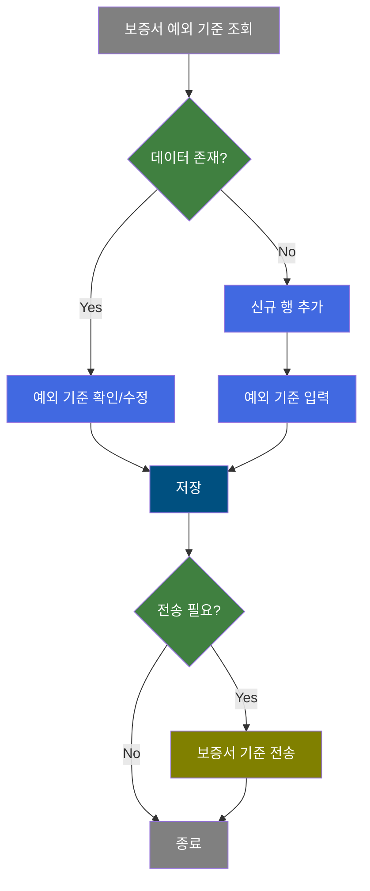
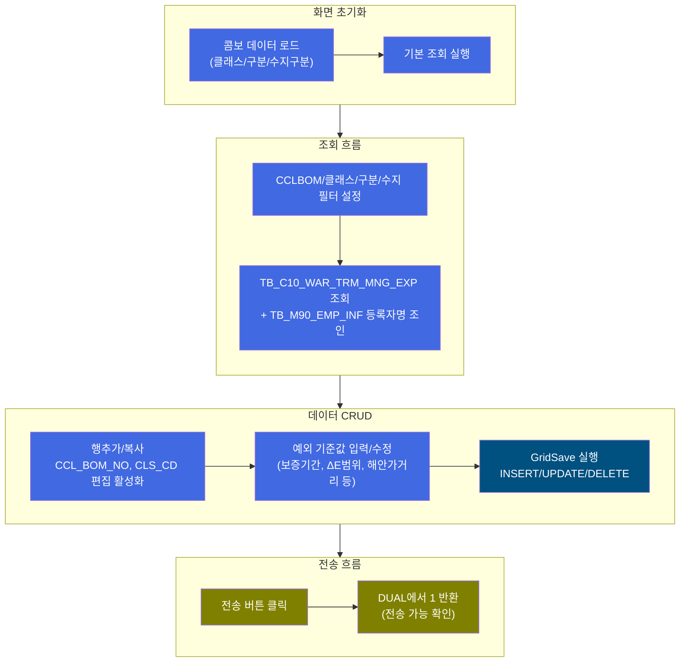
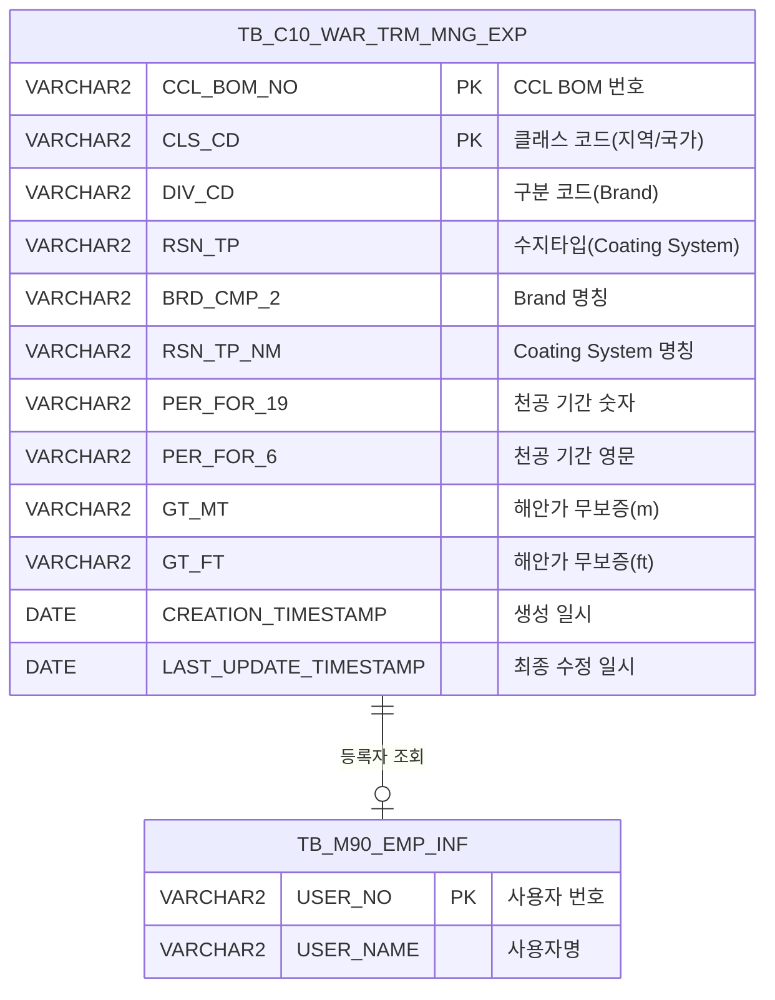

<h1 style="font-size: 40px; text-align: center; font-weight:
   bold; margin: 30px 0;">
  C106000120tab02 레거시 시스템 분석 종합 보고서
</h1>


# 1. 시스템 개요
- **서비스 ID**: C106000120tab02
- **업무명**: 보증서기준등록(예외)
- **분석 일시**: 2026-03-17 11:11 KST
- **분석 시간**: 약 5분
- **전체 Activity 수**: 7개 (Built-in 7개, Custom 0개)
- **분석자**: Claude Opus 4.6 / Sonnet 4.6
- **분석 도구**: /analyze-service C106000120tab02
- **문서 버전**: 1.0

# 📊 비즈니스 프로세스 분석

## 시스템 목적

본 서비스는 CCL(Color Coated Line, 컬러강판 라인) 공정에서 생산되는 제품의 **보증서 예외 기준**을 등록/관리하는 화면이다. 보증서는 고객에게 제공되는 제품 품질 보증 문서로, 천공(Perforation), 변색(Fading), 백화(Chalking), 박리(Peel/Flake) 등의 품질 항목에 대한 보증 기간과 기준값을 포함한다.

표준 보증서 기준(C106000120tab01)과 별도로, CCL BOM(Bill of Materials) 번호와 클래스(지역/국가) 조합별로 예외적인 보증 기준을 설정할 수 있다. 이를 통해 특정 제품/고객/지역에 대해 차별화된 보증 조건(보증 기간, ΔE 범위, 해안가 무보증 거리 등)을 관리한다.

주요 사용자는 CCL 품질 관리 담당자이며, CCLBOM 번호, 클래스(지역/국가), 구분(Brand), 수지타입(Coating System) 조합으로 예외 기준을 조회/등록/수정/삭제하고, 전송 기능을 통해 관련 시스템에 데이터를 연계한다.

## 핵심 워크플로우 다이어그램



### 상세 워크플로우 다이어그램



## 주요 유즈케이스

### UC-01: 보증서 예외 기준 조회
- **Actor**: CCL 품질 관리 담당자
- **목적**: CCLBOM 번호, 클래스, 구분, 수지타입 조합으로 예외 보증 기준을 조회하여 현재 등록된 기준값 확인

- **전제조건**:
  - 사용자가 시스템에 로그인되어 있음
  - C106000120 보증서기준등록 화면의 tab02(예외) 탭에 진입한 상태
  - 콤보박스(클래스/구분/수지구분)에 데이터가 로드된 상태

- **주요 흐름**:
  1. 사용자가 CCLBOM 입력란에 BOM 번호를 입력 (LIKE 검색 지원)
  2. 클래스(지역/국가), 구분(Brand), 수지(Coating System) 콤보에서 필터 조건 선택 (기본값: 전체)
  3. 조회 버튼 클릭
  4. C106000120tab02.select 쿼리 실행 - TB_C10_WAR_TRM_MNG_EXP 조회, 등록자명은 TB_M90_EMP_INF에서 서브쿼리로 조인
  5. Grid에 예외 기준 목록 표시 (26개 컬럼)

- **대체 흐름**:
  - 조회 결과 없음: Grid에 데이터 없이 빈 상태 표시
  - CCLBOM 미입력 시: 전체 데이터 조회 (LIKE '%' 패턴)

- **후행조건**:
  - 조회된 예외 기준이 Grid에 표시됨
  - 편집 가능한 컬럼(노란색 배경)에서 수정 가능한 상태

### UC-02: 보증서 예외 기준 등록
- **Actor**: CCL 품질 관리 담당자
- **목적**: 특정 CCLBOM + 클래스 조합에 대해 새로운 예외 보증 기준을 신규 등록

- **전제조건**:
  - 등록 권한이 있음
  - 등록할 CCLBOM 번호와 클래스(지역/국가) 코드를 알고 있음

- **주요 흐름**:
  1. 메뉴의 "행추가" 또는 "복사" 클릭
  2. 신규 행 추가 시 CCL_BOM_NO, CLS_CD 컬럼이 편집 가능('ed')으로 전환
  3. CCLBOM 번호, 지역/국가 코드 입력
  4. Brand(DIV_CD), Coating System(RSN_TP), 보증 기간/범위값 입력
     - 천공(Perforation) 기간: PER_FOR_19(숫자), PER_FOR_6(영문)
     - 변색(Fading) 기간: FA_TRM_7(영문), FA_TRM_8(숫자)
     - 변색 ΔE Roof 범위: FA_ROF_9(숫자), FA_ROF_10(영문)
     - 변색 ΔE Wall 범위: FA_WAL_11(숫자), FA_WAL_12(영문)
     - 백화(Chalking) Rate Roof: CH_ROF_15(숫자), CH_ROF_16(영문)
     - 백화 Rate Wall: CH_WAL_17(숫자), CH_WAL_18(영문)
     - 박리(Peel/Flake) 기간: PE_FL_1(숫자), PE_FL_20(영문)
     - 해안가 무보증 거리: GT_MT(m), GT_FT(ft)
  5. 저장 버튼 클릭 → 확인 다이얼로그 → C106000120tab02.insert 실행
  6. 감사 정보(ObjectType, ObjectId, ProgramId, Timestamp) 자동 설정

- **대체 흐름**:
  - PK 중복(CCL_BOM_NO + CLS_CD): DB 제약 조건 위반으로 에러 발생
  - 복사 기능 사용: 기존 행 데이터가 복사되어 CCL_BOM_NO, CLS_CD만 변경하면 됨

- **후행조건**:
  - 새 예외 기준이 TB_C10_WAR_TRM_MNG_EXP에 INSERT됨
  - 저장 완료 후 Grid 자동 재조회 및 콤보 재조회

### UC-03: 보증서 예외 기준 수정/삭제
- **Actor**: CCL 품질 관리 담당자
- **목적**: 기존 예외 보증 기준의 값을 변경하거나 불필요한 기준을 삭제

- **전제조건**:
  - 수정/삭제 대상 데이터가 Grid에 조회된 상태
  - 수정 권한이 있음

- **주요 흐름 (수정)**:
  1. Grid에서 편집 가능한 컬럼(노란색 배경)의 값을 직접 수정
  2. 저장 버튼 클릭 → C106000120tab02.update 실행
  3. CCL_BOM_NO + CLS_CD를 WHERE 조건으로 해당 행 UPDATE

- **주요 흐름 (삭제)**:
  1. Grid에서 삭제할 행 선택 (멀티셀렉트 지원)
  2. 메뉴의 "삭제" 클릭
  3. 저장 버튼 클릭 → C106000120tab02.delete 실행
  4. CCL_BOM_NO + CLS_CD로 해당 행 DELETE

- **대체 흐름**:
  - 실행 취소(undo): 수정 전 상태로 복원
  - 다시 실행(redo): 취소한 수정 재적용

- **후행조건**:
  - 수정/삭제 결과가 DB에 반영됨
  - Grid 재조회 및 콤보 데이터 갱신

### UC-04: 보증서 기준 전송
- **Actor**: CCL 품질 관리 담당자
- **목적**: 등록/수정된 보증서 예외 기준을 관련 시스템에 전송

- **전제조건**:
  - 전송할 데이터가 존재함

- **주요 흐름**:
  1. 전송 버튼 클릭
  2. 확인 다이얼로그 표시
  3. C106000120tab02.send 쿼리 실행 (DUAL에서 1 반환 - 전송 가능 확인)
  4. FormInsert 액티비티로 전송 처리

- **대체 흐름**:
  - 전송 실패 시: 에러 메시지 표시

- **후행조건**:
  - 보증서 기준 정보가 연계 시스템에 전송됨

---

## 비즈니스 로직 상세

### 1. 콤보박스 동적 필터 생성 (UNION ALL 패턴)

- **목적**: 클래스/구분/수지구분 콤보에 "전체" 옵션 + 실제 데이터에 존재하는 값만 동적으로 표시
- **처리 케이스**:

  **[케이스 1: 전체 + 실제 값 동적 생성]**
  ```
    조건: 콤보 로드 시 (화면 초기화 및 저장 후 갱신)
    처리:
      1. DUAL에서 '%' → '전체' 행 생성 (LIKE 검색 시 전체 매칭)
      2. TB_C10_WAR_TRM_MNG_EXP에서 해당 컬럼 GROUP BY로 DISTINCT 값 추출
      3. UNION ALL로 합쳐서 콤보 목록 구성
      4. ORDER BY로 정렬 (전체가 '%'이므로 최상단 표시)
  ```

- **적용 쿼리**: C106000120tab02ClsCdComb.select, C106000120tab02DivCdComb.select, C106000120tab02RsnTpComb.select
- **비즈니스 의미**: 콤보 값이 고정 코드가 아닌 실제 데이터 기반으로 동적 생성되므로, 새로운 클래스/구분/수지타입이 추가되면 자동으로 콤보에 반영됨

### 2. LIKE 기반 필터링 패턴

- **목적**: 조회 조건의 유연한 필터링 (전체/부분 매칭)
- **처리 케이스**:

  **[케이스 1: 전체 선택 시]**
  ```
    조건: 콤보에서 '전체' 선택 (값 = '%')
    처리:
      1. WHERE CCL_BOM_NO LIKE '%' || '%' → 전체 매칭
      2. 모든 데이터 조회됨
  ```

  **[케이스 2: 특정 값 선택 시]**
  ```
    조건: 콤보에서 특정 코드 선택 (예: CLS_CD = 'KR')
    처리:
      1. WHERE CLS_CD LIKE 'KR' || '%' → 'KR'로 시작하는 값 매칭
      2. 정확한 코드 기반 필터링 (LIKE + '%'이므로 전방 일치)
  ```

### 3. 보증서 품질 항목 구조

- **목적**: CCL 제품 보증서에 포함되는 품질 보증 항목의 숫자/영문 쌍 관리
- **처리 케이스**:

  **[케이스 1: 숫자-영문 쌍 구조]**
  ```
    각 품질 항목은 숫자값과 영문 설명을 쌍으로 관리:
      - 천공(Perforation): PER_FOR_19(숫자) / PER_FOR_6(영문)
      - 변색 기간(Fading Term): FA_TRM_8(숫자) / FA_TRM_7(영문)
      - 변색 Roof ΔE: FA_ROF_9(숫자) / FA_ROF_10(영문)
      - 변색 Wall ΔE: FA_WAL_11(숫자) / FA_WAL_12(영문)
      - 백화 기간(Chalking Term): CH_TRM_13(숫자) / CH_TRM_14(영문)
      - 백화 Roof Rate: CH_ROF_15(숫자) / CH_ROF_16(영문)
      - 백화 Wall Rate: CH_WAL_17(숫자) / CH_WAL_18(영문)
      - 박리(Peel/Flake): PE_FL_1(숫자) / PE_FL_20(영문)
      - 해안가 무보증: GT_MT(미터) / GT_FT(피트)
  ```

---

# 💾 데이터 요구사항

## 핵심 테이블

### 1. C10APUSER.TB_C10_WAR_TRM_MNG_EXP - (보증서 예외 기준 관리)
| 컬럼명 | 타입 | PK | 설명 |
|--------|------|----|------|
| CCL_BOM_NO | VARCHAR2 | ✅ | CCL BOM 번호 |
| CLS_CD | VARCHAR2 | ✅ | 클래스 코드 (지역/국가) |
| DIV_CD | VARCHAR2 | | 구분 코드 (Brand) |
| RSN_TP | VARCHAR2 | | 수지타입 (Coating System 코드) |
| BRD_CMP_2 | VARCHAR2 | | Brand 명칭 |
| RSN_TP_NM | VARCHAR2 | | Coating System 명칭 |
| PER_FOR_19 | VARCHAR2 | | 천공(Perforation) 기간 숫자 |
| PER_FOR_6 | VARCHAR2 | | 천공(Perforation) 기간 영문 |
| FA_TRM_7 | VARCHAR2 | | 변색(Fading) 기간 영문 |
| FA_TRM_8 | VARCHAR2 | | 변색(Fading) 기간 숫자 |
| FA_ROF_9 | VARCHAR2 | | 변색 ΔE Roof 범위 숫자 |
| FA_ROF_10 | VARCHAR2 | | 변색 ΔE Roof 범위 영문 |
| FA_WAL_11 | VARCHAR2 | | 변색 ΔE Wall 범위 숫자 |
| FA_WAL_12 | VARCHAR2 | | 변색 ΔE Wall 범위 영문 |
| CH_TRM_13 | VARCHAR2 | | 백화(Chalking) 기간 숫자 |
| CH_TRM_14 | VARCHAR2 | | 백화(Chalking) 기간 영문 |
| CH_ROF_15 | VARCHAR2 | | 백화 Roof Rate 숫자 |
| CH_ROF_16 | VARCHAR2 | | 백화 Roof Rate 영문 |
| CH_WAL_17 | VARCHAR2 | | 백화 Wall Rate 숫자 |
| CH_WAL_18 | VARCHAR2 | | 백화 Wall Rate 영문 |
| PE_FL_1 | VARCHAR2 | | 박리(Peel/Flake) 기간 숫자 |
| PE_FL_20 | VARCHAR2 | | 박리(Peel/Flake) 기간 영문 |
| GT_MT | VARCHAR2 | | 해안가 무보증 거리 (m) |
| GT_FT | VARCHAR2 | | 해안가 무보증 거리 (ft) |
| CREATED_OBJECT_TYPE | VARCHAR2 | | 생성 객체 타입 |
| CREATED_OBJECT_ID | VARCHAR2 | | 생성자 ID |
| CREATED_PROGRAM_ID | VARCHAR2 | | 생성 프로그램 ID |
| CREATION_TIMESTAMP | DATE | | 생성 일시 |
| LAST_UPDATED_OBJECT_TYPE | VARCHAR2 | | 최종 수정 객체 타입 |
| LAST_UPDATED_OBJECT_ID | VARCHAR2 | | 최종 수정자 ID |
| LAST_UPDATE_PROGRAM_ID | VARCHAR2 | | 최종 수정 프로그램 ID |
| LAST_UPDATE_TIMESTAMP | DATE | | 최종 수정 일시 |

### 2. M90APUSER.TB_M90_EMP_INF - (사원 정보, 참조 테이블)
| 컬럼명 | 타입 | PK | 설명 |
|--------|------|----|------|
| USER_NO | VARCHAR2 | ✅ | 사용자 번호 |
| USER_NAME | VARCHAR2 | | 사용자명 |

## 데이터 플로우

### 1. 조회
```
[보증서 예외 기준 조회]
화면 진입 / 조회 버튼 클릭
→ C106000120tab02.select
  FROM C10APUSER.TB_C10_WAR_TRM_MNG_EXP A
  LEFT JOIN M90APUSER.TB_M90_EMP_INF (스칼라 서브쿼리: USER_NO = A.CREATED_OBJECT_ID)
  WHERE CCL_BOM_NO LIKE :CCL_BOM_NO || '%'
    AND CLS_CD LIKE :CLS_COMB || '%'
    AND DIV_CD LIKE :DIV_COMB || '%'
    AND RSN_TP LIKE :RSN_COMB || '%'
  ORDER BY CCL_BOM_NO
→ Grid에 예외 기준 목록 표시 (등록자명 포함)
```

### 2. 콤보 데이터 로드
```
[클래스/구분/수지구분 콤보 조회]
화면 초기화 / 저장 완료 후
→ C106000120tab02ClsCdComb.select
  SELECT '%','전체' FROM DUAL
  UNION ALL
  SELECT CLS_CD, CLS_CD FROM TB_C10_WAR_TRM_MNG_EXP GROUP BY CLS_CD
→ 클래스 콤보에 바인딩

→ C106000120tab02DivCdComb.select (동일 패턴, DIV_CD 기준)
→ 구분 콤보에 바인딩

→ C106000120tab02RsnTpComb.select (동일 패턴, RSN_TP 기준)
→ 수지구분 콤보에 바인딩
```

### 3. 저장 (INSERT/UPDATE/DELETE)
```
[예외 기준 저장]
저장 버튼 클릭 → 확인 다이얼로그
→ GridSave 액티비티 실행
  - 신규 행: C106000120tab02.insert
    INSERT INTO C10APUSER.TB_C10_WAR_TRM_MNG_EXP
    (CCL_BOM_NO, CLS_CD, DIV_CD, RSN_TP, ... GT_MT, GT_FT)
    + 감사 컬럼 (CREATED/LAST_UPDATED 4쌍)
  - 수정 행: C106000120tab02.update
    UPDATE C10APUSER.TB_C10_WAR_TRM_MNG_EXP
    SET DIV_CD, RSN_TP, ... GT_MT, GT_FT + 감사 컬럼
    WHERE CCL_BOM_NO = :CCL_BOM_NO AND CLS_CD = :CLS_CD
  - 삭제 행: C106000120tab02.delete
    DELETE FROM C10APUSER.TB_C10_WAR_TRM_MNG_EXP
    WHERE CCL_BOM_NO = :CCL_BOM_NO AND CLS_CD = :CLS_CD
→ 저장 완료 후 Grid 재조회 + 콤보 재조회
```

### 4. 전송
```
[보증서 기준 전송]
전송 버튼 클릭 → 확인 다이얼로그
→ C106000120tab02.send
  SELECT 1 FROM DUAL (전송 가능 확인)
→ FormInsert 액티비티로 전송 처리
```

## SQL 일람표

| SQL 이름 | 쿼리 ID | 타입 | 출처 | 테이블 |
|---------|---------|-----|------|--------|
| 보증서 예외 기준 조회 | C106000120tab02.select | SELECT | Service | TB_C10_WAR_TRM_MNG_EXP, TB_M90_EMP_INF |
| 보증서기준정보 전송 | C106000120tab02.send | SELECT | Service | DUAL |
| 수지타입 콤보 조회 | C106000120tab02RsnTpComb.select | SELECT | Service | TB_C10_WAR_TRM_MNG_EXP |
| 분류 코드 콤보 조회 | C106000120tab02ClsCdComb.select | SELECT | Service | TB_C10_WAR_TRM_MNG_EXP |
| 부문 코드 콤보 조회 | C106000120tab02DivCdComb.select | SELECT | Service | TB_C10_WAR_TRM_MNG_EXP |
| 보증서 예외기준 추가 | C106000120tab02.insert | INSERT | Service | TB_C10_WAR_TRM_MNG_EXP |
| 보증서 예외기준 삭제 | C106000120tab02.delete | DELETE | Service | TB_C10_WAR_TRM_MNG_EXP |
| 보증서 예외기준 수정 | C106000120tab02.update | UPDATE | Service | TB_C10_WAR_TRM_MNG_EXP |

## ER 다이어그램 (핵심 관계)



관계 설명:
- **TB_C10_WAR_TRM_MNG_EXP**가 중심 테이블로, 보증서 예외 기준의 모든 데이터를 관리
- **TB_M90_EMP_INF**: CREATED_OBJECT_ID → USER_NO 스칼라 서브쿼리로 등록자명 조회
- PK 구성: CCL_BOM_NO + CLS_CD 복합키

---

# 🖥️ 사용자 인터페이스 요구사항

## 화면 레이아웃 상세

### Layout 구조 (Absolute 배치)
```javascript
{
  totalWidth: "977px",
  components: [
    {
      id: "C106000120tab02_Form_1",
      type: "form",
      position: { left: "0px", top: "0px", width: "977px", height: "57px" }
    },
    {
      id: "C106000120tab02_Menu_1",
      type: "menu",
      position: { left: "0px", top: "57px", width: "977px", height: "25px" }
    },
    {
      id: "C106000120tab02_Grid_1",
      type: "grid",
      position: { left: "0px", top: "82px", width: "974px", height: "428px" }
    },
    {
      id: "C106000120tab02_messagebox",
      type: "messagebox",
      position: { left: "-1px", top: "508px", width: "976px", height: "23px" }
    }
  ]
}
```

## 입출력 요소

### Form 컴포넌트
**C106000120tab02_Form_1**
- CCLBOM: input - CCL BOM 번호 입력 (90px)
- CLS_COMB: combo(readonly) - 클래스(지역/국가) 선택 → OrdlnComboData.do로 동적 로드
- RSN_COMB: combo(readonly) - 수지(Coating System) 선택 → OrdlnComboData.do로 동적 로드
- DIV_COMB: combo(readonly) - 구분(Brand) 선택 → OrdlnComboData.do로 동적 로드
- send: custombutton - 전송 (75px)
- find: button - 조회
- save: button - 저장

### Menu 컴포넌트
**C106000120tab02_Menu_1** (referenceItem: Grid_1)
- refresh: 새로고침 (refresh.gif)
- add: 행추가 (new.gif)
- copy: 복사 (copy.gif)
- remove: 삭제 (remove.gif)

### Grid 컴포넌트

**C106000120tab02_Grid_1 (보증서 예외 기준 목록)**
- 편집 가능 여부: 예 (대부분 컬럼 편집 가능)
- Split: 0 (고정 컬럼 없음)
- 행 수: 17행 (페이지셋 지원)
- 설정: multiselect, contextmenu, smartRendering, validation, colwidthUnit=%
- 대상 테이블: TB_C10_WAR_TRM_MNG
- 주요 컬럼 (26개):

  **기본 정보 (읽기 전용)**:
  - CCL_BOM_NO: ro - CCLBOM (10%, 중앙정렬) - 신규 행에서만 편집 가능
  - CLS_CD: ro - 지역/국가 (10%, 중앙정렬) - 신규 행에서만 편집 가능

  **분류 정보**:
  - DIV_CD: ed - Brand 코드 (10%, 좌측정렬, 배경:#FFFFC0)
  - RSN_TP: ed - Coating System 코드 (8%, 중앙정렬, 배경:#FFFFC0)
  - BRD_CMP_2: ed - Brand 명칭 (20%, 좌측정렬, 배경:#FFFFC0)
  - RSN_TP_NM: ed - Coating System 명칭 (20%, 좌측정렬, 배경:#FFFFC0)

  **천공(Perforation) 보증**:
  - PER_FOR_19: ed - 천공 기간 숫자(1) (20%, 우측정렬, 배경:#FFFFC0)
  - PER_FOR_6: ed - 천공 기간 영문(6) (20%, 좌측정렬, 배경:#FFFFC0)

  **변색(Fading) 보증**:
  - FA_TRM_7: ed - 변색 기간 영문(7) (20%, 좌측정렬, 배경:#FFFFC0)
  - FA_TRM_8: ed - 변색 기간 숫자(8) (20%, 우측정렬, 배경:#FFFFC0)
  - FA_ROF_9: ed - 변색 ΔE Roof 범위 숫자(9) (30%, 우측정렬, 배경:#FFFFC0)
  - FA_ROF_10: ed - 변색 ΔE Roof 범위 영문(10) (30%, 좌측정렬, 배경:#FFFFC0)
  - FA_WAL_11: ed - 변색 ΔE Wall 범위 숫자(11) (30%, 우측정렬, 배경:#FFFFC0)
  - FA_WAL_12: ed - 변색 ΔE Wall 범위 영문(12) (30%, 좌측정렬, 배경:#FFFFC0)

  **백화(Chalking) 보증**:
  - CH_TRM_13: ed - 백화 기간 숫자(13) (30%, 우측정렬, 배경:#FFFFC0)
  - CH_TRM_14: ed - 백화 기간 영문(14) (30%, 좌측정렬, 배경:#FFFFC0)
  - CH_ROF_15: ed - 백화 Roof Rate 숫자(15) (30%, 우측정렬, 배경:#FFFFC0)
  - CH_ROF_16: ed - 백화 Roof Rate 영문(16) (30%, 좌측정렬, 배경:#FFFFC0)
  - CH_WAL_17: ed - 백화 Wall Rate 숫자(17) (30%, 우측정렬, 배경:#FFFFC0)
  - CH_WAL_18: ed - 백화 Wall Rate 영문(18) (30%, 좌측정렬, 배경:#FFFFC0)

  **박리(Peel/Flake) 보증**:
  - PE_FL_1: ed - 박리 기간 숫자(1) (30%, 우측정렬, 배경:#FFFFC0)
  - PE_FL_20: ed - 박리 기간 영문(20) (30%, 좌측정렬, 배경:#FFFFC0)

  **해안가 무보증 거리**:
  - GT_MT: ed - 해안가 무보증(m) (15%, 우측정렬, 배경:#FFFFC0)
  - GT_FT: ed - 해안가 무보증(ft) (15%, 우측정렬, 배경:#FFFFC0)

  **감사 정보 (읽기 전용)**:
  - CREATED_OBJECT_ID: ro - 등록자 (10%, 중앙정렬) - 사원명으로 변환 표시
  - CREATION_TIMESTAMP: ro - 등록일자 (10%, 중앙정렬, sort_date_custom)

## 화면 동작 흐름

### 1. 화면 초기 로딩
```
1. 탭 진입 (C106000120 화면의 tab02)
2. Form 로드 (onLoadForm 이벤트)
   - comboList(formId, 'onLoadForm') 호출
   - 클래스 콤보: OrdlnComboData.do → C106000120tab02ClsCdComb.select
   - 구분 콤보: OrdlnComboData.do → C106000120tab02DivCdComb.select
   - 수지구분 콤보: OrdlnComboData.do → C106000120tab02RsnTpComb.select
3. Grid 로드 (onLoadGrid 이벤트)
   - items['C106000120tab02_Grid_1'].loadData(findUrl)
   - 기본 조건(전체)으로 자동 조회
4. 상태바 초기화 (messagebox)
```

### 2. 조건 조회
```
1. 사용자가 CCLBOM 입력, 콤보에서 클래스/구분/수지 선택
2. 조회 버튼 클릭 (find 이벤트)
3. items[referenceItem].loadData(findUrl) 호출
   - Form 파라미터: CCL_BOM_NO, CLS_COMB, DIV_COMB, RSN_COMB
4. C106000120tab02.select 쿼리 실행
5. Grid에 결과 바인딩
```

### 3. 데이터 편집 및 저장
```
1. Grid에서 편집 가능 컬럼(노란색 배경) 직접 수정
   - 또는 메뉴 "행추가"/"복사" 후 신규 데이터 입력
   - 행추가/복사 시 setCellExcellType으로 CCL_BOM_NO, CLS_CD를 'ed'로 전환
2. 저장 버튼 클릭 (save 이벤트)
3. 확인 다이얼로그 표시
4. items[referenceItem].sendGrid(referenceItem, eventName) 호출
   - handleDataProcess.do → GridSave 액티비티
5. onAfterUpdateFinishEvent 콜백
   - find('find', formId, 'C106000120tab02_Grid_1') → Grid 재조회
   - comboList(formId, fromDate, toDate, 'AfterUpdate') → 콤보 재조회
```

### 4. 컨텍스트 메뉴 기능
```
1. Grid 우클릭
2. 컨텍스트 메뉴 표시
3. 기능 선택:
   - 컬럼이동(move_grid): enableColumnMove(true/false)
   - 필터(filter_grid): enableHeaderMenu()
   - 편집가능(editable_grid): setEditable(true/false)
   - 엑셀(excel_grid): toExcel('/gridexcel', 'color')
```

## JavaScript 모듈

**C106000120tab02.jsp** (탭 내장 스크립트)
- find(eventName, formId, gridId): 조회 - Form 파라미터로 Grid 데이터 로드 (items[referenceItem].loadData)
- save(): 저장 - 확인 다이얼로그 후 items[referenceItem].sendGrid 호출
- send(): 전송 - 확인 다이얼로그 후 items['C106000120tab02_Form_1'].sendForm 호출
- refresh(): 새로고침 - clearDataProcess() 후 loadData(findUrl)
- add(): 행추가 - addRow() 후 setCellExcellType(col0='ed', col1='ed')
- copy(): 복사 - copyRowContent() 후 setCellExcellType(col0='ed', col1='ed')
- remove(): 삭제 - removeRow()
- undo(): 실행 취소 - items[referenceItem].undo()
- redo(): 다시 실행 - items[referenceItem].redo()
- comboList(formId, mode): 콤보 데이터 로드 (onLoadForm, AfterUpdate)
- findMessage(appMsg): 메시지박스에 메시지 표시 (uiCommon.message)
- onGridContextMenuClick(id, zoneId, cas): 컨텍스트 메뉴 처리

## 주요 이벤트 핸들러

**onLoadForm (폼 로드 완료)**
- 이벤트 타입: onXLEEvent lifecycle
- 처리 내용:
  1. comboList(formId, 'onLoadForm') 호출
  2. 클래스/구분/수지구분 3개 콤보 데이터 로드

**onLoadGrid (그리드 로드 완료)**
- 이벤트 타입: onXLEEvent lifecycle
- 처리 내용:
  1. items['C106000120tab02_Grid_1'].loadData(findUrl) 호출
  2. 기본 조건으로 초기 데이터 자동 조회

**onAfterUpdateFinishEvent (저장 완료 후)**
- 이벤트 타입: onAfterUpdateFinishEvent
- 처리 내용:
  1. find('find', formId, 'C106000120tab02_Grid_1') → Grid 재조회
  2. comboList(formId, fromDate, toDate, 'AfterUpdate') → 콤보 재조회
  3. 신규 추가된 클래스/구분/수지값이 콤보에 자동 반영

**onGridContextMenuClick (컨텍스트 메뉴)**
- 이벤트 타입: Grid 우클릭 컨텍스트 메뉴
- 처리 내용:
  1. move_grid: enableColumnMove(true/false) 토글
  2. filter_grid: enableHeaderMenu() 필터 활성화
  3. editable_grid: setEditable(true/false) 편집모드 토글
  4. excel_grid: toExcel('/gridexcel', 'color') 엑셀 다운로드

---

# 📌 특이사항 및 주의사항

## 1. 컬럼 번호 기반 명명 규칙
- 품질 항목 컬럼명이 일관된 비즈니스 명칭이 아닌 **숫자 접미사 기반**(PER_FOR_19, PER_FOR_6, FA_TRM_7, FA_TRM_8 등)으로 되어 있어 컬럼명만으로는 의미 파악이 어려움. 보증서 양식의 셀 번호에서 유래한 것으로 추정되며, 현대화 시 의미 있는 컬럼명으로 매핑 테이블이 필요함.

## 2. PK 구성과 행추가/복사 시 편집 모드 전환
- Grid의 CCL_BOM_NO, CLS_CD 컬럼은 기본적으로 읽기 전용(ro)이나, **행추가/복사 시에만 setCellExcellType으로 편집 가능('ed')으로 동적 전환**됨. 이는 기존 행의 PK 변경을 방지하면서 신규 행에서는 PK 입력을 허용하기 위한 패턴으로, 프레임워크 레벨이 아닌 JavaScript에서 직접 제어하고 있음.

## 3. 전송(send) 쿼리의 더미 패턴
- C106000120tab02.send 쿼리가 `SELECT 1 FROM DUAL`로 실질적인 전송 로직 없이 더미값만 반환함. 실제 전송 로직은 FormInsert(com.poscoict.glue.biz.dhtmlx.form.FormInsert) 내부 또는 후속 시스템에서 처리되는 것으로 보이며, 이 쿼리 자체는 전송 트리거 역할만 수행.

## 4. 콤보 데이터의 실데이터 의존성
- 콤보(클래스/구분/수지구분) 목록이 마스터 코드 테이블이 아닌 **TB_C10_WAR_TRM_MNG_EXP의 실제 데이터에서 GROUP BY로 추출**됨. 따라서 데이터가 하나도 없으면 콤보에 "전체" 외 선택지가 없고, 새로운 코드값이 추가되면 저장 후 콤보 재조회 시 자동 반영됨.

## 5. LIKE 패턴 조회의 와일드카드 처리
- 조회 시 모든 조건이 `LIKE :param || '%'` 패턴을 사용하며, 콤보의 "전체" 값이 '%'임. 따라서 전체 선택 시 `LIKE '%%'`가 되어 전체 조회가 됨. 이 패턴은 정확한 값 매칭이 아닌 전방 일치 검색이므로, 예상치 못한 데이터가 조회될 수 있음.

## 6. 감사 컬럼 중복 설정
- INSERT 쿼리에서 CREATED 감사 컬럼과 LAST_UPDATED 감사 컬럼에 동일한 파라미터(ObjectType, ObjectId, ProgramId, Timestamp)가 바인딩됨. 최초 생성 시 생성 정보와 최종 수정 정보가 동일하게 설정되는 올바른 패턴.

## 7. Grid 테이블명 불일치
- Grid XML의 table 속성이 "TB_C10_WAR_TRM_MNG"인데, 실제 SQL에서 사용하는 테이블은 "TB_C10_WAR_TRM_MNG_**EXP**" (예외 테이블)임. Grid의 table 속성은 프레임워크 참조용이며 실제 쿼리와는 별개이나, 유지보수 시 혼동 가능성 있음.

---

# 📚 참고 문서

- **Service XML**: `src/service/C106000120tab02-service.xml`
- **Query SQL**: `src/query/C106000120tab02-query.glue_sql`
- **JSP**: `WebContents/C106000120tab02.jsp`
- **UI XML**:
  - `WebContents/header/kr/C106000120tab02/C106000120tab02_Form_1.xml`
  - `WebContents/header/kr/C106000120tab02/C106000120tab02_Menu_1.xml`
  - `WebContents/header/kr/C106000120tab02/C106000120tab02_Grid_1.xml`
