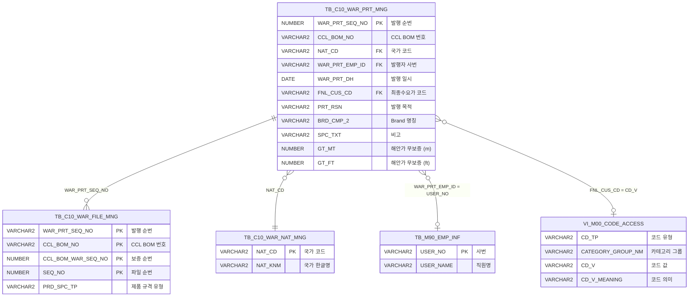

<h1 style="font-size: 40px; text-align: center; font-weight:
   bold; margin: 30px 0;">
  C106000120tab03 레거시 시스템 분석 종합 보고서
</h1>


# 1. 시스템 개요
- **서비스 ID**: C106000120tab03
- **업무명**: 보증서 발행내역 관리 (발행이력 조회)
- **분석 일시**: 2026-03-17 (KST)
- **전체 Activity 수**: 3개 (built-in)
- **분석자**: Claude Opus 4.6 / Sonnet 4.6
- **분석 도구**: /analyze-service C106000120tab03
- **문서 버전**: 1.0

# 📊 비즈니스 프로세스 분석

## 시스템 목적

C106000120tab03은 CCL 공정의 보증서 관리 화면(C106000120)의 **세 번째 탭**으로, 보증서 발행내역을 조회하는 기능을 제공한다. 발행일자 범위, 발행자, 국가, CCLBOM번호 등의 조건으로 보증서 발행 이력을 검색하고, 발행된 보증서의 품질 스펙(천공/변색/백화/박리 기간, 해안가 무보증 거리 등)을 한눈에 확인할 수 있다.

이 탭은 보증서 발행 관리 테이블(`TB_C10_WAR_PRT_MNG`)을 중심으로 직원 정보, 국가명, 고객 코드 의미, 파일 첨부 여부 등을 조인하여 종합적인 발행 이력 정보를 제공한다. 그리드의 보증서(WTY_ENG_YN) 컬럼 셀 클릭 시 C106000120pop01 팝업을 통해 영문 보증서 파일을 등록/관리할 수 있다.

국가 콤보박스는 발행 기간 내 실제 존재하는 국가만 동적으로 로드하여 사용자의 필터링 편의성을 높인다.

## 주요 유즈케이스

### UC-01: 보증서 발행내역 조회
- **Actor**: CCL 보증서 담당자
- **목적**: 발행일자, 국가, 발행자 등 조건으로 보증서 발행 이력을 검색하여 발행 현황 파악

- **전제조건**:
  - C106000120 화면의 tab03 탭이 활성화된 상태
  - 발행일자 범위가 자동 설정됨 (오늘 ~ 15일 전)

- **주요 흐름**:
  1. 탭 활성화 시 `onLoadForm()` → 발행일자 기본값 설정 (WAR_PRT_DH_END=오늘, WAR_PRT_DH_STR=오늘-15일)
  2. `C106000120tab03NatCdCombo.select` 쿼리로 국가 콤보 동적 로드 (발행 기간 내 존재 국가만)
  3. `onLoadGrid()` → 기본 조건으로 자동 조회 (`C106000120tab03.select`)
  4. 조건 변경 후 조회 버튼 클릭 또는 Enter 키 입력
  5. Grid에 발행순번, CCLBOM, 지역/국가, 보증서 첨부여부, 비고, 발행자명, 발행일자, 최종수요가, 발행목적, Brand 명칭, 품질 스펙 컬럼 표시

- **대체 흐름**:
  - 조회 결과 없음: 빈 그리드 표시
  - 발행자 입력 시: USER_NAME LIKE 검색 (부분 일치)
  - CCLBOM번호 입력 시: 전방 일치 검색

- **후행조건**:
  - 발행내역이 Grid에 표시됨
  - 보증서 컬럼 클릭으로 파일 관리 팝업 진입 가능

### UC-02: 국가별 필터링 조회
- **Actor**: CCL 보증서 담당자
- **목적**: 특정 국가의 보증서 발행 이력만 필터링하여 조회

- **전제조건**:
  - 국가 콤보박스에 데이터가 로드된 상태

- **주요 흐름**:
  1. 국가 콤보박스에서 특정 국가 선택 (발행 기간 내 실존 국가만 표시)
  2. 조회 버튼 클릭
  3. `NAT_CD LIKE NVL(:NAT_COMB, '%')` 조건으로 필터링
  4. 해당 국가 발행 이력만 Grid에 표시

- **대체 흐름**:
  - "전체" 선택 시: '%' 값 전달 → 전체 국가 조회
  - 발행 기간 변경 시: 국가 콤보 재로드 필요 (해당 기간 내 존재 국가가 달라질 수 있음)

- **후행조건**:
  - 선택 국가의 발행 이력만 Grid에 표시됨

### UC-03: 영문 보증서 파일 관리 팝업 호출
- **Actor**: CCL 보증서 담당자
- **목적**: 특정 발행 건의 영문 보증서 파일을 등록/조회/삭제

- **전제조건**:
  - Grid에 발행내역이 조회된 상태
  - 보증서(WTY_ENG_YN) 컬럼이 표시됨

- **주요 흐름**:
  1. Grid의 보증서(WTY_ENG_YN) 컬럼 셀 클릭
  2. `doImgPopUp4()` 함수 실행 → 선택 행의 WAR_PRT_SEQ_NO, CCL_BOM_NO, CCL_BOM_WTY_SEQ_NO, IMG_RGS_TP, PRD_SPC_TP 추출
  3. C106000120pop01.jsp 팝업 오픈 (465x405, 모달)
  4. 팝업에서 파일 업로드/조회/삭제 수행

- **대체 흐름**:
  - 보증서 컬럼이 아닌 다른 컬럼 클릭 시: 팝업 미호출

- **후행조건**:
  - 팝업에서 파일 관리 완료
  - 팝업 닫힘 후 부모 그리드의 WTY_ENG_YN 값은 자동 갱신되지 않음 (새로고침 필요)

---
## 비즈니스 로직 상세

### 1. 국가 콤보 동적 로드 (C106000120tab03NatCdCombo.select)

- **목적**: 발행 기간 내 실제 존재하는 국가만 콤보박스에 표시하여 무효한 필터 선택 방지
- **처리 케이스**:

  **[케이스 1: 전체 옵션 생성]**
  ```
    조건: 항상 실행
    처리:
      1. DUAL 테이블에서 NAT_CD='%', NAT_NM='전체' 레코드 생성
      2. UNION ALL로 실제 국가 목록과 결합
      3. 콤보 첫 번째 옵션으로 "전체" 표시
  ```

  **[케이스 2: 기간 내 국가 추출]**
  ```
    조건: WAR_PRT_DH가 :WAR_PRT_DH_STR ~ :WAR_PRT_DH_END 범위
    처리:
      1. TB_C10_WAR_PRT_MNG에서 발행일자 범위 필터링
      2. NAT_CD 기준 GROUP BY로 중복 제거
      3. TB_C10_WAR_NAT_MNG 서브쿼리로 국가 한글명(NAT_KNM) 조회 (ROWNUM=1)
      4. 기간 내 실제 발행된 국가만 콤보에 표시
  ```

### 2. 보증서 발행 이력 종합 조회 (C106000120tab03.select)

- **목적**: 보증서 발행 관리 테이블의 데이터를 다중 테이블 조인으로 종합 정보 구성
- **처리 케이스**:

  **[케이스 1: 발행자명 변환 (NVL + 서브쿼리)]**
  ```
    조건: WAR_PRT_EMP_ID(사번)이 존재
    처리:
      1. TB_M90_EMP_INF에서 USER_NO = WAR_PRT_EMP_ID 조건으로 USER_NAME 조회
      2. NVL 적용: USER_NAME이 NULL이면 WAR_PRT_EMP_ID(사번) 그대로 표시
      3. WHERE 절에서도 USER_NAME LIKE 검색으로 발행자명 필터링
  ```

  **[케이스 2: 국가명 변환 (서브쿼리)]**
  ```
    조건: NAT_CD가 존재
    처리:
      1. TB_C10_WAR_NAT_MNG에서 NAT_CD 매칭으로 NAT_KNM(국가 한글명) 조회
      2. ROWNUM=1로 단일 결과 보장
  ```

  **[케이스 3: 최종수요가 코드 변환]**
  ```
    조건: FNL_CUS_CD(최종수요가 코드)가 존재
    처리:
      1. FNL_CUS_CD 코드값에 ' : ' 구분자로 코드 의미명 연결
      2. VI_M00_CODE_ACCESS 뷰에서 CD_TP='CUS_CD', CATEGORY_GROUP_NM='SZ0000' 조건으로 조회
      3. 결과 형태: "CUS001 : 한국철강" (코드 + 의미명)
  ```

  **[케이스 4: 영문보증서 첨부파일 여부 (DECODE)]**
  ```
    조건: TB_C10_WAR_FILE_MNG 파일 관리 테이블과 LEFT JOIN
    처리:
      1. DECODE(C.PRD_SPC_TP, '1', 'Y', 'N') → WTY_ENG_YN
      2. PRD_SPC_TP='1'(물성파일) 존재 시 'Y', 아니면 'N'
      3. Grid의 보증서 컬럼에 Y/N 표시
  ```

  **[케이스 5: 발행자 이중 검색 패턴]**
  ```
    조건: :WAR_PRT_EMP_ID 파라미터 입력
    처리:
      1. FROM 절 인라인 뷰 B: USER_NAME LIKE '%' || :WAR_PRT_EMP_ID || '%'
      2. WHERE 절: NVL(B.USER_NAME,' ') LIKE :WAR_PRT_EMP_ID || '%'
      3. 사번 또는 이름 부분 일치로 검색 가능
      4. LEFT JOIN(+)으로 미매칭 시에도 메인 데이터 유지
  ```

---

# 💾 데이터 요구사항

## 핵심 테이블

### 1. TB_C10_WAR_PRT_MNG - (보증서 발행 관리)
| 컬럼명 | 타입 | PK | 설명 |
|--------|------|----|-----|
| WAR_PRT_SEQ_NO | NUMBER | ✅ | 보증서 발행 순번 |
| CCL_BOM_NO | VARCHAR2 |  | CCL BOM 번호 |
| NAT_CD | VARCHAR2 |  | 국가 코드 |
| WAR_PRT_EMP_ID | VARCHAR2 |  | 발행자 사번 |
| WAR_PRT_DH | DATE |  | 발행 일시 |
| FNL_CUS_CD | VARCHAR2 |  | 최종수요가 코드 |
| PRT_RSN | VARCHAR2 |  | 발행 목적 |
| BRD_CMP_2 | VARCHAR2 |  | Brand 명칭 |
| SPC_TXT | VARCHAR2 |  | 비고 (특기사항) |
| PER_FOR_19 | VARCHAR2 |  | 천공(Perforation) 기간 숫자 |
| PER_FOR_6 | VARCHAR2 |  | 천공(Perforation) 기간 영문 |
| FA_TRM_7 | VARCHAR2 |  | 변색(Fading) 기간 영문 |
| FA_TRM_8 | VARCHAR2 |  | 변색(Fading) 기간 숫자 |
| FA_ROF_9 | VARCHAR2 |  | 변색(Fading, ΔE) Roof 범위 숫자 |
| FA_ROF_10 | VARCHAR2 |  | 변색(Fading, ΔE) Roof 범위 영문 |
| FA_WAL_11 | VARCHAR2 |  | 변색(Fading, ΔE) Wall 범위 숫자 |
| FA_WAL_12 | VARCHAR2 |  | 변색(Fading, ΔE) Wall 범위 영문 |
| CH_TRM_13 | VARCHAR2 |  | 백화(Chalking) 기간 숫자 |
| CH_TRM_14 | VARCHAR2 |  | 백화(Chalking) 기간 숫자 |
| CH_ROF_15 | VARCHAR2 |  | 백화(Chalking) Roof 숫자 |
| CH_ROF_16 | VARCHAR2 |  | 백화(Chalking) Roof 숫자 |
| CH_WAL_17 | VARCHAR2 |  | 백화(Chalking) Wall 숫자 |
| CH_WAL_18 | VARCHAR2 |  | 백화(Chalking) Wall 숫자 |
| PE_FL_1 | VARCHAR2 |  | 박리(Peel Flake) 기간 숫자 |
| PE_FL_20 | VARCHAR2 |  | 박리(Peel Flake) 기간 영문 |
| GT_MT | NUMBER |  | 해안가 무보증 거리 (m) |
| GT_FT | NUMBER |  | 해안가 무보증 거리 (ft) |

### 2. TB_C10_WAR_NAT_MNG - (보증서 국가 관리)
| 컬럼명 | 타입 | PK | 설명 |
|--------|------|----|-----|
| NAT_CD | VARCHAR2 | ✅ | 국가 코드 |
| NAT_KNM | VARCHAR2 |  | 국가 한글명 |

### 3. TB_M90_EMP_INF - (직원 정보)
| 컬럼명 | 타입 | PK | 설명 |
|--------|------|----|-----|
| USER_NO | VARCHAR2 | ✅ | 사번 |
| USER_NAME | VARCHAR2 |  | 직원명 |

### 4. TB_C10_WAR_FILE_MNG - (보증서 파일 관리)
| 컬럼명 | 타입 | PK | 설명 |
|--------|------|----|-----|
| WAR_PRT_SEQ_NO | VARCHAR2 | ✅ | 보증서 발행 순번 |
| CCL_BOM_NO | VARCHAR2 | ✅ | CCL BOM 번호 |
| CCL_BOM_WAR_SEQ_NO | NUMBER | ✅ | 보증 순번 |
| SEQ_NO | NUMBER | ✅ | 파일 순번 |
| PRD_SPC_TP | VARCHAR2 |  | 제품 규격 유형 |

### 5. VI_M00_CODE_ACCESS - (공통 코드 뷰)
| 컬럼명 | 타입 | PK | 설명 |
|--------|------|----|-----|
| CD_TP | VARCHAR2 |  | 코드 유형 |
| CATEGORY_GROUP_NM | VARCHAR2 |  | 카테고리 그룹명 |
| CD_V | VARCHAR2 |  | 코드 값 |
| CD_V_MEANING | VARCHAR2 |  | 코드 의미 |

## 데이터 플로우

### 1. 국가 콤보 로드
```
[국가 콤보박스 동적 로드]
폼 로드 시 자동 실행
→ C106000120tab03NatCdCombo.select
  FROM DUAL (전체 옵션)
  UNION ALL
  FROM C10APUSER.TB_C10_WAR_PRT_MNG A
    서브쿼리: C10APUSER.TB_C10_WAR_NAT_MNG (NAT_KNM)
  WHERE TO_CHAR(WAR_PRT_DH, 'YYYY-MM-DD') BETWEEN :WAR_PRT_DH_STR AND :WAR_PRT_DH_END
  GROUP BY NAT_CD
→ 국가 콤보박스에 "전체" + 기간 내 존재 국가 표시
```

### 2. 보증서 발행내역 조회
```
[보증서 발행내역 종합 조회]
조회 버튼 클릭 또는 Enter 키 입력
→ C106000120tab03.select
  FROM C10APUSER.TB_C10_WAR_PRT_MNG A
  LEFT JOIN (M90APUSER.TB_M90_EMP_INF 인라인뷰) B ON A.WAR_PRT_EMP_ID = B.USER_NO
  LEFT JOIN C10APUSER.TB_C10_WAR_FILE_MNG C ON A.WAR_PRT_SEQ_NO = C.WAR_PRT_SEQ_NO
  서브쿼리: C10APUSER.TB_C10_WAR_NAT_MNG (NAT_KNM)
  서브쿼리: M00APUSER.VI_M00_CODE_ACCESS (FNL_CUS_CD 의미)
  WHERE 발행일자 BETWEEN :WAR_PRT_DH_STR AND :WAR_PRT_DH_END
    AND NAT_CD LIKE NVL(:NAT_COMB, '%')
    AND CCL_BOM_NO LIKE :CCL_BOM_NO || '%'
    AND USER_NAME LIKE :WAR_PRT_EMP_ID || '%'
  ORDER BY WAR_PRT_SEQ_NO DESC
→ Grid에 발행내역 표시 (32개 컬럼, 28개 표시 + 4개 숨김)
```

## SQL 일람표

| SQL 이름 | 쿼리 ID | 타입 | 출처 | 테이블 |
|---------|---------|-----|-------|-------|
| 국가 콤보 조회 | C106000120tab03NatCdCombo.select | SELECT | Service | TB_C10_WAR_PRT_MNG, TB_C10_WAR_NAT_MNG, DUAL |
| 발행내역 종합 조회 | C106000120tab03.select | SELECT | Service | TB_C10_WAR_PRT_MNG, TB_M90_EMP_INF, TB_C10_WAR_FILE_MNG, VI_M00_CODE_ACCESS |

## ER 다이어그램 (핵심 관계)



관계 설명:
- `TB_C10_WAR_PRT_MNG`이 중심 테이블로 모든 관계의 허브 역할
- `TB_C10_WAR_NAT_MNG`: NAT_CD 기반 국가명 조회 (서브쿼리)
- `TB_M90_EMP_INF`: WAR_PRT_EMP_ID = USER_NO 기반 발행자명 조회 (LEFT JOIN)
- `TB_C10_WAR_FILE_MNG`: WAR_PRT_SEQ_NO 기반 파일 첨부 여부 조회 (LEFT JOIN)
- `VI_M00_CODE_ACCESS`: FNL_CUS_CD = CD_V 기반 최종수요가 의미 조회 (서브쿼리)

---

# 🖥️ 사용자 인터페이스 요구사항

## 화면 레이아웃 상세

### Layout 구조
```javascript
// 레이아웃 컴포넌트 없이 div 절대좌표 배치 (flat layout)
{
  type: "flat",
  components: [
    { id: "C106000120tab03_Form_1",   top: 0,   height: 28,  description: "검색 조건 폼" },
    { id: "C106000120tab03_Menu_1",   top: 28,  height: 25,  description: "메뉴 (새로고침)" },
    { id: "C106000120tab03_Grid_1",   top: 46,  height: 449, description: "발행내역 그리드" },
    { id: "C106000120tab03_messagebox", top: 509, height: 23, description: "메시지 표시" }
  ]
}
```

## 입출력 요소

### Form 컴포넌트
**C106000120tab03_Form_1**
- WAR_PRT_DH_STR: Calendar - 발행일자(시작), 배경색 #FFFFC0, dateFormat=%Y-%m-%d, 초기값=오늘-15일
- WAR_PRT_DH_DUR: Label - "~" 구분자
- WAR_PRT_DH_END: Calendar - 발행일자(종료), 배경색 #FFFFC0, dateFormat=%Y-%m-%d, 초기값=오늘
- WAR_PRT_EMP_ID: Input - 발행자, maxLength=10, Enter키 입력 시 즉시 조회
- NAT_COMB: Combo - 국가, 동적 로드 (OrdlnComboData.do, column-info=NAT_CD,NAT_NM)
- CCL_BOM_NO: Input - CCLBOM번호, maxLength=10, Enter키 입력 시 즉시 조회
- find: Button - 조회

### Menu 컴포넌트
**C106000120tab03_Menu_1**
- refresh: 새로고침 (refresh.gif) → 현재 폼 조건으로 그리드 재조회

### Grid 컴포넌트

**C106000120tab03_Grid_1 (발행내역 목록)**
- 편집 가능 여부: 아니오 (전체 읽기 전용)
- Split: 3 (첫 3개 컬럼 고정: 발행순번, CCLBOM, 지역/국가)
- rowCnt: 19, pageset: true, contextmenu: true, smartRendering: true
- 주요 컬럼 (32개):

  **고정 컬럼 (3개)**:
  - WAR_PRT_SEQ_NO: ro - 발행순번 (9%, 중앙정렬)
  - CCL_BOM_NO: ro - CCLBOM (10%, 중앙정렬)
  - NAT_CD: ro - 지역/국가 (15%, 좌측정렬)

  **기본 정보**:
  - WTY_ENG_YN: ro - 보증서 (영문보증서 첨부파일 여부, 11%, 중앙정렬, 배경색 #FFFFC0, 클릭 시 팝업)
  - SPC_TXT: ro - 비고 (35%, 좌측정렬)
  - WAR_PRT_EMP_ID: ro - 발행자명 (13%, 중앙정렬)
  - WAR_PRT_DH: ro - 발행일자 (18%, 중앙정렬)
  - FNL_CUS_CD: ro - 최종수요가 (23%, 좌측정렬)
  - PRT_RSN: ro - 발행목적 (18%, 좌측정렬)
  - BRD_CMP_2: ro - Brand 명칭 (17%, 좌측정렬)

  **천공(Perforation) 스펙**:
  - PER_FOR_19: ro - 천공 기간 숫자 (30%, 좌측정렬)
  - PER_FOR_6: ro - 천공 기간 영문 (30%, 좌측정렬)

  **변색(Fading) 스펙**:
  - FA_TRM_7: ro - 변색 기간 영문 (30%, 좌측정렬)
  - FA_TRM_8: ro - 변색 기간 숫자 (30%, 좌측정렬)
  - FA_ROF_9: ro - 변색 ΔE Roof 범위 숫자 (45%, 좌측정렬)
  - FA_ROF_10: ro - 변색 ΔE Roof 범위 영문 (45%, 좌측정렬)
  - FA_WAL_11: ro - 변색 ΔE Wall 범위 숫자 (45%, 좌측정렬)
  - FA_WAL_12: ro - 변색 ΔE Wall 범위 영문 (45%, 좌측정렬)

  **백화(Chalking) 스펙**:
  - CH_TRM_13: ro - 백화 기간 숫자 (45%, 좌측정렬)
  - CH_TRM_14: ro - 백화 기간 숫자 (45%, 좌측정렬)
  - CH_ROF_15: ro - 백화 Roof 숫자 (45%, 좌측정렬)
  - CH_ROF_16: ro - 백화 Roof 숫자 (45%, 좌측정렬)
  - CH_WAL_17: ro - 백화 Wall 숫자 (45%, 좌측정렬)
  - CH_WAL_18: ro - 백화 Wall 숫자 (45%, 좌측정렬)

  **박리(Peel Flake) 스펙**:
  - PE_FL_1: ro - 박리 기간 숫자 (35%, 좌측정렬)
  - PE_FL_20: ro - 박리 기간 영문 (35%, 좌측정렬)

  **해안가 무보증**:
  - GT_MT: ro - 해안가 무보증 거리 m (20%, 우측정렬)
  - GT_FT: ro - 해안가 무보증 거리 ft (20%, 우측정렬)

  **숨김 컬럼 (4개)**:
  - CCL_BOM_WTY_SEQ_NO: ro - 보증 순번 (숨김)
  - IMG_ADR: ro - 이미지 경로 (숨김)
  - IMG_NM: ro - 이미지 파일명 (숨김)
  - CNT: ro - 건수 (숨김)

## 화면 동작 흐름

### 1. 탭 초기 로딩
```
1. C106000120 화면의 tab03 탭 활성화
2. onLoadForm() 실행
   - dateAdd() 유틸로 WAR_PRT_DH_STR = 오늘 - 15일 계산
   - WAR_PRT_DH_END = 오늘 날짜 설정
   - WAR_PRT_EMP_ID, CCL_BOM_NO 입력 필드에 Enter 키 이벤트 등록
3. 국가 콤보 로드
   - OrdlnComboData.do 호출 (C106000120tab03-service, findItem=0, column-info=NAT_CD,NAT_NM)
   - C106000120tab03NatCdCombo.select 실행
   - 발행 기간 내 존재 국가 + "전체" 옵션으로 콤보 구성
4. onLoadGrid() 실행
   - 폼 파라미터로 C106000120tab03-service find 호출
   - C106000120tab03.select 실행
   - Grid에 발행내역 목록 표시
5. messagebox 초기화
```

### 2. 조건 검색 조회
```
1. 사용자가 검색 조건 입력/변경
   - 발행일자 범위 변경 (Calendar)
   - 발행자 입력 (Input, Enter 키로 즉시 조회 가능)
   - 국가 선택 (Combo)
   - CCLBOM번호 입력 (Input, Enter 키로 즉시 조회 가능)
2. 조회 버튼 클릭 또는 Enter 키 입력
3. find() 함수 실행
4. gridC10Data.do 호출 (C106000120tab03-service, find)
5. C106000120tab03.select 쿼리 실행
6. Grid에 결과 바인딩 (발행순번 DESC 정렬)
```

### 3. 보증서 파일 관리 팝업
```
1. Grid의 WTY_ENG_YN(보증서) 컬럼 셀 클릭
2. doImgPopUp4() 함수 실행
   - 선택 행에서 WAR_PRT_SEQ_NO, CCL_BOM_NO, CCL_BOM_WTY_SEQ_NO 등 추출
3. C106000120pop01.jsp 팝업 오픈 (465x405, 모달)
   - 파라미터: rowId, WAR_PRT_SEQ_NO, CCL_BOM_NO, CCL_BOM_WTY_SEQ_NO, parent_item, IMG_RGS_TP, PRD_SPC_TP
4. 팝업에서 파일 업로드/조회/삭제 수행
5. 팝업 닫힘
```

## JavaScript 모듈

**C106000120tab03.jsp** (탭 인라인 스크립트)
- find(): 폼 파라미터로 Grid 조회 (gridC10Data.do)
- save(): Grid 데이터 저장 (handleDataProcess.do)
- refresh(): 메뉴 새로고침 → find() 재호출
- add(): Grid 신규행 추가
- remove(): Grid 행 삭제
- copy(): Grid 행 클립보드 복사
- undo(): 마지막 작업 취소
- redo(): 취소된 작업 재실행
- onGridContextMenuClick(id): 컨텍스트 메뉴 처리 (컬럼이동, 헤더필터, 편집가능, 엑셀출력)
- findMessage(appMsg): MessageBox에 메시지 표시
- onLoadForm(): 폼 초기화 → 날짜 설정, 국가 콤보 로드, Enter 이벤트 등록
- onLoadGrid(): Grid 로드 시 자동 조회
- dateAdd(sDate, nDay): 날짜 덧셈 유틸 함수 (기준일 + 일수)
- doImgPopUp4(): 보증서 파일 등록 팝업 열기 (C106000120pop01.jsp, 465x405, 모달)

## 주요 이벤트 핸들러

**onLoadForm (폼 초기화)**
- 이벤트 타입: Form XLE Event
- 처리 내용:
  1. dateAdd() 유틸로 WAR_PRT_DH_STR = 오늘-15일 자동 계산
  2. WAR_PRT_DH_END = 오늘 날짜 설정
  3. OrdlnComboData.do로 국가 콤보 동적 로드
  4. WAR_PRT_EMP_ID, CCL_BOM_NO 필드에 Enter 키 이벤트 등록 (즉시 조회)

**doImgPopUp4 (보증서 파일 팝업)**
- 이벤트 타입: Grid Cell Click (WTY_ENG_YN 컬럼)
- 처리 내용:
  1. 선택 행에서 WAR_PRT_SEQ_NO, CCL_BOM_NO, CCL_BOM_WTY_SEQ_NO, IMG_RGS_TP, PRD_SPC_TP 추출
  2. C106000120pop01.jsp 팝업 오픈 (465x405, 모달)
  3. 팝업에 파라미터 전달

**onGridContextMenuClick (컨텍스트 메뉴)**
- 이벤트 타입: Grid Context Menu Click
- 처리 내용:
  1. move_grid: 컬럼 이동
  2. filter_grid: 헤더 필터
  3. editable_grid: 편집 가능 전환
  4. excel_grid: 엑셀 출력

---

# 📌 특이사항 및 주의사항

## 1. 발행자 이중 검색 패턴의 복잡성
- **FROM절 인라인 뷰 + WHERE절 이중 필터**: 발행자 검색이 FROM절 인라인 뷰(`USER_NAME LIKE '%' || :WAR_PRT_EMP_ID || '%'`)와 WHERE절(`NVL(B.USER_NAME,' ') LIKE :WAR_PRT_EMP_ID || '%'`)에서 이중으로 필터링됨
- FROM절은 양방향 부분 일치(%...%), WHERE절은 전방 일치(...%)로 동작 범위가 다름
- LEFT JOIN이므로 발행자 미입력 시 전체 데이터 조회, 입력 시 이중 필터로 결과 축소

## 2. 국가 콤보의 기간 의존성
- **발행 기간 변경 시 국가 목록 갱신 필요**: 국가 콤보는 발행 기간(`WAR_PRT_DH_STR ~ WAR_PRT_DH_END`) 내 실제 발행된 국가만 동적으로 로드
- 사용자가 발행일자를 변경한 후 국가 콤보를 재로드하지 않으면, 이전 기간의 국가 목록이 표시되어 실제 존재하지 않는 국가로 검색할 수 있음
- 현재 코드에서는 폼 로드 시 1회만 콤보를 로드하므로, 기간 변경 후 콤보 자동 재로드가 구현되어 있지 않을 가능성

## 3. TO_CHAR 기반 날짜 비교의 성능 이슈
- **인덱스 무효화**: `TO_CHAR(A.WAR_PRT_DH, 'YYYY-MM-DD') BETWEEN :WAR_PRT_DH_STR AND :WAR_PRT_DH_END` 패턴은 WAR_PRT_DH 컬럼에 인덱스가 있더라도 함수 변환으로 인해 인덱스 스캔이 불가능
- 대량 데이터 환경에서 FULL TABLE SCAN 발생 가능
- 성능 개선을 위해 `A.WAR_PRT_DH BETWEEN TO_DATE(:WAR_PRT_DH_STR, 'YYYY-MM-DD') AND TO_DATE(:WAR_PRT_DH_END, 'YYYY-MM-DD') + 1` 패턴 권장

## 4. 품질 스펙 컬럼의 대량 확장
- **28개 표시 컬럼 중 18개가 품질 스펙**: 천공/변색/백화/박리 관련 컬럼이 숫자/영문 쌍으로 구성되어 그리드 가로 스크롤이 매우 길어짐
- 각 스펙 컬럼이 30~45% 너비로 설정되어 실제 화면에서 가로 스크롤 필수
- 품질 스펙 데이터가 없는 행에서는 빈 컬럼이 대량 발생

## 5. PRD_SPC_TP 코드값 일관성
- **SELECT 쿼리**: `DECODE(C.PRD_SPC_TP, '1', 'Y', 'N')` → PRD_SPC_TP='1'이면 영문보증서 첨부 Y
- **pop01 팝업의 SELECT**: `PRD_SPC_TP = '1'` 조건으로 물성파일 조회
- **pop01 팝업의 UPDATE**: `PRD_SPC_TP = '3'` 조건으로 COUNT → DOC_YN 갱신
- 동일한 PRD_SPC_TP 필드가 화면/쿼리마다 다른 코드값으로 사용되어 혼동 가능

---

# 📚 참고 문서

- **Query SQL**: `src/query/C106000120tab03-query.glue_sql`
- **Service XML**: `src/service/C106000120tab03-service.xml`
- **JSP**: `WebContents/C106000120tab03.jsp`
- **Form XML**: `WebContents/header/kr/C106000120tab03/C106000120tab03_Form_1.xml`
- **Grid XML**: `WebContents/header/kr/C106000120tab03/C106000120tab03_Grid_1.xml`
- **Menu XML**: `WebContents/header/kr/C106000120tab03/C106000120tab03_Menu_1.xml`
- **관련 팝업**: [C106000120pop01 분석 보고서](./C106000120pop01_legacy_analysis.md)
