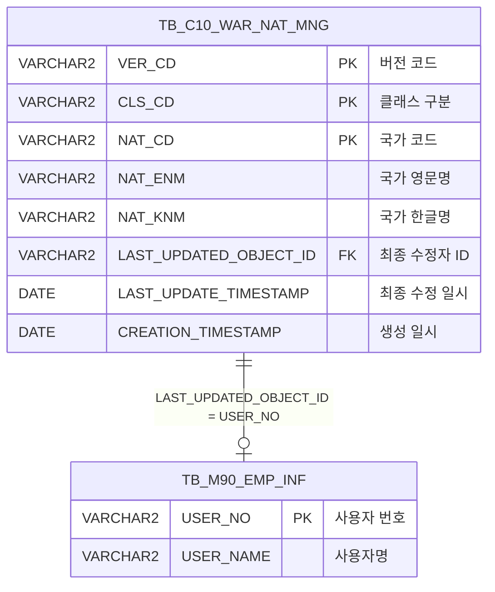

<h1 style="font-size: 40px; text-align: center; font-weight:
   bold; margin: 30px 0;">
  C106000120tab04 레거시 시스템 분석 종합 보고서
</h1>


# 1. 시스템 개요
- **서비스 ID**: C106000120tab04
- **업무명**: 국가기준등록
- **분석 일시**: 2026-03-17 (KST)
- **전체 Activity 수**: 6개 (Built-in 6개, Custom 0개)
- **분석자**: Claude Opus 4.6
- **분석 도구**: /analyze-service C106000120tab04
- **문서 버전**: 1.0

# 📊 비즈니스 프로세스 분석

## 시스템 목적

본 시스템은 C10 모듈의 **국가기준정보 등록 및 관리** 화면으로, 전쟁보험(WAR) 관련 국가별 분류 기준 데이터를 버전 관리 방식으로 유지보수하는 기능을 제공한다. `TB_C10_WAR_NAT_MNG` 테이블에 국가코드, 영문/한글 국가명, 클래스 구분 등의 기준 정보를 저장하며, 버전(VER_CD)별로 이력을 관리한다.

사용자는 등록일자 범위와 버전을 선택하여 기준 정보를 조회하고, '수정' 모드 전환 후 행 추가/수정/삭제를 통해 국가 기준 데이터를 편집할 수 있다. 또한 '버전추가' 기능으로 최신 버전의 전체 데이터를 복사하여 새 버전을 생성하는 버전 관리 체계를 갖추고 있다. '전송' 기능은 현재 더미 쿼리(SELECT 1 FROM DUAL)로 구현되어 있으며, 향후 외부 시스템 연동을 위한 인터페이스로 예약되어 있다.

이 화면은 C106000120 화면의 4번째 탭(tab04)으로 구성되며, 조회/수정 모드 전환을 통해 읽기 전용 상태와 편집 가능 상태를 구분하는 UX 패턴을 적용하고 있다.

## 주요 유즈케이스

### UC-01: 국가기준정보 조회
- **Actor**: 기준정보 관리자
- **목적**: 등록일자 범위와 버전 조건에 따라 국가 기준 정보 목록을 조회하여 현재 관리 상태를 확인

- **전제조건**:
  - 사용자가 시스템에 로그인되어 있음
  - C106000120 화면의 tab04 탭에 진입
  - TB_C10_WAR_NAT_MNG 테이블에 데이터가 존재

- **주요 흐름**:
  1. 화면 진입 시 등록일자가 자동 설정됨 (시작일: 현재일-900일, 종료일: 현재일)
  2. 버전 콤보박스가 자동 로드됨 (C106000120tab04VerComb.select)
  3. '전체' 버전이 기본 선택되어 자동 조회 실행 (C106000120tab04.select)
  4. Grid에 버전구분, 클래스구분, 국가코드, 영문/한글국가명, 등록자, 등록일자 표시

- **대체 흐름**:
  - 날짜 범위 변경 시: 버전 콤보가 자동으로 재생성되어 해당 범위의 버전만 표시
  - SETTING='Y'(수정 모드) 선택 시: 최신 버전 데이터만 필터링되어 조회 (DECODE 조건)
  - 조회 결과 없음: 빈 Grid 표시

- **후행조건**:
  - 조회된 데이터가 Grid에 표시됨
  - 조회 모드(SETTING='N')에서는 저장 버튼 비활성화, 행추가/삭제 메뉴 숨김

### UC-02: 국가기준정보 수정 (행 추가/수정/삭제)
- **Actor**: 기준정보 관리자
- **목적**: 최신 버전의 국가 기준 정보를 편집하여 분류 체계를 갱신

- **전제조건**:
  - UC-01을 통해 데이터가 조회된 상태
  - SETTING 라디오에서 '수정' 모드를 선택

- **주요 흐름**:
  1. SETTING 라디오를 '수정'(Y)으로 변경
  2. 저장 버튼 활성화, 행추가/복사/삭제 메뉴 표시
  3. 최신 버전 데이터만 재조회됨 (DECODE 조건으로 MAX(VER_CD) 이상만 필터)
  4. Grid에서 CLS_CD(클래스구분), NAT_CD(국가코드), NAT_ENM(영문국가명), NAT_KNM(한글국가명) 편집
  5. 메뉴에서 '행추가' 클릭하여 신규 행 추가 가능
  6. 메뉴에서 '삭제' 클릭하여 선택 행 삭제 표시 (붉은색 취소선)
  7. '저장' 버튼 클릭 → 확인 다이얼로그 → GridSave Activity 실행
  8. insert/update/delete SQL이 각각 실행됨
  9. 저장 완료 후 자동 재조회 및 버전 콤보 재생성

- **대체 흐름**:
  - 저장 확인 다이얼로그에서 취소 선택 시: 저장 중단, 변경 상태 유지
  - '조회' 모드로 전환 시: 저장 버튼 비활성화, 편집 메뉴 숨김, 전체 버전 재조회

- **후행조건**:
  - 변경 사항이 TB_C10_WAR_NAT_MNG 테이블에 반영됨
  - 감사 컬럼(LAST_UPDATED_OBJECT_ID, LAST_UPDATE_TIMESTAMP 등) 자동 갱신

### UC-03: 버전 추가 (전체 복사)
- **Actor**: 기준정보 관리자
- **목적**: 최신 버전의 전체 국가 기준 데이터를 복사하여 새 버전을 생성, 버전별 이력 관리

- **전제조건**:
  - TB_C10_WAR_NAT_MNG 테이블에 최소 1개 버전의 데이터가 존재
  - 서비스에서 '버전추가' 명령이 호출됨

- **주요 흐름**:
  1. '버전추가' Activity가 호출됨 (FormInsert)
  2. C106000120tab04.insertNewVer 쿼리 실행
  3. 현재 MAX(VER_CD)+1 값으로 새 버전 코드 생성
  4. MAX(VER_CD) 버전의 전체 레코드를 새 버전으로 INSERT-SELECT 복사
  5. LAST_UPDATED 감사 정보만 신규 값으로 갱신, CREATED 정보는 원본 유지
  6. 성공 시 '저장' Activity로 전이 (추가 GridSave 처리)

- **대체 흐름**:
  - 데이터가 없는 경우: MAX(VER_CD)가 NULL이므로 서브쿼리 실패 가능

- **후행조건**:
  - 새 버전의 전체 국가 기준 데이터가 생성됨
  - 버전 콤보에 새 버전이 추가되어 표시

### UC-04: 국가기준정보 전송
- **Actor**: 기준정보 관리자
- **목적**: 관리된 국가 기준 정보를 외부 시스템에 전송

- **전제조건**:
  - 데이터가 조회된 상태

- **주요 흐름**:
  1. '전송' 버튼 클릭
  2. 확인 다이얼로그 표시 ("전송 하시겠습니까?")
  3. 확인 클릭 시 sendForm으로 handleDataProcess.do 호출
  4. C106000120tab04.send 쿼리 실행 (현재 SELECT 1 FROM DUAL — 더미)

- **대체 흐름**:
  - 취소 선택 시: 전송 중단

- **후행조건**:
  - 현재는 실질적인 전송 로직 없음 (더미 쿼리)

---
## 비즈니스 로직 상세

### 1. 버전 기반 데이터 관리 로직

- **목적**: 국가 기준 정보를 버전별로 관리하여 변경 이력을 추적하고, 수정 시 최신 버전만 편집 가능하도록 제어

- **처리 케이스**:

  **[케이스 1: 조회 모드 (SETTING='N') — 전체 버전 조회]**
  ```
    조건: SETTING 라디오가 '조회'(N)
    처리:
      1. DECODE(:SETTING,'Y',..., 0) → 0 반환
      2. TO_NUMBER(VER_CD) >= 0 조건이므로 전체 버전 표시
      3. VER_COMB 콤보 선택값에 따라 특정 버전 또는 전체('%') 필터
      4. 결과를 VER_CD DESC, CLS_CD, NAT_CD 순으로 정렬
  ```

  **[케이스 2: 수정 모드 (SETTING='Y') — 최신 버전만 조회]**
  ```
    조건: SETTING 라디오가 '수정'(Y)
    처리:
      1. DECODE(:SETTING,'Y',(SELECT MAX(TO_NUMBER(VER_CD)) FROM TB_C10_WAR_NAT_MNG), 0)
      2. → MAX(VER_CD) 반환
      3. TO_NUMBER(VER_CD) >= MAX(VER_CD) 조건으로 최신 버전만 필터
      4. 편집 가능한 최신 버전 데이터만 Grid에 표시
  ```

  **[케이스 3: 버전 추가 (insertNewVer)]**
  ```
    조건: 버전추가 명령 실행
    처리:
      1. MAX(TO_NUMBER(VER_CD))+1 로 새 버전 코드 계산
      2. VER_CD = MAX(TO_NUMBER(VER_CD))인 전체 레코드 조회
      3. INSERT-SELECT로 새 버전에 전체 복사
      4. LAST_UPDATED 감사 컬럼은 현재 사용자/시간으로 갱신
      5. CREATED, DATA_END, ARCHIVE 관련 컬럼은 원본 값 유지
  ```

### 2. 수정/삭제 시 최신 버전 제한 로직

- **목적**: UPDATE/DELETE 시 항상 최신 버전의 레코드만 대상으로 하여 과거 버전의 무결성 보장

- **처리 케이스**:

  **[케이스 1: UPDATE]**
  ```
    조건: Grid에서 행 수정 후 저장
    처리:
      1. WHERE CLS_CD = :CLS_CD AND NAT_CD = :NAT_CD
      2. AND VER_CD = (SELECT MAX(TO_NUMBER(VER_CD)) FROM TB_C10_WAR_NAT_MNG)
      3. CLS_CD, NAT_CD, NAT_ENM, NAT_KNM 값 갱신
      4. 감사 컬럼 자동 갱신
  ```

  **[케이스 2: DELETE]**
  ```
    조건: Grid에서 행 삭제 후 저장
    처리:
      1. WHERE CLS_CD = :CLS_CD AND NAT_CD = :NAT_CD
      2. AND VER_CD = (SELECT MAX(TO_NUMBER(VER_CD)) FROM TB_C10_WAR_NAT_MNG)
      3. 최신 버전의 해당 레코드만 물리 삭제
  ```

### 3. 등록자명 스칼라 서브쿼리 변환

- **목적**: 최종 수정자의 사번(LAST_UPDATED_OBJECT_ID)을 직원명으로 변환하여 Grid에 표시

- **처리 케이스**:

  **[케이스 1: 스칼라 서브쿼리 코드 변환]**
  ```
    조건: 조회 쿼리 실행 시
    처리:
      1. TB_C10_WAR_NAT_MNG.LAST_UPDATED_OBJECT_ID 값 추출
      2. M90APUSER.TB_M90_EMP_INF에서 USER_NO 매칭
      3. USER_NAME을 CREATED_OBJECT_ID 별칭으로 반환
      4. 조회 결과 없으면 NULL 표시
  ```

---


# 💾 데이터 요구사항

## 핵심 테이블

### 1. C10APUSER.TB_C10_WAR_NAT_MNG - 전쟁보험 국가기준 관리
| 컬럼명 | 타입 | PK | 설명 |
|--------|------|----|------|
| VER_CD | VARCHAR2 | ✅ | 버전 코드 (숫자형 문자열, MAX+1로 채번) |
| CLS_CD | VARCHAR2 | ✅ | 클래스 구분 코드 |
| NAT_CD | VARCHAR2 | ✅ | 국가 코드 |
| NAT_ENM | VARCHAR2 | | 국가 영문명 |
| NAT_KNM | VARCHAR2 | | 국가 한글명 |
| CREATED_OBJECT_TYPE | VARCHAR2 | | 생성 객체 타입 (감사) |
| CREATED_OBJECT_ID | VARCHAR2 | | 생성자 ID (감사) |
| CREATED_PROGRAM_ID | VARCHAR2 | | 생성 프로그램 ID (감사) |
| CREATION_TIMESTAMP | DATE | | 생성 일시 (감사) |
| LAST_UPDATED_OBJECT_TYPE | VARCHAR2 | | 최종 수정 객체 타입 (감사) |
| LAST_UPDATED_OBJECT_ID | VARCHAR2 | | 최종 수정자 ID (감사) |
| LAST_UPDATE_PROGRAM_ID | VARCHAR2 | | 최종 수정 프로그램 ID (감사) |
| LAST_UPDATE_TIMESTAMP | DATE | | 최종 수정 일시 (감사) |
| DATA_END_STATUS | VARCHAR2 | | 데이터 종료 상태 |
| DATA_END_OBJECT_TYPE | VARCHAR2 | | 데이터 종료 객체 타입 |
| DATA_END_OBJECT_ID | VARCHAR2 | | 데이터 종료자 ID |
| DATA_END_PROGRAM_ID | VARCHAR2 | | 데이터 종료 프로그램 ID |
| DATA_END_TIMESTAMP | DATE | | 데이터 종료 일시 |
| ARCHIVE_COMPLETED_FLAG | VARCHAR2 | | 아카이브 완료 플래그 |
| ARCHIVED_EMPLOYEE_NUM | VARCHAR2 | | 아카이브 수행 사번 |
| ARCHIVED_TIMESTAMP | DATE | | 아카이브 일시 |
| ARCHIVE_PROGRAM_ID | VARCHAR2 | | 아카이브 프로그램 ID |

### 2. M90APUSER.TB_M90_EMP_INF - 직원 정보 (참조)
| 컬럼명 | 타입 | PK | 설명 |
|--------|------|----|------|
| USER_NO | VARCHAR2 | ✅ | 사용자 번호 (사번) |
| USER_NAME | VARCHAR2 | | 사용자명 |

## 데이터 플로우

### 1. 조회

```
[화면 초기 로딩 시 기본 조회]
화면 진입 (onLoadForm → onLoadGrid)
→ C106000120tab04VerComb.select
  FROM DUAL
  UNION ALL
  FROM C10APUSER.TB_C10_WAR_NAT_MNG
  WHERE TO_CHAR(LAST_UPDATE_TIMESTAMP,'YYYY-MM-DD') BETWEEN :DH_STR AND :DH_END
  GROUP BY VER_CD
→ 버전 콤보박스에 '전체' + 버전 목록 표시

→ C106000120tab04.select
  FROM C10APUSER.TB_C10_WAR_NAT_MNG
  LEFT JOIN M90APUSER.TB_M90_EMP_INF (스칼라 서브쿼리, USER_NO = LAST_UPDATED_OBJECT_ID)
  WHERE TO_CHAR(LAST_UPDATE_TIMESTAMP,'YYYY-MM-DD') BETWEEN :DH_STR AND :DH_END
    AND VER_CD LIKE :VER_COMB || '%'
    AND TO_NUMBER(VER_CD) >= DECODE(:SETTING,'Y', MAX(VER_CD), 0)
  ORDER BY VER_CD DESC, CLS_CD, NAT_CD
→ Grid에 국가기준정보 목록 표시
```

### 2. 저장 (INSERT/UPDATE/DELETE)

```
[수정 모드에서 Grid 편집 후 저장]
저장 버튼 클릭 → 확인 다이얼로그

→ [신규 행] C106000120tab04.insert
  INSERT INTO C10APUSER.TB_C10_WAR_NAT_MNG
  VER_CD = (SELECT MAX(TO_NUMBER(VER_CD)))  -- 현재 최신 버전에 추가
  VALUES(:CLS_CD, :NAT_CD, :NAT_ENM, :NAT_KNM, 감사정보)

→ [수정 행] C106000120tab04.update
  UPDATE C10APUSER.TB_C10_WAR_NAT_MNG
  SET CLS_CD, NAT_CD, NAT_ENM, NAT_KNM, 감사정보
  WHERE CLS_CD = :CLS_CD AND NAT_CD = :NAT_CD
    AND VER_CD = MAX(VER_CD)

→ [삭제 행] C106000120tab04.delete
  DELETE FROM C10APUSER.TB_C10_WAR_NAT_MNG
  WHERE CLS_CD = :CLS_CD AND NAT_CD = :NAT_CD
    AND VER_CD = MAX(VER_CD)

→ 저장 완료 후 자동 재조회 + 버전 콤보 재생성
```

### 3. 버전 추가

```
[버전추가 명령 실행]
→ C106000120tab04.insertNewVer
  INSERT INTO C10APUSER.TB_C10_WAR_NAT_MNG
  SELECT (MAX(VER_CD)+1), CLS_CD, NAT_CD, NAT_ENM, NAT_KNM, ...
  FROM C10APUSER.TB_C10_WAR_NAT_MNG
  WHERE VER_CD = MAX(VER_CD)
→ 최신 버전 전체 데이터를 새 버전으로 복사
→ 성공 시 저장 Activity로 전이
```

### 4. 전송

```
[전송 버튼 클릭]
확인 다이얼로그 → sendForm 호출
→ C106000120tab04.send
  SELECT 1 FROM DUAL  -- 더미 쿼리 (미구현)
```

## SQL 일람표

| SQL 이름 | 쿼리 ID | 타입 | 출처 | 테이블 |
|---------|---------|------|------|--------|
| 국가기준정보 조회 | C106000120tab04.select | SELECT | Service | TB_C10_WAR_NAT_MNG, TB_M90_EMP_INF |
| 버전 콤보 조회 | C106000120tab04VerComb.select | SELECT | Service | DUAL, TB_C10_WAR_NAT_MNG |
| 국가기준정보 추가 | C106000120tab04.insert | INSERT | Service | TB_C10_WAR_NAT_MNG |
| 국가기준정보 수정 | C106000120tab04.update | UPDATE | Service | TB_C10_WAR_NAT_MNG |
| 국가기준정보 삭제 | C106000120tab04.delete | DELETE | Service | TB_C10_WAR_NAT_MNG |
| 버전추가 (전체복사) | C106000120tab04.insertNewVer | INSERT | Service | TB_C10_WAR_NAT_MNG |
| 전송 (더미) | C106000120tab04.send | SELECT | Service | DUAL |

## ER 다이어그램 (핵심 관계)



관계 설명:
- **TB_C10_WAR_NAT_MNG**이 중심 테이블로, VER_CD + CLS_CD + NAT_CD 복합키로 버전별 국가 기준 관리
- **TB_M90_EMP_INF**: LAST_UPDATED_OBJECT_ID → USER_NO 스칼라 서브쿼리로 수정자명 조회
- 동일 테이블 내 VER_CD를 통한 버전 관리 (MAX(VER_CD)로 최신 버전 식별)

---

# 🖥️ 사용자 인터페이스 요구사항

## 화면 레이아웃 상세

### Layout 구조 (absolute positioning)
```javascript
{
  itemType: "layout",
  dirType: "absolute",
  components: [
    {
      id: "C106000120tab04_Form_1",
      position: { left: "0px", top: "0px", width: "977px", height: "28px" },
      component: { itemType: "form" }
    },
    {
      id: "C106000120tab04_Menu_1",
      position: { left: "0px", top: "28px", width: "977px", height: "25px" },
      component: { itemType: "menu" }
    },
    {
      id: "C106000120tab04_Grid_1",
      position: { left: "0px", top: "52px", width: "974px", height: "455px" },
      component: { itemType: "grid" }
    },
    {
      id: "C106000120tab04_messagebox",
      position: { left: "-1px", top: "508px", width: "976px", height: "23px" },
      component: { itemType: "messagebox" }
    }
  ]
}
```

## 입출력 요소

### Form 컴포넌트
**C106000120tab04_Form_1**
- DH_STR: calendar - 등록일자 시작 (inputWidth: 75px, dateFormat: %Y-%m-%d, 배경: #FFFFC0, 초기값: 현재일-900일)
- DH_DUR: label - "~" 구분자
- DH_END: calendar - 등록일자 종료 (inputWidth: 75px, dateFormat: %Y-%m-%d, 배경: #FFFFC0, 초기값: 현재일)
- VER_COMB: combo - 버전 선택 (inputWidth: 95px, OrdlnComboData.do로 동적 로드, readonly)
- SETTING: radio - 조회/수정 모드 전환 ('N'=조회, 'Y'=수정, 기본: '조회' 선택) → onFormChangeEvent
- send: custombutton - 전송 (width: 75px, command: send)
- find: button - 조회 (command: find)
- save: button - 저장 (command: save, 초기: 비활성화)

### Menu 컴포넌트
**C106000120tab04_Menu_1**
- refresh: 새로고침 (refresh.gif) — 항상 표시
- add: 행추가 (new.gif) — 기본 숨김, SETTING='Y' 시 표시
- copy: 복사 (copy.gif) — 기본 숨김, SETTING='Y' 시 표시
- remove: 삭제 (remove.gif) — 기본 숨김, SETTING='Y' 시 표시

### Grid 컴포넌트

**C106000120tab04_Grid_1 (국가기준정보 목록)**
- 편집 가능 여부: 조건부 (SETTING='Y' 시 CLS_CD, NAT_CD, NAT_ENM, NAT_KNM 편집 가능)
- Split: 0 (고정 컬럼 없음)
- rowCnt: 19, vertical: true, contextmenu: true, pageset: true
- enableMultiselect: true, enableValidation: true, enableSmartRendering: true
- colwidthUnit: % (컬럼 너비 비율 단위)
- 주요 컬럼 (7개):

  **기본 정보**:
  - VER_CD: ro - 버전구분 (10%, 중앙정렬, 읽기전용, 'VERSION N' 형식)
  - CLS_CD: ed - 클래스구분 (10%, 중앙정렬, 편집가능, 배경: #FFFFC0)
  - NAT_CD: ed - 국가코드 (10%, 중앙정렬, 편집가능, 배경: #FFFFC0)

  **국가명 정보**:
  - NAT_ENM: ed - 영문국가명 (20%, 좌측정렬, 편집가능, 배경: #FFFFC0)
  - NAT_KNM: ed - 한글국가명 (20%, 좌측정렬, 편집가능, 배경: #FFFFC0)

  **감사 정보**:
  - CREATED_OBJECT_ID: ro - 등록자 (15%, 좌측정렬, 읽기전용, 직원명으로 변환 표시)
  - CREATION_TIMESTAMP: ro - 등록일자 (*, 중앙정렬, 읽기전용, YYYY-MM-DD 형식, sort_date_custom 정렬)

## 화면 동작 흐름

### 1. 화면 초기 로딩
```
1. 화면 진입 (C106000120 tab04 탭 선택)
2. ui.initializeDHTMLX() 호출 — DHTMLX 컴포넌트 초기화
3. onLoadForm 이벤트 실행:
   - DH_END ← uiCommon.getCurrentDate() (현재 날짜)
   - DH_STR ← dateAdd(현재일, -900) (900일 전)
   - 달력 위젯 주 시작일 설정 (일요일)
   - comboList() 호출 — 버전 콤보 생성 (OrdlnComboData.do)
   - 저장 버튼 비활성화 (disableItem('save'))
4. onLoadGrid 이벤트 실행:
   - uiCommon.parameters() 호출하여 파라미터 구성
   - items['Grid_1'].loadData(findUrl) — 자동 조회 실행
   - hideMenuItems() — add/copy/remove 메뉴 숨김
5. Grid에 기본 조회 결과 표시
6. 상태바 초기화
```

### 2. 조회/수정 모드 전환
```
1. SETTING 라디오 변경 이벤트 발생 (onFormChangeEvent)
2. 날짜 범위 읽어서 버전 콤보 재생성 (comboList)
3. SETTING 값 판별:
   - 'N' (조회): 저장 버튼 비활성화, 메뉴 숨김 (hideMenuItems)
   - 'Y' (수정): 저장 버튼 활성화, 메뉴 표시 (showMenuItems)
4. find() 호출하여 데이터 재조회
   - 수정 모드: MAX(VER_CD) 이상만 필터
   - 조회 모드: 전체 버전 표시
```

### 3. 날짜 범위 변경
```
1. DH_STR 또는 DH_END 캘린더 값 변경
2. onFormChangeEvent 발생
3. comboList() 호출 — 변경된 날짜 범위로 버전 콤보 재생성
4. action='changeEvent'이므로 콤보 자동 선택 안 함
```

### 4. Grid 편집 및 저장
```
1. 수정 모드(SETTING='Y')에서 Grid 셀 직접 편집 (ed 타입 컬럼)
2. 메뉴에서 행추가/삭제 가능
3. 삭제 시: 붉은색 볼드 + 취소선 스타일 적용
4. 저장 버튼 클릭
5. dhtmlx.confirm() 확인 다이얼로그
6. items[referenceItem].sendGrid() 호출
7. handleDataProcess.do → GridSave Activity
8. insert/update/delete 쿼리 각각 실행
9. onAfterUpdateFinishEvent 콜백:
   - find() 재조회
   - comboList() 버전 콤보 재생성
```

### 5. 전송
```
1. 전송(send) 버튼 클릭
2. dhtmlx.confirm() 확인 다이얼로그 ("전송 하시겠습니까?")
3. items["Form_1"].sendForm("handleDataProcess.do", ..., "send", null)
4. C106000120tab04.send 쿼리 실행 (SELECT 1 FROM DUAL — 더미)
```

## JavaScript 모듈

**C106000120tab04.jsp** (인라인 스크립트)
- find(eventName, formDivObj, referenceItem): 조회 기능 (uiCommon.parameters로 파라미터 구성 → loadData)
- save(eventName, formDivObj, referenceItem): 저장 기능 (dhtmlx.confirm → sendGrid)
- refresh(referenceItem): 새로고침 (clearDataProcess → uiCommon.parameters → loadData)
- add(referenceItem): 행추가 (addRow)
- remove(referenceItem): 행삭제 (removeRow)
- copy(referenceItem): 행복사 (copyRowContent)
- undo(referenceItem): 변경취소 (undo)
- redo(referenceItem): 변경재실행 (redo)
- onGridContextMenuClick(id, gridObj, menuObj): 컨텍스트 메뉴 처리 (컬럼이동, 헤더필터, 편집모드, 엑셀내보내기)
- findMessage(referenceItem): 메시지 표시 (uiCommon.message)
- onLoadGrid(): 그리드 로드 시 자동 조회 + 메뉴 숨김 (uiCommon.parameters → loadData, hideMenuItems)
- onAfterUpdateFinishEvent(): 저장 완료 후 재조회 + 콤보 재생성
- onLoadForm(): 폼 초기화 (uiCommon.getCurrentDate, dateAdd, comboList, disableItem)
- onFormChangeEvent(id): 폼 변경 이벤트 (comboList, SETTING 변경 시 모드 전환)
- comboList(formId, fromDate, toDate, action): 버전 콤보 동적 생성 (ui.combo → OrdlnComboData.do)
- dateAdd(date, addDay): 날짜 계산 유틸리티 (밀리초 기반 일수 가감)
- send(): 전송 기능 (dhtmlx.confirm → sendForm)
- hideMenuItems(): add/copy/remove 메뉴 숨김
- showMenuItems(): add/copy/remove 메뉴 표시

**c10.ui.js** (공통 스크립트 — 외부 참조)

## 주요 이벤트 핸들러

**onLoadForm (폼 초기 로드 — XLE 이벤트)**
- 이벤트 타입: XLE Event (컴포넌트 로드 완료)
- 처리 내용:
  1. DH_END에 현재 날짜 설정 (uiCommon.getCurrentDate)
  2. DH_STR에 현재일-900일 계산 (dateAdd)
  3. 달력 주 시작일 일요일 설정 (setWeekStartDay(7))
  4. comboList() 호출하여 버전 콤보 생성
  5. 저장 버튼 비활성화 (disableItem('save'))
  6. XLE 이벤트 해제 (detachEvent)

**onLoadGrid (그리드 초기 로드 — XLE 이벤트)**
- 이벤트 타입: XLE Event (컴포넌트 로드 완료)
- 처리 내용:
  1. uiCommon.parameters로 폼 파라미터 구성
  2. Grid 데이터 자동 로드 (loadData)
  3. XLE 이벤트 해제 (detachEvent)
  4. hideMenuItems() 호출

**onFormChangeEvent (폼 필드 변경)**
- 이벤트 타입: Form Change Event
- 처리 내용:
  1. 날짜 값 읽기 (DH_STR, DH_END)
  2. comboList() 호출하여 버전 콤보 재생성
  3. SETTING 라디오 변경 시:
     - 'N': 저장 비활성화 + 메뉴 숨김
     - 'Y': 저장 활성화 + 메뉴 표시
  4. find() 호출하여 데이터 재조회

**onAfterUpdateFinishEvent (저장 완료 후)**
- 이벤트 타입: DataProcessor 업데이트 완료
- 처리 내용:
  1. 폼에서 날짜 범위 읽기
  2. find() 호출하여 재조회
  3. comboList() 호출하여 버전 콤보 재생성


# 📌 특이사항 및 주의사항

## 1. 전송 기능 미구현 (더미 쿼리)
- **C106000120tab04.send**: `SELECT 1 FROM DUAL`로 구현되어 있어 실질적인 전송 기능이 없음. UI에는 전송 버튼이 존재하고 확인 다이얼로그까지 표시되지만, 실제 데이터 전송은 수행되지 않음. 향후 외부 시스템 연동 시 이 쿼리를 실제 로직으로 교체해야 함.

## 2. VER_CD 채번 방식의 동시성 이슈
- **MAX(TO_NUMBER(VER_CD))+1 패턴**: insertNewVer, insert, update, delete 쿼리 모두에서 `SELECT MAX(TO_NUMBER(VER_CD))` 서브쿼리를 사용함. 동시에 여러 사용자가 버전 추가나 데이터 수정을 시도하면 MAX 값이 동일하게 조회되어 데이터 충돌이 발생할 수 있음. Oracle 시퀀스 대신 MAX+1 방식을 사용하는 레거시 패턴.

## 3. UPDATE 쿼리의 WHERE 절 모순
- **C106000120tab04.update**: `SET NAT_CD = :NAT_CD ... WHERE NAT_CD = :NAT_CD` 형태로, 바인드 변수명이 SET절과 WHERE절에서 동일함. 국가코드를 변경하면 WHERE 조건에도 변경된 값이 바인딩되어 기존 레코드를 찾지 못할 수 있음. CLS_CD도 동일한 패턴. Grid의 원본값과 수정값이 같은 바인드 변수로 전달되는 구조적 문제.

## 4. 조회 쿼리의 날짜 인덱스 비효율
- **TO_CHAR(LAST_UPDATE_TIMESTAMP,'YYYY-MM-DD') BETWEEN :DH_STR AND :DH_END**: 날짜 컬럼에 TO_CHAR 함수를 적용하여 문자열 비교하므로 인덱스를 사용할 수 없음. `LAST_UPDATE_TIMESTAMP BETWEEN TO_DATE(:DH_STR) AND TO_DATE(:DH_END)+1` 패턴이 성능상 유리.

## 5. insertNewVer 쿼리의 주석 오류
- **insertNewVer SQL 내 주석**: `/*C106000120tab01.insertNewVer*/`로 tab01을 참조하고 있으나, 실제로는 tab04의 쿼리. tab01에서 복사한 후 주석을 수정하지 않은 것으로 보임.

## 6. 900일 고정 조회 범위
- **dateAdd(현재일, -900)**: 약 2년 6개월 전부터 조회하는 하드코딩된 기간. 데이터 양이 많아지면 초기 로딩 성능에 영향을 줄 수 있으며, 업무 요구사항에 따라 조정이 필요할 수 있음.

## 7. 조회/수정 모드 전환 UX 패턴
- **SETTING 라디오**: 'N'(조회)에서는 저장 버튼 비활성화 + 행추가/삭제 메뉴 숨김으로 읽기 전용 상태를 보장. 'Y'(수정) 전환 시 최신 버전만 필터링하여 과거 버전의 의도치 않은 수정을 방지하는 안전 장치.

# 📚 참고 문서

- **Query SQL**: `src/query/C106000120tab04-query.glue_sql`
- **Service XML**: `src/service/C106000120tab04-service.xml`
- **JS**: `WebContents/C106000120tab04.jsp` (인라인 스크립트), `WebContents/js/c10.ui.js` (공통)
- **Form XML**: `WebContents/header/kr/C106000120tab04/C106000120tab04_Form_1.xml`
- **Grid XML**: `WebContents/header/kr/C106000120tab04/C106000120tab04_Grid_1.xml`
- **Menu XML**: `WebContents/header/kr/C106000120tab04/C106000120tab04_Menu_1.xml`
