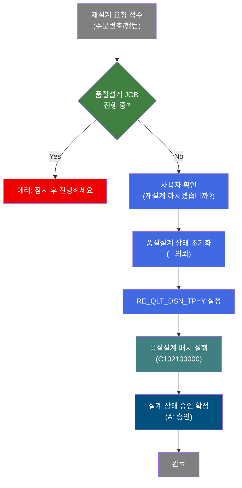
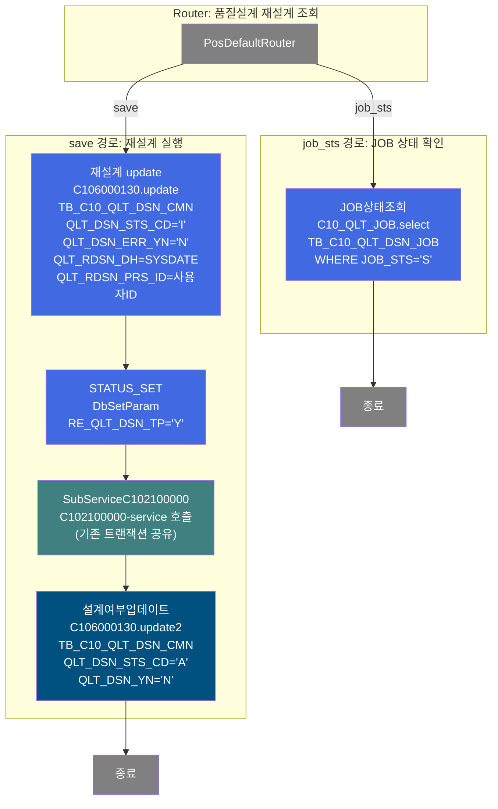
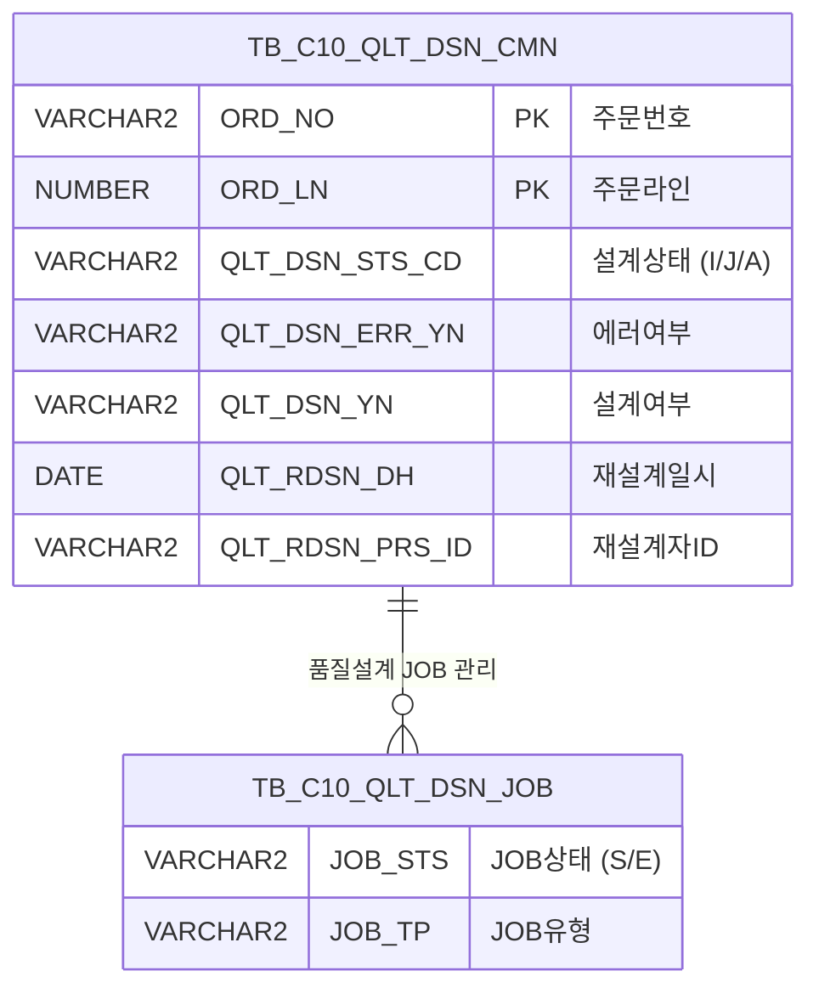

<h1 style="font-size: 40px; text-align: center; font-weight:
   bold; margin: 30px 0;">
  C106000130pop01 레거시 시스템 분석 종합 보고서
</h1>


# 1. 시스템 개요
- **서비스 ID**: C106000130pop01
- **업무명**: 반납확정 등록용 재설계 팝업
- **분석 일시**: 2026-03-17 11:14 KST
- **분석 시간**: 약 3분
- **전체 Activity 수**: 6개 (Built-in 5, Common 1)
- **분석자**: Claude Opus 4.6
- **분석 도구**: /analyze-service C106000130pop01
- **문서 버전**: 1.0

# 📊 비즈니스 프로세스 분석

## 시스템 목적

C106000130pop01 서비스는 **반납확정 등록 시 품질설계 재설계를 수행하는 팝업 화면**이다. 부모 화면(C106000130)에서 특정 주문의 반납확정 처리 과정에서 품질설계 재설계가 필요한 경우 이 팝업을 호출하여, 해당 주문에 대한 품질설계 상태를 초기화하고 재설계 배치 프로세스를 트리거한다.

팝업은 부모 화면으로부터 주문번호(ORD_NO)와 주문라인(ORD_LN)을 전달받아 표시하며, 사용자가 "재설계" 버튼 클릭 시 품질설계 JOB 진행 여부를 먼저 확인한 후, 안전한 상태일 때만 재설계를 실행한다. 재설계 프로세스는 크게 두 단계로 구성된다: (1) 품질설계 상태를 '의뢰(I)'로 변경하고 재설계 일시/사용자 정보를 기록, (2) RE_QLT_DSN_TP 파라미터를 'Y'로 설정 후 서브서비스 C102100000(품질설계 배치 메인 오케스트레이터)을 호출하여 전체 품질설계를 재생성, (3) 완료 후 설계 상태를 '승인(A)'으로 최종 확정한다.

## 핵심 워크플로우 다이어그램



### 상세 워크플로우 다이어그램



## 주요 유즈케이스

### UC-01: 품질설계 JOB 진행 상태 확인
- **Actor**: 품질설계 담당자
- **목적**: 재설계 수행 전 품질설계 배치 JOB이 현재 진행 중인지 사전 확인하여 충돌 방지
- **전제조건**:
  - 부모 화면(C106000130)에서 팝업이 호출됨
  - 주문번호(ORD_NO)와 주문라인(ORD_LN)이 전달됨
- **주요 흐름**:
  1. 팝업 진입 시 재설계 버튼 클릭
  2. JavaScript에서 `c10AjaxData.do`로 AJAX 호출 (job_sts=1 파라미터)
  3. Router가 `job_sts` 경로로 분기하여 `C10_QLT_JOB.select` 실행
  4. TB_C10_QLT_DSN_JOB에서 JOB_STS='S'(시작 상태) 레코드 존재 여부 확인
  5. 결과를 XML로 반환하여 JavaScript에서 판단
- **대체 흐름**:
  - JOB 진행 중(cell 존재): "품질설계JOB이 진행중입니다. 잠시후 진행하세요!" 경고 후 중단
  - JOB 미진행(cell 없음): 재설계 confirm 대화상자 표시
- **후행조건**:
  - JOB 상태에 따라 재설계 진행 여부가 결정됨

### UC-02: 품질설계 재설계 실행
- **Actor**: 품질설계 담당자
- **목적**: 특정 주문에 대한 품질설계를 재수행하여 변경된 주문 사양에 맞는 품질설계 재생성
- **전제조건**:
  - 품질설계 JOB이 진행 중이 아님 (UC-01 확인 완료)
  - 사용자가 재설계 확인 대화상자에서 "확인" 선택
- **주요 흐름**:
  1. 사용자가 "확인" 클릭 → `handleDataProcess.do`로 폼 전송 (actionType=save)
  2. Router가 `save` 경로로 분기
  3. **재설계 update** (C106000130.update): TB_C10_QLT_DSN_CMN에서 해당 주문의 QLT_DSN_STS_CD를 'I'(의뢰)로 변경, QLT_DSN_ERR_YN='N', QLT_RDSN_DH=SYSDATE, QLT_RDSN_PRS_ID=사용자ID, QLT_DSN_YN='Y' 설정
  4. **STATUS_SET**: PosContext에 RE_QLT_DSN_TP='Y' 파라미터 설정
  5. **SubServiceC102100000**: 품질설계 배치 메인 오케스트레이터 호출 (기존 트랜잭션 공유). 18개 서브서비스를 순차 호출하여 설계키 → 규격사양 → 고객사양 → 사내사양 → 보증사양 → 원자재 → 제조사양 → 통과공정 → Size → 정합성체크까지 전체 품질설계 재생성
  6. **설계여부업데이트** (C106000130.update2): QLT_DSN_STS_CD를 'A'(승인)로 변경, QLT_DSN_YN='N' 설정
- **대체 흐름**:
  - 사용자가 "취소" 선택: 아무 동작 없이 팝업 유지
  - 서브서비스 C102100000 실행 중 오류 발생: 트랜잭션 롤백 (기존 트랜잭션 공유 모드)
- **후행조건**:
  - 해당 주문의 품질설계가 재생성됨
  - 설계 상태가 '승인(A)'으로 최종 확정됨
  - 감사 정보(ObjectType, ObjectId, ProgramId, Timestamp) 기록됨

### UC-03: 팝업 파라미터 자동 설정
- **Actor**: 시스템 (자동)
- **목적**: 부모 화면에서 전달한 주문번호/행번을 팝업 폼에 자동 바인딩
- **전제조건**:
  - 부모 화면에서 ORD_NO, ORD_LN을 request parameter로 전달
- **주요 흐름**:
  1. 팝업 JSP 로드 완료 (`ui.initializeDHTMLX()` 실행)
  2. `onXLEEvent(onFormLoad1)` 이벤트 트리거
  3. `onFormLoad1` 함수에서 `request.getParameter("ORD_NO")`, `request.getParameter("ORD_LN")` 값 추출
  4. `getDhxForm().setItemValue()`로 폼 필드에 초기값 설정
- **대체 흐름**:
  - 파라미터 미전달 시: null 값 설정되어 재설계 버튼 클릭 시 "주문번호없이 설계 할 수 없습니다" 경고
- **후행조건**:
  - 폼의 주문번호/행번 필드에 값이 자동 표시됨

---
## 비즈니스 로직 상세

### 1. 품질설계 상태 전환 로직

- **목적**: 재설계 시 품질설계 상태를 단계적으로 전환하여 배치 프로세스와의 정합성 보장

- **처리 케이스**:

  **[케이스 1: 재설계 시작 - 상태 초기화]**
  ```
    조건: 사용자가 재설계 확인
    처리:
      1. QLT_DSN_STS_CD = 'I' (의뢰 상태로 변경)
      2. QLT_DSN_ERR_YN = 'N' (에러 플래그 초기화)
      3. QLT_RDSN_DH = SYSDATE (재설계 일시 기록)
      4. QLT_RDSN_PRS_ID = SUBSTR(:ObjectId,1,10) (재설계 수행자 ID)
      5. QLT_DSN_YN = 'Y' (설계 대상 플래그 설정)
  ```

  **[케이스 2: 재설계 완료 - 승인 확정]**
  ```
    조건: C102100000 서브서비스 정상 완료
    처리:
      1. QLT_DSN_STS_CD = 'A' (승인 상태로 변경)
      2. QLT_DSN_YN = 'N' (설계 완료 표시)
  ```

- **상태 전이 흐름**:
  ```
  [현재 상태] → (재설계 update) → 'I' (의뢰)
  → (C102100000 배치 실행) → 설계 재생성
  → (설계여부업데이트) → 'A' (승인)

  상태 코드:
    I = 의뢰 (설계 대기)
    J = 진행중 (C102100000 내부에서 I→J 전환)
    A = 승인 (설계 완료 확정)
    S = 시작 (JOB 실행 중)
    E = 종료 (JOB 완료)
  ```

- **예외 처리**:
  - 주문번호/행번 null: "주문번호없이 설계 할 수 없습니다" 경고
  - JOB 진행 중: "품질설계JOB이 진행중입니다. 잠시후 진행하세요!" 경고
  - 서브서비스 실패: 트랜잭션 롤백 (new-transaction=false로 기존 트랜잭션 공유)

### 2. RE_QLT_DSN_TP 파라미터 설정 의미

- **목적**: 서브서비스 C102100000에 재설계 유형(RE_QLT_DSN_TP='Y')을 전달하여 재설계 모드로 배치 실행

- **처리 케이스**:

  **[케이스 1: 재설계 모드 파라미터 설정]**
  ```
    조건: DbSetParam Activity에서 param0 = "RE_QLT_DSN_TP|Y" 설정
    처리:
      1. PosContext에 RE_QLT_DSN_TP = 'Y' 값 등록
      2. 서브서비스 C102100000이 해당 파라미터를 읽어 재설계 모드로 동작
      3. 일반 배치(신규 설계)와 재설계를 구분하는 핵심 플래그
  ```

---

# 💾 데이터 요구사항

## 핵심 테이블

### 1. TB_C10_QLT_DSN_CMN - (품질설계 공통 마스터)
| 컬럼명 | 타입 | PK | 설명 |
|--------|------|----|------|
| ORD_NO | VARCHAR2 | ✅ | 주문번호 |
| ORD_LN | NUMBER | ✅ | 주문라인 |
| QLT_DSN_STS_CD | VARCHAR2 | | 품질설계 상태코드 (I:의뢰, J:진행, A:승인) |
| QLT_DSN_ERR_YN | VARCHAR2 | | 품질설계 에러 여부 (Y/N) |
| QLT_DSN_YN | VARCHAR2 | | 품질설계 여부 (Y/N) |
| QLT_RDSN_DH | DATE | | 재설계 일시 |
| QLT_RDSN_PRS_ID | VARCHAR2 | | 재설계 수행자 ID |
| LAST_UPDATED_OBJECT_TYPE | VARCHAR2 | | 감사정보 - 객체타입 |
| LAST_UPDATED_OBJECT_ID | VARCHAR2 | | 감사정보 - 객체ID |
| LAST_UPDATE_PROGRAM_ID | VARCHAR2 | | 감사정보 - 프로그램ID |
| LAST_UPDATE_TIMESTAMP | DATE | | 감사정보 - 타임스탬프 |

### 2. TB_C10_QLT_DSN_JOB - (품질설계 JOB 관리)
| 컬럼명 | 타입 | PK | 설명 |
|--------|------|----|------|
| JOB_STS | VARCHAR2 | | JOB 상태 (S:시작, E:종료) |
| JOB_TP | VARCHAR2 | | JOB 유형 |

## 데이터 플로우

### 1. JOB 상태 조회 (AJAX)
```
[재설계 버튼 클릭 → JOB 진행 여부 사전 확인]
c10AjaxData.do 호출 (job_sts=1)
→ C10_QLT_JOB.select
  FROM TB_C10_QLT_DSN_JOB
  WHERE JOB_STS = 'S'
→ XML 결과 반환 (cell 존재 시 JOB 진행 중)
```

### 2. 재설계 실행 (save)
```
[재설계 확인 → 상태 초기화 → 배치 실행 → 승인 확정]
handleDataProcess.do 호출 (actionType=save)

Step 1: 재설계 update (C106000130.update)
→ UPDATE TB_C10_QLT_DSN_CMN
  SET QLT_DSN_STS_CD = 'I',
      QLT_DSN_ERR_YN = 'N',
      QLT_RDSN_DH = SYSDATE,
      QLT_RDSN_PRS_ID = SUBSTR(:ObjectId,1,10),
      QLT_DSN_YN = 'Y'
  WHERE ORD_NO = :ORD_NO AND ORD_LN = :ORD_LN

Step 2: STATUS_SET
→ PosContext에 RE_QLT_DSN_TP = 'Y' 설정

Step 3: SubServiceC102100000
→ C102100000-service 호출 (기존 트랜잭션 공유)
→ 품질설계 전체 재생성 (18개 서브서비스 순차 실행)

Step 4: 설계여부업데이트 (C106000130.update2)
→ UPDATE TB_C10_QLT_DSN_CMN
  SET QLT_DSN_STS_CD = 'A',
      QLT_DSN_YN = 'N'
  WHERE ORD_NO = :ORD_NO AND ORD_LN = :ORD_LN
```

## SQL 일람표
| SQL 이름 | 쿼리 ID | 타입 | 출처 | 테이블 |
|---------|---------|------|------|--------|
| JOB 상태 조회 | C10_QLT_JOB.select | SELECT | Service | TB_C10_QLT_DSN_JOB |
| 재설계 상태 초기화 | C106000130.update | UPDATE | Service | TB_C10_QLT_DSN_CMN |
| 설계 승인 확정 | C106000130.update2 | UPDATE | Service | TB_C10_QLT_DSN_CMN |

## ER 다이어그램 (핵심 관계)



관계 설명:
- TB_C10_QLT_DSN_CMN이 품질설계의 중심 테이블로, 주문별 설계 상태를 관리
- TB_C10_QLT_DSN_JOB은 품질설계 배치 JOB의 실행 상태를 관리하는 독립 테이블
- 두 테이블은 직접적인 FK 관계는 없으나, JOB 상태에 따라 CMN 테이블의 설계 처리가 제어됨

---

# 🖥️ 사용자 인터페이스 요구사항

## 화면 레이아웃 상세

### Layout 구조 (절대 위치 기반 팝업)
```javascript
{
  type: "absolute",
  totalHeight: "236px",
  totalWidth: "382px",
  components: [
    {
      id: "C106000130pop01_Form_1",
      type: "form",
      position: { left: "0px", top: "0px", height: "236px", width: "382px" },
      xmlFile: "C106000130pop01_Form_1.xml",
      url: "basicFormData.do",
      service: "C106000130pop01-service",
      actionType: "save"
    },
    {
      id: "C106000130pop01_messagebox",
      type: "messagebox",
      position: { left: "0px", top: "228px", height: "23px", width: "380px" }
    }
  ]
}
```

## 입출력 요소

### Form 컴포넌트
**C106000130pop01_Form_1 (반납확정 등록용 재설계)**
- std_title: label - "반납확정 등록용 재설계" (타이틀)
- ORD_NO: input - 주문번호 (inputWidth: 80px, 팝업 파라미터로 자동 설정)
- ORD_LN: input - 행번 (inputWidth: 40px, 팝업 파라미터로 자동 설정)
- save: button - "재설계" (command: save → save 함수 호출)
- winClose: button - "닫기" (command: winClose → 팝업 닫기)

### Messagebox 컴포넌트
**C106000130pop01_messagebox**
- 위치: 팝업 하단 (380x23px)
- 조회 완료 시 "조회되었습니다." 메시지 표시

## 화면 동작 흐름

### 1. 화면 초기 로딩
```
1. 부모 화면(C106000130)에서 팝업 호출 (ORD_NO, ORD_LN 파라미터 전달)
2. JSP 로드 및 ui.initializeDHTMLX() 실행
3. DHTMLX Form 컴포넌트 초기화 (C106000130pop01_Form_1.xml 기반)
4. onXLEEvent(onFormLoad1) 이벤트 등록 및 트리거
5. onFormLoad1(): request.getParameter로 ORD_NO, ORD_LN 추출
6. getDhxForm().setItemValue()로 폼 필드에 초기값 자동 바인딩
7. 폼에 주문번호/행번 표시 완료
```

### 2. 재설계 실행
```
1. 사용자가 "재설계" 버튼 클릭 → save() 함수 호출
2. 폼에서 ORD_NO, ORD_LN 값 추출 (getItemValue)
3. null 체크 - 주문번호/행번 미입력 시 "주문번호없이 설계 할 수 없습니다" 경고 후 중단
4. AJAX 호출: uiCommon.ajaxLoadData('c10AjaxData.do', param)
   - param: ServiceName=C106000130pop01-service&job_sts=1&column-info=JOB_STS
   - Router가 job_sts 경로로 분기 → C10_QLT_JOB.select 실행
5. XML 응답 파싱: cell 태그 존재 여부로 JOB 진행 상태 판단
   - cell 존재 시: "품질설계JOB이 진행중입니다. 잠시후 진행하세요!" 경고 후 중단
6. dhtmlx.confirm 대화상자: "재설계 하시겠습니까?"
7. 사용자 "확인" 선택 시:
   - customParam = {ORD_NO: ord_no, ORD_LN: ord_ln} 구성
   - uiFormObj.sendForm("handleDataProcess.do", 'C106000130pop01_Form_1', 'save', customParam)
   - Router → save 경로 → 재설계 update → STATUS_SET → SubService → 설계여부업데이트
8. 처리 완료 후 findAfter() → progressOff → findMessage()
```

### 3. 팝업 닫기
```
1. 사용자가 "닫기" 버튼 클릭
2. winClose command 실행
3. 팝업 윈도우 닫힘
```

## JavaScript 모듈

**C106000130pop01.jsp** (인라인 스크립트)
- find(eventName, formDivObj, referenceItem): 조회 이벤트 (빈 함수)
- save(eventName, formDivObj, referenceItem): 재설계 저장 (null 체크 → AJAX JOB 확인 → confirm → sendForm)
- findAfter(): 조회 완료 후 프로그레스 종료 (uiCommon.progressOff, findMessage 호출)
- refresh(referenceItem): 새로고침 (빈 함수)
- add(referenceItem): 신규행 추가 (items[referenceItem].addRow())
- remove(referenceItem): 행 삭제 (items[referenceItem].removeRow())
- copy(referenceItem): 클립보드 복사 (items[referenceItem].copyRowContent())
- undo(referenceItem): 실행 취소 (items[referenceItem].undo())
- redo(referenceItem): 다시 실행 (items[referenceItem].redo())
- onGridContextMenuClick(id, gridObj, menuObj): 컨텍스트 메뉴 (컬럼이동/필터/편집/엑셀)
- findMessage(): messagebox에 "조회되었습니다." 표시 (uiCommon.message 호출)
- onFormLoadFunction(formDivObj): 폼 로드 기본 핸들러 (true 반환)
- onFormLoad1(): 폼 로드 완료 후 ORD_NO, ORD_LN 파라미터 자동 설정

## 주요 이벤트 핸들러

**save (재설계 버튼 클릭)**
- 이벤트 타입: Button Click (command: save)
- 처리 내용:
  1. 폼에서 ORD_NO, ORD_LN 추출 (getItemValue)
  2. null 체크 실패 시 dhtmlx.alert 경고 후 return
  3. uiCommon.ajaxLoadData로 JOB 상태 AJAX 확인
  4. cell 존재 시 dhtmlx.alert 경고 후 return
  5. dhtmlx.confirm 대화상자 표시
  6. 확인 시 sendForm으로 서버 전송

**onFormLoad1 (폼 초기화)**
- 이벤트 타입: XLE Event (폼 로드 완료)
- 처리 내용:
  1. request.getParameter("ORD_NO") 값을 ORD_NO 필드에 설정
  2. request.getParameter("ORD_LN") 값을 ORD_LN 필드에 설정

# 🔗 서브서비스

## 서브서비스 요약

| 서비스 ID | 설명 | 호출 액티비티 | 트랜잭션 | 상세 분석 |
|-----------|------|-------------|---------|----------|
| C102100000 | 품질설계 배치 메인 오케스트레이터 | SubServiceC102100000 | 기존 트랜잭션 공유 (new-transaction=false) | [상세 분석 링크](./C102100000_legacy_analysis.md) |

### C102100000 - 품질설계 배치 메인 오케스트레이터
품질설계 의뢰 상태('I')인 주문을 10건 단위로 가져와 기존 설계 데이터를 전면 삭제(10개 자식 테이블)한 후, 18개 서브서비스를 순차 호출하여 설계키 → 규격사양 → 고객사양 → 사내사양 → 보증사양 → 원자재 → 제조사양 → 통과공정 → Size → 정합성체크까지 전체 품질설계를 재생성하는 NUI 서비스이다. Activity 33개, Custom 1개, SQL Key 다수 사용.

# 📌 특이사항 및 주의사항

## 1. 트랜잭션 공유에 의한 롤백 범위
- **서브서비스 트랜잭션 공유**: C102100000이 `new-transaction=false`로 호출되므로, 부모 서비스의 트랜잭션을 공유한다. 서브서비스 내 18개 하위 서비스 중 하나라도 실패하면 재설계 update 포함 전체가 롤백된다.
- **롤백 범위**: `재설계 update` → `STATUS_SET` → `SubServiceC102100000(전체)` → `설계여부업데이트`까지 하나의 트랜잭션으로 묶임

## 2. JOB 상태 확인과 재설계 실행 간 경쟁 조건
- **AJAX 확인과 서버 처리 사이 갭**: JavaScript에서 JOB 상태를 AJAX로 먼저 확인하고, 이후 폼을 전송하여 재설계를 실행한다. 이 두 단계 사이에 다른 사용자가 배치 JOB을 시작하면 충돌 가능성이 있다.
- **DB 레벨 보호 없음**: 서버측에서 재설계 실행 직전 JOB 상태를 재확인하는 로직이 Service XML 레벨에는 없다

## 3. JSP에서 request.getParameter 직접 삽입 (XSS 취약점 가능성)
- **코드**: `<%=request.getParameter("ORD_NO")%>` 형태로 JSP 스크립틀릿에서 직접 JavaScript에 삽입
- **문제**: 입력값 이스케이핑 없이 직접 삽입되어, ORD_NO/ORD_LN 파라미터에 악의적 스크립트가 포함될 경우 XSS 공격에 노출 가능
- **주석 처리된 레거시 코드**: `<%-- ... --%>` 블록에 이전 버전의 valueCheck 로직이 주석 처리되어 남아있음

## 4. 상태코드 하드코딩
- **SQL에 직접 하드코딩**: QLT_DSN_STS_CD = 'I', 'A' 등 상태코드가 SQL 쿼리에 직접 하드코딩되어 있음
- **JOB 상태 확인**: JOB_STS = 'S' 조건도 쿼리에 직접 하드코딩
- **유지보수 영향**: 상태코드 체계 변경 시 SQL 파일과 JavaScript 양쪽 모두 수정 필요

## 5. 감사 정보(Audit) 처리
- **GridUpdate의 isAudit=true**: 재설계 update와 설계여부업데이트 모두 isAudit=true로 설정되어 LAST_UPDATED_OBJECT_TYPE, LAST_UPDATED_OBJECT_ID, LAST_UPDATE_PROGRAM_ID, LAST_UPDATE_TIMESTAMP 컬럼이 자동 바인딩됨
- **재설계자 ID 추출**: SUBSTR(:ObjectId,1,10)으로 ObjectId의 앞 10자리를 재설계 수행자 ID로 사용

# 📚 참고 문서

- **Query SQL**: `src/query/C106000130pop01-query.glue_sql`, `src/query/C10_QLT_JOB-query.glue_sql`
- **JS**: `WebContents/C106000130pop01.jsp` (인라인 스크립트)
- **Service XML**: `src/service/C106000130pop01-service.xml`
- **Form XML**: `WebContents/header/kr/C106000130pop01/C106000130pop01_Form_1.xml`
- **서브서비스 분석**: `docs/analysis/service/ui/C102100000_legacy_analysis.md`
