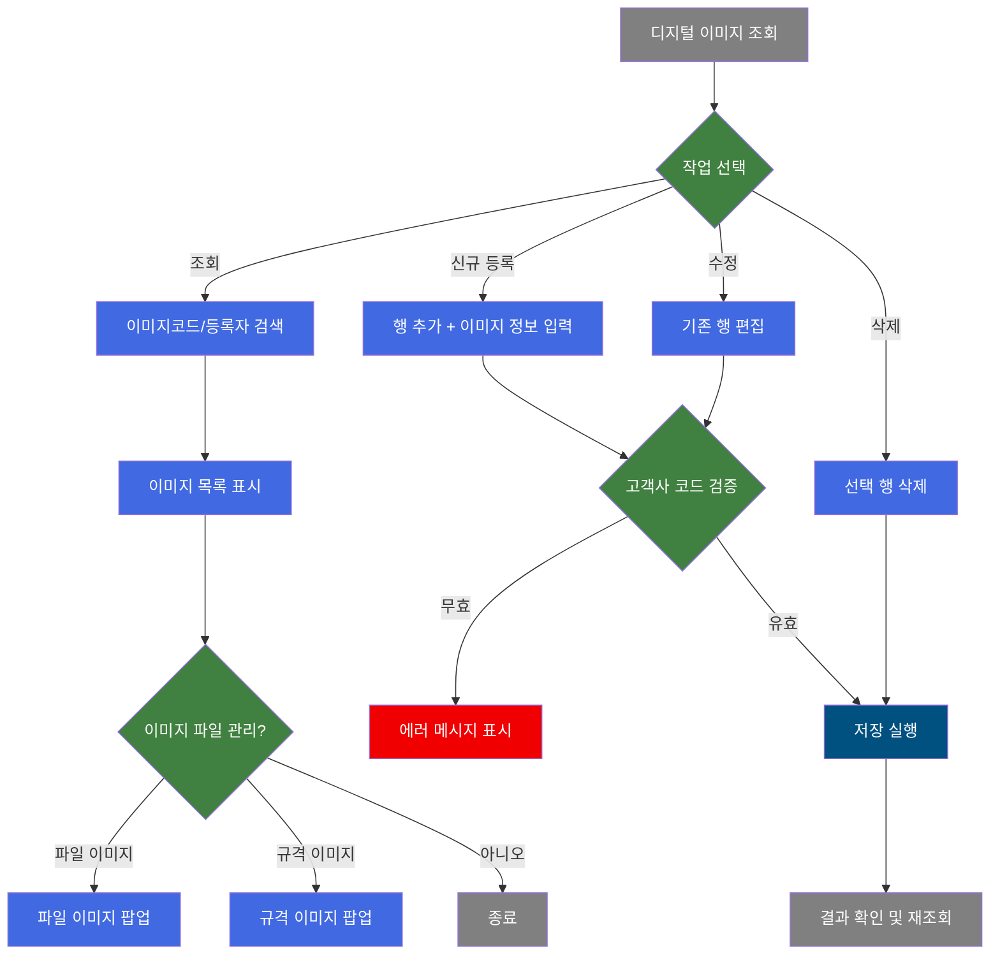
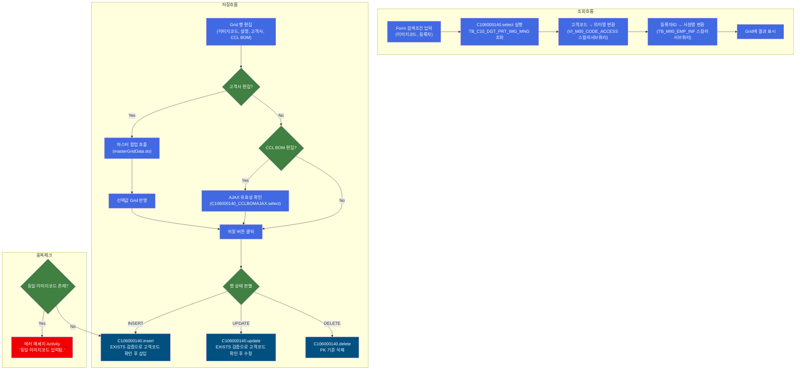
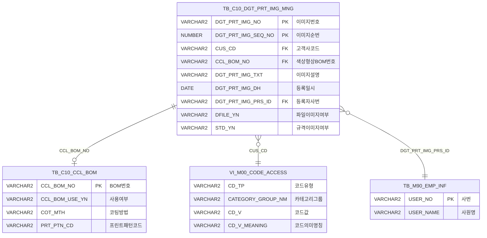

<h1 style="font-size: 40px; text-align: center; font-weight:
   bold; margin: 30px 0;">
  C106000140 레거시 시스템 분석 종합 보고서
</h1>


# 1. 시스템 개요
- **서비스 ID**: C106000140
- **업무명**: 디지털이미지관리
- **분석 일시**: 2026-03-17 (KST)
- **전체 Activity 수**: 5개 (Built-in 4개, Common 1개)
- **분석자**: Claude Opus 4.6 + Sonnet (UI), Haiku (SQL)
- **분석 도구**: /analyze-service C106000140
- **문서 버전**: 1.0

# 📊 비즈니스 프로세스 분석

## 시스템 목적

C106000140은 CCL(Color Coating Line) 공정에서 사용되는 디지털 프린팅 이미지를 관리하는 화면이다. 디지털 프린팅 공정에서는 코일 표면에 인쇄할 이미지 패턴을 사전에 등록하고, 각 이미지에 대해 고객사(최종수요가)와 색상형상 BOM(CCL_BOM_NO)을 연결하여 관리한다.

이 화면은 이미지코드 등록/수정/삭제의 CRUD 기능과 함께, 이미지 파일 업로드(파일 이미지, 규격 이미지)를 팝업을 통해 지원한다. 고객사 코드는 마스터 데이터(VI_M00_CODE_ACCESS) 검증을 통해 무결성을 보장하며, CCL BOM 번호는 AJAX 자동완성으로 유효성을 실시간 확인한다.

## 핵심 워크플로우 다이어그램



### 상세 워크플로우 다이어그램



## 주요 유즈케이스

### UC-01: 디지털 프린팅 이미지 조회
- **Actor**: CCL 공정 오퍼레이터 / 관리자
- **목적**: 등록된 디지털 프린팅 이미지 목록을 이미지코드 또는 등록자명으로 검색하여 조회

- **전제조건**:
  - 사용자가 시스템에 로그인되어 있음
  - TB_C10_DGT_PRT_IMG_MNG 테이블에 데이터가 존재함

- **주요 흐름**:
  1. 사용자가 이미지코드(부분 검색) 또는 등록자명(접두어 검색) 입력
  2. 조회 버튼 클릭
  3. C106000140.select 쿼리 실행 (LIKE 부분검색 + EXISTS 서브쿼리로 등록자 필터)
  4. 고객코드는 마스터 코드의 의미명칭과 함께 "코드 : 명칭" 형태로 Grid에 표시
  5. 등록자ID는 사원정보 테이블에서 사원명으로 변환하여 표시

- **대체 흐름**:
  - 검색 결과 없음: Grid에 빈 목록 표시
  - URL 파라미터 CCL_BOM_NO 전달 시: 초기 로드 시 자동으로 해당 값을 이미지코드에 설정하여 조회 (firstFind, 1회 실행 후 이벤트 해제)

- **후행조건**:
  - 조회된 이미지 목록이 Grid에 표시됨
  - 사용자가 수정/삭제/이미지 등록 작업을 수행할 수 있는 상태

### UC-02: 디지털 프린팅 이미지 신규 등록
- **Actor**: CCL 공정 오퍼레이터
- **목적**: 새로운 디지털 프린팅 이미지 정보를 시스템에 등록

- **전제조건**:
  - 등록할 이미지코드가 기존에 존재하지 않음
  - 유효한 고객사 코드를 알고 있음

- **주요 흐름**:
  1. 메뉴의 "행추가" 버튼 클릭 → 새 행 추가, 등록일에 현재 날짜 자동 입력 (setAutoData)
  2. 이미지코드(DGT_PRT_IMG_NO) 입력
  3. 고객사(CUS_CD) 셀 편집 → masterGridData.do 팝업에서 고객사 선택
  4. CCL BOM번호 입력 시 5자리 길이 제한, AJAX(C106000140_CCLBOMAJAX.select)로 유효성 확인
  5. 저장 버튼 클릭 → 확인 다이얼로그 표시
  6. C106000140.insert 실행 (고객코드 EXISTS 검증 후 삽입, DGT_PRT_IMG_SEQ_NO=1 고정, DFILE_YN='N', STD_YN='N')
  7. 저장 완료 후 자동 새로고침

- **대체 흐름**:
  - 고객사 미입력: "inserted 행에서 CUS_CD 필수" 유효성 검증 실패
  - 동일 이미지코드 존재: "동일 이미지코드 입력됨." 에러 메시지 표시 (SetUIMessage Activity)
  - 고객코드가 마스터에 없음: INSERT 쿼리의 EXISTS 조건 불만족으로 삽입 실패

- **후행조건**:
  - 새 이미지 레코드가 TB_C10_DGT_PRT_IMG_MNG에 등록됨
  - DFILE_YN='N', STD_YN='N' 초기 상태 (이미지 파일은 별도 팝업에서 등록)

### UC-03: 이미지 파일/규격 이미지 등록
- **Actor**: CCL 공정 오퍼레이터
- **목적**: 등록된 이미지 코드에 대해 실제 이미지 파일 또는 규격 이미지를 업로드

- **전제조건**:
  - 이미지 레코드가 이미 등록되어 있음 (UC-02 완료)
  - 업로드할 이미지 파일이 준비되어 있음

- **주요 흐름**:
  1. Grid에서 파일(DFILE_YN) 셀 클릭 → C106000140pop01.jsp 팝업 호출 (465×405, IMG_RGS_TP=1, PRD_SPC_TP=5)
  2. 또는 규격(STD_YN) 셀 클릭 → C106000140pop02.jsp 팝업 호출 (465×405, IMG_RGS_TP=1, PRD_SPC_TP=6)
  3. 팝업에서 이미지 파일 업로드
  4. 업로드 완료 후 해당 컬럼 값이 'Y'로 변경

- **대체 흐름**:
  - 이미지 보기: parentViewImg 함수로 C106000080pop02.jsp 팝업 호출하여 등록된 이미지 조회

- **후행조건**:
  - 이미지 파일이 서버에 저장됨
  - DFILE_YN 또는 STD_YN이 'Y'로 업데이트됨

### UC-04: 이미지 정보 수정
- **Actor**: CCL 공정 오퍼레이터
- **목적**: 기존 이미지의 설명, 고객사, CCL BOM 번호를 수정

- **전제조건**:
  - 수정 대상 이미지 레코드가 조회되어 Grid에 표시됨

- **주요 흐름**:
  1. Grid에서 수정할 셀 더블클릭 (이미지코드는 읽기전용으로 수정 불가)
  2. 설명(DGT_PRT_IMG_TXT) 직접 편집 또는 고객사(CUS_CD) 편집 시 팝업 호출
  3. CCL BOM번호 수정 시 AJAX 유효성 확인
  4. 저장 버튼 클릭
  5. C106000140.update 실행 (NVL로 미입력 필드는 기존값 유지, 고객코드 EXISTS 검증)

- **대체 흐름**:
  - 고객코드 마스터 검증 실패: UPDATE 쿼리의 EXISTS 조건 불만족으로 수정 실패

- **후행조건**:
  - 수정된 정보가 DB에 반영됨
  - 저장 후 자동 새로고침으로 최신 데이터 표시

### UC-05: 이미지 정보 삭제
- **Actor**: CCL 공정 오퍼레이터
- **목적**: 불필요한 이미지 레코드를 삭제

- **전제조건**:
  - 삭제 대상 이미지가 Grid에 표시됨

- **주요 흐름**:
  1. Grid에서 삭제할 행 선택
  2. 메뉴의 "삭제" 버튼 클릭
  3. 저장 버튼 클릭 → 확인 다이얼로그
  4. C106000140.delete 실행 (PK 기준: DGT_PRT_IMG_NO + DGT_PRT_IMG_SEQ_NO)

- **대체 흐름**:
  - 행 미선택 시: "선택된 행이 없습니다" 알림 표시

- **후행조건**:
  - 해당 레코드가 TB_C10_DGT_PRT_IMG_MNG에서 삭제됨

---
## 비즈니스 로직 상세

### 1. 고객코드 마스터 검증 (INSERT/UPDATE 공통)

- **목적**: 이미지 등록/수정 시 입력된 고객코드(CUS_CD)가 마스터 데이터에 유효하게 존재하는지 검증하여 데이터 무결성 확보
- **처리 케이스**:

  **[케이스 1: INSERT 시 고객코드 검증]**
  ```
    조건: 신규 이미지 등록 시
    처리:
      1. CUS_CD 파라미터에서 앞 6자리 추출 (SUBSTR(:CUS_CD,1,6))
      2. VI_M00_CODE_ACCESS 뷰에서 CD_TP='CUS_CD', CATEGORY_GROUP_NM='SZ0000' 조건으로 검증
      3. EXISTS 조건 통과 시에만 INSERT 수행
      4. 미통과 시 삽입 건수 0 (에러 없이 무시됨)
  ```

  **[케이스 2: UPDATE 시 고객코드 검증]**
  ```
    조건: 기존 이미지의 고객코드 수정 시
    처리:
      1. CUS_CD 파라미터에서 앞 6자리 추출
      2. 동일한 EXISTS 검증 수행
      3. 고객코드가 NULL인 경우 NVL로 기존값 유지 (NVL(SUBSTR(:CUS_CD,1,6),SUBSTR(A.CUS_CD,1,6)))
      4. CCL_BOM_NO도 동일 패턴으로 NVL 처리 (미입력 시 기존값 유지)
  ```

### 2. 고객코드 표시 형식 변환 (SELECT)

- **목적**: 고객코드를 코드값과 의미명칭을 결합하여 사용자 친화적으로 표시
- **처리 케이스**:

  **[케이스 1: 스칼라 서브쿼리 코드 변환]**
  ```
    조건: 조회 시 모든 이미지 레코드
    처리:
      1. CUS_CD 컬럼에 스칼라 서브쿼리 결합
      2. A.CUS_CD || ' : ' || CD_V_MEANING 형태로 "코드 : 명칭" 표시
      3. VI_M00_CODE_ACCESS 뷰에서 CD_TP='CUS_CD', CATEGORY_GROUP_NM='SZ0000' 조건으로 조회
  ```

### 3. CCL BOM 유효성 실시간 확인 (AJAX)

- **목적**: 사용자가 CCL BOM번호를 입력할 때 실시간으로 유효성을 확인하여 잘못된 값 입력 방지
- **처리 케이스**:

  **[케이스 1: BOM번호 자동완성]**
  ```
    조건: Grid에서 CCL_BOM_NO 셀(cInd=3) 편집 완료 시
    처리:
      1. 입력값 5자리 길이 제한 (stage=1에서 제어)
      2. c10AjaxData.do 호출 (ServiceName=C106000140-service, colorFind=1)
      3. C106000140_CCLBOMAJAX.select 실행 (CCL_BOM_NO LIKE :CCL_BOM_NO||'%')
      4. TB_C10_CCL_BOM 테이블에서 접두어 매칭 결과 반환
  ```

### 4. 동일 이미지코드 중복 체크

- **목적**: 이미 등록된 이미지코드와 동일한 코드를 중복 등록하는 것을 방지
- **처리 케이스**:

  **[케이스 1: 중복 감지]**
  ```
    조건: 저장 시 동일 이미지코드가 이미 존재
    처리:
      1. Router에서 저장 경로 대신 에러메세지 Activity로 분기
      2. SetUIMessage Activity가 "동일 이미지코드 입력됨." 메시지 설정
      3. errMsg 키로 UI에 에러 메시지 표시
  ```

---

# 💾 데이터 요구사항

## 핵심 테이블

### 1. TB_C10_DGT_PRT_IMG_MNG - (디지털 프린팅 이미지 관리)
| 컬럼명 | 타입 | PK | 설명 |
|--------|------|----|-----|
| DGT_PRT_IMG_NO | VARCHAR2 | ✅ | 디지털프린팅 이미지번호 |
| DGT_PRT_IMG_SEQ_NO | NUMBER | ✅ | 디지털프린팅 이미지순번 (INSERT 시 1 고정) |
| CUS_CD | VARCHAR2 |  | 고객사코드 (최종수요가, 6자리) |
| CCL_BOM_NO | VARCHAR2 |  | 색상형상 BOM번호 |
| DGT_PRT_IMG_TXT | VARCHAR2 |  | 이미지 설명 |
| DGT_PRT_IMG_DH | DATE |  | 등록일시 (SYSDATE) |
| DGT_PRT_IMG_PRS_ID | VARCHAR2 |  | 등록자 사번 |
| DGT_PRT_IMG_MDF_DH | DATE |  | 수정일시 |
| DGT_PRT_IMG_MDF_PRS_ID | VARCHAR2 |  | 수정자 사번 |
| DFILE_YN | VARCHAR2 |  | 파일이미지 등록여부 (Y/N, 기본 N) |
| STD_YN | VARCHAR2 |  | 규격이미지 등록여부 (Y/N, 기본 N) |
| CREATED_OBJECT_TYPE | VARCHAR2 |  | 감사 - 생성 객체타입 |
| CREATED_OBJECT_ID | VARCHAR2 |  | 감사 - 생성자 ID |
| CREATED_PROGRAM_ID | VARCHAR2 |  | 감사 - 생성 프로그램 ID |
| CREATION_TIMESTAMP | DATE |  | 감사 - 생성 타임스탬프 |
| LAST_UPDATED_OBJECT_TYPE | VARCHAR2 |  | 감사 - 수정 객체타입 |
| LAST_UPDATED_OBJECT_ID | VARCHAR2 |  | 감사 - 수정자 ID |
| LAST_UPDATE_PROGRAM_ID | VARCHAR2 |  | 감사 - 수정 프로그램 ID |
| LAST_UPDATE_TIMESTAMP | DATE |  | 감사 - 수정 타임스탬프 |

### 2. TB_C10_CCL_BOM - (CCL 색상형상 BOM)
| 컬럼명 | 타입 | PK | 설명 |
|--------|------|----|-----|
| CCL_BOM_NO | VARCHAR2 | ✅ | 색상형상 BOM번호 |
| CCL_BOM_USE_YN | VARCHAR2 |  | BOM 사용여부 |
| COT_MTH | VARCHAR2 |  | 코팅방법 |
| COL_SUR_HND_CD | VARCHAR2 |  | 색상표면처리코드 |
| PRT_PTN_CD | VARCHAR2 |  | 프린트패턴코드 |
| HUE_CD_FRN | VARCHAR2 |  | 색상코드(표면) |

### 3. VI_M00_CODE_ACCESS - (마스터 코드 뷰, M00APUSER)
| 컬럼명 | 타입 | PK | 설명 |
|--------|------|----|-----|
| CD_TP | VARCHAR2 |  | 코드유형 (예: 'CUS_CD') |
| CATEGORY_GROUP_NM | VARCHAR2 |  | 카테고리그룹명 (예: 'SZ0000') |
| CD_V | VARCHAR2 |  | 코드값 |
| CD_V_MEANING | VARCHAR2 |  | 코드 의미명칭 |

### 4. TB_M90_EMP_INF - (사원정보, M90APUSER)
| 컬럼명 | 타입 | PK | 설명 |
|--------|------|----|-----|
| USER_NO | VARCHAR2 | ✅ | 사번 |
| USER_NAME | VARCHAR2 |  | 사원명 |

## 데이터 플로우

### 1. 조회
```
[이미지 목록 조회]
화면 진입 → Form에 검색조건 입력 (이미지코드, 등록자)
→ C106000140.select
  FROM C10APUSER.TB_C10_DGT_PRT_IMG_MNG A
  LEFT JOIN M00APUSER.VI_M00_CODE_ACCESS (CD_TP='CUS_CD', CATEGORY_GROUP_NM='SZ0000', CD_V=A.CUS_CD)
  LEFT JOIN M90APUSER.TB_M90_EMP_INF (USER_NO=A.DGT_PRT_IMG_PRS_ID, USER_NAME LIKE :등록자명||'%')
  WHERE A.DGT_PRT_IMG_NO LIKE '%'||:이미지코드||'%'
    AND EXISTS (등록자명 필터 서브쿼리)
→ Grid에 이미지 목록 표시 (고객코드: "코드 : 명칭" 형태)

[CCL BOM 유효성 확인 - AJAX]
Grid에서 CCL_BOM_NO 편집
→ C106000140_CCLBOMAJAX.select
  FROM TB_C10_CCL_BOM
  WHERE CCL_BOM_NO LIKE :CCL_BOM_NO||'%'
→ 자동완성 목록 반환
```

### 2. 신규 등록
```
[이미지 정보 신규 등록]
메뉴 "행추가" 클릭 → 새 행 생성 (등록일=현재날짜 자동설정)
→ 이미지코드, 설명, 고객사(팝업), CCL BOM 입력
→ 저장 버튼 클릭
→ C106000140.insert
  INSERT INTO C10APUSER.TB_C10_DGT_PRT_IMG_MNG
  SELECT :이미지코드, 1, SYSDATE, :사번, SYSDATE, :사번,
         :설명, :고객코드, :CCL_BOM, 'N', 'N', 감사정보...
  FROM DUAL
  WHERE EXISTS (고객코드 마스터 검증)
→ 저장 완료 후 자동 새로고침
```

### 3. 수정
```
[이미지 정보 수정]
Grid에서 셀 편집 (설명, 고객사, CCL BOM)
→ 저장 버튼 클릭
→ C106000140.update
  UPDATE C10APUSER.TB_C10_DGT_PRT_IMG_MNG A
  SET CCL_BOM_NO = NVL(:CCL_BOM, 기존값),
      CUS_CD = NVL(SUBSTR(:고객코드,1,6), 기존값),
      DGT_PRT_IMG_TXT = :설명
  WHERE DGT_PRT_IMG_NO = :이미지코드
    AND EXISTS (고객코드 마스터 검증)
→ 저장 완료 후 자동 새로고침
```

### 4. 삭제
```
[이미지 정보 삭제]
Grid에서 행 선택 → 메뉴 "삭제" 클릭
→ 저장 버튼 클릭
→ C106000140.delete
  DELETE FROM C10APUSER.TB_C10_DGT_PRT_IMG_MNG
  WHERE DGT_PRT_IMG_NO = :이미지코드
    AND DGT_PRT_IMG_SEQ_NO = :순번
→ 저장 완료 후 자동 새로고침
```

## SQL 일람표

| SQL 이름 | 쿼리 ID | 타입 | 출처 | 테이블 |
|---------|---------|-----|-------|-------|
| 이미지 목록 조회 | C106000140.select | SELECT | Service | TB_C10_DGT_PRT_IMG_MNG, VI_M00_CODE_ACCESS, TB_M90_EMP_INF |
| CCL BOM 조회 (AJAX) | C106000140_CCLBOMAJAX.select | SELECT | Service | TB_C10_CCL_BOM |
| 이미지 정보 등록 | C106000140.insert | INSERT | Service | TB_C10_DGT_PRT_IMG_MNG, VI_M00_CODE_ACCESS |
| 이미지 정보 수정 | C106000140.update | UPDATE | Service | TB_C10_DGT_PRT_IMG_MNG, VI_M00_CODE_ACCESS |
| 이미지 정보 삭제 | C106000140.delete | DELETE | Service | TB_C10_DGT_PRT_IMG_MNG |

## ER 다이어그램 (핵심 관계)



관계 설명:
- **TB_C10_DGT_PRT_IMG_MNG**이 중심 테이블로 모든 관계의 허브 역할
- **TB_C10_CCL_BOM**: CCL_BOM_NO를 통한 선택적 참조 관계 (NULL 허용)
- **VI_M00_CODE_ACCESS**: CUS_CD 기반 고객코드 마스터 검증 (CD_TP='CUS_CD', CATEGORY_GROUP_NM='SZ0000')
- **TB_M90_EMP_INF**: DGT_PRT_IMG_PRS_ID를 통한 등록자 사원정보 조회

---

# 🖥️ 사용자 인터페이스 요구사항

## 화면 레이아웃 상세

### Layout 구조 (절대위치 배치)
```javascript
{
  layoutType: "flat",  // 레이아웃 없이 절대위치로 배치
  components: [
    {
      id: "C106000140_Form_1",
      type: "form",
      position: { left: 0, top: 0, width: 981, height: 28 }
    },
    {
      id: "C106000140_Menu_1",
      type: "menu",
      position: { left: 0, top: 28, width: 981, height: 25 }
    },
    {
      id: "C106000140_Grid_1",
      type: "grid",
      position: { left: -1, top: 54, width: 980, height: 511 }
    },
    {
      id: "C106000140_messagebox",
      type: "messagebox",
      position: { left: -1, top: 567, width: 980, height: 19 }
    }
  ]
}
```

## 입출력 요소

### Form 컴포넌트
**C106000140_Form_1**
- DGT_PRT_IMG_NO: input - 이미지코드 검색 (너비 75px)
- DGT_PRT_IMG_PRS_ID_NM: input - 등록자 검색 (너비 75px)
- find: button - 조회 → Grid 데이터 로드
- save: button - 저장 → Grid 변경 데이터 저장
- winClose: button - 닫기 → 화면 닫기

### Menu 컴포넌트
**C106000140_Menu_1** (referenceItem: C106000140_Grid_1)
- refresh: 새로고침 (refresh.gif) → Grid 데이터 초기화 후 재조회
- add: 행추가 (new.gif) → 새 행 추가 + 등록일 자동입력
- remove: 삭제 (remove.gif) → 선택 행 삭제 마킹

### Grid 컴포넌트
**C106000140_Grid_1 (디지털 프린팅 이미지 목록)**
- 편집 가능 여부: 예 (click, dblclick 이벤트로 편집)
- Split: 0 (고정 컬럼 없음)
- 행 수: 22행
- 설정: multiselect, smartRendering, 컨텍스트메뉴, 페이지네이션
- 컬럼 너비: % 단위
- 주요 컬럼 (13개):

  **기본 정보**:
  - DGT_PRT_IMG_NO: ed - 프린팅 이미지코드 (13%, 중앙정렬, 편집가능, 배경색 FFFFC0)
  - DGT_PRT_IMG_TXT: ed - 설명 (40%, 좌측정렬, 편집가능)
  - CUS_CD: ed - 고객사 (18%, 좌측정렬, 편집 시 masterGridData.do 팝업 연동)

  **등록자 정보**:
  - DGT_PRT_IMG_PRS_ID: ro - 등록자 사번 (8%, 중앙정렬, 숨김)
  - DGT_PRT_IMG_PRS_NM: ro - 등록자명 (6%, 중앙정렬)
  - DGT_PRT_IMG_DH: ro - 등록일 (12%, 중앙정렬)

  **이미지 상태**:
  - DFILE_YN: ro - 파일이미지여부 (*, 중앙정렬, 배경색 FFFFC0, 클릭 시 팝업)
  - STD_YN: ro - 규격IMAGE여부 (*, 중앙정렬, 배경색 FFFFC0, 클릭 시 팝업)

  **숨김 컬럼**:
  - USER_NO: ro - 사번 (9%, 중앙정렬, 숨김)
  - DGT_PRT_IMG_SEQ_NO: ro - 순서 (15%, 중앙정렬, 숨김)
  - IMG_ADR: ro - 이미지주소 (숨김)
  - IMG_NM: ro - 이미지명 (숨김)
  - CNT: ro - 카운트 (숨김)

## 화면 동작 흐름

### 1. 화면 초기 로딩
```
1. 화면 진입
2. pageConfiguration으로 Form, Menu, Grid, Messagebox 초기화
3. Grid XLE 이벤트 → setReadonly 호출 (첫 번째 열 읽기전용 설정)
4. Grid XLE 이벤트 → firstFind 호출 (1회 실행 후 이벤트 해제)
   - URL 파라미터 CCL_BOM_NO 확인
   - 값 존재 시 → Form의 DGT_PRT_IMG_NO에 설정 후 조회 실행
   - 값 없으면 → 빈 그리드 표시
5. 상태바(messagebox) 초기화
```

### 2. 이미지 조회
```
1. 사용자가 이미지코드 또는 등록자명 입력
2. 조회(find) 버튼 클릭
3. Form 파라미터 수집 + USER_NO 파라미터 추가
4. gridC10Data.do 호출 → C106000140-service (find 명령)
5. C106000140.select 쿼리 실행
6. Grid에 결과 바인딩 (고객코드: "코드 : 명칭" 형태)
```

### 3. 이미지 정보 저장 (신규/수정/삭제)
```
1. 행추가(add) → 새 행 생성, 등록일 자동설정
   또는 기존 행 편집 (고객사 → 팝업, CCL BOM → AJAX 검증)
   또는 행 삭제(remove) → 삭제 마킹
2. 저장(save) 버튼 클릭
3. 유효성 검사: INSERT 행의 CUS_CD 필수 체크
4. 확인 다이얼로그 표시
5. handleDataProcess.do 호출 → C106000140-service (save 명령)
6. GridSave Activity가 행 상태별 INSERT/UPDATE/DELETE 쿼리 실행
7. onAfterUpdateFinishEvent → refresh 호출 → Grid 재조회
```

### 4. 고객사 선택 (팝업)
```
1. Grid에서 CUS_CD(고객사) 셀 편집 완료 (stage=2, cInd=2)
2. masterGridData.do 팝업 호출 (CD_TP=CUS_CD, CATEGORY_GROUP_NM=SZ0000)
3. 팝업에서 고객사 선택
4. masterSetValue 콜백 → 선택된 코드를 Grid CUS_CD 컬럼에 설정
5. 행 상태를 updated로 마킹
```

### 5. 이미지 파일 등록 (팝업)
```
1. Grid에서 DFILE_YN(파일) 또는 STD_YN(규격) 셀 클릭
2. doImgPopUp6 (파일 이미지) → C106000140pop01.jsp 팝업 (465×405)
   또는 doImgPopUp7 (규격 이미지) → C106000140pop02.jsp 팝업 (465×405)
3. 파라미터 전달: rowId, DGT_PRT_IMG_NO, DGT_PRT_IMG_SEQ_NO, IMG_RGS_TP=1, PRD_SPC_TP=5 또는 6
4. 팝업에서 이미지 업로드 처리
```

## JavaScript 모듈

**C106000140.jsp** (인라인 스크립트)
- find(): 조회 - Form 파라미터 수집 + USER_NO 추가 → Grid 데이터 로드
- save(): 저장 - INSERT 행 CUS_CD 필수 검증 → 확인 다이얼로그 → 저장 실행
- add(): 행추가 - 새 행 생성 + setAutoData로 등록일 자동 입력
- remove(): 삭제 - 선택 행 삭제 마킹 (미선택 시 알림)
- refresh(): 새로고침 - Grid 초기화 후 Form 파라미터로 재조회
- doImgPopUp6(): 파일이미지 팝업 - C106000140pop01.jsp 호출
- doImgPopUp7(): 규격이미지 팝업 - C106000140pop02.jsp 호출
- onEditCellEvent(stage, rId, cInd, nValue, oValue): 셀 편집 이벤트
  - stage=1: btnChk=false, CCL_BOM_NO 5자리 제한
  - stage=2: CUS_CD 편집 시 팝업, CCL_BOM_NO 편집 시 AJAX 검증
- masterSetValue(cd): 고객사 팝업 반환값 Grid에 설정
- firstFind(): 초기 로드 시 URL 파라미터 기반 자동 조회 (1회 실행)
- setReadonly(): Grid 첫 번째 열 읽기전용 설정
- parentViewImg(): C106000080pop02.jsp로 이미지 조회
- onAfterUpdateFinishEvent(): 저장 완료 후 refresh 호출
- onGridContextMenuClick(id, zoneId, cas): 컨텍스트 메뉴 (컬럼이동/필터/편집토글/엑셀)
- copy(): 선택 행 클립보드 복사
- undo(): 실행 취소
- redo(): 재실행

## 주요 이벤트 핸들러

**onEditCellEvent (셀 편집)**
- 이벤트 타입: Grid Cell Edit
- 처리 내용:
  1. stage=1 (편집 시작): btnChk=false 설정, CCL_BOM_NO(cInd=3) 5자리 길이 제한
  2. stage=2 (편집 완료):
     - cInd=2 (고객사): masterGridData.do 팝업 호출 (CD_TP=CUS_CD, CATEGORY_GROUP_NM=SZ0000)
     - cInd=3 (CCL BOM): c10AjaxData.do 호출로 BOM번호 유효성 AJAX 확인

**onAfterUpdateFinishEvent (저장 완료)**
- 이벤트 타입: Grid Save Complete
- 처리 내용:
  1. 저장 완료 감지
  2. refresh() 호출하여 Grid 재조회

**firstFind (초기 자동 조회)**
- 이벤트 타입: Grid XLE (1회 실행 후 이벤트 해제)
- 처리 내용:
  1. URL 파라미터에서 CCL_BOM_NO 값 추출
  2. Form의 DGT_PRT_IMG_NO에 값 설정
  3. find() 호출하여 초기 조회 실행

---

# 📌 특이사항 및 주의사항

## 1. 고객코드 6자리 SUBSTR 처리
- **INSERT/UPDATE 시 CUS_CD 처리**: 화면에서는 "코드 : 명칭" 형태로 표시하지만, INSERT/UPDATE 쿼리에서는 `SUBSTR(:CUS_CD,1,6)`으로 앞 6자리만 추출하여 저장. 팝업에서 반환되는 값이 "코드 : 명칭" 형태일 수 있으므로 서버 측에서 코드값만 분리하는 방어 로직.

## 2. INSERT 시 DGT_PRT_IMG_SEQ_NO 하드코딩
- **시퀀스 번호 고정**: INSERT 쿼리에서 `DGT_PRT_IMG_SEQ_NO = 1`로 하드코딩되어 있어, 동일 이미지번호에 대해 여러 순번을 등록하는 로직이 없음. PK가 (DGT_PRT_IMG_NO, DGT_PRT_IMG_SEQ_NO) 복합키이지만 실질적으로 DGT_PRT_IMG_NO만으로 유일성이 결정됨.

## 3. EXISTS 기반 고객코드 검증의 무음 실패
- **INSERT/UPDATE 모두 EXISTS 조건 적용**: 고객코드가 마스터 코드에 없으면 INSERT는 0건 삽입, UPDATE는 0건 수정되며, 별도의 에러 메시지 없이 무시됨. 사용자가 저장이 성공한 것으로 착각할 수 있는 위험 존재.

## 4. 스키마 혼용 패턴
- **3개 스키마 교차 참조**: 메인 테이블은 `C10APUSER.TB_C10_DGT_PRT_IMG_MNG`, 마스터 코드는 `M00APUSER.VI_M00_CODE_ACCESS`, 사원정보는 `M90APUSER.TB_M90_EMP_INF`로 3개 스키마를 교차 참조. 쿼리 파일에서 스키마를 직접 명시하고 있어 스키마 변경 시 모든 쿼리를 수정해야 함.

## 5. CCL BOM 전체 테이블 조회 (CCLBOMAJAX)
- **와일드카드 검색**: `C106000140_CCLBOMAJAX.select`는 `SELECT *`로 TB_C10_CCL_BOM의 모든 컬럼을 조회하며, LIKE 접두어 검색으로 대량의 결과가 반환될 수 있음. 인덱스 활용 여부에 따라 성능 이슈 가능.

## 6. URL 파라미터 기반 초기 조회 (firstFind)
- **외부 화면 연동**: URL 파라미터 CCL_BOM_NO를 통해 다른 화면에서 이 화면으로 이동하며 자동 조회가 가능. 이 때 CCL_BOM_NO 값을 이미지코드(DGT_PRT_IMG_NO) 검색조건에 설정하는 것이 의도된 동작인지 확인 필요 (파라미터명과 설정 필드가 다름).

---

# 📚 참고 문서

- **Query SQL**: `src/query/C106000140-query.glue_sql`
- **Service XML**: `src/service/C106000140-service.xml`
- **JSP**: `WebContents/C106000140.jsp`
- **팝업 JSP**:
  - `WebContents/C106000140pop01.jsp` (파일이미지 등록)
  - `WebContents/C106000140pop02.jsp` (규격이미지 등록)
- **UI 컴포넌트 XML**:
  - `WebContents/header/kr/C106000140/C106000140_Form_1.xml`
  - `WebContents/header/kr/C106000140/C106000140_Menu_1.xml`
  - `WebContents/header/kr/C106000140/C106000140_Grid_1.xml`
