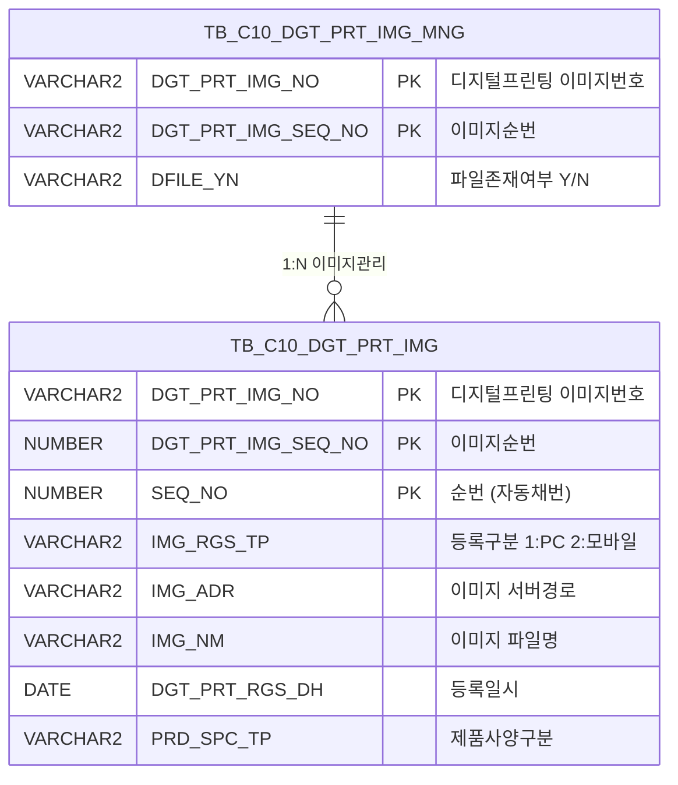

<h1 style="font-size: 40px; text-align: center; font-weight:
   bold; margin: 30px 0;">
  C106000140pop01 레거시 시스템 분석 종합 보고서
</h1>


# 1. 시스템 개요
- **서비스 ID**: C106000140pop01
- **업무명**: 디지털프린팅 이미지 등록 팝업
- **분석 일시**: 2026-03-17 11:17 KST
- **분석 시간**: 약 5분
- **전체 Activity 수**: 2개 (Built-in: 2개, Custom: 0개)
- **분석자**: Claude Opus 4.6 / Sonnet 4.6
- **분석 도구**: /analyze-service C106000140pop01
- **문서 버전**: 1.0

# 📊 비즈니스 프로세스 분석

## 시스템 목적

C106000140pop01은 디지털 프린팅 작업지시 화면(C106000140)에서 호출되는 **이미지 등록/관리 팝업** 서비스이다. 프린트롤 규격(PRD_SPC_TP = '5') 관련 이미지를 업로드, 조회, 삭제하는 기능을 제공한다.

부모 화면에서 특정 프린팅번호(DGT_PRT_IMG_NO)와 이미지 순번(DGT_PRT_IMG_SEQ_NO)을 전달받아, 해당 건에 대한 이미지 파일을 dhtmlXVault 컴포넌트를 통해 업로드하고, 등록된 이미지 목록을 그리드로 조회한다. 이미지 업로드/삭제 시 관리 테이블(TB_C10_DGT_PRT_IMG_MNG)의 파일 존재 여부 플래그(DFILE_YN)가 자동으로 갱신된다.

이 팝업은 PC와 모바일 구분 없이 이미지 등록 구분(IMG_RGS_TP)을 부모 화면에서 전달받으며, 실제 팝업에서는 해당 값을 '1'(PC)로 고정하여 파일을 업로드한다.

<!-- 워크플로우 다이어그램 생략: Custom Activity 0개, 서비스 XML 내 SELECT 쿼리만 사용, Router → 단일 조회 체인 구조 -->

## 주요 유즈케이스

### UC-01: 등록된 이미지 목록 조회
- **Actor**: 디지털프린팅 작업 오퍼레이터
- **목적**: 특정 프린팅번호/순번에 대해 등록된 프린트롤 이미지 목록을 확인

- **전제조건**:
  - 부모 화면(C106000140)에서 프린팅번호(DGT_PRT_IMG_NO), 이미지순번(DGT_PRT_IMG_SEQ_NO) 파라미터 전달
  - TB_C10_DGT_PRT_IMG 테이블에 해당 프린팅번호의 이미지 데이터 존재

- **주요 흐름**:
  1. 부모 화면에서 팝업 오픈 시 JSP 파라미터(DGT_PRT_IMG_NO, DGT_PRT_IMG_SEQ_NO, PRD_SPC_TP 등) 전달
  2. body onload 시 `onVaultLoad()` 호출하여 dhtmlXVault 초기화 및 `onLoadGrid()` 호출
  3. `onLoadGrid()`에서 `gridC10Data.do` 호출 → `C106000140pop01_Grid_1.select` 쿼리 실행
  4. Grid에 이미지 목록 표시 (프린팅번호, 순번, 구분(PC/모바일), 이미지명, 등록일자, 등록자)

- **대체 흐름**:
  - 등록된 이미지가 없는 경우: 빈 그리드 표시
  - PRD_SPC_TP ≠ '5'인 이미지는 조회 결과에서 제외됨

- **후행조건**:
  - 이미지 목록이 Grid에 표시됨
  - 이미지명 링크 클릭으로 이미지 뷰어 호출 가능

### UC-02: 이미지 파일 업로드
- **Actor**: 디지털프린팅 작업 오퍼레이터
- **목적**: 프린트롤 규격 관련 이미지를 시스템에 등록

- **전제조건**:
  - 팝업이 정상 오픈되어 있음
  - 업로드할 이미지 파일 준비

- **주요 흐름**:
  1. dhtmlXVault 영역에 파일 드래그 또는 파일 선택
  2. 파일 1개 제한 검증 (`onAddFile` 이벤트에서 기존 파일 수 확인)
  3. 업로드 버튼 클릭 → `_uploadHandler5.jsp` 서버 핸들러 호출
  4. 서버에서 `C106000140pop01.insert` 쿼리 실행하여 TB_C10_DGT_PRT_IMG에 레코드 생성
  5. SEQ_NO는 `NVL(MAX(SEQ_NO),0)+1`로 자동 채번
  6. 업로드 완료 후 `onUploadComplete` 이벤트 → `onLoadGrid()` 호출하여 그리드 갱신
  7. `C106000140pop01.update` 쿼리 실행 → TB_C10_DGT_PRT_IMG_MNG의 DFILE_YN = 'Y' 갱신

- **대체 흐름**:
  - 파일 1개 초과 시: 업로드 불가 처리 (기존 파일 수 >= 1이면 차단)
  - 업로드 실패 시: 에러 메시지 표시

- **후행조건**:
  - TB_C10_DGT_PRT_IMG에 새 이미지 레코드 생성
  - TB_C10_DGT_PRT_IMG_MNG의 DFILE_YN이 'Y'로 갱신
  - 그리드에 새로 업로드된 이미지 표시

### UC-03: 이미지 삭제
- **Actor**: 디지털프린팅 작업 오퍼레이터
- **목적**: 잘못 등록된 이미지를 삭제

- **전제조건**:
  - 그리드에 삭제 대상 이미지가 표시되어 있음

- **주요 흐름**:
  1. 그리드의 '삭제' 컬럼 클릭
  2. `doImgDel()` 함수 호출 → `_fileDeleteHandler4.jsp` 서버 핸들러 호출
  3. 서버에서 `C106000140pop01.delete` 쿼리 실행하여 TB_C10_DGT_PRT_IMG에서 해당 레코드 삭제
  4. 삭제 완료 후 `onLoadGrid()` 호출하여 그리드 갱신
  5. `C106000140pop01.update` 쿼리 실행 → 남은 이미지 수에 따라 DFILE_YN 갱신 (0건이면 'N', 1건 이상이면 'Y')

- **대체 흐름**:
  - 삭제 실패 시: 에러 메시지 표시

- **후행조건**:
  - TB_C10_DGT_PRT_IMG에서 해당 레코드 삭제됨
  - TB_C10_DGT_PRT_IMG_MNG의 DFILE_YN이 이미지 존재 여부에 따라 갱신됨
  - 부모 화면의 그리드 갱신 (parent.items 연동)

### UC-04: 이미지 뷰어 호출
- **Actor**: 디지털프린팅 작업 오퍼레이터
- **목적**: 등록된 이미지를 확대하여 확인

- **전제조건**:
  - 그리드에 이미지가 1건 이상 표시됨

- **주요 흐름**:
  1. 그리드의 이미지명(IMG_NM) 컬럼 링크 클릭
  2. `Grid_doLink()` 함수 호출
  3. 클릭한 행의 CHK_IMG_ADR(이미지 경로)과 CHK_IMG_NM(이미지명) 추출
  4. `parent.parentViewImg(imgAdr, imgNm)` 호출하여 부모 화면의 이미지 뷰어 팝업 오픈

- **대체 흐름**:
  - 이미지 경로가 유효하지 않은 경우: 이미지 로드 실패

- **후행조건**:
  - 이미지 뷰어 팝업에 해당 이미지 표시됨

---
## 비즈니스 로직 상세

### 1. 이미지 등록 구분(IMG_RGS_TP) 코드 변환

- **목적**: 이미지 등록 구분 코드를 사용자가 이해할 수 있는 의미명으로 변환하여 그리드에 표시
- **처리 케이스**:

  **[케이스 1: PC 등록]**
  ```
    조건: IMG_RGS_TP ≠ '2' (기본값)
    처리:
      1. DECODE(IMG_RGS_TP, '2', '모바일', 'PC') 적용
      2. 'PC'로 표시
  ```

  **[케이스 2: 모바일 등록]**
  ```
    조건: IMG_RGS_TP = '2'
    처리:
      1. DECODE(IMG_RGS_TP, '2', '모바일', 'PC') 적용
      2. '모바일'로 표시
  ```

### 2. 이미지 경로(IMG_ADR) 웹 접근 경로 변환

- **목적**: 서버 파일 시스템 경로를 웹 브라우저에서 접근 가능한 상대 경로로 변환
- **처리 케이스**:

  **[케이스 1: 경로 변환]**
  ```
    조건: IMG_ADR에 'IMG_UPLOAD' 문자열 포함
    처리:
      1. INSTR(IMG_ADR, 'IMG_UPLOAD')로 'IMG_UPLOAD' 시작 위치 탐색
      2. SUBSTR로 'IMG_UPLOAD' 이후 경로 추출
      3. REPLACE로 역슬래시(\)를 슬래시(/)로 변환 (Windows → Web 경로)
      4. 앞에 './' 접두어, 뒤에 '/' 접미어 추가
    결과: './IMG_UPLOAD/경로/' 형태의 웹 접근 경로 생성
  ```

  **계산 공식**:
  ```
  CHK_IMG_ADR = './' || REPLACE(SUBSTR(IMG_ADR, INSTR(IMG_ADR, 'IMG_UPLOAD')), '\', '/') || '/'

  예시:
  원본: D:\mesdata\IMG_UPLOAD\C10\2026\03\
  변환: ./IMG_UPLOAD/C10/2026/03/
  ```

### 3. 이미지 순번(SEQ_NO) 자동 채번

- **목적**: 동일 프린팅번호/이미지순번 내에서 이미지 순번을 자동으로 부여
- **처리 케이스**:

  **[케이스 1: 신규 등록]**
  ```
    조건: 해당 프린팅번호에 기존 이미지 없음
    처리:
      1. MAX(SEQ_NO)가 NULL → NVL 적용으로 0 반환
      2. 0 + 1 = 1 (첫 번째 순번)
  ```

  **[케이스 2: 추가 등록]**
  ```
    조건: 해당 프린팅번호에 기존 이미지 존재
    처리:
      1. MAX(SEQ_NO) 조회 (예: 3)
      2. 3 + 1 = 4 (다음 순번)
  ```

  **계산 공식**:
  ```
  SEQ_NO = NVL(MAX(SEQ_NO), 0) + 1
  WHERE DGT_PRT_IMG_NO = :IMG_RGS_FLAG_ID
    AND DGT_PRT_IMG_SEQ_NO = :IMG_RGS_FLAG_ID2
  ```

### 4. 파일 등록 여부(DFILE_YN) 자동 갱신

- **목적**: 이미지 업로드/삭제 시 관리 테이블의 파일 존재 플래그를 자동으로 동기화
- **처리 케이스**:

  **[케이스 1: 이미지 존재]**
  ```
    조건: TB_C10_DGT_PRT_IMG에서 해당 건의 이미지 COUNT > 0
    처리:
      1. DECODE(COUNT, 0, 'N', 'Y') → 'Y'
      2. TB_C10_DGT_PRT_IMG_MNG.DFILE_YN = 'Y' 갱신
  ```

  **[케이스 2: 이미지 없음]**
  ```
    조건: TB_C10_DGT_PRT_IMG에서 해당 건의 이미지 COUNT = 0
    처리:
      1. DECODE(COUNT, 0, 'N', 'Y') → 'N'
      2. TB_C10_DGT_PRT_IMG_MNG.DFILE_YN = 'N' 갱신
  ```

  **계산 공식**:
  ```
  DFILE_YN = DECODE(
    (SELECT COUNT(IMG_NM) FROM TB_C10_DGT_PRT_IMG
     WHERE DGT_PRT_IMG_NO = :IMG_RGS_FLAG_ID
       AND DGT_PRT_IMG_SEQ_NO = :IMG_RGS_FLAG_ID2
       AND PRD_SPC_TP = '5'),
    0, 'N', 'Y'
  )
  ```

---

# 💾 데이터 요구사항

## 핵심 테이블

### 1. TB_C10_DGT_PRT_IMG - (디지털프린팅 이미지 저장 테이블)
| 컬럼명 | 타입 | PK | 설명 |
|--------|------|----|-----|
| DGT_PRT_IMG_NO | VARCHAR2 | ✅ | 디지털프린팅 이미지번호 (PK) |
| DGT_PRT_IMG_SEQ_NO | NUMBER | ✅ | 디지털프린팅 이미지순번 (PK) |
| SEQ_NO | NUMBER | ✅ | 이미지 순번 (PK, 자동 채번) |
| IMG_RGS_TP | VARCHAR2 | | 이미지 등록 구분 ('1':PC, '2':모바일) |
| IMG_ADR | VARCHAR2 | | 이미지 파일 서버 경로 |
| IMG_NM | VARCHAR2 | | 이미지 파일명 |
| DGT_PRT_RGS_DH | DATE | | 디지털프린팅 등록 일시 |
| DGT_PRT_RGS_PRS_ID | VARCHAR2 | | 등록자 ID |
| PRD_SPC_TP | VARCHAR2 | | 제품 사양 구분 ('5': 프린트롤 규격) |
| CREATED_OBJECT_TYPE | VARCHAR2 | | 생성 객체 유형 |
| CREATED_OBJECT_ID | VARCHAR2 | | 생성자 ID |
| CREATED_PROGRAM_ID | VARCHAR2 | | 생성 프로그램 ID |
| CREATION_TIMESTAMP | TIMESTAMP | | 생성 타임스탬프 |
| LAST_UPDATED_OBJECT_TYPE | VARCHAR2 | | 최종수정 객체 유형 |
| LAST_UPDATED_OBJECT_ID | VARCHAR2 | | 최종수정자 ID |
| LAST_UPDATE_PROGRAM_ID | VARCHAR2 | | 최종수정 프로그램 ID |
| LAST_UPDATE_TIMESTAMP | TIMESTAMP | | 최종수정 타임스탬프 |

### 2. TB_C10_DGT_PRT_IMG_MNG - (디지털프린팅 이미지 관리 테이블)
| 컬럼명 | 타입 | PK | 설명 |
|--------|------|----|-----|
| DGT_PRT_IMG_NO | VARCHAR2 | ✅ | 디지털프린팅 이미지번호 (PK) |
| DGT_PRT_IMG_SEQ_NO | NUMBER | ✅ | 디지털프린팅 이미지순번 (PK) |
| DFILE_YN | VARCHAR2 | | 파일 존재 여부 ('Y'/'N', 자동 갱신) |
| LAST_UPDATED_OBJECT_TYPE | VARCHAR2 | | 최종수정 객체 유형 |
| LAST_UPDATED_OBJECT_ID | VARCHAR2 | | 최종수정자 ID |
| LAST_UPDATE_PROGRAM_ID | VARCHAR2 | | 최종수정 프로그램 ID |
| LAST_UPDATE_TIMESTAMP | TIMESTAMP | | 최종수정 타임스탬프 |

## 데이터 플로우

### 1. 조회
```
[이미지 목록 조회]
팝업 오픈 / 업로드·삭제 후 갱신
→ C106000140pop01_Grid_1.select
  FROM TB_C10_DGT_PRT_IMG
  WHERE DGT_PRT_IMG_NO = :DGT_PRT_IMG_NO
    AND DGT_PRT_IMG_SEQ_NO = :DGT_PRT_IMG_SEQ_NO
    AND PRD_SPC_TP = '5'
  ORDER BY DGT_PRT_IMG_NO, DGT_PRT_IMG_SEQ_NO, SEQ_NO
→ Grid에 이미지 목록 표시 (경로는 웹 접근 형태로 변환)
```

### 2. 이미지 업로드 (INSERT)
```
[이미지 파일 업로드]
dhtmlXVault → _uploadHandler5.jsp
→ C106000140pop01.insert
  INTO TB_C10_DGT_PRT_IMG
  VALUES (
    :IMG_RGS_FLAG_ID,      -- DGT_PRT_IMG_NO
    :IMG_RGS_FLAG_ID2,     -- DGT_PRT_IMG_SEQ_NO
    NVL(MAX(SEQ_NO),0)+1,  -- SEQ_NO (자동 채번)
    :IMG_RGS_TP,           -- 이미지 등록 구분
    :FILE_ADDR,            -- 파일 서버 경로
    :FILE_NAME,            -- 파일명
    SYSDATE,               -- 등록 일시
    :ObjectId              -- 등록자 ID
  )
→ C106000140pop01.update
  UPDATE TB_C10_DGT_PRT_IMG_MNG SET DFILE_YN = 'Y'
→ 그리드 재조회
```

### 3. 이미지 삭제 (DELETE)
```
[이미지 삭제]
삭제 컬럼 클릭 → _fileDeleteHandler4.jsp
→ C106000140pop01.delete
  DELETE TB_C10_DGT_PRT_IMG
  WHERE DGT_PRT_IMG_NO = :IMG_RGS_FLAG_ID
    AND DGT_PRT_IMG_SEQ_NO = :IMG_RGS_FLAG_ID2
    AND SEQ_NO = :SEQ
→ C106000140pop01.update
  UPDATE TB_C10_DGT_PRT_IMG_MNG
  SET DFILE_YN = DECODE(COUNT, 0, 'N', 'Y')
→ 그리드 재조회
```

## SQL 일람표
| SQL 이름 | 쿼리 ID | 타입 | 출처 | 테이블 |
|---------|---------|-----|------|-------|
| 이미지 목록 조회 | C106000140pop01_Grid_1.select | SELECT | Service | TB_C10_DGT_PRT_IMG |
| 이미지 업로드 | C106000140pop01.insert | INSERT | _uploadHandler5.jsp | TB_C10_DGT_PRT_IMG |
| 이미지 삭제 | C106000140pop01.delete | DELETE | _fileDeleteHandler4.jsp | TB_C10_DGT_PRT_IMG |
| 이미지 등록여부 갱신 | C106000140pop01.update | UPDATE | _uploadHandler5.jsp / _fileDeleteHandler4.jsp | TB_C10_DGT_PRT_IMG_MNG |

## ER 다이어그램 (핵심 관계)



관계 설명:
- **TB_C10_DGT_PRT_IMG_MNG**이 중심 관리 테이블로, 프린팅번호+이미지순번 단위로 파일 존재 여부를 관리
- **TB_C10_DGT_PRT_IMG**는 실제 이미지 파일 정보를 저장하며, 동일 프린팅번호에 여러 이미지(SEQ_NO)를 가질 수 있는 1:N 관계
- 이미지 INSERT/DELETE 시 관리 테이블의 DFILE_YN이 이미지 수 COUNT에 따라 자동 갱신됨

---

# 🖥️ 사용자 인터페이스 요구사항

## 화면 레이아웃 상세

### Layout 구조 (div 절대 위치 기반)
```javascript
// initLayout 미사용 - div 기반 절대 위치 배치
{
  type: "flat",
  description: "레이아웃 없이 div 기반 절대 위치 배치",
  components: [
    {
      id: "vault1",
      type: "vault",          // dhtmlXVault 파일 업로드
      position: "top"
    },
    {
      id: "C106000140pop01_Grid_1",
      type: "grid",            // 이미지 목록 그리드
      style: "height:70px; width:430px; left:8px; top:260px;"
    },
    {
      id: "C106000140pop01_MessageBox_1",
      type: "messagebox",      // 상태바
      style: "height:23px; width:445px; left:0px; top:332px;"
    }
  ]
}
```

## 입출력 요소

### Vault 컴포넌트
**vault1 (dhtmlXVault 파일 업로드)**
- **업로드 핸들러**: `_uploadHandler5.jsp`
- **삭제 핸들러**: `_fileDeleteHandler4.jsp`
- **파일 정보 핸들러**: `_getInfoHandler.jsp`, `_getIdHandler.jsp`
- **최대 파일 수**: 1개
- **폼 필드**:
  - IMG_RGS_TP: 이미지 등록 구분 (고정값 '1' → PC)
  - IMG_RGS_FLAG: '04' (이미지 등록 플래그)
  - IMG_RGS_FLAG_ID: DGT_PRT_IMG_NO (부모 파라미터)
  - IMG_RGS_FLAG_ID2: DGT_PRT_IMG_SEQ_NO (부모 파라미터)
  - PRD_SPC_TP: 제품 사양 구분 (부모 파라미터)
- **이벤트**: 업로드 완료 시 → `onLoadGrid()` 호출하여 그리드 갱신

### Grid 컴포넌트
**C106000140pop01_Grid_1 (이미지 목록)**
- 편집 가능 여부: 아니오 (읽기 전용, 모든 컬럼 ro 타입)
- Split: 0 (고정 컬럼 없음)
- 멀티선택: true
- 컬럼 너비 단위: % (colWidthUnit=%)
- Vertical: true (세로 방향)
- 주요 컬럼 (11개):

  **숨김 컬럼**:
  - DGT_PRT_IMG_SEQ_NO: ro - 이미지순번 (숨김, 우측정렬)
  - IMG_ADR: ro - 이미지 서버 경로 (숨김, 중앙정렬)
  - CHK_IMG_NM: ro - 이미지명 원본 (숨김, 중앙정렬, 이미지 뷰어 호출용)
  - CHK_IMG_ADR: ro - 이미지 웹 경로 (숨김, 중앙정렬, 이미지 뷰어 호출용)

  **기본 정보**:
  - DGT_PRT_IMG_NO: ro - 프린팅번호 (19%, 중앙정렬)
  - SEQ_NO: ro - 순번 (8%, 중앙정렬)
  - IMG_RGS_TP: ro - 구분 (11%, 중앙정렬, 'PC' 또는 '모바일' 표시)

  **이미지 정보**:
  - IMG_NM: ahref_idx - 이미지명 (나머지%, 좌측정렬, 클릭 시 Grid_doLink 호출하여 이미지 뷰어 팝업)

  **등록 정보**:
  - DGT_PRT_RGS_DH: ro - 등록일자 (20%, 중앙정렬, YYYY-MM-DD 형식)
  - DGT_PRT_RGS_PRS_ID: ro - 등록자 (16%, 중앙정렬)

  **액션**:
  - DEL_IMG: ro - 삭제 (8%, 중앙정렬, 클릭 시 doImgDel 호출)

## 화면 동작 흐름

### 1. 화면 초기 로딩
```
1. 부모 화면(C106000140)에서 팝업 오픈
   - 파라미터 전달: DGT_PRT_IMG_NO, DGT_PRT_IMG_SEQ_NO, rowId, parent_item, IMG_RGS_TP, PRD_SPC_TP
2. body onload → onVaultLoad() 실행
3. dhtmlXVault 초기화
   - imagePath: /dhtmlx/codebase/imgs/
   - uploadHandler: _uploadHandler5.jsp
   - formFields 설정 (IMG_RGS_TP=1, IMG_RGS_FLAG=04, ID/ID2/PRD_SPC_TP)
   - maxFileCount: 1 설정
4. onLoadGrid() 호출
   - DGT_PRT_IMG_NO, DGT_PRT_IMG_SEQ_NO 파라미터로 gridC10Data.do 호출
   - C106000140pop01_Grid_1.select 실행
5. Grid에 이미지 목록 표시
6. MessageBox 초기화
```

### 2. 이미지 업로드 및 갱신
```
1. 사용자가 Vault 영역에 파일 드래그/선택
2. onAddFile 이벤트 발생 → 기존 파일 수 체크 (1개 초과 시 차단)
3. 업로드 버튼 클릭
4. _uploadHandler5.jsp 호출
   - C106000140pop01.insert 실행 (TB_C10_DGT_PRT_IMG INSERT)
   - C106000140pop01.update 실행 (TB_C10_DGT_PRT_IMG_MNG DFILE_YN 갱신)
5. onUploadComplete 이벤트 → onLoadGrid() 호출
6. Grid 데이터 갱신하여 새 이미지 표시
```

### 3. 이미지 뷰어 호출
```
1. Grid의 IMG_NM(이미지명) 컬럼 링크 클릭
2. Grid_doLink(id, ind) 호출
3. 클릭 행의 CHK_IMG_ADR, CHK_IMG_NM 추출
4. parent.parentViewImg(imgAdr, imgNm) 호출
5. 부모 화면에서 이미지 뷰어 팝업 오픈
```

### 4. 이미지 삭제
```
1. Grid의 DEL_IMG(삭제) 컬럼 클릭
2. doImgDel() 호출
3. _fileDeleteHandler4.jsp 호출
   - C106000140pop01.delete 실행 (TB_C10_DGT_PRT_IMG DELETE)
   - C106000140pop01.update 실행 (DFILE_YN 갱신)
4. onLoadGrid() 호출하여 Grid 갱신
5. 부모 화면 그리드 갱신 (parent.items 연동)
```

## JavaScript 모듈

**C106000140pop01.jsp** (인라인 스크립트)
- onVaultLoad(): body onload 이벤트 → dhtmlXVault 초기화, formFields 설정, maxFileCount 설정, onLoadGrid() 호출
- onLoadGrid(): 이미지 목록 그리드 재조회 (DGT_PRT_IMG_NO, DGT_PRT_IMG_SEQ_NO 기준)
- find(): uiCommon.parameters로 URL 생성 후 그리드 데이터 로드
- save(): 그리드 sendGrid 호출
- refresh(): 그리드 데이터 초기화 후 재조회
- add(): 신규 행 추가
- remove(): 행 삭제
- copy(): 행 클립보드 복사
- undo(): 실행 취소
- redo(): 재실행
- Grid_doLink(id, ind): 이미지명 링크 클릭 → parent.parentViewImg(imgAdr, imgNm) 호출
- doImgDel(): _fileDeleteHandler4.jsp 호출하여 파일 삭제 후 onLoadGrid() 재조회
- findMessage(): appMsg userdata 기반 메시지박스 표시
- onGridContextMenuClick(): 컨텍스트 메뉴 (컬럼 이동, 필터, 편집 토글, 엑셀 내보내기)
- onXleGrid(): XLE 이벤트 바인딩 (onLoadGrid 콜백 연결)

## 주요 이벤트 핸들러

**onVaultLoad (화면 초기화)**
- 이벤트 타입: body onload
- 처리 내용:
  1. dhtmlXVault 인스턴스 생성 (div id="vault1")
  2. imagePath, uploadHandler, getInfoHandler, getIdHandler 설정
  3. formFields 설정 (IMG_RGS_TP, IMG_RGS_FLAG, IMG_RGS_FLAG_ID, IMG_RGS_FLAG_ID2, PRD_SPC_TP)
  4. maxFileCount = 1 설정 → onAddFile에서 파일 수 체크
  5. onUploadComplete 핸들러 등록 → onLoadGrid() 연결
  6. onLoadGrid() 호출하여 초기 데이터 로드

**Grid_doLink (이미지 뷰어 호출)**
- 이벤트 타입: Grid Link Click (ahref_idx 타입)
- 처리 내용:
  1. 클릭한 행의 CHK_IMG_ADR 값 추출 (웹 접근 가능한 이미지 경로)
  2. 클릭한 행의 CHK_IMG_NM 값 추출 (이미지 파일명)
  3. parent.parentViewImg(imgAdr, imgNm) 호출
  4. 부모 화면의 이미지 뷰어 팝업 오픈

**doImgDel (이미지 삭제)**
- 이벤트 타입: Function Call (삭제 컬럼 클릭)
- 처리 내용:
  1. 삭제 대상 행의 키 정보 추출 (DGT_PRT_IMG_NO, DGT_PRT_IMG_SEQ_NO, SEQ_NO)
  2. _fileDeleteHandler4.jsp 호출하여 서버 파일 삭제 + DB 레코드 삭제
  3. 삭제 완료 후 onLoadGrid() 호출하여 그리드 갱신
  4. 부모 화면 연동 (parent.items 갱신)

---

# 📌 특이사항 및 주의사항

## 1. 파일 업로드/삭제가 서비스 XML 외부에서 처리됨
- **JSP 핸들러 직접 호출**: 이미지 업로드(`_uploadHandler5.jsp`)와 삭제(`_fileDeleteHandler4.jsp`)는 GLUE Framework의 서비스-액티비티 패턴을 따르지 않고, JSP 핸들러를 직접 호출하여 처리한다. 서비스 XML(C106000140pop01-service.xml)에는 SELECT 조회 서비스만 정의되어 있고, INSERT/DELETE/UPDATE 쿼리는 JSP 핸들러에서 직접 실행된다.
- **현대화 시 주의**: 서비스 XML만 분석하면 단순 조회 서비스로 보이지만, 실제로는 CRUD 전체를 수행하는 복합 기능 서비스이다.

## 2. 이미지 경로 변환의 서버 환경 의존성
- **하드코딩된 경로 패턴**: SQL에서 `INSTR(IMG_ADR, 'IMG_UPLOAD')`로 경로를 추출하며, 'IMG_UPLOAD' 디렉토리명이 하드코딩되어 있다. 서버 파일 시스템 구조가 변경되면 경로 변환이 깨질 수 있다.
- **역슬래시 치환**: `REPLACE(... , '\', '/')`로 Windows 경로를 Unix 웹 경로로 변환하며, 이는 서버 OS가 Windows임을 전제한 로직이다.

## 3. TB_C10_DGT_PRT_IMG_MNG DFILE_YN 동기화 의존성
- **서브쿼리 기반 COUNT**: UPDATE 쿼리에서 스칼라 서브쿼리로 이미지 수를 COUNT하여 DFILE_YN을 갱신한다. 이미지 테이블과 관리 테이블 간 데이터 정합성이 트랜잭션 내에서 보장되어야 한다.
- **PRD_SPC_TP = '5' 고정 조건**: SELECT 쿼리는 `PRD_SPC_TP = '5'` 조건으로 프린트롤 규격 이미지만 조회하지만, UPDATE의 COUNT 서브쿼리에도 동일한 조건이 적용되어 다른 규격 이미지가 있어도 프린트롤 규격 이미지 유무만으로 DFILE_YN이 결정된다.

## 4. 부모-자식 화면 간 강한 결합
- **parent 객체 직접 참조**: `parent.parentViewImg()`, `parent.items` 등 부모 화면의 함수/객체를 직접 참조한다. 팝업이 독립적으로 실행되면 런타임 에러가 발생할 수 있다.
- **JSP 파라미터 의존**: 6개의 JSP 파라미터(DGT_PRT_IMG_NO, DGT_PRT_IMG_SEQ_NO, rowId, parent_item, IMG_RGS_TP, PRD_SPC_TP)를 부모 화면에서 전달받아야 하며, 누락 시 기능이 정상 동작하지 않는다.

## 5. SEQ_NO 자동 채번의 동시성 문제 가능성
- **MAX+1 패턴**: `NVL(MAX(SEQ_NO),0)+1` 방식의 순번 채번은 동시에 여러 사용자가 같은 프린팅번호에 이미지를 업로드할 경우 중복 SEQ_NO가 발생할 수 있다. Oracle의 경우 PK 제약에 의해 두 번째 INSERT가 실패하게 된다.

---

# 📚 참고 문서

- **Service XML**: `src/service/C106000140pop01-service.xml`
- **Query SQL**: `src/query/C106000140pop01-query.glue_sql`
- **JSP**: `WebContents/C106000140pop01.jsp`
- **Grid XML**: `WebContents/header/kr/C106000140pop01/C106000140pop01_Grid_1.xml`
