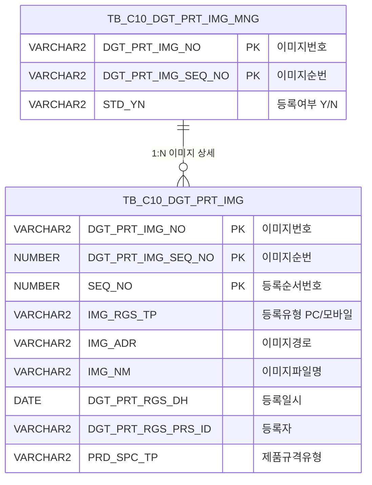

<h1 style="font-size: 40px; text-align: center; font-weight:
   bold; margin: 30px 0;">
  C106000140pop02 레거시 시스템 분석 종합 보고서
</h1>


# 1. 시스템 개요
- **서비스 ID**: C106000140pop02
- **업무명**: 디지털프린팅 이미지 등록 (팝업)
- **분석 일시**: 2026-03-17 (KST)
- **전체 Activity 수**: 2 (Built-in: 2, Custom: 0)
- **분석자**: Claude Opus 4.6 / Sonnet 4.6
- **분석 도구**: /analyze-service C106000140pop02
- **문서 버전**: 1.0

# 📊 비즈니스 프로세스 분석

## 시스템 목적

C106000140pop02는 CCL(Continuous Color Line) 공정에서 사용하는 **디지털프린팅 이미지 등록 팝업** 화면이다. 부모 화면(C106000140)에서 특정 CCLBOM 규격을 선택한 후 이 팝업을 열어 해당 규격에 대한 이미지 파일을 업로드·조회·삭제할 수 있다.

주요 용도는 디지털프린팅 작업 시 참조할 이미지(PC 또는 모바일에서 촬영/등록)를 관리하는 것이며, 이미지 등록 여부(STD_YN)는 상위 관리 테이블(TB_C10_DGT_PRT_IMG_MNG)에 자동 반영된다. PRD_SPC_TP = '6'(색상형상 BOM 규격) 유형의 이미지만 취급한다.

## 주요 유즈케이스

### UC-01: 등록 이미지 목록 조회
- **Actor**: CCL 공정 오퍼레이터
- **목적**: 특정 CCLBOM 규격에 등록된 디지털프린팅 이미지 목록을 확인

- **전제조건**:
  - 부모 화면(C106000140)에서 이미지 등록 팝업을 열어야 함
  - URL 파라미터로 DGT_PRT_IMG_NO, DGT_PRT_IMG_SEQ_NO가 전달됨
  - PRD_SPC_TP = '6' (색상형상 BOM 규격) 조건이 자동 적용됨

- **주요 흐름**:
  1. 팝업 진입 시 `onVaultLoad()` 호출 → dhtmlXVault 초기화 및 그리드 이벤트 등록
  2. `onLoadGrid()` 자동 실행 → DGT_PRT_IMG_NO, DGT_PRT_IMG_SEQ_NO 파라미터로 서비스 호출
  3. `C106000140pop02_Grid_1.select` 쿼리 실행 → TB_C10_DGT_PRT_IMG에서 이미지 목록 조회
  4. Grid에 프린팅번호, 순번, 구분(PC/모바일), 이미지명, 등록일자, 등록자 표시

- **대체 흐름**:
  - 등록된 이미지가 없는 경우: Grid에 빈 목록 표시

- **후행조건**:
  - 이미지 목록이 Grid에 표시됨
  - 이미지 링크 클릭, 삭제, 신규 업로드 가능 상태

### UC-02: 이미지 파일 업로드
- **Actor**: CCL 공정 오퍼레이터
- **목적**: 디지털프린팅 작업에 필요한 참조 이미지를 시스템에 등록

- **전제조건**:
  - 팝업이 정상 로딩되어 dhtmlXVault가 초기화됨
  - 업로드할 이미지 파일이 준비됨

- **주요 흐름**:
  1. Vault 영역에 파일 드래그 또는 파일 선택 (최대 1개 제한)
  2. `_uploadHandler5.jsp`로 파일 업로드 처리 (IMG_RGS_FLAG=04 파라미터 전달)
  3. 업로드 완료 시 `onUploadComplete` 이벤트 → `onLoadGrid()` 호출
  4. `C106000140pop02.insert` 쿼리 실행 → TB_C10_DGT_PRT_IMG에 INSERT (SEQ_NO는 기존 MAX+1 자동 채번)
  5. `C106000140pop02.update` 쿼리 실행 → TB_C10_DGT_PRT_IMG_MNG의 STD_YN을 'Y'로 갱신
  6. Grid 재조회하여 신규 이미지 반영

- **대체 흐름**:
  - 파일 1개 초과 선택 시: "이미지는 1장만 등록 가능합니다" 경고 후 업로드 차단
  - 업로드 실패 시: 오류 메시지 표시

- **후행조건**:
  - 이미지가 서버 파일시스템에 저장됨
  - TB_C10_DGT_PRT_IMG에 레코드 추가
  - 상위 관리 테이블의 등록 여부(STD_YN)가 'Y'로 갱신

### UC-03: 이미지 삭제
- **Actor**: CCL 공정 오퍼레이터
- **목적**: 잘못 등록된 이미지를 삭제

- **전제조건**:
  - Grid에 삭제 대상 이미지가 표시되어 있음

- **주요 흐름**:
  1. Grid의 "삭제" 컬럼 클릭 → `doImgDel(rowIdx)` 호출
  2. 삭제 확인 대화상자 표시
  3. 확인 시 `_fileDeleteHandler4.jsp` 호출 → 서버 파일 삭제 및 DB 레코드 삭제 (`C106000140pop02.delete`)
  4. `C106000140pop02.update` 쿼리 실행 → 이미지 잔존 여부에 따라 STD_YN을 'Y' 또는 'N'으로 갱신
  5. `onLoadGrid()` 호출 → Grid 재조회

- **대체 흐름**:
  - 삭제 취소 시: 아무 동작 없이 복귀

- **후행조건**:
  - 이미지 파일 및 DB 레코드 삭제됨
  - 이미지가 모두 삭제된 경우 STD_YN = 'N'으로 변경

### UC-04: 이미지 미리보기
- **Actor**: CCL 공정 오퍼레이터
- **목적**: 등록된 이미지를 부모 화면에서 확인

- **전제조건**:
  - Grid에 이미지 목록이 표시되어 있음

- **주요 흐름**:
  1. Grid의 "이미지" 컬럼(ahref_idx 타입) 링크 클릭
  2. `Grid_doLink(val, rowIdx)` 호출
  3. 숨김 컬럼에서 CHK_IMG_NM(파일명), CHK_IMG_ADR(경로) 추출
  4. `window.opener.parentViewImg(CHK_IMG_ADR, CHK_IMG_NM)` 호출 → 부모 화면에서 이미지 표시

- **대체 흐름**:
  - 부모 창이 닫힌 경우: JavaScript 오류 발생 가능

- **후행조건**:
  - 부모 화면에 선택한 이미지가 표시됨

---
## 비즈니스 로직 상세

### 1. 이미지 등록 유형 구분 (DECODE 변환)

- **목적**: 이미지 등록 경로(PC/모바일)를 코드에서 표시명으로 변환
- **처리 케이스**:

  **[케이스 1: 모바일 등록]**
  ```
    조건: IMG_RGS_TP = '2'
    처리: '모바일'로 표시
  ```

  **[케이스 2: PC 등록]**
  ```
    조건: IMG_RGS_TP ≠ '2' (기본값)
    처리: 'PC'로 표시
  ```

### 2. 이미지 경로 변환 (웹 접근용)

- **목적**: 서버 파일시스템의 절대 경로를 웹에서 접근 가능한 상대 경로로 변환
- **처리 케이스**:

  **[케이스 1: 경로 정규화]**
  ```
    조건: IMG_ADR에 'IMG_UPLOAD' 문자열 포함
    처리:
      1. INSTR로 'IMG_UPLOAD' 위치 탐색
      2. SUBSTR로 'IMG_UPLOAD' 이후 경로 추출
      3. REPLACE로 백슬래시(\)를 슬래시(/)로 변환
      4. './' 접두사 + '/' 접미사 추가
    결과: './IMG_UPLOAD/2026/03/filename.jpg/' 형태
  ```

### 3. 이미지 등록 여부 자동 갱신 (STD_YN)

- **목적**: 이미지 업로드/삭제 시 상위 관리 테이블의 등록 상태를 자동 동기화
- **처리 케이스**:

  **[케이스 1: 이미지 존재]**
  ```
    조건: TB_C10_DGT_PRT_IMG에서 해당 번호+순번+PRD_SPC_TP='6'의 COUNT > 0
    처리: TB_C10_DGT_PRT_IMG_MNG.STD_YN = 'Y'
  ```

  **[케이스 2: 이미지 없음]**
  ```
    조건: COUNT = 0
    처리: TB_C10_DGT_PRT_IMG_MNG.STD_YN = 'N'
  ```

### 4. 이미지 순번 자동 채번

- **목적**: 동일 이미지번호+순번 내에서 이미지 등록 순서를 자동 부여
- **계산 공식**:
  ```
  SEQ_NO = NVL(MAX(SEQ_NO), 0) + 1
  WHERE DGT_PRT_IMG_NO = :IMG_RGS_FLAG_ID
    AND DGT_PRT_IMG_SEQ_NO = :IMG_RGS_FLAG_ID2
  ```

---

# 💾 데이터 요구사항

## 핵심 테이블

### 1. TB_C10_DGT_PRT_IMG - (디지털프린팅 이미지 상세)
| 컬럼명 | 타입 | PK | 설명 |
|--------|------|----|------|
| DGT_PRT_IMG_NO | VARCHAR2 | ✅ | 디지털프린팅 이미지번호 |
| DGT_PRT_IMG_SEQ_NO | NUMBER | ✅ | 이미지 순번 |
| SEQ_NO | NUMBER | ✅ | 등록 순서번호 (자동 채번) |
| IMG_RGS_TP | VARCHAR2 | | 이미지 등록 유형 ('2'=모바일, 기타=PC) |
| IMG_ADR | VARCHAR2 | | 이미지 저장 경로 (서버 절대 경로) |
| IMG_NM | VARCHAR2 | | 이미지 파일명 |
| DGT_PRT_RGS_DH | DATE | | 등록 일시 |
| DGT_PRT_RGS_PRS_ID | VARCHAR2 | | 등록자 ID |
| PRD_SPC_TP | VARCHAR2 | | 제품 규격 유형 ('6'=색상형상 BOM 규격) |
| CREATED_OBJECT_TYPE | VARCHAR2 | | 생성 객체 유형 |
| CREATED_OBJECT_ID | VARCHAR2 | | 생성자 ID |
| CREATED_PROGRAM_ID | VARCHAR2 | | 생성 프로그램 ID |
| CREATION_TIMESTAMP | TIMESTAMP | | 생성 타임스탬프 |
| LAST_UPDATED_OBJECT_TYPE | VARCHAR2 | | 최종 수정 객체 유형 |
| LAST_UPDATED_OBJECT_ID | VARCHAR2 | | 최종 수정자 ID |
| LAST_UPDATE_PROGRAM_ID | VARCHAR2 | | 최종 수정 프로그램 ID |
| LAST_UPDATE_TIMESTAMP | TIMESTAMP | | 최종 수정 타임스탬프 |

### 2. TB_C10_DGT_PRT_IMG_MNG - (디지털프린팅 이미지 관리)
| 컬럼명 | 타입 | PK | 설명 |
|--------|------|----|------|
| DGT_PRT_IMG_NO | VARCHAR2 | ✅ | 디지털프린팅 이미지번호 |
| DGT_PRT_IMG_SEQ_NO | NUMBER | ✅ | 이미지 순번 |
| STD_YN | VARCHAR2 | | 이미지 등록 여부 ('Y'/'N') |
| LAST_UPDATED_OBJECT_TYPE | VARCHAR2 | | 최종 수정 객체 유형 |
| LAST_UPDATED_OBJECT_ID | VARCHAR2 | | 최종 수정자 ID |
| LAST_UPDATE_PROGRAM_ID | VARCHAR2 | | 최종 수정 프로그램 ID |
| LAST_UPDATE_TIMESTAMP | TIMESTAMP | | 최종 수정 타임스탬프 |

## 데이터 플로우

### 1. 조회
```
[이미지 목록 조회]
팝업 진입 (URL 파라미터: DGT_PRT_IMG_NO, DGT_PRT_IMG_SEQ_NO)
→ C106000140pop02_Grid_1.select
  FROM TB_C10_DGT_PRT_IMG
  WHERE DGT_PRT_IMG_NO = :DGT_PRT_IMG_NO
    AND DGT_PRT_IMG_SEQ_NO = :DGT_PRT_IMG_SEQ_NO
    AND PRD_SPC_TP = '6'
  ORDER BY DGT_PRT_IMG_NO, DGT_PRT_IMG_SEQ_NO, SEQ_NO
→ Grid에 이미지 목록 표시 (프린팅번호, 순번, 구분, 이미지명, 등록일자, 등록자)
```

### 2. 업로드
```
[이미지 파일 업로드]
파일 선택/드래그 (최대 1개)
→ _uploadHandler5.jsp 호출 (파일 서버 저장)
→ C106000140pop02.insert
  INTO TB_C10_DGT_PRT_IMG
  VALUES (이미지번호, 순번, MAX(SEQ_NO)+1, 등록유형, 파일경로, 파일명, SYSDATE, 사용자ID, ...)
→ C106000140pop02.update
  UPDATE TB_C10_DGT_PRT_IMG_MNG SET STD_YN = DECODE(이미지 COUNT, 0, 'N', 'Y')
  WHERE DGT_PRT_IMG_NO = :IMG_RGS_FLAG_ID AND DGT_PRT_IMG_SEQ_NO = :IMG_RGS_FLAG_ID2
→ Grid 재조회
```

### 3. 삭제
```
[이미지 삭제]
Grid 삭제 컬럼 클릭
→ _fileDeleteHandler4.jsp 호출 (서버 파일 삭제)
→ C106000140pop02.delete
  DELETE TB_C10_DGT_PRT_IMG
  WHERE DGT_PRT_IMG_NO = :IMG_RGS_FLAG_ID
    AND DGT_PRT_IMG_SEQ_NO = :IMG_RGS_FLAG_ID2
    AND SEQ_NO = :SEQ
→ C106000140pop02.update (STD_YN 자동 갱신)
→ Grid 재조회
```

## SQL 일람표
| SQL 이름 | 쿼리 ID | 타입 | 출처 | 테이블 |
|---------|---------|------|------|--------|
| 이미지 목록 조회 | C106000140pop02_Grid_1.select | SELECT | Service | TB_C10_DGT_PRT_IMG |
| 이미지 업로드 등록 | C106000140pop02.insert | INSERT | JSP Handler | TB_C10_DGT_PRT_IMG |
| 이미지 삭제 | C106000140pop02.delete | DELETE | JSP Handler | TB_C10_DGT_PRT_IMG |
| 이미지 등록여부 갱신 | C106000140pop02.update | UPDATE | JSP Handler | TB_C10_DGT_PRT_IMG_MNG |

## ER 다이어그램 (핵심 관계)



관계 설명:
- TB_C10_DGT_PRT_IMG_MNG이 관리 테이블로 이미지번호+순번 단위의 등록 상태(STD_YN) 관리
- TB_C10_DGT_PRT_IMG가 실제 이미지 상세 테이블로 1개 관리 레코드에 N개 이미지 등록 가능
- 이미지 업로드/삭제 시 COUNT 서브쿼리로 잔존 이미지 여부 판단 → STD_YN 자동 갱신

---

# 🖥️ 사용자 인터페이스 요구사항

## 화면 레이아웃 상세

### Layout 구조
이 화면은 팝업 창으로 initLayout을 사용하지 않고, 절대 위치(position:absolute)로 컴포넌트를 배치하는 비표준 레이아웃이다.

```javascript
// 팝업 화면 - 절대 위치 레이아웃 (initLayout 미사용)
{
  components: [
    {
      id: "vault1",
      type: "htmlObj (dhtmlXVault)",
      position: "div#vault1 (상단 영역, 약 250px 높이)"
    },
    {
      id: "C106000140pop02_Grid_1",
      type: "grid",
      position: "absolute; height:70px; width:430px; left:8px; top:260px"
    },
    {
      id: "C106000140pop02_MessageBox_1",
      type: "messagebox",
      position: "absolute; height:23px; width:445px; left:0px; top:332px"
    }
  ]
}
```

## 입출력 요소

### Vault 컴포넌트 (파일 업로드)
**vault1 (dhtmlXVault)**
- 파일 업로드 컴포넌트 (드래그앤드롭 지원)
- 최대 파일 수: 1개
- 서버 핸들러: `_uploadHandler5.jsp` (업로드), `_getInfoHandler.jsp` (정보조회), `_getIdHandler.jsp` (ID조회)
- 업로드 파라미터: IMG_RGS_FLAG=04, IMG_RGS_FLAG_ID=이미지번호, IMG_RGS_FLAG_ID2=이미지순번, IMG_RGS_TP=등록유형, PRD_SPC_TP=규격유형
- onUploadComplete → `onLoadGrid()` 호출하여 Grid 재조회

### Grid 컴포넌트
**C106000140pop02_Grid_1 (이미지 목록)**
- 편집 가능 여부: 아니오 (읽기 전용)
- Split: 없음
- colwidth: % (비율 기반)
- multiselect: true
- 주요 컬럼 (11개):

  **기본 정보**:
  - DGT_PRT_IMG_NO: ro - 프린팅번호 (19%, 중앙정렬)
  - SEQ_NO: ro - 순번 (8%, 중앙정렬)
  - IMG_RGS_TP: ro - 구분 (11%, 중앙정렬) - DECODE로 'PC'/'모바일' 표시

  **이미지 정보**:
  - IMG_NM: ahref_idx - 이미지 (나머지%, 좌측정렬, 클릭 시 부모 창 `parentViewImg` 호출)

  **등록 정보**:
  - DGT_PRT_RGS_DH: ro - 등록일자 (20%, 중앙정렬) - YYYY-MM-DD 형식
  - DGT_PRT_RGS_PRS_ID: ro - 등록자 (16%, 중앙정렬)

  **삭제**:
  - DEL_IMG: ro - 삭제 (8%, 중앙정렬) - 클릭 시 `doImgDel` 호출

  **숨김 컬럼**:
  - DGT_PRT_IMG_SEQ_NO: ro - 이미지순번 (숨김)
  - IMG_ADR: ro - 이미지경로 (숨김)
  - CHK_IMG_NM: ro - 파일명(이미지 링크용) (숨김)
  - CHK_IMG_ADR: ro - 변환경로(이미지 링크용) (숨김)

### MessageBox 컴포넌트
**C106000140pop02_MessageBox_1**
- 하단 상태바 영역 (23px 높이)
- appMsg 메시지 출력용

## 화면 동작 흐름

### 1. 화면 초기 로딩
```
1. 부모 화면에서 팝업 오픈 (URL 파라미터 전달)
   - DGT_PRT_IMG_NO, DGT_PRT_IMG_SEQ_NO, rowId, parent_item, IMG_RGS_TP, PRD_SPC_TP
2. body.onload → onVaultLoad() 실행
3. dhtmlXVault 인스턴스 생성
   - setImagePath, setURL(_uploadHandler5.jsp), setInfoURL, setIdURL 설정
   - 업로드 파라미터 설정 (IMG_RGS_FLAG, IMG_RGS_FLAG_ID 등)
4. vault.onFileAdd 이벤트: 파일 1개 초과 시 경고 → 업로드 차단
5. vault.onUploadComplete 이벤트: onLoadGrid() 연결
6. Grid 이벤트 등록 (doLink, doImgDel 등)
7. onLoadGrid() 자동 호출 → 기존 이미지 목록 표시
```

### 2. 이미지 업로드
```
1. Vault 영역에 파일 드래그 또는 파일 선택
2. 파일 수 검증 (1개 초과 시 차단)
3. Vault가 _uploadHandler5.jsp로 파일 전송
   - IMG_RGS_FLAG=04, IMG_RGS_FLAG_ID=이미지번호, IMG_RGS_FLAG_ID2=순번 등
4. 서버에서 파일 저장 + DB INSERT + STD_YN UPDATE 수행
5. onUploadComplete 이벤트 발생
6. onLoadGrid() 호출 → Grid 재조회
7. MessageBox에 처리 결과 표시
```

### 3. 이미지 삭제
```
1. Grid의 DEL_IMG 컬럼 클릭 → doImgDel(rowIdx) 호출
2. 삭제 확인 다이얼로그 표시
3. 확인 시 _fileDeleteHandler4.jsp 호출 (AJAX)
   - 서버 파일 삭제 + DB DELETE + STD_YN UPDATE 수행
4. onLoadGrid() 호출 → Grid 재조회
5. MessageBox에 처리 결과 표시
```

### 4. 이미지 미리보기
```
1. Grid의 IMG_NM 컬럼(ahref_idx) 링크 클릭
2. Grid_doLink(val, rowIdx) 호출
3. 숨김 컬럼에서 CHK_IMG_NM, CHK_IMG_ADR 추출
4. window.opener.parentViewImg(CHK_IMG_ADR, CHK_IMG_NM) 호출
5. 부모 화면에서 이미지 표시
```

## JavaScript 모듈

**C106000140pop02.jsp** (인라인 스크립트)
- onVaultLoad(): dhtmlXVault 초기화 및 이벤트 등록, 업로드 파라미터 설정
- onLoadGrid(): Grid 재조회 (DGT_PRT_IMG_NO, DGT_PRT_IMG_SEQ_NO 파라미터로 gridC10Data.do 호출)
- Grid_doLink(val, rowIdx): 이미지 링크 클릭 → window.opener.parentViewImg 호출
- doImgDel(rowIdx): 이미지 삭제 → _fileDeleteHandler4.jsp AJAX 호출 후 Grid 재조회
- find(eventName, formDivObj, referenceItem): 폼 조회 이벤트
- save(eventName, formDivObj, referenceItem): 그리드 저장 이벤트
- add(referenceItem): 그리드 행 추가
- remove(referenceItem): 그리드 행 삭제
- copy(referenceItem): 그리드 행 클립보드 복사
- undo(referenceItem): 그리드 실행 취소
- redo(referenceItem): 그리드 다시 실행
- onGridContextMenuClick(id, gridObj, menuObj): 컨텍스트 메뉴 처리 (컬럼 이동, 헤더 필터, 편집 가능, 엑셀 내보내기)
- findMessage(referenceItem): MessageBox에 appMsg 출력

## 주요 이벤트 핸들러

**body.onload → onVaultLoad()**
- 이벤트 타입: Page Load
- 처리 내용:
  1. dhtmlXVault 인스턴스 생성 (div#vault1)
  2. 이미지 경로, 업로드 URL, 정보 URL, ID URL 설정
  3. 업로드 파라미터 설정 (IMG_RGS_FLAG=04, 이미지번호, 순번, 등록유형, 규격유형)
  4. onFileAdd 이벤트: 파일 수 1개 초과 시 차단
  5. onUploadComplete 이벤트: onLoadGrid() 연결
  6. Grid 이벤트 바인딩 (doLink, doImgDel)
  7. onLoadGrid() 최초 호출

**Grid_doLink (이미지 링크 클릭)**
- 이벤트 타입: Grid Cell Click (ahref_idx)
- 처리 내용:
  1. Grid에서 클릭된 행의 CHK_IMG_NM(파일명), CHK_IMG_ADR(경로) 추출
  2. window.opener.parentViewImg(경로, 파일명) 호출
  3. 부모 화면에서 이미지 렌더링

**doImgDel (이미지 삭제)**
- 이벤트 타입: Grid Cell Click (삭제 컬럼)
- 처리 내용:
  1. 선택된 행의 이미지 정보 추출
  2. 삭제 확인 다이얼로그 표시
  3. _fileDeleteHandler4.jsp AJAX 호출 (파일 삭제 + DB 처리)
  4. 완료 후 onLoadGrid() 호출하여 Grid 갱신

---

# 📌 특이사항 및 주의사항

## 1. 비표준 레이아웃 구조
- 이 화면은 GLUE Framework의 표준 initLayout 패턴을 사용하지 않고, **절대 위치(position:absolute)**로 컴포넌트를 직접 배치한다. 팝업 특성상 고정 크기(약 450×355px)로 설계되어 있으며, 화면 크기 변경 시 레이아웃이 깨질 수 있다.

## 2. 서비스 외부 데이터 처리 (JSP Handler 직접 호출)
- INSERT/DELETE/UPDATE 쿼리가 Service XML에 정의되어 있지 않고, **JSP 핸들러(_uploadHandler5.jsp, _fileDeleteHandler4.jsp)**에서 직접 처리한다. 이는 dhtmlXVault 컴포넌트의 파일 업로드 특성 때문이며, GLUE Framework의 Service-Activity 패턴을 우회하는 구조이다. 트랜잭션 관리가 JSP 레벨에서 이루어지므로 일관성 주의 필요.

## 3. PRD_SPC_TP 하드코딩
- SELECT 쿼리에서 `PRD_SPC_TP = '6'` 조건이 하드코딩되어 있다. 이는 색상형상 BOM 규격 유형만 취급한다는 의미이나, URL 파라미터로 PRD_SPC_TP를 별도 전달받고 있어 INSERT 시에는 파라미터값을 사용한다. 조회와 등록의 규격유형 불일치 가능성이 있다.

## 4. 파일 1개 제한 로직
- dhtmlXVault의 onFileAdd 이벤트에서 파일 수를 체크하여 1개 초과 시 업로드를 차단한다. 그러나 이 제한은 **한 번의 업로드 세션**에 대한 것이며, 기존에 등록된 이미지가 있어도 추가 업로드가 가능하다 (Grid에 여러 행이 표시될 수 있음).

## 5. 부모-자식 창 의존성
- `Grid_doLink`에서 `window.opener.parentViewImg()`를 호출하여 부모 창의 함수에 의존한다. 부모 창이 닫히거나 리로드된 경우 JavaScript 오류가 발생할 수 있으며, 이에 대한 예외 처리가 없다.

## 6. 이미지 경로 변환의 플랫폼 의존성
- SQL에서 `REPLACE(SUBSTR(IMG_ADR, INSTR(IMG_ADR, 'IMG_UPLOAD')), '\', '/')`로 Windows 경로를 웹 경로로 변환한다. 서버 OS가 Windows임을 전제로 한 처리이며, Linux 서버에서는 백슬래시 치환이 불필요하나 오동작하지는 않는다.

---

# 📚 참고 문서

- **Query SQL**: `src/query/C106000140pop02-query.glue_sql`
- **Service XML**: `src/service/C106000140pop02-service.xml`
- **JSP**: `WebContents/C106000140pop02.jsp`
- **Grid XML**: `WebContents/header/kr/C106000140pop02/C106000140pop02_Grid_1.xml`
- **MessageBox XML**: `WebContents/header/kr/C106000140pop02/C106000140pop02_MessageBox_1.xml`
