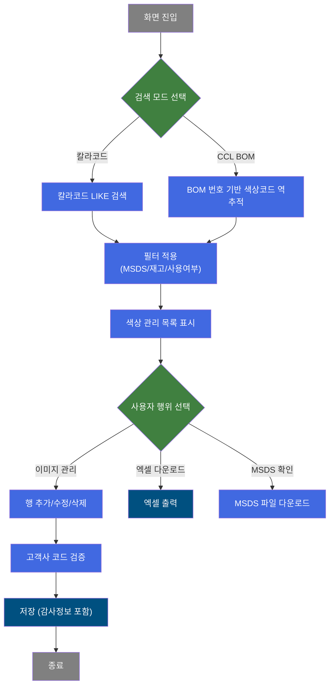
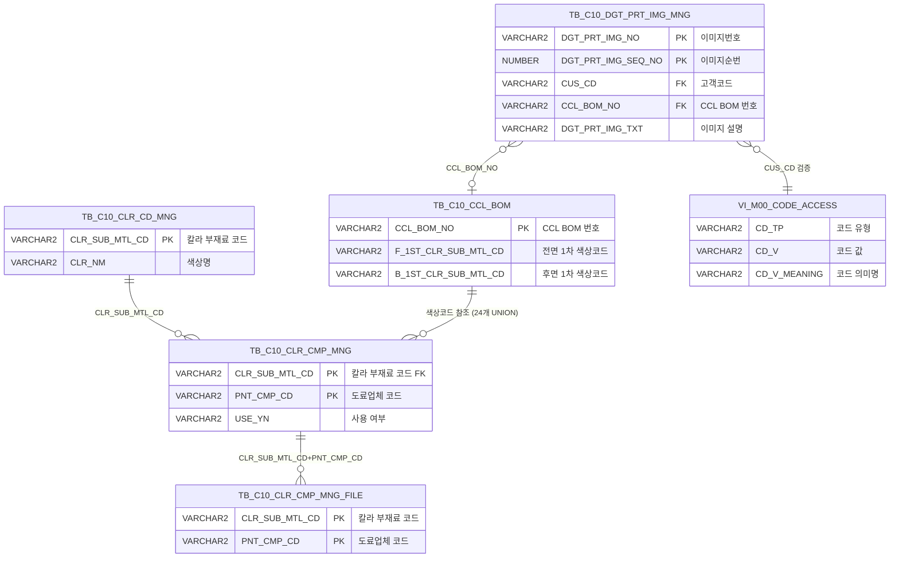

<h1 style="font-size: 40px; text-align: center; font-weight:
   bold; margin: 30px 0;">
  C106000150 레거시 시스템 분석 종합 보고서
</h1>


# 1. 시스템 개요
- **서비스 ID**: C106000150
- **업무명**: 디지털이미지관리 (칼라코드/CCL BOM 기반 색상 관리)
- **분석 일시**: 2026-03-17 12:02 (KST)
- **분석 시간**: ~5분
- **전체 Activity 수**: 6개 (Built-in 6개, Custom 0개)
- **분석자**: Claude Opus 4.6 + Sonnet (Phase 4 UI)
- **분석 도구**: /analyze-service C106000150
- **문서 버전**: 1.0

# 📊 비즈니스 프로세스 분석

## 시스템 목적

C106000150은 CCL(Color Coated Line) 공정에서 사용하는 칼라 부재료 코드와 디지털 프린팅 이미지를 관리하는 화면이다. 도료업체별 색상 코드의 사용 여부, MSDS(물질안전보건자료) 보유 현황, 현재고 수량을 통합적으로 조회할 수 있으며, CCL BOM 번호 기준으로 해당 BOM에 포함된 전면/후면 각 코팅 층별 색상 코드를 역추적하여 조회하는 기능을 제공한다.

본 서비스는 두 가지 검색 모드(칼라코드 직접 검색 / CCL BOM 코드 검색)를 지원하며, 검색 결과에 대해 MSDS 보유 여부, 재고 보유 여부, 미사용 제외 등의 필터를 적용할 수 있다. 또한 디지털 프린팅 이미지 관리 정보(이미지번호, 고객사, CCL BOM NO, 이미지 설명)의 신규 등록/수정/삭제를 지원하며, 고객사 코드는 마스터 코드 검증을 거쳐 데이터 무결성을 확보한다. 저장 시 감사(Audit) 정보가 자동 기록된다.

## 핵심 워크플로우 다이어그램



### 상세 워크플로우 다이어그램


## 주요 유즈케이스

### UC-01: 칼라코드 기준 색상 관리 정보 조회
- **Actor**: CCL 공정 관리자 / 품질 담당자
- **목적**: 칼라 부재료 코드를 직접 검색하여 색상명, 도료업체, MSDS 보유 여부, 현재고를 확인

- **전제조건**:
  - 사용자가 시스템에 로그인되어 있음
  - TB_C10_CLR_CD_MNG, TB_C10_CLR_CMP_MNG에 데이터가 등록되어 있음
  - 검색 모드가 "칼라코드"(SEARCH_CD_SEL=1)로 선택됨

- **주요 흐름**:
  1. 사용자가 "칼라코드" 라디오 버튼 선택 (SEARCH_CD_SEL=1)
  2. FIND_CD 입력란에 칼라 부재료 코드 입력 (LIKE 검색, 최대 18자리)
  3. 필터 체크박스 설정 (MSDS보유, 재고보유, 미사용제외)
  4. 조회 버튼 클릭 → C106000150.CLRselect 실행
  5. TB_C10_CLR_CD_MNG와 TB_C10_CLR_CMP_MNG 조인 조회
  6. 스칼라 서브쿼리로 도료업체명(VI_M00_CODE_ACCESS), MSDS 파일 유무(TB_C10_CLR_CMP_MNG_FILE), 현재고(VI_M30_SMTL_MASTER) 조회
  7. Grid에 결과 표시

- **대체 흐름**:
  - FIND_CD 미입력 시: 전체 목록 조회 (LIKE 조건 NULL → 전체)
  - 조회 결과 없음: 빈 Grid 표시

- **후행조건**:
  - Grid에 색상 관리 목록이 표시됨
  - MSDS 컬럼의 링크를 통해 파일 다운로드 가능

### UC-02: CCL BOM 기준 색상코드 역추적 조회
- **Actor**: CCL 공정 관리자
- **목적**: CCL BOM 번호를 입력하여 해당 BOM에 사용된 모든 색상 부재료 코드를 역추적 조회

- **전제조건**:
  - "CCLBOM코드" 라디오 버튼이 선택됨 (SEARCH_CD_SEL=2, 기본값)
  - TB_C10_CCL_BOM에 BOM 데이터가 존재함

- **주요 흐름**:
  1. 사용자가 "CCLBOM코드" 라디오 버튼 선택 (기본 선택됨)
  2. FIND_CD 입력란에 CCL BOM 번호 입력
  3. 조회 버튼 클릭 → C106000150.BOMselect 실행
  4. TB_C10_CCL_BOM에서 BOM 번호 조건으로 24개 UNION 서브쿼리 실행 (전면/후면 1~4차 코팅, 시너, 프린트 잉크, 화학약품 코드)
  5. UNION 결과의 CLR_SUB_MTL_CD 목록으로 TB_C10_CLR_CMP_MNG IN 조건 필터링
  6. 필터 조건(MSDS/재고/사용여부) 적용 후 Grid 표시

- **대체 흐름**:
  - BOM 번호에 해당하는 색상코드가 없는 경우: 빈 Grid 표시
  - FIND_CD 미입력 시: 전체 BOM의 색상코드 조회 (성능 주의)

- **후행조건**:
  - 해당 BOM에 포함된 모든 색상 부재료 코드가 Grid에 표시됨

### UC-03: 디지털 프린팅 이미지 관리 정보 등록/수정/삭제
- **Actor**: CCL 공정 관리자
- **목적**: 디지털 프린팅 이미지 관리 정보(이미지번호, 고객사, CCL BOM NO, 설명)를 등록/수정/삭제

- **전제조건**:
  - 저장 권한이 있음 (security=true)
  - 등록 시 고객사 코드가 마스터 코드(VI_M00_CODE_ACCESS)에 존재해야 함

- **주요 흐름**:
  1. 메뉴의 "행추가" 클릭 → 새 행 추가, 등록일자(DGT_PRT_IMG_DH) 자동 입력
  2. 고객사 컬럼(cInd==2) 클릭 → 고객사 선택 팝업 호출 (masterGridData.do, CD_TP=CUS_CD)
  3. CCL BOM NO 컬럼(cInd==3) 입력 → 5자리 이상 입력 시 AJAX 유효성 검증
  4. 이미지 설명 입력
  5. 저장 확인 팝업 → 확인 클릭
  6. GridSave Activity 실행: C106000140.insert/update/delete (mesdao)
  7. INSERT 시: VI_M00_CODE_ACCESS로 고객코드 검증 후 TB_C10_DGT_PRT_IMG_MNG에 등록
  8. 감사정보(isAudit=true) 자동 기록

- **대체 흐름**:
  - 고객사 미입력 시: "고객사를 입력하세요" 알림 → 저장 중단
  - 고객코드가 마스터에 없는 경우: INSERT/UPDATE 실패 (서브쿼리 결과 0건)
  - 삭제 시: PK(DGT_PRT_IMG_NO, DGT_PRT_IMG_SEQ_NO) 기준 삭제

- **후행조건**:
  - TB_C10_DGT_PRT_IMG_MNG에 데이터가 반영됨
  - 감사 정보(등록자, 수정자, 일시) 기록됨

### UC-04: MSDS 파일 다운로드
- **Actor**: CCL 공정 관리자 / 안전 담당자
- **목적**: 칼라 부재료의 MSDS(물질안전보건자료) 파일을 다운로드하여 확인

- **전제조건**:
  - 해당 색상코드의 MSDS 파일이 등록되어 있음 (DOC_YN='1')

- **주요 흐름**:
  1. Grid의 MSDS 컬럼에서 링크 클릭 (doImgPopUp2)
  2. C106000050pop03.jsp 팝업 열기 (465x405)
  3. CLR_SUB_MTL_CD, PNT_CMP_CD, SEQ=1 파라미터 전달
  4. MSDS 파일 다운로드

- **대체 흐름**:
  - MSDS 파일 미등록 시: DOC_YN='0'으로 표시, 다운로드 링크 미제공

- **후행조건**:
  - MSDS 파일이 로컬에 다운로드됨

### UC-05: 엑셀 다운로드
- **Actor**: CCL 공정 관리자
- **목적**: 문서 미보유 + 사용 중 + 재고 있는 칼라코드 목록을 엑셀로 다운로드

- **전제조건**:
  - 조회 데이터가 존재함

- **주요 흐름**:
  1. 엑셀 버튼 클릭 → excelExport 이벤트 발생
  2. excelExportC106000150.do URL 생성
  3. C106000150.ExcelDown 쿼리 실행 (고정 조건: DOC_YN='0', USE_YN='Y', CUR_QTY>0)
  4. 새 창으로 엑셀 파일 다운로드

- **대체 흐름**:
  - 해당 조건의 데이터 없음: 빈 엑셀 파일 생성

- **후행조건**:
  - 엑셀 파일이 다운로드됨

---
## 비즈니스 로직 상세

### 1. 검색 모드별 조회 분기 로직

- **목적**: 사용자의 검색 모드 선택(칼라코드/CCL BOM코드)에 따라 서로 다른 쿼리를 실행하여 색상 관리 정보를 조회
- **처리 케이스**:

  **[케이스 1: 칼라코드 직접 검색 (SEARCH_CD_SEL=1)]**
  ```
    조건: SEARCH_CD_SEL = '1' (칼라코드 라디오 선택)
    처리:
      1. PosDefaultRouter → PosValueRouter에서 SEARCH_CD_SEL 값 기반 분기
      2. C106000150.CLRselect 실행
      3. FIND_CD 값을 CLR_SUB_MTL_CD에 LIKE 검색
      4. 인라인 뷰에서 전체 조인 결과 구성 후 외부 WHERE로 필터링
  ```

  **[케이스 2: CCL BOM 코드 검색 (SEARCH_CD_SEL=2)]**
  ```
    조건: SEARCH_CD_SEL = '2' (CCLBOM코드 라디오 선택, 기본값)
    처리:
      1. PosDefaultRouter → PosValueRouter에서 SEARCH_CD_SEL 값 기반 분기
      2. C106000150.BOMselect 실행
      3. TB_C10_CCL_BOM에서 FIND_CD 값으로 BOM 번호 LIKE 검색
      4. 24개 UNION으로 전면/후면 각 층별 색상코드 통합
      5. 통합된 CLR_SUB_MTL_CD IN 조건으로 색상 관리 정보 조회
  ```

### 2. CCL BOM 24개 UNION 색상코드 역추적

- **목적**: CCL BOM에 등록된 모든 유형의 색상 관련 부재료 코드를 하나의 목록으로 통합
- **처리 케이스**:

  **[전면/후면 코팅 색상코드 추출]**
  ```
    조건: TB_C10_CCL_BOM.CCL_BOM_NO LIKE :FIND_CD
    처리:
      1. 전면(FRONT) 1~4차 코팅 색상코드 (F_1ST_CLR_SUB_MTL_CD ~ F_4TH_CLR_SUB_MTL_CD)
      2. 후면(BACK) 1~4차 코팅 색상코드 (B_1ST_CLR_SUB_MTL_CD ~ B_4TH_CLR_SUB_MTL_CD)
      3. 전면/후면 시너 코드 (F_THINNER_CD, B_THINNER_CD)
      4. 전면/후면 프린트 잉크 코드
      5. 전면/후면 화학약품 코드
      6. 총 24개 UNION으로 중복 제거 후 IN 조건에 사용
  ```

### 3. 스칼라 서브쿼리 기반 부가정보 조회

- **목적**: 메인 조인 결과에 도료업체명, MSDS 보유 여부, 현재고 수량을 스칼라 서브쿼리로 부가
- **처리 케이스**:

  **[케이스 1: 도료업체명 변환]**
  ```
    조건: PNT_CMP_CD 값 존재
    처리:
      1. M00APUSER.VI_M00_CODE_ACCESS에서 CD_TP='PNT_CMP_CD' 조건 조회
      2. CD_V_MEANING을 PNT_CMP_NM으로 반환
  ```

  **[케이스 2: MSDS 파일 존재 여부]**
  ```
    조건: CLR_SUB_MTL_CD + PNT_CMP_CD 조합
    처리:
      1. C10APUSER.TB_C10_CLR_CMP_MNG_FILE에서 파일 건수 조회
      2. COUNT(1) > 0 이면 '1'(있음), 아니면 '0'(없음)
      3. 엑셀다운 쿼리에서는 DECODE(DOC_YN,'1','Y','N')으로 변환
  ```

  **[케이스 3: 현재고 수량]**
  ```
    조건: CLR_SUB_MTL_CD 기준
    처리:
      1. MESAPUSER.VI_M30_SMTL_MASTER에서 해당 부재료 코드의 현재고 합산
      2. NVL(SUM(CUR_QTY), 0)으로 NULL 방지
  ```

### 4. USE_YN 코드 이중 변환 패턴

- **목적**: DB의 Y/N 값을 화면 표시용 1/0으로 변환 후, 다시 표시용 Y/N으로 재변환
- **처리 케이스**:

  **[CLRselect/BOMselect 쿼리]**
  ```
    처리:
      1. 인라인 뷰 내부: DECODE(B.USE_YN, 'Y', '1', 'N', '0') → 숫자형으로 변환
      2. 외부 WHERE: USE_YN 파라미터와 비교 (체크박스 값 '1' 기준)
      3. 최종 출력: DECODE(USE_YN, '1', 'Y', 'N') → 다시 문자형으로 변환
    의미: 체크박스 필터링을 위해 중간 단계에서 숫자형으로 변환하는 패턴
  ```

### 5. 고객코드 마스터 검증 (INSERT/UPDATE)

- **목적**: 디지털 프린팅 이미지 등록/수정 시 고객코드의 유효성을 DB 레벨에서 검증
- **처리 케이스**:

  **[INSERT/UPDATE 시 서브쿼리 검증]**
  ```
    조건: CUS_CD 파라미터 존재
    처리:
      1. VI_M00_CODE_ACCESS에서 CD_TP='CUS_CD', CATEGORY_GROUP_NM='SZ0000' 조건 확인
      2. SUBSTR(:CUS_CD, 1, 6)으로 6자리 코드 추출하여 CD_V와 비교
      3. 서브쿼리 결과가 1건 이상이면 INSERT/UPDATE 실행
      4. 서브쿼리 결과 0건이면 DML 실패 (행 미반영)
  ```

---

# 💾 데이터 요구사항

## 핵심 테이블

### 1. TB_C10_CLR_CD_MNG - (칼라 코드 마스터)
| 컬럼명 | 타입 | PK | 설명 |
|--------|------|----|-----|
| CLR_SUB_MTL_CD | VARCHAR2 | ✅ | 칼라 부재료 코드 |
| CLR_NM | VARCHAR2 | | 색상명 |

### 2. TB_C10_CLR_CMP_MNG - (칼라 코드-업체 매핑)
| 컬럼명 | 타입 | PK | 설명 |
|--------|------|----|-----|
| CLR_SUB_MTL_CD | VARCHAR2 | ✅ | 칼라 부재료 코드 (FK→TB_C10_CLR_CD_MNG) |
| PNT_CMP_CD | VARCHAR2 | ✅ | 도료업체 코드 |
| USE_YN | VARCHAR2 | | 사용 여부 (Y/N) |

### 3. TB_C10_CCL_BOM - (CCL BOM 마스터)
| 컬럼명 | 타입 | PK | 설명 |
|--------|------|----|-----|
| CCL_BOM_NO | VARCHAR2 | ✅ | CCL BOM 번호 |
| F_1ST_CLR_SUB_MTL_CD | VARCHAR2 | | 전면 1차 코팅 색상코드 |
| F_2ND_CLR_SUB_MTL_CD | VARCHAR2 | | 전면 2차 코팅 색상코드 |
| F_3RD_CLR_SUB_MTL_CD | VARCHAR2 | | 전면 3차 코팅 색상코드 |
| F_4TH_CLR_SUB_MTL_CD | VARCHAR2 | | 전면 4차 코팅 색상코드 |
| B_1ST_CLR_SUB_MTL_CD | VARCHAR2 | | 후면 1차 코팅 색상코드 |
| B_2ND_CLR_SUB_MTL_CD | VARCHAR2 | | 후면 2차 코팅 색상코드 |
| B_3RD_CLR_SUB_MTL_CD | VARCHAR2 | | 후면 3차 코팅 색상코드 |
| B_4TH_CLR_SUB_MTL_CD | VARCHAR2 | | 후면 4차 코팅 색상코드 |

### 4. TB_C10_DGT_PRT_IMG_MNG - (디지털 프린팅 이미지 관리)
| 컬럼명 | 타입 | PK | 설명 |
|--------|------|----|-----|
| DGT_PRT_IMG_NO | VARCHAR2 | ✅ | 디지털프린팅 이미지번호 |
| DGT_PRT_IMG_SEQ_NO | NUMBER | ✅ | 이미지 순번 (INSERT 시 1 고정) |
| DGT_PRT_IMG_TXT | VARCHAR2 | | 이미지 설명 |
| CUS_CD | VARCHAR2 | | 고객코드 (FK→VI_M00_CODE_ACCESS) |
| CCL_BOM_NO | VARCHAR2 | | CCL BOM 번호 (FK→TB_C10_CCL_BOM) |
| DFILE_YN | VARCHAR2 | | 파일 존재 여부 (기본값 'N') |
| STD_YN | VARCHAR2 | | 표준 여부 (기본값 'N') |
| DGT_PRT_IMG_DH | DATE | | 등록 일시 (SYSDATE) |
| DGT_PRT_IMG_PRS_ID | VARCHAR2 | | 등록자 ID |
| DGT_PRT_IMG_MDF_DH | DATE | | 수정 일시 (SYSDATE) |
| DGT_PRT_IMG_MDF_PRS_ID | VARCHAR2 | | 수정자 ID |

### 5. TB_C10_CLR_CMP_MNG_FILE - (MSDS 파일 관리, C10APUSER 스키마)
| 컬럼명 | 타입 | PK | 설명 |
|--------|------|----|-----|
| CLR_SUB_MTL_CD | VARCHAR2 | ✅ | 칼라 부재료 코드 |
| PNT_CMP_CD | VARCHAR2 | ✅ | 도료업체 코드 |

### 6. VI_M30_SMTL_MASTER - (부재료 재고 마스터 뷰, MESAPUSER 스키마)
| 컬럼명 | 타입 | PK | 설명 |
|--------|------|----|-----|
| CLR_SUB_MTL_CD | VARCHAR2 | | 부재료 코드 |
| CUR_QTY | NUMBER | | 현재고 수량 |

### 7. VI_M00_CODE_ACCESS - (공통 코드 뷰, M00APUSER 스키마)
| 컬럼명 | 타입 | PK | 설명 |
|--------|------|----|-----|
| CD_TP | VARCHAR2 | | 코드 유형 (PNT_CMP_CD, CUS_CD 등) |
| CD_V | VARCHAR2 | | 코드 값 |
| CD_V_MEANING | VARCHAR2 | | 코드 의미명 |
| CATEGORY_GROUP_NM | VARCHAR2 | | 카테고리 그룹명 |

## 데이터 플로우

### 1. 칼라코드 조회 (CLRselect)
```
칼라코드 검색 모드 선택 (SEARCH_CD_SEL=1)
→ C106000150.CLRselect
  FROM TB_C10_CLR_CD_MNG A
  INNER JOIN TB_C10_CLR_CMP_MNG B ON A.CLR_SUB_MTL_CD = B.CLR_SUB_MTL_CD
  스칼라 서브쿼리:
    - PNT_CMP_NM: M00APUSER.VI_M00_CODE_ACCESS (CD_TP='PNT_CMP_CD')
    - DOC_YN: C10APUSER.TB_C10_CLR_CMP_MNG_FILE (COUNT > 0 → '1')
    - CUR_QTY: MESAPUSER.VI_M30_SMTL_MASTER (SUM(CUR_QTY))
  WHERE A.CLR_SUB_MTL_CD LIKE '%' || :FIND_CD || '%'
    AND 외부 필터: DOC_YN, USE_YN, CUR_TP
→ Grid에 색상 관리 목록 표시
```

### 2. CCL BOM 조회 (BOMselect)
```
CCL BOM 검색 모드 선택 (SEARCH_CD_SEL=2)
→ C106000150.BOMselect
  FROM TB_C10_CLR_CD_MNG A
  INNER JOIN TB_C10_CLR_CMP_MNG B ON A.CLR_SUB_MTL_CD = B.CLR_SUB_MTL_CD
  WHERE B.CLR_SUB_MTL_CD IN (
    24개 UNION: TB_C10_CCL_BOM의 전면/후면 각 층별 색상코드
    WHERE CCL_BOM_NO LIKE '%' || :FIND_CD || '%'
  )
  + 동일한 스칼라 서브쿼리 (PNT_CMP_NM, DOC_YN, CUR_QTY)
  + 동일한 외부 필터 (DOC_YN, USE_YN, CUR_TP)
→ Grid에 BOM 관련 색상 관리 목록 표시
```

### 3. 엑셀 다운로드 (ExcelDown)
```
엑셀 버튼 클릭
→ C106000150.ExcelDown
  FROM TB_C10_CLR_CD_MNG A
  INNER JOIN TB_C10_CLR_CMP_MNG B ON A.CLR_SUB_MTL_CD = B.CLR_SUB_MTL_CD
  고정 필터: DOC_YN='0' AND USE_YN='Y' AND CUR_QTY > 0
→ 엑셀 파일 생성 및 다운로드
```

### 4. 이미지 관리 정보 저장 (GridSave → C106000140)
```
행 추가/수정/삭제 후 저장 클릭
→ INSERT: C106000140.insert
  INTO TB_C10_DGT_PRT_IMG_MNG
  서브쿼리 검증: VI_M00_CODE_ACCESS (CUS_CD 유효성)
  DFILE_YN='N', STD_YN='N' 기본값, DGT_PRT_IMG_SEQ_NO=1 고정
→ UPDATE: C106000140.update
  SET CCL_BOM_NO, CUS_CD, DGT_PRT_IMG_TXT
  NVL 패턴: 값 미입력 시 기존값 유지
  WHERE DGT_PRT_IMG_NO = :DGT_PRT_IMG_NO
→ DELETE: C106000140.delete
  FROM TB_C10_DGT_PRT_IMG_MNG
  WHERE DGT_PRT_IMG_NO = :DGT_PRT_IMG_NO AND DGT_PRT_IMG_SEQ_NO = :DGT_PRT_IMG_SEQ_NO
→ 감사정보 자동 기록 (isAudit=true)
```

## SQL 일람표

| SQL 이름 | 쿼리 ID | 타입 | 출처 | 테이블 |
|---------|---------|-----|------|-------|
| 칼라코드 검색 | C106000150.CLRselect | SELECT | Service | TB_C10_CLR_CD_MNG, TB_C10_CLR_CMP_MNG |
| CCL BOM 검색 | C106000150.BOMselect | SELECT | Service | TB_C10_CLR_CD_MNG, TB_C10_CLR_CMP_MNG, TB_C10_CCL_BOM |
| 엑셀 다운로드 | C106000150.ExcelDown | SELECT | Service | TB_C10_CLR_CD_MNG, TB_C10_CLR_CMP_MNG |
| 이미지 등록 | C106000140.insert | INSERT | Service | TB_C10_DGT_PRT_IMG_MNG |
| 이미지 수정 | C106000140.update | UPDATE | Service | TB_C10_DGT_PRT_IMG_MNG |
| 이미지 삭제 | C106000140.delete | DELETE | Service | TB_C10_DGT_PRT_IMG_MNG |

## ER 다이어그램 (핵심 관계)



관계 설명:
- TB_C10_CLR_CD_MNG가 색상코드의 마스터 테이블로 TB_C10_CLR_CMP_MNG과 1:N 관계 (업체별 매핑)
- TB_C10_CCL_BOM은 24개 색상 관련 컬럼을 통해 TB_C10_CLR_CMP_MNG과 다대다 관계 (UNION 서브쿼리)
- TB_C10_DGT_PRT_IMG_MNG은 VI_M00_CODE_ACCESS로 고객코드 검증, TB_C10_CCL_BOM과 선택적 관계

---

# 🖥️ 사용자 인터페이스 요구사항

## 화면 레이아웃 상세

### Layout 구조 (initLayout)
```javascript
{
  itemType: "layout",
  dirType: "row",  // 수직 배치 (위→아래)
  childSize: "28,25,511,19",
  components: [
    {
      id: "C106000150_Form_1",
      height: "28px",
      component: {
        itemType: "form",
        formId: "C106000150_Form_1"
      }
    },
    {
      id: "C106000150_Menu_1",
      height: "25px",
      component: {
        itemType: "menu",
        menuId: "C106000150_Menu_1"
      }
    },
    {
      id: "C106000150_Grid_1",
      height: "511px",
      component: {
        itemType: "grid",
        gridId: "C106000150_Grid_1"
      }
    },
    {
      id: "C106000150_messagebox",
      height: "19px",
      component: {
        itemType: "messagebox"
      }
    }
  ]
}
```

## 입출력 요소

### Form 컴포넌트
**C106000150_Form_1**
- SEARCH_CD_SEL: Radio - "칼라코드"(값:1) / "CCLBOM코드"(값:2, 기본 선택) → 검색 모드 분기
- DOC_YN: Checkbox - "MSDS보유" (labelWidth:75)
- CUR_TP: Checkbox - "재고보유" (labelWidth:50)
- USE_YN: Checkbox - "미사용제외" (labelWidth:75, 기본 체크됨)
- FIND_CD: Input - "코드" (inputWidth:80, maxLength:18)
- excelExport: Button - "엑셀" → excelExport 이벤트
- find: Button - "조회" → find 이벤트
- winClose: Button - "닫기" → 화면 닫기

### Grid 컴포넌트

**C106000150_Grid_1 (색상 관리 목록)**
- 편집 가능 여부: 아니오 (모든 컬럼 ro 타입)
- Split: 없음 (split=0)
- 행 수: 22행 표시
- 설정: multiselect, smartRendering, contextmenu, validation, colwidthUnit=%
- 주요 컬럼 (7개):

  **기본 정보**:
  - CLR_SUB_MTL_CD: ro - 칼라코드 (13%, 중앙정렬, 배경색 #FFFFC0)
  - CLR_NM: ro - 색상명 (25%, 좌측정렬)
  - USE_YN: ro - 사용여부 (10%, 중앙정렬)

  **업체 정보**:
  - PNT_CMP_CD: ro - 업체코드 (11%, 중앙정렬)
  - PNT_CMP_NM: ro - 업체코드명 (20%, 중앙정렬)

  **부가 정보**:
  - DOC_YN: ro - MSDS (12%, 중앙정렬, HTML 콘텐츠 포함 - 다운로드 링크)
  - CUR_QTY: ro - 현재고 (나머지%, 중앙정렬)

### Menu 컴포넌트
**C106000150_Menu_1**
- refresh: "새로고침" (refresh.gif) → 그리드 초기화 및 재조회
- add: "행추가" (new.gif) → 새 행 추가, 등록일자 자동 입력
- remove: "삭제" (remove.gif) → 선택 행 삭제

### Messagebox 컴포넌트
**C106000150_messagebox** - 상태 메시지 표시 영역 (19px)

## 화면 동작 흐름

### 1. 화면 초기 로딩
```
1. 화면 진입
2. initLayout 호출 → Form/Menu/Grid/Messagebox 초기화
3. URL 파라미터 확인 (firstFind 이벤트)
   - FIND_CD 파라미터 존재 시 → 폼에 값 설정
   - SEARCH_CD_SEL 기본값: 2 (CCLBOM코드)
   - USE_YN 기본 체크됨 (미사용제외)
4. FIND_CD 존재 시 자동 조회 실행
5. 데이터 로드 완료 시 setReadonly 이벤트로 첫 번째 컬럼 읽기 전용 설정
6. 상태바 초기화
```

### 2. 색상코드 조회
```
1. 사용자가 검색 모드 선택 (칼라코드 또는 CCLBOM코드 라디오)
2. FIND_CD 입력란에 검색어 입력 (최대 18자리)
3. 필터 체크박스 설정 (MSDS보유, 재고보유, 미사용제외)
4. 조회 버튼 클릭 → find 이벤트 발생
5. FIND_CD 필수 입력 검증
6. 분기 (PosDefaultRouter) → findRouter (PosValueRouter)
7. SEARCH_CD_SEL 값에 따라:
   - '1' → C106000150.CLRselect (칼라코드 LIKE 검색)
   - '2' → C106000150.BOMselect (BOM 번호 기반 역추적)
8. Grid에 결과 바인딩
```

### 3. 이미지 관리 정보 편집 및 저장
```
1. 메뉴 "행추가" 클릭 → 새 행 추가, DGT_PRT_IMG_DH 자동 입력
2. 고객사 컬럼(cInd==2) 클릭 → masterGridData.do 팝업 호출 (469x532)
   - CD_TP=CUS_CD, CATEGORY_GROUP_NM=SZ0000 파라미터
   - 선택된 고객사 코드 반환
3. CCL BOM NO 컬럼(cInd==3) 입력 → 5자리 이상 시 AJAX 유효성 검증
4. 이미지 설명 입력
5. 저장 확인 팝업 → 확인 클릭
6. 고객사 필수 입력 검증 (미입력 시 알림)
7. GridSave Activity → C106000140.insert/update/delete 실행
8. 감사정보 자동 기록 (isAudit=true)
```

### 4. MSDS/이미지 팝업
```
1. Grid MSDS 컬럼의 링크 클릭 → doImgPopUp2 실행
   - C106000050pop03.jsp 팝업 (465x405)
   - CLR_SUB_MTL_CD, PNT_CMP_CD, SEQ=1 전달
   - MSDS 파일 다운로드

2. 디지털프린팅 규격 이미지 등록 → doImgPopUp7 실행
   - C106000150pop02.jsp 팝업 (465x405)
   - DGT_PRT_IMG_NO, DGT_PRT_IMG_SEQ_NO, IMG_RGS_TP=1, PRD_SPC_TP=6 전달

3. 디지털프린팅 파일 이미지 조회 → parentViewImg 실행
   - C106000080pop02.jsp 새 탭으로 열기 (img_rgs_flags=04)
```

## JavaScript 모듈

**C106000150.jsp (메인 화면 스크립트)**
- find(): 조회 기능 - FIND_CD 필수 입력 검증 후 서비스 호출
- save(): 저장 기능 - 고객사 필수 검증 후 GridSave 호출
- excelExport(): 엑셀 다운로드 - excelExportC106000150.do URL 생성 후 새 창 열기
- refresh(): 그리드 데이터 초기화 및 재조회
- add(): 행 추가 - DGT_PRT_IMG_DH 자동 입력
- remove(): 선택 행 삭제 (선택 없으면 알림)
- copy(): 선택 행 클립보드 복사
- undo(): 실행 취소
- redo(): 다시 실행
- onEditCellEvent(stage, rId, cInd, nVal, oVal): 셀 편집 이벤트 - cInd별 분기 처리
- doImgPopUp2(): MSDS 파일 다운로드 팝업 호출
- doImgPopUp7(): 디지털프린팅 규격 이미지 등록 팝업 호출
- parentViewImg(): 디지털 프린팅 파일 이미지 새 탭 조회
- setReadonly(): 데이터 로드 완료 시 첫 번째 컬럼 읽기 전용 설정
- firstFind(): URL 파라미터 기반 자동 조회
- onGridContextMenuClick(id): 컨텍스트 메뉴 처리 (move_grid, filter_grid, editable_grid, excel_grid)
- doOnRowClicked(): 행 더블클릭 이벤트 (현재 주석 처리됨)
- onAfterUpdateFinishEvent(): 저장 완료 후 이벤트 (현재 주석 처리됨)

## 주요 이벤트 핸들러

**find (조회 버튼 클릭)**
- 이벤트 타입: Button Click
- 처리 내용:
  1. FIND_CD 필수 입력 검증
  2. SEARCH_CD_SEL 값에 따라 분기 (1→칼라코드, 2→CCL BOM)
  3. 필터 조건(DOC_YN, USE_YN, CUR_TP) 파라미터 구성
  4. 서비스 호출 → Grid 데이터 바인딩
  5. setReadonly로 첫 번째 컬럼 읽기 전용 설정

**onEditCellEvent (셀 편집 이벤트)**
- 이벤트 타입: Grid Cell Edit
- 처리 내용:
  1. cInd==2 (고객사 컬럼): masterGridData.do 팝업 호출 (CD_TP=CUS_CD, CATEGORY_GROUP_NM=SZ0000)
  2. cInd==3 (CCL BOM NO 컬럼): 입력값 5자리 이상 체크 → AJAX 유효성 검증 호출
  3. 검증 실패 시 값 원복

**save (저장)**
- 이벤트 타입: Menu/Button Click
- 처리 내용:
  1. 변경된 행 목록 추출
  2. 각 행의 고객사(CUS_CD) 필수 입력 검증
  3. 미입력 행 존재 시 알림 후 중단
  4. 저장 확인 팝업 표시
  5. GridSave Activity 호출 (insert/update/delete 자동 분기)

**onGridContextMenuClick (컨텍스트 메뉴)**
- 이벤트 타입: Context Menu Click
- 처리 내용:
  1. move_grid: 컬럼 이동 기능
  2. filter_grid: 필터 기능
  3. editable_grid: 편집 가능 전환
  4. excel_grid: 그리드 엑셀 내보내기

---

# 📌 특이사항 및 주의사항

## 1. USE_YN 이중 DECODE 변환 패턴
- **DB→화면**: DB의 Y/N 값을 DECODE(B.USE_YN,'Y','1','N','0')으로 숫자형 변환 후, 다시 DECODE(USE_YN,'1','Y','N')으로 문자형 재변환하는 이중 변환 패턴이 적용됨. 체크박스 필터링을 위한 중간 변환 단계이나, 코드 가독성을 저하시키고 유지보수 시 혼동 가능성 있음
- **엑셀다운과의 차이**: ExcelDown 쿼리에서는 B.USE_YN을 변환 없이 원본값 그대로 출력하므로, 동일 컬럼이 쿼리별로 다른 변환 로직을 사용

## 2. C106000140 쿼리 교차 참조
- **다른 서비스의 쿼리 사용**: 저장 기능(GridSave)에서 C106000140.insert/update/delete를 참조하고 있어, C106000140-query.glue_sql 파일에 의존성이 있음. C106000140 서비스의 쿼리를 수정할 경우 본 서비스에도 영향을 미침
- **쿼리 파일 분리**: 조회 쿼리는 C106000150-query.glue_sql, 저장 쿼리는 C106000140-query.glue_sql에 위치하여 2개 쿼리 파일에 걸쳐 있음

## 3. CCL BOM 24개 UNION 서브쿼리 성능
- **대량 UNION**: BOMselect 쿼리에서 TB_C10_CCL_BOM의 24개 색상 관련 컬럼을 각각 UNION으로 통합하여 IN 조건에 사용. BOM 데이터가 많을 경우 서브쿼리 성능 저하 가능성이 있으며, FIND_CD 미입력 시 전체 BOM 대상으로 실행될 수 있음

## 4. INSERT 시 DGT_PRT_IMG_SEQ_NO 고정값 1
- **순번 고정**: INSERT 쿼리에서 DGT_PRT_IMG_SEQ_NO = 1로 고정. 동일 이미지번호에 대해 다중 순번 등록이 불가능한 구조. 기존에 SEQ_NO=1이 존재하는 상태에서 재등록 시 PK 충돌 발생 가능

## 5. 고객코드 서브쿼리 검증 패턴
- **서브쿼리 기반 DML**: INSERT/UPDATE 시 VI_M00_CODE_ACCESS 서브쿼리로 고객코드 유효성을 검증하되, 실패 시 에러 메시지 없이 행이 미반영됨(0 rows affected). 사용자에게 실패 원인이 명확히 전달되지 않을 수 있음
- **CUS_CD SUBSTR 처리**: 고객코드를 SUBSTR(:CUS_CD,1,6)으로 6자리만 추출하여 비교. 입력값이 6자리를 초과하는 경우 잘림 처리됨

## 6. 주석 처리된 이벤트 핸들러
- **doOnRowClicked/onAfterUpdateFinishEvent**: 행 더블클릭 이벤트와 저장 완료 후 이벤트 핸들러 내용이 주석 처리되어 있어, 과거에 사용되었으나 현재는 비활성화된 기능이 존재함

---

# 📚 참고 문서

- **Query SQL**: `src/query/C106000150-query.glue_sql`, `src/query/C106000140-query.glue_sql`
- **Service XML**: `src/service/C106000150-service.xml`
- **JSP**: `WebContents/C106000150.jsp`
- **UI XML**: `WebContents/header/kr/C106000150/C106000150_Form_1.xml`, `C106000150_Grid_1.xml`, `C106000150_Menu_1.xml`, `C106000150_messagebox.xml`
- **팝업 JSP**: `WebContents/C106000050pop03.jsp` (MSDS), `WebContents/C106000150pop02.jsp` (이미지 등록), `WebContents/C106000080pop02.jsp` (이미지 조회)
