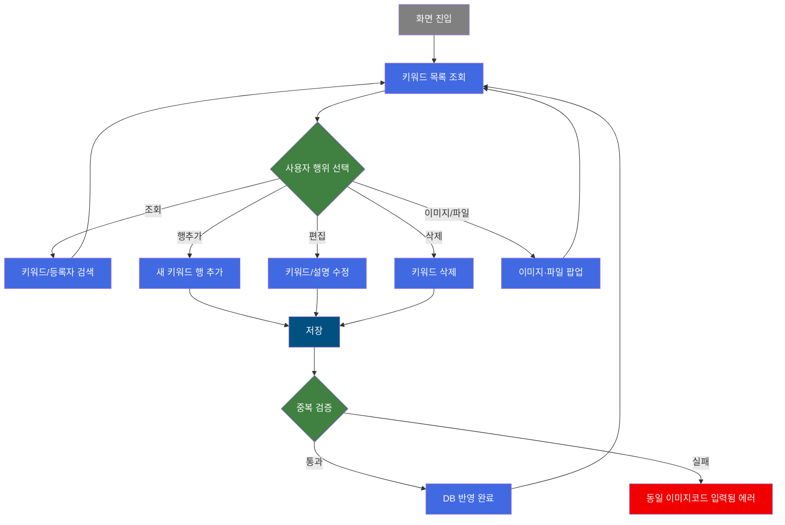
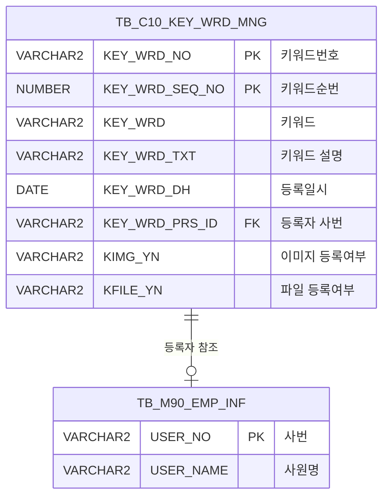

<h1 style="font-size: 40px; text-align: center; font-weight:
   bold; margin: 30px 0;">
  C106000160 레거시 시스템 분석 종합 보고서
</h1>


# 1. 시스템 개요
- **서비스 ID**: C106000160
- **업무명**: Keyword관리 (디지털이미지관리)
- **분석 일시**: 2026-03-17 12:09 KST
- **전체 Activity 수**: 4개 (built-in 3, common 1)
- **분석자**: Claude Opus 4.6 / Sonnet
- **분석 도구**: /analyze-service C106000160
- **문서 버전**: 1.0

# 📊 비즈니스 프로세스 분석

## 시스템 목적

C106000160은 디지털 프린트 공정에서 사용하는 **키워드(Keyword) 마스터 데이터를 관리**하는 화면이다. 프린트롤에 적용되는 키워드를 등록·수정·삭제하고, 각 키워드에 이미지 파일과 첨부파일을 연결할 수 있다.

키워드는 `TB_C10_KEY_WRD_MNG` 테이블에 저장되며, 키워드번호(`KEY_WRD_NO`)는 자동 채번(MAX+1) 방식으로 부여된다. 키워드별로 이미지 등록(`pop01`), 파일 등록(`pop02`) 팝업을 통해 첨부 자료를 관리하며, 고객사 코드 연동을 위한 마스터 팝업도 제공한다.

## 핵심 워크플로우 다이어그램



## 주요 유즈케이스

### UC-01: 키워드 목록 조회
- **Actor**: 디지털프린트 담당자
- **목적**: 등록된 키워드를 검색 조건에 따라 조회하여 현재 등록 현황을 파악

- **전제조건**:
  - 사용자가 시스템에 로그인되어 있음
  - C106000160 화면에 접근 권한이 있음

- **주요 흐름**:
  1. 화면 진입 시 `firstFind` 이벤트에 의해 URL 파라미터 `KEY_WRD`가 폼에 자동 세팅됨
  2. 사용자가 키워드, 등록자 검색 조건을 입력
  3. 조회 버튼 클릭 → `gridC10Data.do` URL로 `C106000160-service` 호출 (find 명령)
  4. `C106000160.select` 쿼리 실행 → `TB_C10_KEY_WRD_MNG` 테이블에서 키워드 LIKE 검색 및 등록자명 접두어 검색
  5. Grid에 결과 표시 (키워드번호 오름차순 정렬)

- **대체 흐름**:
  - 검색 조건 미입력 시: 전체 키워드 목록 조회
  - 조회 결과 없음: 빈 그리드 표시

- **후행조건**:
  - 조회된 키워드 목록이 Grid에 표시됨
  - 사용자가 편집/삭제/이미지등록 작업 수행 가능 상태

### UC-02: 키워드 신규 등록
- **Actor**: 디지털프린트 담당자
- **목적**: 새로운 프린트롤 키워드를 시스템에 등록

- **전제조건**:
  - 키워드 목록이 조회된 상태
  - 등록 권한이 있음

- **주요 흐름**:
  1. 메뉴에서 "행추가" 클릭 → Grid에 빈 행 추가
  2. KEY_WRD 컬럼에 키워드 입력 (편집 가능, 노란 배경)
  3. KEY_WRD_TXT 컬럼에 키워드 설명 입력 (편집 가능)
  4. 저장 버튼 클릭 → `handleDataProcess.do` URL로 `C106000160-service` 호출 (save 명령)
  5. `C106000160.insert` 쿼리 실행 → KEY_WRD_NO는 `MAX+1` 자동 채번, KEY_WRD_SEQ_NO는 `1` 고정
  6. 등록일(`KEY_WRD_DH`)은 SYSDATE, 등록자(`KEY_WRD_PRS_ID`)는 현재 로그인 사용자 ObjectId
  7. 저장 완료 후 `onAfterUpdateFinishEvent`에 의해 Grid 자동 새로고침

- **대체 흐름**:
  - 동일 이미지코드 입력 시: "동일 이미지코드 입력됨." 에러 메시지 표시 (SetUIMessage Activity)

- **후행조건**:
  - 새 키워드가 `TB_C10_KEY_WRD_MNG`에 저장됨
  - KIMG_YN='N', KFILE_YN='N' 초기값으로 등록
  - 감사 정보(Audit) 자동 기록 (isAudit=true)

### UC-03: 키워드 수정
- **Actor**: 디지털프린트 담당자
- **목적**: 기존 키워드의 설명을 수정

- **전제조건**:
  - 수정할 키워드가 Grid에 표시된 상태

- **주요 흐름**:
  1. Grid에서 KEY_WRD_TXT(설명) 컬럼 셀 클릭하여 편집 모드 진입
  2. 설명 내용 수정
  3. 저장 버튼 클릭 → `C106000160.update` 쿼리 실행
  4. KEY_WRD_NO 기준으로 KEY_WRD_TXT 필드만 업데이트

- **대체 흐름**:
  - 기존 행의 KEY_WRD_NO 컬럼은 `setReadonly` 이벤트에 의해 읽기전용으로 설정됨 (키워드 자체는 수정 불가)

- **후행조건**:
  - 키워드 설명이 DB에 반영됨
  - Grid 자동 새로고침

### UC-04: 키워드 삭제
- **Actor**: 디지털프린트 담당자
- **목적**: 불필요한 키워드를 삭제

- **전제조건**:
  - 삭제할 키워드가 Grid에서 선택된 상태

- **주요 흐름**:
  1. Grid에서 삭제할 행 선택
  2. 메뉴에서 "삭제" 클릭
  3. 저장 버튼 클릭 → `C106000160.delete` 쿼리 실행
  4. KEY_WRD_NO, KEY_WRD_SEQ_NO 기준으로 레코드 삭제

- **대체 흐름**:
  - 행 선택 없이 삭제 시: 동작 없음

- **후행조건**:
  - 해당 키워드가 `TB_C10_KEY_WRD_MNG`에서 삭제됨

### UC-05: 키워드 이미지 등록
- **Actor**: 디지털프린트 담당자
- **목적**: 키워드에 이미지 파일을 연결하여 시각적 참조 제공

- **전제조건**:
  - 키워드가 등록된 상태

- **주요 흐름**:
  1. Grid에서 사진(KIMG_YN) 컬럼 관련 동작으로 `doImgPopUp8` 함수 호출
  2. `C106000160pop01.jsp` 팝업 오픈 (465x405px, 모달)
  3. 팝업에 KEY_WRD_NO, KEY_WRD_SEQ_NO, IMG_RGS_TP=1, PRD_SPC_TP=7 파라미터 전달
  4. 이미지 등록 후 팝업 닫기
  5. 부모 Grid 새로고침

- **후행조건**:
  - KIMG_YN이 'Y'로 변경됨

### UC-06: 키워드 파일 등록
- **Actor**: 디지털프린트 담당자
- **목적**: 키워드에 첨부 파일을 연결

- **전제조건**:
  - 키워드가 등록된 상태

- **주요 흐름**:
  1. Grid에서 파일(KFILE_YN) 컬럼 관련 동작으로 `doImgPopUp9` 함수 호출
  2. `C106000160pop02.jsp` 팝업 오픈 (465x405px, 모달)
  3. 팝업에 KEY_WRD_NO, KEY_WRD_SEQ_NO, IMG_RGS_TP=1, PRD_SPC_TP=8 파라미터 전달
  4. 파일 등록 후 팝업 닫기

- **후행조건**:
  - KFILE_YN이 'Y'로 변경됨

---
## 비즈니스 로직 상세

### 1. 키워드번호 자동 채번

- **목적**: 신규 키워드 등록 시 고유한 키워드번호를 자동으로 부여
- **처리 케이스**:

  **[케이스 1: 정상 채번]**
  ```
    조건: INSERT 시 TB_C10_KEY_WRD_MNG에 기존 데이터 존재
    처리:
      1. SELECT NVL(MAX(TO_NUMBER(KEY_WRD_NO)),0)+1 FROM TB_C10_KEY_WRD_MNG
      2. 최대 키워드번호에 +1하여 새 번호 부여
      3. KEY_WRD_SEQ_NO는 항상 1로 고정
  ```

  **[케이스 2: 최초 등록]**
  ```
    조건: TB_C10_KEY_WRD_MNG 테이블이 비어있음
    처리:
      1. MAX(TO_NUMBER(KEY_WRD_NO)) = NULL
      2. NVL(NULL, 0) + 1 = 1
      3. KEY_WRD_NO = 1로 부여
  ```

- **예외 처리**:
  - KEY_WRD_NO가 숫자가 아닌 값이 저장된 경우: `TO_NUMBER` 변환 에러 발생 가능

### 2. 키워드 검색 로직

- **목적**: 키워드와 등록자명으로 조건부 검색
- **처리 케이스**:

  **[케이스 1: 키워드 부분 검색]**
  ```
    조건: KEY_WRD 파라미터 입력됨
    처리:
      1. KEY_WRD LIKE '%' || :KEY_WRD || '%' 조건으로 부분 일치 검색
      2. 키워드의 어느 위치에나 포함되면 검색 결과에 포함
  ```

  **[케이스 2: 등록자명 접두어 검색]**
  ```
    조건: KEY_WRD_PRS_ID_NM 파라미터 입력됨
    처리:
      1. EXISTS 서브쿼리로 M90APUSER.TB_M90_EMP_INF 조회
      2. USER_NO = A.KEY_WRD_PRS_ID 조건으로 등록자 매칭
      3. USER_NAME LIKE :KEY_WRD_PRS_ID_NM || '%' 접두어 검색
  ```

### 3. 중복 이미지코드 검증

- **목적**: 동일한 이미지코드가 중복 등록되는 것을 방지
- **처리 케이스**:

  **[케이스 1: 중복 감지]**
  ```
    조건: 저장 시 동일 이미지코드가 이미 존재
    처리:
      1. SetUIMessage Activity에서 에러 메시지 설정
      2. MSG_KEY = "errMsg", MSG = "동일 이미지코드 입력됨."
      3. 저장 중단, 사용자에게 에러 표시
  ```

---

# 💾 데이터 요구사항

## 핵심 테이블

### 1. TB_C10_KEY_WRD_MNG - (키워드 관리 마스터)
| 컬럼명 | 타입 | PK | 설명 |
|--------|------|----|-----|
| KEY_WRD_NO | VARCHAR2 | ✅ | 키워드번호 (자동채번, MAX+1) |
| KEY_WRD_SEQ_NO | NUMBER | ✅ | 키워드순번 (고정값 1) |
| KEY_WRD | VARCHAR2 | | 키워드 |
| KEY_WRD_TXT | VARCHAR2 | | 키워드 설명 |
| KEY_WRD_DH | DATE | | 등록일시 (SYSDATE) |
| KEY_WRD_PRS_ID | VARCHAR2 | | 등록자 사번 |
| KIMG_YN | VARCHAR2 | | 이미지 등록여부 (Y/N, 기본 N) |
| KFILE_YN | VARCHAR2 | | 파일 등록여부 (Y/N, 기본 N) |
| CREATED_OBJECT_TYPE | VARCHAR2 | | 감사정보: 생성 객체타입 |
| CREATED_OBJECT_ID | VARCHAR2 | | 감사정보: 생성 객체ID |
| CREATED_PROGRAM_ID | VARCHAR2 | | 감사정보: 생성 프로그램ID |
| CREATION_TIMESTAMP | DATE | | 감사정보: 생성 타임스탬프 |
| LAST_UPDATED_OBJECT_TYPE | VARCHAR2 | | 감사정보: 최종수정 객체타입 |
| LAST_UPDATED_OBJECT_ID | VARCHAR2 | | 감사정보: 최종수정 객체ID |
| LAST_UPDATE_PROGRAM_ID | VARCHAR2 | | 감사정보: 최종수정 프로그램ID |
| LAST_UPDATE_TIMESTAMP | DATE | | 감사정보: 최종수정 타임스탬프 |

### 2. TB_M90_EMP_INF - (사원정보 마스터, 참조)
| 컬럼명 | 타입 | PK | 설명 |
|--------|------|----|-----|
| USER_NO | VARCHAR2 | ✅ | 사번 |
| USER_NAME | VARCHAR2 | | 사원명 |

## 데이터 플로우

### 1. 조회
```
[키워드 목록 조회]
화면 진입 / 조회 버튼 클릭
→ C106000160.select
  FROM C10APUSER.TB_C10_KEY_WRD_MNG A
  EXISTS (
    SELECT 1 FROM M90APUSER.TB_M90_EMP_INF
    WHERE USER_NO = A.KEY_WRD_PRS_ID
      AND USER_NAME LIKE :KEY_WRD_PRS_ID_NM || '%'
  )
  WHERE A.KEY_WRD LIKE '%' || :KEY_WRD || '%'
  ORDER BY TO_NUMBER(KEY_WRD_NO)
→ 등록자명은 스칼라 서브쿼리로 M90APUSER.TB_M90_EMP_INF에서 조회
→ Grid에 키워드 목록 표시
```

### 2. 저장 (신규 등록)
```
[키워드 신규 등록]
행추가 → 키워드/설명 입력 → 저장 클릭
→ C106000160.insert
  INSERT INTO C10APUSER.TB_C10_KEY_WRD_MNG
  KEY_WRD_NO = NVL(MAX(TO_NUMBER(KEY_WRD_NO)),0)+1 (자동채번)
  KEY_WRD_SEQ_NO = 1 (고정)
  KEY_WRD_DH = SYSDATE
  KEY_WRD_PRS_ID = :ObjectId (현재 사용자)
  KIMG_YN = 'N', KFILE_YN = 'N' (초기값)
  + 감사 정보 (isAudit=true)
→ Grid 새로고침
```

### 3. 저장 (수정)
```
[키워드 설명 수정]
Grid에서 KEY_WRD_TXT 셀 편집 → 저장 클릭
→ C106000160.update
  UPDATE C10APUSER.TB_C10_KEY_WRD_MNG
  SET KEY_WRD_TXT = :KEY_WRD_TXT
  WHERE KEY_WRD_NO = :KEY_WRD_NO
→ Grid 새로고침
```

### 4. 삭제
```
[키워드 삭제]
Grid에서 행 선택 → 삭제 메뉴 → 저장 클릭
→ C106000160.delete
  DELETE FROM C10APUSER.TB_C10_KEY_WRD_MNG
  WHERE KEY_WRD_NO = :KEY_WRD_NO
    AND KEY_WRD_SEQ_NO = :KEY_WRD_SEQ_NO
→ Grid 새로고침
```

## SQL 일람표
| SQL 이름 | 쿼리 ID | 타입 | 출처 | 테이블 |
|---------|---------|-----|-------|-------|
| 프린트롤 키워드 조회 | C106000160.select | SELECT | Service | TB_C10_KEY_WRD_MNG, TB_M90_EMP_INF |
| 키워드 정보 신규 등록 | C106000160.insert | INSERT | Service | TB_C10_KEY_WRD_MNG |
| 키워드 정보 수정 | C106000160.update | UPDATE | Service | TB_C10_KEY_WRD_MNG |
| 키워드 정보 삭제 | C106000160.delete | DELETE | Service | TB_C10_KEY_WRD_MNG |

## ER 다이어그램 (핵심 관계)



관계 설명:
- **TB_C10_KEY_WRD_MNG**가 중심 테이블로 키워드 마스터 데이터를 저장
- **TB_M90_EMP_INF**: KEY_WRD_PRS_ID → USER_NO 관계로 등록자 사원명 조회
- 스키마 분리: 키워드 테이블은 C10APUSER, 사원정보는 M90APUSER 스키마

---

# 🖥️ 사용자 인터페이스 요구사항

## 화면 레이아웃 상세

### Layout 구조 (Flat 레이아웃)
```javascript
{
  itemType: "flat",  // 절대위치 기반 배치
  components: [
    {
      id: "C106000160_Form_1",
      type: "form",
      position: { left: "0px", top: "0px", width: "981px", height: "28px" }
    },
    {
      id: "C106000160_Menu_1",
      type: "menu",
      position: { left: "0px", top: "28px", width: "981px", height: "25px" }
    },
    {
      id: "C106000160_Grid_1",
      type: "grid",
      position: { left: "-1px", top: "54px", width: "980px", height: "511px" }
    },
    {
      id: "C106000160_messagebox",
      type: "messagebox",
      position: { left: "-1px", top: "567px", width: "980px", height: "19px" }
    }
  ]
}
```

## 입출력 요소

### Form 컴포넌트
**C106000160_Form_1**
- KEY_WRD: input (75px) - 키워드 검색 입력
- KEY_WRD_PRS_ID_NM: input (75px) - 등록자명 검색 입력
- find: button - 조회 (find 명령)
- save: button - 저장 (save 명령)
- winClose: button - 닫기

### Menu 컴포넌트
**C106000160_Menu_1**
- refresh: 새로고침 (refresh.gif)
- add: 행추가 (new.gif)
- remove: 삭제 (remove.gif)

### Grid 컴포넌트

**C106000160_Grid_1 (키워드 목록)**
- 편집 가능 여부: 예 (부분 편집, singleClick/dblClick)
- Split: 0 (고정 컬럼 없음)
- 다중 선택: 예 (multiselect)
- 스마트 렌더링: 예 (smartRendering)
- 컨텍스트 메뉴: 예
- 페이징: 예 (rowCnt=22)
- 컬럼 너비 단위: % (colwidthUnit=%)
- 주요 컬럼 (13개):

  **표시 컬럼**:
  - KEY_WRD: ed - Keyword (20%, 좌측정렬, 편집가능, 노란배경 #FFFFC0)
  - KEY_WRD_TXT: ed - 설명 (40%, 좌측정렬, 편집가능)
  - KEY_WRD_PRS_ID_NM: ro - 등록자 (8%, 중앙정렬, 읽기전용)
  - KEY_WRD_DH: ro - 등록일 (12%, 중앙정렬, 읽기전용)
  - KIMG_YN: ro - 사진여부 (*, 중앙정렬, 읽기전용, 노란배경 #FFFFC0)
  - KFILE_YN: ro - 파일여부 (*, 중앙정렬, 읽기전용, 노란배경 #FFFFC0)

  **숨김 컬럼**:
  - KEY_WRD_PRS_ID: ro - 등록자 사번 (8%, 숨김)
  - USER_NO: ro - 사번 (9%, 숨김)
  - KEY_WRD_NO: ed - 키워드번호 (13%, 숨김, 편집가능, 노란배경 #FFFFC0)
  - KEY_WRD_SEQ_NO: ro - 순서 (15%, 숨김)
  - IMG_ADR: ro - 이미지 주소 (숨김)
  - IMG_NM: ro - 이미지 명 (숨김)
  - CNT: ro - 카운트 (숨김)

### Messagebox 컴포넌트
**C106000160_messagebox**
- 서버 응답 메시지 표시 영역 (19px 높이)

## 팝업 화면

| 팝업명 | URL | 크기 | 트리거 함수 | 주요 파라미터 |
|-------|-----|------|-----------|-------------|
| 키워드 이미지 등록 | C106000160pop01.jsp | 465x405 | doImgPopUp8 | KEY_WRD_NO, KEY_WRD_SEQ_NO, IMG_RGS_TP=1, PRD_SPC_TP=7 |
| 키워드 파일 등록 | C106000160pop02.jsp | 465x405 | doImgPopUp9 | KEY_WRD_NO, KEY_WRD_SEQ_NO, IMG_RGS_TP=1, PRD_SPC_TP=8 |
| 고객사 코드 선택 | masterGridData.do | 469x532 | onEditCellEvent | CD_TP=CUS_CD, CATEGORY_GROUP_NM=SZ0000 |

## 화면 동작 흐름

### 1. 화면 초기 로딩
```
1. 화면 진입
2. DHTMLX 컴포넌트 초기화 (Form, Menu, Grid, Messagebox)
3. firstFind 이벤트 실행
   - URL 파라미터에서 KEY_WRD 값 추출
   - Form의 KEY_WRD 필드에 자동 세팅
4. C106000160-service 호출 (find 명령)
   - gridC10Data.do URL
   - C106000160.select 쿼리 실행
5. Grid에 키워드 목록 표시
6. setReadonly 이벤트로 기존 행의 KEY_WRD_NO 컬럼(index 0) 읽기전용 설정
7. 상태바 초기화
```

### 2. 키워드 검색 조회
```
1. 사용자가 키워드/등록자 입력
2. 조회 버튼 클릭
3. Form에서 파라미터 구성 (KEY_WRD, KEY_WRD_PRS_ID_NM)
4. C106000160-service 호출 (find 명령)
5. C106000160.select 실행
   - KEY_WRD LIKE '%검색어%' 부분 일치
   - EXISTS 서브쿼리로 등록자명 접두어 매칭
6. Grid 데이터 바인딩
7. setReadonly 이벤트로 기존 행 KEY_WRD 읽기전용 설정
```

### 3. 그리드 편집 및 저장
```
1. 행추가 메뉴 클릭 → 빈 행 추가 (KEY_WRD, KEY_WRD_TXT 편집 가능)
2. 또는 기존 행의 KEY_WRD_TXT 셀 클릭하여 편집
3. 저장 버튼 클릭
4. handleDataProcess.do URL로 save 명령 전송
5. 변경된 행 상태에 따라:
   - 신규행 → C106000160.insert 실행
   - 수정행 → C106000160.update 실행
   - 삭제행 → C106000160.delete 실행
6. onAfterUpdateFinishEvent → Grid 자동 새로고침
```

### 4. 셀 편집 이벤트 (onEditCellEvent)
```
1. Grid 셀 편집 시 onEditCellEvent 발생
2. cInd==3 (CCL_BOM_NO 컬럼): 5자리 입력 제한
3. cInd==2 (고객사 컬럼): 고객사 선택 팝업 호출
   - masterGridData.do URL
   - CD_TP=CUS_CD, CATEGORY_GROUP_NM=SZ0000 파라미터
4. 팝업에서 선택한 코드값이 Grid 셀에 반영
```

### 5. 이미지/파일 등록 팝업
```
1. 사진(KIMG_YN) 관련 동작 → doImgPopUp8 호출
   - C106000160pop01.jsp 팝업 (465x405, 모달)
   - IMG_RGS_TP=1, PRD_SPC_TP=7 파라미터
2. 파일(KFILE_YN) 관련 동작 → doImgPopUp9 호출
   - C106000160pop02.jsp 팝업 (465x405, 모달)
   - IMG_RGS_TP=1, PRD_SPC_TP=8 파라미터
3. 팝업 닫기 후 부모 Grid 새로고침
```

## JavaScript 모듈

**C106000160.jsp (메인 화면 인라인 스크립트)**
- firstFind(): 초기 로드 시 URL 파라미터 KEY_WRD 폼에 세팅 후 조회 실행
- setReadonly(): 데이터 로드 후 기존 행의 KEY_WRD_NO 컬럼(index 0) 읽기전용 설정
- onAfterUpdateFinishEvent(): 저장 완료 후 Grid 데이터 새로고침
- onEditCellEvent(stage, rId, cInd, nVal, oVal): 셀 편집 이벤트 처리 (CCL_BOM_NO 5자리 제한, 고객사 팝업 호출)
- doOnRowClicked(): 행 더블클릭 이벤트 (현재 로직 주석 처리됨)
- doImgPopUp8(): 키워드 이미지 등록 팝업 (C106000160pop01.jsp)
- doImgPopUp9(): 키워드 파일 등록 팝업 (C106000160pop02.jsp)

## 주요 이벤트 핸들러

**onAfterUpdateFinishEvent (저장 완료)**
- 이벤트 타입: Grid Update Finish
- 처리 내용:
  1. 저장 완료 감지
  2. Grid 데이터 새로고침 (find 재호출)

**setReadonly (데이터 로드 후)**
- 이벤트 타입: onXLEEvent (Grid Load)
- 처리 내용:
  1. Grid에 데이터 로드 완료 감지
  2. 기존 행의 KEY_WRD_NO 컬럼(index 0)을 읽기전용으로 설정
  3. 신규 추가 행만 KEY_WRD_NO 편집 가능

**firstFind (초기 로드)**
- 이벤트 타입: onXLEEvent (Grid Init)
- 처리 내용:
  1. URL 파라미터에서 KEY_WRD 값 추출
  2. Form의 KEY_WRD 필드에 값 세팅
  3. 조회 함수 호출

**onEditCellEvent (셀 편집)**
- 이벤트 타입: Grid Cell Edit
- 처리 내용:
  1. 편집 셀 인덱스 확인
  2. cInd==3: CCL BOM NO 5자리 입력 제한 (초과 시 잘라내기)
  3. cInd==2: 고객사 코드 선택 팝업 호출 (masterGridData.do)
  4. 팝업 반환값을 해당 셀에 반영

---

# 📌 특이사항 및 주의사항

## 1. KEY_WRD_NO 자동채번의 동시성 문제
- **채번 방식**: `NVL(MAX(TO_NUMBER(KEY_WRD_NO)),0)+1` (INSERT 서브쿼리)
- **위험**: 시퀀스(SEQUENCE)가 아닌 MAX+1 방식이므로, 동시에 여러 사용자가 INSERT할 경우 중복 키 충돌 가능
- **KEY_WRD_NO 타입 불일치**: 컬럼은 VARCHAR2이나 `TO_NUMBER`로 변환하여 MAX 계산 → 숫자가 아닌 값 저장 시 런타임 에러 발생 가능

## 2. 스키마 직접 참조 (Cross-Schema)
- **C10APUSER 스키마 직접 참조**: 쿼리에서 `C10APUSER.TB_C10_KEY_WRD_MNG`로 스키마를 직접 지정
- **M90APUSER 스키마 직접 참조**: 사원정보 조회 시 `M90APUSER.TB_M90_EMP_INF` 직접 참조
- 서비스의 DAO는 `mesdao` (MESAPUSER 스키마)로 설정되어 있으나, 실제 쿼리는 C10APUSER 스키마의 테이블을 참조
- 스키마 변경 시 쿼리 수정 필요

## 3. 편집 이벤트의 컬럼 인덱스 하드코딩
- `onEditCellEvent`에서 `cInd==3` (CCL_BOM_NO), `cInd==2` (고객사)로 컬럼 인덱스를 하드코딩
- Grid 컬럼 순서가 변경되면 로직이 깨질 수 있음
- 실제 Grid 컬럼 구조(KEY_WRD, KEY_WRD_TXT, ...)와 cInd 값의 매핑이 불일치할 가능성 있음

## 4. 감사 정보(Audit) 자동 기록
- GridSave Activity에 `isAudit=true` 설정
- INSERT 시 `CREATED_*`, `LAST_UPDATED_*` 감사 컬럼 자동 기록
- ObjectType, ObjectId, ProgramId, Timestamp 파라미터가 프레임워크에서 자동 주입

## 5. 이미지/파일 등록 팝업의 PRD_SPC_TP 구분
- 이미지 등록: `PRD_SPC_TP=7` (사진 유형)
- 파일 등록: `PRD_SPC_TP=8` (파일 유형)
- 두 팝업 모두 `IMG_RGS_TP=1` 고정 → 이미지 등록 유형 구분 코드
- 팝업에서 `TB_C10_DGT_PRT_IMG` 테이블을 사용할 것으로 추정 (쿼리 파일에 `C106000160_IMG.delete` 존재)

## 6. 미사용 쿼리 잔존
- `C106000160_DUMY.select`: `SELECT 1 DUMY FROM DUAL` — 의미 없는 쿼리가 쿼리 파일에 잔존
- `C106000160_IMG.delete`: `TB_C10_DGT_PRT_IMG` 이미지 테이블 삭제 쿼리가 메인 쿼리 파일에 포함 (팝업에서 사용될 수 있음)

---

# 📚 참고 문서

- **Service XML**: `src/service/C106000160-service.xml`
- **Query SQL**: `src/query/C106000160-query.glue_sql`
- **Query SQL (팝업1)**: `src/query/C106000160pop01-query.glue_sql`
- **Query SQL (팝업2)**: `src/query/C106000160pop02-query.glue_sql`
- **JSP**: `WebContents/C106000160.jsp`
- **JSP (팝업1)**: `WebContents/C106000160pop01.jsp`
- **JSP (팝업2)**: `WebContents/C106000160pop02.jsp`
- **Form XML**: `WebContents/header/kr/C106000160/C106000160_Form_1.xml`
- **Grid XML**: `WebContents/header/kr/C106000160/C106000160_Grid_1.xml`
- **Menu XML**: `WebContents/header/kr/C106000160/C106000160_Menu_1.xml`
- **Messagebox XML**: `WebContents/header/kr/C106000160/C106000160_messagebox.xml`
