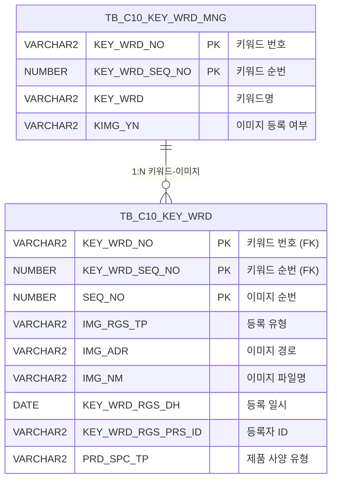

<h1 style="font-size: 40px; text-align: center; font-weight:
   bold; margin: 30px 0;">
  C106000160pop01 레거시 시스템 분석 종합 보고서
</h1>


# 1. 시스템 개요
- **서비스 ID**: C106000160pop01
- **업무명**: 디지털프린팅 키워드 이미지 등록/조회 팝업
- **분석 일시**: 2026-03-17 12:11 KST
- **분석 시간**: 약 5분
- **전체 Activity 수**: 2개 (Built-in)
- **분석자**: Claude Opus 4.6 + Sonnet (UI 분석)
- **분석 도구**: /analyze-service C106000160pop01
- **문서 버전**: 1.0

# 📊 비즈니스 프로세스 분석

## 시스템 목적

C106000160pop01은 디지털프린팅 키워드 관리 화면(C106000160)의 **이미지 등록/조회 팝업**이다. 부모 화면에서 특정 키워드를 선택한 후 이 팝업을 열어 해당 키워드에 대한 이미지 파일을 업로드하거나, 등록된 이미지 목록을 조회하고, 이미지를 선택하여 부모 화면에 반영하거나, 불필요한 이미지를 삭제하는 기능을 제공한다.

이 서비스는 `dhtmlXVaultObject`를 활용한 파일 업로드 컴포넌트와 이미지 목록 Grid로 구성된 단순 팝업 화면이며, 서비스 XML에서는 이미지 목록 조회(SELECT)만 담당한다. 이미지 업로드(INSERT)와 삭제(DELETE), 등록 여부 갱신(UPDATE)은 별도의 JSP 핸들러(`_uploadHandler5.jsp`, `_fileDeleteHandler4.jsp`)를 통해 직접 처리된다.

## 주요 유즈케이스

### UC-01: 키워드 이미지 목록 조회
- **Actor**: 디지털프린팅 담당자
- **목적**: 특정 키워드에 등록된 이미지 파일 목록을 조회하여 현재 등록 상태를 확인

- **전제조건**:
  - 부모 화면(C106000160)에서 키워드가 선택되어 있음
  - URL 파라미터로 KEY_WRD_NO, KEY_WRD_SEQ_NO가 전달됨

- **주요 흐름**:
  1. 부모 화면에서 이미지 관리 팝업 호출 시 KEY_WRD_NO, KEY_WRD_SEQ_NO 파라미터 전달
  2. 팝업 로드 시 `onVaultLoad` 실행 → dhtmlXVault 초기화
  3. `onLoadGrid` 호출 → `C106000160pop01_Grid_1.select` 쿼리 실행
  4. TB_C10_KEY_WRD 테이블에서 PRD_SPC_TP = '7' 조건으로 이미지 목록 조회
  5. Grid에 키워드명, 순번, 구분(PC/모바일), 이미지명, 등록일자, 등록자 표시

- **대체 흐름**:
  - 등록된 이미지가 없는 경우: 빈 Grid 표시

- **후행조건**:
  - Grid에 이미지 목록이 표시됨
  - 사용자가 이미지 선택 또는 업로드 가능 상태

### UC-02: 이미지 파일 업로드
- **Actor**: 디지털프린팅 담당자
- **목적**: 키워드에 새로운 이미지 파일을 업로드하여 등록

- **전제조건**:
  - 이미지 목록이 조회된 상태
  - 업로드할 이미지 파일이 준비됨

- **주요 흐름**:
  1. dhtmlXVault 영역에 파일 추가 (드래그앤드롭 또는 파일 선택)
  2. `vault.onAddFile` 이벤트에서 기존 등록 파일 수 확인 (1개 초과 시 업로드 차단)
  3. `_uploadHandler5.jsp`로 파일 업로드 처리 (IMG_RGS_FLAG=04, IMG_RGS_TP, PRD_SPC_TP 파라미터 전달)
  4. 업로드 완료 시 `vault.onUploadComplete` → `onLoadGrid` 호출로 Grid 갱신
  5. TB_C10_KEY_WRD 테이블에 이미지 정보 INSERT (SEQ_NO는 자동 채번: MAX+1)
  6. TB_C10_KEY_WRD_MNG 테이블의 KIMG_YN을 'Y'로 UPDATE

- **대체 흐름**:
  - 업로드 실패 시: alert 메시지 표시
  - 파일 수 제한 초과 시: 업로드 차단 (1개 파일만 허용)

- **후행조건**:
  - 이미지가 서버에 저장됨
  - TB_C10_KEY_WRD에 이미지 레코드 추가
  - Grid에 새 이미지 정보 표시

### UC-03: 이미지 선택 (부모 화면 반영)
- **Actor**: 디지털프린팅 담당자
- **목적**: Grid의 이미지 링크를 클릭하여 부모 화면에 선택된 이미지를 반영

- **전제조건**:
  - 이미지 목록이 Grid에 표시된 상태

- **주요 흐름**:
  1. Grid의 이미지(IMG_NM) 컬럼의 링크 클릭
  2. `Grid_doLink` 함수 호출
  3. 클릭한 행의 rowId와 CHK_IMG_NM(이미지 파일명) 추출
  4. `parent.parentViewImg(rowId, CHK_IMG_NM)` 호출로 부모 화면에 이미지 정보 전달
  5. 부모 화면에서 해당 이미지를 미리보기 표시

- **대체 흐름**:
  - 부모 화면이 닫혀 있는 경우: JavaScript 오류 발생 가능

- **후행조건**:
  - 부모 화면에 선택된 이미지가 표시됨

### UC-04: 이미지 삭제
- **Actor**: 디지털프린팅 담당자
- **목적**: 등록된 이미지를 삭제

- **전제조건**:
  - 삭제할 이미지가 Grid에 표시된 상태

- **주요 흐름**:
  1. Grid의 삭제(DEL_IMG) 컬럼 클릭
  2. `doImgDel` 함수 호출 → confirm 대화상자로 삭제 확인
  3. 사용자 확인 시 `_fileDeleteHandler4.jsp`에 AJAX 호출
  4. 파라미터: IMG_RGS_FLAG=04, IMG_RGS_FLAG_ID(KEY_WRD_NO), IMG_RGS_FLAG_ID2(KEY_WRD_SEQ_NO), SEQ(SEQ_NO), PRD_SPC_TP, FILE_NAME
  5. 서버에서 이미지 파일 물리 삭제 + TB_C10_KEY_WRD에서 레코드 DELETE
  6. TB_C10_KEY_WRD_MNG의 KIMG_YN을 이미지 잔존 여부에 따라 'Y'/'N'으로 UPDATE
  7. 삭제 완료 후 `onLoadGrid` 호출로 Grid 갱신

- **대체 흐름**:
  - 사용자가 confirm에서 취소 시: 삭제 미수행
  - 삭제 실패 시: 에러 메시지 표시

- **후행조건**:
  - 이미지 파일이 서버에서 삭제됨
  - TB_C10_KEY_WRD에서 레코드 삭제됨
  - 이미지가 모두 삭제된 경우 KIMG_YN = 'N'으로 갱신

---
## 비즈니스 로직 상세

### 1. 이미지 등록 유형 분류 (DECODE)

- **목적**: 이미지 등록 경로(PC/모바일)를 구분하여 표시
- **처리 케이스**:

  **[케이스 1: 모바일 등록]**
  ```
    조건: IMG_RGS_TP = '2'
    처리: '모바일'로 표시
  ```

  **[케이스 2: PC 등록]**
  ```
    조건: IMG_RGS_TP != '2' (기본값)
    처리: 'PC'로 표시
  ```

### 2. 이미지 경로 변환

- **목적**: 서버 절대 경로를 웹 접근 가능한 상대 경로로 변환
- **처리 케이스**:

  **[경로 변환 규칙]**
  ```
    원본: IMG_ADR (서버 절대 경로, 예: D:\uploads\IMG_UPLOAD\2026\03\image.jpg)
    변환:
      1. IMG_ADR에서 'IMG_UPLOAD' 문자열 위치(instr) 이후 부분 추출
      2. 역슬래시(\)를 슬래시(/)로 치환
      3. 앞에 './' 접두어, 뒤에 '/' 접미어 추가
    결과: ./IMG_UPLOAD/2026/03/image.jpg/
  ```

### 3. 이미지 순번 자동 채번

- **목적**: 동일 키워드에 여러 이미지 등록 시 순번을 자동 증가
- **처리 케이스**:

  **[자동 채번 규칙]**
  ```
    조건: 이미지 INSERT 시
    처리:
      1. TB_C10_KEY_WRD에서 동일 KEY_WRD_NO, KEY_WRD_SEQ_NO의 MAX(SEQ_NO) 조회
      2. NVL(MAX(SEQ_NO), 0) + 1로 새 순번 생성
      3. 최초 등록 시 SEQ_NO = 1
  ```

### 4. 키워드 이미지 등록 여부 동기화

- **목적**: 이미지 등록/삭제 시 키워드 관리 테이블의 이미지 존재 여부 플래그를 자동 동기화
- **처리 케이스**:

  **[이미지 존재 시]**
  ```
    조건: TB_C10_KEY_WRD에 해당 키워드의 이미지가 1개 이상 존재 (COUNT > 0)
    처리: TB_C10_KEY_WRD_MNG.KIMG_YN = 'Y'
  ```

  **[이미지 없음]**
  ```
    조건: TB_C10_KEY_WRD에 해당 키워드의 이미지가 0개 (COUNT = 0)
    처리: TB_C10_KEY_WRD_MNG.KIMG_YN = 'N'
  ```

---

# 💾 데이터 요구사항

## 핵심 테이블

### 1. TB_C10_KEY_WRD - (키워드 이미지 정보)
| 컬럼명 | 타입 | PK | 설명 |
|--------|------|----|-----|
| KEY_WRD_NO | VARCHAR2 | ✅ | 키워드 번호 |
| KEY_WRD_SEQ_NO | NUMBER | ✅ | 키워드 순번 |
| SEQ_NO | NUMBER | ✅ | 이미지 순번 |
| IMG_RGS_TP | VARCHAR2 |  | 이미지 등록 유형 ('2': 모바일, 기타: PC) |
| IMG_ADR | VARCHAR2 |  | 이미지 서버 경로 |
| IMG_NM | VARCHAR2 |  | 이미지 파일명 |
| KEY_WRD_RGS_DH | DATE |  | 키워드 등록 일시 |
| KEY_WRD_RGS_PRS_ID | VARCHAR2 |  | 등록자 ID |
| PRD_SPC_TP | VARCHAR2 |  | 제품 사양 유형 ('7': 디지털프린팅) |
| CREATED_OBJECT_TYPE | VARCHAR2 |  | 생성 객체 유형 |
| CREATED_OBJECT_ID | VARCHAR2 |  | 생성자 ID |
| CREATED_PROGRAM_ID | VARCHAR2 |  | 생성 프로그램 ID |
| CREATION_TIMESTAMP | TIMESTAMP |  | 생성 일시 |
| LAST_UPDATED_OBJECT_TYPE | VARCHAR2 |  | 최종 수정 객체 유형 |
| LAST_UPDATED_OBJECT_ID | VARCHAR2 |  | 최종 수정자 ID |
| LAST_UPDATE_PROGRAM_ID | VARCHAR2 |  | 최종 수정 프로그램 ID |
| LAST_UPDATE_TIMESTAMP | TIMESTAMP |  | 최종 수정 일시 |

### 2. TB_C10_KEY_WRD_MNG - (키워드 관리 마스터)
| 컬럼명 | 타입 | PK | 설명 |
|--------|------|----|-----|
| KEY_WRD_NO | VARCHAR2 | ✅ | 키워드 번호 |
| KEY_WRD_SEQ_NO | NUMBER | ✅ | 키워드 순번 |
| KEY_WRD | VARCHAR2 |  | 키워드명 |
| KIMG_YN | VARCHAR2 |  | 키워드 이미지 등록 여부 ('Y'/'N') |

## 데이터 플로우

### 1. 조회
```
[키워드 이미지 목록 조회]
팝업 진입 (URL 파라미터: KEY_WRD_NO, KEY_WRD_SEQ_NO)
→ C106000160pop01_Grid_1.select
  FROM TB_C10_KEY_WRD
  서브쿼리: TB_C10_KEY_WRD_MNG (KEY_WRD 컬럼 조회)
  WHERE KEY_WRD_NO = :KEY_WRD_NO
    AND KEY_WRD_SEQ_NO = :KEY_WRD_SEQ_NO
    AND PRD_SPC_TP = '7'
  ORDER BY KEY_WRD_NO, KEY_WRD_SEQ_NO, SEQ_NO
→ Grid에 이미지 목록 표시
```

### 2. 이미지 업로드
```
[파일 업로드 → DB 등록]
dhtmlXVault 파일 선택/드래그
→ _uploadHandler5.jsp 호출 (서버 파일 저장)
→ C106000160pop01.insert
  INTO TB_C10_KEY_WRD
  VALUES (KEY_WRD_NO, KEY_WRD_SEQ_NO, 자동채번SEQ_NO, IMG_RGS_TP, IMG_ADR, IMG_NM, SYSDATE, 등록자ID, PRD_SPC_TP)
→ C106000160pop01.update
  UPDATE TB_C10_KEY_WRD_MNG SET KIMG_YN = DECODE(이미지수, 0, 'N', 'Y')
→ Grid 갱신 (onLoadGrid)
```

### 3. 이미지 삭제
```
[이미지 삭제]
Grid 삭제 버튼 클릭 → confirm 확인
→ _fileDeleteHandler4.jsp 호출 (서버 파일 물리 삭제)
→ C106000160pop01.delete
  DELETE TB_C10_KEY_WRD
  WHERE KEY_WRD_NO = :IMG_RGS_FLAG_ID
    AND KEY_WRD_SEQ_NO = :IMG_RGS_FLAG_ID2
    AND SEQ_NO = :SEQ
→ C106000160pop01.update
  UPDATE TB_C10_KEY_WRD_MNG SET KIMG_YN = DECODE(이미지수, 0, 'N', 'Y')
→ Grid 갱신 (onLoadGrid)
```

## SQL 일람표

| SQL 이름 | 쿼리 ID | 타입 | 출처 | 테이블 |
|---------|---------|-----|-------|-------|
| 키워드 이미지 조회 | C106000160pop01_Grid_1.select | SELECT | Service | TB_C10_KEY_WRD, TB_C10_KEY_WRD_MNG |
| 키워드 이미지 업로드 | C106000160pop01.insert | INSERT | _uploadHandler5.jsp | TB_C10_KEY_WRD |
| 키워드 이미지 삭제 | C106000160pop01.delete | DELETE | _fileDeleteHandler4.jsp | TB_C10_KEY_WRD |
| 이미지 등록여부 갱신 | C106000160pop01.update | UPDATE | _fileDeleteHandler4.jsp / _uploadHandler5.jsp | TB_C10_KEY_WRD_MNG |

## ER 다이어그램 (핵심 관계)



관계 설명:
- TB_C10_KEY_WRD_MNG이 중심 테이블로 키워드 마스터 역할
- TB_C10_KEY_WRD는 키워드별 이미지 파일 정보를 관리하며 KEY_WRD_NO, KEY_WRD_SEQ_NO로 마스터와 1:N 관계
- KIMG_YN 플래그는 TB_C10_KEY_WRD의 이미지 존재 여부에 따라 자동 동기화

---

# 🖥️ 사용자 인터페이스 요구사항

## 화면 레이아웃 상세

### Layout 구조
```javascript
// 레이아웃 없이 div 직접 배치 (DHTMLX Layout 미사용)
{
  type: "flat",  // 고정 위치 div 배치
  components: [
    {
      id: "vault1",
      type: "dhtmlXVaultObject",
      position: "top",
      description: "파일 업로드 영역"
    },
    {
      id: "C106000160pop01_Grid_1",
      type: "grid",
      style: "height:70px; width:430px; left:8px; top:260px",
      description: "이미지 목록 그리드"
    },
    {
      id: "C106000160pop01_MessageBox_1",
      type: "messagebox",
      style: "height:23px; width:445px; left:0px; top:332px",
      description: "상태 메시지 표시"
    }
  ]
}
```

## 입출력 요소

### Grid 컴포넌트

**C106000160pop01_Grid_1 (이미지 목록)**
- 편집 가능 여부: 아니오 (읽기 전용, 모든 컬럼 ro)
- Split: 없음 (0)
- rowCnt: 2 (2행 표시)
- vertical: true (세로 모드)
- 주요 컬럼 (12개):

  **숨김 컬럼**:
  - KEY_WRD_SEQ_NO: ro - 키워드 순번 (숨김)
  - IMG_ADR: ro - 이미지 서버 경로 (숨김)
  - CHK_IMG_NM: ro - 확인용 이미지 파일명 (숨김)
  - CHK_IMG_ADR: ro - 확인용 이미지 경로 (숨김)
  - KEY_WRD_NO: ro - 키워드 번호 (19%, 숨김)

  **기본 정보**:
  - KEY_WRD: ro - Keyword 명칭 (19%, 중앙정렬)
  - SEQ_NO: ro - 순번 (8%, 중앙정렬)
  - IMG_RGS_TP: ro - 구분: PC/모바일 (11%, 중앙정렬)

  **이미지 정보**:
  - IMG_NM: ahref_idx - 이미지 파일명 링크 (*, 좌측정렬, 클릭 시 부모 화면에 이미지 전달)

  **관리 정보**:
  - KEY_WRD_RGS_DH: ro - 등록일자 (20%, 중앙정렬)
  - KEY_WRD_RGS_PRS_ID: ro - 등록자 (16%, 중앙정렬)
  - DEL_IMG: ro - 삭제 버튼 (8%, 중앙정렬)

## 화면 동작 흐름

### 1. 화면 초기 로딩
```
1. 부모 화면에서 팝업 호출 (URL 파라미터: KEY_WRD_NO, KEY_WRD_SEQ_NO, rowId, parent_item, IMG_RGS_TP, PRD_SPC_TP)
2. body onload → onVaultLoad() 실행
3. dhtmlXVaultObject 초기화
   - 업로드 핸들러: _uploadHandler5.jsp
   - 정보 조회: _getInfoHandler.jsp
   - ID 조회: _getIdHandler.jsp
4. 폼 필드 설정 (IMG_RGS_TP, IMG_RGS_FLAG='04', IMG_RGS_FLAG_ID=KEY_WRD_NO, IMG_RGS_FLAG_ID2=KEY_WRD_SEQ_NO, PRD_SPC_TP)
5. onLoadGrid() → Grid 데이터 로드
6. XLE 이벤트 리스너 등록
```

### 2. 이미지 업로드 흐름
```
1. 사용자가 dhtmlXVault에 파일 추가 (드래그앤드롭 또는 파일 선택)
2. vault.onAddFile 이벤트 발동
   - Grid 행 수 확인: 1개 초과 시 업로드 차단
3. 파일 서버 업로드 시작 (_uploadHandler5.jsp)
4. vault.onUploadComplete 이벤트
   - 성공: onLoadGrid() 호출 → Grid 갱신
   - 실패: alert 메시지 표시
```

### 3. 이미지 선택 (부모 화면 반영) 흐름
```
1. Grid의 이미지(IMG_NM) 링크 클릭
2. Grid_doLink(id, ind) 함수 호출
3. 클릭 행의 rowId, CHK_IMG_NM 추출
4. parent.parentViewImg(rowId, CHK_IMG_NM) 호출
5. 부모 화면에서 이미지 미리보기 표시
```

### 4. 이미지 삭제 흐름
```
1. Grid의 삭제(DEL_IMG) 컬럼 클릭
2. doImgDel() 함수 호출
3. confirm("삭제하시겠습니까?") 확인
4. _fileDeleteHandler4.jsp AJAX 호출
   - 파라미터: IMG_RGS_FLAG=04, IMG_RGS_FLAG_ID, IMG_RGS_FLAG_ID2, SEQ, PRD_SPC_TP, FILE_NAME
5. 서버에서 파일 물리 삭제 + DB 레코드 삭제
6. onLoadGrid() → Grid 갱신
```

## JavaScript 모듈

**C106000160pop01.jsp** (인라인 스크립트)
- onVaultLoad(): dhtmlXVaultObject 초기화, 업로드 핸들러 설정, 폼 필드 구성
- onLoadGrid(): KEY_WRD_NO, KEY_WRD_SEQ_NO 파라미터로 Grid 데이터 로드 (gridC10Data.do 호출)
- Grid_doLink(id, ind): Grid 이미지 링크 클릭 → parent.parentViewImg() 호출
- doImgDel(): confirm 후 _fileDeleteHandler4.jsp AJAX 호출로 이미지 삭제
- find(): 폼 파라미터로 Grid 데이터 조회
- save(): Grid 데이터 저장
- refresh(): Grid 초기화 후 데이터 재조회
- onGridContextMenuClick(): 컨텍스트 메뉴 처리 (컬럼 이동, 필터, 편집, 엑셀 내보내기)

## 주요 이벤트 핸들러

**vault.onAddFile (파일 추가)**
- 이벤트 타입: dhtmlXVault File Add
- 처리 내용:
  1. Grid의 현재 행 수 확인
  2. 1개 초과 시 업로드 차단 (파일 수 제한)
  3. 제한 미초과 시 업로드 진행

**vault.onUploadComplete (업로드 완료)**
- 이벤트 타입: dhtmlXVault Upload Complete
- 처리 내용:
  1. 업로드 결과 확인
  2. 성공 시 onLoadGrid() 호출하여 Grid 데이터 갱신
  3. 실패 시 alert으로 에러 메시지 표시

**Grid_doLink (이미지 선택)**
- 이벤트 타입: Grid Cell Click (ahref_idx)
- 처리 내용:
  1. 클릭한 행의 rowId 추출
  2. CHK_IMG_NM(이미지 파일명) 추출
  3. parent.parentViewImg(rowId, CHK_IMG_NM) 호출
  4. 부모 화면에 선택 이미지 정보 전달

---

# 📌 특이사항 및 주의사항

## 1. 서비스 XML과 실제 쿼리 불일치
- **서비스 XML에는 SELECT 쿼리 1개만 정의**되어 있으나, 동일 glue_sql 파일에 INSERT, DELETE, UPDATE 쿼리가 추가로 정의되어 있음
- INSERT/DELETE/UPDATE는 서비스 XML의 Activity가 아닌 JSP 핸들러(`_uploadHandler5.jsp`, `_fileDeleteHandler4.jsp`)에서 직접 호출됨
- 서비스 레이어를 우회하는 패턴으로, 트랜잭션 관리가 JSP 핸들러에 위임됨

## 2. 파일 경로 변환 로직의 플랫폼 의존성
- SQL에서 `REPLACE(SUBSTR(IMG_ADR, instr(IMG_ADR, 'IMG_UPLOAD')), '\', '/')`로 Windows 경로를 웹 경로로 변환
- 서버 OS가 Windows임을 전제한 로직으로, Linux 환경 전환 시 경로 구분자 처리 확인 필요
- `IMG_UPLOAD` 문자열을 하드코딩하여 위치를 찾으므로, 업로드 루트 디렉토리 변경 시 쿼리 수정 필요

## 3. PRD_SPC_TP = '7' 하드코딩 필터
- SELECT 쿼리에서 `PRD_SPC_TP = '7'` 조건이 하드코딩되어 있음
- 이 팝업은 디지털프린팅(타입 7) 전용이며, 다른 제품 사양 유형의 이미지는 조회 불가
- INSERT 시에는 URL 파라미터로 전달받은 PRD_SPC_TP 값을 사용하므로 이론적으로 다른 값 입력 가능하나, 조회 시 필터링됨

## 4. 부모-자식 화면 간 강결합
- `parent.items[parent_item]`, `parent.parentViewImg()` 등 부모 화면의 전역 객체/함수에 직접 접근
- 부모 화면(C106000160)이 변경되면 팝업도 함께 수정 필요
- 팝업이 독립 창으로 열린 경우 parent 참조 실패 가능

## 5. 파일 수 제한 로직
- `vault.onAddFile`에서 Grid 행 수 기준으로 파일 업로드를 차단 (1개 초과 시)
- 이 제한은 클라이언트 측에서만 수행되며, 서버 측 검증은 별도로 존재하지 않을 수 있음

---

# 📚 참고 문서

- **Query SQL**: `src/query/C106000160pop01-query.glue_sql`
- **Service XML**: `src/service/C106000160pop01-service.xml`
- **JSP**: `WebContents/C106000160pop01.jsp`
- **Grid XML**: `WebContents/header/kr/C106000160pop01/C106000160pop01_Grid_1.xml`
- **MessageBox XML**: `WebContents/header/kr/C106000160pop01/C106000160pop01_MessageBox_1.xml`
