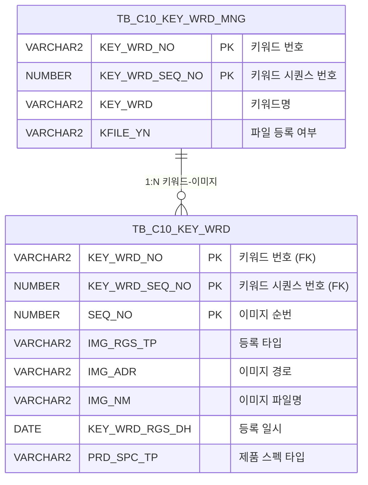

<h1 style="font-size: 40px; text-align: center; font-weight:
   bold; margin: 30px 0;">
  C106000160pop02 레거시 시스템 분석 종합 보고서
</h1>


# 1. 시스템 개요
- **서비스 ID**: C106000160pop02
- **업무명**: 디지털프린팅 이미지 등록 (팝업)
- **분석 일시**: 2026-03-17 12:13 KST
- **전체 Activity 수**: 2개 (Built-in)
- **분석자**: Claude Opus 4.6 / Sonnet (UI 분석)
- **분석 도구**: /analyze-service C106000160pop02
- **문서 버전**: 1.0

# 📊 비즈니스 프로세스 분석

## 시스템 목적

C106000160pop02는 디지털프린팅 키워드 관리 화면(C106000160)의 팝업 화면으로, 특정 키워드에 대한 이미지 파일을 등록/조회/삭제하는 기능을 제공한다.

부모 화면에서 키워드 번호(KEY_WRD_NO)와 키워드 시퀀스 번호(KEY_WRD_SEQ_NO)를 전달받아, 해당 키워드에 연결된 이미지 파일 목록을 그리드로 표시하고, dhtmlXVault 컴포넌트를 통해 이미지를 업로드하거나 기존 이미지를 다운로드/삭제할 수 있다. 이미지는 PRD_SPC_TP='8' 타입(디지털프린팅 이미지)으로 분류되어 관리된다.

파일 업로드 시 최대 1개 파일만 첨부 가능하며, 업로드 완료 후 자동으로 키워드 관리 테이블(TB_C10_KEY_WRD_MNG)의 파일 등록 여부(KFILE_YN)를 갱신한다.

## 주요 유즈케이스

### UC-01: 키워드 이미지 목록 조회
- **Actor**: 디지털프린팅 담당자
- **목적**: 특정 키워드에 등록된 디지털프린팅 이미지 파일 목록을 확인

- **전제조건**:
  - 부모 화면(C106000160)에서 키워드 선택 후 팝업 호출
  - KEY_WRD_NO, KEY_WRD_SEQ_NO 파라미터가 전달됨

- **주요 흐름**:
  1. 팝업 오픈 시 요청 파라미터(KEY_WRD_NO, KEY_WRD_SEQ_NO) 수신
  2. onVaultLoad 이벤트 발생 → dhtmlXVault 초기화 및 그리드 설정
  3. C106000160pop02_Grid_1.select 쿼리 실행 (PRD_SPC_TP='8' 필터)
  4. 그리드에 키워드, 순번, 구분(PC/모바일), 이미지명, 등록일자, 등록자 표시

- **대체 흐름**:
  - 조회 결과 없음: 빈 그리드 표시
  - 서브쿼리로 키워드명(KEY_WRD) 조회 실패: NULL로 표시

- **후행조건**:
  - 이미지 목록이 그리드에 표시됨
  - 파일 업로드/다운로드/삭제 가능 상태

### UC-02: 이미지 파일 업로드
- **Actor**: 디지털프린팅 담당자
- **목적**: 키워드에 새로운 디지털프린팅 이미지를 등록

- **전제조건**:
  - 팝업 화면이 열려 있고 파라미터가 설정됨
  - 그리드에 기존 파일이 없음 (최대 1개 제한)

- **주요 흐름**:
  1. dhtmlXVault 영역에 파일 드래그 또는 파일 선택
  2. vault.onAddFile 이벤트 → 그리드에 기존 파일 존재 시 추가 불가 처리
  3. 파일 업로드 시작 → `_uploadHandler5.jsp`로 전송
  4. vault.onUploadComplete 이벤트 → 성공 시 onLoadGrid 호출
  5. C106000160pop02.insert 쿼리 실행 (SEQ_NO 자동 채번)
  6. C106000160pop02.update 쿼리로 KFILE_YN 갱신

- **대체 흐름**:
  - 그리드에 이미 1개 파일 존재: "파일은 1개만 첨부가 가능합니다" 알림 → 업로드 차단
  - 업로드 실패: 실패 알림 표시

- **후행조건**:
  - TB_C10_KEY_WRD에 이미지 레코드 INSERT
  - TB_C10_KEY_WRD_MNG의 KFILE_YN='Y'로 갱신
  - 그리드 자동 재조회

### UC-03: 이미지 파일 다운로드
- **Actor**: 디지털프린팅 담당자
- **목적**: 등록된 이미지 파일을 로컬로 다운로드

- **전제조건**:
  - 그리드에 이미지 목록이 표시되어 있음

- **주요 흐름**:
  1. 그리드의 이미지명(IMG_NM) 컬럼(ahref_idx 타입) 클릭
  2. Grid_doLink 이벤트 발생
  3. `_fileDownloadHandler.jsp` 호출하여 파일 다운로드

- **대체 흐름**:
  - 파일 경로 오류: 다운로드 실패 알림

- **후행조건**:
  - 파일이 사용자 로컬에 다운로드됨

### UC-04: 이미지 파일 삭제
- **Actor**: 디지털프린팅 담당자
- **목적**: 등록된 이미지를 삭제

- **전제조건**:
  - 그리드에 삭제 대상 이미지가 존재

- **주요 흐름**:
  1. 그리드의 삭제 컬럼 클릭
  2. doImgDel 이벤트 발생
  3. `_fileDeleteHandler4.jsp` AJAX 호출로 서버 파일 삭제
  4. C106000160pop02.delete 쿼리 실행 (KEY_WRD_NO, KEY_WRD_SEQ_NO, SEQ_NO 기준)
  5. C106000160pop02.update 쿼리로 KFILE_YN 재계산 (이미지 0개면 'N', 1개 이상이면 'Y')
  6. 그리드 재조회

- **대체 흐름**:
  - 삭제 실패: 에러 알림 표시

- **후행조건**:
  - TB_C10_KEY_WRD에서 해당 레코드 DELETE
  - TB_C10_KEY_WRD_MNG의 KFILE_YN 갱신
  - 그리드 자동 재조회

---
## 비즈니스 로직 상세

### 1. 이미지 등록 타입 분류 (DECODE 변환)

- **목적**: 이미지 등록 장치 유형을 코드값에서 표시명으로 변환
- **처리 케이스**:

  **[케이스 1: 모바일 등록]**
  ```
    조건: IMG_RGS_TP = '2'
    처리: '모바일'로 표시
  ```

  **[케이스 2: PC 등록 (기본값)]**
  ```
    조건: IMG_RGS_TP ≠ '2' (또는 NULL)
    처리: 'PC'로 표시
  ```

### 2. 이미지 경로 변환

- **목적**: 서버 저장 경로를 웹 접근 가능한 상대 경로로 변환
- **처리 케이스**:

  **[케이스 1: 경로 변환]**
  ```
    입력: IMG_ADR (예: C:\upload\IMG_UPLOAD\2026\03\file.jpg)
    처리:
      1. IMG_ADR에서 'IMG_UPLOAD' 문자열 위치 검색 (INSTR)
      2. 해당 위치부터 끝까지 추출 (SUBSTR)
      3. 역슬래시(\)를 슬래시(/)로 변환 (REPLACE)
      4. 앞에 './' 접두어 추가
    결과: ./IMG_UPLOAD/2026/03/file.jpg/
  ```

### 3. SEQ_NO 자동 채번

- **목적**: 동일 키워드 내 이미지 순번 자동 증가
- **계산 공식**:
  ```
  신규 SEQ_NO = NVL(MAX(SEQ_NO), 0) + 1
  조건: KEY_WRD_NO = :IMG_RGS_FLAG_ID AND KEY_WRD_SEQ_NO = :IMG_RGS_FLAG_ID2
  ```

### 4. 파일 등록 여부(KFILE_YN) 자동 갱신

- **목적**: 키워드에 이미지 파일이 하나 이상 등록되어 있는지 자동 판별
- **계산 공식**:
  ```
  KFILE_YN = DECODE(COUNT(IMG_NM), 0, 'N', 'Y')
  조건: KEY_WRD_NO, KEY_WRD_SEQ_NO 일치 AND PRD_SPC_TP = '8'
  ```

---

# 💾 데이터 요구사항

## 핵심 테이블

### 1. TB_C10_KEY_WRD - (키워드 이미지 파일 정보)
| 컬럼명 | 타입 | PK | 설명 |
|--------|------|----|-----|
| KEY_WRD_NO | VARCHAR2 | ✅ | 키워드 번호 |
| KEY_WRD_SEQ_NO | NUMBER | ✅ | 키워드 시퀀스 번호 |
| SEQ_NO | NUMBER | ✅ | 이미지 순번 |
| IMG_RGS_TP | VARCHAR2 | | 이미지 등록 타입 (2=모바일, 그 외=PC) |
| IMG_ADR | VARCHAR2 | | 이미지 서버 저장 경로 |
| IMG_NM | VARCHAR2 | | 이미지 파일명 |
| KEY_WRD_RGS_DH | DATE | | 키워드 이미지 등록 일시 |
| KEY_WRD_RGS_PRS_ID | VARCHAR2 | | 등록자 ID |
| PRD_SPC_TP | VARCHAR2 | | 제품 스펙 타입 (8=디지털프린팅 이미지) |
| CREATED_OBJECT_TYPE | VARCHAR2 | | 생성 객체 유형 |
| CREATED_OBJECT_ID | VARCHAR2 | | 생성자 ID |
| CREATED_PROGRAM_ID | VARCHAR2 | | 생성 프로그램 ID |
| CREATION_TIMESTAMP | TIMESTAMP | | 생성 타임스탬프 |
| LAST_UPDATED_OBJECT_TYPE | VARCHAR2 | | 최종 수정 객체 유형 |
| LAST_UPDATED_OBJECT_ID | VARCHAR2 | | 최종 수정자 ID |
| LAST_UPDATE_PROGRAM_ID | VARCHAR2 | | 최종 수정 프로그램 ID |
| LAST_UPDATE_TIMESTAMP | TIMESTAMP | | 최종 수정 타임스탬프 |

### 2. TB_C10_KEY_WRD_MNG - (키워드 관리 마스터)
| 컬럼명 | 타입 | PK | 설명 |
|--------|------|----|-----|
| KEY_WRD_NO | VARCHAR2 | ✅ | 키워드 번호 |
| KEY_WRD_SEQ_NO | NUMBER | ✅ | 키워드 시퀀스 번호 |
| KEY_WRD | VARCHAR2 | | 키워드명 |
| KFILE_YN | VARCHAR2 | | 파일 등록 여부 (Y/N) |
| LAST_UPDATED_OBJECT_TYPE | VARCHAR2 | | 최종 수정 객체 유형 |
| LAST_UPDATED_OBJECT_ID | VARCHAR2 | | 최종 수정자 ID |
| LAST_UPDATE_PROGRAM_ID | VARCHAR2 | | 최종 수정 프로그램 ID |
| LAST_UPDATE_TIMESTAMP | TIMESTAMP | | 최종 수정 타임스탬프 |

## 데이터 플로우

### 1. 조회

```
[키워드 이미지 목록 조회]
팝업 진입 (KEY_WRD_NO, KEY_WRD_SEQ_NO 전달)
→ C106000160pop02_Grid_1.select
  FROM TB_C10_KEY_WRD
  서브쿼리: TB_C10_KEY_WRD_MNG (KEY_WRD 조회)
  WHERE KEY_WRD_NO = :KEY_WRD_NO
    AND KEY_WRD_SEQ_NO = :KEY_WRD_SEQ_NO
    AND PRD_SPC_TP = '8'
  DECODE(IMG_RGS_TP, '2', '모바일', 'PC') → 등록타입 변환
  SUBSTR + REPLACE → 이미지 경로 웹 경로 변환
→ Grid에 이미지 목록 표시
```

### 2. 업로드

```
[이미지 파일 업로드]
파일 선택/드래그
→ vault.onAddFile → 기존 파일 1개 존재 시 차단
→ _uploadHandler5.jsp로 파일 전송
→ C106000160pop02.insert
  INTO TB_C10_KEY_WRD
  VALUES (KEY_WRD_NO, KEY_WRD_SEQ_NO, 자동채번SEQ, 등록타입, 파일경로, 파일명, SYSDATE, 등록자ID, PRD_SPC_TP)
→ C106000160pop02.update
  UPDATE TB_C10_KEY_WRD_MNG SET KFILE_YN = DECODE(COUNT, 0, 'N', 'Y')
→ 그리드 재조회
```

### 3. 삭제

```
[이미지 파일 삭제]
삭제 버튼 클릭
→ _fileDeleteHandler4.jsp AJAX 호출 → 서버 파일 삭제
→ C106000160pop02.delete
  DELETE TB_C10_KEY_WRD
  WHERE KEY_WRD_NO = :IMG_RGS_FLAG_ID
    AND KEY_WRD_SEQ_NO = :IMG_RGS_FLAG_ID2
    AND SEQ_NO = :SEQ
→ C106000160pop02.update → KFILE_YN 재계산
→ 그리드 재조회
```

## SQL 일람표
| SQL 이름 | 쿼리 ID | 타입 | 출처 | 테이블 |
|---------|---------|-----|-------|-------|
| 키워드파일 조회 | C106000160pop02_Grid_1.select | SELECT | Service | TB_C10_KEY_WRD, TB_C10_KEY_WRD_MNG |
| 키워드이미지 업로드 | C106000160pop02.insert | INSERT | _uploadHandler5.jsp | TB_C10_KEY_WRD |
| 키워드 파일 삭제 | C106000160pop02.delete | DELETE | _fileDeleteHandler4.jsp | TB_C10_KEY_WRD |
| 키워드 파일 등록여부 yn | C106000160pop02.update | UPDATE | _fileDeleteHandler4.jsp / _uploadHandler5.jsp | TB_C10_KEY_WRD_MNG |

## ER 다이어그램 (핵심 관계)



관계 설명:
- TB_C10_KEY_WRD_MNG이 키워드 마스터 테이블로 허브 역할
- TB_C10_KEY_WRD는 KEY_WRD_NO + KEY_WRD_SEQ_NO를 통해 마스터와 1:N 관계
- 하나의 키워드에 여러 이미지(SEQ_NO 기반)가 등록 가능

---

# 🖥️ 사용자 인터페이스 요구사항

## 화면 레이아웃 상세

### Layout 구조 (Flat - 레이아웃 없음)
```javascript
{
  type: "flat",
  description: "레이아웃 프레임워크 없이 div에 직접 배치",
  components: [
    {
      id: "vault1",
      type: "vault",
      position: { top: 0, left: 0 },
      description: "dhtmlXVault 파일 업로드 영역"
    },
    {
      id: "C106000160pop02_Grid_1",
      type: "grid",
      position: { top: 260, left: 8, width: 430, height: 70 },
      description: "키워드 이미지 목록 그리드"
    },
    {
      id: "C106000160pop02_MessageBox_1",
      type: "messagebox",
      position: { top: 332, left: 0, width: 445, height: 23 },
      description: "상태 메시지 표시 영역"
    }
  ]
}
```

## 입출력 요소

### Vault 컴포넌트
**vault1 (dhtmlXVault 파일 업로드)**
- 업로드 핸들러: `_uploadHandler5.jsp`
- 최대 파일 수: 1개
- 히든 필드: IMG_RGS_TP, IMG_RGS_FLAG(=04), IMG_RGS_FLAG_ID(=KEY_WRD_NO), IMG_RGS_FLAG_ID2(=KEY_WRD_SEQ_NO), PRD_SPC_TP

### Grid 컴포넌트

**C106000160pop02_Grid_1 (키워드 이미지 목록)**
- 편집 가능 여부: 아니오 (읽기 전용)
- Split: 없음
- colwidth 단위: % (퍼센트)
- vertical: true
- multiselect: true
- 주요 컬럼 (12개):

  **표시 컬럼**:
  - KEY_WRD: ro - 키워드명 (19%, 중앙정렬)
  - SEQ_NO: ro - 순번 (8%, 중앙정렬)
  - IMG_RGS_TP: ro - 구분 (PC/모바일) (11%, 중앙정렬)
  - IMG_NM: ahref_idx - 이미지 파일명 (*, 좌측정렬, 클릭 시 파일 다운로드)
  - KEY_WRD_RGS_DH: ro - 등록일자 (20%, 중앙정렬)
  - KEY_WRD_RGS_PRS_ID: ro - 등록자 (16%, 중앙정렬)
  - DEL_IMG: ro - 삭제 버튼 (8%, 중앙정렬)

  **숨김 컬럼**:
  - KEY_WRD_SEQ_NO: ro - 키워드 시퀀스 번호 (숨김)
  - IMG_ADR: ro - 이미지 서버 경로 (숨김)
  - CHK_IMG_NM: ro - 체크용 이미지명 (숨김)
  - CHK_IMG_ADR: ro - 체크용 이미지 웹 경로 (숨김)
  - KEY_WRD_NO: ro - 키워드 번호 (숨김)

## 화면 동작 흐름

### 1. 화면 초기 로딩
```
1. 부모 화면(C106000160)에서 팝업 호출
2. 요청 파라미터 수신: KEY_WRD_NO, KEY_WRD_SEQ_NO, IMG_RGS_TP, PRD_SPC_TP
3. body.onload → onVaultLoad() 실행
4. dhtmlXVault 초기화 (업로드 핸들러, 히든 필드 설정)
5. 그리드 초기화 및 이벤트 바인딩
6. onLoadGrid() 자동 호출 → C106000160pop02_Grid_1.select 실행
7. 그리드에 이미지 목록 표시
8. 메시지박스 초기화
```

### 2. 이미지 업로드
```
1. 사용자가 vault 영역에 파일 드래그 또는 선택
2. vault.onAddFile 이벤트 → 그리드 행 수 확인
   - 행 존재 시: alert("파일은 1개만 첨부가 가능합니다") → 차단
   - 행 미존재 시: 업로드 진행
3. 서버로 파일 전송 (_uploadHandler5.jsp)
4. vault.onUploadComplete 이벤트
   - 성공: onLoadGrid() 호출 → 그리드 재조회
   - 실패: alert("Upload failed") 표시
```

### 3. 이미지 다운로드
```
1. 그리드의 IMG_NM 컬럼(ahref_idx) 클릭
2. Grid_doLink 이벤트 발생
3. 숨김 컬럼 CHK_IMG_ADR + CHK_IMG_NM으로 파일 경로 구성
4. _fileDownloadHandler.jsp 호출하여 다운로드
```

### 4. 이미지 삭제
```
1. 그리드의 DEL_IMG 컬럼 클릭
2. doImgDel 이벤트 발생
3. _fileDeleteHandler4.jsp AJAX 호출 (IMG_RGS_FLAG_ID, IMG_RGS_FLAG_ID2, SEQ 전달)
4. 서버에서 파일 물리 삭제 + DB 레코드 삭제
5. KFILE_YN 갱신
6. onLoadGrid() 호출 → 그리드 재조회
```

## JavaScript 모듈

**C106000160pop02.jsp** (인라인 스크립트)
- onVaultLoad(): 페이지 로드 시 dhtmlXVault 초기화 및 그리드 설정 (body.onload)
- onLoadGrid(): 그리드 데이터 조회 (gridC10Data.do → C106000160pop02-service 호출)
- Grid_doLink(id, ind): 그리드 ahref_idx 클릭 시 파일 다운로드 (_fileDownloadHandler.jsp)
- doImgDel(): 이미지 삭제 (_fileDeleteHandler4.jsp AJAX 호출)
- find(): 그리드 데이터 조회
- save(): 그리드 데이터 저장
- refresh(): 그리드 초기화 후 재조회
- add(): 그리드 신규 행 추가
- remove(): 그리드 선택 행 삭제
- copy(): 그리드 행 클립보드 복사
- undo(): 그리드 실행 취소
- redo(): 그리드 재실행
- onGridContextMenuClick(): 컨텍스트 메뉴 처리 (컬럼 이동, 헤더 필터, 편집 모드, 엑셀 내보내기)
- findMessage(): 앱 메시지 표시
- onXleGrid(): 엑셀 로드 완료 후 onLoadGrid 호출

## 주요 이벤트 핸들러

**vault.onAddFile (파일 추가 시)**
- 이벤트 타입: Vault File Add
- 처리 내용:
  1. 현재 그리드 행 수 확인
  2. 1개 이상 존재 시 "파일은 1개만 첨부가 가능합니다" 알림
  3. 파일 추가 차단 (return false)

**vault.onUploadComplete (업로드 완료 시)**
- 이벤트 타입: Vault Upload Complete
- 처리 내용:
  1. 서버 응답 확인
  2. 성공 시 onLoadGrid() 호출하여 그리드 재조회
  3. 실패 시 "Upload failed" 알림 표시

**Grid_doLink (그리드 링크 클릭)**
- 이벤트 타입: Grid ahref_idx Click
- 처리 내용:
  1. 클릭된 행의 숨김 컬럼(CHK_IMG_ADR, CHK_IMG_NM) 값 추출
  2. _fileDownloadHandler.jsp 호출
  3. 파일 다운로드 실행

**doImgDel (이미지 삭제)**
- 이벤트 타입: 삭제 버튼 클릭
- 처리 내용:
  1. 선택된 행의 KEY_WRD_NO, KEY_WRD_SEQ_NO, SEQ_NO 추출
  2. _fileDeleteHandler4.jsp AJAX 호출
  3. 서버 응답 확인
  4. 성공 시 onLoadGrid() 호출하여 그리드 재조회

---

# 📌 특이사항 및 주의사항

## 1. 파일 업로드 1개 제한 로직
- dhtmlXVault의 onAddFile 이벤트에서 그리드 행 수를 확인하여 1개 파일만 허용. 서버측 검증 없이 **클라이언트측 JavaScript로만** 제한하고 있어, 직접 API 호출 시 제한이 우회될 수 있다.

## 2. 이미지 경로 변환 하드코딩
- SQL에서 `'IMG_UPLOAD'` 문자열을 INSTR로 검색하여 웹 경로로 변환하는 로직이 하드코딩되어 있다. 서버 파일 저장 경로 구조가 변경되면 쿼리 수정이 필요하다.
- 역슬래시를 슬래시로 변환하는 `REPLACE(... '\', '/')` 패턴으로 보아 Windows 서버 경로를 웹 경로로 변환한다.

## 3. PRD_SPC_TP='8' 하드코딩
- SELECT 쿼리에서 `PRD_SPC_TP = '8'`이 WHERE 절에 하드코딩되어 있다. 이 값이 '디지털프린팅 이미지' 타입을 의미하지만, 파라미터로 PRD_SPC_TP를 받으면서도 조회 시에는 고정값 '8'을 사용하는 불일치가 존재한다.

## 4. 외부 JSP 핸들러 의존성
- 파일 업로드(`_uploadHandler5.jsp`), 다운로드(`_fileDownloadHandler.jsp`), 삭제(`_fileDeleteHandler4.jsp`)를 외부 JSP 핸들러에 의존한다. 이 핸들러들은 C10 모듈 공통이므로 수정 시 영향 범위 확인이 필요하다.

## 5. INSERT 시 SEQ_NO 동시성 이슈
- `NVL(MAX(SEQ_NO),0)+1` 패턴으로 순번을 채번하고 있어, 동시 업로드 시 중복 SEQ_NO가 발생할 수 있다. 다만 1개 파일 제한으로 실제 동시성 이슈 발생 가능성은 낮다.

## 6. KFILE_YN 자동 동기화
- 업로드/삭제 후 UPDATE 쿼리로 TB_C10_KEY_WRD_MNG의 KFILE_YN을 COUNT 기반 자동 갱신한다. 트랜잭션이 분리된 경우(JSP 핸들러 → 별도 DB 커넥션) 데이터 정합성에 주의가 필요하다.

---

# 📚 참고 문서

- **Query SQL**: `src/query/C106000160pop02-query.glue_sql`
- **Service XML**: `src/service/C106000160pop02-service.xml`
- **JSP**: `WebContents/C106000160pop02.jsp`
- **Grid XML**: `WebContents/header/kr/C106000160pop02/C106000160pop02_Grid_1.xml`
