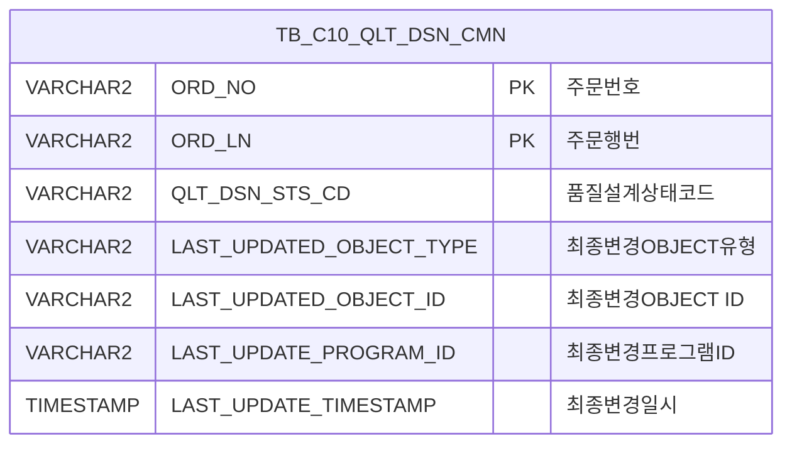

<h1 style="font-size: 40px; text-align: center; font-weight:
   bold; margin: 30px 0;">
  C106000170pop01 레거시 시스템 분석 종합 보고서
</h1>


# 1. 시스템 개요
- **서비스 ID**: C106000170pop01
- **업무명**: 설계상태변경 (팝업)
- **분석 일시**: 2026-03-17 (KST)
- **전체 Activity 수**: 2개 (Built-in 2)
- **분석자**: Claude Opus 4.6
- **분석 도구**: /analyze-service C106000170pop01
- **문서 버전**: 1.0

# 📊 비즈니스 프로세스 분석

## 시스템 목적

C106000170pop01은 품질설계 관리 화면(C106000170)에서 호출되는 **팝업 화면**으로, 특정 주문의 **품질설계 상태코드(QLT_DSN_STS_CD)를 변경**하는 단순 기능을 제공한다. 부모 화면에서 주문번호(ORD_NO)와 주문행번(ORD_LN)을 URL 파라미터로 전달받아 폼에 표시하고, 사용자가 "상태변경" 버튼을 클릭하면 확인 다이얼로그 후 품질설계공통 테이블(TB_C10_QLT_DSN_CMN)의 상태코드를 업데이트한다.

Custom Activity 없이 Built-in Activity(PosDefaultRouter, GridUpdate)만으로 구성된 단순 서비스로, 비즈니스 로직이 SQL UPDATE 한 건에 집중되어 있다.

## 주요 유즈케이스

### UC-01: 품질설계 상태코드 변경
- **Actor**: 품질설계 담당자
- **목적**: 특정 주문의 품질설계 상태를 수동으로 변경하여 설계 프로세스 진행/재설계를 제어

- **전제조건**:
  - 사용자가 부모 화면(C106000170)에서 대상 주문을 선택하여 팝업을 호출
  - URL 파라미터로 ORD_NO, ORD_LN이 전달됨
  - 해당 주문이 TB_C10_QLT_DSN_CMN에 등록되어 있음

- **주요 흐름**:
  1. 팝업 창 오픈 시 onFormLoad1 이벤트로 URL 파라미터(ORD_NO, ORD_LN) 값을 폼에 세팅
  2. 사용자가 폼의 "상태변경" 버튼 클릭
  3. ORD_NO, ORD_LN null 체크 (null이면 "주문번호없이 설계 상태변경 할 수 없습니다." 알림 후 종료)
  4. 확인 다이얼로그 표시 ("상태변경 하시겠습니까?")
  5. 확인 시 handleDataProcess.do 호출 → PosDefaultRouter → save transition → 설계여부업데이트
  6. C106000170.update 실행: TB_C10_QLT_DSN_CMN의 QLT_DSN_STS_CD 변경 + 감사 컬럼 갱신

- **대체 흐름**:
  - ORD_NO 또는 ORD_LN이 null: "주문번호없이 설계 상태변경 할 수 없습니다." 알림 표시, 처리 중단
  - 확인 다이얼로그에서 "취소" 클릭: 처리 중단

- **후행조건**:
  - TB_C10_QLT_DSN_CMN의 QLT_DSN_STS_CD가 변경됨
  - 감사 컬럼(LAST_UPDATED_*) 갱신됨

---
## 비즈니스 로직 상세

### 1. 품질설계 상태코드 UPDATE

- **목적**: 특정 주문의 품질설계 상태를 지정된 값으로 변경하여 설계 워크플로우를 제어

- **처리 케이스**:

  **[케이스 1: 상태 변경 실행]**
  ```
    조건: ORD_NO, ORD_LN이 유효하고 사용자가 확인
    처리:
      1. QLT_DSN_STS_CD를 폼에서 전달된 값으로 UPDATE
      2. 감사 컬럼 갱신 (ObjectType, ObjectId, ProgramId, Timestamp)
      3. WHERE 조건: ORD_NO + ORD_LN (PK 기반 단건 UPDATE)
  ```

  **[케이스 2: 주문번호 없음]**
  ```
    조건: ORD_NO 또는 ORD_LN이 null
    처리:
      1. "주문번호없이 설계 상태변경 할 수 없습니다." 알림
      2. 처리 중단 (return)
  ```

---

# 💾 데이터 요구사항

## 핵심 테이블

### 1. TB_C10_QLT_DSN_CMN - (품질설계 공통 테이블, MESAPUSER 스키마)
| 컬럼명 | 타입 | PK | 설명 |
|--------|------|----|-----|
| ORD_NO | VARCHAR2 | ✅ | 주문번호 |
| ORD_LN | VARCHAR2 | ✅ | 주문행번 |
| QLT_DSN_STS_CD | VARCHAR2 | | 품질설계상태코드 |
| LAST_UPDATED_OBJECT_TYPE | VARCHAR2 | | 최종변경OBJECT유형 |
| LAST_UPDATED_OBJECT_ID | VARCHAR2 | | 최종변경OBJECT ID |
| LAST_UPDATE_PROGRAM_ID | VARCHAR2 | | 최종변경프로그램ID |
| LAST_UPDATE_TIMESTAMP | TIMESTAMP | | 최종변경일시 |

## 데이터 플로우

### 1. 품질설계 상태 변경
```
[팝업에서 상태코드 변경 실행]
사용자가 "상태변경" 버튼 클릭
→ save 이벤트 발생
  ORD_NO, ORD_LN null 체크
  확인 다이얼로그
→ handleDataProcess.do 호출
  customParam = {ORD_NO, ORD_LN}
→ C106000170.update
  UPDATE TB_C10_QLT_DSN_CMN
  SET QLT_DSN_STS_CD = :QLT_DSN_STS_CD
      + 감사 컬럼 (LAST_UPDATED_*)
  WHERE ORD_NO = :ORD_NO AND ORD_LN = :ORD_LN
→ 상태 변경 완료
```

## SQL 일람표
| SQL 이름 | 쿼리 ID | 타입 | 출처 | 테이블 |
|---------|---------|-----|-------|-------|
| 품질설계 상태변경 | C106000170.update | UPDATE | Service | TB_C10_QLT_DSN_CMN |

## ER 다이어그램 (핵심 관계)



관계 설명:
- 단일 테이블 UPDATE 서비스로 ER 관계가 없음
- TB_C10_QLT_DSN_CMN은 품질설계 공통 마스터 테이블로, ORD_NO + ORD_LN이 PK

---

# 🖥️ 사용자 인터페이스 요구사항

## 화면 레이아웃 상세

### Layout 구조 (팝업 - flat 구조)
```javascript
{
  itemType: "popup",
  width: "382px",
  height: "259px",
  components: [
    {
      id: "C106000170pop01_Form_1",
      type: "form",
      height: "236px",
      width: "382px",
      position: { left: "0px", top: "0px" }
    },
    {
      id: "C106000170pop01_messagebox",
      type: "messagebox",
      height: "23px",
      width: "380px",
      position: { left: "0px", top: "228px" }
    }
  ]
}
```

## 입출력 요소

### Form 컴포넌트
**C106000170pop01_Form_1**
- ORD_NO: input - 주문번호 (80px, disabled, 읽기 전용)
- ORD_LN: input - 주문행번 (40px, disabled, 읽기 전용, 라벨 "-")
- QLT_DSN_STS_CD: input - 품질설계상태코드 (40px, disabled, 읽기 전용, 라벨 "-")
- 상태변경: Button - save 커맨드 → save 이벤트
- 닫기: Button - winClose 커맨드 → 팝업 닫기

### Messagebox 컴포넌트
**C106000170pop01_messagebox**
- 상태 메시지 표시 영역 (23px 높이)
- "조회되었습니다." 메시지 표시 (findMessage)

## 화면 동작 흐름

### 1. 팝업 초기 로딩
```
1. 부모 화면(C106000170)에서 팝업 호출 (URL 파라미터로 ORD_NO, ORD_LN 전달)
2. ui.initializeDHTMLX() 호출하여 DHTMLX 컴포넌트 초기화
3. C106000170pop01_Form_1의 onXLE 이벤트에 onFormLoad1 핸들러 등록
4. onFormLoad1 실행:
   - request.getParameter("ORD_NO") → 폼 ORD_NO 필드에 세팅
   - request.getParameter("ORD_LN") → 폼 ORD_LN 필드에 세팅
5. 폼 필드에 주문번호/행번 표시 (모두 disabled 상태)
```

### 2. 상태변경 실행
```
1. 사용자가 "상태변경" 버튼 클릭
2. save 함수 호출
3. 폼에서 ORD_NO, ORD_LN 값 읽기
4. null 체크: ORD_NO 또는 ORD_LN이 null이면 알림 후 종료
5. dhtmlx.confirm 다이얼로그 표시 ("상태변경 하시겠습니까?")
6. 확인 시:
   - customParam = {ORD_NO: ord_no, ORD_LN: ord_ln}
   - uiFormObj.sendForm("handleDataProcess.do", 'C106000170pop01_Form_1', 'save', customParam)
7. 서버: PosDefaultRouter → save → 설계여부업데이트 (C106000170.update)
8. 상태변경 완료
```

## JavaScript 모듈

**C106000170pop01.jsp** (인라인 스크립트)
- save(eventName, formDivObj, referenceItem): 상태변경 실행 (ORD_NO/ORD_LN null 체크 → dhtmlx.confirm → sendForm("handleDataProcess.do"))
- find(eventName, formDivObj, referenceItem): 빈 함수 (미사용)
- findAfter(): 조회 완료 콜백 (uiCommon.progressOff → findMessage)
- findMessage(): messagebox에 "조회되었습니다." 표시 (uiCommon.message 호출)
- onFormLoad1(): 폼 초기화 - URL 파라미터(ORD_NO, ORD_LN)를 폼에 세팅 (request.getParameter)
- refresh(referenceItem): 빈 함수 (미사용)
- add(referenceItem): 행 추가 (items[referenceItem].addRow)
- remove(referenceItem): 행 삭제 (items[referenceItem].removeRow)
- copy(referenceItem): 행 복사 (items[referenceItem].copyRowContent)
- undo(referenceItem): 실행 취소 (items[referenceItem].undo)
- redo(referenceItem): 재실행 (items[referenceItem].redo)
- onGridContextMenuClick(id, gridObj, menuObj): 그리드 컨텍스트 메뉴 이벤트 (미사용 - 그리드 없음)

## 주요 이벤트 핸들러

**save (상태변경 버튼 클릭)**
- 이벤트 타입: Button Click (save command)
- 처리 내용:
  1. C106000170pop01_Form_1에서 ORD_NO, ORD_LN 값 읽기 (getItemValue)
  2. null 체크 → 실패 시 dhtmlx.alert 표시 후 return
  3. dhtmlx.confirm 다이얼로그 표시
  4. 확인 시 customParam 구성 → sendForm으로 handleDataProcess.do 호출

**onFormLoad1 (폼 로드 이벤트)**
- 이벤트 타입: XLE Event (onXle1)
- 처리 내용:
  1. request.getParameter("ORD_NO") 값을 폼 ORD_NO 필드에 세팅
  2. request.getParameter("ORD_LN") 값을 폼 ORD_LN 필드에 세팅

---

# 📌 특이사항 및 주의사항

## 1. QLT_DSN_STS_CD 값이 폼에서 hidden으로 전달됨
- **폼 필드 QLT_DSN_STS_CD는 disabled 상태로 표시**: 사용자가 직접 입력하지 않고, 부모 화면에서 URL 파라미터 또는 폼 초기값으로 전달되는 것으로 추정된다. 그러나 onFormLoad1에서 QLT_DSN_STS_CD를 세팅하는 코드가 없어, 이 값이 어떻게 전달되는지 명확하지 않다. GridUpdate Activity가 폼 전체 필드를 바인딩하므로 폼 XML에서 기본값이 설정되어 있을 가능성이 있다.

## 2. JSP에서 직접 request.getParameter 사용 (XSS 취약점)
- **보안 위험**: `<%=request.getParameter("ORD_NO")%>`와 `<%=request.getParameter("ORD_LN")%>`가 직접 JavaScript 코드에 삽입되어 있다. 입력값 이스케이프 없이 출력되므로 XSS(Cross-Site Scripting) 공격에 취약하다. 악의적인 URL 파라미터 주입으로 JavaScript 코드 실행이 가능하다.

## 3. 다수의 미사용 함수 포함
- **템플릿 기반 생성 흔적**: find, refresh, add, remove, copy, undo, redo, onGridContextMenuClick 등 이 팝업에서 사용하지 않는 함수들이 포함되어 있다. 이는 GLUE Framework의 JSP 템플릿에서 자동 생성된 코드로, 실제 비즈니스 로직에는 영향이 없으나 코드 크기를 불필요하게 증가시킨다.

## 4. 주석 처리된 C106000130pop01 참조
- **다른 서비스 코드 잔재**: JSP 117-125줄에 `C106000130pop01_Form_1` 참조가 주석 처리되어 있다. 다른 팝업(C106000130pop01)의 코드를 복사하여 이 팝업을 생성한 것으로 보이며, 주석 정리가 되지 않은 상태이다.

## 5. 트랜잭션 매니저 tx1 선언
- **서비스 XML에 tx1이 선언**되어 있으나, GridUpdate의 isAudit=true로 감사 로그가 기록된다. 단일 UPDATE 쿼리이므로 트랜잭션 복잡도는 낮다.

---

# 📚 참고 문서

- **Query SQL**: `src/query/C106000170pop01-query.glue_sql` (C106000170.update)
- **Service XML**: `src/service/C106000170pop01-service.xml`
- **JSP**: `WebContents/C106000170pop01.jsp`
- **Form XML**: `WebContents/header/kr/C106000170pop01/C106000170pop01_Form_1.xml`
