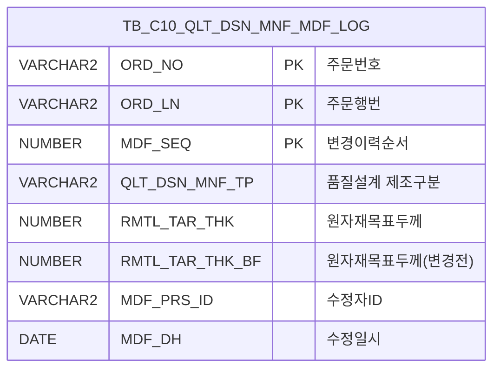

<h1 style="font-size: 40px; text-align: center; font-weight:
   bold; margin: 30px 0;">
  C106000180 레거시 시스템 분석 종합 보고서
</h1>


# 1. 시스템 개요
- **서비스 ID**: C106000180
- **업무명**: 품질설계 수정이력현황
- **분석 일시**: 2026-03-17 (KST)
- **전체 Activity 수**: 2개 (Built-in: 2개, Custom: 0개)
- **분석자**: Claude Opus 4.6 / Sonnet 4.6
- **분석 도구**: /analyze-service C106000180
- **문서 버전**: 1.0

# 📊 비즈니스 프로세스 분석

## 시스템 목적

C106000180은 **품질설계 수정이력현황** 조회 화면으로, C10(냉연) 공정에서 품질설계 제조 사양이 변경된 이력을 추적·조회하는 서비스이다. 주문번호/행번 기준으로 원자재 목표두께, PLTCM 설계값, CGL(연속용융아연도금) 공정 설정값, 조질압연/소둔 조건 등 품질설계 제조 파라미터의 변경 전/후 값을 비교하여 표시한다.

이 화면은 품질설계 변경 사유 추적, 품질 이슈 발생 시 원인 분석, 변경 이력 감사(audit) 등의 목적으로 사용된다. 단일 테이블(`TB_C10_QLT_DSN_MNF_MDF_LOG`)에 대한 조회 전용 서비스로, 데이터 수정 기능은 제공하지 않는다.

## 주요 유즈케이스

### UC-01: 기간별 품질설계 수정이력 조회
- **Actor**: 품질설계 담당자 / 공정 엔지니어
- **목적**: 특정 기간 동안 변경된 품질설계 제조 사양 이력을 조회하여 변경 추이 및 변경 내역을 파악

- **전제조건**:
  - 사용자가 시스템에 로그인되어 있음
  - C106000180 화면 접근 권한이 있음
  - TB_C10_QLT_DSN_MNF_MDF_LOG 테이블에 이력 데이터가 존재함

- **주요 흐름**:
  1. 화면 진입 시 품질설계수정일자가 자동 설정됨 (시작일: 1개월 전, 종료일: 오늘)
  2. 화면 로드 완료 시 기본 날짜 범위로 자동 조회 실행 (`onGridLoadEvent`)
  3. Grid에 변경이력 목록 표시 (주문번호, 행번, 변경순서, 제조구분, 변경 전/후 값)
  4. 필요 시 조건 변경 후 조회 버튼 클릭

- **대체 흐름**:
  - 날짜 미입력 시: "일자를 입력하지 않았습니다!" 알림 표시, MDF_DH_STR에 포커스
  - 시작일 > 종료일 시: "일자를 잘못 입력하였습니다!" 알림 표시, MDF_DH_STR에 포커스
  - 조회 결과 없음: Grid에 빈 데이터 표시

- **후행조건**:
  - 조회된 이력 데이터가 Grid에 표시됨
  - 사용자가 컨텍스트 메뉴로 셀 복사 또는 엑셀 다운로드 가능

### UC-02: 주문번호 기준 수정이력 조회
- **Actor**: 품질설계 담당자
- **목적**: 특정 주문의 품질설계 변경 이력만 집중 조회

- **전제조건**:
  - 조회 대상 주문번호를 알고 있음

- **주요 흐름**:
  1. 주문번호(ORD_NO) 입력 (자동 대문자 변환)
  2. 필요 시 주문행번(ORD_LN) 입력
  3. 조회 버튼 클릭
  4. 해당 주문의 변경이력만 Grid에 표시

- **대체 흐름**:
  - 주문번호 입력 시 날짜 조건 무시: SQL에서 ORD_NO||ORD_LN이 빈 값이 아니면 날짜 범위를 1900-01-01 ~ 3000-12-31로 확장하여 전 기간 조회
  - 주문번호가 LIKE 검색이므로 부분 입력으로 복수 주문 조회 가능

- **후행조건**:
  - 특정 주문의 전체 변경 이력이 시간순으로 표시됨

### UC-03: 수정이력 데이터 엑셀 내보내기
- **Actor**: 품질설계 담당자 / 관리자
- **목적**: 조회된 수정이력 데이터를 엑셀 파일로 다운로드하여 오프라인 분석 또는 보고서 작성에 활용

- **전제조건**:
  - Grid에 조회된 데이터가 존재함

- **주요 흐름**:
  1. Grid 영역에서 마우스 우클릭으로 컨텍스트 메뉴 호출
  2. "excel_grid" 메뉴 선택
  3. `gridObj.toExcel()` 호출로 서버 측 엑셀 생성
  4. 엑셀 파일 다운로드

- **대체 흐름**:
  - 데이터 없이 엑셀 내보내기 시: 빈 엑셀 파일 생성

- **후행조건**:
  - 엑셀 파일이 사용자 PC에 다운로드됨

---
## 비즈니스 로직 상세

### 1. 날짜 조건과 주문번호 조건의 동적 분기

- **목적**: 사용자의 검색 조건 입력 패턴에 따라 날짜 범위 적용 방식을 자동 조정
- **처리 케이스**:

  **[케이스 1: 주문번호 미입력 - 날짜 기반 조회]**
  ```
    조건: ORD_NO와 ORD_LN이 모두 빈 값 (ORD_NO||ORD_LN = '')
    처리:
      1. DECODE 함수가 사용자 입력 날짜(MDF_DH_STR, MDF_DH_END)를 그대로 사용
      2. MDF_DH BETWEEN TO_DATE(:MDF_DH_STR) AND TO_DATE(:MDF_DH_END) + 1
      3. ORD_NO LIKE '%', ORD_LN LIKE '%' (전체 주문 대상)
  ```

  **[케이스 2: 주문번호 입력 - 전 기간 조회]**
  ```
    조건: ORD_NO 또는 ORD_LN이 입력됨 (ORD_NO||ORD_LN != '')
    처리:
      1. DECODE 함수가 날짜 조건을 무시
      2. MDF_DH_STR이 NULL이면 '1900-01-01', MDF_DH_END가 NULL이면 '3000-12-31' 적용
      3. 사실상 전 기간 조회 (날짜 제한 없음)
      4. ORD_NO LIKE '[입력값]%', ORD_LN LIKE '[입력값]%' (와일드카드 검색)
  ```

- **계산 공식**:
  ```
  날짜 시작값 = DECODE(:ORD_NO||:ORD_LN, '', :MDF_DH_STR, NVL(:MDF_DH_STR, '1900-01-01'))
  날짜 종료값 = DECODE(:ORD_NO||:ORD_LN, '', :MDF_DH_END, NVL(:MDF_DH_END, '3000-12-31')) + 1일

  종료일에 +1일 하여 종료일 당일 23:59:59까지의 데이터를 포함
  ```

### 2. 변경 전/후 값 비교 구조

- **목적**: 품질설계 제조 파라미터의 변경 전 값(`_BF` 접미사)과 변경 후 값(현재값)을 한 레코드에 나란히 저장하여 비교 조회 가능하게 함
- **처리 케이스**:

  **[케이스 1: 공정별 설계값 변경 추적]**
  ```
    대상 공정 및 파라미터:
      - PLTCM: 두께(THK_TRV/LLV/ULV), 폭(WTH_TRV), 5단 WR 타입, 슬리브 사용, 엣지 지정
      - 2CGL/3CGL/4CGL/5CGL: 열처리사이클번호, 가열온도, 냉각온도, 침적시간, 라인속도
      - 조질압연: 조도 Ra(LLV/ULV), PPI(LLV/ULV), 패스횟수, 폭
      - 소둔(일반/HC): 열처리사이클번호, 코일온도, 냉각종료온도
      - EGL: 두께, 폭
      - CGL: 두께, 폭, 도금부착량(TRV/LLV/ULV), 레벨링 여부, 갈바 두께
      - 도금중량: 총(LLV/ULV/TRV), 표/이면(LLV/ULV)
  ```

---

# 💾 데이터 요구사항

## 핵심 테이블

### 1. TB_C10_QLT_DSN_MNF_MDF_LOG - (품질설계 제조 수정이력 로그)
| 컬럼명 | 타입 | PK | 설명 |
|--------|------|----|-----|
| ORD_NO | VARCHAR2 | ✅ | 주문번호 |
| ORD_LN | VARCHAR2 | ✅ | 주문행번 |
| MDF_SEQ | NUMBER | ✅ | 변경이력순서 |
| QLT_DSN_MNF_TP | VARCHAR2 | | 품질설계 제조구분 |
| RMTL_TAR_THK | NUMBER | | 원자재목표두께 (변경 후) |
| RMTL_TAR_THK_BF | NUMBER | | 원자재목표두께 (변경 전) |
| RMTL_TAR_THK_LVL | NUMBER | | 원자재목표두께 하한 (변경 후) |
| RMTL_TAR_THK_LVL_BF | NUMBER | | 원자재목표두께 하한 (변경 전) |
| RMTL_TAR_THK_UVL | NUMBER | | 원자재목표두께 상한 (변경 후) |
| RMTL_TAR_THK_UVL_BF | NUMBER | | 원자재목표두께 상한 (변경 전) |
| RMTL_TAR_WTH | NUMBER | | 원자재목표폭 (변경 후) |
| RMTL_TAR_WTH_BF | NUMBER | | 원자재목표폭 (변경 전) |
| PLTCM_5STD_WR_TP | VARCHAR2 | | PLTCM 5단 WR 타입 |
| PLTCM_SLV_USE_YN | VARCHAR2 | | PLTCM 슬리브 사용여부 |
| PLTCM_EDG_ASG_TP | VARCHAR2 | | PLTCM 엣지 지정 타입 |
| PL_WTH_TRV | NUMBER | | PL 폭 목표값 |
| PLTCM_THK_TRV | NUMBER | | PLTCM 두께 목표값 |
| PLTCM_THK_LLV | NUMBER | | PLTCM 두께 하한 |
| PLTCM_THK_ULV | NUMBER | | PLTCM 두께 상한 |
| PLTCM_WTH_TRV | NUMBER | | PLTCM 폭 목표값 |
| HEAT_CYL_NO_2CGL | VARCHAR2 | | 2CGL 열처리사이클번호 |
| HTG_TEM_2CGL | NUMBER | | 2CGL 가열온도 |
| CLG_TEM_2CGL | NUMBER | | 2CGL 냉각온도 |
| SHK_TM_2CGL | NUMBER | | 2CGL 침적시간 |
| LN_SPD_2CGL | NUMBER | | 2CGL 라인속도 |
| WK_GW_TOT_LLV | NUMBER | | 도금중량 총 하한 |
| WK_GW_TOT_ULV | NUMBER | | 도금중량 총 상한 |
| WK_GW_TRV | NUMBER | | 도금중량 목표값 |
| GAL_THK_TRV | NUMBER | | 갈바 두께 목표값 |
| CGL_LVL_YN | VARCHAR2 | | CGL 레벨링 여부 |
| RSN_ATT_AMT_TRV | NUMBER | | 수지부착량 목표값 |
| TM_PASS_CNT | NUMBER | | 조질압연 패스횟수 |
| ROU_RA_LLV | NUMBER | | 조도 Ra 하한 |
| ROU_RA_ULV | NUMBER | | 조도 Ra 상한 |
| ROU_PPI_LLV | NUMBER | | 조도 PPI 하한 |
| ROU_PPI_ULV | NUMBER | | 조도 PPI 상한 |
| HEAT_CYL_NO_GEN_ANN | VARCHAR2 | | 일반소둔 열처리사이클번호 |
| COIL_TMP_GEN_ANN | NUMBER | | 일반소둔 코일온도 |
| CLG_END_TMP_GEN_ANN | NUMBER | | 일반소둔 냉각종료온도 |
| HEAT_CYL_NO_HC_ANN | VARCHAR2 | | HC소둔 열처리사이클번호 |
| COR_TM_HC_ANN | NUMBER | | HC소둔 균열시간 |
| COIL_TMP_HC_ANN | NUMBER | | HC소둔 코일온도 |
| CLG_END_TMP_HC_ANN | NUMBER | | HC소둔 냉각종료온도 |
| EGL_THK_TRV | NUMBER | | EGL 두께 목표값 |
| EGL_WTH_TRV | NUMBER | | EGL 폭 목표값 |
| MDF_PRS_ID | VARCHAR2 | | 수정자 ID |
| MDF_DH | DATE | | 수정일시 |

> **참고**: 위 테이블에서 `_BF` 접미사가 붙은 컬럼은 변경 전 값을 저장하며, 접미사 없는 동일 이름 컬럼은 변경 후 값을 저장한다. 3CGL/4CGL/5CGL 공정의 설계값도 동일 패턴으로 저장된다 (총 약 130개 컬럼).

## 데이터 플로우

### 1. 조회

```
[화면 로딩 시 기본 조회]
화면 진입 → onFormLoadEvent (날짜 기본값 설정)
→ onGridLoadEvent (자동 조회)
→ C106000180.select
  FROM C10APUSER.TB_C10_QLT_DSN_MNF_MDF_LOG A
  WHERE A.MDF_DH BETWEEN TO_DATE(DECODE(...)) AND TO_DATE(DECODE(...)) + 1
    AND A.ORD_NO LIKE :ORD_NO||'%'
    AND A.ORD_LN LIKE :ORD_LN||'%'
  ORDER BY MDF_DH
→ Grid_1에 이력 목록 표시

[조건 변경 후 재조회]
조회 버튼 클릭 → find()
→ 날짜 유효성 검증 (빈 값 확인, 시작일≤종료일)
→ uiCommon.parameters() 파라미터 구성
→ C106000180.select 실행
→ Grid_1에 결과 표시
```

## SQL 일람표
| SQL 이름 | 쿼리 ID | 타입 | 출처 | 테이블 |
|---------|---------|-----|-------|-------|
| 품질설계 수정이력 조회 | C106000180.select | SELECT | Service | TB_C10_QLT_DSN_MNF_MDF_LOG |

## ER 다이어그램 (핵심 관계)



관계 설명:
- 단일 테이블 구조로, 별도의 조인 관계 없음
- PK는 ORD_NO + ORD_LN + MDF_SEQ 복합키로 구성
- MDF_SEQ가 변경 순서를 나타내며, 동일 주문에 대해 여러 변경 이력 레코드 존재 가능

---

# 🖥️ 사용자 인터페이스 요구사항

## 화면 레이아웃 상세

### Layout 구조 (절대 위치 기반)
```javascript
{
  type: "absolute",
  components: [
    {
      id: "C106000180_Form_1",
      type: "form",
      position: { left: 0, top: 0, width: 981, height: 31 },
      service: "C106000180-service",
      actionType: "find"
    },
    {
      id: "C106000180_Grid_1",
      type: "grid",
      position: { left: 1, top: 36, width: 977, height: 530 },
      contextmenu: true,
      pageset: true,
      rowCnt: 22
    },
    {
      id: "messagebox",
      type: "messagebox",
      position: { left: 1, top: 567, width: 977, height: 19 }
    }
  ]
}
```

## 입출력 요소

### Form 컴포넌트
**C106000180_Form_1**
- ORD_NO: input(텍스트) - 주문번호 입력 (75px, maxLength 10, 자동 대문자 변환)
- ~: label - 구분자
- ORD_LN: input(텍스트) - 주문행번 입력 (30px, maxLength 3)
- MDF_DH_STR: calendar - 품질설계수정일자 시작 (75px, YYYY-MM-DD, 기본값: 1개월 전)
- ~: label - 구분자
- MDF_DH_END: calendar - 품질설계수정일자 종료 (75px, YYYY-MM-DD, 기본값: 오늘)
- find: button - 조회 (security="true"로 권한 연동)
- winClose: button - 닫기

### Grid 컴포넌트

**C106000180_Grid_1 (품질설계 수정이력 그리드)**
- 편집 가능 여부: 아니오 (읽기 전용, 전 컬럼 ro)
- Split: 0 (고정 컬럼 없음)
- 설정: smartRendering(true), stableSorting(true), multiselect(true), colwidthUnit(%)
- 주요 컬럼 (10개):

  **기본 정보**:
  - ORD_NO: ro - 주문번호 (8%, 중앙정렬, 문자열 정렬)
  - ORD_LN: ro - 행번 (4%, 중앙정렬, 숫자 정렬)
  - MDF_SEQ: ro - 변경이력순서 (10%, 중앙정렬, 문자열 정렬)
  - QLT_DSN_MNF_TP: ro - 제조구분 (7%, 중앙정렬, 정렬불가)

  **변경 후 값**:
  - RMTL_TAR_THK: ro - 원자재목표두께 (14%, 좌측정렬, 정렬불가)
  - RMTL_TAR_THK_LVL: ro - 원자재목표두께하한 (14%, 좌측정렬, 정렬불가)
  - RMTL_TAR_THK_UVL: ro - 원자재목표두께상한 (14%, 좌측정렬, 정렬불가)

  **변경 전 값**:
  - RMTL_TAR_THK_BF: ro - 원자재목표두께(변경전) (18%, 좌측정렬, 정렬불가)
  - RMTL_TAR_THK_LVL_BF: ro - 원자재목표두께하한(변경전) (18%, 좌측정렬, 정렬불가)
  - RMTL_TAR_THK_UVL_BF: ro - 원자재목표두께상한(변경전) (18%, 좌측정렬, 정렬불가)

> **참고**: Grid XML에는 10개 컬럼이 정의되어 있으나, SQL에서 조회하는 컬럼은 약 130개로 훨씬 많다. Grid에 표시되지 않는 컬럼 데이터도 조회되지만 화면에는 원자재목표두께 관련 값만 표시된다.

## 화면 동작 흐름

### 1. 화면 초기 로딩
```
1. 화면 진입
2. ui.initializeDHTMLX() 호출 - DHTMLX 컴포넌트 초기화
3. C106000180_Form_1 XLE 이벤트 → onFormLoadEvent() 실행
   - ORD_NO 입력 필드에 onkeyup 이벤트 등록 (대문자 변환)
   - MDF_DH_END에 오늘 날짜 설정 (uiCommon.getCurrentDate())
   - MDF_DH_STR에 1개월 전 날짜 설정 (dateAdd(종료일, -1))
   - 달력 주 시작일을 일요일(7)로 설정
4. C106000180_Grid_1 XLE 이벤트 → onGridLoadEvent() 실행
   - uiCommon.parameters('C106000180_Form_1','C106000180_Grid_1','find') 호출
   - items['C106000180_Grid_1'].loadData(findUrl) 실행
   - XLE 이벤트 해제 (detachEvent) - 1회만 자동 조회
5. C106000180_Grid_1에 rowDblClicked 이벤트 등록 (현재 비활성화)
6. Form 배경색 흰색(#FFFFFF) 설정
```

### 2. 조건 조회 (find)
```
1. 사용자가 주문번호/행번 또는 날짜 범위 입력
2. 조회 버튼 클릭 → find() 함수 실행
3. 날짜 유효성 검증:
   - get_DateTypeDay()로 날짜 형식 변환
   - 빈 값 확인 → 실패 시 "일자를 입력하지 않았습니다!" 알림, MDF_DH_STR 포커스
   - 시작일 > 종료일 확인 → 실패 시 "일자를 잘못 입력하였습니다!" 알림
4. uiCommon.parameters('C106000180_Form_1','C106000180_Grid_1', eventName) 호출
5. items['C106000180_Grid_1'].loadData(findUrl) - Grid 데이터 로드
6. findMessage()로 상태바에 서버 응답 메시지 표시
```

### 3. 컨텍스트 메뉴 (셀 복사 / 엑셀)
```
1. Grid 영역에서 마우스 우클릭
2. 컨텍스트 메뉴 표시 (contextmenu.xml 기반)
3. "copy_row" 선택 → 선택된 셀 값을 클립보드에 복사
   - getSelectedRowId(), getSelectedCellIndex()로 선택 위치 확인
   - cellToClipboard(rowId, cellInd) 실행
4. "excel_grid" 선택 → 엑셀 파일 다운로드
   - gridObj.toExcel('/gridexcel', 'color') 호출
```

### 4. 화면 닫기 (winClose)
```
1. 닫기 버튼 클릭 → winClose() 함수 실행
2. 팝업 여부 확인:
   - parent.winObj 존재 → 팝업 닫기 (parent.winObj.winClose())
   - parent.winObj 미존재 → 탭 닫기 (parent.tabClose())
```

## JavaScript 모듈

**C106000180.jsp** (메인 화면 스크립트 - JSP 내 인라인)
- find(eventName, formDivObj, referenceItem): 조회 기능 (날짜 검증 → uiCommon.parameters → Grid loadData)
- save(eventName, formDivObj, referenceItem): 저장 기능 (sendGrid 호출, 현재 미사용)
- refresh(referenceItem): 데이터 초기화 후 재조회 (clearDataProcess → uiCommon.parameters → loadData)
- add(referenceItem): 그리드 행 추가 (addRow)
- remove(referenceItem): 그리드 행 삭제 (removeRow)
- copy(referenceItem): 행 클립보드 복사 (copyRowContent)
- undo(referenceItem): 실행 취소
- redo(referenceItem): 다시 실행
- onGridContextMenuClick(id, gridObj, menuObj): 컨텍스트 메뉴 이벤트 (copy_row/excel_grid)
- findMessage(referenceItem): 메시지박스 서버 응답 표시 (uiCommon.message)
- onFormLoadEvent(): 폼 초기화 (날짜 기본값, 대문자 변환, 주 시작일 설정)
- onGridLoadEvent(): 그리드 로드 시 자동 조회 (1회 실행 후 XLE 이벤트 해제)
- dateAdd(date, addDay): 날짜 가감 유틸리티 함수
- doOnRowDblClicked(rowId): 행 더블클릭 (현재 내부 로직 주석 처리, 비활성화)
- winClose(): 팝업/탭 닫기

**c10.ui.js** (공통 스크립트 - 외부 참조)
- 프로젝트 공통 UI 유틸리티

## 주요 이벤트 핸들러

**find (조회 버튼 클릭)**
- 이벤트 타입: Form Button Click
- 처리 내용:
  1. MDF_DH_STR, MDF_DH_END 날짜값 추출
  2. get_DateTypeDay()로 날짜 형식 검증
  3. 빈 값 또는 시작일>종료일 시 dhtmlx.alert 팝업 표시 후 return
  4. uiCommon.parameters()로 파라미터 URL 구성
  5. Grid_1 데이터 로드

**onFormLoadEvent (폼 로드 완료)**
- 이벤트 타입: Form XLE (XML Load End)
- 처리 내용:
  1. ORD_NO 입력 필드에 onkeyup 대문자 변환 이벤트 등록
  2. MDF_DH_END에 uiCommon.getCurrentDate()로 오늘 날짜 설정
  3. MDF_DH_END 값을 Date 객체로 파싱 (MM/DD/YYYY 변환)
  4. dateAdd(date, -1)로 1개월 전 날짜 계산 → MDF_DH_STR 설정
  5. 달력 시작 요일을 일요일(7)로 변경

**onGridLoadEvent (그리드 로드 완료)**
- 이벤트 타입: Grid XLE (XML Load End)
- 처리 내용:
  1. uiCommon.parameters()로 조회 파라미터 구성
  2. Grid_1 데이터 자동 로드
  3. XLE 이벤트 detach (1회 실행 후 자동 조회 해제)

---

# 📌 특이사항 및 주의사항

## 1. 날짜 계산 오류 가능성 (dateAdd 함수)
- **dateAdd(date, -1)** 호출에서 addDay=-1이면 실제로는 **1일 전**이 됨 (1개월 전이 아님). JSP 주석/설명상 "1개월 전"으로 기대하지만, 실제 로직은 `addDay * 24 * 60 * 60 * 1000`으로 **일(day) 단위** 계산이므로, 기본 조회 범위는 **전일~당일** (2일간)이다. 만약 1개월 전이 의도라면 `-30` 또는 월 기반 계산이 필요하다.

## 2. SQL 컬럼 수와 Grid 컬럼 수 불일치
- **SQL에서 약 130개 컬럼을 조회**하지만 Grid에는 10개 컬럼만 정의되어 있다. 나머지 120개+ 컬럼 데이터는 네트워크를 통해 전송되지만 화면에 표시되지 않아 **불필요한 대역폭 소비**가 발생한다. PLTCM/CGL/소둔/조질압연 등 다수 공정의 변경 전/후 값이 조회되나 Grid에서는 원자재목표두께 관련 3쌍만 노출된다.

## 3. C10APUSER 스키마 직접 참조
- SQL에서 `C10APUSER.TB_C10_QLT_DSN_MNF_MDF_LOG`로 **스키마를 명시적으로 지정**하고 있다. 일반적으로 MESAPUSER 스키마의 테이블은 스키마 없이 참조하는데, 이 테이블은 C10APUSER 소유로 별도 스키마 지정이 필요하다.

## 4. save/add/remove 함수 정의되어 있으나 미사용
- JSP에 save(), add(), remove(), undo(), redo() 함수가 정의되어 있으나, 이 화면은 **조회 전용** 서비스(FormSearch Activity만 사용)이다. 이러한 함수는 DHTMLX 표준 템플릿에서 복사된 것으로 보이며, 실제로 호출되지 않는다.

## 5. doOnRowDblClicked 비활성화 상태
- 행 더블클릭 이벤트 핸들러가 등록되어 있으나 (`items['C106000180_Grid_1'].rowDblClicked(doOnRowDblClicked)`), 내부 로직이 **주석 처리**되어 있다. 주석 내용으로 볼 때 원래 C104000020 화면(품질설계 상세)으로 이동하는 기능이 있었으나 현재 비활성화된 상태이다.

## 6. SQL 구문 오류 가능성
- SQL의 147번째 줄 `EGL_WTH_TRV_BF`와 148번째 줄 `MDF_PRS_ID` 사이에 **콤마(,)가 누락**되어 있다. 실제 운영에서 정상 작동한다면 빌드/배포 과정에서 수정되었거나 다른 버전의 쿼리가 사용될 수 있다.

---

# 📚 참고 문서

- **Service XML**: `src/service/C106000180-service.xml`
- **Query SQL**: `src/query/C106000180-query.glue_sql`
- **JSP**: `WebContents/C106000180.jsp`
- **JS**: `WebContents/js/c10.ui.js` (공통 스크립트)
- **Form XML**: `WebContents/header/kr/C106000180/C106000180_Form_1.xml`
- **Grid XML**: `WebContents/header/kr/C106000180/C106000180_Grid_1.xml`
