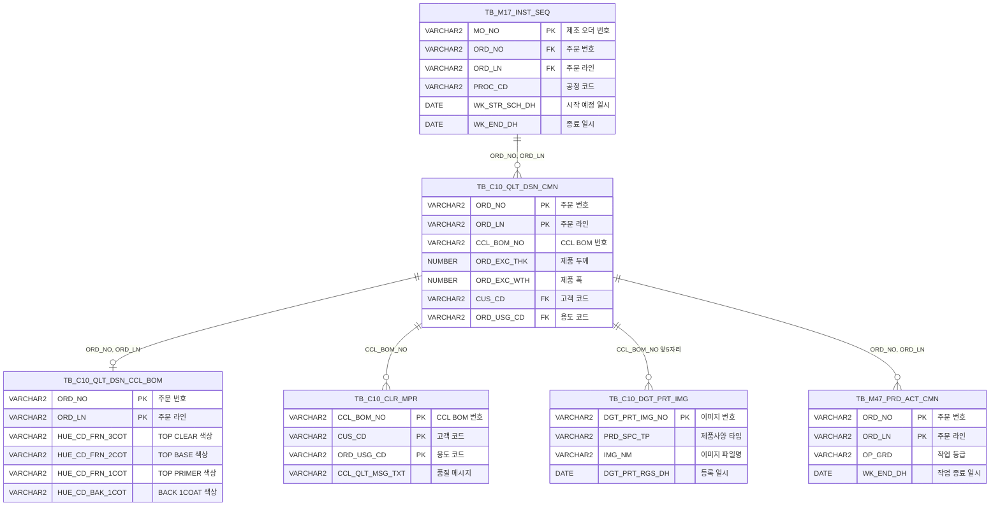

<h1 style="font-size: 40px; text-align: center; font-weight:
   bold; margin: 30px 0;">
  C106000200 레거시 시스템 분석 종합 보고서
</h1>


# 1. 시스템 개요
- **서비스 ID**: C106000200
- **업무명**: 디지털프린트 작업지시조회
- **분석 일시**: 2026-03-17 (KST)
- **전체 Activity 수**: 6개 (Built-in 6개, Custom 0개)
- **분석자**: Claude Opus 4.6 / Claude Sonnet (Phase 4) / Haiku (SQL Cache)
- **분석 도구**: /analyze-service C106000200
- **문서 버전**: 1.0

# 📊 비즈니스 프로세스 분석

## 시스템 목적

C106000200은 **디지털프린트 작업지시조회** 화면으로, CCL(Color Coating Line) 공정의 A5 공정에서 디지털프린트 작업 전 필수 확인 항목을 조회하는 화면이다.

오퍼레이터는 작업예정일자와 BOM번호/MO번호를 기준으로 작업지시 목록을 조회하고, 특정 작업지시를 선택하면 해당 제품의 **디지털프린트 이미지**, **품질메시지**, **제품정보**(고객사, 색상, 보호필름, MARKING 등), **최근 생산이력**을 한 화면에서 확인할 수 있다. 이를 통해 작업 전 제품 사양과 품질 요구사항을 사전에 파악하여 작업 오류를 방지한다.

본 서비스는 조회 전용 서비스로, 모든 Activity가 Built-in FormSearch이며 SELECT 쿼리만 수행한다. Router(분기) → 단일 조회 Activity 구조로 구성되어 있어 핵심/상세 워크플로우 다이어그램은 생략한다.

## 주요 유즈케이스

### UC-01: 작업지시 목록 조회
- **Actor**: 디지털프린트 공정 오퍼레이터
- **목적**: 작업예정일자 범위 내의 A5 공정 미완료 작업지시를 조회하여 당일 작업 대상을 파악

- **전제조건**:
  - 사용자가 시스템에 로그인되어 있음
  - TB_M17_INST_SEQ 테이블에 A5 공정 작업지시가 등록되어 있음
  - TB_C10_QLT_DSN_CMN 테이블에 품질설계 정보가 등록되어 있음

- **주요 흐름**:
  1. 화면 진입 시 작업예정일자(시작/종료)에 오늘 날짜 자동 설정 (`uiCommon.getCurrentDate()`)
  2. 사용자가 BOM번호, MO번호 조건을 선택적으로 입력
  3. 조회 버튼 클릭 → `find()` 함수 실행
  4. `uiCommon.parameters('C106000200_Form_1', 'C106000200_Grid_1', 'find')` 호출하여 파라미터 구성
  5. `C106000200.select` 쿼리 실행 — TB_M17_INST_SEQ와 TB_C10_QLT_DSN_CMN을 LEFT JOIN
  6. ROW_NUMBER() OVER (PARTITION BY MO_NO, CCL_BOM_NO ORDER BY WK_STR_SCH_DH ASC) 윈도우 함수로 MO/BOM 조합별 최초 시작예정 건만 반환
  7. Grid_1에 작업지시 목록 표시 (BOM번호, MO번호, 제품두께/폭, 품명, SubClass, 시작예정일시)

- **대체 흐름**:
  - 조회 결과 없음: Grid_1이 빈 상태로 표시
  - BOM번호/MO번호에 와일드카드(LIKE) 검색 적용

- **후행조건**:
  - Grid_1에 작업지시 목록이 페이징 처리되어 표시됨
  - 사용자가 행을 선택하여 상세 정보를 조회할 수 있는 상태

### UC-02: 작업지시 상세 정보 조회
- **Actor**: 디지털프린트 공정 오퍼레이터
- **목적**: 선택한 작업지시의 디지털프린트 이미지, 품질메시지, 제품정보, 생산이력을 한 화면에서 확인

- **전제조건**:
  - UC-01에서 작업지시 목록이 조회된 상태

- **주요 흐름**:
  1. Grid_1에서 작업지시 행 선택 → `deteilFind(rowId)` 함수 실행
  2. 선택 행에서 CCL_BOM_NO, CUS_CD, ORD_USG_CD, ORD_NO, ORD_LN 추출
  3. 4건의 AJAX 호출을 순차 실행 (`c10AjaxData.do`):
     - **품질메시지 조회** (`qltMsgFind=1`): `C106000200.qlt_msg_find` — 고객/용도별 4단계 우선순위로 품질메시지 반환
     - **디지털이미지 조회** (`dgtImgFind=1`): `C106000200.dgt_img_find` — BOM번호 앞 5자리 기준 최신 이미지 조회
     - **제품정보 조회** (`prdInfoFind=1`): `C106000200.prd_info_find` — 고객사, 영업사원, 용도, TOP/BACK 색상, 보호필름 등 11개 항목
     - **생산이력 조회** (`wkInfoFind=1`): `C106000200.wk_info_find` — 동일 BOM의 최근 생산완료 일자
  4. Grid_2에 이미지 + 품질메시지 표시
  5. Grid_3에 제품정보(고정 행 구조) 표시
  6. Grid_4에 생산이력(고정 행 구조) 표시

- **대체 흐름**:
  - 이미지 없음: Grid_2에 "이미지가 없습니다." 텍스트 표시 (img → ro 타입 전환)
  - 제품정보 없음: 콘솔에 "제품정보 없음" 로그 출력, Grid_3 갱신 안 함
  - 생산이력 없음: 콘솔에 "생산정보 없음" 로그 출력 후 return

- **후행조건**:
  - Grid_2~4에 해당 작업지시의 상세 정보가 표시됨
  - 오퍼레이터가 디지털프린트 작업 전 제품 사양을 확인 가능

### UC-03: 디지털프린트 이미지 확대 보기
- **Actor**: 디지털프린트 공정 오퍼레이터
- **목적**: 작은 썸네일이 아닌 풀스크린으로 디지털프린트 이미지를 상세 확인

- **전제조건**:
  - UC-02에서 디지털프린트 이미지가 Grid_2에 로드된 상태

- **주요 흐름**:
  1. Grid_2의 이미지 셀 클릭
  2. `isImageUrl()` 함수로 이미지 URL 유효성 확인 (.jpg/.jpeg/.png/.gif/.bmp/.webp)
  3. `openImageViewer(imgUrl)` 호출 → 풀스크린 오버레이 생성
  4. 이미지 확대/축소 (마우스 휠, 0.2~5배), 드래그 이동 가능
  5. ESC 키 또는 오버레이 클릭으로 닫기

- **대체 흐름**:
  - 이미지 URL이 아닌 경우: `isImageUrl()` 검증 실패 → 뷰어 미생성

- **후행조건**:
  - 뷰어 닫힌 후 원래 화면 상태로 복귀

### UC-04: BOM 기준 화면 이동
- **Actor**: 디지털프린트 공정 오퍼레이터
- **목적**: 작업지시 목록에서 BOM번호 링크를 통해 관련 상세 화면(C106000060)으로 이동

- **전제조건**:
  - Grid_1에 작업지시 목록이 조회된 상태

- **주요 흐름**:
  1. Grid_1에서 BOM번호(ahref 타입) 셀 클릭 → `doLink()` 함수 실행
  2. 선택 행의 CCL_BOM_NO 값 추출
  3. `parent.newRemoveOpenTab('C106000060', 'CCL_BOM_NO=' + bomNo)` 호출
  4. C106000060 화면으로 이동 (BOM번호 파라미터 전달)

- **대체 흐름**: 없음

- **후행조건**:
  - C106000060 화면이 새 탭으로 열리며 해당 BOM 정보 자동 조회

---
## 비즈니스 로직 상세

### 1. 품질메시지 우선순위 검색 로직

- **목적**: BOM번호에 해당하는 품질메시지를 고객/용도 조합의 우선순위에 따라 최적의 1건만 반환
- **처리 케이스**:

  **[케이스 1: 정확한 고객+용도 매칭]**
  ```
    조건: CUS_CD = :CUS_CD AND ORD_USG_CD = :ORD_USG_CD (우선순위 1)
    처리:
      1. 정확한 고객코드와 용도코드 조합으로 매칭
      2. 가장 구체적인 품질메시지 반환
  ```

  **[케이스 2: 정확한 고객 + 와일드카드 용도]**
  ```
    조건: CUS_CD = :CUS_CD AND ORD_USG_CD LIKE '______' (우선순위 2)
    처리:
      1. 고객코드 정확 매칭, 용도코드는 6자리 와일드카드('______')
      2. 해당 고객의 범용 품질메시지 반환
  ```

  **[케이스 3: 와일드카드 고객 + 정확한 용도]**
  ```
    조건: CUS_CD LIKE '______' AND ORD_USG_CD = :ORD_USG_CD (우선순위 3)
    처리:
      1. 고객코드는 6자리 와일드카드, 용도코드 정확 매칭
      2. 해당 용도의 범용 품질메시지 반환
  ```

  **[케이스 4: 전체 와일드카드]**
  ```
    조건: CUS_CD LIKE '______' AND ORD_USG_CD LIKE '______' (우선순위 4)
    처리:
      1. 고객/용도 모두 와일드카드 매칭
      2. 해당 BOM의 기본 품질메시지 반환
  ```

- **계산 공식**:
  ```
  ROW_NUMBER() OVER (ORDER BY CASE WHEN ... END) 윈도우 함수로 우선순위 산정
  rn = 1인 행만 반환 (최우선 품질메시지 1건)

  와일드카드 패턴: '______' (밑줄 6개) → 6자리 고정 길이 코드의 와일드카드 매칭
  ```

### 2. 작업지시 MO/BOM별 최초 시작예정 건 필터링

- **목적**: 동일 MO+BOM 조합에서 가장 빨리 시작 예정인 1건만 추출하여 중복 없는 작업지시 목록 제공
- **처리 케이스**:

  **[케이스 1: MO/BOM 조합별 최초 건 추출]**
  ```
    조건: PROC_CD = 'A5' AND WK_END_DH IS NULL (미완료 건)
    처리:
      1. TB_M17_INST_SEQ에서 A5 공정의 미완료 시퀀스 조회
      2. ROW_NUMBER() OVER (PARTITION BY MO_NO, CCL_BOM_NO ORDER BY WK_STR_SCH_DH ASC) 적용
      3. rn = 1인 행만 반환 (MO/BOM별 최초 시작예정 건)
  ```

- **계산 공식**:
  ```
  PARTITION BY: MO_NO, CCL_BOM_NO (동일 MO+BOM 그룹)
  ORDER BY: WK_STR_SCH_DH ASC (시작예정일시 오름차순)
  필터: rn = 1 (그룹 내 첫 번째 행)
  ```

### 3. 코드값→의미명 변환 (스칼라 서브쿼리)

- **목적**: 시스템 코드값을 사용자가 이해할 수 있는 의미명으로 변환하여 표시
- **처리 케이스**:

  **[케이스 1: 품명 코드 변환 (select 쿼리)]**
  ```
    변환: PRD_NM_CD → 품명 (VI_M00_CODE_ACCESS, CD_TP='PRD_NM_CD', CATEGORY_GROUP_NM='SZ0000')
  ```

  **[케이스 2: 고객코드 변환 (prd_info_find 쿼리)]**
  ```
    변환: CUS_CD → 고객사명 (VI_M00_CODE_ACCESS, CD_TP='CUS_CD', CATEGORY_GROUP_NM='SZ0000')
  ```

  **[케이스 3: 용도코드 변환 (prd_info_find 쿼리)]**
  ```
    변환: ORD_USG_CD → 용도명 (VI_M00_CODE_ACCESS, CD_TP='ORD_USG_CD', CATEGORY_GROUP_NM='SZ0000')
  ```

  **[케이스 4: 영업사원 사번→성명 변환 (prd_info_find 쿼리)]**
  ```
    변환: ORD_RGS_PRS_ID → USER_NAME (TB_M90_EMP_INF, USER_NO 기준)
  ```

### 4. 디지털프린트 이미지 검색 로직

- **목적**: BOM번호 앞 5자리(제품 패턴) 기준으로 가장 최신의 디지털프린트 이미지를 조회
- **처리 케이스**:

  **[케이스 1: 이미지 존재]**
  ```
    조건: SUBSTR(DGT_PRT_IMG_NO,1,5) = SUBSTR(:CCL_BOM_NO,1,5) AND PRD_SPC_TP = '5'
    처리:
      1. BOM번호 앞 5자리로 이미지 번호 패턴 매칭
      2. PRD_SPC_TP = '5' (디지털프린트 타입) 필터
      3. DGT_PRT_RGS_DH DESC 정렬 후 ROWNUM = 1 (최신 1건)
      4. NVL(IMG_NM, '') 처리하여 NULL 방지
      5. 이미지 URL: /C10/coilimgdown?file={IMG_NM}
  ```

  **[케이스 2: 이미지 미존재]**
  ```
    조건: 조회 결과 없음 (cells3.length <= 0)
    처리:
      1. Grid_2 셀 타입을 img → ro로 전환
      2. "이미지가 없습니다." 텍스트 표시
  ```

### 5. 생산이력 최근 작업완료일 집계

- **목적**: BOM번호에 해당하는 최근 생산완료 일자를 조회하여 과거 작업 이력 확인
- **처리 케이스**:

  **[케이스 1: 정상 조회]**
  ```
    조건: CCL_BOM_NO = :CCL_BOM_NO AND ORD_END_TP != 'E' (주문종료 제외) AND OP_GRD = '1'
    처리:
      1. TB_C10_QLT_DSN_CMN과 TB_M47_PRD_ACT_CMN LEFT JOIN
      2. 생산실적(OP_GRD='1')의 MAX(WK_END_DH) 집계
      3. NVL(MAX(WK_END_DH), '') 처리
      4. GROUP BY CCL_BOM_NO로 BOM별 최근 완료일 반환
  ```

---

# 💾 데이터 요구사항

## 핵심 테이블

### 1. TB_M17_INST_SEQ - (작업지시 시퀀스)
| 컬럼명 | 타입 | PK | 설명 |
|--------|------|----|------|
| MO_NO | VARCHAR2 | ✅ | 제조 오더 번호 |
| ORD_NO | VARCHAR2 | | 주문 번호 |
| ORD_LN | VARCHAR2 | | 주문 라인 |
| PROC_CD | VARCHAR2 | | 공정 코드 (A5 = 디지털프린트) |
| SUB_CLS_CD | VARCHAR2 | | SubClass 코드 |
| WK_STR_SCH_DH | DATE | | 작업 시작 예정 일시 |
| WK_END_DH | DATE | | 작업 종료 일시 (NULL=미완료) |

### 2. TB_C10_QLT_DSN_CMN - (품질설계 공통)
| 컬럼명 | 타입 | PK | 설명 |
|--------|------|----|------|
| ORD_NO | VARCHAR2 | ✅ | 주문 번호 |
| ORD_LN | VARCHAR2 | ✅ | 주문 라인 |
| CCL_BOM_NO | VARCHAR2 | | CCL BOM 번호 |
| ORD_EXC_THK | NUMBER | | 제품 두께 |
| ORD_EXC_WTH | NUMBER | | 제품 폭 |
| PRD_NM_CD | VARCHAR2 | | 품명 코드 |
| CUS_CD | VARCHAR2 | | 고객 코드 |
| ORD_USG_CD | VARCHAR2 | | 주문 용도 코드 |
| ORD_RGS_PRS_ID | VARCHAR2 | | 주문 등록 사원 ID |
| QLT_DSN_INST_DH | DATE | | 품질설계 지시 일시 |
| ORD_END_TP | VARCHAR2 | | 주문 종료 유형 (E=종료) |

### 3. TB_C10_QLT_DSN_CCL_BOM - (품질설계 CCL BOM)
| 컬럼명 | 타입 | PK | 설명 |
|--------|------|----|------|
| ORD_NO | VARCHAR2 | ✅ | 주문 번호 |
| ORD_LN | VARCHAR2 | ✅ | 주문 라인 |
| HUE_CD_FRN_3COT | VARCHAR2 | | TOP CLEAR 색상코드 |
| HUE_CD_FRN_2COT | VARCHAR2 | | TOP BASE 색상코드 |
| HUE_CD_FRN_1COT | VARCHAR2 | | TOP PRIMER 색상코드 |
| HUE_CD_BAK_1COT | VARCHAR2 | | BACK 1COAT 색상코드 |
| HUE_CD_BAK_2COT | VARCHAR2 | | BACK 2COAT 색상코드 |
| ORD_PTT_FLM_WTH | VARCHAR2 | | 보호필름 폭 |
| ORD_PTT_FLM_DTL_CD | VARCHAR2 | | 보호필름 상세코드 |
| BAK_MRK | VARCHAR2 | | BACK MARKING |

### 4. TB_C10_CLR_MPR - (CCL 품질메시지 마스터)
| 컬럼명 | 타입 | PK | 설명 |
|--------|------|----|------|
| CCL_BOM_NO | VARCHAR2 | ✅ | CCL BOM 번호 |
| CUS_CD | VARCHAR2 | ✅ | 고객 코드 (와일드카드 가능) |
| ORD_USG_CD | VARCHAR2 | ✅ | 용도 코드 (와일드카드 가능) |
| CCL_QLT_MSG_TXT | VARCHAR2 | | 품질 메시지 텍스트 |

### 5. TB_C10_DGT_PRT_IMG - (디지털프린트 이미지)
| 컬럼명 | 타입 | PK | 설명 |
|--------|------|----|------|
| DGT_PRT_IMG_NO | VARCHAR2 | ✅ | 디지털프린트 이미지 번호 |
| PRD_SPC_TP | VARCHAR2 | | 제품사양 타입 (5=디지털프린트) |
| IMG_NM | VARCHAR2 | | 이미지 파일명 |
| DGT_PRT_RGS_DH | DATE | | 등록 일시 |

### 6. TB_M47_PRD_ACT_CMN - (생산실적 공통)
| 컬럼명 | 타입 | PK | 설명 |
|--------|------|----|------|
| ORD_NO | VARCHAR2 | ✅ | 주문 번호 |
| ORD_LN | VARCHAR2 | ✅ | 주문 라인 |
| OP_GRD | VARCHAR2 | | 작업 등급 (1=정상) |
| WK_END_DH | DATE | | 작업 종료 일시 |
| PDN_PST_DD | DATE | | 생산 전기 일자 |

## 데이터 플로우

### 1. 작업지시 목록 조회
```
[화면 로딩 시 날짜 자동 설정]
화면 진입
→ onFormLoadFunction()
  STR_SCH_DH, END_SCH_DH = 오늘 날짜 (uiCommon.getCurrentDate())

[작업지시 목록 조회]
조회 버튼 클릭 (find)
→ C106000200.select
  FROM MESAPUSER.TB_M17_INST_SEQ A
  LEFT JOIN C10APUSER.TB_C10_QLT_DSN_CMN B ON A.ORD_NO = B.ORD_NO AND A.ORD_LN = B.ORD_LN
  WHERE A.PROC_CD = 'A5'
    AND A.MO_NO LIKE :MO_NO || '%'
    AND B.CCL_BOM_NO LIKE :CCL_BOM_NO || '%'
    AND A.WK_STR_SCH_DH BETWEEN :STR_SCH_DH AND :END_SCH_DH + 1
    AND A.WK_END_DH IS NULL
  ROW_NUMBER() OVER (PARTITION BY MO_NO, CCL_BOM_NO ORDER BY WK_STR_SCH_DH ASC) = 1
→ Grid_1에 작업지시 목록 표시 (페이징 20건)
```

### 2. 상세 정보 조회 (행 선택)
```
[Grid_1 행 선택 시 4건 AJAX 순차 호출]
Grid_1 행 선택 (deteilFind)

→ (1) C106000200.qlt_msg_find (품질메시지)
  FROM C10APUSER.TB_C10_CLR_MPR
  WHERE CCL_BOM_NO = :CCL_BOM_NO
    AND (CUS_CD/ORD_USG_CD 4단계 우선순위 매칭)
  ROW_NUMBER() OVER (ORDER BY CASE...) = 1
→ Grid_2에 품질메시지 표시

→ (2) C106000200.dgt_img_find (디지털이미지)
  FROM C10APUSER.TB_C10_DGT_PRT_IMG
  WHERE SUBSTR(DGT_PRT_IMG_NO,1,5) = SUBSTR(:CCL_BOM_NO,1,5)
    AND PRD_SPC_TP = '5'
  ORDER BY DGT_PRT_RGS_DH DESC, ROWNUM = 1
→ Grid_2에 이미지 표시 (또는 "이미지가 없습니다.")

→ (3) C106000200.prd_info_find (제품정보)
  FROM C10APUSER.TB_C10_QLT_DSN_CMN A
  LEFT JOIN C10APUSER.TB_C10_QLT_DSN_CCL_BOM B ON ORD_NO, ORD_LN
  WHERE A.ORD_NO = :ORD_NO AND A.ORD_LN = :ORD_LN
  스칼라 서브쿼리: CUS_CD→고객사명, ORD_RGS_PRS_ID→사원명, ORD_USG_CD→용도명
→ Grid_3에 11개 항목 표시

→ (4) C106000200.wk_info_find (생산이력)
  FROM C10APUSER.TB_C10_QLT_DSN_CMN A
  LEFT JOIN MESAPUSER.TB_M47_PRD_ACT_CMN B ON ORD_NO, ORD_LN (OP_GRD='1')
  WHERE A.CCL_BOM_NO = :CCL_BOM_NO AND ORD_END_TP != 'E'
  GROUP BY CCL_BOM_NO → MAX(WK_END_DH)
→ Grid_4에 생산완료 일자, BOM번호 표시
```

## SQL 일람표
| SQL 이름 | 쿼리 ID | 타입 | 출처 | 테이블 |
|---------|---------|------|------|--------|
| 작업지시 목록 조회 | C106000200.select | SELECT | Service | TB_M17_INST_SEQ, TB_C10_QLT_DSN_CMN |
| 품질메시지 조회 | C106000200.qlt_msg_find | SELECT | Service | TB_C10_CLR_MPR |
| 제품정보 조회 | C106000200.prd_info_find | SELECT | Service | TB_C10_QLT_DSN_CMN, TB_C10_QLT_DSN_CCL_BOM, VI_M00_CODE_ACCESS, TB_M90_EMP_INF |
| 생산이력 조회 | C106000200.wk_info_find | SELECT | Service | TB_C10_QLT_DSN_CMN, TB_M47_PRD_ACT_CMN |
| 디지털이미지 조회 | C106000200.dgt_img_find | SELECT | Service | TB_C10_DGT_PRT_IMG |

## ER 다이어그램 (핵심 관계)



관계 설명:
- **TB_C10_QLT_DSN_CMN**이 중심 테이블로 주문 기반 품질설계 정보를 관리하며 모든 관계의 허브 역할
- **TB_M17_INST_SEQ**: 작업지시 시퀀스에서 ORD_NO/ORD_LN으로 품질설계 정보 참조 (1:N)
- **TB_C10_QLT_DSN_CCL_BOM**: 품질설계에 대한 CCL BOM 상세 (색상 정보, 1:1)
- **TB_C10_CLR_MPR**: CCL_BOM_NO 기반 품질메시지 매칭 (1:N, 고객/용도별 복수 등록)
- **TB_C10_DGT_PRT_IMG**: BOM번호 앞 5자리 기반 이미지 매칭 (패턴 매칭)
- **TB_M47_PRD_ACT_CMN**: 주문 기반 생산실적 이력 (1:N)

---

# 🖥️ 사용자 인터페이스 요구사항

## 화면 레이아웃 상세

### Layout 구조 (initLayout)
```javascript
{
  programId: "C106000200",
  itemType: "layout",
  messageBox: true,
  dirType: "row",          // 수직 분할
  childSize: "60",         // Form 60px, 나머지 전체
  splitter: false,
  components: [
    {
      id: "Form_1",
      height: "60px",
      component: {
        itemType: "form",
        formId: "C106000200_Form_1"
      }
    },
    {
      itemType: "layout",
      dirType: "col",        // 수평 분할
      childSize: "600,850",
      splitter: false,
      components: [
        {
          id: "Grid_1",
          width: "600px",
          component: {
            itemType: "grid",
            gridId: "C106000200_Grid_1"
          }
        },
        {
          itemType: "layout",
          dirType: "col",      // 수평 분할
          childSize: "350,300,200",
          splitter: false,
          components: [
            {
              id: "Grid_2",
              width: "350px",
              component: {
                itemType: "grid",
                gridId: "C106000200_Grid_2"  // 이미지 + 품질메시지
              }
            },
            {
              id: "Grid_3",
              width: "300px",
              component: {
                itemType: "grid",
                gridId: "C106000200_Grid_3"  // 제품정보
              }
            },
            {
              id: "Grid_4",
              width: "200px",
              component: {
                itemType: "grid",
                gridId: "C106000200_Grid_4"  // 최근 작업이력
              }
            }
          ]
        }
      ]
    }
  ]
}
```

## 입출력 요소

### Form 컴포넌트
**C106000200_Form_1** (조회 조건)
- STR_SCH_DH: Calendar - 작업예정일자 시작 (80px, 노란색 배경, 기본값: 오늘)
- DH_DUR: Label - "~" 구분자
- END_SCH_DH: Calendar - 작업예정일자 종료 (65px, 노란색 배경, 기본값: 오늘)
- find: Button - 조회 (초기 disabled, command: "find")
- winClose: Button - 닫기 (command: "winClose")
- CCL_BOM_NO: Input - BOM번호 (labelWidth: 55, inputWidth: 80, toCase: upper)
- MO_NO: Input - MO번호 (labelWidth: 45, inputWidth: 80, toCase: upper)

### Grid 컴포넌트

**C106000200_Grid_1 (작업지시 목록)**
- 편집 가능 여부: 아니오 (읽기 전용)
- Split: 없음
- 페이징: 20건
- 컨텍스트 메뉴: 있음 (C106000200_Menu_1)
- Multiselect: true
- 주요 컬럼 (11개):

  **기본 정보**:
  - CCL_BOM_NO: ahref - BOM번호 (80px, 중앙정렬, 클릭 시 C106000060 화면 이동)
  - MO_NO: ahref - MO번호 (80px, 중앙정렬)

  **제품 스펙**:
  - ORD_EXC_THK: ro - 제품두께 (60px, 우측정렬)
  - ORD_EXC_WTH: ro - 제품폭 (60px, 우측정렬)
  - PRD_NM_CD: ro - 품명 (60px, 중앙정렬, 코드→의미명 변환)
  - SUB_CLS_CD: ro - SubClass (120px, 중앙정렬)

  **일시 정보**:
  - WK_STR_SCH_DH: ro - 시작예정일시 (120px, 중앙정렬, YYYY-MM-DD HH24:MI 포맷)

  **숨김 컬럼**:
  - CUS_CD: ro - 고객코드 (100px, 숨김) — 상세조회 파라미터용
  - ORD_USG_CD: ro - 용도코드 (80px, 숨김) — 상세조회 파라미터용
  - ORD_NO: ro - 주문번호 (80px, 숨김) — 상세조회 파라미터용
  - ORD_LN: ro - 주문행번 (80px, 숨김) — 상세조회 파라미터용

**C106000200_Grid_2 (디지털프린트 이미지 + 품질메시지)**
- 편집 가능 여부: 아니오 (읽기 전용)
- 헤더 없음 (noHeader: true)
- ColSpan/Rowspan 활성화
- 고정 행 구조 (staticRows):
  - Row 0: "디지털프린트 이미지" 헤더 (colspan=2, 노란색 배경 #FFFF00)
  - Row 1: 이미지 표시 (img 타입, colspan=2, 클릭 시 풀스크린 뷰어)
  - Row 2: "품질메시지" 헤더 (colspan=2, 녹색 배경 #E9F9E9)
  - Row 3: 품질메시지 텍스트 (colspan=2, rowspan=4)
- 주요 컬럼 (2개):
  - CCL_BOM_NO: img - 디지털프린트 이미지 (50%, 중앙정렬, css: grid_img_fit)
  - CCL_QLT_MSG_TXT: ro - 품질메시지 텍스트 (50%, 중앙정렬)

**C106000200_Grid_3 (제품 정보)**
- 편집 가능 여부: 아니오 (읽기 전용)
- 헤더 없음 (noHeader: true)
- ColSpan/Rowspan 활성화
- 고정 행 구조 (staticRows):
  - Row 0: "제품 정보" 헤더 (colspan=3, 회색 배경 #c0c0c0)
  - Row 1: 고객사 (CUS_CD → 고객사명)
  - Row 2: 영업사원 (ORD_RGS_PRS_ID → 사원명)
  - Row 3: 용도 (ORD_USG_CD → 용도명)
  - Row 4: TOP CLEAR 색상 (HUE_CD_FRN_3COT)
  - Row 5: TOP BASE 색상 (HUE_CD_FRN_2COT)
  - Row 6: TOP PRIMER 색상 (HUE_CD_FRN_1COT)
  - Row 7: BACK 1COAT 색상 (HUE_CD_BAK_1COT)
  - Row 8: BACK 2COAT 색상 (HUE_CD_BAK_2COT)
  - Row 9: 보호필름 종류 (ORD_PTT_FLM_DTL_CD)
  - Row 10: 보호필름 폭 (ORD_PTT_FLM_WTH)
  - Row 11: MARKING (BAK_MRK)
- 주요 컬럼 (11개, 대부분 숨김):
  - CUS_CD: ro (25%, 우측정렬)
  - ORD_RGS_PRS_ID: ro (25%, 우측정렬)
  - ORD_USG_CD: ro (50%, 우측정렬)
  - HUE_CD_FRN_3COT: ro (13%, 숨김)
  - HUE_CD_FRN_2COT: ro (13%, 숨김)
  - HUE_CD_FRN_1COT: ro (20%, 숨김)
  - HUE_CD_BAK_1COT: ro (20%, 숨김)
  - HUE_CD_BAK_2COT: ro (20%, 숨김)
  - ORD_PTT_FLM_WTH: ro (20%, 숨김)
  - ORD_PTT_FLM_DTL_CD: ro (20%, 숨김)
  - BAK_MRK: ro (20%, 숨김)

**C106000200_Grid_4 (최근 작업 이력)**
- 편집 가능 여부: 아니오 (읽기 전용)
- 헤더 없음 (noHeader: true)
- ColSpan/Rowspan 활성화
- 페이징 없음
- 고정 행 구조 (staticRows):
  - Row 0: "최근 작업 이력" 헤더 (colspan=2, 회색 배경 #c0c0c0)
  - Row 1: 생산완료 일자 (WK_END_DH)
  - Row 2: 생산완료 BOM (CCL_BOM_NO)
- 주요 컬럼 (2개):
  - CCL_BOM_NO: ro - BOM번호 (50%, 우측정렬)
  - WK_END_DH: ro - 작업종료일시 (50%, 우측정렬)

## 화면 동작 흐름

### 1. 화면 초기 로딩
```
1. 화면 진입
2. ui.initializeDHTMLX() 호출 → DHTMLX 컴포넌트 렌더링
3. Form_1 로드 완료 시 onFormLoadFunction() 실행
   - STR_SCH_DH = uiCommon.getCurrentDate() (오늘 날짜)
   - END_SCH_DH = uiCommon.getCurrentDate() (오늘 날짜)
4. Grid_1에 rowSelected 이벤트 바인딩 (deteilFind)
5. Grid_2에 onRowSelect 이벤트 바인딩 (이미지 뷰어)
6. loadedObjCnt가 MAX_OBJ_CNT(9)에 도달하면 gridInitialize() 실행
7. 상태바(messagebox) 초기화
```

### 2. 작업지시 목록 조회
```
1. 사용자가 작업예정일자 범위, BOM번호, MO번호 입력
2. 조회 버튼 클릭
3. find(eventName, formDivObj, referenceItem) 실행
4. uiCommon.parameters('C106000200_Form_1', 'C106000200_Grid_1', eventName) 호출
5. Grid_1.clearDataProcess() → 기존 데이터 초기화
6. Grid_1.loadData(findUrl) → C106000200.select 실행
7. Grid_1에 결과 표시 (20건 페이징)
```

### 3. 상세 정보 조회 (행 선택)
```
1. Grid_1에서 행 선택
2. deteilFind(rowId) 실행
3. 선택 행에서 CCL_BOM_NO, CUS_CD, ORD_USG_CD, ORD_NO, ORD_LN 추출
4. AJAX 호출 #1: 품질메시지 (qltMsgFind=1)
   - uiCommon.ajaxLoadData('c10AjaxData.do', param)
   - escapeHtml() → 줄바꿈을 <br/>로 변환
   - Grid_2 row 3에 품질메시지 표시
5. AJAX 호출 #2: 디지털이미지 (dgtImgFind=1)
   - 이미지 있음: Grid_2 row 1에 img 타입으로 이미지 URL 설정
   - 이미지 없음: Grid_2 row 1을 ro 타입으로 전환, "이미지가 없습니다." 표시
6. AJAX 호출 #3: 제품정보 (prdInfoFind=1)
   - Grid_3 row 1~11에 11개 항목 순차 설정 (setCellValue)
7. AJAX 호출 #4: 생산이력 (wkInfoFind=1)
   - Grid_4 row 1에 생산완료일자, row 2에 BOM번호 설정
```

### 4. 이미지 확대 보기
```
1. Grid_2 이미지 셀 클릭
2. onRowSelect 이벤트 → getColType 확인 (img 타입만 처리)
3. isImageUrl(imgUrl) 검증
4. grid2Obj.clearSelection()
5. openImageViewer(imgUrl) 호출
6. 풀스크린 오버레이 생성 (z-index: 99999)
7. 마우스 휠: scale 조정 (0.2 ~ 5배)
8. 마우스 드래그: posX/posY 이동
9. ESC 또는 오버레이 클릭: closeViewer()
```

### 5. BOM번호 링크 화면 이동
```
1. Grid_1의 CCL_BOM_NO 컬럼(ahref 타입) 클릭
2. doLink(val, rId, cInd) 실행
3. Grid_1에서 CCL_BOM_NO 값 추출
4. parent.newRemoveOpenTab('C106000060', 'CCL_BOM_NO=' + bomNo) 호출
5. C106000060 화면 새 탭 열기 (BOM번호 파라미터 전달)
```

## JavaScript 모듈

**C106000200.jsp** (인라인 스크립트)
- find(eventName, formDivObj, referenceItem): 작업지시 목록 조회 (uiCommon.parameters → Grid_1.loadData)
- deteilFind(rowId): Grid_1 행 선택 시 상세 정보 4건 AJAX 순차 조회 (uiCommon.ajaxLoadData)
- escapeHtml(str): HTML 특수문자 이스케이프 (&, <, >)
- onLoadGrid(dhxGridObj, count): Grid 로드 완료 이벤트 핸들러
- onLoadComb(): 콤보 로드 완료 → onLoadObj() 호출
- onLoadObj(): 로드 카운터 증가 → MAX_OBJ_CNT 도달 시 gridInitialize()
- gridInitialize(): Grid 초기화 (현재 빈 함수)
- refresh(referenceItem): 메뉴 새로고침 (clearDataProcess → uiCommon.parameters → loadData)
- copy(referenceItem): 행 내용 클립보드 복사 (copyRowContent)
- onGridContextMenuClick(id, gridObj, menuObj): 컨텍스트 메뉴 (컬럼이동, 필터, 편집 토글)
- findMessage(referenceItem): 메시지 표시 (uiCommon.message)
- onFormLoadFunction(): 폼 로드 시 오늘 날짜 설정 (uiCommon.getCurrentDate)
- doLink(val, rId, cInd): BOM번호 링크 클릭 → C106000060 화면 이동 (parent.newRemoveOpenTab)
- openImageViewer(imgUrl): 풀스크린 이미지 뷰어 (확대/축소/드래그/ESC 닫기)
- isImageUrl(url): 이미지 URL 패턴 검증 (jpg/jpeg/png/gif/bmp/webp)

**c10.ui.js** (공통 유틸리티 - 외부 참조)

## 주요 이벤트 핸들러

**onFormLoadFunction (폼 로드)**
- 이벤트 타입: onXLEEvent
- 처리 내용:
  1. STR_SCH_DH 필드에 오늘 날짜 설정 (uiCommon.getCurrentDate())
  2. END_SCH_DH 필드에 오늘 날짜 설정 (uiCommon.getCurrentDate())

**deteilFind (Grid_1 행 선택)**
- 이벤트 타입: rowSelected
- 처리 내용:
  1. Grid_1에서 CCL_BOM_NO, CUS_CD, ORD_USG_CD, ORD_NO, ORD_LN 추출
  2. AJAX #1: 품질메시지 조회 → escapeHtml → 줄바꿈 변환 → Grid_2 row 3 표시
  3. AJAX #2: 디지털이미지 조회 → Grid_2 row 1에 img 또는 "이미지가 없습니다." 표시
  4. AJAX #3: 제품정보 조회 → Grid_3 row 1~11에 11개 항목 순차 설정
  5. AJAX #4: 생산이력 조회 → Grid_4 row 1~2에 생산완료일/BOM 설정

**doLink (BOM번호 링크 클릭)**
- 이벤트 타입: ahref click (CCL_BOM_NO 컬럼)
- 처리 내용:
  1. Grid_1에서 CCL_BOM_NO 값 추출
  2. parent.newRemoveOpenTab('C106000060', 'CCL_BOM_NO=' + bomNo) 호출
  3. C106000060 화면으로 이동

**Grid_2 onRowSelect (이미지 클릭)**
- 이벤트 타입: onRowSelect (anonymous)
- 처리 내용:
  1. 클릭 셀의 컬럼 타입이 img인지 확인
  2. isImageUrl() 검증
  3. grid2Obj.clearSelection()
  4. openImageViewer(imgUrl) 호출

**onGridContextMenuClick (컨텍스트 메뉴)**
- 이벤트 타입: contextmenu click
- 처리 내용:
  1. move_grid: 컬럼 이동 활성화/비활성화 (enableColumnMove)
  2. filter_grid: 헤더 메뉴 필터 활성화 (enableHeaderMenu)
  3. editable_grid: 편집 가능/불가 토글 (setEditable)

---

# 📌 특이사항 및 주의사항

## 1. 품질메시지 우선순위 와일드카드 패턴
- **와일드카드 매칭**: `CUS_CD LIKE '______'` (밑줄 6개)로 6자리 고정길이 코드 와일드카드 매칭을 사용한다. 이는 `*` 또는 `%` 와일드카드가 아닌 고정 길이 LIKE 패턴으로, 코드 테이블에 와일드카드 전용 행(예: `______`)이 실제로 등록되어 있어야 정상 동작한다.
- **4단계 우선순위**: CASE WHEN + ROW_NUMBER()로 정확매칭(1) → 고객만(2) → 용도만(3) → 범용(4) 순서로 검색하여 가장 구체적인 품질메시지를 반환하는 구조이다.

## 2. 디지털이미지 검색의 부분 매칭 패턴
- **BOM번호 앞 5자리 매칭**: `SUBSTR(DGT_PRT_IMG_NO,1,5) = SUBSTR(:CCL_BOM_NO,1,5)`로 BOM번호의 앞 5자리만 비교하여 동일 제품 패턴의 이미지를 공유한다. 이는 BOM번호 뒷자리가 다른 유사 제품도 동일 디지털프린트 이미지를 사용함을 의미한다.
- **PRD_SPC_TP = '5'**: 제품사양타입 5는 디지털프린트 전용 타입으로, 하드코딩된 매직넘버이다.

## 3. 동기식 AJAX 4건 순차 호출 성능 이슈
- **`uiCommon.ajaxLoadData`**: `deteilFind()` 함수에서 4건의 AJAX 호출을 **동기식으로 순차 실행**한다. 행 선택 시 4번의 네트워크 왕복이 발생하여 응답 지연이 사용자에게 체감될 수 있다.
- **에러 처리 미흡**: AJAX 응답의 cells 배열이 비어 있을 때만 처리하며, 네트워크 에러나 서버 에러에 대한 예외 처리가 없다.

## 4. Grid_3 셀 인덱스 하드코딩
- **setCellValue 하드코딩**: 제품정보를 Grid_3에 설정할 때 `grid3.setCellValue(1, 2, cells1.item(0).firstChild.nodeValue)` ~ `grid3.setCellValue(11, 2, cells1.item(10).firstChild.nodeValue)`와 같이 행 인덱스와 컬럼 인덱스를 하드코딩하고 있다. XML 컬럼 순서가 변경되면 데이터가 엇갈릴 수 있다.

## 5. 화면 최소 너비 2000px 강제 설정
- **CSS `min-width: 2000px !important`**: body와 DHTMLX 레이아웃에 최소 너비 2000px을 강제 설정하여 작은 모니터에서 가로 스크롤이 생기도록 처리하고 있다. 이는 Grid_1(600px) + Grid_2(350px) + Grid_3(300px) + Grid_4(200px) = 1450px 이상의 공간이 필요하기 때문이다.

## 6. 스키마 혼용
- **3개 스키마 동시 참조**: MESAPUSER(TB_M17_INST_SEQ, TB_M47_PRD_ACT_CMN), C10APUSER(TB_C10_QLT_DSN_CMN, TB_C10_QLT_DSN_CCL_BOM, TB_C10_CLR_MPR, TB_C10_DGT_PRT_IMG), M00APUSER(VI_M00_CODE_ACCESS), M90APUSER(TB_M90_EMP_INF) 4개 스키마를 참조한다. 서비스 XML의 DAO는 mesdao(MESAPUSER)만 사용하지만 SQL에서 직접 크로스 스키마 참조한다.

---

# 📚 참고 문서

- **Query SQL**: `src/query/C106000200-query.glue_sql`
- **Service XML**: `src/service/C106000200-service.xml`
- **JSP**: `WebContents/C106000200.jsp`
- **JS (공통)**: `WebContents/js/c10.ui.js`
- **Form XML**: `WebContents/header/kr/C106000200/C106000200_Form_1.xml`
- **Grid XML**: `WebContents/header/kr/C106000200/C106000200_Grid_1.xml`, `C106000200_Grid_2.xml`, `C106000200_Grid_3.xml`, `C106000200_Grid_4.xml`
- **Menu XML**: `WebContents/header/kr/C106000200/C106000200_Menu_1.xml`
