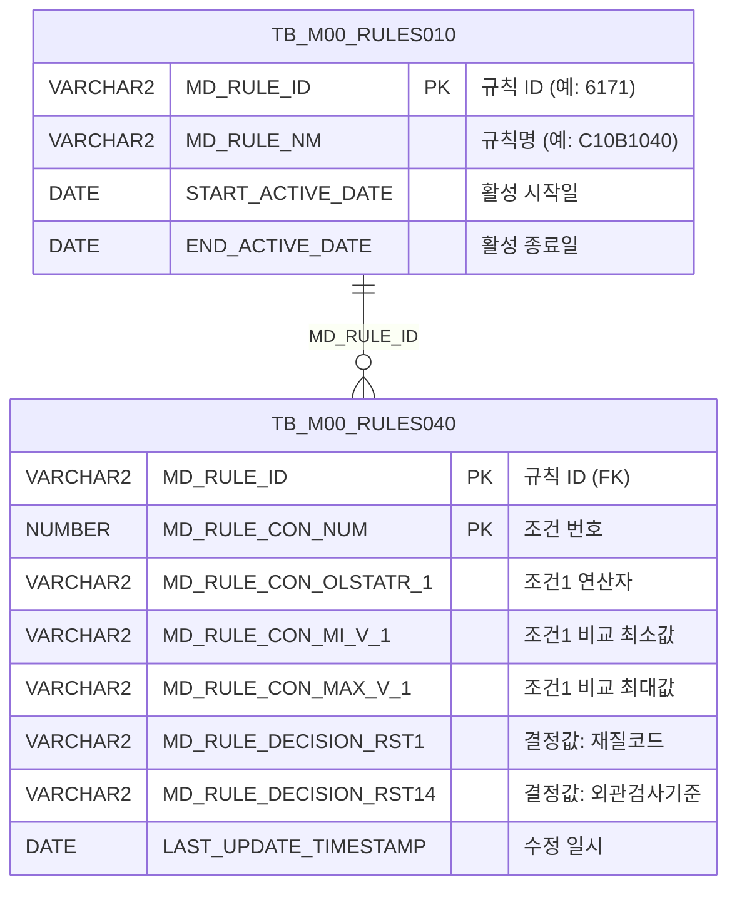

<h1 style="font-size: 40px; text-align: center; font-weight:
   bold; margin: 30px 0;">
  C107000010 레거시 시스템 분석 종합 보고서
</h1>


# 1. 시스템 개요
- **서비스 ID**: C107000010
- **업무명**: C10 품질설계 규칙 조건 관리 (규칙명: C10B1040)
- **분석 일시**: 2026-03-17 08:26 KST (재생성)
- **분석 시간**: ~5분
- **전체 Activity 수**: 3개 (Built-in)
- **분석자**: Claude Opus 4.6 + Sonnet (Phase 4)
- **분석 도구**: /analyze-service C107000010
- **문서 버전**: 1.0

# 📊 비즈니스 프로세스 분석

## 시스템 목적

본 서비스는 C10(CCL 공정) 모듈에서 사용하는 **품질설계 규칙 조건(C10B1040)**을 관리하는 화면이다. M00APUSER 스키마의 공통 규칙 엔진 테이블(TB_M00_RULES010/040)을 기반으로, 제품의 품명코드·제품형태·규격약호·주문용도코드 등 **13개 조건 항목**에 대한 연산자와 비교값을 설정하고, 이에 대응하는 **14개 결정값**(재질코드, 원자재코드, 제조표준번호, 통과공정번호, 품질설계확정구분, 품질메시지, 외관검사기준 등)을 관리한다.

이 규칙은 주문 접수 시 제품 사양(품명, 형태, 규격, 용도, 고객사 등)에 따라 **원자재 코드, 제조표준, 통과 공정, 품질 메시지**를 자동으로 결정하는 데 사용된다. 규칙 조건 매칭 방식은 LIKE, BETWEEN, =, <, >, IN, IS_NULL, NOT_IN, NOT_NULL, NOT_CHECK(체크안함) 등 **18종 비교 연산자**를 지원하며, 조건별로 최소값(MI_V)과 최대값(MAX_V)을 지정하여 범위 비교가 가능하다.

규칙 ID '6171'로 고정된 C10B1040 규칙에 대해 조건 세트를 조회·추가·수정·삭제할 수 있으며, 신규 조건 추가 시 조건 번호(MD_RULE_CON_NUM)는 기존 최대값+1로 자동 채번된다.

## 주요 유즈케이스

### UC-01: 규칙 조건 조회
- **Actor**: 품질설계 담당자
- **목적**: C10B1040 규칙에 등록된 전체 조건 세트를 조회하여 현재 설정 상태를 확인

- **전제조건**:
  - 사용자가 시스템에 로그인되어 있음
  - M00APUSER.TB_M00_RULES010에 'C10B1040' 규칙이 등록되어 있음

- **주요 흐름**:
  1. 화면 진입 시 Form 로드 완료 이벤트(onFormLoadFunction)에서 연산자 콤보 초기화
  2. 사용자가 조회 버튼 클릭 (find 이벤트)
  3. USER_NO 커스텀 파라미터를 포함하여 basicGridData.do 호출
  4. C107000010.select 쿼리 실행 → TB_M00_RULES010과 TB_M00_RULES040 INNER JOIN
  5. Grid_1에 전체 조건 세트 표시 (13개 조건 × 연산자/비교값1/비교값2 + 14개 결정값)

- **대체 흐름**:
  - 조회 결과 없음: Grid에 빈 데이터 표시, 메시지박스에 안내 메시지

- **후행조건**:
  - Grid에 조건 세트 목록이 표시됨
  - 사용자가 행 선택 후 수정/삭제 가능 상태

### UC-02: 규칙 조건 추가
- **Actor**: 품질설계 담당자
- **목적**: 새로운 조건 세트를 추가하여 품질설계 규칙 확장

- **전제조건**:
  - UC-01 조회 완료 상태
  - 추가할 조건 값 확보

- **주요 흐름**:
  1. Menu_1의 "행추가" 클릭 (add 이벤트)
  2. Grid_1에 신규 행 추가, CHK=1 설정, USER_NO 세션 값 자동 설정
  3. MD_RULE_CON_OLSTATR_1~13 컬럼이 combo_v 타입으로 초기화되어 연산자 선택 가능
  4. 사용자가 각 조건 항목의 연산자·비교값1·비교값2 입력
  5. 결정값(재질코드, 원자재코드 등) 14개 항목 입력
  6. 저장 버튼 클릭 → 확인 다이얼로그 표시
  7. 확인 시 handleDataProcess.do 호출 → C107000010.insert 실행
  8. MD_RULE_CON_NUM은 MAX+1 서브쿼리로 자동 채번
  9. USE_TP='Y', START/END_ACTIVE_DATE는 TB_M00_RULES010에서 서브쿼리로 복사

- **대체 흐름**:
  - 저장 취소: 확인 다이얼로그에서 취소 선택 시 저장 중단
  - 동시 입력 충돌: MAX+1 서브쿼리 실행 시 동일 번호 채번 가능성 (동시성 이슈)

- **후행조건**:
  - TB_M00_RULES040에 새 조건 레코드 생성
  - 감사 정보(CREATED_OBJECT_ID, CREATION_TIMESTAMP) 기록
  - Grid 자동 새로고침

### UC-03: 규칙 조건 수정
- **Actor**: 품질설계 담당자
- **목적**: 기존 조건 세트의 연산자·비교값·결정값을 변경

- **전제조건**:
  - UC-01 조회 완료 상태
  - 수정 대상 행의 CHK(체크박스) 선택

- **주요 흐름**:
  1. Grid_1에서 수정 대상 행의 CHK 체크박스 선택 (CheckBox 이벤트)
  2. CHK=1인 행만 편집 가능 상태로 전환 (editCell 이벤트에서 제어)
  3. 연산자 컬럼이 combo_v 타입으로 변경되어 연산자 선택 가능
  4. 비교값·결정값 수정
  5. 저장 버튼 클릭 → C107000010.update 실행
  6. 13개 조건 세트 + 14개 결정값 전체 UPDATE + 감사 정보 갱신

- **대체 흐름**:
  - CHK 미선택 행 편집 시도: editCell에서 편집 차단 (return false)

- **후행조건**:
  - TB_M00_RULES040 해당 레코드 갱신
  - LAST_UPDATE_TIMESTAMP, LAST_UPDATED_OBJECT_ID 갱신

### UC-04: 규칙 조건 삭제
- **Actor**: 품질설계 담당자
- **목적**: 불필요한 조건 세트를 삭제

- **전제조건**:
  - UC-01 조회 완료 상태
  - 삭제 대상 행의 CHK 선택

- **주요 흐름**:
  1. Grid_1에서 삭제 대상 행의 CHK 체크박스 선택
  2. Menu_1의 "삭제" 클릭 (remove 이벤트) → 행을 deleted 상태로 마킹
  3. 저장 버튼 클릭 → C107000010.delete 실행
  4. MD_RULE_ID='6171' AND MD_RULE_CON_NUM=:조건번호 로 레코드 삭제

- **대체 흐름**:
  - 삭제 후 실행취소(undo): Grid의 undo 기능으로 삭제 마킹 취소 가능 (저장 전에만)

- **후행조건**:
  - TB_M00_RULES040에서 해당 조건 레코드 물리 삭제
  - Grid 자동 새로고침

---
## 비즈니스 로직 상세

### 1. 규칙 조건 매칭 연산자 체계

- **목적**: 13개 조건 항목 각각에 대해 다양한 비교 방식을 제공하여 유연한 규칙 매칭 지원
- **처리 케이스**:

  **[케이스 1: 정확 일치]**
  ```
  연산자: = (동일), != (다르다)
  처리:
    1. 비교값1(MI_V)과 정확히 일치/불일치 여부 판단
    2. 비교값2(MAX_V)는 미사용
  ```

  **[케이스 2: LIKE 패턴 매칭]**
  ```
  연산자: LIKE1(%LIKE%), LIKE2(%LIKE), LIKE3(LIKE%)
  처리:
    1. LIKE1: 비교값 양쪽에 와일드카드 (%value%)
    2. LIKE2: 비교값 앞에 와일드카드 (%value)
    3. LIKE3: 비교값 뒤에 와일드카드 (value%)
  ```

  **[케이스 3: 범위 비교 (BETWEEN)]**
  ```
  연산자: BETWEEN1(<=변수<=), BETWEEN2(<=변수<), BETWEEN3(<변수<=), BETWEEN4(<변수<)
  처리:
    1. 비교값1(MI_V) = 하한값, 비교값2(MAX_V) = 상한값
    2. 경계값 포함/미포함 조합 4가지 지원
    예: BETWEEN1 → MI_V <= 대상값 <= MAX_V
        BETWEEN4 → MI_V < 대상값 < MAX_V
  ```

  **[케이스 4: 크기 비교]**
  ```
  연산자: <, <=, >, >=
  처리:
    1. 비교값1(MI_V)과 대상값의 크기 비교
    2. 비교값2(MAX_V)는 미사용
  ```

  **[케이스 5: 목록/NULL 비교]**
  ```
  연산자: IN, NOT_IN, IS_NULL, NOT_NULL, NOT_CHECK(체크안함)
  처리:
    1. IN/NOT_IN: 비교값1에 콤마 구분 목록 지정
    2. IS_NULL: 대상값이 NULL인 경우 매칭
    3. NOT_NULL: 대상값이 NOT NULL인 경우 매칭
    4. NOT_CHECK: 해당 조건 항목을 매칭에서 제외
  ```

### 2. 조건 번호 자동 채번

- **목적**: 신규 조건 세트 추가 시 고유한 조건 번호를 자동 생성
- **처리 케이스**:

  **[케이스 1: 정상 채번]**
  ```
  조건: 기존 조건 레코드 존재
  처리:
    1. SELECT MAX(MD_RULE_CON_NUM)+1 FROM TB_M00_RULES040 WHERE MD_RULE_ID = '6171'
    2. 결과값을 신규 레코드의 MD_RULE_CON_NUM으로 사용
  ```

  **[케이스 2: 첫 레코드]**
  ```
  조건: TB_M00_RULES040에 MD_RULE_ID='6171' 레코드 없음
  처리:
    1. MAX(NULL)+1 = NULL 반환
    2. NULL이 MD_RULE_CON_NUM에 삽입될 수 있음 (잠재적 오류)
  ```

### 3. 활성 기간 자동 복사

- **목적**: 신규 조건의 유효 기간을 마스터 규칙의 활성 기간과 동기화
- **처리 케이스**:

  **[케이스 1: 정상]**
  ```
  조건: TB_M00_RULES010에 'C10B1040' 규칙 존재
  처리:
    1. START_ACTIVE_DATE, END_ACTIVE_DATE를 서브쿼리로 조회
    2. ROWNUM = 1로 중복 방지
    3. 조회된 값을 신규 레코드에 삽입
  ```

---

# 💾 데이터 요구사항

## 핵심 테이블

### 1. TB_M00_RULES010 (M00APUSER) - 규칙 마스터
| 컬럼명 | 타입 | PK | 설명 |
|--------|------|----|------|
| MD_RULE_ID | VARCHAR2 | ✅ | 규칙 ID (예: '6171') |
| MD_RULE_NM | VARCHAR2 | | 규칙명 (예: 'C10B1040') |
| START_ACTIVE_DATE | DATE | | 활성 시작일 |
| END_ACTIVE_DATE | DATE | | 활성 종료일 |

### 2. TB_M00_RULES040 (M00APUSER) - 규칙 조건 상세
| 컬럼명 | 타입 | PK | 설명 |
|--------|------|----|------|
| MD_RULE_ID | VARCHAR2 | ✅ | 규칙 ID (FK → TB_M00_RULES010) |
| MD_RULE_CON_NUM | NUMBER | ✅ | 조건 번호 (자동 채번) |
| MD_RULE_CON_OLSTATR_1~13 | VARCHAR2 | | 조건 1~13 연산자 (LIKE, BETWEEN, =, <, > 등) |
| MD_RULE_CON_MI_V_1~13 | VARCHAR2 | | 조건 1~13 비교 최소값 |
| MD_RULE_CON_MAX_V_1~13 | VARCHAR2 | | 조건 1~13 비교 최대값 |
| MD_RULE_DECISION_RST1 | VARCHAR2 | | 결정값: 재질코드 |
| MD_RULE_DECISION_RST2 | VARCHAR2 | | 결정값: 원자재코드1 |
| MD_RULE_DECISION_RST3 | VARCHAR2 | | 결정값: 원자재코드2 |
| MD_RULE_DECISION_RST4 | VARCHAR2 | | 결정값: 원자재코드3 |
| MD_RULE_DECISION_RST5 | VARCHAR2 | | 결정값: 제조표준번호1 |
| MD_RULE_DECISION_RST6 | VARCHAR2 | | 결정값: 제조표준번호2 |
| MD_RULE_DECISION_RST7 | VARCHAR2 | | 결정값: 제조표준번호3 |
| MD_RULE_DECISION_RST8 | VARCHAR2 | | 결정값: 통과공정번호 |
| MD_RULE_DECISION_RST9 | VARCHAR2 | | 결정값: 품질설계확정구분 |
| MD_RULE_DECISION_RST10 | VARCHAR2 | | 결정값: 품질Message1 |
| MD_RULE_DECISION_RST11 | VARCHAR2 | | 결정값: 품질Message2 |
| MD_RULE_DECISION_RST12 | VARCHAR2 | | 결정값: 품질Message3 |
| MD_RULE_DECISION_RST13 | VARCHAR2 | | 결정값: 품질정전Message |
| MD_RULE_DECISION_RST14 | VARCHAR2 | | 결정값: 외관검사기준 |
| USE_TP | VARCHAR2 | | 사용 구분 ('Y') |
| START_ACTIVE_DATE | DATE | | 활성 시작일 |
| END_ACTIVE_DATE | DATE | | 활성 종료일 |
| CREATED_OBJECT_TYPE | VARCHAR2 | | 생성자 유형 ('A') |
| CREATED_OBJECT_ID | VARCHAR2 | | 생성자 ID |
| CREATED_PROGRAM_ID | VARCHAR2 | | 생성 프로그램 ID |
| CREATION_TIMESTAMP | DATE | | 생성 일시 |
| LAST_UPDATED_OBJECT_TYPE | VARCHAR2 | | 수정자 유형 ('A') |
| LAST_UPDATED_OBJECT_ID | VARCHAR2 | | 수정자 ID |
| LAST_UPDATE_PROGRAM_ID | VARCHAR2 | | 수정 프로그램 ID |
| LAST_UPDATE_TIMESTAMP | DATE | | 수정 일시 |

## 데이터 플로우

### 1. 조회

```
[규칙 조건 전체 조회]
조회 버튼 클릭
→ C107000010.select
  FROM M00APUSER.TB_M00_RULES010 CMN
  INNER JOIN M00APUSER.TB_M00_RULES040 DTL ON CMN.MD_RULE_ID = DTL.MD_RULE_ID
  WHERE CMN.MD_RULE_NM = 'C10B1040'
  + :USER_NO AS USER_NO (세션 사용자 번호 바인딩)
→ Grid_1에 DTL.* 전체 컬럼 + USER_NO 표시
```

### 2. 추가

```
[신규 조건 세트 추가]
행추가 메뉴 클릭 → 값 입력 → 저장 버튼 클릭
→ C107000010.insert
  INTO M00APUSER.TB_M00_RULES040
  MD_RULE_ID = '6171' (고정)
  MD_RULE_CON_NUM = (SELECT MAX(MD_RULE_CON_NUM)+1 WHERE MD_RULE_ID='6171')
  13개 조건 세트 (연산자+비교값1+비교값2) × 13
  14개 결정값 (RST1~RST14)
  USE_TP = 'Y'
  START/END_ACTIVE_DATE = (서브쿼리로 TB_M00_RULES010에서 복사)
  감사 정보 (생성자, 생성일시)
→ 신규 레코드 생성 완료
```

### 3. 수정

```
[조건 세트 수정]
CHK 체크 → 값 수정 → 저장 버튼 클릭
→ C107000010.update
  UPDATE M00APUSER.TB_M00_RULES040
  SET 13개 조건 세트 + 14개 결정값 + 감사 정보
  WHERE MD_RULE_ID = '6171' AND MD_RULE_CON_NUM = :MD_RULE_CON_NUM
→ 해당 레코드 갱신 완료
```

### 4. 삭제

```
[조건 세트 삭제]
CHK 체크 → 삭제 메뉴 클릭 → 저장 버튼 클릭
→ C107000010.delete
  DELETE FROM M00APUSER.TB_M00_RULES040
  WHERE MD_RULE_ID = '6171' AND MD_RULE_CON_NUM = :MD_RULE_CON_NUM
→ 해당 레코드 물리 삭제
```

## SQL 일람표

| SQL 이름 | 쿼리 ID | 타입 | 출처 | 테이블 |
|---------|---------|-----|------|-------|
| 규칙 조건 조회 | C107000010.select | SELECT | Service | TB_M00_RULES010, TB_M00_RULES040 |
| 규칙 조건 추가 | C107000010.insert | INSERT | Service | TB_M00_RULES040 (+ TB_M00_RULES010 서브쿼리) |
| 규칙 조건 수정 | C107000010.update | UPDATE | Service | TB_M00_RULES040 |
| 규칙 조건 삭제 | C107000010.delete | DELETE | Service | TB_M00_RULES040 |
| 연산자 콤보 | C107000010.combo | SELECT | Service | DUAL (18종 연산자 하드코딩) |

## ER 다이어그램 (핵심 관계)



관계 설명:
- TB_M00_RULES010이 중심 테이블로 규칙 마스터 역할 (1:N 관계)
- TB_M00_RULES040은 규칙별 조건 세트 상세 (MD_RULE_ID + MD_RULE_CON_NUM 복합 PK)
- 본 화면에서는 MD_RULE_ID = '6171' (규칙명 C10B1040)로 고정하여 사용

---

# 🖥️ 사용자 인터페이스 요구사항

## 화면 레이아웃 상세

### Layout 구조 (절대좌표 기반)
```javascript
{
  itemType: "absolute_layout",
  description: "레이아웃 없이 절대 좌표 기반 배치",
  components: [
    {
      id: "C107000010_Form_1",
      type: "form",
      position: { left: 0, top: 0, width: 981, height: 74 },
      description: "검색 조건 폼 (확장/축소 토글 가능, 74px ↔ 188px)"
    },
    {
      id: "C107000010_Menu_1",
      type: "menu",
      position: { left: -2, top: 76, width: 981, height: 31 },
      description: "행추가/삭제 메뉴"
    },
    {
      id: "C107000010_Grid_1",
      type: "grid",
      position: { left: -1, top: 108, width: 979, height: 447 },
      description: "규칙 조건/결과 편집 그리드 (55개 컬럼)"
    },
    {
      id: "C107000010_messagebox",
      type: "messagebox",
      position: { left: 0, top: 556, width: 979, height: 29 },
      description: "하단 메시지 표시"
    }
  ]
}
```

## 입출력 요소

### Form 컴포넌트
**C107000010_Form_1** (검색 조건 + 버튼)
- MD_RULE_CON_1: Label - "품명코드" 조건 라벨
- MD_RULE_CON_OLSTATR_1: Combo - 연산자 선택 (18종, inputWidth: 100px)
- MD_RULE_CON_MI_V_1: Input - 비교값1 (inputWidth: 75px)
- MD_RULE_CON_MAX_V_1: Input - 비교값2 (inputWidth: 75px)
- find: Button - "조회" → basicGridData.do 호출
- save: Button - "저장" → handleDataProcess.do 호출
- winClose: Button - "닫기" → 화면 종료
- addCondition: Template - 조건추가 버튼 (확장 검색 조건 표시)
- delCondition: Template - 조건삭제 버튼 (확장 검색 조건 숨김)
- **확장 검색 조건 블록** (기본 숨김, 토글 가능):
  - MD_RULE_CON_2 ~ MD_RULE_CON_6: Label - 제품형태, 규격약호, 주문용도코드, 고객사코드, 고객사양서번호
  - MD_RULE_CON_OLSTATR_2~6: Combo - 연산자 선택
  - MD_RULE_CON_MI_V_2~6: Input - 비교값1
  - MD_RULE_CON_MAX_V_2~6: Input - 비교값2

### Menu 컴포넌트
**C107000010_Menu_1**
- add: "행추가" (아이콘: new.gif) → Grid_1에 신규 행 추가
- remove: "삭제" (아이콘: remove.gif) → 선택 행 deleted 마킹

### Grid 컴포넌트
**C107000010_Grid_1 (규칙 조건/결과 편집)**
- 편집 가능 여부: 예 (CHK 체크 행만)
- Split: 없음
- 옵션: contextmenu, borderline, pageset, smartRendering, rowHeight: 22px
- 주요 컬럼 (55개):

  **선택/기본 정보**:
  - CHK: ch - 선택 체크박스 (4%, 중앙정렬, 편집 가능)
  - MD_RULE_CON_NUM: ro - NO. 조건 번호 (6%, 중앙정렬, 읽기 전용)

  **조건1: 품명코드**:
  - MD_RULE_CON_OLSTATR_1: ro - 연산자 (9%, 중앙정렬, CHK 선택 시 combo_v)
  - MD_RULE_CON_MI_V_1: ed - 비교값1 (#cspan, 8%, 중앙정렬)
  - MD_RULE_CON_MAX_V_1: ed - 비교값2 (#cspan, 8%, 중앙정렬)

  **조건2: 제품형태**:
  - MD_RULE_CON_OLSTATR_2: ro - 연산자 (9%, 중앙정렬)
  - MD_RULE_CON_MI_V_2: ed - 비교값1 (#cspan, 8%, 중앙정렬)
  - MD_RULE_CON_MAX_V_2: ed - 비교값2 (#cspan, 8%, 중앙정렬)

  **조건3: 규격약호**:
  - MD_RULE_CON_OLSTATR_3: ro - 연산자 (9%, 중앙정렬)
  - MD_RULE_CON_MI_V_3: ed - 비교값1 (#cspan, 8%, 중앙정렬)
  - MD_RULE_CON_MAX_V_3: ed - 비교값2 (#cspan, 8%, 중앙정렬)

  **조건4: 주문용도코드**:
  - MD_RULE_CON_OLSTATR_4: ro - 연산자 (9%, 중앙정렬)
  - MD_RULE_CON_MI_V_4: ed - 비교값1 (#cspan, 8%, 중앙정렬)
  - MD_RULE_CON_MAX_V_4: ed - 비교값2 (#cspan, 8%, 중앙정렬)

  **조건5: 고객사코드**:
  - MD_RULE_CON_OLSTATR_5: ro - 연산자 (9%, 중앙정렬)
  - MD_RULE_CON_MI_V_5: ed - 비교값1 (#cspan, 8%, 중앙정렬)
  - MD_RULE_CON_MAX_V_5: ed - 비교값2 (#cspan, 8%, 중앙정렬)

  **조건6: 고객사양서번호**:
  - MD_RULE_CON_OLSTATR_6: ro - 연산자 (9%, 중앙정렬)
  - MD_RULE_CON_MI_V_6: ed - 비교값1 (#cspan, 8%, 중앙정렬)
  - MD_RULE_CON_MAX_V_6: ed - 비교값2 (#cspan, 8%, 중앙정렬)

  **조건7: 엠보스무늬**:
  - MD_RULE_CON_OLSTATR_7: ro - 연산자 (9%, 중앙정렬)
  - MD_RULE_CON_MI_V_7: ed - 비교값1 (#cspan, 8%, 중앙정렬)
  - MD_RULE_CON_MAX_V_7: ed - 비교값2 (#cspan, 8%, 중앙정렬)

  **조건8: Spangle구분**:
  - MD_RULE_CON_OLSTATR_8: ro - 연산자 (9%, 중앙정렬)
  - MD_RULE_CON_MI_V_8: ed - 비교값1 (#cspan, 8%, 중앙정렬)
  - MD_RULE_CON_MAX_V_8: ed - 비교값2 (#cspan, 8%, 중앙정렬)

  **조건9: 도금량코드**:
  - MD_RULE_CON_OLSTATR_9: ro - 연산자 (9%, 중앙정렬)
  - MD_RULE_CON_MI_V_9: ed - 비교값1 (#cspan, 8%, 중앙정렬)
  - MD_RULE_CON_MAX_V_9: ed - 비교값2 (#cspan, 8%, 중앙정렬)

  **조건10: 표면처리코드**:
  - MD_RULE_CON_OLSTATR_10: ro - 연산자 (9%, 중앙정렬)
  - MD_RULE_CON_MI_V_10: ed - 비교값1 (#cspan, 8%, 중앙정렬)
  - MD_RULE_CON_MAX_V_10: ed - 비교값2 (#cspan, 8%, 중앙정렬)

  **조건11: 색상코드**:
  - MD_RULE_CON_OLSTATR_11: ro - 연산자 (9%, 중앙정렬)
  - MD_RULE_CON_MI_V_11: ed - 비교값1 (#cspan, 8%, 중앙정렬)
  - MD_RULE_CON_MAX_V_11: ed - 비교값2 (#cspan, 8%, 중앙정렬)

  **조건12: 두께범위**:
  - MD_RULE_CON_OLSTATR_12: ro - 연산자 (9%, 중앙정렬)
  - MD_RULE_CON_MI_V_12: ed - 비교값1 (#cspan, 8%, 중앙정렬)
  - MD_RULE_CON_MAX_V_12: ed - 비교값2 (#cspan, 8%, 중앙정렬)

  **조건13: 폭범위**:
  - MD_RULE_CON_OLSTATR_13: ro - 연산자 (9%, 중앙정렬)
  - MD_RULE_CON_MI_V_13: ed - 비교값1 (#cspan, 8%, 중앙정렬)
  - MD_RULE_CON_MAX_V_13: ed - 비교값2 (#cspan, 8%, 중앙정렬)

  **결정값 (14개)**:
  - MD_RULE_DECISION_RST1: ed - 재질코드 (7%, 중앙정렬)
  - MD_RULE_DECISION_RST2: ed - 원자재코드1 (5%, 중앙정렬)
  - MD_RULE_DECISION_RST3: ed - 원자재코드2 (5%, 중앙정렬)
  - MD_RULE_DECISION_RST4: ed - 원자재코드3 (5%, 중앙정렬)
  - MD_RULE_DECISION_RST5: ed - 제조표준번호1 (6%, 중앙정렬)
  - MD_RULE_DECISION_RST6: ed - 제조표준번호2 (6%, 중앙정렬)
  - MD_RULE_DECISION_RST7: ed - 제조표준번호3 (6%, 중앙정렬)
  - MD_RULE_DECISION_RST8: ed - 통과공정번호 (6%, 중앙정렬)
  - MD_RULE_DECISION_RST9: ed - 품질설계확정구분 (6%, 중앙정렬)
  - MD_RULE_DECISION_RST10: ed - 품질Message1 (10%, 중앙정렬)
  - MD_RULE_DECISION_RST11: ed - 품질Message2 (10%, 중앙정렬)
  - MD_RULE_DECISION_RST12: ed - 품질Message3 (10%, 중앙정렬)
  - MD_RULE_DECISION_RST13: ed - 품질정전Message (10%, 중앙정렬)
  - MD_RULE_DECISION_RST14: ed - 외관검사기준 (6%, 중앙정렬)

  **숨김 컬럼**:
  - USER_NO: ed - 사용자 번호 (숨김, 세션 값 자동 설정)

## 화면 동작 흐름

### 1. 화면 초기 로딩
```
1. 화면 진입 (C107000010.jsp 로드)
2. 절대좌표 기반 컴포넌트 배치 (Form, Menu, Grid, Messagebox)
3. Form 로드 완료 이벤트 (onFormLoadFunction → onXLEEvent)
   - MD_RULE_CON_OLSTATR_1~6 콤보 초기화 (C107000010.combo 쿼리로 18종 연산자 로드)
   - add_search() 호출하여 확장 조건 토글 초기화 (기본 축소 상태)
4. Grid 컨텍스트 메뉴 설정 (move_grid, filter_grid, editable_grid, excel_grid)
5. 대기 상태 (사용자 조회 버튼 클릭 대기)
```

### 2. 규칙 조건 조회
```
1. 사용자가 조회(find) 버튼 클릭
2. USER_NO 커스텀 파라미터 설정
3. basicGridData.do 서비스 호출 (C107000010-service → 분기 → 조회)
4. C107000010.select 쿼리 실행 (masterdao → M00APUSER 스키마)
5. Grid_1에 결과 데이터 바인딩
6. findMessage 콜백으로 메시지박스에 결과 메시지 표시
```

### 3. 검색 조건 확장/축소
```
1. addCondition 버튼 클릭 (조건 확장)
   - MD_RULE_CON_3~6 관련 항목 show
   - Form 높이 74px → 188px 전환
2. delCondition 버튼 클릭 (조건 축소)
   - MD_RULE_CON_3~6 관련 항목 hide
   - Form 높이 188px → 74px 전환
```

### 4. 행 편집 (CHK 체크 기반)
```
1. Grid_1 행의 CHK 체크박스 클릭 (CheckBox 이벤트)
2. 해당 행이 선택 상태로 전환, updated 마킹
3. MD_RULE_CON_OLSTATR_1~13 컬럼이 combo_v 타입으로 변경 (연산자 드롭다운 활성화)
4. 다른 컬럼(비교값, 결정값) 편집 시 editCell 이벤트에서 CHK=1 여부 확인
5. CHK=1이면 편집 허용, CHK=0이면 편집 차단 (return false)
```

## JavaScript 모듈

**C107000010.jsp** (인라인 스크립트)
- find(): 조회 기능 (USER_NO 커스텀 파라미터 포함 → basicGridData.do 호출 → Grid_1 데이터 로드)
- save(): 저장 기능 (확인 다이얼로그 → handleDataProcess.do 호출)
- refresh(): 그리드 초기화 후 재조회 (Grid_1 clearAll → find 호출)
- add(): 행추가 (Grid_1에 신규 행, CHK=1, USER_NO 세션값, 연산자 콤보 초기화)
- remove(): 행 삭제 마킹 (선택 행 deleted 상태)
- copy(): 선택 행 클립보드 복사
- undo(): 마지막 변경 취소
- redo(): 취소 작업 재실행
- add_search(): 검색 조건 확장/축소 토글 (Form 높이 74px ↔ 188px)
- CheckBox(): Grid onCheckbox 이벤트 핸들러 (행 선택 + 연산자 콤보 타입 변경)
- editCell(): Grid onEditCell 이벤트 핸들러 (CHK=1 행만 편집 허용)
- onGridContextMenuClick(): 컨텍스트 메뉴 처리 (컬럼이동, 필터, 편집, Excel)
- findMessage(): 메시지박스 표시 콜백 (Grid_1 appMsg → messagebox)
- onFormLoadFunction(): Form 로드 완료 시 콤보 초기화 + add_search() 호출

## 주요 이벤트 핸들러

**find (조회 버튼 클릭)**
- 이벤트 타입: Button Click
- 처리 내용:
  1. USER_NO 커스텀 파라미터 설정
  2. basicGridData.do 호출 (C107000010-service)
  3. Grid_1에 조회 결과 바인딩
  4. findMessage 콜백 호출

**save (저장 버튼 클릭)**
- 이벤트 타입: Button Click
- 처리 내용:
  1. 확인 다이얼로그 표시
  2. 확인 시 Grid_1 변경 데이터를 handleDataProcess.do로 전송
  3. INSERT/UPDATE/DELETE 일괄 처리
  4. 완료 후 refresh() 호출

**CheckBox (체크박스 선택)**
- 이벤트 타입: Grid onCheckbox
- 처리 내용:
  1. 해당 행 선택 및 updated 마킹
  2. MD_RULE_CON_OLSTATR_1~13 컬럼을 combo_v 타입으로 설정
  3. 연산자 드롭다운 활성화
  4. 읽기 전용 속성 적용/해제

**editCell (셀 편집)**
- 이벤트 타입: Grid onEditCell
- 처리 내용:
  1. 편집 대상 컬럼이 CHK 열인지 확인
  2. CHK 열이 아닌 경우 해당 행의 CHK 값 확인
  3. CHK=1이면 편집 허용 (return true)
  4. CHK=0이면 편집 차단 (return false)

---

# 📌 특이사항 및 주의사항

## 1. 규칙 ID 하드코딩
- **MD_RULE_ID = '6171' 고정**: INSERT, UPDATE, DELETE 쿼리 모두 규칙 ID를 '6171'로 하드코딩. SELECT는 규칙명 'C10B1040'으로 조인하여 간접 참조. 규칙 ID가 변경되면 INSERT/UPDATE/DELETE 쿼리를 모두 수정해야 함.
- **규칙명 'C10B1040' 하드코딩**: SELECT 쿼리의 WHERE 조건에 규칙명을 하드코딩. 규칙명과 규칙 ID 간 불일치 가능성 존재.

## 2. 조건 번호 채번 동시성 이슈
- **MAX+1 패턴 사용**: INSERT 시 `SELECT MAX(MD_RULE_CON_NUM)+1`로 채번. 동시에 여러 사용자가 행추가+저장 시 동일 번호가 채번되어 PK 충돌 발생 가능.
- **첫 레코드 시 NULL 위험**: 해당 규칙에 조건 레코드가 0건일 때 MAX(NULL)+1 = NULL이 되어 PK 컬럼에 NULL 삽입 시도로 에러 발생 가능.
- **시퀀스 미사용**: Oracle 시퀀스 대신 MAX+1 패턴을 사용하여 동시성 안전성이 보장되지 않음.

## 3. 검색 조건 토글 UI의 절대좌표 의존성
- **Form 높이 74px ↔ 188px 전환**: 검색 조건 확장/축소 시 Form 높이를 직접 변경. 절대좌표 기반 레이아웃이므로 Menu, Grid, Messagebox의 top 위치도 함께 조정 필요.
- **조건 3~6 토글 표시**: 품명코드(1), 제품형태(2)는 항상 표시, 규격약호(3)~고객사양서번호(6)는 토글 제어. 조건 7~13(엠보스무늬, Spangle구분, 도금량코드 등)은 Form에 미포함되어 Grid에서만 편집 가능.

## 4. 대량 컬럼 구조 (55개)
- **Grid 컬럼 55개**: 13개 조건 × 3(연산자+비교값1+비교값2) + 14개 결정값 + CHK + NO + USER_NO(숨김). 스팬 헤더로 그룹핑되어 있으나, 횡 스크롤이 필수적인 넓은 화면 구조.
- **일괄 UPDATE**: UPDATE 쿼리가 13×3 + 14 = 53개 컬럼을 한 번에 갱신. 변경되지 않은 컬럼도 모두 덮어쓰기.

## 5. 연산자 콤보 데이터 하드코딩
- **DUAL 기반 UNION**: C107000010.combo 쿼리에서 18종 연산자를 DUAL 테이블 UNION으로 하드코딩. 코드 테이블(VI_M00_CODE_ACCESS) 미사용. 연산자 추가/변경 시 쿼리 수정 필요.
- **한글 연산자명 혼재**: '다르다' (!=), '체크안함' (NOT_CHECK) 등 한글 코드명과 영문 코드명이 혼재.

---

# 📚 참고 문서

- **Service XML**: `src/service/C107000010-service.xml`
- **Query SQL**: `src/query/C107000010-query.glue_sql`
- **JSP**: `WebContents/C107000010.jsp`
- **Form XML**: `WebContents/header/kr/C107000010/C107000010_Form_1.xml`
- **Grid XML**: `WebContents/header/kr/C107000010/C107000010_Grid_1.xml`
- **Menu XML**: `WebContents/header/kr/C107000010/C107000010_Menu_1.xml`
- **Messagebox XML**: `WebContents/header/kr/C107000010/C107000010_messagebox.xml`
