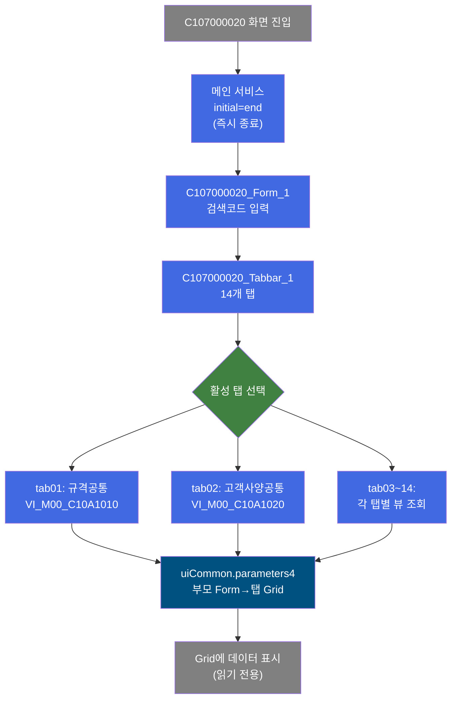
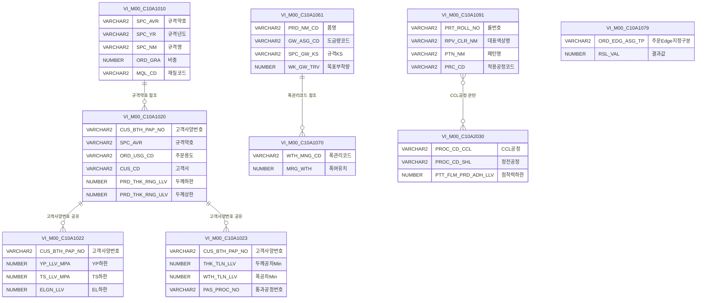

<h1 style="font-size: 40px; text-align: center; font-weight:
   bold; margin: 30px 0;">
  C107000020 레거시 시스템 분석 종합 보고서
</h1>


# 1. 시스템 개요
- **서비스 ID**: C107000020
- **업무명**: 업무기준조회
- **분석 일시**: 2026-03-17 08:45 KST
- **분석 시간**: 약 10분
- **전체 Activity 수**: 0개 (initial="end", 즉시 종료 서비스)
- **분석자**: Claude Opus 4.6 / Claude Sonnet 4.6
- **분석 도구**: /analyze-service C107000020
- **문서 버전**: 1.0

# 📊 비즈니스 프로세스 분석

## 시스템 목적

C107000020은 CCL(Color Coating Line) 공정의 **업무기준 마스터 데이터를 조회**하는 화면이다. 14개 탭으로 구성되어 규격공통, 고객사양, 도금량기준, 제품폭여유, 칼라Print롤관리 등 다양한 업무기준 정보를 통합적으로 제공한다.

이 서비스의 메인 서비스 XML(`C107000020-service.xml`)은 `initial="end"`로 설정되어 **서버 측 비즈니스 로직 없이 즉시 종료**된다. 실제 데이터 조회는 각 탭별 서비스(`C107000020tab01-service` ~ `C107000020tab14-service`)가 담당하며, 모든 데이터는 M00APUSER 스키마의 뷰(`VI_M00_C10Axxxx`)를 통해 읽기 전용으로 제공된다.

주요 사용자는 CCL 공정 오퍼레이터 및 생산관리 담당자로, 작업지시 수립이나 품질 관리 시 필요한 업무기준을 참조하는 용도로 활용한다. 메인 폼의 검색코드(SEARCH_CD)를 입력하면 활성 탭의 그리드에 해당 조건의 기준 데이터가 표시된다.

## 주요 유즈케이스

### UC-01: 규격공통 기준 조회
- **Actor**: CCL 공정 오퍼레이터, 생산관리 담당자
- **목적**: 제품 규격의 공통 정보(규격약호, 규격명, 재질코드, 적용강종 등)를 조회하여 작업지시 또는 품질 관리 시 참조

- **전제조건**:
  - 사용자가 시스템에 로그인되어 있음
  - VI_M00_C10A1010 뷰에 규격 마스터 데이터가 존재함

- **주요 흐름**:
  1. 사용자가 C107000020 화면에 진입 → 기본 탭 "규격공통" 활성화
  2. 검색코드(SEARCH_CD) 입력란에 규격약호 또는 규격명 일부를 입력
  3. "조회" 버튼 클릭
  4. find() 함수 실행 → 활성 탭 프레임의 find() 호출
  5. 탭 내 find() → `uiCommon.parameters4('C107000020_Form_1', 'C107000020tab01_Grid_1', 'find')` 호출
  6. C107000020tab01-service 호출 → VI_M00_C10A1010 뷰에서 데이터 조회
  7. Grid에 규격 목록 표시 (규격약호, 규격년도, 규격명, 비중, 재질코드 등)

- **대체 흐름**:
  - 검색코드 미입력 시: 전체 규격 목록 조회
  - 조회 결과 없음: 빈 그리드 표시

- **후행조건**:
  - 조회된 규격 데이터가 그리드에 표시됨
  - 컨텍스트 메뉴를 통해 엑셀 내보내기 가능

### UC-02: 고객사양 정보 조회 (고객사양공통/재질사양/인수도)
- **Actor**: 품질관리 담당자, 영업 담당자
- **목적**: 고객별 사양 정보(두께/폭/길이 범위, 재질 기준값, 인수도 공차 등)를 확인하여 주문 접수 및 품질 판정 시 참조

- **전제조건**:
  - 고객사양번호(CUS_BTH_PAP_NO)에 해당하는 데이터가 등록되어 있음
  - VI_M00_C10A1020, VI_M00_C10A1022, VI_M00_C10A1023 뷰 접근 권한

- **주요 흐름**:
  1. "고객사양공통" 탭 클릭 → onLoadGrid 이벤트로 자동 조회
  2. 고객사양번호, 규격약호, 주문용도, 고객사, 두께/폭/길이 범위 등 20개 컬럼 표시
  3. "고객재질사양" 탭 전환 → YP/TS/EL/HRB/ERI 상하한값, 굴곡, 시편채취 정보 조회
  4. "고객인수도" 탭 전환 → 두께/폭/길이 공차, 반곡/중곡/외곡, 직선도/직각도 등 조회

- **대체 흐름**:
  - 검색코드로 특정 고객사양번호 필터링 가능
  - 컨텍스트 메뉴 → 엑셀 내보내기로 사양 데이터 추출

- **후행조건**:
  - 고객사양 데이터가 각 탭별 그리드에 표시됨

### UC-03: 도금량 기준 조회
- **Actor**: CCL 공정 오퍼레이터, 품질관리 담당자
- **목적**: 품명별/도금량코드별 규격 기준값(KS/JIS/ASTM/ISO/EU/AS)과 목표부착량/허용 범위를 확인

- **전제조건**:
  - VI_M00_C10A1061 뷰에 도금량 기준 데이터가 존재함

- **주요 흐름**:
  1. "도금량기준" 탭 클릭 → onLoadGrid 자동 조회
  2. 21개 컬럼 그리드에 품명, 도금량코드, 각 규격별 기준값 표시
  3. 목표부착량(전면/후면), 부착량 상하한, 도금두께 상하한/목표값 확인

- **대체 흐름**:
  - 검색코드로 특정 품명 또는 도금량코드 필터링

- **후행조건**:
  - 도금량 기준 데이터가 그리드에 표시되어 작업 시 참조 가능

### UC-04: 칼라 Print 롤 관리 정보 조회
- **Actor**: CCL 공정 오퍼레이터
- **목적**: 칼라 프린트 롤의 상세 정보(롤번호, 색상, 패턴, 규격, 제작/입고/반출일)를 조회하여 롤 재고 및 사용 이력 확인

- **전제조건**:
  - VI_M00_C10A1091 뷰에 프린트 롤 데이터가 존재함

- **주요 흐름**:
  1. "칼라Print롤관리" 탭 클릭 → onLoadGrid 자동 조회
  2. 20개 컬럼 그리드에 롤번호, 수량, 대표색상명, 적용공정, Pattern명, 롤 규격(경/둘레/폭) 등 표시
  3. 롤 제작업체, 제작일, 입고일, 반출일, BabyRoll 정보 확인

- **대체 흐름**:
  - "Uni-Tex롤관리" 탭에서 Uni-Tex 전용 롤 정보 조회 (6개 컬럼 간소화 뷰)

- **후행조건**:
  - 롤 관리 데이터가 그리드에 표시됨

### UC-05: 공차 기준 조회 (폭/길이 공차, 보호필름 점착력)
- **Actor**: 품질관리 담당자
- **목적**: 고객사양별 폭/길이 공차 기준 및 보호필름 점착력 기준을 확인

- **전제조건**:
  - VI_M00_C10A2030 뷰에 공차/점착력 기준 데이터가 존재함

- **주요 흐름**:
  1. "고객사양폭공차기준" 탭 클릭 → 주문폭관리코드별 폭Min/Max 조회
  2. "고객사양길이공차기준" 탭 클릭 → 주문길이관리코드별 길이Min/Max 조회
  3. "보호필름점착력" 탭 클릭 → 점착력코드별 점착력 상하한값 조회

- **대체 흐름**:
  - 검색코드로 특정 관리코드 필터링

- **후행조건**:
  - 공차/점착력 기준값이 그리드에 표시됨

---

# 🖥️ 사용자 인터페이스 요구사항

## 화면 레이아웃 상세

### Layout 구조 (initLayout)
```javascript
{
  itemType: "layout",
  dirType: "row",  // 수직 분할
  components: [
    {
      id: "C107000020_Form_1",
      height: "30px",
      width: "980px",
      position: { left: 0, top: 0 },
      component: {
        itemType: "form",
        formId: "C107000020_Form_1",
        referenceItem: "C107000020_Tabbar_1"
      }
    },
    {
      id: "C107000020_Tabbar_1",
      height: "562px",
      width: "980px",
      position: { left: 0, top: 31 },
      component: {
        itemType: "tabbar",
        skin: "modern",
        tabs: [
          { id: "TAB_C10A1010", label: "규격공통", href: "C107000020tab01.jsp", selected: true },
          { id: "TAB_C10A1020", label: "고객사양공통", href: "C107000020tab02.jsp" },
          { id: "TAB_C10A1022", label: "고객재질사양", href: "C107000020tab03.jsp" },
          { id: "TAB_C10A1023", label: "고객인수도", href: "C107000020tab04.jsp" },
          { id: "TAB_C10A1054", label: "통과공정", href: "C107000020tab05.jsp" },
          { id: "TAB_C10A1061", label: "도금량기준", href: "C107000020tab06.jsp" },
          { id: "TAB_C10A1070", label: "제품폭여유", href: "C107000020tab07.jsp" },
          { id: "TAB_C10A1079", label: "PL폭마진량", href: "C107000020tab08.jsp" },
          { id: "TAB_C10A1091", label: "칼라Print롤관리", href: "C107000020tab09.jsp" },
          { id: "TAB_C10A1092", label: "Uni-Tex롤관리", href: "C107000020tab10.jsp" },
          { id: "TAB_C10A2030", label: "칼라정전라인", href: "C107000020tab11.jsp" },
          { id: "TAB_C10A2040", label: "보호필름점착력", href: "C107000020tab12.jsp" },
          { id: "TAB_C10A2181", label: "고객사양폭공차기준", href: "C107000020tab13.jsp" },
          { id: "TAB_C10A2182", label: "고객사양길이공차기준", href: "C107000020tab14.jsp" }
        ]
      }
    }
  ]
}
```

## 입출력 요소

### Form 컴포넌트
**C107000020_Form_1** (메인 검색 폼)
- SEARCH_CD: input - 검색코드 (width: 120px, maxLength: 20, 배경색: #FFFFC0)
- find: Button - 조회 → 활성 탭의 find() 호출
- winClose: Button - 닫기 → 화면 종료

각 탭별 Form (`C107000020tab01_Form_1` ~ `C107000020tab14_Form_1`)은 모두 빈 폼으로, 탭 자체의 검색 조건은 없음.

### Grid 컴포넌트

**C107000020tab01_Grid_1 (규격공통)**
- 편집 가능 여부: 아니오 (읽기 전용)
- Split: 없음
- 소스 테이블: VI_M00_C10A1010
- 페이징: 19행
- 주요 컬럼 (11개):

  **규격 식별 정보**:
  - SPC_AVR: ro - 규격약호 (14%, 좌측정렬)
  - SPC_YR: ro - 규격년도 (8%, 중앙정렬)
  - SPC_NM: ro - 규격명 (30%, 좌측정렬)
  - SPC_FUL_NM: ro - 규격전체명 (15%, 좌측정렬)

  **규격 속성 정보**:
  - ORD_GRA: ro - 비중 (6%, 우측정렬)
  - ACPT_RT_SPC: ro - 인수도규격 (10%, 좌측정렬)
  - MQL_CD: ro - 재질코드 (6%, 중앙정렬)
  - SPC_OFC: ro - 규격기관 (6%, 중앙정렬)

  **적용 정보**:
  - APLY_SPC: ro - 적용규격 (10%, 좌측정렬)
  - APLY_STL_KND: ro - 적용강종 (10%, 좌측정렬)
  - DOM_CVT_SPC_AVR: ro - 변환강종 (10%, 좌측정렬)

---

**C107000020tab02_Grid_1 (고객사양공통)**
- 편집 가능 여부: 아니오 (읽기 전용)
- Split: 없음
- 소스 테이블: VI_M00_C10A1020
- 페이징: 19행
- 주요 컬럼 (20개):

  **고객사양 식별**:
  - CUS_BTH_PAP_NO: ro - 고객사양번호 (10%, 중앙정렬)
  - SPC_AVR: ro - 규격약호 (10%, 좌측정렬)
  - SPC_YR: ro - 규격년도 (6%, 중앙정렬)
  - ORD_USG_CD: ro - 주문용도 (6%, 중앙정렬)
  - CUS_CD: ro - 고객사 (6%, 중앙정렬)
  - PRD_NM_CD: ro - 품명 (4%, 중앙정렬)

  **제품 치수 범위**:
  - PRD_THK_RNG_LLV: ro - 제품두께범위하한값 (14%, 우측정렬)
  - PRD_THK_RNG_ULV: ro - 제품두께범위상한값 (14%, 우측정렬)
  - PRD_WTH_RNG_LLV: ro - 제품폭범위하한값 (12%, 우측정렬)
  - PRD_WTH_RNG_ULV: ro - 제품폭범위상한값 (12%, 우측정렬)
  - PRD_LTH_RNG_LLV: ro - 제품길이범위하한값 (14%, 우측정렬)
  - PRD_LTH_RNG_ULV: ro - 제품길이범위상한값 (14%, 우측정렬)

  **압연/두께 정보**:
  - CUS_REQ_ROL_THK: ro - 고객요청압연두께 (12%, 우측정렬)
  - CUS_REQ_ROL_THK_UNT: ro - 고객요청압연두께단위 (14%, 우측정렬)
  - ORD_THK_TP: ro - 두께구분코드 (10%, 우측정렬)
  - PRD_THK_CAL_APL_CD: ro - 제품두께계산적용코드 (14%, 중앙정렬)

  **도금/표면 정보**:
  - GW_ASG_CD: ro - 도금량코드 (10%, 중앙정렬)
  - ORD_SUR_HND_CD: ro - 표면처리코드 (10%, 중앙정렬)
  - CCL_BOM_NO: ro - CCL_BOM번호 (10%, 중앙정렬)
  - CUS_BTH_NM: ro - 고객사양명 (10%, 좌측정렬)

---

**C107000020tab03_Grid_1 (고객재질사양)**
- 편집 가능 여부: 아니오 (읽기 전용)
- Split: 없음
- 소스 테이블: VI_M00_C10A1022
- 페이징: 19행
- 주요 컬럼 (15개):

  **식별 정보**:
  - CUS_BTH_PAP_NO: ro - 고객사양번호 (10%, 중앙정렬)

  **기계적 성질 (상하한값)**:
  - YP_LLV_MPA: ro - YP하한값 (8%, 우측정렬)
  - YP_ULV_MPA: ro - YP상한값 (8%, 우측정렬)
  - TS_LLV_MPA: ro - TS하한값 (8%, 우측정렬)
  - TS_ULV_MPA: ro - TS상한값 (8%, 우측정렬)
  - ELGN_LLV: ro - EL하한값 (8%, 우측정렬)
  - ELGN_ULV: ro - EL상한값 (8%, 우측정렬)
  - HRB_LLV: ro - HRB하한값 (8%, 우측정렬)
  - HRB_ULV: ro - HRB상한값 (8%, 우측정렬)
  - ER_LLV: ro - ERI하한값 (8%, 우측정렬)
  - ER_ULV: ro - ERI상한값 (8%, 우측정렬)

  **시편 정보**:
  - MQL_BND_TST_STD_CD: ro - 굴곡 (4%, 중앙정렬)
  - TST_PIC_GTH_INST_LOC: ro - 시편채취위치 (10%, 중앙정렬)
  - TST_PIC_GTH_INST_LTH: ro - 시편채취길이 (10%, 중앙정렬)
  - TPG_RGS_N: ro - 시편가공코드 (10%, 중앙정렬)

---

**C107000020tab04_Grid_1 (고객인수도)**
- 편집 가능 여부: 아니오 (읽기 전용)
- Split: 없음
- 소스 테이블: VI_M00_C10A1023
- 페이징: 19행
- 주요 컬럼 (15개):

  **식별 정보**:
  - CUS_BTH_PAP_NO: ro - 고객사양번호 (10%, 중앙정렬)

  **치수 공차**:
  - THK_TLN_LLV: ro - 두께공차Min (10%, 우측정렬)
  - THK_TLN_ULV: ro - 두께공차Max (10%, 우측정렬)
  - WTH_TLN_LLV: ro - 폭공차Min (10%, 우측정렬)
  - WTH_TLN_ULV: ro - 폭공차Max (10%, 우측정렬)
  - LTH_TLN_LLV: ro - 길이공차Min (10%, 우측정렬)
  - LTH_TLN_ULV: ro - 길이공차Max (10%, 우측정렬)

  **형상 품질**:
  - HWAV_H: ro - 반곡 (4%, 우측정렬)
  - MWAV_H: ro - 중곡 (4%, 우측정렬)
  - EWAV_H: ro - 외곡 (4%, 우측정렬)
  - SLR_ULV: ro - 직선도 (6%, 우측정렬)
  - RAR_ULV: ro - 직각도 (6%, 중앙정렬)
  - DGLN_DIF_ULV: ro - 대각선공차 (10%, 중앙정렬)
  - STPN: ro - 급준도 (10%, 중앙정렬)
  - TLC: ro - Telescope (10%, 중앙정렬)

---

**C107000020tab05_Grid_1 (통과공정)**
- 편집 가능 여부: 아니오 (읽기 전용)
- Split: 없음
- 소스 테이블: VI_M00_C10A1023
- 페이징: 20행
- 주요 컬럼 (6개):

  - PAS_PROC_NO: ro - 통과공정번호 (10%, 중앙정렬)
  - PROC_SEQ: ro - 순서 (10%, 중앙정렬)
  - MAIN_PROC_CD: ro - 주공정 (10%, 중앙정렬)
  - SUB_PROC_CD1: ro - 대체공정1 (10%, 중앙정렬)
  - SUB_PROC_CD2: ro - 대체공정2 (10%, 중앙정렬)
  - SUB_PROC_CD3: ro - 대체공정3 (10%, 중앙정렬)

---

**C107000020tab06_Grid_1 (도금량기준)**
- 편집 가능 여부: 아니오 (읽기 전용)
- Split: 없음
- 소스 테이블: VI_M00_C10A1061
- 페이징: 19행
- 주요 컬럼 (21개):

  **제품 식별**:
  - PRD_NM_CD: ro - 품명 (10%, 중앙정렬)
  - GW_ASG_CD: ro - 도금량코드 (10%, 중앙정렬)

  **규격별 기준값**:
  - SPC_GW_KS: ro - 규격KS (10%, 중앙정렬)
  - SPC_GW_JIS: ro - 규격JIS (10%, 중앙정렬)
  - SPC_GW_ASTM: ro - 규격ASTM (10%, 중앙정렬)
  - SPC_GW_ISO: ro - 규격ISO (10%, 중앙정렬)
  - SPC_GW_EU: ro - 규격EU (10%, 중앙정렬)
  - SPC_GW_AS: ro - 규격AS (10%, 중앙정렬)

  **목표부착량**:
  - WK_GW_TRV: ro - 목표부착량 (10%, 우측정렬)
  - WK_GW_TRV_FRN: ro - 목표부착량전면 (10%, 우측정렬)
  - WK_GW_TRV_BAK: ro - 목표부착량후면 (10%, 우측정렬)

  **부착량 상하한**:
  - WK_GW_FRN_LLV: ro - 전면부착량하한 (10%, 우측정렬)
  - WK_GW_FRN_ULV: ro - 전면부착량상한 (10%, 우측정렬)
  - WK_GW_BAK_LLV: ro - 후면부착량하한 (10%, 우측정렬)
  - WK_GW_BAK_ULV: ro - 후면부착량상한 (10%, 우측정렬)
  - WK_GW_TOT_LLV: ro - 부착량하한 (10%, 우측정렬)
  - WK_GW_TOT_ULV: ro - 부착량상한 (10%, 우측정렬)

  **도금두께**:
  - GAL_THK_LLV: ro - 도금두께하한 (10%, 우측정렬)
  - GAL_THK_ULV: ro - 도금두께상한 (10%, 우측정렬)
  - GAL_THK_TRV: ro - 도금두께목표 (10%, 우측정렬)
  - SPC_GAL_THK: ro - 상당도금두께 (10%, 우측정렬)

---

**C107000020tab07_Grid_1 (제품폭여유)**
- 편집 가능 여부: 아니오 (읽기 전용)
- Split: 없음
- 소스 테이블: VI_M00_C10A1070
- 페이징: 20행
- 주요 컬럼 (2개):

  - WTH_MNG_CD: ro - 폭관리코드 (10%, 중앙정렬)
  - MRG_WTH: ro - 폭여유치 (10%, 중앙정렬)

---

**C107000020tab08_Grid_1 (PL폭마진량)**
- 편집 가능 여부: 아니오 (읽기 전용)
- Split: 없음
- 소스 테이블: VI_M00_C10A1079
- 페이징: 20행
- 주요 컬럼 (2개):

  - ORD_EDG_ASG_TP: ro - 주문Edge지정구분 (12%, 중앙정렬)
  - RSL_VAL: ro - 결과값 (10%, 중앙정렬)

---

**C107000020tab09_Grid_1 (칼라Print롤관리)**
- 편집 가능 여부: 아니오 (읽기 전용)
- Split: 없음
- 소스 테이블: VI_M00_C10A1091
- 페이징: 19행
- 주요 컬럼 (20개):

  **롤 식별**:
  - PRT_ROLL_NO: ro - ROLL-NO (10%, 중앙정렬)
  - PRT_ROLL_QTY: ro - 수량 (5%, 우측정렬)
  - RPV_CLR_NM: ro - 대표색상명 (15%, 좌측정렬)
  - PRC_CD: ro - 적용공정코드 (10%, 중앙정렬)

  **패턴 정보**:
  - PTN_NM: ro - Pattern명 (15%, 좌측정렬)
  - PRT_PTN_NM: ro - 인쇄조각 (10%, 좌측정렬)
  - PRT_PTN_CD: ro - 프린트패턴코드 (10%, 중앙정렬)
  - PRT_ROLL_PTN_CD: ro - 롤패턴코드 (8%, 중앙정렬)

  **용도 정보**:
  - USG_NM: ro - 용도구분 (8%, 좌측정렬)
  - EAR_USG_NM: ro - 초기용도 (10%, 좌측정렬)

  **롤 규격**:
  - PRT_ROLL_DIA: ro - Roll경 (7%, 우측정렬)
  - PRT_ROLL_CRCM: ro - Roll둘레 (7%, 우측정렬)
  - PRT_ROLL_WTH: ro - Roll폭 (7%, 우측정렬)
  - PRT_ROLL_ENGR: ro - EngravingSize (12%, 우측정렬)

  **제작/입출고 정보**:
  - PRT_ROLL_CMP: ro - 제작업체 (10%, 좌측정렬)
  - PRT_ROLL_MNF_DD: ro - 롤제작일 (8%, 중앙정렬)
  - PRT_ROLL_WHS_DD: ro - 롤입고일 (8%, 중앙정렬)
  - PRT_ROLL_CRYT_DD: ro - 롤반출일 (8%, 중앙정렬)
  - PRT_BABY_ROLL: ro - BabyRoll (15%, 좌측정렬)
  - WHS_CRYT_REA: ro - 입고/반출사유 (15%, 좌측정렬)

---

**C107000020tab10_Grid_1 (Uni-Tex롤관리)**
- 편집 가능 여부: 아니오 (읽기 전용)
- Split: 없음
- 소스 테이블: VI_M00_C10A1091
- 페이징: 20행
- 주요 컬럼 (6개):

  - PRT_ROLL_NO: ro - ROLL-NO (10%, 중앙정렬)
  - RPV_CLR_NM: ro - 대표색상명 (20%, 좌측정렬)
  - PRC_CD: ro - 적용공정 (10%, 중앙정렬)
  - PTN_NM: ro - Pattern명 (20%, 좌측정렬)
  - PRT_PTN_CD: ro - PatternCode (12%, 중앙정렬)
  - PRT_ROLL_WHS_DD: ro - 롤입고일 (10%, 중앙정렬)

---

**C107000020tab11_Grid_1 (칼라정전라인)**
- 편집 가능 여부: 아니오 (읽기 전용)
- Split: 없음
- 소스 테이블: VI_M00_C10A2030
- 페이징: 20행
- 주요 컬럼 (2개):

  - PROC_CD_CCL: ro - CCL공정 (15%, 중앙정렬)
  - PROC_CD_SHL: ro - 정전공정 (15%, 중앙정렬)

---

**C107000020tab12_Grid_1 (보호필름점착력)**
- 편집 가능 여부: 아니오 (읽기 전용)
- Split: 없음
- 소스 테이블: VI_M00_C10A2030
- 페이징: 20행
- 주요 컬럼 (3개):

  - PTT_FLM_PRD_ADH_CD: ro - 보호필름점착력코드 (15%, 중앙정렬)
  - PTT_FLM_PRD_ADH_LLV: ro - 점착력하한 (15%, 중앙정렬)
  - PTT_FLM_PRD_ADH_ULV: ro - 점착력상한 (15%, 중앙정렬)

---

**C107000020tab13_Grid_1 (고객사양폭공차기준)**
- 편집 가능 여부: 아니오 (읽기 전용)
- Split: 없음
- 소스 테이블: VI_M00_C10A2030
- 페이징: 20행
- 주요 컬럼 (3개):

  - ORD_WTH_MNG_CD: ro - 주문폭관리코드 (15%, 중앙정렬)
  - WTH_TLN_LLV: ro - 폭Min (15%, 중앙정렬)
  - WTH_TLN_ULV: ro - 폭Max (15%, 중앙정렬)

---

**C107000020tab14_Grid_1 (고객사양길이공차기준)**
- 편집 가능 여부: 아니오 (읽기 전용)
- Split: 없음
- 소스 테이블: VI_M00_C10A2030
- 페이징: 20행
- 주요 컬럼 (3개):

  - ORD_LTH_MNG_CD: ro - 주문길이관리코드 (15%, 중앙정렬)
  - LTH_TLN_LLV: ro - 길이Min (15%, 중앙정렬)
  - LTH_TLN_ULV: ro - 길이Max (15%, 중앙정렬)

## 화면 동작 흐름

### 1. 화면 초기 로딩
```
1. 화면 진입 (C107000020.jsp)
2. ui.initializeDHTMLX() 호출
3. C107000020_Form_1 로드 (검색코드 입력, 조회/닫기 버튼)
4. C107000020_Tabbar_1 로드 (14개 탭, skin="modern")
5. 기본 탭 "규격공통" (TAB_C10A1010) 자동 선택
6. C107000020tab01.jsp 로드 → ui.initializeDHTMLX()
7. onXLEEvent(onLoadGrid) 이벤트 등록
8. onLoadGrid() 자동 실행:
   - uiCommon.parameters4('C107000020_Form_1', 'C107000020tab01_Grid_1', 'find') 호출
   - C107000020tab01_Grid_1에 VI_M00_C10A1010 데이터 자동 조회
9. onXLE 이벤트 해제 (detachEvent) → 최초 1회만 자동 로드
```

### 2. 검색코드로 기준 데이터 조회
```
1. 사용자가 SEARCH_CD 입력란에 검색코드 입력 (예: 규격약호, 고객사양번호)
2. "조회" 버튼 클릭 → find('find', formDivObj, 'C107000020_Tabbar_1') 호출
3. items['C107000020_Tabbar_1'].activeTabFrame().contentWindow.find('find') 실행
4. 활성 탭의 find() 함수 실행:
   - uiCommon.parameters4('C107000020_Form_1', '[탭ID]_Grid_1', 'find') 호출
   - 부모 폼(C107000020_Form_1)의 SEARCH_CD 값을 파라미터로 포함
5. items['[탭ID]_Grid_1'].loadData(findUrl) 실행
6. 해당 탭 서비스 호출 → 뷰 조회 → Grid에 결과 표시
```

### 3. 탭 전환 시 데이터 자동 조회
```
1. 사용자가 다른 탭 클릭 (예: "고객사양공통" 탭)
2. 해당 탭의 JSP 로드 (C107000020tab02.jsp)
3. ui.initializeDHTMLX() 실행
4. onXLEEvent(onLoadGrid) 이벤트 등록
5. onLoadGrid() 자동 실행:
   - uiCommon.parameters4('C107000020_Form_1', 'C107000020tab02_Grid_1', 'find') 호출
   - 부모 폼의 현재 SEARCH_CD 값으로 자동 조회
6. Grid에 해당 뷰 데이터 표시
7. onXLE 이벤트 해제 (최초 1회만)
```

### 4. 컨텍스트 메뉴 기능 사용
```
1. Grid 위에서 마우스 우클릭
2. contextmenu.xml 기반 컨텍스트 메뉴 표시
3. 메뉴 항목 선택:
   - "move_grid": 컬럼 이동 토글 (enableColumnMove)
   - "filter_grid": 헤더 필터 메뉴 활성화 (enableHeaderMenu)
   - "editable_grid": 편집 모드 토글 (setEditable)
   - "excel_grid": 엑셀 내보내기 (gridObj.toExcel)
```

## JavaScript 모듈

**C107000020.jsp** (메인 화면 스크립트)
- find(eventName, formDivObj, referenceItem): 활성 탭 프레임의 find() 함수 호출 (items[referenceItem].activeTabFrame().contentWindow.find)
- refresh(referenceItem): 그리드 초기화 후 uiCommon.parameters로 재조회 (clearDataProcess → loadData)
- add(referenceItem): 신규행 추가 (items[referenceItem].addRow)
- remove(referenceItem): 행 삭제 (items[referenceItem].removeRow)
- copy(referenceItem): 클립보드 복사 (items[referenceItem].copyRowContent)
- undo(referenceItem): 실행취소
- redo(referenceItem): 다시실행
- onGridContextMenuClick(id, gridObj, menuObj): 컨텍스트 메뉴 이벤트 (컬럼이동/필터/편집/엑셀)
- findMessage(referenceItem): 메시지박스 표시 (uiCommon.message)

**C107000020tab01.jsp ~ tab14.jsp** (각 탭 스크립트, 동일 구조)
- find(eventName): uiCommon.parameters4로 부모 폼 검색조건 전달 후 Grid 데이터 로드
- onLoadGrid(): 탭 로드 시 자동 조회 (uiCommon.parameters4 → loadData, 최초 1회)
- add/remove/copy/undo/redo: 메인과 동일한 CRUD 유틸리티
- onGridContextMenuClick: 메인과 동일한 컨텍스트 메뉴 처리
- findMessage: 메시지박스 표시

## 주요 이벤트 핸들러

**find (조회 버튼 클릭)**
- 이벤트 타입: Button Click (Form Command)
- 처리 내용:
  1. 메인 JSP의 find() 호출
  2. items['C107000020_Tabbar_1'].activeTabFrame() 으로 활성 탭 프레임 접근
  3. 활성 탭의 contentWindow.find(eventName) 호출
  4. 탭 내부에서 uiCommon.parameters4('C107000020_Form_1', '[탭]_Grid_1', 'find') 실행
  5. Grid에 데이터 로드

**onLoadGrid (탭 로드 시 자동 조회)**
- 이벤트 타입: onXLEEvent (Grid XML Load End)
- 처리 내용:
  1. 탭 JSP 로드 완료 시 자동 실행
  2. uiCommon.parameters4로 부모 폼(C107000020_Form_1)의 SEARCH_CD 전달
  3. Grid 데이터 자동 로드
  4. detachEvent(onXLE)로 이벤트 해제 (최초 1회만 실행)

**onGridContextMenuClick (그리드 컨텍스트 메뉴)**
- 이벤트 타입: Context Menu Click
- 처리 내용:
  1. 메뉴 체크박스 상태 확인 (getCheckboxState)
  2. move_grid: 컬럼 드래그 이동 토글
  3. filter_grid: 헤더 필터 메뉴 활성화
  4. editable_grid: 그리드 편집 모드 토글
  5. excel_grid: 엑셀 파일 내보내기 (gridexcel 서블릿 호출)

# 📊 핵심 워크플로우 다이어그램



## ER 다이어그램 (참조 뷰 관계)



관계 설명:
- **VI_M00_C10A1010** (규격공통): 규격약호/규격년도 기준의 기본 규격 정보. 고객사양공통 뷰와 규격약호 공유
- **VI_M00_C10A1020** (고객사양공통): 고객사양번호 기준의 제품 치수 범위 정보. 재질사양/인수도 뷰와 고객사양번호 공유
- **VI_M00_C10A1022/A1023**: 고객재질사양/인수도 정보. 고객사양공통과 동일 키(CUS_BTH_PAP_NO)
- **VI_M00_C10A1061** (도금량기준): 품명+도금량코드 기준의 각 규격별 기준값
- **VI_M00_C10A1091** (칼라Print롤관리): 프린트 롤 정보 (tab09, tab10 공유)
- **VI_M00_C10A2030**: 칼라정전라인/보호필름점착력/폭공차/길이공차 (tab11~14 공유)

---

# 📌 특이사항 및 주의사항

## 1. 메인 서비스 XML 빈 껍데기 구조
- **initial="end"**: C107000020-service.xml은 `initial="end"`로 설정되어 서버 측 Activity가 전혀 없음
- **트랜잭션 매니저만 존재**: `<transaction-manager id="tx1" commit="true" />`만 선언되어 있으나 실제 사용되지 않음
- **탭별 독립 서비스**: 실제 데이터 조회는 C107000020tab01-service ~ tab14-service가 각각 담당하며, 이들은 본 분석 범위에 포함되지 않음

## 2. 부모-자식 프레임 간 크로스 프레임 호출 패턴
- **uiCommon.parameters4**: 부모 폼(C107000020_Form_1)의 검색 조건을 자식 탭 프레임의 Grid에 전달하는 크로스 프레임 유틸리티 함수
- **activeTabFrame().contentWindow.find()**: 메인 JSP에서 활성 탭의 find 함수를 직접 호출하는 패턴으로, 탭 간 느슨한 결합이 아닌 직접 참조 방식

## 3. onXLE 이벤트 1회성 자동 조회 패턴
- 각 탭 JSP에서 `onXLEEvent(onLoadGrid)` → `detachEvent(onXLE)` 패턴 사용
- Grid XML 로드 완료 시 자동 조회를 1회만 실행하고 이벤트 해제
- 이후 수동 조회(find 버튼)로만 데이터 갱신 가능

## 4. 동일 뷰를 다른 탭에서 공유 사용
- **VI_M00_C10A1091**: "칼라Print롤관리"(tab09)와 "Uni-Tex롤관리"(tab10)가 동일 뷰 사용 (컬럼 수만 다름: 20개 vs 6개)
- **VI_M00_C10A2030**: "칼라정전라인"(tab11), "보호필름점착력"(tab12), "고객사양폭공차기준"(tab13), "고객사양길이공차기준"(tab14) 4개 탭이 동일 뷰 공유
- **VI_M00_C10A1023**: "고객인수도"(tab04)와 "통과공정"(tab05)가 동일 뷰를 다른 컬럼으로 표시

## 5. 컨텍스트 메뉴의 편집 모드 토글 기능
- 읽기 전용 조회 화면임에도 컨텍스트 메뉴에 `editable_grid` 옵션이 존재하여 Grid 편집 모드 전환 가능
- 편집 모드 전환 시 데이터 수정이 가능하나, 저장 서비스가 없어 변경 내용은 반영되지 않음
- 이는 프레임워크 공통 컨텍스트 메뉴(contextmenu.xml)를 그대로 사용하기 때문

## 6. c10.ui.js 공통 유틸리티 의존
- 모든 JSP에서 `./js/c10.ui.js` 스크립트를 포함하여 C10 모듈 전용 UI 유틸리티 사용
- `uiCommon.parameters4`, `uiCommon.message`, `ui.initializeDHTMLX` 등 프레임워크 확장 함수에 의존

# 📚 참고 문서

- **Service XML**: `src/service/C107000020-service.xml`
- **JSP**: `WebContents/C107000020.jsp` (메인), `WebContents/C107000020tab01.jsp` ~ `C107000020tab14.jsp` (탭)
- **JS**: `WebContents/js/c10.ui.js` (공통 유틸리티)
- **Grid XML**: `WebContents/header/kr/C107000020tab01/` ~ `C107000020tab14/` (각 탭별 Grid/Form/Messagebox XML)
- **Tabbar XML**: `WebContents/header/kr/C107000020/C107000020_Tabbar_1.xml`
- **데이터 뷰**: VI_M00_C10A1010, VI_M00_C10A1020, VI_M00_C10A1022, VI_M00_C10A1023, VI_M00_C10A1061, VI_M00_C10A1070, VI_M00_C10A1079, VI_M00_C10A1091, VI_M00_C10A2030
