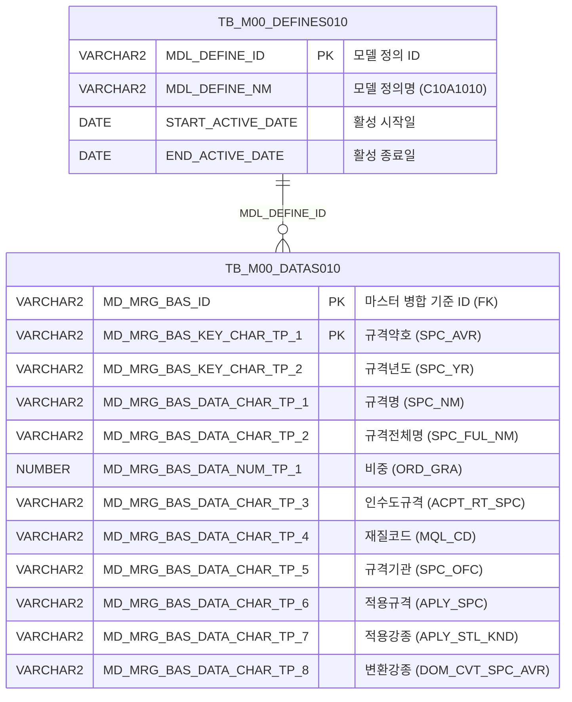

<h1 style="font-size: 40px; text-align: center; font-weight:
   bold; margin: 30px 0;">
  C107000020tab01 레거시 시스템 분석 종합 보고서
</h1>


# 1. 시스템 개요
- **서비스 ID**: C107000020tab01
- **업무명**: 규격공통조회 (탭1: 규격 마스터 조회)
- **분석 일시**: 2026-03-17 08:56 KST
- **분석 시간**: 약 4분
- **전체 Activity 수**: 2개 (built-in)
- **분석자**: Claude Opus 4.6 + Sonnet 4.6
- **분석 도구**: /analyze-service C107000020tab01
- **문서 버전**: 1.0

# 📊 비즈니스 프로세스 분석

## 시스템 목적

C107000020tab01은 C10 모듈(냉연 MES)에서 사용하는 **규격 공통 마스터 데이터 조회** 화면의 첫 번째 탭이다. M00APUSER 스키마의 마스터 정의 테이블(TB_M00_DEFINES010)과 데이터 테이블(TB_M00_DATAS010)을 조인하여 `C10A1010` 모델에 등록된 규격 정보(규격약호, 규격명, 비중, 재질코드, 규격기관 등)를 조회한다.

이 화면은 순수 **읽기 전용 조회 화면**으로, 데이터 수정/삽입/삭제 기능이 없다. 상위 탭(C107000020)의 검색 폼에서 입력한 검색 코드(SEARCH_CD)를 기반으로 규격약호 LIKE 검색을 수행하며, 페이지 진입 시 자동 조회(onXLE 이벤트)를 실행한다. 작업지시, 품질관리 등 타 화면에서 규격 정보 참조 시 활용되는 기준 정보 조회 화면이다.

## 주요 유즈케이스

### UC-01: 규격 마스터 전체 조회
- **Actor**: MES 오퍼레이터 / 품질 담당자
- **목적**: C10 모듈에서 사용하는 규격 마스터 데이터 전체 목록을 조회하여 규격약호, 규격명, 비중, 재질코드 등을 확인

- **전제조건**:
  - 사용자가 MES 시스템에 로그인되어 있음
  - C107000020 화면에 접근 권한이 있음
  - M00APUSER.TB_M00_DEFINES010에 'C10A1010' 모델이 활성 상태로 등록되어 있음

- **주요 흐름**:
  1. 사용자가 C107000020 화면에서 tab01 탭을 선택
  2. 페이지 로드 시 onXLE 이벤트가 발생하여 자동으로 find() 함수 호출
  3. 상위 탭의 C107000020_Form_1에서 SEARCH_CD 파라미터를 수집 (uiCommon.parameters4)
  4. C107000020tab01-service 서비스의 "조회" Activity 실행 (C107000020tab01.select)
  5. TB_M00_DEFINES010과 TB_M00_DATAS010 조인 결과가 Grid_1에 표시

- **대체 흐름**:
  - 검색 코드가 비어있는 경우: LIKE '%%' 조건으로 전체 데이터 조회
  - 조회 결과가 없는 경우: 빈 그리드 표시

- **후행조건**:
  - 규격 목록이 Grid에 표시됨
  - 사용자가 컨텍스트 메뉴를 통해 엑셀 다운로드 가능

### UC-02: 규격약호 기반 검색 조회
- **Actor**: MES 오퍼레이터 / 품질 담당자
- **목적**: 특정 규격약호를 포함하는 규격 정보만 필터링하여 조회

- **전제조건**:
  - UC-01의 전제조건 동일
  - 검색할 규격약호 키워드를 알고 있음

- **주요 흐름**:
  1. 사용자가 상위 탭(C107000020)의 검색 폼에 검색 코드 입력
  2. 조회 버튼 클릭 또는 find() 함수 호출
  3. SEARCH_CD 파라미터가 LIKE '%키워드%' 조건으로 바인딩
  4. 규격약호(SPC_AVR)에 해당 키워드를 포함하는 레코드만 조회
  5. 필터링된 결과가 Grid_1에 표시

- **대체 흐름**:
  - 일치하는 규격이 없는 경우: 빈 그리드 표시 및 메시지박스에 안내

- **후행조건**:
  - 필터링된 규격 목록이 Grid에 표시됨

### UC-03: 규격 데이터 엑셀 다운로드
- **Actor**: MES 오퍼레이터 / 품질 담당자
- **목적**: 조회된 규격 데이터를 엑셀 파일로 다운로드하여 외부 활용

- **전제조건**:
  - Grid에 조회 결과가 표시되어 있음

- **주요 흐름**:
  1. 그리드에서 마우스 우클릭하여 컨텍스트 메뉴 표시
  2. "엑셀 다운로드" 메뉴 선택
  3. 현재 Grid 데이터를 엑셀 파일로 변환
  4. 파일 다운로드 실행

- **대체 흐름**:
  - 조회 결과가 없는 경우: 빈 엑셀 파일 생성

- **후행조건**:
  - 엑셀 파일이 로컬에 다운로드됨

---
## 비즈니스 로직 상세

### 1. M00 마스터 데이터 모델 기반 규격 조회

- **목적**: M00APUSER의 범용 마스터 데이터 모델(DEFINES010/DATAS010)을 활용하여 C10 모듈 전용 규격 정보를 조회하는 패턴
- **처리 케이스**:

  **[케이스 1: 모델 ID 해석을 통한 활성 데이터셋 선택]**
  ```
    조건: MDL_DEFINE_NM = 'C10A1010' AND START_ACTIVE_DATE <= SYSDATE < END_ACTIVE_DATE
    처리:
      1. TB_M00_DEFINES010에서 모델명 'C10A1010'에 해당하는 활성 MDL_DEFINE_ID 조회
      2. 활성 기간(START_ACTIVE_DATE ~ END_ACTIVE_DATE)에 해당하는 레코드만 선택
      3. 해당 MDL_DEFINE_ID를 기준으로 TB_M00_DATAS010과 조인
  ```

  **[케이스 2: 범용 컬럼 → 업무 컬럼 매핑]**
  ```
    조건: 모든 조회 결과에 적용
    처리:
      TB_M00_DATAS010의 범용 컬럼이 C10 규격 업무 컬럼으로 매핑됨:
      - MD_MRG_BAS_KEY_CHAR_TP_1 → SPC_AVR (규격약호, PK 역할)
      - MD_MRG_BAS_KEY_CHAR_TP_2 → SPC_YR (규격년도)
      - MD_MRG_BAS_DATA_CHAR_TP_1 → SPC_NM (규격명)
      - MD_MRG_BAS_DATA_CHAR_TP_2 → SPC_FUL_NM (규격전체명)
      - MD_MRG_BAS_DATA_NUM_TP_1 → ORD_GRA (비중, 수치형)
      - MD_MRG_BAS_DATA_CHAR_TP_3 → ACPT_RT_SPC (인수도규격)
      - MD_MRG_BAS_DATA_CHAR_TP_4 → MQL_CD (재질코드)
      - MD_MRG_BAS_DATA_CHAR_TP_5 → SPC_OFC (규격기관)
      - MD_MRG_BAS_DATA_CHAR_TP_6 → APLY_SPC (적용규격)
      - MD_MRG_BAS_DATA_CHAR_TP_7 → APLY_STL_KND (적용강종)
      - MD_MRG_BAS_DATA_CHAR_TP_8 → DOM_CVT_SPC_AVR (변환강종)
  ```

  **[케이스 3: LIKE 검색 패턴]**
  ```
    조건: SEARCH_CD 파라미터 바인딩
    처리:
      1. SEARCH_CD가 비어있으면 LIKE '%%' → 전체 조회
      2. SEARCH_CD가 입력되면 LIKE '%검색어%' → 규격약호 부분 매칭
      3. 결과는 규격약호(MD_MRG_BAS_KEY_CHAR_TP_1) 오름차순 정렬
  ```

---

# 💾 데이터 요구사항

## 핵심 테이블

### 1. TB_M00_DEFINES010 - (마스터 모델 정의)
| 컬럼명 | 타입 | PK | 설명 |
|--------|------|----|-----|
| MDL_DEFINE_ID | VARCHAR2 | ✅ | 모델 정의 ID |
| MDL_DEFINE_NM | VARCHAR2 |  | 모델 정의명 (예: 'C10A1010') |
| START_ACTIVE_DATE | DATE |  | 활성 시작일 |
| END_ACTIVE_DATE | DATE |  | 활성 종료일 |

### 2. TB_M00_DATAS010 - (마스터 데이터 저장)
| 컬럼명 | 타입 | PK | 설명 |
|--------|------|----|-----|
| MD_MRG_BAS_ID | VARCHAR2 | ✅ | 마스터 병합 기준 ID (FK → DEFINES010.MDL_DEFINE_ID) |
| MD_MRG_BAS_KEY_CHAR_TP_1 | VARCHAR2 | ✅ | 키 문자형 1 → SPC_AVR (규격약호) |
| MD_MRG_BAS_KEY_CHAR_TP_2 | VARCHAR2 |  | 키 문자형 2 → SPC_YR (규격년도) |
| MD_MRG_BAS_DATA_CHAR_TP_1 | VARCHAR2 |  | 데이터 문자형 1 → SPC_NM (규격명) |
| MD_MRG_BAS_DATA_CHAR_TP_2 | VARCHAR2 |  | 데이터 문자형 2 → SPC_FUL_NM (규격전체명) |
| MD_MRG_BAS_DATA_NUM_TP_1 | NUMBER |  | 데이터 수치형 1 → ORD_GRA (비중) |
| MD_MRG_BAS_DATA_CHAR_TP_3 | VARCHAR2 |  | 데이터 문자형 3 → ACPT_RT_SPC (인수도규격) |
| MD_MRG_BAS_DATA_CHAR_TP_4 | VARCHAR2 |  | 데이터 문자형 4 → MQL_CD (재질코드) |
| MD_MRG_BAS_DATA_CHAR_TP_5 | VARCHAR2 |  | 데이터 문자형 5 → SPC_OFC (규격기관) |
| MD_MRG_BAS_DATA_CHAR_TP_6 | VARCHAR2 |  | 데이터 문자형 6 → APLY_SPC (적용규격) |
| MD_MRG_BAS_DATA_CHAR_TP_7 | VARCHAR2 |  | 데이터 문자형 7 → APLY_STL_KND (적용강종) |
| MD_MRG_BAS_DATA_CHAR_TP_8 | VARCHAR2 |  | 데이터 문자형 8 → DOM_CVT_SPC_AVR (변환강종) |

## 데이터 플로우

### 1. 조회
```
[규격 마스터 데이터 조회]
화면 진입 또는 조회 버튼 클릭
→ C107000020tab01.select
  FROM M00APUSER.TB_M00_DATAS010 DATAS010
  INNER JOIN (SELECT MDL_DEFINE_ID
              FROM M00APUSER.TB_M00_DEFINES010
              WHERE MDL_DEFINE_NM='C10A1010'
              AND START_ACTIVE_DATE <= SYSDATE < END_ACTIVE_DATE) DEFINES010
    ON DEFINES010.MDL_DEFINE_ID = DATAS010.MD_MRG_BAS_ID
  WHERE DATAS010.MD_MRG_BAS_KEY_CHAR_TP_1 LIKE '%'||:SEARCH_CD||'%'
  ORDER BY DATAS010.MD_MRG_BAS_KEY_CHAR_TP_1
→ Grid_1에 규격 목록 표시 (11개 컬럼)
```

## SQL 일람표

| SQL 이름 | 쿼리 ID | 타입 | 출처 | 테이블 |
|---------|---------|-----|-------|-------|
| 규격공통조회 | C107000020tab01.select | SELECT | Service | TB_M00_DATAS010, TB_M00_DEFINES010 |

## ER 다이어그램 (핵심 관계)



관계 설명:
- TB_M00_DEFINES010이 마스터 모델 정의 테이블로, MDL_DEFINE_ID를 통해 TB_M00_DATAS010과 1:N 관계
- TB_M00_DATAS010은 범용 데이터 저장 테이블로, 하나의 모델 정의에 여러 데이터 행이 연결됨
- 'C10A1010' 모델명으로 C10 규격 전용 데이터셋을 구분

---

# 🖥️ 사용자 인터페이스 요구사항

## 화면 레이아웃 상세

### Layout 구조
```javascript
// 레이아웃 없이 개별 div에 컴포넌트 직접 배치 (flat 구조)
{
  type: "flat",
  components: [
    {
      id: "C107000020tab01_Form_1",
      type: "form",
      position: { left: "0px", top: "450px", width: "282px", height: "30px" }
    },
    {
      id: "C107000020tab01_Grid_1",
      type: "grid",
      position: { left: "-3px", top: "-3px", width: "976px", height: "492px" }
    },
    {
      id: "C107000020tab01_messagebox",
      type: "messagebox",
      position: { left: "0px", top: "493px", width: "976px", height: "18px" }
    }
  ]
}
```

## 입출력 요소

### Form 컴포넌트
**C107000020tab01_Form_1**
- XML 파일이 빈 `<items/>` 태그로 구성 — 검색 조건 필드 없음
- 실제 검색은 상위 탭(C107000020)의 C107000020_Form_1을 참조

### Grid 컴포넌트

**C107000020tab01_Grid_1 (규격 마스터 목록)**
- 편집 가능 여부: 아니오 (전체 읽기 전용, 모든 컬럼 ro 타입)
- Split: 0 (고정 컬럼 없음)
- 소스 테이블: VI_M00_C10A1010
- 행 수: 19행 표시
- 멀티셀렉트: 사용
- 스마트렌더링: 사용
- 컨텍스트메뉴: 사용
- 날짜 포맷: %Y-%m-%d
- 주요 컬럼 (11개):

  **규격 식별 정보**:
  - SPC_AVR: ro - 규격약호 (14%, 좌측정렬, 정렬 가능)
  - SPC_YR: ro - 규격년도 (8%, 중앙정렬, 정렬 가능)

  **규격 명칭 정보**:
  - SPC_NM: ro - 규격명 (30%, 좌측정렬, 정렬 가능)
  - SPC_FUL_NM: ro - 규격전체명 (15%, 좌측정렬, 정렬 가능)

  **규격 속성 정보**:
  - ORD_GRA: ro - 비중 (6%, 우측정렬, 정렬 가능)
  - ACPT_RT_SPC: ro - 인수도규격 (10%, 좌측정렬, 정렬 가능)
  - MQL_CD: ro - 재질코드 (6%, 중앙정렬, 정렬 가능)
  - SPC_OFC: ro - 규격기관 (6%, 중앙정렬, 정렬 가능)

  **규격 적용 정보**:
  - APLY_SPC: ro - 적용규격 (10%, 좌측정렬, 정렬 가능)
  - APLY_STL_KND: ro - 적용강종 (10%, 좌측정렬, 정렬 가능)
  - DOM_CVT_SPC_AVR: ro - 변환강종 (10%, 좌측정렬, 정렬 가능)

## 화면 동작 흐름

### 1. 화면 초기 로딩 (탭 진입 시 자동 조회)
```
1. 사용자가 C107000020 화면에서 tab01 탭 선택
2. ui.initializeDHTMLX() 호출하여 DHTMLX 컴포넌트 초기화
3. Form_1, Grid_1, messagebox 컴포넌트 생성 (pageConfiguration 기반)
4. Grid_1의 onXLE 이벤트 핸들러(onLoadGrid) 등록
5. Grid XML 로드 완료 시 onXLE 이벤트 발생
6. onLoadGrid() → find() 자동 호출
7. C107000020_Form_1(상위 탭 폼)에서 파라미터 수집 (uiCommon.parameters4)
8. C107000020tab01-service 서비스 호출 (basicGridData.do)
9. Grid_1에 규격 목록 표시
10. onXLE 이벤트 핸들러 자동 제거 (detachEvent)
```

### 2. 규격 검색 조회
```
1. 사용자가 상위 탭(C107000020)의 Form_1에 검색 코드 입력
2. 조회 버튼 클릭 → find() 함수 호출
3. uiCommon.parameters4("C107000020_Form_1") 호출하여 SEARCH_CD 파라미터 구성
4. Grid_1 데이터 로드 URL 호출 (handleDataProcess.do)
5. C107000020tab01.select 쿼리 실행 (SEARCH_CD LIKE 검색)
6. 결과가 Grid_1에 바인딩되어 필터링된 규격 목록 표시
7. 메시지박스에 조회 결과 건수 표시 (findMessage 콜백)
```

### 3. 컨텍스트 메뉴 동작
```
1. Grid_1 영역에서 마우스 우클릭
2. 컨텍스트 메뉴 표시:
   - move_grid (체크박스): 컬럼 이동 활성화/비활성화
   - filter_grid (체크박스): 헤더 메뉴(필터) 활성화
   - editable_grid (체크박스): 그리드 편집 모드 활성화/비활성화
   - excel_grid (액션): 엑셀 다운로드
3. 메뉴 항목 선택 시 onGridContextMenuClick 핸들러 실행
4. 선택된 기능에 따라 Grid 속성 변경 또는 엑셀 다운로드 실행
```

## JavaScript 모듈

**C107000020tab01.jsp** (인라인 스크립트)
- find(): 규격 조회 (uiCommon.parameters4("C107000020_Form_1")로 파라미터 구성 → Grid_1 데이터 로드)
- onLoadGrid(): 초기 로드 이벤트 핸들러 (find() 호출 후 onXLE 이벤트 자동 제거)
- findMessage(): 메시지박스 표시 콜백
- onGridContextMenuClick(): 그리드 컨텍스트 메뉴 클릭 핸들러 (move_grid, filter_grid, editable_grid, excel_grid)
- add(): 행 추가 (메뉴 액션)
- remove(): 행 삭제 (메뉴 액션)
- copy(): 행 클립보드 복사 (메뉴 액션)
- undo(): 실행 취소 (메뉴 액션)
- redo(): 재실행 (메뉴 액션)

## 주요 이벤트 핸들러

**onLoadGrid (Grid 초기 로드)**
- 이벤트 타입: onXLE (Grid XML 로드 완료)
- 처리 내용:
  1. Grid_1의 onXLE 이벤트 발생 시 호출
  2. find() 함수를 호출하여 규격 데이터 자동 조회
  3. 조회 완료 후 onXLE 이벤트 핸들러를 detachEvent로 제거 (1회만 실행)

**onGridContextMenuClick (컨텍스트 메뉴)**
- 이벤트 타입: Context Menu Click
- 처리 내용:
  1. 선택된 메뉴 ID에 따라 분기
  2. move_grid: 컬럼 드래그 이동 토글
  3. filter_grid: 헤더 필터 메뉴 토글
  4. editable_grid: 편집 모드 토글
  5. excel_grid: 엑셀 다운로드 실행

---

# 📌 특이사항 및 주의사항

## 1. 상위 탭 Form 참조 패턴
- **크로스 탭 파라미터 참조**: find() 함수에서 `C107000020_Form_1`을 참조한다 (tab01 접미사 없음). 이는 상위 화면(C107000020)의 검색 폼을 공유하는 패턴으로, tab01 자체의 Form_1 XML은 빈 `<items/>` 태그이다. 탭 간 폼 공유 시 검색 조건 동기화에 주의가 필요하다.

## 2. M00 범용 마스터 데이터 모델 사용
- **범용 컬럼 매핑**: TB_M00_DATAS010의 `MD_MRG_BAS_KEY_CHAR_TP_N`, `MD_MRG_BAS_DATA_CHAR_TP_N` 등 범용 컬럼명을 사용한다. 실제 업무 의미(SPC_AVR, SPC_NM 등)는 SELECT 절의 별칭으로만 부여되며, 테이블 자체에는 업무 의미가 없다. 뷰 이름 VI_M00_C10A1010이 Grid XML의 sourceTable로 지정되어 있어, 뷰를 통한 접근도 가능한 것으로 보인다.

## 3. 활성 기간 기반 모델 버전 관리
- **시간 기반 필터**: DEFINES010의 `START_ACTIVE_DATE <= SYSDATE < END_ACTIVE_DATE` 조건으로 현재 활성 상태인 모델 정의만 사용한다. 모델 정의가 만료되거나 아직 활성화되지 않은 경우 조회 결과가 0건이 될 수 있다. 운영 환경에서 모델 활성 기간 관리가 필수적이다.

## 4. 읽기 전용이지만 편집 메뉴 존재
- **불일치**: 그리드가 전체 읽기 전용(ro)임에도 컨텍스트 메뉴에 add(행 추가), remove(행 삭제), editable_grid(편집 모드 토글) 기능이 포함되어 있다. 이는 공통 컨텍스트 메뉴 템플릿을 그대로 적용한 것으로 보이며, 실제로는 편집 기능이 동작하지 않을 수 있다.

## 5. 컬럼 너비 퍼센트 단위 사용
- **반응형 너비**: 모든 Grid 컬럼 너비가 px가 아닌 % 단위로 지정되어 있다 (14%, 8%, 30% 등, 합계 약 125%). 합계가 100%를 초과하므로 수평 스크롤이 발생할 수 있다.

---

# 📚 참고 문서

- **Service XML**: `src/service/C107000020tab01-service.xml`
- **Query SQL**: `src/query/C107000020tab01-query.glue_sql`
- **JSP**: `WebContents/C107000020tab01.jsp`
- **Grid XML**: `WebContents/header/kr/C107000020tab01/C107000020tab01_Grid_1.xml`
- **Form XML**: `WebContents/header/kr/C107000020tab01/C107000020tab01_Form_1.xml`
