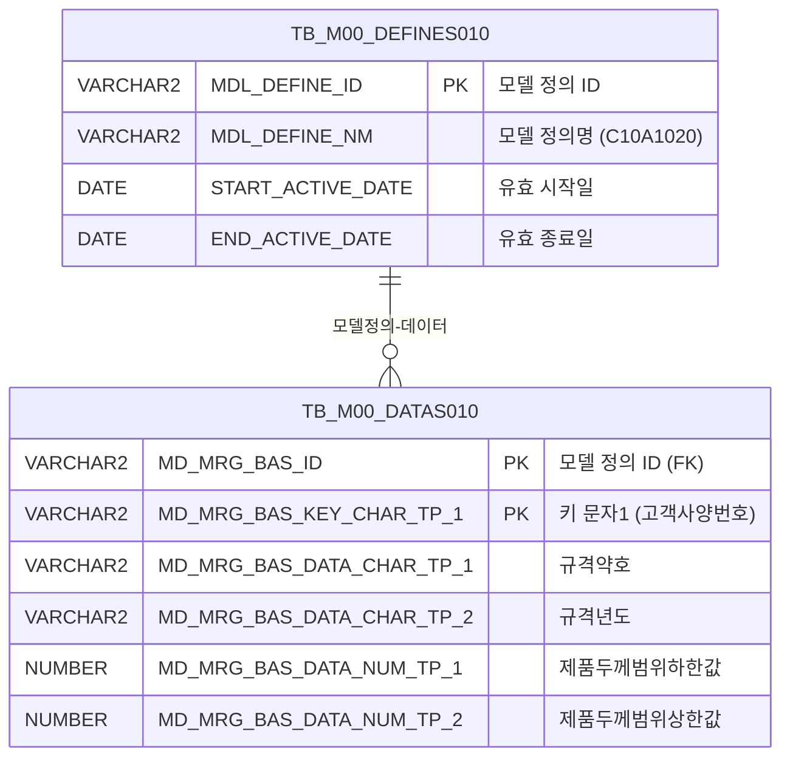

<h1 style="font-size: 40px; text-align: center; font-weight:
   bold; margin: 30px 0;">
  C107000020tab02 레거시 시스템 분석 종합 보고서
</h1>


# 1. 시스템 개요
- **서비스 ID**: C107000020tab02
- **업무명**: 고객사양공통조회
- **분석 일시**: 2026-03-17 09:03 (KST)
- **전체 Activity 수**: 2개 (Built-in 2개, Custom 0개)
- **분석자**: Claude Opus 4.6 / Sonnet 4.6
- **분석 도구**: /analyze-service C107000020tab02
- **문서 버전**: 1.0

# 📊 비즈니스 프로세스 분석

## 시스템 목적

C107000020tab02는 C10(CCL 공정) 모듈의 **고객사양 공통 조회** 화면으로, 부모 화면 C107000020의 두 번째 탭(tab02)에 해당한다.

이 서비스는 M00(마스터) 스키마의 메타데이터 관리 테이블(TB_M00_DATAS010, TB_M00_DEFINES010)에서 `C10A1020` 모델 정의에 매핑된 고객사양 정보를 조회한다. 고객사양번호(CUS_BTH_PAP_NO)를 키로 규격약호, 규격년도, 주문용도, 고객사, 품명, 두께/폭/길이 범위, 도금량코드, 표면처리코드, CCL BOM번호, 고객사양명 등의 제품 규격 정보를 제공한다.

단순 SELECT 조회 전용 서비스로 데이터 변경(INSERT/UPDATE/DELETE) 기능은 없다. 부모 화면(C107000020)의 검색 폼(C107000020_Form_1) 파라미터를 공유하여 검색 코드(SEARCH_CD) 기반 LIKE 검색을 수행한다.

<!-- 워크플로우 다이어그램 생략: Custom Activity 0개, SELECT 쿼리만 사용, 단순 Router → 조회 체인 -->

## 주요 유즈케이스

### UC-01: 고객사양 검색 조회
- **Actor**: CCL 공정 오퍼레이터 / 생산관리 담당자
- **목적**: 고객사양번호 또는 키워드로 고객사양 정보를 검색하여 제품 규격 상세를 확인

- **전제조건**:
  - 사용자가 시스템에 로그인되어 있음
  - 부모 화면 C107000020에서 tab02가 활성화됨
  - M00APUSER.TB_M00_DEFINES010에 'C10A1020' 모델 정의가 존재함

- **주요 흐름**:
  1. 부모 화면의 검색 폼(C107000020_Form_1)에 검색 코드 입력
  2. 조회 버튼 클릭 → find 함수 실행
  3. uiCommon.parameters4로 C107000020_Form_1 → C107000020tab02_Grid_1 파라미터 전달
  4. C107000020tab02.select 쿼리 실행 (SEARCH_CD LIKE 검색)
  5. Grid에 고객사양 목록 표시 (20개 컬럼)

- **대체 흐름**:
  - 검색 결과 없음: 빈 Grid 표시, 메시지박스에 "조회된 데이터가 없습니다" 표시
  - 검색 코드 미입력: 전체 고객사양 목록 조회 (LIKE '%%' 패턴)

- **후행조건**:
  - Grid에 조회 결과가 표시됨
  - 사용자가 컨텍스트 메뉴로 엑셀 내보내기 등 추가 작업 가능

### UC-02: 탭 진입 시 자동 조회
- **Actor**: CCL 공정 오퍼레이터 / 생산관리 담당자
- **목적**: tab02 활성화 시 부모 화면의 검색 조건으로 자동 데이터 로드

- **전제조건**:
  - 부모 화면 C107000020이 로드되어 있음
  - tab02가 최초 활성화됨

- **주요 흐름**:
  1. tab02 최초 활성화 (XLE 이벤트 발생)
  2. onLoadGrid 함수 실행
  3. C107000020_Form_1 파라미터로 자동 조회 (find 이벤트)
  4. Grid 데이터 로드 완료 후 XLE 이벤트 리스너 자동 해제 (detachEvent)

- **대체 흐름**:
  - 부모 폼에 검색 조건 없음: 전체 데이터 조회

- **후행조건**:
  - Grid에 데이터가 표시됨
  - 이후 탭 전환 시에는 자동 조회 실행되지 않음 (이벤트 해제됨)

### UC-03: 그리드 컨텍스트 메뉴 활용
- **Actor**: CCL 공정 오퍼레이터 / 생산관리 담당자
- **목적**: 그리드 데이터를 엑셀로 내보내거나 필터링/편집 모드 전환

- **전제조건**:
  - Grid에 데이터가 조회되어 있음

- **주요 흐름**:
  1. Grid 우클릭 → 컨텍스트 메뉴 표시
  2. 메뉴 항목 선택:
     - 열 이동(move_grid): enableColumnMove 토글
     - 필터(filter_grid): enableHeaderMenu 활성화
     - 편집 가능(editable_grid): setEditable 토글
     - 엑셀 내보내기(excel_grid): toExcel 호출

- **대체 흐름**:
  - 편집 모드 해제: 다시 읽기 전용으로 전환

- **후행조건**:
  - 선택한 기능이 Grid에 적용됨

---
## 비즈니스 로직 상세

### 1. 메타데이터 기반 고객사양 조회 패턴

- **목적**: M00 마스터 스키마의 범용 메타데이터 테이블(DATAS010/DEFINES010)에서 특정 모델 정의(C10A1020)에 매핑된 고객사양 데이터를 추출
- **처리 케이스**:

  **[케이스 1: 모델 정의 기반 데이터 필터링]**
  ```
    조건: TB_M00_DEFINES010에서 MDL_DEFINE_NM='C10A1020' 이고 현재 날짜가 유효기간(START_ACTIVE_DATE ~ END_ACTIVE_DATE) 내
    처리:
      1. DEFINES010에서 유효한 MDL_DEFINE_ID 서브쿼리로 조회
      2. DATAS010의 MD_MRG_BAS_ID와 JOIN하여 해당 모델의 데이터만 필터
      3. 범용 컬럼(MD_MRG_BAS_KEY_CHAR_TP_1 등)을 비즈니스 컬럼(CUS_BTH_PAP_NO 등)으로 별칭 매핑
  ```

  **[케이스 2: 검색 코드 LIKE 검색]**
  ```
    조건: SEARCH_CD 바인드 변수 입력
    처리:
      1. MD_MRG_BAS_KEY_CHAR_TP_1(고객사양번호) LIKE '%' || :SEARCH_CD || '%' 패턴 매칭
      2. 고객사양번호 기준 오름차순 정렬
      3. SEARCH_CD가 빈 값이면 전체 데이터 반환
  ```

### 2. 범용 메타데이터 컬럼 매핑 규칙

- **목적**: TB_M00_DATAS010의 범용 컬럼명을 업무별 의미 있는 컬럼명으로 변환
- **매핑 테이블**:

  | 범용 컬럼 | 비즈니스 컬럼 | 데이터 유형 | 설명 |
  |-----------|-------------|------------|------|
  | MD_MRG_BAS_KEY_CHAR_TP_1 | CUS_BTH_PAP_NO | 문자 (KEY) | 고객사양번호 |
  | MD_MRG_BAS_DATA_CHAR_TP_1 | SPC_AVR | 문자 | 규격약호 |
  | MD_MRG_BAS_DATA_CHAR_TP_2 | SPC_YR | 문자 | 규격년도 |
  | MD_MRG_BAS_DATA_CHAR_TP_3 | ORD_USG_CD | 문자 | 주문용도코드 |
  | MD_MRG_BAS_DATA_CHAR_TP_4 | CUS_CD | 문자 | 고객사코드 |
  | MD_MRG_BAS_DATA_CHAR_TP_5 | PRD_NM_CD | 문자 | 품명코드 |
  | MD_MRG_BAS_DATA_NUM_TP_1 | PRD_THK_RNG_LLV | 숫자 | 제품두께범위하한값 |
  | MD_MRG_BAS_DATA_NUM_TP_2 | PRD_THK_RNG_ULV | 숫자 | 제품두께범위상한값 |
  | MD_MRG_BAS_DATA_NUM_TP_3 | PRD_WTH_RNG_LLV | 숫자 | 제품폭범위하한값 |
  | MD_MRG_BAS_DATA_NUM_TP_4 | PRD_WTH_RNG_ULV | 숫자 | 제품폭범위상한값 |
  | MD_MRG_BAS_DATA_NUM_TP_5 | PRD_LTH_RNG_LLV | 숫자 | 제품길이범위하한값 |
  | MD_MRG_BAS_DATA_NUM_TP_6 | PRD_LTH_RNG_ULV | 숫자 | 제품길이범위상한값 |
  | MD_MRG_BAS_DATA_NUM_TP_7 | CUS_REQ_ROL_THK | 숫자 | 고객요청압연두께 |
  | MD_MRG_BAS_DATA_CHAR_TP_6 | CUS_REQ_ROL_THK_UNT | 문자 | 고객요청압연두께단위 |
  | MD_MRG_BAS_DATA_CHAR_TP_7 | ORD_THK_TP | 문자 | 두께구분코드 |
  | MD_MRG_BAS_DATA_CHAR_TP_8 | PRD_THK_CAL_APL_CD | 문자 | 제품두께계산적용코드 |
  | MD_MRG_BAS_DATA_CHAR_TP_9 | GW_ASG_CD | 문자 | 도금량코드 |
  | MD_MRG_BAS_DATA_CHAR_TP_10 | ORD_SUR_HND_CD | 문자 | 표면처리코드 |
  | MD_MRG_BAS_DATA_CHAR_TP_11 | CCL_BOM_NO | 문자 | CCL BOM번호 |
  | MD_MRG_BAS_DATA_CHAR_TP_12 | CUS_BTH_NM | 문자 | 고객사양명 |

---

# 💾 데이터 요구사항

## 핵심 테이블

### 1. M00APUSER.TB_M00_DATAS010 - (범용 메타데이터 저장 테이블)
| 컬럼명 | 타입 | PK | 설명 |
|--------|------|----|------|
| MD_MRG_BAS_ID | VARCHAR2 | ✅ | 모델 정의 ID (FK → DEFINES010) |
| MD_MRG_BAS_KEY_CHAR_TP_1 | VARCHAR2 | ✅ | 키 문자 타입 1 (고객사양번호) |
| MD_MRG_BAS_DATA_CHAR_TP_1~12 | VARCHAR2 | | 데이터 문자 타입 1~12 (규격약호, 고객사 등) |
| MD_MRG_BAS_DATA_NUM_TP_1~7 | NUMBER | | 데이터 숫자 타입 1~7 (두께/폭/길이 범위 등) |

### 2. M00APUSER.TB_M00_DEFINES010 - (메타데이터 모델 정의 테이블)
| 컬럼명 | 타입 | PK | 설명 |
|--------|------|----|------|
| MDL_DEFINE_ID | VARCHAR2 | ✅ | 모델 정의 ID |
| MDL_DEFINE_NM | VARCHAR2 | | 모델 정의명 (C10A1020) |
| START_ACTIVE_DATE | DATE | | 유효 시작일 |
| END_ACTIVE_DATE | DATE | | 유효 종료일 |

## 데이터 플로우
### 1. 조회

```
[고객사양 조회]
화면 진입 (tab02 활성화) 또는 조회 버튼 클릭
→ C107000020tab02.select
  FROM M00APUSER.TB_M00_DATAS010 DATAS010
  INNER JOIN (
    SELECT MDL_DEFINE_ID FROM M00APUSER.TB_M00_DEFINES010
    WHERE MDL_DEFINE_NM='C10A1020'
      AND START_ACTIVE_DATE <= SYSDATE
      AND SYSDATE < END_ACTIVE_DATE
  ) DEFINES010 ON DEFINES010.MDL_DEFINE_ID = DATAS010.MD_MRG_BAS_ID
  WHERE DATAS010.MD_MRG_BAS_KEY_CHAR_TP_1 LIKE '%' || :SEARCH_CD || '%'
  ORDER BY CUS_BTH_PAP_NO
→ Grid에 고객사양 목록 표시 (20개 컬럼)
```

## SQL 일람표
| SQL 이름 | 쿼리 ID | 타입 | 출처 | 테이블 |
|---------|---------|-----|-------|-------|
| 고객사양 조회 | C107000020tab02.select | SELECT | Service | TB_M00_DATAS010, TB_M00_DEFINES010 |

## ER 다이어그램 (핵심 관계)



관계 설명:
- TB_M00_DEFINES010이 모델 정의 테이블로 MDL_DEFINE_ID를 통해 TB_M00_DATAS010과 1:N 관계
- TB_M00_DATAS010은 범용 데이터 저장소로, 하나의 모델 정의(C10A1020)에 여러 고객사양 레코드가 매핑됨
- DEFINES010의 유효기간(START_ACTIVE_DATE ~ END_ACTIVE_DATE) 조건으로 활성 모델만 필터링

---

# 🖥️ 사용자 인터페이스 요구사항

## 화면 레이아웃 상세

### Layout 구조 (absolute positioning)
```javascript
{
  // 절대 위치 기반 레이아웃 (initLayout 미사용)
  components: [
    {
      id: "C107000020tab02_Grid_1",
      itemType: "grid",
      position: { left: 0, top: 0, width: 976, height: 492 }
    },
    {
      id: "C107000020tab02_Form_1",
      itemType: "form",
      position: { left: 0, top: 450, width: 282, height: 30 }
      // 주의: Grid 하단에 겹치는 위치 (top:450 < Grid bottom:492)
    },
    {
      id: "C107000020tab02_messagebox",
      itemType: "messagebox",
      position: { left: 0, top: 493, width: 976, height: 18 }
    }
  ]
}
```

## 입출력 요소

### Form 컴포넌트
**C107000020tab02_Form_1**
- 자체 필드 없음 (빈 Form)
- 부모 화면의 C107000020_Form_1 검색 폼 파라미터를 공유하여 사용
- uiCommon.parameters4 호출 시 'C107000020_Form_1' ID로 파라미터 수집

### Grid 컴포넌트

**C107000020tab02_Grid_1 (고객사양 목록)**
- 편집 가능 여부: 아니오 (읽기 전용, 컨텍스트 메뉴로 토글 가능)
- Split: 0 (고정 컬럼 없음)
- Smart Rendering: 활성화
- 페이징: 활성화 (rowCnt: 19)
- 수직 Grid: vertical=true
- 컬럼 너비 단위: % (colwidthUnit: %)
- 소스 테이블: VI_M00_C10A1020
- 주요 컬럼 (20개):

  **기본 식별 정보**:
  - CUS_BTH_PAP_NO: ro - 고객사양번호 (10%, 중앙정렬)
  - SPC_AVR: ro - 규격약호 (10%, 좌측정렬)
  - SPC_YR: ro - 규격년도 (6%, 중앙정렬)
  - ORD_USG_CD: ro - 주문용도 (6%, 중앙정렬)
  - CUS_CD: ro - 고객사 (6%, 중앙정렬)
  - PRD_NM_CD: ro - 품명 (4%, 중앙정렬)

  **제품 두께 범위**:
  - PRD_THK_RNG_LLV: ro - 제품두께범위하한값 (14%, 우측정렬)
  - PRD_THK_RNG_ULV: ro - 제품두께범위상한값 (14%, 우측정렬)

  **제품 폭 범위**:
  - PRD_WTH_RNG_LLV: ro - 제품폭범위하한값 (12%, 우측정렬)
  - PRD_WTH_RNG_ULV: ro - 제품폭범위상한값 (12%, 우측정렬)

  **제품 길이 범위**:
  - PRD_LTH_RNG_LLV: ro - 제품길이범위하한값 (14%, 우측정렬)
  - PRD_LTH_RNG_ULV: ro - 제품길이범위상한값 (14%, 우측정렬)

  **압연 두께 정보**:
  - CUS_REQ_ROL_THK: ro - 고객요청압연두께 (12%, 우측정렬)
  - CUS_REQ_ROL_THK_UNT: ro - 고객요청압연두께단위 (14%, 우측정렬)
  - ORD_THK_TP: ro - 두께구분코드 (10%, 우측정렬)
  - PRD_THK_CAL_APL_CD: ro - 제품두께계산적용코드 (14%, 중앙정렬)

  **도금/표면 처리**:
  - GW_ASG_CD: ro - 도금량코드 (10%, 중앙정렬)
  - ORD_SUR_HND_CD: ro - 표면처리코드 (10%, 중앙정렬)

  **CCL/사양 정보**:
  - CCL_BOM_NO: ro - CCL BOM번호 (10%, 중앙정렬)
  - CUS_BTH_NM: ro - 고객사양명 (10%, 좌측정렬)

## 화면 동작 흐름

### 1. 화면 초기 로딩 (tab02 진입)
```
1. 부모 화면 C107000020에서 tab02 활성화
2. ui.initializeDHTMLX() 호출 → pageConfiguration 기반 컴포넌트 초기화
3. Grid XLE 이벤트(onXLEEvent) 리스너 등록 → onLoadGrid 콜백 바인딩
4. Grid 렌더링 완료 시 onLoadGrid 자동 실행
5. uiCommon.parameters4('C107000020_Form_1', 'C107000020tab02_Grid_1', 'find')
6. C107000020tab02-service → 분기 → 조회 → C107000020tab02.select 실행
7. Grid에 고객사양 데이터 표시
8. onXLE 이벤트 리스너 자동 해제 (detachEvent) → 이후 탭 전환 시 자동 조회 미실행
```

### 2. 검색 조회
```
1. 부모 화면의 C107000020_Form_1에서 검색 조건(SEARCH_CD) 입력
2. 조회 버튼 클릭 → find(eventName, formDivObj, referenceItem) 호출
3. uiCommon.parameters4('C107000020_Form_1', 'C107000020tab02_Grid_1', customparam + eventName)
4. items['C107000020tab02_Grid_1'].loadData(findUrl) → 서비스 호출
5. C107000020tab02.select 쿼리: SEARCH_CD LIKE 패턴으로 고객사양번호 검색
6. Grid 데이터 갱신 + 메시지박스에 응답 메시지 표시 (findMessage)
```

### 3. 컨텍스트 메뉴 활용
```
1. Grid 우클릭 → contextmenu.xml 기반 컨텍스트 메뉴 표시
2. 메뉴 항목 선택 → onGridContextMenuClick(id, gridObj, menuObj) 호출
3. 체크박스 상태(getCheckboxState) 확인 후 토글:
   - move_grid: 컬럼 이동 활성화/비활성화
   - filter_grid: 헤더 메뉴(필터) 활성화
   - editable_grid: 편집 모드 활성화/비활성화
   - excel_grid: toExcel 호출 → 서버사이드 엑셀 변환(/gridexcel)
```

## JavaScript 모듈

**C107000020tab02.jsp (인라인 스크립트)**
- find(eventName, formDivObj, referenceItem): 검색 조회 (uiCommon.parameters4로 파라미터 구성 → Grid loadData)
- add(referenceItem): Grid 새 행 추가 (items[referenceItem].addRow)
- remove(referenceItem): Grid 행 삭제 (items[referenceItem].removeRow)
- copy(referenceItem): Grid 행 클립보드 복사 (items[referenceItem].copyRowContent)
- undo(referenceItem): 실행 취소 (items[referenceItem].undo)
- redo(referenceItem): 다시 실행 (items[referenceItem].redo)
- onGridContextMenuClick(id, gridObj, menuObj): 컨텍스트 메뉴 클릭 처리 (열 이동, 필터, 편집모드, 엑셀)
- findMessage(referenceItem): 메시지박스 표시 (uiCommon.message)
- onLoadGrid(): 탭 진입 시 자동 조회 + XLE 이벤트 해제

**외부 스크립트**:
- dhtmlx/codebase/glue.ui.bootstrap.js (GLUE UI 프레임워크)
- js/c10.ui.js (C10 모듈 공통 UI)

## 주요 이벤트 핸들러

**find (조회 버튼 클릭)**
- 이벤트 타입: Form Find Button Click
- 처리 내용:
  1. customparam 빈 문자열 초기화
  2. uiCommon.parameters4('C107000020_Form_1', 'C107000020tab02_Grid_1', customparam + eventName) 호출
  3. items['C107000020tab02_Grid_1'].loadData(findUrl) 실행
  4. 서버 응답 후 Grid 자동 갱신

**onLoadGrid (Grid 초기 로딩)**
- 이벤트 타입: Grid XLE Event (onXLEEvent)
- 처리 내용:
  1. customparam 빈 문자열, eventName을 'find'로 고정
  2. uiCommon.parameters4로 부모 폼 파라미터 수집
  3. Grid loadData 실행
  4. getDhxGrid().detachEvent(onXLE)로 이벤트 리스너 자기 해제 (1회성 실행)

**onGridContextMenuClick (컨텍스트 메뉴)**
- 이벤트 타입: Grid Context Menu Click
- 처리 내용:
  1. menuObj.getCheckboxState(id)로 체크 상태 확인
  2. id별 분기: move_grid/filter_grid/editable_grid/excel_grid
  3. 각 기능 토글 또는 실행

---

# 📌 특이사항 및 주의사항

## 1. 범용 메타데이터 테이블 사용
- **EAV(Entity-Attribute-Value) 패턴**: TB_M00_DATAS010은 범용 컬럼(MD_MRG_BAS_DATA_CHAR_TP_1~12, MD_MRG_BAS_DATA_NUM_TP_1~7)을 사용하는 EAV 패턴 테이블. 모델 정의(DEFINES010)에 의해 각 범용 컬럼의 비즈니스 의미가 결정됨
- **컬럼 매핑의 암묵적 규칙**: SQL에서 별칭(alias)으로 비즈니스 컬럼명을 부여하지만, 이 매핑이 코드 레벨에서만 존재하고 별도 매핑 테이블이 없어 유지보수 시 주의 필요
- **뷰 참조**: Grid의 sourceTable이 `VI_M00_C10A1020`으로 설정되어 있으나, 실제 쿼리는 DATAS010/DEFINES010 원본 테이블을 직접 조회

## 2. 부모-자식 화면 간 검색 폼 공유
- **크로스-탭 파라미터 전달**: C107000020tab02는 자체 검색 폼이 빈 상태이며, 부모 화면(C107000020)의 C107000020_Form_1을 uiCommon.parameters4 함수로 참조하여 검색 조건을 가져옴
- **Form ID 불일치**: JSP의 div ID는 'C107000020tab02_Form_1'이지만 parameters4 호출 시 'C107000020_Form_1'을 사용 → 부모 화면의 폼을 참조하는 의도적 설계
- **탭 간 검색 조건 동기화**: 부모 폼의 SEARCH_CD가 변경되면 tab02도 재조회 시 새 조건 반영

## 3. XLE 이벤트 자기 해제 패턴
- **1회성 자동 조회**: onLoadGrid에서 Grid의 XLE 이벤트로 자동 조회 후 `detachEvent(onXLE)`로 이벤트 리스너를 즉시 해제하는 패턴 사용
- **의미**: 최초 탭 진입 시에만 자동 조회를 실행하고, 이후 탭 전환 시에는 자동 조회를 방지하여 불필요한 서버 호출 절감
- **전역 변수 의존**: `onXLE` 변수가 스크립트 하단에서 전역으로 선언되어 onLoadGrid에서 참조

## 4. DEFINES010 유효기간 필터링
- **시간 기반 필터**: `START_ACTIVE_DATE <= SYSDATE AND SYSDATE < END_ACTIVE_DATE` 조건으로 현재 유효한 모델 정의만 사용
- **주의**: 유효기간이 만료되면 조회 결과가 0건이 됨. 모델 정의의 유효기간 관리가 데이터 조회 가용성에 직접 영향

## 5. Form 위치 겹침
- **레이아웃 이상**: C107000020tab02_Form_1의 top이 450px로 Grid(height: 492px) 영역과 겹침. Form이 빈 상태라 시각적 문제는 없으나, 레이아웃 의도가 불명확한 코드

---

# 📚 참고 문서

- **Query SQL**: `src/query/C107000020tab02-query.glue_sql`
- **Service XML**: `src/service/C107000020tab02-service.xml`
- **JSP**: `WebContents/C107000020tab02.jsp`
- **Grid XML**: `WebContents/header/kr/C107000020tab02/C107000020tab02_Grid_1.xml`
- **Form XML**: `WebContents/header/kr/C107000020tab02/C107000020tab02_Form_1.xml`
- **Messagebox XML**: `WebContents/header/kr/C107000020tab02/C107000020tab02_messagebox.xml`
