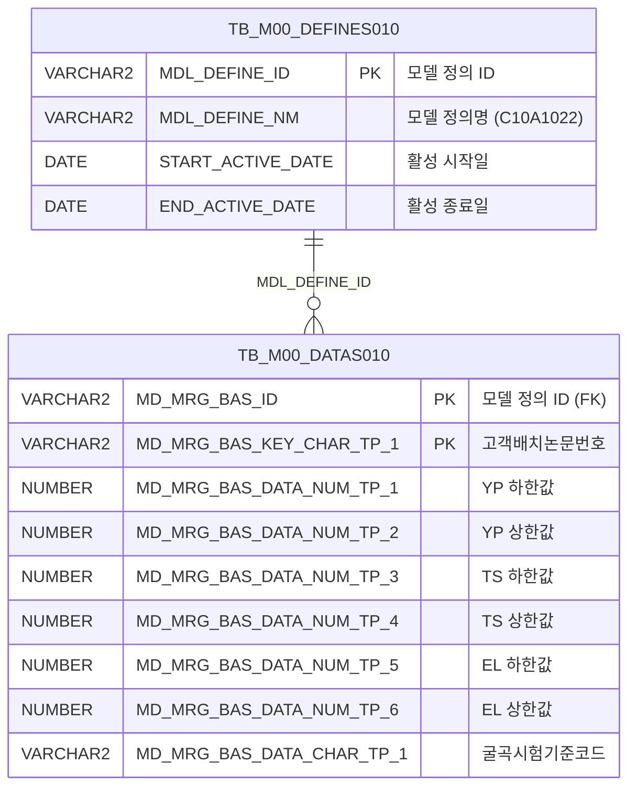

<h1 style="font-size: 40px; text-align: center; font-weight:
   bold; margin: 30px 0;">
  C107000020tab03 레거시 시스템 분석 종합 보고서
</h1>


# 1. 시스템 개요
- **서비스 ID**: C107000020tab03
- **업무명**: 고객재질사양조회
- **분석 일시**: 2026-03-17 09:10 (KST)
- **분석 시간**: 약 3분
- **전체 Activity 수**: 2개 (Built-in)
- **분석자**: Claude Opus 4.6 + Sonnet (Phase 4)
- **분석 도구**: /analyze-service C107000020tab03
- **문서 버전**: 1.0

# 📊 비즈니스 프로세스 분석

## 시스템 목적

C107000020tab03은 C107000020(고객사양조회) 화면의 세 번째 탭으로, **고객 재질 사양 정보를 조회**하는 읽기 전용 화면이다. 고객 배치 논문번호(CUS_BTH_PAP_NO)를 기준으로 항복점(YP), 인장강도(TS), 신연율(EL), 경도(HRB), 에릭슨(ERI) 등 기계적 성질의 상/하한값과 굴곡, 시편 채취 관련 정보를 조회한다.

이 탭은 자체 검색 폼을 보유하지 않으며, 부모 화면(C107000020)의 Form_1에서 검색 조건(SEARCH_CD)을 전달받아 데이터를 조회한다. M00APUSER 스키마의 범용 데이터 모델(TB_M00_DATAS010/DEFINES010)을 활용하여 모델 정의 ID 'C10A1022'에 해당하는 고객 재질 사양 데이터를 추출한다.

## 주요 유즈케이스

### UC-01: 고객 재질 사양 조회
- **Actor**: 품질관리 담당자 / 영업 담당자
- **목적**: 고객별 배치 논문번호에 대한 기계적 성질 기준값(YP, TS, EL, HRB, ERI 등)을 확인하여 품질 기준 충족 여부를 판단

- **전제조건**:
  - 사용자가 시스템에 로그인되어 있음
  - 부모 화면(C107000020)의 검색 조건이 입력되어 있음
  - M00APUSER 스키마의 모델 정의(C10A1022)가 활성 상태임

- **주요 흐름**:
  1. 부모 화면(C107000020)에서 검색 코드(SEARCH_CD) 입력
  2. 탭 선택 시 또는 부모 폼 조회 시 onLoadGrid 이벤트 자동 발생
  3. uiCommon.parameters4()로 C107000020_Form_1의 파라미터를 수집
  4. C107000020tab03-service 호출 → C107000020tab03.select 쿼리 실행
  5. TB_M00_DATAS010에서 모델 정의 'C10A1022' 기반 데이터 조회
  6. Grid_1에 고객사양번호, YP/TS/EL/HRB/ERI 상하한값, 굴곡, 시편 정보 표시

- **대체 흐름**:
  - 검색 결과 없음: Grid에 빈 목록 표시, 상태바에 메시지 출력
  - 검색 코드 미입력: LIKE '%%' 조건으로 전체 사양 조회

- **후행조건**:
  - 조회된 재질 사양 데이터가 Grid에 표시됨
  - 사용자가 데이터를 확인할 수 있는 상태 (읽기 전용)

### UC-02: 탭 초기 로딩 자동 조회
- **Actor**: 시스템 (자동)
- **목적**: 탭 활성화 시 Grid XML 로드 완료 후 자동으로 데이터를 조회하여 사용자 대기 시간 최소화

- **전제조건**:
  - 부모 화면이 로드되어 있음
  - Grid XML 로드가 완료됨

- **주요 흐름**:
  1. 사용자가 tab03 탭 클릭
  2. ui.initializeDHTMLX()로 DHTMLX 컴포넌트 초기화
  3. onXLEEvent(onLoadGrid) 이벤트 바인딩
  4. Grid XML 로드 완료 시 onLoadGrid 자동 호출
  5. 부모 폼(C107000020_Form_1) 파라미터로 자동 조회 실행
  6. 조회 완료 후 onXLE 이벤트 디태치 (중복 조회 방지)

- **대체 흐름**:
  - 부모 폼 미로드: 빈 파라미터로 조회되어 전체 데이터 표시

- **후행조건**:
  - Grid에 데이터가 자동 표시됨
  - onXLE 이벤트가 해제되어 이후 수동 조회만 가능

### UC-03: 컨텍스트 메뉴 활용
- **Actor**: 사용자
- **목적**: Grid 우클릭 컨텍스트 메뉴를 통해 컬럼 이동, 필터, 편집 모드 전환, 엑셀 내보내기 기능 활용

- **전제조건**:
  - Grid에 데이터가 조회되어 있음

- **주요 흐름**:
  1. Grid 영역에서 마우스 우클릭
  2. 컨텍스트 메뉴 표시 (move_grid, filter_grid, editable_grid, excel_grid)
  3. 원하는 메뉴 항목 선택
  4. 선택에 따라 컬럼 이동 활성화 / 헤더 필터 활성화 / 편집 모드 전환 / 엑셀 내보내기 수행

- **대체 흐름**:
  - 엑셀 내보내기 실패: 서버 gridexcel 경로 접근 불가 시 오류

- **후행조건**:
  - 선택한 기능이 Grid에 적용됨

---
## 비즈니스 로직 상세

### 1. 범용 데이터 모델 기반 고객 재질 사양 매핑

- **목적**: M00APUSER 범용 데이터 모델(TB_M00_DATAS010)의 제네릭 컬럼을 고객 재질 사양의 비즈니스 컬럼으로 매핑하여 조회
- **처리 케이스**:

  **[케이스 1: 모델 정의 기반 데이터 필터링]**
  ```
    조건: TB_M00_DEFINES010에서 MDL_DEFINE_NM='C10A1022'이고 현재 활성 기간(START_ACTIVE_DATE <= SYSDATE < END_ACTIVE_DATE)
    처리:
      1. 활성 모델 정의 ID(MDL_DEFINE_ID) 조회
      2. TB_M00_DATAS010에서 해당 정의 ID와 매칭되는 데이터 행 추출
      3. SEARCH_CD 파라미터로 고객사양번호(MD_MRG_BAS_KEY_CHAR_TP_1) LIKE 검색
  ```

  **[케이스 2: 제네릭 컬럼 → 비즈니스 컬럼 매핑]**
  ```
    조건: 쿼리 SELECT 절에서 컬럼 별칭 지정
    매핑 규칙:
      MD_MRG_BAS_KEY_CHAR_TP_1  → CUS_BTH_PAP_NO   (고객배치논문번호, 키 컬럼)
      MD_MRG_BAS_DATA_NUM_TP_1  → YP_LLV_MPA        (항복점 하한값, MPa)
      MD_MRG_BAS_DATA_NUM_TP_2  → YP_ULV_MPA        (항복점 상한값, MPa)
      MD_MRG_BAS_DATA_NUM_TP_3  → TS_LLV_MPA        (인장강도 하한값, MPa)
      MD_MRG_BAS_DATA_NUM_TP_4  → TS_ULV_MPA        (인장강도 상한값, MPa)
      MD_MRG_BAS_DATA_NUM_TP_5  → ELGN_LLV          (신연율 하한값)
      MD_MRG_BAS_DATA_NUM_TP_6  → ELGN_ULV          (신연율 상한값)
      MD_MRG_BAS_DATA_NUM_TP_7  → HRB_LLV           (경도 하한값)
      MD_MRG_BAS_DATA_NUM_TP_8  → HRB_ULV           (경도 상한값)
      MD_MRG_BAS_DATA_NUM_TP_9  → ER_LLV            (에릭슨 하한값)
      MD_MRG_BAS_DATA_NUM_TP_10 → ER_ULV            (에릭슨 상한값)
      MD_MRG_BAS_DATA_CHAR_TP_1 → MQL_BND_TST_STD_CD (굴곡시험기준코드)
      MD_MRG_BAS_DATA_CHAR_TP_2 → TST_PIC_GTH_INST_LOC (시편채취위치)
      MD_MRG_BAS_DATA_NUM_TP_11 → TST_PIC_GTH_INST_LTH (시편채취길이)
      MD_MRG_BAS_DATA_CHAR_TP_3 → TPG_RGS_NO        (시편가공코드)
  ```

---

# 💾 데이터 요구사항

## 핵심 테이블

### 1. TB_M00_DATAS010 (M00APUSER) - 범용 데이터 모델 데이터 테이블
| 컬럼명 | 타입 | PK | 설명 |
|--------|------|----|------|
| MD_MRG_BAS_ID | VARCHAR2 | ✅ | 모델 정의 ID (FK → TB_M00_DEFINES010) |
| MD_MRG_BAS_KEY_CHAR_TP_1 | VARCHAR2 | ✅ | 키 문자 컬럼 1 (→ 고객배치논문번호) |
| MD_MRG_BAS_DATA_NUM_TP_1 | NUMBER | | 수치 데이터 1 (→ YP 하한값) |
| MD_MRG_BAS_DATA_NUM_TP_2 | NUMBER | | 수치 데이터 2 (→ YP 상한값) |
| MD_MRG_BAS_DATA_NUM_TP_3 | NUMBER | | 수치 데이터 3 (→ TS 하한값) |
| MD_MRG_BAS_DATA_NUM_TP_4 | NUMBER | | 수치 데이터 4 (→ TS 상한값) |
| MD_MRG_BAS_DATA_NUM_TP_5 | NUMBER | | 수치 데이터 5 (→ EL 하한값) |
| MD_MRG_BAS_DATA_NUM_TP_6 | NUMBER | | 수치 데이터 6 (→ EL 상한값) |
| MD_MRG_BAS_DATA_NUM_TP_7 | NUMBER | | 수치 데이터 7 (→ HRB 하한값) |
| MD_MRG_BAS_DATA_NUM_TP_8 | NUMBER | | 수치 데이터 8 (→ HRB 상한값) |
| MD_MRG_BAS_DATA_NUM_TP_9 | NUMBER | | 수치 데이터 9 (→ ERI 하한값) |
| MD_MRG_BAS_DATA_NUM_TP_10 | NUMBER | | 수치 데이터 10 (→ ERI 상한값) |
| MD_MRG_BAS_DATA_NUM_TP_11 | NUMBER | | 수치 데이터 11 (→ 시편채취길이) |
| MD_MRG_BAS_DATA_CHAR_TP_1 | VARCHAR2 | | 문자 데이터 1 (→ 굴곡시험기준코드) |
| MD_MRG_BAS_DATA_CHAR_TP_2 | VARCHAR2 | | 문자 데이터 2 (→ 시편채취위치) |
| MD_MRG_BAS_DATA_CHAR_TP_3 | VARCHAR2 | | 문자 데이터 3 (→ 시편가공코드) |

### 2. TB_M00_DEFINES010 (M00APUSER) - 범용 데이터 모델 정의 테이블
| 컬럼명 | 타입 | PK | 설명 |
|--------|------|----|------|
| MDL_DEFINE_ID | VARCHAR2 | ✅ | 모델 정의 ID |
| MDL_DEFINE_NM | VARCHAR2 | | 모델 정의명 (예: 'C10A1022') |
| START_ACTIVE_DATE | DATE | | 활성 시작일 |
| END_ACTIVE_DATE | DATE | | 활성 종료일 |

## 데이터 플로우

### 1. 조회

```
[고객 재질 사양 조회]
탭 활성화 또는 조회 버튼 클릭
→ C107000020tab03.select
  FROM M00APUSER.TB_M00_DATAS010 DATAS010
  INNER JOIN (서브쿼리) DEFINES010
    - TB_M00_DEFINES010에서 MDL_DEFINE_NM='C10A1022' AND 활성 기간 내 정의 ID 조회
  WHERE DEFINES010.MDL_DEFINE_ID = DATAS010.MD_MRG_BAS_ID
    AND DATAS010.MD_MRG_BAS_KEY_CHAR_TP_1 LIKE '%' || :SEARCH_CD || '%'
  ORDER BY CUS_BTH_PAP_NO
→ Grid_1에 고객사양번호, YP/TS/EL/HRB/ERI 상하한값, 굴곡, 시편 정보 표시
```

## SQL 일람표
| SQL 이름 | 쿼리 ID | 타입 | 출처 | 테이블 |
|---------|---------|-----|-------|-------|
| 고객 재질 사양 조회 | C107000020tab03.select | SELECT | Service | TB_M00_DATAS010, TB_M00_DEFINES010 |

## ER 다이어그램 (핵심 관계)



관계 설명:
- **TB_M00_DEFINES010**이 중심 테이블로 모델 정의를 관리하며, MDL_DEFINE_ID를 통해 TB_M00_DATAS010과 1:N 관계
- TB_M00_DATAS010은 범용 데이터 모델로, 모델 정의별로 다양한 비즈니스 데이터를 제네릭 컬럼으로 저장
- 현재 서비스에서는 모델 정의명 'C10A1022'에 해당하는 고객 재질 사양 데이터만 필터링하여 사용

---

# 🖥️ 사용자 인터페이스 요구사항

## 화면 레이아웃 상세

### Layout 구조 (Absolute 배치)
```javascript
{
  layoutType: "absolute",
  totalWidth: "976px",
  totalHeight: "511px",
  components: [
    {
      id: "C107000020tab03_Grid_1",
      type: "grid",
      position: { left: 0, top: 0, width: 976, height: 492 }
    },
    {
      id: "C107000020tab03_messagebox",
      type: "messagebox",
      position: { left: 0, top: 493, width: 976, height: 18 }
    },
    {
      id: "C107000020tab03_Form_1",
      type: "form",
      position: { left: 0, top: 450, width: 282, height: 30 },
      note: "빈 폼 - 부모 탭 C107000020_Form_1 참조"
    }
  ]
}
```

## 입출력 요소

### Form 컴포넌트
**C107000020tab03_Form_1**
- 빈 폼 (`<items/>` 구조) - 검색 파라미터는 부모 탭의 **C107000020_Form_1**을 직접 참조
- URL: basicGridData.do

### Grid 컴포넌트

**C107000020tab03_Grid_1 (고객 재질 사양 목록)**
- 편집 가능 여부: 아니오 (읽기 전용, 모든 컬럼 `ro` 타입)
- Split: 0 (고정 컬럼 없음)
- 행 수: 19행 표시, 스마트 렌더링 적용
- 멀티셀렉트: true
- 컨텍스트 메뉴: true
- 페이징: true
- 소스 테이블: VI_M00_C10A1022
- 주요 컬럼 (15개):

  **기본 식별 정보**:
  - CUS_BTH_PAP_NO: ro - 고객사양번호 (10%, 중앙정렬)

  **항복점(YP) 기준값**:
  - YP_LLV_MPA: ro - YP하한값 (8%, 우측정렬)
  - YP_ULV_MPA: ro - YP상한값 (8%, 우측정렬)

  **인장강도(TS) 기준값**:
  - TS_LLV_MPA: ro - TS하한값 (8%, 우측정렬)
  - TS_ULV_MPA: ro - TS상한값 (8%, 우측정렬)

  **신연율(EL) 기준값**:
  - ELGN_LLV: ro - EL하한값 (8%, 우측정렬)
  - ELGN_ULV: ro - EL상한값 (8%, 우측정렬)

  **경도(HRB) 기준값**:
  - HRB_LLV: ro - HRB하한값 (8%, 우측정렬)
  - HRB_ULV: ro - HRB상한값 (8%, 우측정렬)

  **에릭슨(ERI) 기준값**:
  - ER_LLV: ro - ERI하한값 (8%, 우측정렬)
  - ER_ULV: ro - ERI상한값 (8%, 우측정렬)

  **시편/시험 정보**:
  - MQL_BND_TST_STD_CD: ro - 굴곡 (4%, 중앙정렬)
  - TST_PIC_GTH_INST_LOC: ro - 시편채취위치 (10%, 중앙정렬)
  - TST_PIC_GTH_INST_LTH: ro - 시편채취길이 (10%, 중앙정렬)
  - TPG_RGS_N: ro - 시편가공코드 (10%, 중앙정렬)

## 화면 동작 흐름

### 1. 탭 초기 로딩 (자동 조회)
```
1. 사용자가 C107000020 화면에서 tab03 탭 클릭
2. ui.initializeDHTMLX() 호출하여 Grid/Form/Messagebox 초기화
3. Grid XML 로드 (C107000020tab03_Grid_1.xml)
4. onXLEEvent(onLoadGrid) 이벤트 발생
5. onLoadGrid 함수 실행:
   - uiCommon.parameters4('C107000020_Form_1', 'C107000020tab03_Grid_1', 'find') 호출
   - 부모 폼의 검색 파라미터 수집
   - items['C107000020tab03_Grid_1'].loadData(findUrl) 실행
6. C107000020tab03-service → C107000020tab03.select 쿼리 실행
7. Grid에 고객 재질 사양 데이터 표시
8. onXLE 이벤트 디태치 (items["C107000020tab03_Grid_1"].getDhxGrid().detachEvent(onXLE))
```

### 2. 수동 조회 (부모 폼 연동)
```
1. 부모 화면(C107000020)에서 검색 조건 변경
2. 조회 버튼 클릭 → find() 함수 호출
3. uiCommon.parameters4('C107000020_Form_1', 'C107000020tab03_Grid_1', customparam + eventName) 호출
4. items['C107000020tab03_Grid_1'].loadData(findUrl) 실행
5. 서비스 호출 → 쿼리 실행
6. Grid 데이터 갱신
7. findMessage() → 상태바에 응답 메시지 표시
```

### 3. 컨텍스트 메뉴 활용
```
1. Grid 영역 우클릭
2. 컨텍스트 메뉴 표시 (contextmenu.xml 기반)
3. 메뉴 항목별 처리:
   - move_grid: gridObj.enableColumnMove(true/false) - 컬럼 드래그 이동 토글
   - filter_grid: gridObj.enableHeaderMenu() - 헤더 필터 활성화
   - editable_grid: gridObj.setEditable(true/false) - 편집 모드 토글
   - excel_grid: gridObj.toExcel('/gridexcel', 'color') - 엑셀 내보내기
```

## JavaScript 모듈

**C107000020tab03.jsp** (인라인 스크립트)
- find(eventName, formDivObj, referenceItem): 조회 실행 (uiCommon.parameters4로 부모 폼 C107000020_Form_1 파라미터 구성 → Grid 데이터 로드)
- add(referenceItem): 그리드 행 추가 (items[referenceItem].addRow())
- remove(referenceItem): 그리드 행 삭제 (items[referenceItem].removeRow())
- copy(referenceItem): 그리드 행 클립보드 복사 (items[referenceItem].copyRowContent())
- undo(referenceItem): 실행 취소 (items[referenceItem].undo())
- redo(referenceItem): 다시 실행 (items[referenceItem].redo())
- onGridContextMenuClick(id, gridObj, menuObj): 컨텍스트 메뉴 핸들러 (move_grid/filter_grid/editable_grid/excel_grid)
- findMessage(referenceItem): 서비스 응답 메시지 상태바 표시 (uiCommon.message())
- onLoadGrid(): Grid XML 로드 완료 후 자동 조회 실행 및 이벤트 디태치

**외부 참조**: c10.ui.js (공통 UI 유틸리티)

## 주요 이벤트 핸들러

**onLoadGrid (Grid XML 로드 완료)**
- 이벤트 타입: onXLEEvent
- 처리 내용:
  1. uiCommon.parameters4로 부모 폼(C107000020_Form_1) 파라미터 수집
  2. Grid_1에 데이터 로드 (handleDataProcess.do)
  3. onXLE 이벤트 디태치하여 중복 자동 조회 방지

**find (조회 버튼 클릭)**
- 이벤트 타입: Form find button
- 처리 내용:
  1. uiCommon.parameters4('C107000020_Form_1', 'C107000020tab03_Grid_1', customparam + eventName) 호출
  2. Grid_1에 데이터 로드
  3. findMessage()로 상태바 메시지 표시

**onGridContextMenuClick (Grid 우클릭 메뉴)**
- 이벤트 타입: Grid Context Menu
- 처리 내용:
  1. 메뉴 체크 상태 확인 (menuObj.getCheckboxState)
  2. 메뉴 ID별 기능 토글 (move_grid, filter_grid, editable_grid, excel_grid)

---

# 📌 특이사항 및 주의사항

## 1. 범용 데이터 모델(EAV 패턴) 사용
- **제네릭 컬럼 매핑**: TB_M00_DATAS010 테이블은 EAV(Entity-Attribute-Value) 유사 패턴의 범용 데이터 모델로, `MD_MRG_BAS_DATA_NUM_TP_1~11`, `MD_MRG_BAS_DATA_CHAR_TP_1~3` 등 제네릭 컬럼을 비즈니스 의미 컬럼으로 매핑하여 사용한다. 모델 정의 변경 시 컬럼 매핑이 달라질 수 있으므로 주의가 필요하다.
- **모델 활성 기간 필터**: TB_M00_DEFINES010에서 START_ACTIVE_DATE/END_ACTIVE_DATE로 활성 모델 정의만 조회하므로, 기간 만료 시 데이터가 조회되지 않을 수 있다.

## 2. 크로스탭 폼 참조 구조
- **부모 폼 의존성**: 이 탭(tab03)은 자체 검색 폼이 빈 구조(`<items/>`)이며, 부모 화면(C107000020)의 Form_1을 직접 참조(`uiCommon.parameters4('C107000020_Form_1', ...)`)한다. 부모 폼 구조 변경 시 이 탭의 조회 기능에 영향을 줄 수 있다.
- **화면 독립 실행 불가**: 단독 화면으로 사용할 수 없으며, 반드시 C107000020 부모 화면 내 탭으로만 동작한다.

## 3. Grid XML 로드 이벤트 1회 실행 패턴
- **이벤트 디태치**: onLoadGrid 함수에서 자동 조회 후 `detachEvent(onXLE)`를 호출하여 Grid XML 로드 이벤트를 해제한다. 이는 탭 재활성화 시 자동 조회가 반복 실행되는 것을 방지하는 패턴이다.
- **초기 조회만 자동**: 이후 조회는 부모 폼의 조회 버튼을 통해 수동으로만 가능하다.

## 4. 컬럼 너비 비율(%) 지정
- **colwidth: "%"**: Grid 컬럼 너비가 픽셀이 아닌 비율(%)로 지정되어 있다. 총 15개 컬럼의 비율 합계가 116%로 100%를 초과하므로, 실제 렌더링 시 수평 스크롤바가 표시될 수 있다.

## 5. 읽기 전용 화면에서의 편집 기능 존재
- **add/remove/copy/undo/redo 함수**: 모든 컬럼이 읽기 전용(ro)임에도 행 추가/삭제/복사/실행취소/다시실행 함수가 정의되어 있다. 이는 JSP 템플릿에서 자동 생성된 코드로, 실제 사용되지 않는 데드 코드일 가능성이 높다.
- **editable_grid 컨텍스트 메뉴**: 우클릭 메뉴에서 편집 모드 전환이 가능하나, 데이터 저장 기능이 없어 임시 편집만 가능하다.

---

# 📚 참고 문서

- **Query SQL**: `src/query/C107000020tab03-query.glue_sql`
- **Service XML**: `src/service/C107000020tab03-service.xml`
- **JSP**: `WebContents/C107000020tab03.jsp`
- **JS**: `WebContents/js/c10.ui.js` (공통 UI 유틸리티)
- **Grid XML**: `WebContents/header/kr/C107000020tab03/C107000020tab03_Grid_1.xml`
- **Form XML**: `WebContents/header/kr/C107000020tab03/C107000020tab03_Form_1.xml`
