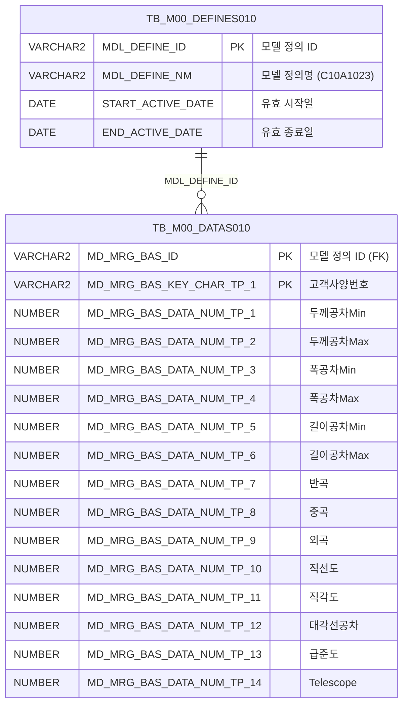

<h1 style="font-size: 40px; text-align: center; font-weight:
   bold; margin: 30px 0;">
  C107000020tab04 레거시 시스템 분석 종합 보고서
</h1>


# 1. 시스템 개요
- **서비스 ID**: C107000020tab04
- **업무명**: 고객재질사양조회
- **분석 일시**: 2026-03-17 09:39 (KST)
- **분석 시간**: 약 3분
- **전체 Activity 수**: 2개 (Built-in: 2개, Custom: 0개)
- **분석자**: Claude Opus 4.6 (Phase 1~3 script, Phase 4 Sonnet)
- **분석 도구**: /analyze-service C107000020tab04
- **문서 버전**: 1.0

# 📊 비즈니스 프로세스 분석

## 시스템 목적

C107000020tab04는 C107000020(주문정보조회) 화면의 4번째 탭으로, **고객재질사양(고객 배치 표준서)**의 형상 품질 기준값을 조회하는 읽기 전용 화면이다.

상위 탭(C107000020)의 조회 조건(고객사양번호 등)을 파라미터로 전달받아, M00APUSER 스키마의 마스터 데이터 모델(TB_M00_DATAS010/TB_M00_DEFINES010)에서 업무기준 코드 `C10A1023`에 해당하는 두께/폭/길이 공차, 반곡/중곡/외곡, 직선도/직각도/대각선공차/급준도/Telescope 등 15개 형상 품질 기준값을 조회하여 그리드에 표시한다.

이 화면은 주문 접수 시 고객이 요구하는 제품 품질 사양을 확인하는 용도로, 생산 지시 및 품질 판정의 기준 데이터로 활용된다. 모든 데이터는 읽기 전용이며 수정 기능은 없다.

<!-- 워크플로우 다이어그램 생략: Custom Activity 0개, SELECT 쿼리만 사용, Router → 단일 조회 Activity 구성 -->

## 주요 유즈케이스

### UC-01: 고객재질사양 조회
- **Actor**: C10(냉연) 공정 오퍼레이터 / 품질 담당자
- **목적**: 특정 고객사양번호에 대한 형상 품질 기준값(공차, 형상 품질)을 확인하여 생산/품질 판정 기준으로 활용

- **전제조건**:
  - 사용자가 시스템에 로그인되어 있음
  - 상위 탭(C107000020)에서 조회 조건이 입력되어 있음
  - M00APUSER.TB_M00_DEFINES010에 업무기준 `C10A1023`이 활성 상태로 등록되어 있음

- **주요 흐름**:
  1. 사용자가 상위 탭(C107000020)에서 조회 조건 입력 후 조회 실행
  2. 탭 전환 시 `onLoadGrid` XLE 이벤트로 자동 조회 실행 (`C107000020_Form_1` 파라미터 참조)
  3. `C107000020tab04.select` 쿼리가 SEARCH_CD 파라미터로 LIKE 검색 수행
  4. 그리드에 고객사양번호별 15개 형상 품질 기준값 표시

- **대체 흐름**:
  - 조회 결과 없음: 빈 그리드 표시, 메시지박스에 안내 메시지 출력
  - SEARCH_CD 미입력: 전체 데이터 조회 (LIKE '%%' 패턴)

- **후행조건**:
  - 그리드에 고객재질사양 데이터가 표시됨
  - 사용자가 컨텍스트 메뉴로 엑셀 내보내기 가능

### UC-02: 그리드 컨텍스트 메뉴 활용
- **Actor**: C10(냉연) 공정 오퍼레이터
- **목적**: 조회된 데이터를 엑셀로 내보내거나, 필터/컬럼이동 등 그리드 조작 기능 활용

- **전제조건**:
  - 그리드에 데이터가 조회된 상태

- **주요 흐름**:
  1. 그리드에서 마우스 우클릭으로 컨텍스트 메뉴 호출
  2. 메뉴 항목 선택:
     - `move_grid`: 컬럼 드래그 이동 활성화/비활성화
     - `filter_grid`: 헤더 필터 메뉴 활성화
     - `editable_grid`: 편집 모드 활성화/비활성화
     - `excel_grid`: `/gridexcel` URL로 엑셀 내보내기 실행

- **대체 흐름**:
  - 데이터 없는 상태에서 엑셀 내보내기: 빈 엑셀 파일 생성

- **후행조건**:
  - 선택한 기능이 그리드에 적용됨

### UC-03: 탭 전환 시 자동 조회
- **Actor**: C10(냉연) 공정 오퍼레이터
- **목적**: 상위 화면에서 탭을 전환할 때 자동으로 해당 탭의 데이터를 조회

- **전제조건**:
  - 상위 탭(C107000020)에서 조회 조건이 설정되어 있음

- **주요 흐름**:
  1. 사용자가 C107000020 화면에서 tab04(고객재질사양조회) 탭 클릭
  2. 그리드의 `onXLEEvent` 이벤트 발생
  3. `onLoadGrid` 함수가 상위 폼(C107000020_Form_1) 파라미터로 자동 조회 실행
  4. 조회 완료 후 XLE 이벤트 해제 (`detachEvent`)하여 중복 조회 방지

- **대체 흐름**:
  - 상위 폼에 조건 없음: 전체 데이터 조회

- **후행조건**:
  - 탭 전환 시 1회만 자동 조회되고, 이후 재조회는 수동 조회 버튼으로만 가능

---
## 비즈니스 로직 상세

### 1. 마스터 데이터 모델 기반 고객사양 조회

- **목적**: M00 마스터 데이터 모델(DATAS010/DEFINES010)에서 업무기준 코드 `C10A1023`에 해당하는 고객재질사양 데이터를 동적으로 조회
- **처리 케이스**:

  **[케이스 1: 업무기준 모델 정의 조회]**
  ```
    조건: TB_M00_DEFINES010.MDL_DEFINE_NM = 'C10A1023' AND 유효기간 내 (START_ACTIVE_DATE <= SYSDATE < END_ACTIVE_DATE)
    처리:
      1. DEFINES010 테이블에서 활성화된 모델 정의 ID(MDL_DEFINE_ID) 조회
      2. 유효기간이 지난 모델은 자동 제외
  ```

  **[케이스 2: 데이터 컬럼 매핑]**
  ```
    조건: DATAS010.MD_MRG_BAS_ID = DEFINES010.MDL_DEFINE_ID (모델 정의와 데이터 연결)
    처리:
      1. MD_MRG_BAS_KEY_CHAR_TP_1 → 고객사양번호(CUS_BTH_PAP_NO): 검색 키
      2. MD_MRG_BAS_DATA_NUM_TP_1~2 → 두께공차 Min/Max
      3. MD_MRG_BAS_DATA_NUM_TP_3~4 → 폭공차 Min/Max
      4. MD_MRG_BAS_DATA_NUM_TP_5~6 → 길이공차 Min/Max
      5. MD_MRG_BAS_DATA_NUM_TP_7~9 → 반곡/중곡/외곡
      6. MD_MRG_BAS_DATA_NUM_TP_10~11 → 직선도/직각도
      7. MD_MRG_BAS_DATA_NUM_TP_12~14 → 대각선공차/급준도/Telescope
  ```

  **[케이스 3: LIKE 검색 패턴]**
  ```
    조건: SEARCH_CD 파라미터가 전달됨
    처리:
      1. DATAS010.MD_MRG_BAS_KEY_CHAR_TP_1 LIKE '%' || :SEARCH_CD || '%' 패턴 적용
      2. 부분 일치 검색으로 고객사양번호 필터링
      3. 결과를 CUS_BTH_PAP_NO 기준 오름차순 정렬
  ```

- **예외 처리**:
  - 업무기준 C10A1023이 비활성 상태: 조회 결과 0건 반환
  - SEARCH_CD 미입력: 전체 데이터 조회 (LIKE '%%')

---

# 💾 데이터 요구사항

## 핵심 테이블

### 1. TB_M00_DATAS010 (M00APUSER) - 마스터 데이터 모델 데이터
| 컬럼명 | 타입 | PK | 설명 |
|--------|------|----|------|
| MD_MRG_BAS_ID | VARCHAR2 | ✅ | 모델 정의 ID (DEFINES010 FK) |
| MD_MRG_BAS_KEY_CHAR_TP_1 | VARCHAR2 | ✅ | 키 문자 타입 1 → 고객사양번호(CUS_BTH_PAP_NO) |
| MD_MRG_BAS_DATA_NUM_TP_1 | NUMBER | | 수치 데이터 1 → 두께공차Min |
| MD_MRG_BAS_DATA_NUM_TP_2 | NUMBER | | 수치 데이터 2 → 두께공차Max |
| MD_MRG_BAS_DATA_NUM_TP_3 | NUMBER | | 수치 데이터 3 → 폭공차Min |
| MD_MRG_BAS_DATA_NUM_TP_4 | NUMBER | | 수치 데이터 4 → 폭공차Max |
| MD_MRG_BAS_DATA_NUM_TP_5 | NUMBER | | 수치 데이터 5 → 길이공차Min |
| MD_MRG_BAS_DATA_NUM_TP_6 | NUMBER | | 수치 데이터 6 → 길이공차Max |
| MD_MRG_BAS_DATA_NUM_TP_7 | NUMBER | | 수치 데이터 7 → 반곡 |
| MD_MRG_BAS_DATA_NUM_TP_8 | NUMBER | | 수치 데이터 8 → 중곡 |
| MD_MRG_BAS_DATA_NUM_TP_9 | NUMBER | | 수치 데이터 9 → 외곡 |
| MD_MRG_BAS_DATA_NUM_TP_10 | NUMBER | | 수치 데이터 10 → 직선도 |
| MD_MRG_BAS_DATA_NUM_TP_11 | NUMBER | | 수치 데이터 11 → 직각도 |
| MD_MRG_BAS_DATA_NUM_TP_12 | NUMBER | | 수치 데이터 12 → 대각선공차 |
| MD_MRG_BAS_DATA_NUM_TP_13 | NUMBER | | 수치 데이터 13 → 급준도 |
| MD_MRG_BAS_DATA_NUM_TP_14 | NUMBER | | 수치 데이터 14 → Telescope |

### 2. TB_M00_DEFINES010 (M00APUSER) - 마스터 데이터 모델 정의
| 컬럼명 | 타입 | PK | 설명 |
|--------|------|----|------|
| MDL_DEFINE_ID | VARCHAR2 | ✅ | 모델 정의 ID |
| MDL_DEFINE_NM | VARCHAR2 | | 모델 정의명 (예: 'C10A1023') |
| START_ACTIVE_DATE | DATE | | 유효 시작일 |
| END_ACTIVE_DATE | DATE | | 유효 종료일 |

## 데이터 플로우

### 1. 조회

```
[고객재질사양 조회]
탭 전환 또는 조회 버튼 클릭
→ C107000020tab04.select
  FROM M00APUSER.TB_M00_DATAS010 DATAS010
  INNER JOIN (SELECT MDL_DEFINE_ID
              FROM M00APUSER.TB_M00_DEFINES010
              WHERE MDL_DEFINE_NM='C10A1023'
              AND START_ACTIVE_DATE <= SYSDATE
              AND SYSDATE < END_ACTIVE_DATE) DEFINES010
    ON DEFINES010.MDL_DEFINE_ID = DATAS010.MD_MRG_BAS_ID
  WHERE DATAS010.MD_MRG_BAS_KEY_CHAR_TP_1 LIKE '%' || :SEARCH_CD || '%'
  ORDER BY CUS_BTH_PAP_NO
→ Grid_1에 15개 컬럼(고객사양번호, 공차, 형상품질) 표시
```

## SQL 일람표

| SQL 이름 | 쿼리 ID | 타입 | 출처 | 테이블 |
|---------|---------|------|------|--------|
| 고객재질사양 조회 | C107000020tab04.select | SELECT | Service | TB_M00_DATAS010, TB_M00_DEFINES010 |

## ER 다이어그램 (핵심 관계)



관계 설명:
- TB_M00_DEFINES010이 모델 정의 마스터로, MDL_DEFINE_ID를 통해 TB_M00_DATAS010과 1:N 관계
- TB_M00_DEFINES010에서 업무기준 코드(`C10A1023`)와 유효기간으로 활성 모델 필터링
- TB_M00_DATAS010의 MD_MRG_BAS_ID가 DEFINES010.MDL_DEFINE_ID를 참조하는 FK 관계

---

# 🖥️ 사용자 인터페이스 요구사항

## 화면 레이아웃 상세

### Layout 구조
```
레이아웃 없음 (flat div 배치 방식)
├─ C107000020tab04_Grid_1   (0,0)    976×492px  그리드 (고객재질사양)
├─ C107000020tab04_Form_1   (0,450)  282×30px   조회 폼 (숨겨진 파라미터 전달용)
└─ C107000020tab04_messagebox (0,493) 976×18px  메시지박스
```

이 화면은 상위 탭(C107000020)의 하위 탭 콘텐츠로, 독립적인 initLayout 없이 div 직접 배치 방식을 사용한다. 조회 조건은 상위 탭의 `C107000020_Form_1`에서 전달받는다.

## 입출력 요소

### Form 컴포넌트
**C107000020tab04_Form_1** (숨겨진 파라미터 전달용)
- XML에 필드 정의 없음
- 상위 탭의 `C107000020_Form_1` 파라미터를 `uiCommon.parameters4`로 참조하여 조회 조건 전달
- `basicGridData.do` URL로 데이터 요청

### Grid 컴포넌트

**C107000020tab04_Grid_1 (고객재질사양 목록)**
- 편집 가능 여부: 아니오 (모든 컬럼 ro - 읽기 전용)
- Split: 0 (고정 컬럼 없음)
- 스킨: dhx_skyblue
- 스마트 렌더링: 활성화 (awaitedRowHeight: 22)
- 멀티셀렉트: 활성화
- 컨텍스트 메뉴: 활성화
- 페이징: 활성화 (rowCnt: 19)
- 컬럼 너비 단위: %
- 주요 컬럼 (15개):

  **기본 정보**:
  - CUS_BTH_PAP_NO: ro - 고객사양번호 (10%, 중앙정렬, 정렬: str)

  **두께 공차**:
  - THK_TLN_LLV: ro - 두께공차Min (10%, 우측정렬, 정렬: str)
  - THK_TLN_ULV: ro - 두께공차Max (10%, 우측정렬, 정렬: str)

  **폭 공차**:
  - WTH_TLN_LLV: ro - 폭공차Min (10%, 우측정렬, 정렬: str)
  - WTH_TLN_ULV: ro - 폭공차Max (10%, 우측정렬, 정렬: str)

  **길이 공차**:
  - LTH_TLN_LLV: ro - 길이공차Min (10%, 우측정렬, 정렬: str)
  - LTH_TLN_ULV: ro - 길이공차Max (10%, 우측정렬, 정렬: str)

  **형상 품질**:
  - HWAV_H: ro - 반곡 (4%, 우측정렬, 정렬: str)
  - MWAV_H: ro - 중곡 (4%, 우측정렬, 정렬: str)
  - EWAV_H: ro - 외곡 (4%, 우측정렬, 정렬: str)
  - SLR_ULV: ro - 직선도 (6%, 우측정렬, 정렬: str)
  - RAR_ULV: ro - 직각도 (6%, 중앙정렬, 정렬: str)
  - DGLN_DIF_ULV: ro - 대각선공차 (10%, 중앙정렬, 정렬: str)
  - STPN: ro - 급준도 (10%, 중앙정렬, 정렬: str)
  - TLC: ro - Telescope (10%, 중앙정렬, 정렬: str)

## 화면 동작 흐름

### 1. 탭 전환 시 자동 조회 (초기 로딩)
```
1. 사용자가 C107000020 화면에서 tab04 탭 선택
2. 그리드의 onXLEEvent 이벤트 발생 → onLoadGrid 함수 실행
3. uiCommon.parameters4('C107000020_Form_1', 'C107000020tab04_Grid_1', 'find') 호출
   - 상위 탭 폼의 파라미터(SEARCH_CD 등)를 Grid 조회 URL에 바인딩
4. items['C107000020tab04_Grid_1'].loadData(findUrl) 실행
5. handleDataProcess.do → C107000020tab04-service → FormSearch(조회) Activity 실행
6. C107000020tab04.select 쿼리 실행 (mesdao)
7. 그리드에 결과 표시
8. items['C107000020tab04_Grid_1'].getDhxGrid().detachEvent(onXLE)
   - XLE 이벤트 해제하여 이후 탭 전환 시 자동 재조회 방지
```

### 2. 수동 조회
```
1. 상위 탭에서 조회 조건 변경 후 조회 버튼 클릭
2. find() 함수 실행
3. uiCommon.parameters4('C107000020_Form_1', 'C107000020tab04_Grid_1', customparam + eventName) 호출
4. items['C107000020tab04_Grid_1'].loadData(findUrl) 실행
5. C107000020tab04.select 쿼리 실행
6. 그리드 데이터 갱신
7. findMessage() → 메시지박스에 조회 결과 메시지 표시
```

### 3. 컨텍스트 메뉴 조작
```
1. 그리드에서 마우스 우클릭
2. 컨텍스트 메뉴 표시 (컬럼이동/필터/편집가능/엑셀내보내기)
3. onGridContextMenuClick(id, zoneId, cas) 함수 실행
4. 선택 항목에 따라 처리:
   - move_grid: gridObj.enableColumnMove(true/false) 토글
   - filter_grid: gridObj.enableHeaderMenu() 활성화
   - editable_grid: gridObj.setEditable(true/false) 토글
   - excel_grid: gridObj.toExcel('/gridexcel', 'color') 엑셀 내보내기
```

## JavaScript 모듈

**C107000020tab04.jsp** (탭 내장 스크립트)
- find(): 상위 폼 파라미터 기반 조회 (uiCommon.parameters4 호출)
- add(): 그리드 신규 행 추가 (items[referenceItem].addRow())
- remove(): 그리드 행 삭제 (items[referenceItem].removeRow())
- copy(): 클립보드 복사 (items[referenceItem].copyRowContent())
- undo(): 작업 취소 (items[referenceItem].undo())
- redo(): 작업 재실행 (items[referenceItem].redo())
- onGridContextMenuClick(id, zoneId, cas): 컨텍스트 메뉴 처리 (컬럼이동/필터/편집/엑셀)
- findMessage(): 메시지박스 표시 (uiCommon.message 호출)
- onLoadGrid(): XLE 이벤트 기반 초기 자동 조회 후 이벤트 해제

## 주요 이벤트 핸들러

**onLoadGrid (탭 초기 로딩)**
- 이벤트 타입: Grid onXLEEvent
- 처리 내용:
  1. uiCommon.parameters4로 상위 폼 파라미터 구성
  2. Grid loadData로 데이터 조회
  3. detachEvent로 XLE 이벤트 해제 (1회성 자동 조회)

**onGridContextMenuClick (컨텍스트 메뉴)**
- 이벤트 타입: Grid Context Menu Click
- 처리 내용:
  1. 메뉴 ID에 따라 분기 (move_grid / filter_grid / editable_grid / excel_grid)
  2. 해당 그리드 기능 토글 또는 실행
  3. 엑셀 내보내기 시 `/gridexcel` URL로 서버 요청

**findMessage (조회 결과 메시지)**
- 이벤트 타입: Grid 조회 완료 후 콜백
- 처리 내용:
  1. referenceItem.getUserData('', 'appMsg')로 서버 메시지 추출
  2. uiCommon.message('C107000020tab04_messagebox', msg)로 메시지박스 표시

---

# 📌 특이사항 및 주의사항

## 1. M00 마스터 데이터 모델 기반 동적 구조
- **범용 데이터 모델 사용**: TB_M00_DATAS010/TB_M00_DEFINES010은 M00 마스터 스키마의 범용 데이터 저장소로, 업무기준 코드(`C10A1023`)로 용도를 구분한다. 컬럼명이 `MD_MRG_BAS_DATA_NUM_TP_1~14`와 같이 범용적이어서, 실제 비즈니스 의미(두께공차, 반곡 등)는 SQL의 alias 매핑으로만 파악 가능하다.
- **유효기간 기반 모델 관리**: DEFINES010의 `START_ACTIVE_DATE`/`END_ACTIVE_DATE`로 모델 버전을 관리하므로, 동일 업무기준에 여러 버전이 존재할 수 있다. 현재 SYSDATE 기준으로 활성 버전만 조회된다.

## 2. 상위 탭 의존적 파라미터 전달 구조
- **C107000020_Form_1 참조**: 이 탭은 자체 조회 조건 폼이 없고, 상위 탭의 `C107000020_Form_1`에서 `uiCommon.parameters4`를 통해 파라미터를 전달받는다. 상위 탭의 폼 구조가 변경되면 이 탭의 조회에 직접 영향을 미친다.
- **XLE 이벤트 1회성 패턴**: `onLoadGrid`에서 자동 조회 후 `detachEvent`로 이벤트를 해제하여 탭 재진입 시 자동 조회가 반복되지 않도록 한다. 이후 재조회는 수동 `find()` 호출로만 가능하다.

## 3. 숫자형 데이터의 문자열 정렬
- **sort: "str" 사용**: 모든 컬럼의 정렬 타입이 `str`(문자열)로 설정되어 있다. 두께공차, 반곡 등 수치형 데이터임에도 문자열 정렬이 적용되어, 10과 2를 비교할 때 "10" < "2"로 잘못 정렬될 수 있다. `sort: "int"` 또는 `sort: "num"`으로 변경이 필요할 수 있다.

## 4. LIKE 검색의 인덱스 비효율
- **양방향 LIKE 패턴**: `LIKE '%' || :SEARCH_CD || '%'` 패턴은 앞쪽 와일드카드(`%`)로 인해 인덱스를 활용할 수 없다. 데이터량이 많은 경우 Full Table Scan이 발생할 수 있으며, 성능 개선이 필요할 수 있다.

## 5. 읽기 전용 화면에서의 편집 메뉴 존재
- **불필요한 메뉴 항목**: 컨텍스트 메뉴에 `add`(행 추가), `remove`(행 삭제), `editable_grid`(편집 모드), `undo`, `redo` 등 편집 관련 함수가 정의되어 있으나, 이 화면은 순수 조회용이며 저장 서비스가 없다. 편집 기능 사용 시 화면상으로는 수정이 가능해 보이지만 실제 DB 반영은 되지 않아 사용자 혼란을 야기할 수 있다.

---

# 📚 참고 문서

- **Query SQL**: `src/query/C107000020tab04-query.glue_sql`
- **Service XML**: `src/service/C107000020tab04-service.xml`
- **JSP**: `WebContents/C107000020tab04.jsp`
- **Grid XML**: `WebContents/header/kr/C107000020tab04/C107000020tab04_Grid_1.xml`
- **Form XML**: `WebContents/header/kr/C107000020tab04/C107000020tab04_Form_1.xml`
