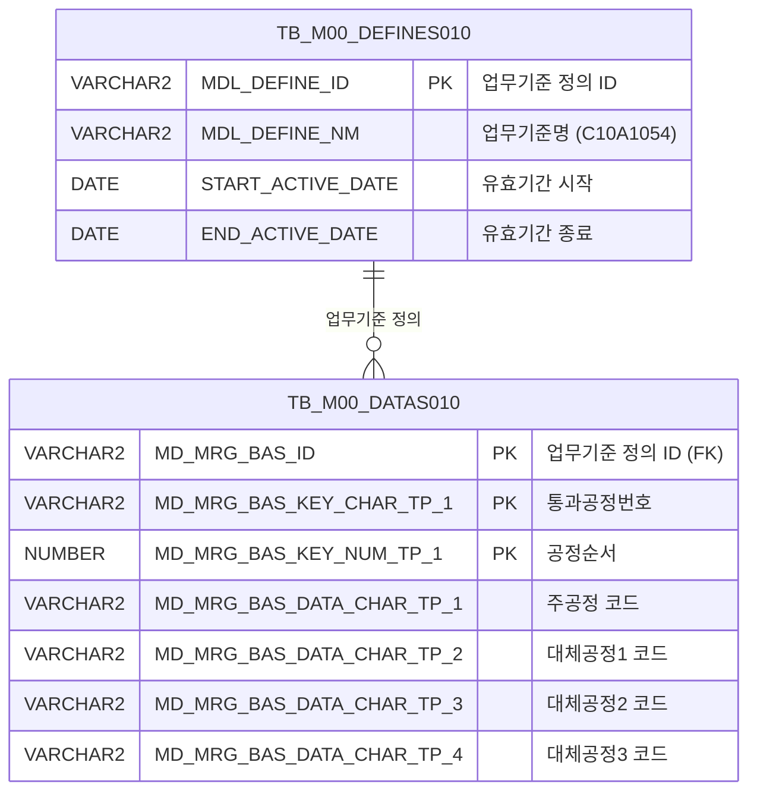

<h1 style="font-size: 40px; text-align: center; font-weight:
   bold; margin: 30px 0;">
  C107000020tab05 레거시 시스템 분석 종합 보고서
</h1>


# 1. 시스템 개요
- **서비스 ID**: C107000020tab05
- **업무명**: 통과공정기준조회
- **분석 일시**: 2026-03-17 09:47 (KST)
- **분석 시간**: 약 3분
- **전체 Activity 수**: 2개 (Built-in 2개, Custom 0개)
- **분석자**: Claude Opus 4.6 / Claude Sonnet 4.6
- **분석 도구**: /analyze-service C107000020tab05
- **문서 버전**: 1.0

# 📊 비즈니스 프로세스 분석

## 시스템 목적

C107000020tab05는 상위 화면 C107000020(통과공정기준 관리)의 5번째 탭 콘텐츠로, **통과공정번호별 공정 시퀀스 기준 정보를 조회**하는 읽기 전용 화면이다.

마스터 데이터 관리 모듈(M00)의 `TB_M00_DATAS010` 테이블에 정의된 업무기준 `C10A1054`를 기반으로, 각 통과공정번호(PAS_PROC_NO)에 대한 공정 순서(PROC_SEQ), 주공정 코드(MAIN_PROC_CD), 대체공정 코드 1~3(SUB_PROC_CD1~3)을 조회하여 그리드에 표시한다. 이 기준 데이터는 C10 모듈의 생산 스케줄링 및 작업지시 시 코일이 거쳐야 할 공정 경로를 결정하는 데 사용된다.

조회 조건은 상위 탭의 공통 폼(C107000020_Form_1)에서 전달받으며, 본 탭 자체에는 입력 폼이 없다. 탭 진입 시 자동으로 데이터를 조회하는 구조이다.

## 주요 유즈케이스

### UC-01: 통과공정 기준 조회
- **Actor**: 생산관리 담당자
- **목적**: 특정 통과공정번호의 공정 시퀀스 및 주공정/대체공정 구성을 확인하여 생산 경로 기준 데이터를 검증

- **전제조건**:
  - 사용자가 시스템에 로그인되어 있음
  - 상위 화면(C107000020)에 진입하여 공통 조회 조건이 설정되어 있음
  - 업무기준 C10A1054가 M00 마스터에 등록되어 있음

- **주요 흐름**:
  1. 사용자가 상위 화면(C107000020)에서 조회 조건 입력
  2. tab05 탭 클릭하여 통과공정기준조회 화면 진입
  3. 화면 진입 시 `onLoadGrid` 이벤트에 의해 자동 조회 실행
  4. `C107000020tab05.select` 쿼리 호출 - M00APUSER 마스터 테이블에서 업무기준 C10A1054 데이터 조회
  5. Grid에 통과공정번호, 순서, 주공정, 대체공정1~3 표시

- **대체 흐름**:
  - 조회 결과 없음: 빈 그리드 표시
  - 검색 코드 미입력: LIKE '%' 패턴으로 전체 조회

- **후행조건**:
  - 조회된 데이터가 Grid에 표시됨 (읽기 전용)
  - 사용자가 컨텍스트 메뉴를 통해 엑셀 내보내기 가능

### UC-02: 통과공정번호 검색
- **Actor**: 생산관리 담당자
- **목적**: 특정 통과공정번호를 포함하는 기준 데이터만 필터링하여 조회

- **전제조건**:
  - 상위 폼에 검색 코드(SEARCH_CD)가 입력되어 있음

- **주요 흐름**:
  1. 상위 폼(C107000020_Form_1)에서 검색 코드 입력
  2. 조회 버튼 클릭 또는 find 이벤트 발생
  3. SEARCH_CD 파라미터가 LIKE '%' || :SEARCH_CD || '%' 조건으로 적용
  4. 통과공정번호(PAS_PROC_NO)에 검색 코드가 포함된 데이터만 필터링
  5. 결과가 Grid에 페이징(20건 단위)으로 표시

- **대체 흐름**:
  - 검색 코드가 빈 문자열: 전체 데이터 조회

- **후행조건**:
  - 필터링된 결과가 Grid에 표시됨

### UC-03: 그리드 데이터 엑셀 내보내기
- **Actor**: 생산관리 담당자
- **목적**: 조회된 통과공정 기준 데이터를 엑셀 파일로 다운로드

- **전제조건**:
  - Grid에 조회된 데이터가 존재함

- **주요 흐름**:
  1. Grid 영역에서 마우스 우클릭하여 컨텍스트 메뉴 표시
  2. "엑셀 내보내기" 메뉴 선택
  3. `onGridContextMenuClick` 핸들러에서 `toExcel()` 호출
  4. 현재 Grid 데이터가 엑셀 파일로 다운로드

- **대체 흐름**:
  - Grid 데이터 없음: 빈 엑셀 파일 생성

- **후행조건**:
  - 엑셀 파일이 클라이언트에 다운로드됨

---

# 💾 데이터 요구사항

## 핵심 테이블

### 1. TB_M00_DATAS010 - (마스터 데이터 저장 테이블)
| 컬럼명 | 타입 | PK | 설명 |
|--------|------|----|-----|
| MD_MRG_BAS_ID | VARCHAR2 | ✅ | 업무기준 정의 ID (FK → TB_M00_DEFINES010) |
| MD_MRG_BAS_KEY_CHAR_TP_1 | VARCHAR2 | ✅ | 키 문자값 1 (통과공정번호 PAS_PROC_NO로 사용) |
| MD_MRG_BAS_KEY_NUM_TP_1 | NUMBER | ✅ | 키 숫자값 1 (공정순서 PROC_SEQ로 사용) |
| MD_MRG_BAS_DATA_CHAR_TP_1 | VARCHAR2 | | 데이터 문자값 1 (주공정 MAIN_PROC_CD로 사용) |
| MD_MRG_BAS_DATA_CHAR_TP_2 | VARCHAR2 | | 데이터 문자값 2 (대체공정1 SUB_PROC_CD1로 사용) |
| MD_MRG_BAS_DATA_CHAR_TP_3 | VARCHAR2 | | 데이터 문자값 3 (대체공정2 SUB_PROC_CD2로 사용) |
| MD_MRG_BAS_DATA_CHAR_TP_4 | VARCHAR2 | | 데이터 문자값 4 (대체공정3 SUB_PROC_CD3로 사용) |

### 2. TB_M00_DEFINES010 - (업무기준 정의 테이블)
| 컬럼명 | 타입 | PK | 설명 |
|--------|------|----|-----|
| MDL_DEFINE_ID | VARCHAR2 | ✅ | 업무기준 정의 ID |
| MDL_DEFINE_NM | VARCHAR2 | | 업무기준명 (이 서비스에서는 'C10A1054') |
| START_ACTIVE_DATE | DATE | | 유효기간 시작일 |
| END_ACTIVE_DATE | DATE | | 유효기간 종료일 |

## 데이터 플로우

### 1. 조회

```
[통과공정 기준 데이터 조회]
탭 진입 또는 조회 버튼 클릭
→ C107000020tab05.select
  FROM M00APUSER.TB_M00_DATAS010 DATAS010
  INNER JOIN (SELECT MDL_DEFINE_ID FROM M00APUSER.TB_M00_DEFINES010
              WHERE MDL_DEFINE_NM='C10A1054'
              AND START_ACTIVE_DATE <= SYSDATE
              AND SYSDATE < END_ACTIVE_DATE) DEFINES010
    ON DEFINES010.MDL_DEFINE_ID = DATAS010.MD_MRG_BAS_ID
  WHERE DATAS010.MD_MRG_BAS_KEY_CHAR_TP_1 LIKE '%' || :SEARCH_CD || '%'
  ORDER BY PAS_PROC_NO, PROC_SEQ
→ Grid에 통과공정번호, 순서, 주공정, 대체공정1~3 표시
```

## SQL 일람표

| SQL 이름 | 쿼리 ID | 타입 | 출처 | 테이블 |
|---------|---------|-----|-------|-------|
| 통과공정 기준 조회 | C107000020tab05.select | SELECT | Service | TB_M00_DATAS010, TB_M00_DEFINES010 |

## ER 다이어그램 (핵심 관계)



관계 설명:
- TB_M00_DEFINES010이 업무기준 정의의 메타 테이블로, MDL_DEFINE_ID를 통해 TB_M00_DATAS010의 실제 데이터와 1:N 관계
- 업무기준명 'C10A1054'가 C10 모듈의 통과공정 기준을 의미하며, 유효기간(START_ACTIVE_DATE ~ END_ACTIVE_DATE)에 의해 현재 활성 기준만 조회됨

---

# 🖥️ 사용자 인터페이스 요구사항

## 화면 레이아웃 상세

### Layout 구조 (절대 좌표 방식)
```javascript
// initLayout 없음 - 절대 좌표 기반 배치
{
  type: "absolute",
  components: [
    {
      id: "C107000020tab05_Grid_1",
      style: "position:absolute; height:492px; width:976px; left:0px; top:0px;"
      // 화면 상단 전체를 차지하는 그리드
    },
    {
      id: "C107000020tab05_Form_1",
      style: "position:absolute; height:30px; width:282px; left:0px; top:450px;"
      // 빈 폼 (상위 탭 폼에서 파라미터 전달받음)
    },
    {
      id: "C107000020tab05_messagebox",
      style: "position:absolute; height:18px; width:976px; left:0px; top:493px;"
      // 상태 메시지 표시 영역
    }
  ]
}
```

## 입출력 요소

### Form 컴포넌트
**C107000020tab05_Form_1**
- XML이 비어있음 (items 태그만 존재)
- 조회 파라미터는 상위 탭의 공통 폼(C107000020_Form_1)에서 전달받는 구조
- URL: basicGridData.do

### Grid 컴포넌트

**C107000020tab05_Grid_1 (통과공정 기준 목록)**
- 편집 가능 여부: 아니오 (읽기 전용, 모든 컬럼 ro 타입)
- Split: 0 (고정 컬럼 없음)
- 페이징: 20행 단위
- 스킨: dhx_skyblue
- 스마트 렌더링: 활성화
- 2단 헤더: 1행 - 컬럼 정의, 2행 - 통과공정번호/순서/주공정/대체공정1/대체공정2/대체공정3
- 컨텍스트 메뉴: 활성화
- 주요 컬럼 (6개):

  **공정 식별 정보**:
  - PAS_PROC_NO (CUS_BTH_PAP_NO): ro - 통과공정번호 / 조건 (10%, 중앙정렬, 문자열 정렬) - 뷰 VI_M00_C10A1023 참조
  - PROC_SEQ: ro - 공정순서 / #cspan (10%, 중앙정렬, 문자열 정렬) - 뷰 VI_M00_C10A1023 참조

  **공정 코드 정보**:
  - MAIN_PROC_CD: ro - 주공정코드 / 결과 (10%, 중앙정렬, 문자열 정렬) - 뷰 VI_M00_C10A1023 참조
  - SUB_PROC_CD1: ro - 대체공정1 / #cspan (10%, 중앙정렬, 문자열 정렬) - 뷰 VI_M00_C10A1023 참조
  - SUB_PROC_CD2: ro - 대체공정2 / #cspan (10%, 중앙정렬, 문자열 정렬) - 뷰 VI_M00_C10A1023 참조
  - SUB_PROC_CD3: ro - 대체공정3 / #cspan (10%, 중앙정렬, 문자열 정렬) - 뷰 VI_M00_C10A1023 참조

## 화면 동작 흐름

### 1. 화면 초기 로딩 (탭 진입)
```
1. 상위 화면(C107000020)에서 tab05 탭 클릭
2. C107000020tab05.jsp 로드
3. Grid XML 로드 완료 → onLoadGrid 이벤트 발동
4. 상위 폼(C107000020_Form_1)의 파라미터 추출
5. C107000020tab05-service 호출 (find 명령)
   - PosDefaultRouter(분기) → FormSearch(조회) Activity 실행
   - C107000020tab05.select 쿼리 실행 (mesdao)
6. Grid에 통과공정 기준 데이터 표시
7. onLoadGrid 이벤트 해제 (detachEvent) - 중복 호출 방지
```

### 2. 조회 (상위 폼 연동)
```
1. 상위 폼(C107000020_Form_1)에서 검색 조건 입력
2. 조회 버튼 클릭 → find 이벤트 발생
3. 상위 폼의 SEARCH_CD 파라미터를 Grid 조회에 전달
4. C107000020tab05-service 호출
5. LIKE '%' || :SEARCH_CD || '%' 조건으로 통과공정번호 필터링
6. Grid 데이터 갱신 (페이징 20건)
7. messagebox에 조회 결과 건수 표시 (findMessage)
```

### 3. 그리드 컨텍스트 메뉴 활용
```
1. Grid 영역에서 마우스 우클릭
2. 컨텍스트 메뉴 표시
3. 메뉴 선택:
   - "컬럼이동": enableColumnMove(true/false) 토글
   - "필터": enableHeaderMenu() 호출 → 컬럼 필터 활성화
   - "편집": setEditable(true/false) 토글
   - "엑셀 내보내기": toExcel() 호출 → 엑셀 파일 다운로드
```

## JavaScript 모듈

**C107000020tab05.jsp (인라인 스크립트)**
- find(): 조회 이벤트 - 상위 폼(C107000020_Form_1) 파라미터로 Grid 데이터 로드
- add(): 그리드 행 추가 (메뉴 이벤트)
- remove(): 그리드 행 삭제 (메뉴 이벤트)
- copy(): 그리드 행 클립보드 복사 (메뉴 이벤트)
- undo(): 실행 취소 (메뉴 이벤트)
- redo(): 다시 실행 (메뉴 이벤트)
- onGridContextMenuClick(): 그리드 컨텍스트 메뉴 핸들러 (컬럼이동/필터/편집/엑셀)
- findMessage(): 그리드 메시지 표시 (uiCommon.message 호출)
- onLoadGrid(): 그리드 XML 로드 완료 후 자동 조회 + 이벤트 해제 (detachEvent)

## 주요 이벤트 핸들러

**find (조회)**
- 이벤트 타입: Form Find Button
- 처리 내용:
  1. 상위 폼(C107000020_Form_1)에서 파라미터 추출
  2. C107000020tab05_Grid_1에 loadData 호출
  3. handleDataProcess.do URL로 서비스 요청
  4. Grid에 결과 데이터 바인딩

**onLoadGrid (자동 조회)**
- 이벤트 타입: Grid onXLE (XML Load End)
- 처리 내용:
  1. Grid XML 로드 완료 감지
  2. 상위 폼(C107000020_Form_1) 파라미터로 Grid 데이터 자동 로드
  3. 로드 완료 후 이벤트 핸들러 해제 (detachEvent)

**onGridContextMenuClick (컨텍스트 메뉴)**
- 이벤트 타입: Context Menu Click
- 처리 내용:
  1. 메뉴 ID 판별 (move_grid / filter_grid / editable_grid / excel_grid)
  2. move_grid: 컬럼 이동 토글 (enableColumnMove)
  3. filter_grid: 헤더 필터 메뉴 활성화 (enableHeaderMenu)
  4. editable_grid: 편집 모드 토글 (setEditable)
  5. excel_grid: 엑셀 내보내기 실행 (toExcel)

---

# 📌 특이사항 및 주의사항

## 1. M00 마스터 데이터 범용 테이블 구조
- TB_M00_DATAS010은 범용 Key-Value 형태의 마스터 데이터 테이블로, 컬럼명이 `MD_MRG_BAS_KEY_CHAR_TP_1`, `MD_MRG_BAS_DATA_CHAR_TP_1` 등 범용적이어서 비즈니스 의미를 직관적으로 파악하기 어렵다. 실제 의미는 업무기준 정의(MDL_DEFINE_NM='C10A1054')에 의해 결정된다. 현대화 시 전용 테이블 설계가 필요하다.

## 2. 유효기간 기반 기준 데이터 필터링
- TB_M00_DEFINES010에서 `START_ACTIVE_DATE <= SYSDATE AND SYSDATE < END_ACTIVE_DATE` 조건으로 현재 유효한 기준만 조회한다. 유효기간이 만료되면 해당 업무기준 데이터가 조회되지 않으므로, 기준 데이터 관리 시 유효기간 설정에 주의가 필요하다.

## 3. 상위 탭 의존적 구조
- 본 화면은 자체 조회 폼이 없으며(Form XML이 비어있음), 상위 화면(C107000020)의 공통 폼(C107000020_Form_1)에서 검색 파라미터를 전달받는 구조이다. 따라서 독립적으로 실행할 수 없으며, 반드시 상위 화면의 탭 콘텐츠로만 동작한다.

## 4. Grid 헤더와 실제 컬럼 ID 불일치
- Grid XML에서 첫 번째 컬럼의 id가 `CUS_BTH_PAP_NO`이나 실제 데이터 바인딩은 `PAS_PROC_NO`(dataId)로 이루어진다. Grid 헤더의 1행은 "조건, #cspan, 결과, #cspan, #cspan, #cspan"으로 되어 있고, 2행(attachHeader)에서 실제 의미인 "통과공정번호, 순서, 주공정, 대체공정1~3"이 표시된다. #cspan은 이전 컬럼의 헤더를 확장(colspan)하는 DHTMLX 패턴이다.

## 5. 뷰 참조 (VI_M00_C10A1023)
- Grid 컬럼 정의에서 table 속성이 `VI_M00_C10A1023` 뷰를 참조하고 있다. 이는 DHTMLX Grid의 콤보/자동완성 등에 사용될 수 있는 코드 뷰 참조이나, 본 화면에서는 모든 컬럼이 ro(읽기 전용) 타입이므로 직접적인 데이터 편집에는 사용되지 않는다.

---

# 📚 참고 문서

- **Query SQL**: `src/query/C107000020tab05-query.glue_sql`
- **Service XML**: `src/service/C107000020tab05-service.xml`
- **JSP**: `WebContents/C107000020tab05.jsp`
- **Grid XML**: `WebContents/header/kr/C107000020tab05/C107000020tab05_Grid_1.xml`
- **Form XML**: `WebContents/header/kr/C107000020tab05/C107000020tab05_Form_1.xml`
