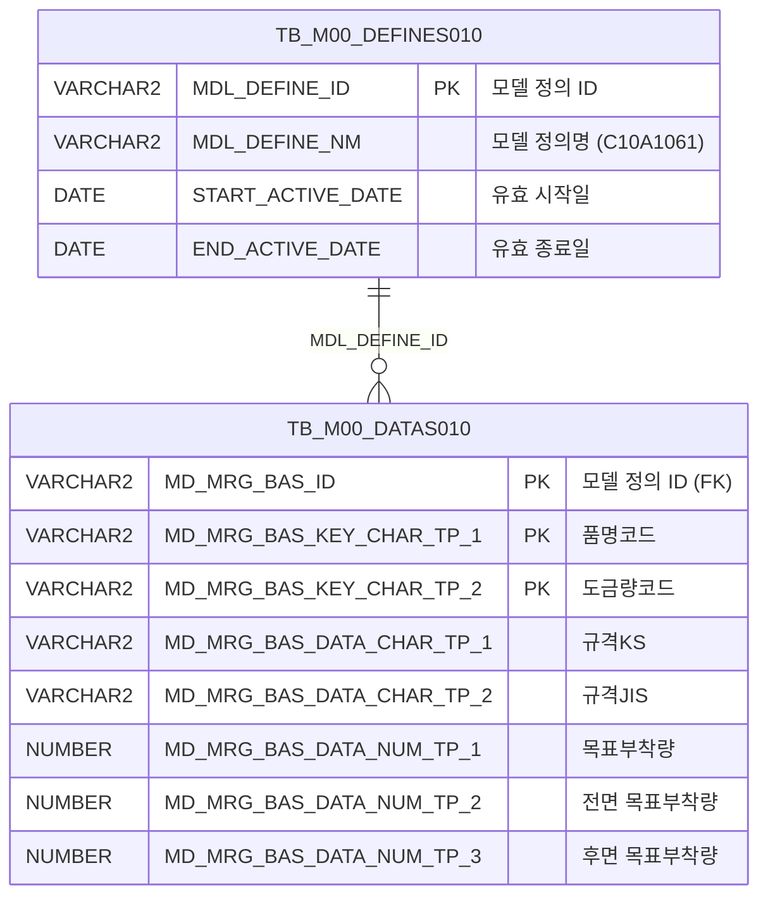

<h1 style="font-size: 40px; text-align: center; font-weight:
   bold; margin: 30px 0;">
  C107000020tab06 레거시 시스템 분석 종합 보고서
</h1>


# 1. 시스템 개요
- **서비스 ID**: C107000020tab06
- **업무명**: 도금량기준조회
- **분석 일시**: 2026-03-17 09:53 KST
- **분석 시간**: ~3분
- **전체 Activity 수**: 2개 (Built-in 2개)
- **분석자**: Claude Opus 4.6
- **분석 도구**: /analyze-service C107000020tab06
- **문서 버전**: 1.0

# 📊 비즈니스 프로세스 분석

## 시스템 목적

C107000020tab06은 CGL(연속용융아연도금라인) 공정에서 사용하는 **도금량 기준 정보 조회** 화면이다. 부모 화면 C107000020의 6번째 탭으로 구성되며, 제품명(품명코드)과 도금량코드별로 각종 규격(KS/JIS/ASTM/ISO/EU/AS)의 도금량 기준값과 목표 부착량, 부착량 상하한, 도금두께 상하한/목표값을 조회한다.

이 화면은 M00APUSER 스키마의 마스터 데이터 모델(TB_M00_DATAS010/TB_M00_DEFINES010)에서 업무 모델 정의 ID 'C10A1061'에 해당하는 도금량 기준 데이터를 조회하는 읽기 전용 화면으로, 사용자가 부모 탭의 검색 폼에서 품명코드(SEARCH_CD)를 입력하면 해당 조건에 맞는 도금 규격 정보를 Grid에 표시한다. 작업지시 시 코일의 도금량 기준을 확인하는 참조 목적으로 사용된다.

<!-- 단순 조회 서비스: Custom Activity 0개, SELECT 쿼리만 사용 → 워크플로우 다이어그램 생략 -->

## 주요 유즈케이스

### UC-01: 도금량 기준 조회
- **Actor**: CGL 공정 오퍼레이터 / 품질 담당자
- **목적**: 제품명별 도금량 코드에 따른 각 규격(KS/JIS/ASTM/ISO/EU/AS)의 도금 부착량 기준값과 도금두께 기준값을 확인

- **전제조건**:
  - 사용자가 C107000020 화면에 진입하여 tab06(도금량기준조회) 탭을 선택한 상태
  - M00APUSER.TB_M00_DEFINES010에 'C10A1061' 업무 모델이 유효기간 내로 등록되어 있음
  - M00APUSER.TB_M00_DATAS010에 해당 모델의 도금량 기준 데이터가 존재함

- **주요 흐름**:
  1. 탭 진입 시 Grid XML 로드 완료(onXLE) 이벤트로 자동 조회 실행
  2. 부모 탭(C107000020)의 Form_1에서 SEARCH_CD 파라미터 수집 (`uiCommon.parameters4`)
  3. `C107000020tab06.select` 쿼리로 TB_M00_DATAS010 → TB_M00_DEFINES010 JOIN 조회
  4. Grid_1에 품명코드, 도금량코드, 각 규격별 도금량, 목표부착량(전면/후면), 부착량 상하한, 도금두께 상하한/목표값 표시

- **대체 흐름**:
  - 조회 결과 없음: Grid에 빈 목록 표시, messagebox에 서버 응답 메시지 표시
  - SEARCH_CD 미입력: LIKE '%'||:SEARCH_CD||'%' 조건으로 전체 조회

- **후행조건**:
  - 조회된 도금량 기준 데이터가 Grid에 표시됨 (읽기 전용)

### UC-02: 수동 재조회
- **Actor**: CGL 공정 오퍼레이터
- **목적**: 부모 폼의 검색 조건을 변경한 후 도금량 기준 데이터를 갱신

- **전제조건**:
  - 이미 tab06 탭이 활성화된 상태

- **주요 흐름**:
  1. 부모 탭(C107000020)의 Form_1에서 검색 조건(SEARCH_CD) 변경
  2. 조회 버튼 클릭 → `find()` 함수 호출
  3. `uiCommon.parameters4('C107000020_Form_1','C107000020tab06_Grid_1', eventName)` 으로 파라미터 구성
  4. Grid_1 데이터 재로드

- **대체 흐름**:
  - 결과 없음: Grid 초기화 후 빈 상태 표시

- **후행조건**:
  - 변경된 조건에 맞는 도금량 기준 데이터가 Grid에 갱신됨

### UC-03: 컨텍스트 메뉴 활용
- **Actor**: CGL 공정 오퍼레이터
- **목적**: 그리드 데이터의 편의 기능(컬럼이동, 필터, 엑셀 다운로드) 활용

- **전제조건**:
  - Grid에 데이터가 로드된 상태

- **주요 흐름**:
  1. Grid 영역에서 마우스 우클릭 → 컨텍스트 메뉴 표시
  2. 메뉴 항목 선택:
     - `move_grid`: 컬럼 드래그앤드롭 이동 활성화/비활성화
     - `filter_grid`: 헤더 필터 메뉴 활성화
     - `editable_grid`: 그리드 편집 모드 ON/OFF (체크박스 토글)
     - `excel_grid`: 그리드 데이터를 엑셀로 내보내기 (`gridexcel` URL 호출)

- **대체 흐름**:
  - 데이터 미로드 상태에서 엑셀 내보내기 시도: 빈 엑셀 파일 생성

- **후행조건**:
  - 선택한 편의 기능이 적용됨

---
## 비즈니스 로직 상세

### 1. 마스터 데이터 모델 기반 도금량 기준 조회

- **목적**: 범용 마스터 데이터 모델(TB_M00_DATAS010/TB_M00_DEFINES010)에서 업무별 정의 ID를 통해 도금량 기준 데이터를 추출
- **처리 케이스**:

  **[케이스 1: 업무 모델 정의 필터링]**
  ```
    조건: TB_M00_DEFINES010.MDL_DEFINE_NM = 'C10A1061' (도금량기준 업무 모델)
    처리:
      1. TB_M00_DEFINES010에서 MDL_DEFINE_NM='C10A1061'이고 유효기간(START_ACTIVE_DATE ~ END_ACTIVE_DATE) 내인 MDL_DEFINE_ID 조회
      2. TB_M00_DATAS010에서 해당 MDL_DEFINE_ID와 매칭되는 데이터 행 추출
      3. 범용 컬럼(MD_MRG_BAS_KEY_CHAR_TP_N, MD_MRG_BAS_DATA_CHAR_TP_N, MD_MRG_BAS_DATA_NUM_TP_N)을 업무 의미 있는 별칭으로 변환
  ```

  **[케이스 2: 범용 컬럼 → 업무 컬럼 매핑]**
  ```
    조건: 마스터 데이터 모델의 범용 컬럼 구조
    처리:
      KEY 컬럼 매핑:
        MD_MRG_BAS_KEY_CHAR_TP_1 → PRD_NM_CD (품명코드)
        MD_MRG_BAS_KEY_CHAR_TP_2 → GW_ASG_CD (도금량코드)
      CHAR 컬럼 매핑 (규격 정보):
        MD_MRG_BAS_DATA_CHAR_TP_1~6 → SPC_GW_KS, SPC_GW_JIS, SPC_GW_ASTM, SPC_GW_ISO, SPC_GW_EU, SPC_GW_AS
      NUM 컬럼 매핑 (수치 정보):
        MD_MRG_BAS_DATA_NUM_TP_1 → WK_GW_TRV (목표부착량)
        MD_MRG_BAS_DATA_NUM_TP_2~3 → WK_GW_TRV_FRN/BAK (전면/후면 목표부착량)
        MD_MRG_BAS_DATA_NUM_TP_4~5 → WK_GW_FRN_LLV/ULV (전면 부착량 하한/상한)
        MD_MRG_BAS_DATA_NUM_TP_6~7 → WK_GW_BAK_LLV/ULV (후면 부착량 하한/상한)
        MD_MRG_BAS_DATA_NUM_TP_8~9 → WK_GW_TOT_LLV/ULV (합계 부착량 하한/상한)
        MD_MRG_BAS_DATA_NUM_TP_10~11 → GAL_THK_LLV/ULV (도금두께 하한/상한)
        MD_MRG_BAS_DATA_NUM_TP_12 → GAL_THK_TRV (도금두께 목표)
        MD_MRG_BAS_DATA_NUM_TP_13 → SPC_GAL_THK (상당도금두께)
  ```

  **[케이스 3: 검색 조건 LIKE 패턴]**
  ```
    조건: SEARCH_CD 파라미터 입력
    처리:
      1. LIKE '%'||:SEARCH_CD||'%' 패턴으로 품명코드(MD_MRG_BAS_KEY_CHAR_TP_1) 부분 일치 검색
      2. 결과를 품명코드(TP_1), 도금량코드(TP_2) 순으로 정렬
  ```

---

# 💾 데이터 요구사항

## 핵심 테이블

### 1. TB_M00_DATAS010 (M00APUSER) - 마스터 데이터 모델 데이터 저장소
| 컬럼명 | 타입 | PK | 설명 |
|--------|------|----|-----|
| MD_MRG_BAS_ID | VARCHAR2 | ✅ | 마스터 데이터 모델 정의 ID (FK → DEFINES010) |
| MD_MRG_BAS_KEY_CHAR_TP_1 | VARCHAR2 | ✅ | 키 문자 타입 1 (업무: 품명코드 PRD_NM_CD) |
| MD_MRG_BAS_KEY_CHAR_TP_2 | VARCHAR2 | ✅ | 키 문자 타입 2 (업무: 도금량코드 GW_ASG_CD) |
| MD_MRG_BAS_DATA_CHAR_TP_1 | VARCHAR2 | | 데이터 문자 타입 1 (업무: 규격KS) |
| MD_MRG_BAS_DATA_CHAR_TP_2 | VARCHAR2 | | 데이터 문자 타입 2 (업무: 규격JIS) |
| MD_MRG_BAS_DATA_CHAR_TP_3 | VARCHAR2 | | 데이터 문자 타입 3 (업무: 규격ASTM) |
| MD_MRG_BAS_DATA_CHAR_TP_4 | VARCHAR2 | | 데이터 문자 타입 4 (업무: 규격ISO) |
| MD_MRG_BAS_DATA_CHAR_TP_5 | VARCHAR2 | | 데이터 문자 타입 5 (업무: 규격EU) |
| MD_MRG_BAS_DATA_CHAR_TP_6 | VARCHAR2 | | 데이터 문자 타입 6 (업무: 규격AS) |
| MD_MRG_BAS_DATA_NUM_TP_1 | NUMBER | | 데이터 숫자 타입 1 (업무: 목표부착량) |
| MD_MRG_BAS_DATA_NUM_TP_2 | NUMBER | | 데이터 숫자 타입 2 (업무: 전면 목표부착량) |
| MD_MRG_BAS_DATA_NUM_TP_3 | NUMBER | | 데이터 숫자 타입 3 (업무: 후면 목표부착량) |
| MD_MRG_BAS_DATA_NUM_TP_4 | NUMBER | | 데이터 숫자 타입 4 (업무: 전면 부착량 하한) |
| MD_MRG_BAS_DATA_NUM_TP_5 | NUMBER | | 데이터 숫자 타입 5 (업무: 전면 부착량 상한) |
| MD_MRG_BAS_DATA_NUM_TP_6 | NUMBER | | 데이터 숫자 타입 6 (업무: 후면 부착량 하한) |
| MD_MRG_BAS_DATA_NUM_TP_7 | NUMBER | | 데이터 숫자 타입 7 (업무: 후면 부착량 상한) |
| MD_MRG_BAS_DATA_NUM_TP_8 | NUMBER | | 데이터 숫자 타입 8 (업무: 합계 부착량 하한) |
| MD_MRG_BAS_DATA_NUM_TP_9 | NUMBER | | 데이터 숫자 타입 9 (업무: 합계 부착량 상한) |
| MD_MRG_BAS_DATA_NUM_TP_10 | NUMBER | | 데이터 숫자 타입 10 (업무: 도금두께 하한) |
| MD_MRG_BAS_DATA_NUM_TP_11 | NUMBER | | 데이터 숫자 타입 11 (업무: 도금두께 상한) |
| MD_MRG_BAS_DATA_NUM_TP_12 | NUMBER | | 데이터 숫자 타입 12 (업무: 도금두께 목표) |
| MD_MRG_BAS_DATA_NUM_TP_13 | NUMBER | | 데이터 숫자 타입 13 (업무: 상당도금두께) |

### 2. TB_M00_DEFINES010 (M00APUSER) - 마스터 데이터 모델 정의
| 컬럼명 | 타입 | PK | 설명 |
|--------|------|----|-----|
| MDL_DEFINE_ID | VARCHAR2 | ✅ | 모델 정의 ID |
| MDL_DEFINE_NM | VARCHAR2 | | 모델 정의명 (예: 'C10A1061') |
| START_ACTIVE_DATE | DATE | | 유효 시작 일시 |
| END_ACTIVE_DATE | DATE | | 유효 종료 일시 |

## 데이터 플로우

### 1. 조회
```
[탭 진입 시 자동 조회 / 조회 버튼 클릭]
탭 진입 또는 조회 버튼 클릭
→ C107000020tab06.select
  FROM M00APUSER.TB_M00_DATAS010 DATAS010
  INNER JOIN (
    SELECT MDL_DEFINE_ID
    FROM M00APUSER.TB_M00_DEFINES010
    WHERE MDL_DEFINE_NM='C10A1061'
      AND START_ACTIVE_DATE <= SYSDATE
      AND SYSDATE < END_ACTIVE_DATE
  ) DEFINES010 ON DEFINES010.MDL_DEFINE_ID = DATAS010.MD_MRG_BAS_ID
  WHERE DATAS010.MD_MRG_BAS_KEY_CHAR_TP_1 LIKE '%'||:SEARCH_CD||'%'
  ORDER BY MD_MRG_BAS_KEY_CHAR_TP_1, MD_MRG_BAS_KEY_CHAR_TP_2
→ Grid_1에 품명별 도금량 기준 목록 표시

바인드 변수:
  - :SEARCH_CD → 부모 폼(C107000020_Form_1)에서 전달받는 품명코드 검색어
```

## SQL 일람표
| SQL 이름 | 쿼리 ID | 타입 | 출처 | 테이블 |
|---------|---------|-----|-------|-------|
| 도금량 기준 조회 | C107000020tab06.select | SELECT | Service | TB_M00_DATAS010, TB_M00_DEFINES010 |

## ER 다이어그램 (핵심 관계)



관계 설명:
- TB_M00_DEFINES010이 모델 정의 테이블로, MDL_DEFINE_ID를 통해 TB_M00_DATAS010의 데이터 행과 1:N 관계
- 업무 모델 'C10A1061'은 도금량 기준 데이터를 정의하며, DATAS010의 범용 컬럼을 품명/도금량/규격/부착량/두께 등 업무 의미로 매핑
- 유효기간(START_ACTIVE_DATE ~ END_ACTIVE_DATE)으로 모델 정의의 시간적 유효성 관리

---

# 🖥️ 사용자 인터페이스 요구사항

## 화면 레이아웃 상세

### Layout 구조 (Absolute 배치)
```javascript
{
  itemType: "absolute",
  components: [
    {
      id: "C107000020tab06_Grid_1",
      type: "grid",
      position: { left: 0, top: 0, width: 976, height: 492 }
    },
    {
      id: "C107000020tab06_messagebox",
      type: "messagebox",
      position: { left: 0, top: 493, width: 976, height: 18 }
    },
    {
      id: "C107000020tab06_Form_1",
      type: "form",
      position: { left: 0, top: 450, width: 282, height: 30 },
      note: "빈 폼 - 실제 파라미터는 부모 탭 C107000020_Form_1에서 참조"
    }
  ]
}
```

## 입출력 요소

### Form 컴포넌트
**C107000020tab06_Form_1**
- Form XML이 비어 있음 (`<items/>` 만 존재)
- 실제 조회 파라미터는 부모 탭의 **C107000020_Form_1** 폼에서 `uiCommon.parameters4`로 참조
- 이 폼은 서비스 연결용으로만 존재하며 사용자 입력 필드 없음

### Grid 컴포넌트

**C107000020tab06_Grid_1 (도금량기준조회)**
- 편집 가능 여부: 아니오 (전 컬럼 type=ro, 읽기 전용)
- Split: 0 (고정 컬럼 없음)
- 참조 테이블: VI_M00_C10A1061
- 페이징: 활성화 (pageset=true, rowCnt=19)
- Smart Rendering: 활성화
- 컨텍스트 메뉴: 활성화
- 주요 컬럼 (21개):

  **기본 식별 정보**:
  - PRD_NM_CD: ro - 품명 (10%, 중앙정렬, sort=str)
  - GW_ASG_CD: ro - 도금량코드 (10%, 중앙정렬, sort=str)

  **규격 정보 (6개 국제규격)**:
  - SPC_GW_KS: ro - 규격KS (10%, 중앙정렬, sort=str)
  - SPC_GW_JIS: ro - 규격JIS (10%, 중앙정렬, sort=str)
  - SPC_GW_ASTM: ro - 규격ASTM (10%, 중앙정렬, sort=str)
  - SPC_GW_ISO: ro - 규격ISO (10%, 중앙정렬, sort=str)
  - SPC_GW_EU: ro - 규격EU (10%, 중앙정렬, sort=str)
  - SPC_GW_AS: ro - 규격AS (10%, 중앙정렬, sort=str)

  **목표 부착량 정보**:
  - WK_GW_TRV: ro - 목표부착량 (10%, 우측정렬, sort=str)
  - WK_GW_TRV_FRN: ro - 목표부착량전면 (10%, 우측정렬, sort=str)
  - WK_GW_TRV_BAK: ro - 목표부착량후면 (10%, 우측정렬, sort=str)

  **부착량 상하한 정보**:
  - WK_GW_FRN_LLV: ro - 전면부착량하한 (10%, 우측정렬, sort=str)
  - WK_GW_FRN_ULV: ro - 전면부착량상한 (10%, 우측정렬, sort=str)
  - WK_GW_BAK_LLV: ro - 후면부착량하한 (10%, 우측정렬, sort=str)
  - WK_GW_BAK_ULV: ro - 후면부착량상한 (10%, 우측정렬, sort=str)
  - WK_GW_TOT_LLV: ro - 부착량하한(합계) (10%, 우측정렬, sort=str)
  - WK_GW_TOT_ULV: ro - 부착량상한(합계) (10%, 우측정렬, sort=str)

  **도금두께 정보**:
  - GAL_THK_LLV: ro - 도금두께하한 (10%, 우측정렬, sort=str)
  - GAL_THK_ULV: ro - 도금두께상한 (10%, 우측정렬, sort=str)
  - GAL_THK_TRV: ro - 도금두께목표 (10%, 우측정렬, sort=str)
  - SPC_GAL_THK: ro - 상당도금두께 (10%, 우측정렬, sort=str)

## 화면 동작 흐름

### 1. 화면 초기 로딩 (탭 진입)
```
1. 부모 화면(C107000020)에서 tab06 탭 클릭
2. C107000020tab06.jsp 로드
3. ui.initializeDHTMLX() 호출 → pageConfiguration 기반 컴포넌트 초기화
4. Grid_1 XML 로드 (C107000020tab06_Grid_1.xml)
5. Grid XML 로드 완료 시 onXLE 이벤트 발생 → onLoadGrid() 호출
6. uiCommon.parameters4('C107000020_Form_1','C107000020tab06_Grid_1','find') 으로 파라미터 구성
7. items['C107000020tab06_Grid_1'].loadData(findUrl) 실행 → 자동 조회
8. Grid XML 로드 이벤트(onXLE) 해제 (detachEvent) → 이후 중복 호출 방지
9. 조회 결과 Grid에 표시 + messagebox에 서버 응답 메시지 표시
```

### 2. 조회 버튼 클릭 (수동 재조회)
```
1. 부모 탭(C107000020)의 Form_1에서 검색 조건(SEARCH_CD) 변경
2. 조회 버튼 클릭 → find(eventName, formDivObj, referenceItem) 호출
3. uiCommon.parameters4('C107000020_Form_1','C107000020tab06_Grid_1', eventName) 으로 파라미터 구성
4. items['C107000020tab06_Grid_1'].loadData(findUrl) 실행
5. handleDataProcess.do → C107000020tab06-service → 분기 Activity → 조회 Activity 실행
6. Grid에 새 결과 바인딩
7. findMessage() → messagebox에 서버 응답(appMsg) 표시
```

### 3. 컨텍스트 메뉴 사용
```
1. Grid 영역 마우스 우클릭 → 컨텍스트 메뉴 표시 (contextmenu.xml 기반)
2. onGridContextMenuClick(id, gridObj, menuObj) 호출
3. 메뉴 항목별 처리:
   - move_grid: 체크 상태에 따라 enableColumnMove(true/false)
   - filter_grid: 체크 시 enableHeaderMenu() 호출
   - editable_grid: 체크 상태에 따라 setEditable(true/false)
   - excel_grid: gridObj.toExcel('/gridexcel','color') 호출 → 엑셀 파일 다운로드
```

## JavaScript 모듈

**C107000020tab06.jsp** (인라인 스크립트)
- find(eventName, formDivObj, referenceItem): 조회 기능 (uiCommon.parameters4로 부모 폼 파라미터 구성 → Grid_1 loadData)
- add(referenceItem): 그리드 새 행 추가 (items[referenceItem].addRow)
- remove(referenceItem): 그리드 선택 행 삭제 (items[referenceItem].removeRow)
- copy(referenceItem): 그리드 선택 행 클립보드 복사 (items[referenceItem].copyRowContent)
- undo(referenceItem): 실행취소 (items[referenceItem].undo)
- redo(referenceItem): 다시실행 (items[referenceItem].redo)
- onGridContextMenuClick(id, gridObj, menuObj): 그리드 컨텍스트 메뉴 처리 (컬럼이동/필터/편집가능/엑셀다운)
- findMessage(referenceItem): 서버 응답 메시지 표시 (uiCommon.message)
- onLoadGrid(): Grid XML 로드 완료 후 자동 조회 + onXLE 이벤트 해제

**외부 참조 스크립트**:
- `./dhtmlx/codebase/glue.ui.bootstrap.js`: DHTMLX 프레임워크 부트스트랩
- `./js/c10.ui.js`: C10 모듈 공통 UI 유틸리티

## 주요 이벤트 핸들러

**onLoadGrid (Grid XML 로드 완료)**
- 이벤트 타입: onXLE (Grid XML Load Event)
- 처리 내용:
  1. uiCommon.parameters4('C107000020_Form_1','C107000020tab06_Grid_1','find')로 파라미터 URL 생성
  2. items['C107000020tab06_Grid_1'].loadData(findUrl) → 자동 데이터 조회
  3. items["C107000020tab06_Grid_1"].getDhxGrid().detachEvent(onXLE) → 이벤트 해제 (1회만 실행)

**find (조회 버튼 클릭)**
- 이벤트 타입: Form 조회 버튼 Click
- 처리 내용:
  1. customparam 빈 문자열 초기화
  2. uiCommon.parameters4('C107000020_Form_1','C107000020tab06_Grid_1', customparam + eventName) 호출
  3. items['C107000020tab06_Grid_1'].loadData(findUrl) → Grid 데이터 재로드

**onGridContextMenuClick (컨텍스트 메뉴 클릭)**
- 이벤트 타입: Grid Context Menu Click
- 처리 내용:
  1. menuObj.getCheckboxState(id)로 체크 상태 확인
  2. move_grid: gridObj.enableColumnMove(true/false)
  3. filter_grid: gridObj.enableHeaderMenu()
  4. editable_grid: gridObj.setEditable(true/false)
  5. excel_grid: gridObj.toExcel('/gridexcel','color')

# 📌 특이사항 및 주의사항

## 1. 범용 마스터 데이터 모델 패턴 사용
- **범용 컬럼 매핑**: TB_M00_DATAS010은 범용 데이터 모델 테이블로, `MD_MRG_BAS_KEY_CHAR_TP_N`, `MD_MRG_BAS_DATA_CHAR_TP_N`, `MD_MRG_BAS_DATA_NUM_TP_N` 등 범용 컬럼을 업무 의미(품명, 도금량코드, 규격, 부착량 등)로 매핑하여 사용. 컬럼명만으로는 업무 의미 파악 불가하며, 반드시 업무 모델 정의(C10A1061)와 함께 이해해야 함.
- **유효기간 관리**: TB_M00_DEFINES010의 START_ACTIVE_DATE/END_ACTIVE_DATE로 모델 정의의 시간적 유효성을 관리. SYSDATE 기준 필터링하므로 모델 정의의 유효기간 만료 시 조회 불가.

## 2. 부모 탭 의존성
- **폼 파라미터 공유**: 이 탭은 자체 Form 필드가 없으며(Form XML이 `<items/>`만 존재), 부모 탭(C107000020)의 `C107000020_Form_1` 폼에서 검색 조건을 가져온다. `uiCommon.parameters4`로 다른 화면의 폼 ID를 직접 참조하는 크로스탭 참조 패턴을 사용.
- **탭 간 결합도**: 부모 폼의 구조 변경 시 이 탭의 조회 기능에 직접적 영향. 독립적 테스트 불가.

## 3. 읽기 전용 그리드에 편집 기능 메뉴 존재
- **불필요한 이벤트 핸들러**: Grid의 모든 컬럼이 `type=ro`(읽기 전용)임에도 `add`, `remove`, `copy`, `undo`, `redo` 등 행 편집 관련 이벤트 핸들러가 정의되어 있음. 이는 JSP 템플릿에서 기본 생성된 코드로 실제로는 사용되지 않으나 불필요한 코드.
- **editable_grid 컨텍스트 메뉴**: 컨텍스트 메뉴에서 `editable_grid` 선택 시 `setEditable(true)` 호출이 가능하나, 원래 모든 컬럼이 ro이므로 실질적 편집은 불가능한 UI 불일치.

## 4. Grid 컬럼 너비 합산 초과
- 21개 컬럼 모두 `width: 10%`로 설정되어 총 210%에 달함. 실제 표시 시 수평 스크롤이 발생하며, `colwidthUnit: "%"` 설정과 결합하여 의도적으로 가로 스크롤을 유도하는 패턴. Smart Rendering 활성화(`smartRendering: true`)로 대량 데이터 렌더링 성능은 확보.

## 5. M00APUSER 스키마 직접 참조
- SQL에서 `M00APUSER.TB_M00_DATAS010`, `M00APUSER.TB_M00_DEFINES010`으로 스키마를 직접 명시하여 접근. DAO 빈은 `mesdao`(MESAPUSER)를 사용하므로, 다른 스키마의 테이블을 크로스 스키마 참조하는 형태. 스키마 권한 변경 시 영향 가능성 있음.

---

# 📚 참고 문서

- **Query SQL**: `src/query/C107000020tab06-query.glue_sql`
- **Service XML**: `src/service/C107000020tab06-service.xml`
- **JSP**: `WebContents/C107000020tab06.jsp`
- **Grid XML**: `WebContents/header/kr/C107000020tab06/C107000020tab06_Grid_1.xml`
- **Form XML**: `WebContents/header/kr/C107000020tab06/C107000020tab06_Form_1.xml`
- **JS (공통)**: `WebContents/js/c10.ui.js`
