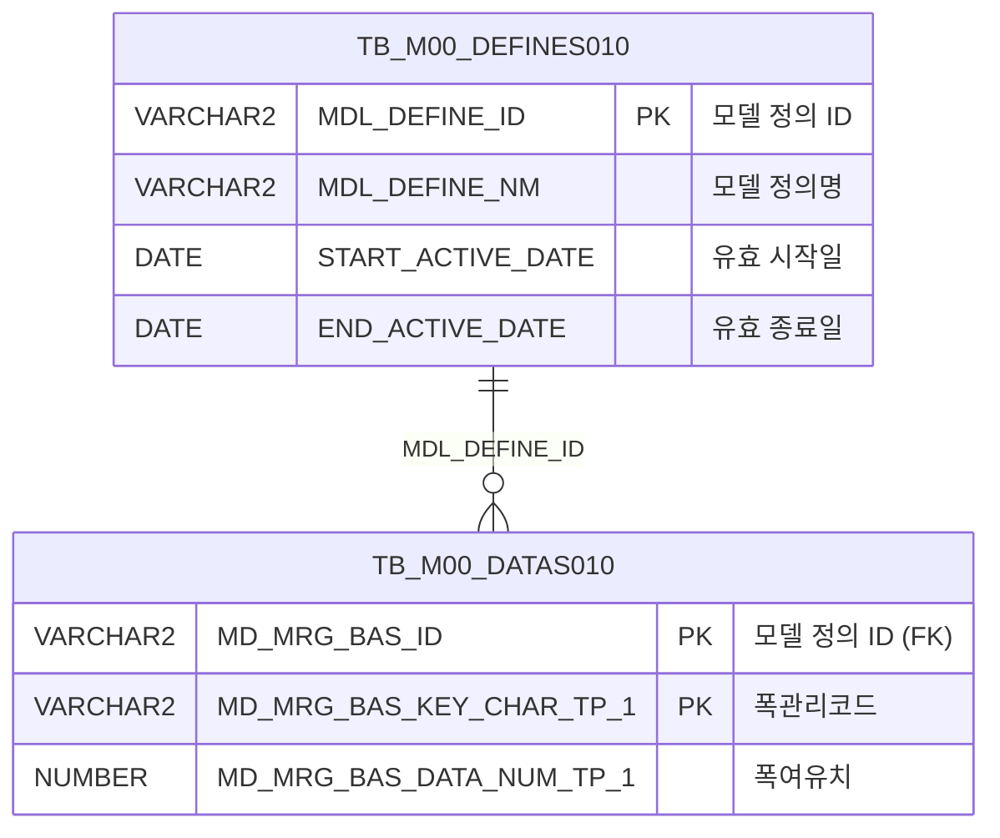

<h1 style="font-size: 40px; text-align: center; font-weight:
   bold; margin: 30px 0;">
  C107000020tab07 레거시 시스템 분석 종합 보고서
</h1>


# 1. 시스템 개요
- **서비스 ID**: C107000020tab07
- **업무명**: 제품폭여유기준조회
- **분석 일시**: 2026-03-17 10:02 KST
- **전체 Activity 수**: 2개 (Built-in 2개, Custom 0개)
- **분석자**: Claude Opus 4.6 / Sonnet 4.6
- **분석 도구**: /analyze-service C107000020tab07
- **문서 버전**: 1.0

# 📊 비즈니스 프로세스 분석

## 시스템 목적

제품폭여유기준조회 화면은 C10(냉연) 모듈의 부모 탭 화면(C107000020)에 속하는 탭 컨텐츠로, **폭 관리 코드별 제품 폭 여유치(마진) 기준**을 조회하는 순수 읽기 전용 화면이다.

MES 마스터 데이터(M00APUSER 스키마)에 정의된 모델 정의 테이블(TB_M00_DEFINES010)과 데이터 테이블(TB_M00_DATAS010)을 조인하여, 모델 정의명 'C10A1070'에 해당하는 폭 관리 코드와 병합 폭 기준값을 조회한다. 이 데이터는 냉연 제품의 폭 규격 관리 시 허용 여유치를 결정하는 기준 정보로 활용된다.

화면은 부모 탭(C107000020)의 Form 파라미터를 상속받아 자동 조회를 수행하며, 사용자 입력 없이 그리드 로드 시점에 데이터를 자동으로 표시하는 단순 구조이다.

<!-- 워크플로우 다이어그램 생략: Custom Activity 0개, SELECT 쿼리만 사용, Router → 단일 조회 Activity 구성 -->

## 주요 유즈케이스

### UC-01: 폭여유기준 자동 조회
- **Actor**: 냉연 공정 관리자 / 오퍼레이터
- **목적**: 부모 탭 화면 진입 시 폭 관리 코드별 여유치 기준을 자동으로 조회하여 제품 폭 규격 기준 확인

- **전제조건**:
  - 사용자가 시스템에 로그인되어 있음
  - 부모 탭 화면(C107000020)이 로드되어 있음
  - M00APUSER 스키마의 모델 정의 'C10A1070'이 유효 기간 내에 등록되어 있음

- **주요 흐름**:
  1. 사용자가 부모 탭 화면에서 '제품폭여유기준조회' 탭 선택
  2. 탭 JSP 로드 완료 시 `onLoadGrid` 이벤트 자동 발생
  3. 부모 탭의 `C107000020_Form_1` 파라미터를 `uiCommon.parameters4`로 구성
  4. `C107000020tab07-service` 호출 → `C107000020tab07.select` 쿼리 실행
  5. 폭관리코드(WTH_MNG_CD), 폭여유치(MRG_WTH) 그리드에 표시

- **대체 흐름**:
  - 모델 정의 'C10A1070'이 유효 기간 외인 경우: 조회 결과 없음 (빈 그리드 표시)
  - DB 연결 오류: 시스템 에러 메시지 표시

- **후행조건**:
  - 그리드에 폭 관리 기준 데이터가 표시됨
  - `onXLE` 이벤트 리스너가 해제되어 중복 조회 방지

### UC-02: 그리드 컨텍스트 메뉴 활용
- **Actor**: 냉연 공정 관리자 / 오퍼레이터
- **목적**: 조회된 폭여유기준 데이터에 대해 컬럼 이동, 필터, 엑셀 다운로드 등 부가 기능 활용

- **전제조건**:
  - UC-01에 의해 데이터가 그리드에 표시되어 있음

- **주요 흐름**:
  1. 그리드 우클릭으로 컨텍스트 메뉴 표시
  2. 원하는 기능 선택 (컬럼이동/필터/편집모드/엑셀다운로드)
  3. 선택된 기능에 따라 그리드 동작 변경

- **대체 흐름**:
  - 편집모드 활성화 시: 읽기전용(ro) 컬럼이므로 실질적 편집 불가
  - 엑셀 다운로드: gridexcel 서블릿 호출하여 현재 그리드 데이터 엑셀 출력

- **후행조건**:
  - 선택한 기능이 그리드에 적용됨

### UC-03: 부모 탭에서 재조회
- **Actor**: 냉연 공정 관리자 / 오퍼레이터
- **목적**: 부모 탭 화면의 조회 버튼 클릭 시 현재 탭의 데이터를 갱신

- **전제조건**:
  - 탭이 이미 로드되어 있음
  - 부모 Form에 조회 조건이 설정되어 있음

- **주요 흐름**:
  1. 부모 탭 화면에서 조회 버튼 클릭
  2. `find` 함수 호출 → `uiCommon.parameters4`로 `C107000020_Form_1` 파라미터 구성
  3. `C107000020tab07_Grid_1.loadData()` 호출
  4. 그리드 데이터 갱신

- **대체 흐름**:
  - 조회 결과 없음: 빈 그리드 표시

- **후행조건**:
  - 그리드에 최신 데이터가 표시됨

---
## 비즈니스 로직 상세

### 1. 모델 기반 마스터 데이터 조회 패턴

- **목적**: M00(마스터) 스키마의 범용 모델 정의-데이터 테이블 구조를 활용하여 폭 관리 기준 코드와 값을 조회
- **처리 케이스**:

  **[케이스 1: 유효 기간 기반 모델 정의 필터링]**
  ```
    조건: MDL_DEFINE_NM = 'C10A1070' (C10 모듈 폭여유기준 정의)
    처리:
      1. TB_M00_DEFINES010에서 MDL_DEFINE_NM이 'C10A1070'인 행 조회
      2. START_ACTIVE_DATE <= SYSDATE < END_ACTIVE_DATE 조건으로 현재 유효한 정의만 필터
      3. 해당 MDL_DEFINE_ID를 기준으로 TB_M00_DATAS010과 조인
      4. MD_MRG_BAS_KEY_CHAR_TP_1 → 폭관리코드(WTH_MNG_CD)로 매핑
      5. MD_MRG_BAS_DATA_NUM_TP_1 → 폭여유치(MRG_WTH)로 매핑
      6. 폭관리코드 오름차순 정렬
  ```

- **테이블 구조 해석**:
  ```
  TB_M00_DEFINES010: 범용 모델 정의 테이블 (메타데이터)
    - MDL_DEFINE_ID: 모델 정의 ID (PK)
    - MDL_DEFINE_NM: 모델 정의명 (여기서는 'C10A1070')
    - START_ACTIVE_DATE / END_ACTIVE_DATE: 유효 기간

  TB_M00_DATAS010: 범용 모델 데이터 테이블 (실제 값)
    - MD_MRG_BAS_ID: 모델 정의 ID (FK → DEFINES010)
    - MD_MRG_BAS_KEY_CHAR_TP_1: 키 문자열 값 (폭관리코드)
    - MD_MRG_BAS_DATA_NUM_TP_1: 데이터 숫자 값 (폭여유치)
  ```

---

# 💾 데이터 요구사항

## 핵심 테이블

### 1. TB_M00_DEFINES010 - (모델 정의 마스터)
| 컬럼명 | 타입 | PK | 설명 |
|--------|------|----|------|
| MDL_DEFINE_ID | VARCHAR2 | ✅ | 모델 정의 ID |
| MDL_DEFINE_NM | VARCHAR2 | | 모델 정의명 (예: 'C10A1070') |
| START_ACTIVE_DATE | DATE | | 유효 시작일 |
| END_ACTIVE_DATE | DATE | | 유효 종료일 |

### 2. TB_M00_DATAS010 - (모델 데이터)
| 컬럼명 | 타입 | PK | 설명 |
|--------|------|----|------|
| MD_MRG_BAS_ID | VARCHAR2 | ✅ | 모델 정의 ID (FK → DEFINES010) |
| MD_MRG_BAS_KEY_CHAR_TP_1 | VARCHAR2 | ✅ | 키 문자열 타입 1 (폭관리코드) |
| MD_MRG_BAS_DATA_NUM_TP_1 | NUMBER | | 데이터 숫자 타입 1 (폭여유치) |

## 데이터 플로우

### 1. 조회

```
[탭 로드 시 자동 조회 - onLoadGrid / find]
탭 진입 (또는 부모 탭 조회 버튼 클릭)
→ C107000020tab07.select
  FROM M00APUSER.TB_M00_DATAS010 DATAS010
  INNER JOIN (SELECT MDL_DEFINE_ID
              FROM M00APUSER.TB_M00_DEFINES010
              WHERE MDL_DEFINE_NM='C10A1070'
              AND START_ACTIVE_DATE <= SYSDATE
              AND SYSDATE < END_ACTIVE_DATE) DEFINES010
    ON DEFINES010.MDL_DEFINE_ID = DATAS010.MD_MRG_BAS_ID
  ORDER BY WTH_MNG_CD
→ Grid_1에 폭관리코드, 폭여유치 목록 표시
```

## SQL 일람표
| SQL 이름 | 쿼리 ID | 타입 | 출처 | 테이블 |
|---------|---------|-----|-------|-------|
| 폭여유기준 조회 | C107000020tab07.select | SELECT | Service | TB_M00_DATAS010, TB_M00_DEFINES010 |

## ER 다이어그램 (핵심 관계)



관계 설명:
- TB_M00_DEFINES010이 모델 정의 마스터 역할, TB_M00_DATAS010은 실제 데이터 저장
- MDL_DEFINE_ID를 통한 1:N 관계 (하나의 모델 정의에 여러 데이터 행)
- M00APUSER 스키마의 범용 모델-데이터 패턴 사용

---

# 🖥️ 사용자 인터페이스 요구사항

## 화면 레이아웃 상세

### Layout 구조
```javascript
// 탭 컨텐츠 (부모 탭 C107000020의 하위)
// 절대 좌표 기반 flat 레이아웃 (initLayout 없음)
{
  components: [
    {
      id: "C107000020tab07_Grid_1",
      type: "grid",
      position: { left: "0px", top: "0px", width: "976px", height: "492px" }
    },
    {
      id: "C107000020tab07_messagebox",
      type: "messagebox",
      position: { left: "0px", top: "493px", width: "976px", height: "18px" }
    },
    {
      id: "C107000020tab07_Form_1",
      type: "form",
      position: { left: "0px", top: "450px", width: "282px", height: "30px" }
      // 필드 없음 - 부모 탭 Form에서 파라미터 상속
    }
  ]
}
```

## 입출력 요소

### Form 컴포넌트
**C107000020tab07_Form_1**
- 필드 없음 (빈 XML). 조회 파라미터는 부모 탭의 `C107000020_Form_1`에서 상속받는 구조

### Grid 컴포넌트

**C107000020tab07_Grid_1 (폭여유기준 목록)**
- 편집 가능 여부: 아니오 (읽기 전용)
- Split: 0 (고정 컬럼 없음)
- 스킨: dhx_skyblue
- 페이징: 20행 단위
- 스마트 렌더링: 활성
- 컨텍스트 메뉴: 활성
- 멀티 선택: 활성
- 주요 컬럼 (2개):

  **기준 정보**:
  - WTH_MNG_CD: ro - 폭관리코드 (10%, 중앙정렬, 헤더: "조건" / 부제: "폭관리코드", 데이터 소스: VI_M00_C10A1070)
  - MRG_WTH: ro - 폭여유치 (10%, 중앙정렬, 헤더: "결과" / 부제: "폭여유치", 데이터 소스: VI_M00_C10A1070)

## 화면 동작 흐름

### 1. 화면 초기 로딩 (탭 진입)
```
1. 부모 탭 화면(C107000020)에서 '제품폭여유기준조회' 탭 클릭
2. C107000020tab07.jsp 로드
3. ui.initializeDHTMLX() 호출 → Grid, Form, Messagebox 초기화
4. Grid_1의 onXLE 이벤트에 onLoadGrid 리스너 등록
5. Grid XML 로드 완료 시 onLoadGrid 자동 실행
6. uiCommon.parameters4('C107000020_Form_1', 'C107000020tab07_Grid_1', 'find')로 파라미터 구성
7. items['C107000020tab07_Grid_1'].loadData(findUrl) 호출
8. C107000020tab07-service → C107000020tab07.select 쿼리 실행
9. Grid_1에 폭관리코드, 폭여유치 목록 표시
10. onXLE 이벤트 리스너 해제 (detachEvent) → 중복 조회 방지
```

### 2. 부모 탭에서 재조회
```
1. 부모 탭(C107000020)에서 조회 버튼 클릭
2. find(eventName, formDivObj, referenceItem) 함수 호출
3. uiCommon.parameters4('C107000020_Form_1', 'C107000020tab07_Grid_1', customparam + eventName)로 파라미터 구성
4. items['C107000020tab07_Grid_1'].loadData(findUrl) 호출
5. Grid_1 데이터 갱신
```

### 3. 컨텍스트 메뉴 활용
```
1. Grid_1 영역에서 마우스 우클릭
2. 컨텍스트 메뉴 표시 (contextmenu.xml 기반)
3. 메뉴 항목 선택:
   - move_grid: 컬럼 이동 토글 (enableColumnMove)
   - filter_grid: 헤더 필터 메뉴 활성화 (enableHeaderMenu)
   - editable_grid: 편집 모드 토글 (setEditable) - 단, 컬럼이 ro 타입이므로 실질 편집 불가
   - excel_grid: 엑셀 다운로드 (gridexcel 서블릿 호출, color 옵션)
```


## JavaScript 모듈

**C107000020tab07.jsp** (인라인 스크립트)
- `find(eventName, formDivObj, referenceItem)`: 폼 조회 이벤트 핸들러 (`uiCommon.parameters4`로 부모 Form 파라미터 구성 → Grid loadData)
- `add(referenceItem)`: 그리드 신규 행 추가 (items[referenceItem].addRow)
- `remove(referenceItem)`: 그리드 행 삭제 (items[referenceItem].removeRow)
- `copy(referenceItem)`: 그리드 행 클립보드 복사 (items[referenceItem].copyRowContent)
- `undo(referenceItem)`: 실행 취소 (items[referenceItem].undo)
- `redo(referenceItem)`: 재실행 (items[referenceItem].redo)
- `onGridContextMenuClick(id, gridObj, menuObj)`: 컨텍스트 메뉴 처리 (컬럼이동/필터/편집/엑셀)
- `findMessage(referenceItem)`: 메시지박스 표시 (uiCommon.message 호출, appMsg 사용자데이터)
- `onLoadGrid()`: 그리드 로드 완료 후 자동 조회 실행 및 onXLE 이벤트 해제

**참조 외부 스크립트**:
- `./dhtmlx/codebase/glue.ui.bootstrap.js` — GLUE UI 프레임워크 부트스트랩
- `./js/c10.ui.js` — C10 모듈 공통 UI 유틸리티

## 주요 이벤트 핸들러

**onLoadGrid (그리드 로드 완료)**
- 이벤트 타입: onXLE (Grid XML Load End)
- 처리 내용:
  1. `uiCommon.parameters4`로 부모 Form(`C107000020_Form_1`) 파라미터 구성
  2. `Grid_1.loadData(findUrl)` 호출하여 데이터 자동 조회
  3. `detachEvent(onXLE)` 호출하여 이벤트 리스너 해제 (1회만 실행)

**find (조회 버튼)**
- 이벤트 타입: Form find button event
- 처리 내용:
  1. `uiCommon.parameters4('C107000020_Form_1', 'C107000020tab07_Grid_1', eventName)` 호출
  2. Grid_1에 조회 URL 로드

**findMessage (메시지 표시)**
- 이벤트 타입: Grid 이벤트 콜백
- 처리 내용:
  1. `referenceItem.getUserData("", "appMsg")`로 앱 메시지 추출
  2. `uiCommon.message("C107000020tab07_messagebox", msg)` 호출하여 상태바에 표시


# 📌 특이사항 및 주의사항

## 1. 부모 탭 Form 파라미터 상속 구조
- **Form 비어있음**: `C107000020tab07_Form_1` XML에 필드가 없으며, 조회 시 부모 탭의 `C107000020_Form_1` 파라미터를 `uiCommon.parameters4`로 직접 참조한다. 이 구조는 탭 컨텐츠가 부모 화면의 조회 조건에 종속되어 있음을 의미하며, 부모 Form의 필드 변경 시 영향을 받을 수 있다.

## 2. 범용 모델-데이터 테이블 패턴 사용
- **비정형 테이블 구조**: 전용 테이블(TB_C10_xxx) 대신 M00 스키마의 범용 모델 정의-데이터 테이블(TB_M00_DEFINES010 / TB_M00_DATAS010)을 사용한다. 컬럼명이 `MD_MRG_BAS_KEY_CHAR_TP_1`, `MD_MRG_BAS_DATA_NUM_TP_1`과 같은 범용 명칭이므로, 데이터의 비즈니스 의미는 모델 정의명('C10A1070')에 의해서만 파악된다.
- **뷰 참조 불일치**: Grid XML의 `table` 속성은 `VI_M00_C10A1070` 뷰를 참조하지만, 실제 SQL은 TB_M00_DEFINES010/TB_M00_DATAS010 테이블을 직접 조인한다. UI와 쿼리 간 데이터 소스 참조가 일치하지 않는다.

## 3. onXLE 이벤트 1회 실행 패턴
- **중복 조회 방지**: `onLoadGrid` 함수 내에서 `detachEvent(onXLE)`를 호출하여 그리드 XML 로드 완료 이벤트를 1회만 처리한다. 이는 탭 전환 시 재로드되지 않도록 의도된 패턴이나, 탭 재진입 시 데이터가 갱신되지 않을 수 있다.

## 4. 유효 기간 기반 필터링
- **SYSDATE 의존**: SQL에서 `START_ACTIVE_DATE <= SYSDATE AND SYSDATE < END_ACTIVE_DATE` 조건으로 현재 유효한 모델 정의만 조회한다. 모델 정의의 유효 기간이 만료되면 데이터가 전혀 조회되지 않으며, 유효 기간 관리가 누락되면 업무에 지장이 발생할 수 있다.

## 5. 그리드 컬럼 너비 설정
- **퍼센트 기반 너비**: 두 컬럼 모두 `width: 10%`로 설정되어 있어, 전체 그리드 너비(976px)의 약 20%만 사용된다. 나머지 80% 영역은 비어있게 되며, 의도된 설계인지 확인이 필요하다.

# 📚 참고 문서

- **Query SQL**: `src/query/C107000020tab07-query.glue_sql`
- **JSP**: `WebContents/C107000020tab07.jsp`
- **Service XML**: `src/service/C107000020tab07-service.xml`
- **Grid XML**: `WebContents/header/kr/C107000020tab07/C107000020tab07_Grid_1.xml`
- **Form XML**: `WebContents/header/kr/C107000020tab07/C107000020tab07_Form_1.xml`
- **Messagebox XML**: `WebContents/header/kr/C107000020tab07/C107000020tab07_messagebox.xml`
