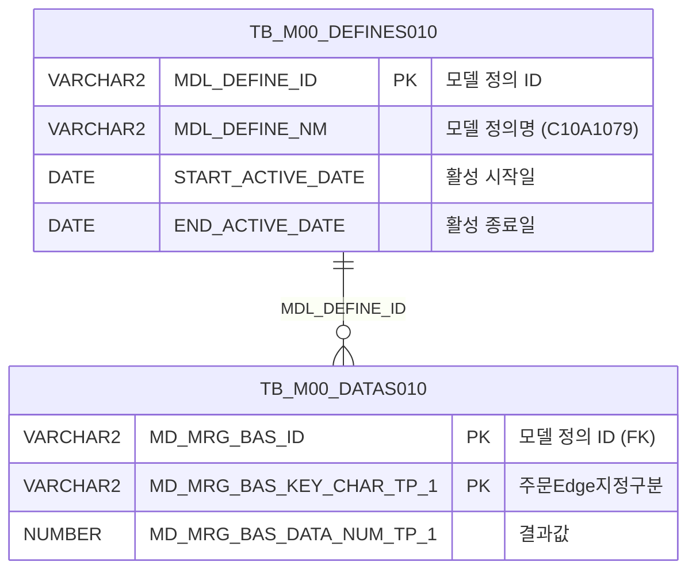

<h1 style="font-size: 40px; text-align: center; font-weight:
   bold; margin: 30px 0;">
  C107000020tab08 레거시 시스템 분석 종합 보고서
</h1>


# 1. 시스템 개요
- **서비스 ID**: C107000020tab08
- **업무명**: PL폭마진량관리
- **분석 일시**: 2026-03-17 10:11 KST
- **분석 시간**: 약 3분
- **전체 Activity 수**: 2개 (Built-in 2개, Custom 0개)
- **분석자**: Claude Opus 4.6 / Claude Sonnet (Phase 4)
- **분석 도구**: /analyze-service C107000020tab08
- **문서 버전**: 1.0

# 📊 비즈니스 프로세스 분석

## 시스템 목적

C107000020tab08은 C10(냉연) 모듈의 **PL(Plate Line) 폭마진량 관리** 탭 화면으로, 주문 Edge 지정 구분별 결과값(기준값)을 조회하는 단순 참조 화면이다. 이 화면은 `C107000020` 화면의 8번째 탭(`tab08`)으로 배치되어 있으며, 부모 화면의 검색 조건(Form)을 공유하여 별도의 검색 파라미터 입력 없이 데이터를 조회한다.

업무 데이터 모델 정의(MDL_DEFINE) 기반으로, `C10A1079` 모델의 활성 기간 내 데이터를 마스터 테이블(`TB_M00_DATAS010`)에서 추출하여 주문 Edge 지정 구분(ORD_EDG_ASG_TP)별 결과값(RSL_VAL)을 Grid 형태로 표시한다. 이는 냉연 공정에서 PL(Plate Line) 제품의 폭 마진량을 관리하기 위한 기준값 참조 데이터로 활용된다.

<!-- 단순 서비스 판별: Custom Activity 0개, SELECT 쿼리만 사용, Router → 단일 조회 Activity 구성이므로 워크플로우 다이어그램 생략 -->

## 주요 유즈케이스

### UC-01: PL 폭마진량 기준값 조회
- **Actor**: 냉연 공정 오퍼레이터 / 관리자
- **목적**: 주문 Edge 지정 구분별 PL 폭마진량 결과값을 조회하여 작업 기준 확인

- **전제조건**:
  - 사용자가 시스템에 로그인되어 있음
  - C107000020 화면에서 tab08 탭이 선택됨
  - M00APUSER.TB_M00_DEFINES010에 `C10A1079` 모델 정의가 활성 상태로 존재

- **주요 흐름**:
  1. 사용자가 C107000020 화면에서 tab08(PL폭마진량관리) 탭 선택
  2. 탭 로딩 시 `onXLEEvent(onLoadGrid)` 이벤트로 Grid 자동 조회 트리거
  3. `C107000020tab08.select` 쿼리 실행 — `C10A1079` 모델 정의의 활성 기간 조건(START_ACTIVE_DATE ≤ SYSDATE < END_ACTIVE_DATE) 확인
  4. TB_M00_DATAS010에서 해당 모델 ID에 매칭되는 데이터 조회
  5. 주문 Edge 지정 구분(ORD_EDG_ASG_TP) 기준 오름차순 정렬
  6. Grid에 결과 표시 (조건 컬럼 + 결과값 컬럼)

- **대체 흐름**:
  - 조회 결과가 없는 경우: Grid가 빈 상태로 표시됨 (`C10A1079` 모델 정의가 비활성이거나 매핑 데이터 없음)
  - 모델 정의 만료: `END_ACTIVE_DATE < SYSDATE`이면 서브쿼리 결과가 없어 전체 조회 결과 없음

- **후행조건**:
  - Grid에 주문 Edge 지정 구분별 결과값이 표시됨

### UC-02: Grid 컨텍스트 메뉴 활용
- **Actor**: 냉연 공정 오퍼레이터 / 관리자
- **목적**: Grid 데이터에 대한 부가 기능(필터, Excel 내보내기, 컬럼 이동 등) 활용

- **전제조건**:
  - UC-01 조회가 완료되어 Grid에 데이터가 표시됨

- **주요 흐름**:
  1. Grid 영역에서 마우스 우클릭으로 컨텍스트 메뉴 열기
  2. 원하는 기능 선택:
     - `move_grid`: 컬럼 이동 활성화/비활성화
     - `filter_grid`: 헤더 필터 메뉴 활성화
     - `editable_grid`: 그리드 편집 모드 활성화/비활성화
     - `excel_grid`: 그리드 Excel 내보내기
  3. 선택한 기능이 Grid에 적용됨

- **대체 흐름**:
  - Grid에 데이터가 없는 경우: 컨텍스트 메뉴는 표시되나 기능 적용 대상 없음

- **후행조건**:
  - 선택한 기능이 Grid에 반영됨 (필터 적용, Excel 파일 다운로드 등)

### UC-03: Grid 행 선택 시 상태 메시지 표시
- **Actor**: 냉연 공정 오퍼레이터 / 관리자
- **목적**: 선택된 행의 정보를 상태바(messagebox)에 표시하여 현재 선택 항목 확인

- **전제조건**:
  - UC-01 조회가 완료되어 Grid에 데이터가 표시됨

- **주요 흐름**:
  1. Grid에서 특정 행 클릭
  2. `findMessage` 이벤트 트리거
  3. `uiCommon.message()` 호출하여 선택 행의 appMsg를 messagebox에 표시

- **대체 흐름**: 없음

- **후행조건**:
  - 하단 messagebox에 선택 행 정보 표시

---
## 비즈니스 로직 상세

### 1. 업무 데이터 모델 기반 기준값 조회

- **목적**: `C10A1079` 업무 데이터 모델 정의를 기반으로 주문 Edge 지정 구분별 PL 폭마진량 결과값을 추출
- **처리 케이스**:

  **[케이스 1: 활성 모델 정의 기반 데이터 조회]**
  ```
    조건: TB_M00_DEFINES010.MDL_DEFINE_NM = 'C10A1079'
          AND START_ACTIVE_DATE <= SYSDATE
          AND SYSDATE < END_ACTIVE_DATE
    처리:
      1. TB_M00_DEFINES010에서 'C10A1079' 모델 정의의 MDL_DEFINE_ID 추출 (활성 기간 필터)
      2. TB_M00_DATAS010에서 해당 MDL_DEFINE_ID와 MD_MRG_BAS_ID가 일치하는 데이터 행 조회
      3. MD_MRG_BAS_KEY_CHAR_TP_1 → ORD_EDG_ASG_TP (주문 Edge 지정 구분) 매핑
      4. MD_MRG_BAS_DATA_NUM_TP_1 → RSL_VAL (결과값) 매핑
      5. ORD_EDG_ASG_TP 기준 오름차순 정렬하여 반환
  ```

  **[케이스 2: 비활성 모델 정의]**
  ```
    조건: C10A1079 모델의 활성 기간이 현재 시점에 해당하지 않음
          (END_ACTIVE_DATE < SYSDATE 또는 START_ACTIVE_DATE > SYSDATE)
    처리:
      1. 서브쿼리(DEFINES010)의 결과가 빈 셋 반환
      2. 메인 쿼리의 WHERE 조인 조건 불일치로 전체 결과 없음
      3. Grid에 빈 데이터 표시
  ```

- **데이터 매핑 규칙**:
  ```
  TB_M00_DATAS010의 범용 컬럼 → 업무별 의미 매핑:
    MD_MRG_BAS_KEY_CHAR_TP_1 → ORD_EDG_ASG_TP (주문 Edge 지정 구분, 문자형 키)
    MD_MRG_BAS_DATA_NUM_TP_1 → RSL_VAL (결과값, 숫자형 데이터)

  이는 M00 마스터 모듈의 범용 데이터 모델(DATAS010/DEFINES010)을
  C10 모듈의 업무 의미로 재해석하는 패턴이다.
  ```

---

# 💾 데이터 요구사항

## 핵심 테이블

### 1. TB_M00_DATAS010 - (마스터 범용 데이터 테이블)
| 컬럼명 | 타입 | PK | 설명 |
|--------|------|----|------|
| MD_MRG_BAS_ID | VARCHAR2 | ✅ | 모델 정의 ID (FK → TB_M00_DEFINES010.MDL_DEFINE_ID) |
| MD_MRG_BAS_KEY_CHAR_TP_1 | VARCHAR2 | ✅ | 범용 키 문자형 1 (→ ORD_EDG_ASG_TP로 매핑) |
| MD_MRG_BAS_DATA_NUM_TP_1 | NUMBER | | 범용 데이터 숫자형 1 (→ RSL_VAL로 매핑) |

### 2. TB_M00_DEFINES010 - (마스터 모델 정의 테이블)
| 컬럼명 | 타입 | PK | 설명 |
|--------|------|----|------|
| MDL_DEFINE_ID | VARCHAR2 | ✅ | 모델 정의 ID |
| MDL_DEFINE_NM | VARCHAR2 | | 모델 정의명 (예: 'C10A1079') |
| START_ACTIVE_DATE | DATE | | 활성 시작일 |
| END_ACTIVE_DATE | DATE | | 활성 종료일 |

## 데이터 플로우

### 1. 조회

```
[PL 폭마진량 기준값 조회]
탭 진입 (onXLEEvent → onLoadGrid)
→ C107000020tab08.select
  FROM M00APUSER.TB_M00_DATAS010 DATAS010
  INNER JOIN (SELECT MDL_DEFINE_ID
              FROM M00APUSER.TB_M00_DEFINES010
              WHERE MDL_DEFINE_NM = 'C10A1079'
                AND START_ACTIVE_DATE <= SYSDATE
                AND SYSDATE < END_ACTIVE_DATE) DEFINES010
    ON DEFINES010.MDL_DEFINE_ID = DATAS010.MD_MRG_BAS_ID
  ORDER BY ORD_EDG_ASG_TP
→ Grid에 주문 Edge 지정 구분별 결과값 표시
```

## SQL 일람표

| SQL 이름 | 쿼리 ID | 타입 | 출처 | 테이블 |
|---------|---------|------|------|--------|
| PL 폭마진량 기준값 조회 | C107000020tab08.select | SELECT | Service | TB_M00_DATAS010, TB_M00_DEFINES010 |

## ER 다이어그램 (핵심 관계)



관계 설명:
- **TB_M00_DEFINES010**이 중심 테이블로, 업무 데이터 모델을 정의하며 활성 기간을 관리
- **TB_M00_DATAS010**은 정의된 모델의 실제 데이터를 저장하며, `MD_MRG_BAS_ID → MDL_DEFINE_ID`로 1:N 관계
- 두 테이블 모두 M00APUSER(마스터) 스키마에 소속

---

# 🖥️ 사용자 인터페이스 요구사항

## 화면 레이아웃 상세

### Layout 구조 (absolute 배치)
```javascript
// 레이아웃 컨테이너 없이 절대 위치(absolute)로 3개 컴포넌트 배치
{
  type: "absolute",
  components: [
    {
      id: "C107000020tab08_Grid_1",
      type: "grid",
      position: { left: "0px", top: "0px", width: "976px", height: "492px" }
    },
    {
      id: "C107000020tab08_Form_1",
      type: "form",
      position: { left: "0px", top: "450px", width: "282px", height: "30px" },
      note: "Form XML 비어있음 - 부모 탭 C107000020_Form_1 참조"
    },
    {
      id: "C107000020tab08_messagebox",
      type: "messagebox",
      position: { left: "0px", top: "493px", width: "976px", height: "18px" }
    }
  ]
}
```

## 입출력 요소

### Form 컴포넌트
**C107000020tab08_Form_1**
- Form XML이 비어있음 (items 태그만 존재)
- 검색 파라미터는 부모 탭의 `C107000020_Form_1`을 참조하여 처리

### Grid 컴포넌트

**C107000020tab08_Grid_1 (PL 폭마진량 기준값 목록)**
- 편집 가능 여부: 아니오 (읽기 전용, 모든 컬럼 `ro` 타입)
- Split: 0 (고정 컬럼 없음)
- 행 수: 20개 (페이징 적용)
- 스킨: dhx_skyblue
- 컨텍스트 메뉴: 활성화
- 멀티셀렉트: 활성화
- Smart Rendering: 활성화
- 날짜 포맷: %Y-%m-%d
- 컬럼 너비 단위: %
- 주요 컬럼 (2개):

  **기준값 정보**:
  - ORD_EDG_ASG_TP: ro - 조건/주문Edge지정구분 (12%, 중앙정렬, VI_M00_C10A1079 테이블 참조, 문자열 정렬)
  - RSL_VAL: ro - 결과/결과값 (10%, 중앙정렬, VI_M00_C10A1079 테이블 참조, 문자열 정렬)

## 화면 동작 흐름

### 1. 화면 초기 로딩 (탭 진입)
```
1. C107000020 화면에서 tab08(PL폭마진량관리) 탭 선택
2. C107000020tab08.jsp 로드
3. Grid XLE(XML Load End) 이벤트 발생 → onLoadGrid 핸들러 실행
4. 부모 탭의 C107000020_Form_1 파라미터 참조
5. handleDataProcess.do 호출 → C107000020tab08-service → C107000020tab08.select 쿼리 실행
6. Grid에 주문 Edge 지정 구분별 기준값 데이터 바인딩
7. messagebox 초기화 (appMsg 대기)
```

### 2. 조회 (부모 Form의 find 이벤트)
```
1. 부모 탭 C107000020의 조회 버튼 클릭 (또는 Form find 이벤트 트리거)
2. C107000020_Form_1의 파라미터 구성
3. C107000020tab08_Grid_1에 대해 loadData(handleDataProcess.do) 호출
4. C107000020tab08.select 쿼리 재실행
5. Grid 데이터 갱신
```

### 3. 컨텍스트 메뉴 조작
```
1. Grid 영역에서 우클릭 → 컨텍스트 메뉴 표시
2. 메뉴 항목 선택:
   - move_grid: 컬럼 드래그 이동 토글
   - filter_grid: 헤더 필터 활성화
   - editable_grid: 편집 모드 토글
   - excel_grid: Excel 내보내기 실행
3. onGridContextMenuClick 핸들러가 선택된 메뉴 ID에 따라 Grid 기능 적용
```

## JavaScript 모듈

**C107000020tab08.jsp** (탭 내 인라인 스크립트)
- onLoadGrid(): Grid XLE 이벤트 핸들러 — 초기 데이터 자동 로드 (handleDataProcess.do 호출)
- find(): Form find 이벤트 — 부모 C107000020_Form_1 파라미터로 Grid 데이터 로드
- add(): 새 행 추가 (referenceItem.addRow)
- remove(): 행 삭제 (referenceItem.removeRow)
- copy(): 행 클립보드 복사 (referenceItem.copyRowContent)
- undo(): 실행 취소 (referenceItem.undo)
- redo(): 다시 실행 (referenceItem.redo)
- onGridContextMenuClick(): Grid 컨텍스트 메뉴 클릭 핸들러 (move_grid, filter_grid, editable_grid, excel_grid)
- findMessage(): Grid 행 선택 시 messagebox에 appMsg 표시 (uiCommon.message)

## 주요 이벤트 핸들러

**onLoadGrid (Grid 초기 로드)**
- 이벤트 타입: XLE (XML Load End)
- 처리 내용:
  1. Grid XML 로드 완료 감지
  2. 부모 탭 C107000020_Form_1의 검색 파라미터 참조
  3. handleDataProcess.do 호출하여 C107000020tab08-service 실행
  4. Grid에 결과 데이터 바인딩

**findMessage (Grid 행 선택)**
- 이벤트 타입: Grid Row Click
- 처리 내용:
  1. 선택된 행의 데이터 추출
  2. uiCommon.message() 호출
  3. messagebox 컴포넌트에 appMsg 표시

**onGridContextMenuClick (컨텍스트 메뉴)**
- 이벤트 타입: Context Menu Click
- 처리 내용:
  1. 클릭된 메뉴 ID 확인 (move_grid / filter_grid / editable_grid / excel_grid)
  2. 해당 기능 토글 또는 실행
  3. Grid에 기능 반영

---

# 📌 특이사항 및 주의사항

## 1. M00 마스터 범용 데이터 모델 활용 패턴
- **범용 컬럼 매핑**: TB_M00_DATAS010의 `MD_MRG_BAS_KEY_CHAR_TP_1`, `MD_MRG_BAS_DATA_NUM_TP_1` 등 범용 컬럼을 업무 의미(`ORD_EDG_ASG_TP`, `RSL_VAL`)로 재해석하는 패턴 사용. 이 패턴은 마스터 모듈(M00)에서 다양한 업무 기준값을 하나의 테이블 구조로 관리하기 위한 설계이나, 컬럼명만으로는 업무 의미를 파악할 수 없어 `MDL_DEFINE_NM = 'C10A1079'` 조건으로 모델을 특정해야 한다.

## 2. 활성 기간(Active Date) 기반 데이터 관리
- **시간 의존적 데이터**: `START_ACTIVE_DATE <= SYSDATE < END_ACTIVE_DATE` 조건으로 활성 기간을 관리하며, 기간이 만료되면 조회 결과가 전부 사라진다. 과거 기준값 이력을 조회할 수 없는 구조이므로, 기준값 변경 이력 관리가 필요한 경우 별도 이력 테이블이 필요하다.
- **반개방 구간 사용**: 종료일 비교에 `<`(미만)를 사용하여 종료일 당일은 활성으로 포함되지 않는 반개방 구간(`[시작, 종료)`) 방식이다.

## 3. 부모 탭 Form 의존성
- **검색 파라미터 공유**: 자체 Form XML(`C107000020tab08_Form_1.xml`)이 비어있으며, 부모 탭의 `C107000020_Form_1`을 참조하여 검색 파라미터를 전달받는 구조. 그러나 실제 SQL 쿼리에는 바인드 변수가 없으므로(`WHERE` 절에 `:paramName` 미사용), 부모 Form 파라미터가 쿼리 결과에 직접적인 영향을 주지 않는 것으로 보인다. 이는 프레임워크 규약에 따른 Form 존재 필수 요건 충족용일 가능성이 있다.

## 4. Grid 컬럼의 코드 테이블 참조
- **VI_M00_C10A1079 뷰 참조**: Grid 컬럼 정의에서 `table="VI_M00_C10A1079"` 속성이 명시되어 있어, DHTMLX 프레임워크가 코드값을 표시명으로 변환할 때 해당 뷰를 참조한다. 이는 M00 마스터의 코드 뷰(`VI_M00_CODE_ACCESS` 계열) 패턴과 유사한 구조이다.

## 5. messagebox XML 파일 미존재
- Grid 정의에서 `C107000020tab08_messagebox`를 참조하나 실제 XML 파일이 존재하지 않는다. 프레임워크 기본 동작으로 상태 메시지를 표시하는 것으로 추정되며, 커스텀 설정 없이 기본 messagebox 렌더링이 적용된다.

---

# 📚 참고 문서

- **Query SQL**: `src/query/C107000020tab08-query.glue_sql`
- **Service XML**: `src/service/C107000020tab08-service.xml`
- **JSP**: `WebContents/C107000020tab08.jsp`
- **Grid XML**: `WebContents/header/kr/C107000020tab08/C107000020tab08_Grid_1.xml`
- **Form XML**: `WebContents/header/kr/C107000020tab08/C107000020tab08_Form_1.xml`
