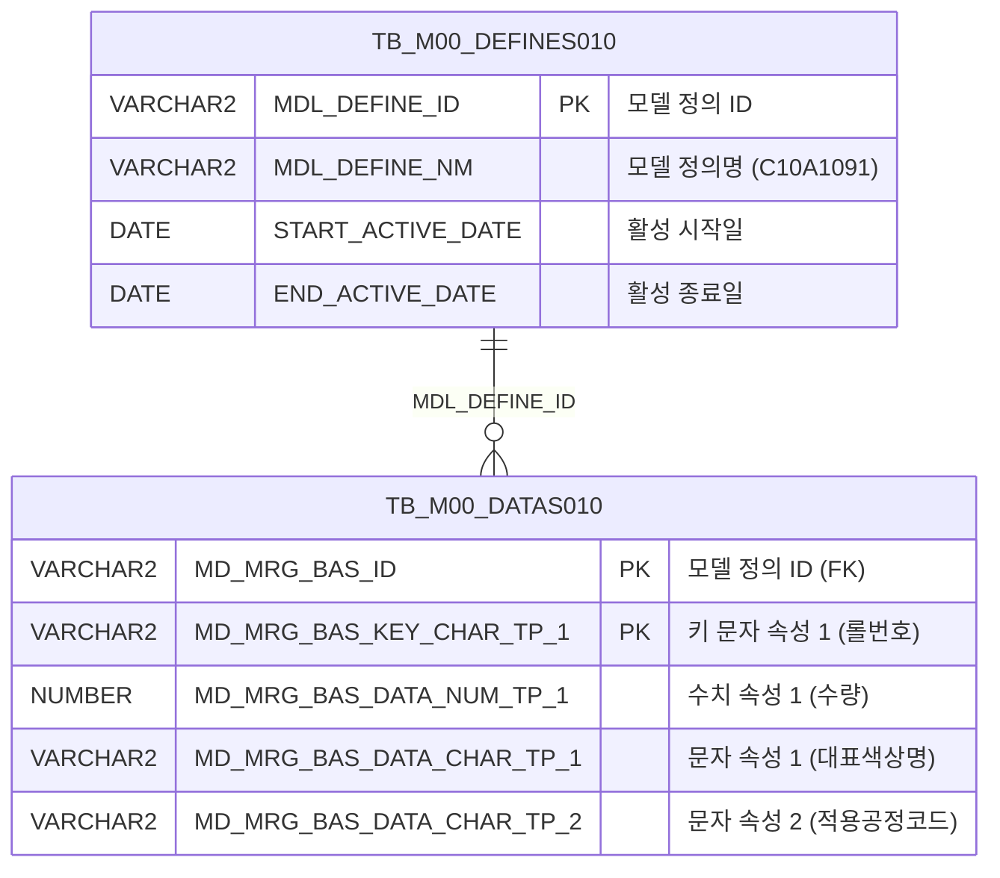

<h1 style="font-size: 40px; text-align: center; font-weight:
   bold; margin: 30px 0;">
  C107000020tab09 레거시 시스템 분석 종합 보고서
</h1>


# 1. 시스템 개요
- **서비스 ID**: C107000020tab09
- **업무명**: 칼라Print롤 관리 (탭09 - 프린트 롤 목록 조회)
- **분석 일시**: 2026-03-17 10:12 KST
- **전체 Activity 수**: 2개 (built-in only)
- **분석자**: Claude Opus 4.6 + Sonnet (UI)
- **분석 도구**: /analyze-service C107000020tab09
- **문서 버전**: 1.0

# 📊 비즈니스 프로세스 분석

## 시스템 목적

C107000020tab09 서비스는 **칼라Print롤 관리 화면(C107000020)의 탭09**로, 프린트 롤의 상세 정보를 조회하여 목록 형태로 표시하는 읽기 전용 조회 화면이다.

프린트 롤은 칼라강판(Color Coated Steel) 생산 공정에서 표면에 패턴을 인쇄하는 데 사용되는 핵심 소모품으로, 롤 번호별 색상, 패턴, 크기, 제작 업체, 입/반출 이력 등 19개 이상의 속성 정보를 M00 마스터 데이터 시스템(TB_M00_DATAS010)에서 조회하여 관리한다.

상위 탭 화면(C107000020)의 검색 폼(C107000020_Form_1)을 공유하여 조회 조건을 받으며, 탭 활성화 시 자동으로 데이터를 로드하는 구조이다. 데이터는 M00APUSER 스키마의 EAV(Entity-Attribute-Value) 패턴 테이블에서 모델 정의(C10A1091)를 기반으로 조회된다.

<!-- 워크플로우 다이어그램 생략: Custom Activity 0개, SELECT 쿼리만 사용, Router → 단일 조회 체인 -->

## 주요 유즈케이스

### UC-01: 프린트 롤 목록 조회
- **Actor**: 칼라강판 생산 관리자 / 프린트 공정 담당자
- **목적**: 현재 등록된 프린트 롤의 전체 목록을 조회하여 롤 번호, 패턴, 색상, 크기, 입출고 이력 등을 확인

- **전제조건**:
  - 사용자가 C107000020 (칼라Print롤 관리) 화면에 접속
  - M00APUSER 스키마의 TB_M00_DATAS010에 C10A1091 모델 데이터가 존재
  - TB_M00_DEFINES010에 'C10A1091' 모델 정의가 활성 상태(START_ACTIVE_DATE ≤ SYSDATE < END_ACTIVE_DATE)

- **주요 흐름**:
  1. 사용자가 C107000020 화면에서 tab09(프린트 롤 목록) 탭을 선택
  2. onXLEEvent 콜백이 트리거되어 onLoadGrid 함수 실행
  3. 상위 탭의 C107000020_Form_1 검색 폼 파라미터를 수집 (uiCommon.parameters4)
  4. handleDataProcess.do를 통해 C107000020tab09-service 호출
  5. PosDefaultRouter(분기)에서 '조회' Activity로 라우팅
  6. FormSearch(조회)가 mesdao를 통해 C107000020tab09.select 쿼리 실행
  7. TB_M00_DATAS010에서 C10A1091 모델 기준 프린트 롤 데이터를 롤 번호순으로 조회
  8. Grid_1에 25개 컬럼(표시 20개 + 숨김 5개) 데이터 바인딩

- **대체 흐름**:
  - 조회 결과 없음: 빈 그리드 표시, messagebox에 "조회된 데이터가 없습니다" 메시지
  - 모델 정의 비활성: DEFINES010 서브쿼리에서 0건 반환 → 전체 결과 0건

- **후행조건**:
  - 프린트 롤 목록이 Grid에 표시됨
  - 컨텍스트 메뉴를 통해 열 이동, 필터, 엑셀 내보내기 등 부가 기능 사용 가능

### UC-02: 그리드 컨텍스트 메뉴 활용
- **Actor**: 칼라강판 생산 관리자
- **목적**: 조회된 프린트 롤 목록에 대해 컬럼 재배치, 필터링, 엑셀 다운로드 등 그리드 조작 수행

- **전제조건**:
  - UC-01이 완료되어 Grid에 데이터가 표시된 상태

- **주요 흐름**:
  1. 사용자가 Grid 영역에서 우클릭하여 컨텍스트 메뉴 표시
  2. 메뉴 항목 선택:
     - **열 이동(move_grid)**: 컬럼 순서 재배치
     - **필터(filter_grid)**: 특정 조건으로 행 필터링
     - **편집가능(editable_grid)**: 그리드 편집 모드 토글
     - **엑셀 내보내기(excel_grid)**: 현재 그리드 데이터를 엑셀로 다운로드
  3. onGridContextMenuClick 핸들러가 선택된 메뉴 항목에 따라 해당 기능 실행

- **대체 흐름**:
  - 데이터 없는 상태에서 엑셀 내보내기: 빈 엑셀 파일 생성

- **후행조건**:
  - 선택한 기능이 Grid에 적용됨

### UC-03: 상위 탭 검색 조건 변경 후 재조회
- **Actor**: 칼라강판 생산 관리자
- **목적**: 상위 탭(C107000020)의 검색 폼에서 조건을 변경한 후 프린트 롤 데이터를 재조회

- **전제조건**:
  - C107000020 화면이 로드되어 있고, tab09이 활성 상태

- **주요 흐름**:
  1. 사용자가 C107000020_Form_1에서 검색 조건 변경
  2. 조회 버튼 클릭 또는 검색 이벤트 트리거
  3. find 함수가 C107000020_Form_1의 파라미터를 수집
  4. C107000020tab09_Grid_1에 변경된 조건으로 데이터 재로드

- **대체 흐름**:
  - 검색 조건 없이 조회: 전체 프린트 롤 목록 표시 (쿼리에 바인드 변수 없음)

- **후행조건**:
  - 갱신된 데이터가 Grid에 표시됨

---
## 비즈니스 로직 상세

### 1. EAV 패턴 기반 프린트 롤 데이터 매핑

- **목적**: M00 마스터 데이터의 범용(EAV) 테이블 컬럼을 프린트 롤 비즈니스 속성으로 매핑
- **처리 케이스**:

  **[케이스 1: 문자형 속성 매핑 (CHAR_TP_1 ~ CHAR_TP_19)]**
  ```
    조건: TB_M00_DATAS010의 MD_MRG_BAS_DATA_CHAR_TP_N 컬럼
    처리:
      CHAR_TP_1  → PRT_ROLL_NO (롤 번호, PK 역할)
      CHAR_TP_1  → RPV_CLR_NM (대표 색상명)
      CHAR_TP_2  → PRC_CD (적용 공정 코드)
      CHAR_TP_3  → PTN_NM (패턴명)
      CHAR_TP_4  → PRT_PTN_NM (인쇄 조각)
      CHAR_TP_5  → PRT_PTN_CD (프린트 패턴 코드)
      CHAR_TP_6  → PRT_ROLL_PTN_CD (롤 패턴 코드)
      CHAR_TP_7  → USG_NM (용도 구분)
      CHAR_TP_8  → EAR_USG_NM (초기 용도)
      CHAR_TP_9  → PRT_ROLL_CMP (제작 업체)
      CHAR_TP_10 → PRT_ROLL_MNF_DD (롤 제작일)
      CHAR_TP_11 → PRT_ROLL_WHS_DD (롤 입고일)
      CHAR_TP_12 → PRT_ROLL_CRYT_DD (롤 반출일)
      CHAR_TP_13 → PRT_BABY_ROLL (Baby Roll 여부)
      CHAR_TP_14 → WHS_CRYT_REA (입고/반출 사유)
      CHAR_TP_15 → FCT_NM (공장명, 숨김)
      CHAR_TP_16 → PRT_ROLL_CTD_LOC (보관 위치, 숨김)
      CHAR_TP_17 → PRT_ROLL_LOT_NO (롤 Lot No, 숨김)
      CHAR_TP_18 → PRT_ROLL_CHR_NM (담당자, 숨김)
      CHAR_TP_19 → PRT_ROLLTXT (비고, 숨김)
  ```

  **[케이스 2: 수치형 속성 매핑 (NUM_TP_1 ~ NUM_TP_5)]**
  ```
    조건: TB_M00_DATAS010의 MD_MRG_BAS_DATA_NUM_TP_N 컬럼
    처리:
      NUM_TP_1 → PRT_ROLL_QTY (수량)
      NUM_TP_2 → PRT_ROLL_DIA (롤 직경)
      NUM_TP_3 → PRT_ROLL_CRCM (롤 둘레)
      NUM_TP_4 → PRT_ROLL_WTH (롤 폭)
      NUM_TP_5 → PRT_ROLL_ENGR (Engraving Size)
  ```

### 2. 모델 정의 기반 데이터 필터링

- **목적**: TB_M00_DEFINES010의 모델 정의(C10A1091)가 활성 상태인 데이터만 조회
- **처리 케이스**:

  **[케이스 1: 활성 모델 필터]**
  ```
    조건: MDL_DEFINE_NM = 'C10A1091'
           AND START_ACTIVE_DATE <= SYSDATE
           AND SYSDATE < END_ACTIVE_DATE
    처리:
      1. TB_M00_DEFINES010에서 활성 모델 정의 ID(MDL_DEFINE_ID) 조회
      2. TB_M00_DATAS010의 MD_MRG_BAS_ID와 INNER JOIN
      3. 모델 정의에 속하는 프린트 롤 데이터만 반환
      4. MD_MRG_BAS_KEY_CHAR_TP_1(롤 번호) 기준 오름차순 정렬
  ```

---

# 💾 데이터 요구사항

## 핵심 테이블

### 1. TB_M00_DATAS010 (M00APUSER) - M00 마스터 범용 데이터 저장 테이블
| 컬럼명 | 타입 | PK | 설명 |
|--------|------|----|------|
| MD_MRG_BAS_ID | VARCHAR2 | ✅ | 모델 정의 ID (FK → TB_M00_DEFINES010) |
| MD_MRG_BAS_KEY_CHAR_TP_1 | VARCHAR2 | ✅ | 키 문자 속성 1 (→ PRT_ROLL_NO, 롤 번호) |
| MD_MRG_BAS_DATA_CHAR_TP_1 ~ 19 | VARCHAR2 | | 문자형 데이터 속성 1~19 |
| MD_MRG_BAS_DATA_NUM_TP_1 ~ 5 | NUMBER | | 수치형 데이터 속성 1~5 |

### 2. TB_M00_DEFINES010 (M00APUSER) - M00 마스터 모델 정의 테이블
| 컬럼명 | 타입 | PK | 설명 |
|--------|------|----|------|
| MDL_DEFINE_ID | VARCHAR2 | ✅ | 모델 정의 ID |
| MDL_DEFINE_NM | VARCHAR2 | | 모델 정의명 (예: 'C10A1091') |
| START_ACTIVE_DATE | DATE | | 활성 시작일 |
| END_ACTIVE_DATE | DATE | | 활성 종료일 |

## 데이터 플로우

### 1. 조회
```
[프린트 롤 목록 조회]
탭 활성화 (onXLEEvent → onLoadGrid)
→ C107000020tab09.select
  FROM M00APUSER.TB_M00_DATAS010 DATAS010
  INNER JOIN (SELECT MDL_DEFINE_ID
              FROM M00APUSER.TB_M00_DEFINES010
              WHERE MDL_DEFINE_NM = 'C10A1091'
                AND START_ACTIVE_DATE <= SYSDATE
                AND SYSDATE < END_ACTIVE_DATE) DEFINES010
    ON DEFINES010.MDL_DEFINE_ID = DATAS010.MD_MRG_BAS_ID
  ORDER BY MD_MRG_BAS_KEY_CHAR_TP_1
→ Grid_1에 프린트 롤 목록 표시 (25개 컬럼)
```

## SQL 일람표
| SQL 이름 | 쿼리 ID | 타입 | 출처 | 테이블 |
|---------|---------|-----|-------|-------|
| 프린트 롤 목록 조회 | C107000020tab09.select | SELECT | Service | TB_M00_DATAS010, TB_M00_DEFINES010 |

## ER 다이어그램 (핵심 관계)



관계 설명:
- **TB_M00_DEFINES010**이 중심 테이블로, 모델 정의(C10A1091)를 통해 데이터 구조를 정의
- **TB_M00_DATAS010**은 범용 데이터 저장소로, MDL_DEFINE_ID를 통해 특정 모델에 속하는 데이터를 분류
- 1:N 관계: 하나의 모델 정의에 여러 프린트 롤 데이터 레코드가 매핑

---

# 🖥️ 사용자 인터페이스 요구사항

## 화면 레이아웃 상세

### Layout 구조
```javascript
{
  type: "absolute",
  components: [
    {
      id: "C107000020tab09_Grid_1",
      type: "grid",
      position: { left: 0, top: 0, width: 976, height: 492 }
    },
    {
      id: "C107000020tab09_messagebox",
      type: "messagebox",
      position: { left: 0, top: 493, width: 976, height: 18 }
    },
    {
      id: "C107000020tab09_Form_1",
      type: "form",
      position: { left: 0, top: 450, width: 282, height: 30 },
      note: "빈 폼 - 상위 탭 C107000020_Form_1 공유 사용"
    }
  ]
}
```

## 입출력 요소

### Form 컴포넌트
**C107000020tab09_Form_1**
- 빈 Form (XML에 `<items/>` 만 존재)
- 실질적 검색 폼은 **상위 탭의 C107000020_Form_1을 공유** 사용
- find 이벤트 시 `uiCommon.parameters4('C107000020_Form_1', 'C107000020tab09_Grid_1', 'find')` 호출

### Grid 컴포넌트

**C107000020tab09_Grid_1 (프린트 롤 목록)**
- 편집 가능 여부: 아니오 (읽기 전용, 모든 컬럼 type: ro)
- Split: 0 (고정 컬럼 없음)
- 페이징: 있음 (rowCnt: 19)
- 컨텍스트 메뉴: 있음
- 스마트 렌더링: 있음
- 날짜 포맷: %Y-%m-%d
- 컬럼 너비 단위: % (colWidthUnit: %)
- 주요 컬럼 (25개 = 표시 20개 + 숨김 5개):

  **숨김 컬럼**:
  - FCT_NM: ro - 공장명 (숨김)
  - PRT_ROLL_CTD_LOC: ro - 보관위치 (숨김)
  - PRT_ROLL_LOT_NO: ro - 롤LotNo (숨김)
  - PRT_ROLL_CHR_NM: ro - 담당자 (숨김)
  - PRT_ROLLTXT: ro - 비고 (숨김)

  **기본 식별 정보**:
  - PRT_ROLL_NO: ro - ROLL-NO (10%, 중앙정렬) — 프린트 롤 고유 번호
  - PRT_ROLL_QTY: ro - 수량 (5%, 우측정렬)

  **색상/패턴 정보**:
  - RPV_CLR_NM: ro - 대표색상명 (15%, 좌측정렬)
  - PRC_CD: ro - 적용공정코드 (10%, 중앙정렬)
  - PTN_NM: ro - Pattern명 (15%, 좌측정렬)
  - PRT_PTN_NM: ro - 인쇄조각 (10%, 좌측정렬)
  - PRT_PTN_CD: ro - 프린트패턴코드 (10%, 중앙정렬)
  - PRT_ROLL_PTN_CD: ro - 롤패턴코드 (8%, 중앙정렬)

  **용도 정보**:
  - USG_NM: ro - 용도구분 (8%, 좌측정렬)
  - EAR_USG_NM: ro - 초기용도 (10%, 좌측정렬)

  **롤 물리 사양**:
  - PRT_ROLL_DIA: ro - Roll(직경) (7%, 우측정렬)
  - PRT_ROLL_CRCM: ro - Roll(둘레) (7%, 우측정렬)
  - PRT_ROLL_WTH: ro - Roll(폭) (7%, 우측정렬)
  - PRT_ROLL_ENGR: ro - EngravingSize (12%, 우측정렬)

  **제조/이력 정보**:
  - PRT_ROLL_CMP: ro - 제작업체 (10%, 좌측정렬)
  - PRT_ROLL_MNF_DD: ro - 롤제작일 (8%, 중앙정렬)
  - PRT_ROLL_WHS_DD: ro - 롤입고일 (8%, 중앙정렬)
  - PRT_ROLL_CRYT_DD: ro - 롤반출일 (8%, 중앙정렬)

  **기타**:
  - PRT_BABY_ROLL: ro - BabyRoll (15%, 좌측정렬)
  - WHS_CRYT_REA: ro - 입고/반출사유 (15%, 좌측정렬)

## 화면 동작 흐름

### 1. 화면 초기 로딩 (탭 활성화)
```
1. 사용자가 C107000020 화면에서 tab09 탭 선택
2. onXLEEvent 콜백 트리거
3. onLoadGrid() 함수 실행
4. uiCommon.parameters4('C107000020_Form_1', 'C107000020tab09_Grid_1', 'find') 호출
   - 상위 탭의 C107000020_Form_1 파라미터 수집
   - Grid 연결 정보 구성
5. handleDataProcess.do 요청 → C107000020tab09-service 호출
6. C107000020tab09.select 쿼리 실행
   - M00APUSER.TB_M00_DATAS010 + TB_M00_DEFINES010 JOIN
   - C10A1091 모델 기준 활성 데이터 조회
7. Grid_1에 결과 바인딩 (스마트 렌더링 적용)
8. findMessage() → messagebox에 appMsg 표시
9. 상태바 초기화
```

### 2. 검색 조건 변경 후 재조회
```
1. 사용자가 C107000020_Form_1 (상위 탭 공유 폼)에서 검색 조건 변경
2. 조회 버튼 클릭
3. find() 함수 실행
4. uiCommon.parameters4('C107000020_Form_1', 'C107000020tab09_Grid_1', 'find') 호출
5. handleDataProcess.do 요청 → C107000020tab09-service 호출
6. 변경된 조건으로 C107000020tab09.select 쿼리 재실행
7. Grid_1 데이터 갱신
8. findMessage() → messagebox에 결과 메시지 표시
```

### 3. 컨텍스트 메뉴 기능 사용
```
1. 사용자가 Grid_1에서 우클릭
2. 컨텍스트 메뉴 표시 (열 이동, 필터, 편집가능, 엑셀 내보내기)
3. 메뉴 항목 선택
4. onGridContextMenuClick(id) 핸들러 실행
5. 선택 항목에 따라:
   - move_grid: 컬럼 순서 변경 UI 표시
   - filter_grid: 필터 입력 UI 표시
   - editable_grid: 편집 모드 토글
   - excel_grid: 엑셀 파일 다운로드
```

## JavaScript 모듈

**C107000020tab09.jsp** (탭 화면 스크립트)
- find(): 프린트 롤 조회 (uiCommon.parameters4로 C107000020_Form_1 파라미터 구성 → handleDataProcess.do 호출)
- add(): 그리드에 새 행 추가
- remove(): 그리드에서 행 삭제
- copy(): 그리드 행 클립보드 복사
- undo(): 실행 취소
- redo(): 다시 실행
- onGridContextMenuClick(id, ind): 컨텍스트 메뉴 항목 처리 (move_grid, filter_grid, editable_grid, excel_grid)
- findMessage(): 그리드 로드 완료 후 messagebox에 appMsg 표시
- onLoadGrid(): 그리드 초기 로드 — onXLEEvent에서 호출, C107000020_Form_1 파라미터로 find 실행

## 주요 이벤트 핸들러

**onXLEEvent → onLoadGrid (탭 활성화 시 자동 로드)**
- 이벤트 타입: Grid XLE Event (탭 진입 시 자동 트리거)
- 처리 내용:
  1. C107000020_Form_1 (상위 탭 검색 폼)의 파라미터 수집
  2. uiCommon.parameters4 호출로 Grid 연결
  3. find 이벤트 실행하여 Grid 데이터 로드
  4. onXLE 이벤트 분리 처리

**onGridContextMenuClick (컨텍스트 메뉴)**
- 이벤트 타입: Grid Context Menu Click
- 처리 내용:
  1. 선택된 메뉴 항목 ID 확인
  2. move_grid → 컬럼 이동 기능
  3. filter_grid → 필터 기능
  4. editable_grid → 편집 가능 모드 토글
  5. excel_grid → 엑셀 내보내기

**findMessage (조회 완료 메시지)**
- 이벤트 타입: Grid Load Complete
- 처리 내용:
  1. 그리드 데이터 로드 완료 감지
  2. appMsg에서 메시지 추출
  3. C107000020tab09_messagebox에 결과 메시지 표시

---

# 📌 특이사항 및 주의사항

## 1. EAV(Entity-Attribute-Value) 패턴 사용
- **범용 테이블 매핑**: TB_M00_DATAS010의 `MD_MRG_BAS_DATA_CHAR_TP_1~19`, `MD_MRG_BAS_DATA_NUM_TP_1~5` 범용 컬럼을 프린트 롤 비즈니스 속성으로 매핑하는 EAV 패턴을 사용. 컬럼명만으로는 데이터 의미를 파악할 수 없으며, 모델 정의(C10A1091)와의 연계가 필수
- **유지보수 리스크**: 컬럼 매핑이 SQL 쿼리 내 alias로만 관리되므로, 매핑 변경 시 쿼리 수정 필요. VI_M00_C10A1091 뷰가 동일한 매핑을 제공할 수 있으나 이 쿼리에서는 직접 테이블 조회

## 2. 상위 탭 검색 폼 공유 구조
- **C107000020_Form_1 의존**: 자체 Form(C107000020tab09_Form_1)은 빈 `<items/>`로, 실질적 검색 조건은 상위 탭(C107000020)의 C107000020_Form_1을 공유
- **교차 탭 의존성**: 상위 탭의 폼 구조가 변경되면 이 탭의 조회 기능에 영향을 줌
- **uiCommon.parameters4 사용**: 일반적인 `uiCommon.parameters`가 아닌 `parameters4`를 사용하여 4개 파라미터(폼ID, 그리드ID, 이벤트명)를 전달하는 특수 패턴

## 3. 바인드 변수 없는 전체 조회 쿼리
- **무조건 전체 조회**: SQL 쿼리에 바인드 변수(:paramName)가 없어 조건 필터링 없이 모델 정의에 해당하는 **전체 프린트 롤 데이터**를 매번 조회
- **성능 고려**: 데이터량이 증가하면 조회 성능에 영향을 줄 수 있으나, 페이징(rowCnt: 19)과 스마트 렌더링으로 UI 렌더링 부하는 완화

## 4. M00APUSER 스키마 직접 참조
- **스키마 하드코딩**: SQL에서 `M00APUSER.TB_M00_DATAS010`, `M00APUSER.TB_M00_DEFINES010`으로 스키마를 직접 명시. DAO 빈(mesdao)은 MESAPUSER 스키마이므로, 크로스 스키마 접근을 위해 스키마를 명시적으로 지정
- **뷰 미사용**: Grid XML에서는 참조 테이블로 `VI_M00_C10A1091` 뷰를 명시하고 있으나, 실제 쿼리에서는 기본 테이블을 직접 조회

## 5. 모델 정의 활성 기간 의존
- **시간 기반 필터**: `START_ACTIVE_DATE <= SYSDATE AND SYSDATE < END_ACTIVE_DATE` 조건으로 활성 모델 정의만 조회. 모델 정의의 활성 기간이 만료되면 해당 모델의 모든 프린트 롤 데이터가 조회 불가

---

# 📚 참고 문서

- **Query SQL**: `src/query/C107000020tab09-query.glue_sql`
- **Service XML**: `src/service/C107000020tab09-service.xml`
- **JSP**: `WebContents/C107000020tab09.jsp`
- **Grid XML**: `WebContents/header/kr/C107000020tab09/C107000020tab09_Grid_1.xml`
- **Form XML**: `WebContents/header/kr/C107000020tab09/C107000020tab09_Form_1.xml`
