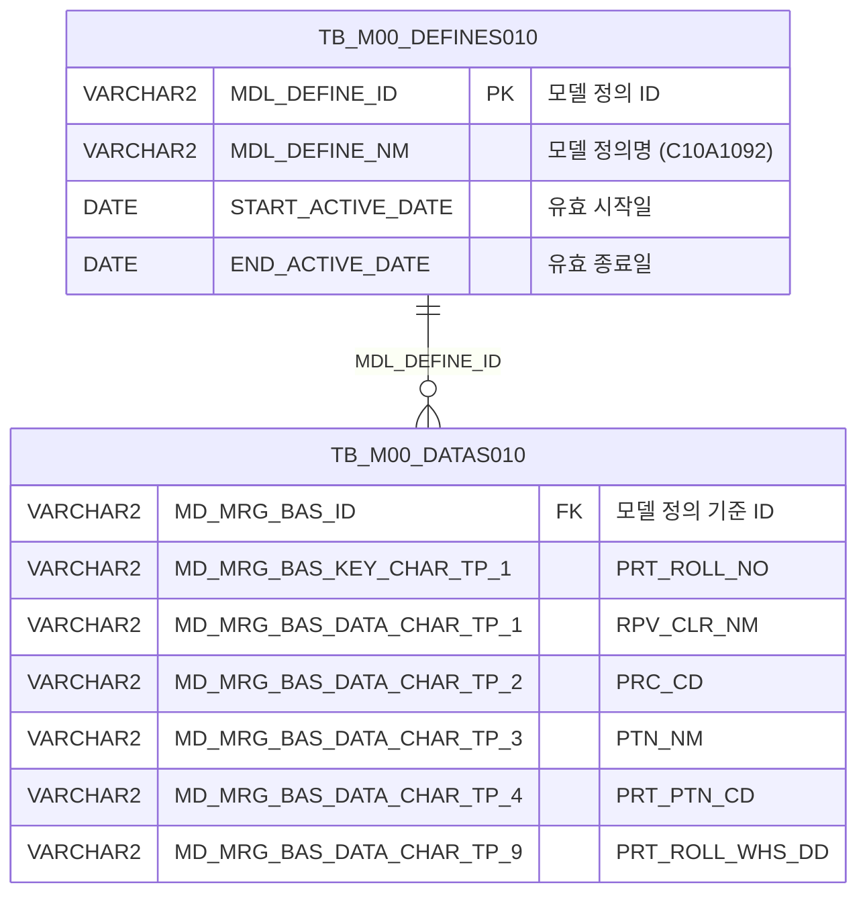

<h1 style="font-size: 40px; text-align: center; font-weight:
   bold; margin: 30px 0;">
  C107000020tab10 레거시 시스템 분석 종합 보고서
</h1>


# 1. 시스템 개요
- **서비스 ID**: C107000020tab10
- **업무명**: Uni-Tex롤 관리 (프린트 롤 조회 탭)
- **분석 일시**: 2026-03-17 10:18 KST
- **전체 Activity 수**: 2개 (built-in: 2개, custom: 0개)
- **분석자**: Claude Opus 4.6 / Sonnet 4.6
- **분석 도구**: /analyze-service C107000020tab10
- **문서 버전**: 1.0

# 📊 비즈니스 프로세스 분석

## 시스템 목적

C107000020tab10은 C10(컬러강판) 모듈의 Uni-Tex롤 관리 화면(C107000020)의 탭10 콘텐츠로, 프린트 롤의 기본 정보를 조회하는 읽기 전용 화면이다.

마스터 데이터 관리 체계(M00APUSER 스키마)의 범용 데이터 저장소(TB_M00_DATAS010)에서 모델 정의 'C10A1092'에 해당하는 프린트 롤 데이터를 조회하여, 롤번호·대표색상명·적용공정·Pattern명·PatternCode·롤입고일 정보를 그리드에 표시한다. 상위 탭의 검색 폼(C107000020_Form_1)과 파라미터를 공유하며, 탭 활성화 시 자동으로 조회를 수행한다.

## 주요 유즈케이스

### UC-01: 프린트 롤 목록 조회
- **Actor**: C10 생산관리 담당자
- **목적**: Uni-Tex 공정에 사용되는 프린트 롤의 기본 정보(롤번호, 색상, 공정, 패턴 등)를 조회하여 롤 현황을 파악

- **전제조건**:
  - 사용자가 MES 시스템에 로그인되어 있음
  - C107000020(Uni-Tex롤 관리) 화면에 접근 가능
  - TB_M00_DATAS010에 모델 정의 C10A1092 기반 프린트 롤 데이터가 등록되어 있음

- **주요 흐름**:
  1. 사용자가 C107000020 화면에서 tab10 탭을 선택
  2. onXLE 이벤트에 의해 상위 Form(C107000020_Form_1) 파라미터 기반 자동 조회 실행
  3. C107000020tab10.select 쿼리 호출 → TB_M00_DATAS010에서 C10A1092 모델 데이터 조회
  4. Grid_1에 프린트 롤 목록 표시 (ROLL-NO, 대표색상명, 적용공정, Pattern명, PatternCode, 롤입고일)

- **대체 흐름**:
  - 조회 결과가 없는 경우: 빈 그리드 표시
  - 상위 탭 Form 조건 변경 후 재조회 시: 변경된 파라미터로 Grid 데이터 갱신

- **후행조건**:
  - 프린트 롤 목록이 Grid에 표시됨
  - 사용자가 컨텍스트 메뉴를 통해 엑셀 다운로드, 필터링 등 부가 기능 사용 가능

### UC-02: 엑셀 다운로드
- **Actor**: C10 생산관리 담당자
- **목적**: 조회된 프린트 롤 목록을 엑셀 파일로 다운로드하여 오프라인 분석 또는 보고용으로 활용

- **전제조건**:
  - Grid에 조회 데이터가 표시되어 있음

- **주요 흐름**:
  1. 그리드 영역에서 마우스 우클릭하여 컨텍스트 메뉴 표시
  2. "엑셀 다운로드" 메뉴 항목 클릭
  3. toExcel 함수 호출 → gridexcel URL로 Grid 데이터 전송
  4. 엑셀 파일 다운로드 완료

- **대체 흐름**:
  - Grid 데이터가 없는 경우: 빈 엑셀 파일 다운로드

- **후행조건**:
  - 엑셀 파일이 사용자 로컬에 저장됨

### UC-03: 그리드 컬럼 필터링
- **Actor**: C10 생산관리 담당자
- **목적**: 조회된 프린트 롤 목록에서 특정 조건(색상, 공정, 패턴 등)으로 필터링하여 원하는 데이터만 확인

- **전제조건**:
  - Grid에 조회 데이터가 표시되어 있음

- **주요 흐름**:
  1. 그리드 영역에서 마우스 우클릭하여 컨텍스트 메뉴 표시
  2. "헤더 필터" 메뉴 항목 클릭
  3. enableHeaderMenu 호출 → 각 컬럼 헤더에 필터 입력 영역 표시
  4. 사용자가 원하는 컬럼에 필터값 입력
  5. 입력 즉시 Grid 데이터 클라이언트 측 필터링 수행

- **대체 흐름**:
  - 필터 결과가 없는 경우: 빈 그리드 표시
  - 필터 해제 시: 전체 데이터 다시 표시

- **후행조건**:
  - 필터 조건에 맞는 데이터만 Grid에 표시됨

---
## 비즈니스 로직 상세

### 1. 범용 데이터 저장소 기반 프린트 롤 조회

- **목적**: M00 마스터 스키마의 범용 데이터 저장소(TB_M00_DATAS010)에서 모델 정의(C10A1092)를 기반으로 프린트 롤 정보를 추출
- **처리 케이스**:

  **[케이스 1: 모델 정의 기반 데이터 필터링]**
  ```
    조건: TB_M00_DEFINES010.MDL_DEFINE_NM = 'C10A1092' AND 현재 날짜가 유효 기간 내
    처리:
      1. TB_M00_DEFINES010에서 MDL_DEFINE_NM='C10A1092' 조건으로 유효한 모델 정의 ID 조회
      2. START_ACTIVE_DATE <= SYSDATE < END_ACTIVE_DATE 조건으로 활성 상태인 정의만 필터
      3. 조회된 MDL_DEFINE_ID를 기준으로 TB_M00_DATAS010의 데이터 조회
      4. DEFINES010.MDL_DEFINE_ID = DATAS010.MD_MRG_BAS_ID 조인 조건 적용
  ```

  **[케이스 2: 범용 컬럼 매핑]**
  ```
    조건: TB_M00_DATAS010의 범용 CHAR 컬럼을 프린트 롤 도메인 필드에 매핑
    처리:
      1. MD_MRG_BAS_KEY_CHAR_TP_1 → PRT_ROLL_NO (프린트 롤 번호)
      2. MD_MRG_BAS_DATA_CHAR_TP_1 → RPV_CLR_NM (대표 색상명)
      3. MD_MRG_BAS_DATA_CHAR_TP_2 → PRC_CD (적용 공정 코드)
      4. MD_MRG_BAS_DATA_CHAR_TP_3 → PTN_NM (패턴명)
      5. MD_MRG_BAS_DATA_CHAR_TP_4 → PRT_PTN_CD (프린트 패턴 코드)
      6. MD_MRG_BAS_DATA_CHAR_TP_9 → PRT_ROLL_WHS_DD (프린트 롤 입고일)
  ```

---

# 💾 데이터 요구사항

## 핵심 테이블

### 1. TB_M00_DATAS010 - (범용 데이터 저장소)
| 컬럼명 | 타입 | PK | 설명 |
|--------|------|----|-----|
| MD_MRG_BAS_ID | VARCHAR2 | | 모델 정의 기준 ID (DEFINES010 FK) |
| MD_MRG_BAS_KEY_CHAR_TP_1 | VARCHAR2 | | 키 문자형 1 → PRT_ROLL_NO (프린트 롤 번호) |
| MD_MRG_BAS_DATA_CHAR_TP_1 | VARCHAR2 | | 데이터 문자형 1 → RPV_CLR_NM (대표색상명) |
| MD_MRG_BAS_DATA_CHAR_TP_2 | VARCHAR2 | | 데이터 문자형 2 → PRC_CD (적용공정) |
| MD_MRG_BAS_DATA_CHAR_TP_3 | VARCHAR2 | | 데이터 문자형 3 → PTN_NM (패턴명) |
| MD_MRG_BAS_DATA_CHAR_TP_4 | VARCHAR2 | | 데이터 문자형 4 → PRT_PTN_CD (프린트 패턴 코드) |
| MD_MRG_BAS_DATA_CHAR_TP_9 | VARCHAR2 | | 데이터 문자형 9 → PRT_ROLL_WHS_DD (롤 입고일) |

### 2. TB_M00_DEFINES010 - (모델 정의 마스터)
| 컬럼명 | 타입 | PK | 설명 |
|--------|------|----|-----|
| MDL_DEFINE_ID | VARCHAR2 | ✅ | 모델 정의 ID (PK) |
| MDL_DEFINE_NM | VARCHAR2 | | 모델 정의명 (이 서비스에서는 'C10A1092') |
| START_ACTIVE_DATE | DATE | | 유효 시작일 |
| END_ACTIVE_DATE | DATE | | 유효 종료일 |

## 데이터 플로우

### 1. 조회

```
[프린트 롤 목록 조회]
탭 활성화 (onXLE 이벤트) 또는 조회 버튼 클릭
→ C107000020tab10.select
  FROM M00APUSER.TB_M00_DATAS010 DATAS010
  INNER JOIN (SELECT MDL_DEFINE_ID FROM M00APUSER.TB_M00_DEFINES010
              WHERE MDL_DEFINE_NM='C10A1092'
              AND START_ACTIVE_DATE <= SYSDATE
              AND SYSDATE < END_ACTIVE_DATE) DEFINES010
    ON DEFINES010.MDL_DEFINE_ID = DATAS010.MD_MRG_BAS_ID
→ Grid_1에 프린트 롤 목록 표시
  (PRT_ROLL_NO, RPV_CLR_NM, PRC_CD, PTN_NM, PRT_PTN_CD, PRT_ROLL_WHS_DD)
```

## SQL 일람표

| SQL 이름 | 쿼리 ID | 타입 | 출처 | 테이블 |
|---------|---------|-----|-------|-------|
| 프린트 롤 조회 | C107000020tab10.select | SELECT | Service | TB_M00_DATAS010, TB_M00_DEFINES010 |

## ER 다이어그램 (핵심 관계)



관계 설명:
- TB_M00_DEFINES010이 모델 정의 마스터로, MDL_DEFINE_ID를 통해 TB_M00_DATAS010의 데이터를 그룹핑
- TB_M00_DATAS010은 범용 데이터 저장소로, 모델 정의별로 서로 다른 도메인 데이터를 저장 (이 서비스에서는 C10A1092 = 프린트 롤)

---

# 🖥️ 사용자 인터페이스 요구사항

## 화면 레이아웃 상세

### Layout 구조
```javascript
{
  // 레이아웃 없이 div 기반 직접 배치 (탭 콘텐츠)
  components: [
    {
      id: "C107000020tab10_Grid_1",
      type: "grid",
      position: { left: 0, top: 0, width: 976, height: 492 }
    },
    {
      id: "C107000020tab10_messagebox",
      type: "messagebox",
      position: { left: 0, top: 493, width: 976, height: 18 }
    },
    {
      id: "C107000020tab10_Form_1",
      type: "form",  // 빈 Form (필드 없음, 상위 탭 Form 참조)
      position: { left: 0, top: 450, width: 282, height: 30 }
    }
  ]
}
```

## 입출력 요소

### Form 컴포넌트
**C107000020tab10_Form_1**
- 빈 Form (필드 없음) - 조회 파라미터는 상위 탭의 C107000020_Form_1을 공유하여 사용

### Grid 컴포넌트

**C107000020tab10_Grid_1 (프린트 롤 목록)**
- 편집 가능 여부: 아니오 (전체 읽기 전용, 모든 컬럼 type=ro)
- Split: 없음 (고정 컬럼 0개)
- 페이지네이션: 20건 단위
- 스마트 렌더링: 활성
- 멀티 선택: 활성
- 주요 컬럼 (6개):

  **기본 정보**:
  - PRT_ROLL_NO: ro - ROLL-NO (10%, 중앙정렬, str 정렬)
  - RPV_CLR_NM: ro - 대표색상명 (20%, 좌측정렬, str 정렬)

  **공정/패턴 정보**:
  - PRC_CD: ro - 적용공정 (10%, 중앙정렬, str 정렬)
  - PTN_NM: ro - Pattern명 (20%, 좌측정렬, str 정렬)
  - PRT_PTN_CD: ro - PatternCode (12%, 중앙정렬, str 정렬)

  **입고 정보**:
  - PRT_ROLL_WHS_DD: ro - 롤입고일 (10%, 중앙정렬, str 정렬)

## 화면 동작 흐름

### 1. 화면 초기 로딩 (탭 활성화)
```
1. 상위 화면(C107000020)에서 tab10 탭 클릭
2. C107000020tab10.jsp 로드
3. ui.initializeDHTMLX() 호출 → Grid, Form, Messagebox 컴포넌트 초기화
4. Grid_1 onXLE(XML Load End) 이벤트 발생
5. onLoadGrid 핸들러 실행:
   - uiCommon.parameters4('C107000020_Form_1','C107000020tab10_Grid_1','find') 호출
   - 상위 탭 Form_1 파라미터 기반 자동 조회 수행
6. onXLE 이벤트 해제 (detachEvent) → 초기 로드 후 무한 반복 방지
7. Grid_1에 프린트 롤 목록 표시
```

### 2. 조회 버튼 클릭 (수동 조회)
```
1. 상위 탭(C107000020)의 Form_1에서 조건 입력/변경
2. 조회(find) 버튼 클릭
3. find 이벤트 핸들러 실행:
   - uiCommon.parameters4('C107000020_Form_1','C107000020tab10_Grid_1', customparam + eventName) 호출
   - 상위 탭 Form_1 파라미터 + 커스텀 파라미터 + 이벤트명 조합
4. handleDataProcess.do URL로 C107000020tab10-service 호출
5. C107000020tab10.select 쿼리 실행 (mesdao)
6. Grid_1 데이터 갱신
7. findMessage 핸들러 → messagebox에 조회 결과 메시지 표시
```

### 3. 컨텍스트 메뉴 기능 사용
```
1. Grid_1 영역에서 마우스 우클릭
2. 컨텍스트 메뉴 표시 (4개 항목)
3. 메뉴 항목 선택:
   - move_grid: enableColumnMove() → 컬럼 드래그 이동 ON/OFF 토글
   - filter_grid: enableHeaderMenu() → 헤더 필터 활성화
   - editable_grid: setEditable() → 편집 모드 ON/OFF 토글
   - excel_grid: toExcel('gridexcel') → 엑셀 파일 다운로드
```

## JavaScript 모듈

**C107000020tab10.jsp (인라인 스크립트)**
- find(): 조회 실행 (uiCommon.parameters4로 상위 Form_1 파라미터 구성 → Grid_1 데이터 로드)
- add(): 신규 행 추가 (addRow)
- remove(): 행 삭제 (removeRow)
- copy(): 행 클립보드 복사 (copyRowContent)
- undo(): 실행 취소
- redo(): 다시 실행
- onGridContextMenuClick(id, zoneId, cas): 컨텍스트 메뉴 이벤트 처리 (move_grid/filter_grid/editable_grid/excel_grid)
- findMessage(obj, state, data): Grid 행 이벤트 시 messagebox에 메시지 표시 (getUserData appMsg)
- onLoadGrid(): onXLE 이벤트 핸들러 → 초기 자동 조회 수행 후 이벤트 해제

## 주요 이벤트 핸들러

**onLoadGrid (초기 자동 조회)**
- 이벤트 타입: onXLE (XML Load End)
- 처리 내용:
  1. uiCommon.parameters4('C107000020_Form_1','C107000020tab10_Grid_1','find') 호출
  2. 상위 탭 Form_1 파라미터로 Grid_1 데이터 로드
  3. onXLE 이벤트 해제 (detachEvent) → 1회만 실행

**find (조회 버튼)**
- 이벤트 타입: Form find 버튼 클릭
- 처리 내용:
  1. uiCommon.parameters4로 상위 탭 Form_1 + Grid_1 파라미터 구성
  2. customparam + eventName 추가
  3. Grid_1 데이터 갱신

**onGridContextMenuClick (우클릭 메뉴)**
- 이벤트 타입: Grid 컨텍스트 메뉴 클릭
- 처리 내용:
  1. 선택된 메뉴 ID에 따라 분기
  2. move_grid → 컬럼 이동 토글
  3. filter_grid → 헤더 필터 활성화
  4. editable_grid → 편집 모드 토글
  5. excel_grid → 엑셀 다운로드

---

# 📌 특이사항 및 주의사항

## 1. 범용 데이터 저장소(EAV) 패턴 사용
- TB_M00_DATAS010은 범용 컬럼(MD_MRG_BAS_KEY_CHAR_TP_1 ~ MD_MRG_BAS_DATA_CHAR_TP_9)에 도메인별 데이터를 저장하는 EAV(Entity-Attribute-Value) 유사 패턴을 사용한다. 컬럼명만으로는 실제 의미를 알 수 없으며, 모델 정의(C10A1092)와의 매핑 관계를 이해해야 한다. 향후 시스템 전환 시 도메인별 전용 테이블 설계가 필요하다.

## 2. 모델 정의명 불일치
- UI 분석에서 Grid 컬럼 참조 테이블이 `VI_M00_C10A1091`로 표시되나, 실제 SQL 쿼리에서는 TB_M00_DEFINES010의 MDL_DEFINE_NM='C10A1092'를 사용한다. 모델 정의명 C10A1091과 C10A1092의 관계를 확인할 필요가 있다 (뷰 정의가 다른 모델을 참조할 가능성).

## 3. 상위 탭 Form 파라미터 의존성
- 이 탭은 자체 조회 Form이 없고(Form_1은 빈 구조), 상위 화면(C107000020)의 C107000020_Form_1 파라미터에 의존한다. `uiCommon.parameters4` 함수로 상위 Form 파라미터를 직접 참조하는 탭 간 공유 패턴을 사용하며, 상위 Form이 없으면 조회가 동작하지 않는다.

## 4. 초기 로드 이벤트 1회 실행 패턴
- onXLE(XML Load End) 이벤트로 초기 자동 조회를 수행한 후 즉시 detachEvent로 이벤트를 해제한다. 이는 Grid XML 로드 완료 시마다 조회가 반복 실행되는 것을 방지하기 위한 패턴이다. 이벤트 해제 시점이 적절하지 않으면 초기 조회가 누락되거나 무한 반복될 수 있다.

## 5. 모델 정의 유효기간 의존성
- SQL 쿼리에서 `START_ACTIVE_DATE <= SYSDATE AND SYSDATE < END_ACTIVE_DATE` 조건으로 유효 기간을 체크한다. 모델 정의의 유효 기간이 만료되면 전체 프린트 롤 데이터가 조회되지 않으므로, 모델 정의 관리에 주의가 필요하다.

---

# 📚 참고 문서

- **Query SQL**: `src/query/C107000020tab10-query.glue_sql`
- **Service XML**: `src/service/C107000020tab10-service.xml`
- **JSP**: `WebContents/C107000020tab10.jsp`
- **Grid XML**: `WebContents/header/kr/C107000020tab10/C107000020tab10_Grid_1.xml`
- **Form XML**: `WebContents/header/kr/C107000020tab10/C107000020tab10_Form_1.xml`
