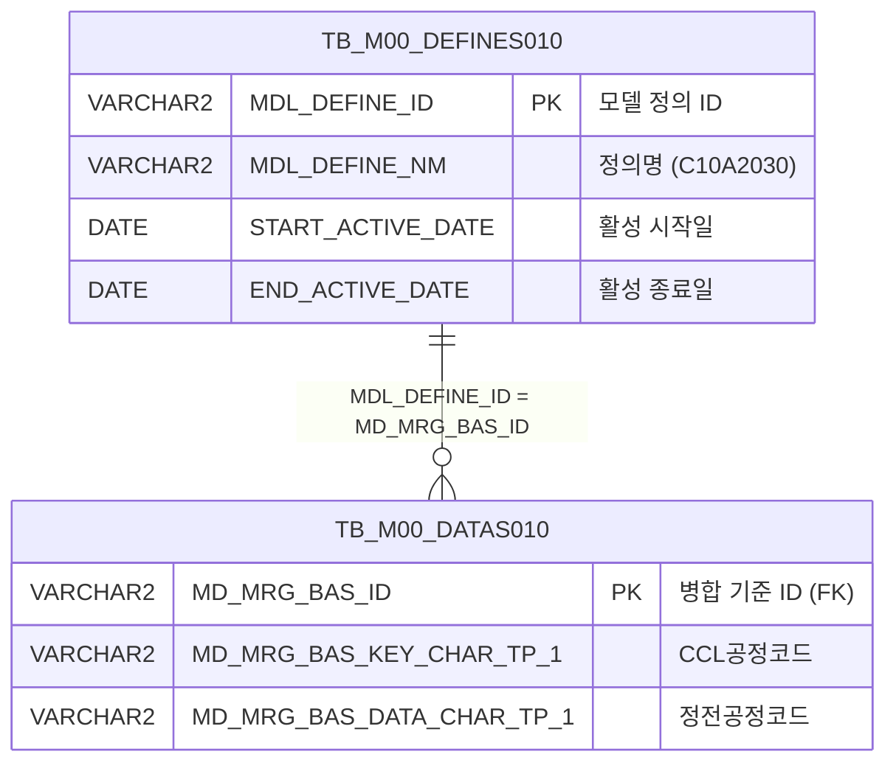

<h1 style="font-size: 40px; text-align: center; font-weight:
   bold; margin: 30px 0;">
  C107000020tab11 레거시 시스템 분석 종합 보고서
</h1>


# 1. 시스템 개요
- **서비스 ID**: C107000020tab11
- **업무명**: 칼라정전라인결정기준 관리
- **분석 일시**: 2026-03-17 (KST)
- **전체 Activity 수**: 2개 (Built-in 2개, Custom 0개)
- **분석자**: Claude Opus 4.6 + Sonnet (UI/SQL)
- **분석 도구**: /analyze-service C107000020tab11
- **문서 버전**: 1.0

# 📊 비즈니스 프로세스 분석

## 시스템 목적

C107000020tab11은 **칼라정전라인결정기준**을 관리하는 탭 화면으로, C107000020 (칼라 기준정보 관리) 화면의 하위 탭(tab11)으로 동작한다. 상위 탭의 조회 조건 없이 화면 진입 시 자동으로 전체 데이터를 조회하는 읽기 전용 마스터 데이터 조회 화면이다.

이 화면은 M00APUSER 스키마의 마스터 데이터 관리 테이블(DATAS010/DEFINES010)에서 **C10A2030** 정의명으로 등록된 CCL공정코드-정전공정코드 간 매핑 기준을 조회한다. CCL(Color Coating Line) 공정에서 어떤 공정코드가 어떤 정전(SHL) 공정코드로 결정되는지의 기준을 보여주며, 칼라강판 생산 공정의 라인 결정에 활용되는 기초 데이터를 제공한다.

단순 조회 전용 서비스로, Custom Activity 없이 Built-in FormSearch Activity와 PosDefaultRouter만으로 구성되어 있다.

<!-- 워크플로우 다이어그램 생략: Custom Activity 0개, SELECT 쿼리만 사용, Router → 단일 조회 Activity 구성 -->

## 주요 유즈케이스

### UC-01: 칼라정전라인결정기준 자동 조회
- **Actor**: 칼라(CCL) 공정 관리자
- **목적**: CCL공정코드와 정전(SHL)공정코드 간 매핑 기준을 조회하여 라인 결정 기준을 확인

- **전제조건**:
  - 사용자가 C107000020 (칼라 기준정보 관리) 화면에 진입한 상태
  - tab11 (칼라정전라인결정기준) 탭을 선택
  - M00APUSER 스키마에 C10A2030 정의 데이터가 등록되어 있음

- **주요 흐름**:
  1. 탭 진입 시 화면 자동 초기화 (`ui.initializeDHTMLX()`)
  2. Grid XLE 이벤트 발생 → `onLoadGrid()` 호출
  3. 상위 탭의 `C107000020_Form_1` 파라미터를 참조하여 `uiCommon.parameters4()` 호출
  4. `C107000020tab11-service` 서비스 호출 → `C107000020tab11.select` 쿼리 실행
  5. TB_M00_DEFINES010에서 C10A2030 정의 ID 조회 (활성 기간 내)
  6. TB_M00_DATAS010에서 해당 정의 ID의 CCL공정코드(PROC_CD_CCL), 정전공정코드(PROC_CD_SHL) 조회
  7. Grid에 조회 결과 표시

- **대체 흐름**:
  - C10A2030 정의가 비활성 기간인 경우: 데이터 없음 (빈 Grid 표시)
  - 조회 결과 없음: "조회된 데이터가 없습니다" 메시지

- **후행조건**:
  - Grid에 CCL공정코드-정전공정코드 매핑 목록이 표시됨

### UC-02: 컨텍스트 메뉴를 통한 Grid 조작
- **Actor**: 칼라(CCL) 공정 관리자
- **목적**: 그리드 데이터를 필터링, 정렬, 엑셀 내보내기 등 다양한 방식으로 조작

- **전제조건**:
  - Grid에 데이터가 조회되어 있음

- **주요 흐름**:
  1. Grid 영역에서 마우스 우클릭 → 컨텍스트 메뉴 표시
  2. 메뉴 항목 선택:
     - **컬럼 이동(move_grid)**: 체크 시 드래그앤드롭으로 컬럼 순서 변경 활성화
     - **필터(filter_grid)**: 체크 시 헤더 필터 메뉴 활성화
     - **편집모드(editable_grid)**: 체크 시 셀 편집 가능 상태로 전환 / 해제 시 읽기전용 복원
     - **엑셀 내보내기(excel_grid)**: Grid 데이터를 엑셀 파일로 다운로드

- **대체 흐름**:
  - 편집모드에서 데이터 수정 후 별도 저장 서비스가 없으므로 화면 새로고침 시 원래 데이터로 복원

- **후행조건**:
  - 선택한 조작 옵션이 Grid에 적용됨

### UC-03: 수동 재조회
- **Actor**: 칼라(CCL) 공정 관리자
- **목적**: 데이터 변경 후 최신 기준 데이터를 재조회

- **전제조건**:
  - 화면이 로드된 상태

- **주요 흐름**:
  1. 상위 탭의 조회 버튼 클릭 (또는 폼의 find 이벤트 트리거)
  2. `find()` 함수 실행
  3. `uiCommon.parameters4('C107000020_Form_1', 'C107000020tab11_Grid_1', 'find')` 호출
  4. Grid 데이터 재로드

- **대체 흐름**:
  - 조회 결과 없음: 빈 Grid 표시

- **후행조건**:
  - 최신 데이터가 Grid에 표시됨

---
## 비즈니스 로직 상세

### 1. M00 마스터 데이터 기반 코드 매핑 조회

- **목적**: MDL(Model Definition Layer) 구조의 마스터 데이터 관리 체계에서 C10A2030 정의명으로 등록된 CCL공정-정전공정 매핑 기준을 조회
- **처리 케이스**:

  **[케이스 1: 정의-데이터 조인 조회]**
  ```
    조건: MDL_DEFINE_NM = 'C10A2030' AND START_ACTIVE_DATE <= SYSDATE AND SYSDATE < END_ACTIVE_DATE
    처리:
      1. TB_M00_DEFINES010에서 정의명 'C10A2030'이고 현재 활성 기간 내인 MDL_DEFINE_ID 조회
      2. TB_M00_DATAS010에서 MD_MRG_BAS_ID가 해당 MDL_DEFINE_ID와 일치하는 데이터 행 조회
      3. MD_MRG_BAS_KEY_CHAR_TP_1 → PROC_CD_CCL (CCL공정코드) 매핑
      4. MD_MRG_BAS_DATA_CHAR_TP_1 → PROC_CD_SHL (정전공정코드) 매핑
  ```

  **[케이스 2: 비활성 정의]**
  ```
    조건: C10A2030 정의가 활성 기간(START_ACTIVE_DATE ~ END_ACTIVE_DATE) 밖인 경우
    처리:
      1. DEFINES010 서브쿼리 결과 0건
      2. 조인 결과 0건 → 빈 결과셋 반환
  ```

- **데이터 매핑 구조**:
  ```
  TB_M00_DEFINES010 (정의 테이블)
    MDL_DEFINE_ID (PK) ←→ TB_M00_DATAS010.MD_MRG_BAS_ID
    MDL_DEFINE_NM = 'C10A2030' (칼라정전라인결정기준 식별자)

  TB_M00_DATAS010 (데이터 테이블)
    MD_MRG_BAS_KEY_CHAR_TP_1 = CCL공정코드 (조건)
    MD_MRG_BAS_DATA_CHAR_TP_1 = 정전공정코드 (결과)
  ```

---

# 💾 데이터 요구사항

## 핵심 테이블

### 1. TB_M00_DEFINES010 - (마스터 데이터 정의 테이블)
| 컬럼명 | 타입 | PK | 설명 |
|--------|------|----|-----|
| MDL_DEFINE_ID | VARCHAR2 | ✅ | 모델 정의 ID (PK) |
| MDL_DEFINE_NM | VARCHAR2 |  | 모델 정의명 (C10A2030 등) |
| START_ACTIVE_DATE | DATE |  | 활성 시작일 |
| END_ACTIVE_DATE | DATE |  | 활성 종료일 |

### 2. TB_M00_DATAS010 - (마스터 데이터 저장 테이블)
| 컬럼명 | 타입 | PK | 설명 |
|--------|------|----|-----|
| MD_MRG_BAS_ID | VARCHAR2 | ✅ | 병합 기준 ID (DEFINES010.MDL_DEFINE_ID 참조) |
| MD_MRG_BAS_KEY_CHAR_TP_1 | VARCHAR2 |  | 키 문자 타입 1 (PROC_CD_CCL로 사용) |
| MD_MRG_BAS_DATA_CHAR_TP_1 | VARCHAR2 |  | 데이터 문자 타입 1 (PROC_CD_SHL로 사용) |

## 데이터 플로우

### 1. 조회
```
[화면 진입 시 자동 조회 - 칼라정전라인결정기준]
화면 진입 → onLoadGrid()
→ C107000020tab11.select
  FROM M00APUSER.TB_M00_DATAS010 DATAS010
  INNER JOIN (
    SELECT MDL_DEFINE_ID
    FROM M00APUSER.TB_M00_DEFINES010
    WHERE MDL_DEFINE_NM = 'C10A2030'
      AND START_ACTIVE_DATE <= SYSDATE
      AND SYSDATE < END_ACTIVE_DATE
  ) DEFINES010 ON DEFINES010.MDL_DEFINE_ID = DATAS010.MD_MRG_BAS_ID
→ Grid에 CCL공정코드-정전공정코드 매핑 목록 표시
```

## SQL 일람표
| SQL 이름 | 쿼리 ID | 타입 | 출처 | 테이블 |
|---------|---------|-----|-------|-------|
| CCL공정-정전공정 매핑 조회 | C107000020tab11.select | SELECT | Service | TB_M00_DATAS010, TB_M00_DEFINES010 |

## ER 다이어그램 (핵심 관계)



관계 설명:
- TB_M00_DEFINES010이 중심 테이블로 정의 마스터 역할
- TB_M00_DATAS010은 정의 ID(MDL_DEFINE_ID)를 기준으로 실제 데이터(Key-Value) 저장
- 1:N 관계: 하나의 정의(C10A2030)에 여러 개의 공정코드 매핑 데이터 존재

---

# 🖥️ 사용자 인터페이스 요구사항

## 화면 레이아웃 상세

### Layout 구조 (Absolute 배치)
```javascript
{
  layoutType: "absolute",
  components: [
    {
      id: "C107000020tab11_Grid_1",
      position: { left: 0, top: 0, width: 976, height: 492 },
      component: { itemType: "grid" }
    },
    {
      id: "C107000020tab11_Form_1",
      position: { left: 0, top: 450, width: 282, height: 30 },
      component: { itemType: "form", fields: [] }  // 빈 폼 (상위 탭 폼 참조)
    },
    {
      id: "C107000020tab11_messagebox",
      position: { left: 0, top: 493, width: 976, height: 18 },
      component: { itemType: "messagebox" }
    }
  ]
}
```

## 입출력 요소

### Form 컴포넌트
**C107000020tab11_Form_1**
- 필드 없음 (빈 폼, `<items/>`)
- 상위 탭의 `C107000020_Form_1`을 참조하여 조회 파라미터 구성
- 실제 조회 시 `uiCommon.parameters4('C107000020_Form_1', ...)` 호출

### Grid 컴포넌트

**C107000020tab11_Grid_1 (칼라정전라인결정기준 목록)**
- 편집 가능 여부: 아니오 (읽기 전용, 컨텍스트 메뉴 편집모드로 전환 가능)
- Split: 0 (고정 컬럼 없음)
- 페이징: 20건 단위
- 스마트 렌더링: 활성
- 추가 헤더: "CCL공정", "정전공정" (2행 헤더)
- 컨텍스트 메뉴: 활성 (컬럼이동, 필터, 편집모드, 엑셀 내보내기)
- 주요 컬럼 (2개):

  **공정코드 정보**:
  - PROC_CD_CCL: ro - CCL공정코드 (15%, 중앙정렬, VI_M00_C10A2030 참조)
  - PROC_CD_SHL: ro - 정전공정코드 (15%, 중앙정렬, VI_M00_C10A2030 참조)

## 화면 동작 흐름

### 1. 화면 초기 로딩 (탭 진입)
```
1. C107000020 메인 화면에서 tab11 탭 선택
2. JSP 로드 → ui.initializeDHTMLX() 호출
3. Grid, Form, Messagebox 컴포넌트 초기화
4. Grid XLE 이벤트 등록: items['C107000020tab11_Grid_1'].onXLEEvent(onLoadGrid)
5. Grid 초기 로드 완료 → onLoadGrid() 자동 호출
6. uiCommon.parameters4('C107000020_Form_1', 'C107000020tab11_Grid_1', 'find') 호출
   - 상위 탭(C107000020)의 Form_1 파라미터 참조
7. C107000020tab11-service 서비스 호출 → C107000020tab11.select 쿼리 실행
8. Grid에 CCL공정코드-정전공정코드 매핑 목록 표시
9. XLE 이벤트 분리: getDhxGrid().detachEvent(onXLE) — 자동 조회 1회만 실행
```

### 2. 수동 재조회
```
1. 상위 탭의 조회 버튼 클릭 → find() 함수 호출
2. uiCommon.parameters4('C107000020_Form_1', 'C107000020tab11_Grid_1', 'find') 호출
3. items['C107000020tab11_Grid_1'].loadData(findUrl) 실행
4. Grid 데이터 갱신
```

### 3. 컨텍스트 메뉴 조작
```
1. Grid 영역 우클릭 → contextmenu.xml 기반 메뉴 표시
2. 메뉴 항목 선택 → onGridContextMenuClick(id, gridObj, menuObj) 호출
3. 선택 항목별 처리:
   - move_grid: gridObj.enableColumnMove(true/false) — 컬럼 드래그 이동 토글
   - filter_grid: gridObj.enableHeaderMenu() — 헤더 필터 메뉴 활성
   - editable_grid: gridObj.setEditable(true/false) — 편집모드 토글
   - excel_grid: gridObj.toExcel(contextPath + '/gridexcel', 'color') — 엑셀 다운로드
```

## JavaScript 모듈

**C107000020tab11.jsp** (인라인 스크립트)
- find(eventName, formDivObj, referenceItem): 조회 기능 (uiCommon.parameters4로 파라미터 구성 → Grid loadData)
- add(referenceItem): 새 행 추가 (items[referenceItem].addRow())
- remove(referenceItem): 선택 행 삭제 (items[referenceItem].removeRow())
- copy(referenceItem): 행 클립보드 복사 (items[referenceItem].copyRowContent())
- undo(referenceItem): 실행 취소 (items[referenceItem].undo())
- redo(referenceItem): 다시 실행 (items[referenceItem].redo())
- onGridContextMenuClick(id, gridObj, menuObj): 컨텍스트 메뉴 클릭 처리 (컬럼이동/필터/편집/엑셀)
- findMessage(referenceItem): 메시지박스 메시지 표시 (uiCommon.message)
- onLoadGrid(): Grid 초기 로드 완료 후 자동 조회 실행 및 XLE 이벤트 분리

**외부 참조 스크립트**:
- `./dhtmlx/codebase/glue.ui.bootstrap.js` — GLUE UI 프레임워크 부트스트랩
- `./js/c10.ui.js` — C10 모듈 공통 UI 스크립트

## 주요 이벤트 핸들러

**find (조회 버튼 클릭)**
- 이벤트 타입: Form Find Button Click
- 처리 내용:
  1. customparam 빈 문자열 초기화
  2. uiCommon.parameters4('C107000020_Form_1', 'C107000020tab11_Grid_1', customparam + eventName) 호출
  3. items['C107000020tab11_Grid_1'].loadData(findUrl) 실행
  4. Grid 데이터 갱신

**onLoadGrid (Grid 초기 로드)**
- 이벤트 타입: Grid XLE Event (1회 자동 실행)
- 처리 내용:
  1. customparam 빈 문자열 초기화
  2. uiCommon.parameters4('C107000020_Form_1', 'C107000020tab11_Grid_1', 'find') 호출
  3. items['C107000020tab11_Grid_1'].loadData(findUrl) 실행
  4. items['C107000020tab11_Grid_1'].getDhxGrid().detachEvent(onXLE) — 이벤트 1회 실행 후 분리

**onGridContextMenuClick (컨텍스트 메뉴)**
- 이벤트 타입: Grid Context Menu Click
- 처리 내용:
  1. menuObj.getCheckboxState(id)로 체크 상태 확인
  2. id에 따라 분기 처리:
     - move_grid → enableColumnMove 토글
     - filter_grid → enableHeaderMenu 활성화
     - editable_grid → setEditable 토글
     - excel_grid → toExcel 엑셀 내보내기

# 📌 특이사항 및 주의사항

## 1. 상위 탭 폼 참조 (Cross-Form Reference)
- 이 탭 화면은 자체 Form(`C107000020tab11_Form_1`)이 빈 폼(`<items/>`)으로 필드가 없음
- 조회 시 상위 화면의 `C107000020_Form_1`을 참조하여 파라미터를 구성함 (`uiCommon.parameters4` 첫 번째 인자)
- 상위 화면과 탭 화면 간 강한 의존 관계가 존재하며, 독립 실행이 불가능한 구조

## 2. MDL(Model Definition Layer) 기반 마스터 데이터 구조
- 일반적인 테이블 직접 조회가 아닌 M00APUSER의 DEFINES010-DATAS010 구조를 사용
- 정의명 `C10A2030`을 키로 사용하며, 활성 기간(START_ACTIVE_DATE ~ END_ACTIVE_DATE) 조건 포함
- 실제 데이터는 범용 컬럼명(`MD_MRG_BAS_KEY_CHAR_TP_1`, `MD_MRG_BAS_DATA_CHAR_TP_1`)에 저장되어 비즈니스 의미를 알기 어려움
- Grid 헤더의 "CCL공정", "정전공정"과 Grid XML의 table 속성 `VI_M00_C10A2030`이 비즈니스 의미를 부여

## 3. 편집 기능 불완전성
- 컨텍스트 메뉴를 통해 편집모드(`editable_grid`)를 활성화할 수 있으나, 별도 저장 서비스(INSERT/UPDATE)가 없음
- add, remove, copy, undo, redo 함수가 정의되어 있지만 서버 측 저장 로직 부재
- 편집된 내용은 화면 전환/새로고침 시 소실되며, 프론트엔드 전용 편의 기능으로 추정

## 4. XLE 이벤트 1회 자동 실행 패턴
- `onLoadGrid()` 내에서 자동 조회 후 `detachEvent(onXLE)`로 이벤트를 분리
- 탭 최초 진입 시에만 자동 조회가 1회 실행되고, 이후에는 수동 조회(find)만 가능한 패턴
- DHTMLX의 XLE(XML Load Event) 비동기 로드 완료를 감지하는 프레임워크 표준 패턴

## 5. Grid 컬럼 너비 백분율 설정
- Grid 설정의 `colwidth: "%"`와 각 컬럼의 `width: 15`로 미루어 컬럼 너비가 15%씩 할당
- 컬럼 2개 × 15% = 30%로 전체 너비의 30%만 사용하여 넓은 여백 발생 가능

# 📚 참고 문서

- **Query SQL**: `src/query/C107000020tab11-query.glue_sql`
- **Service XML**: `src/service/C107000020tab11-service.xml`
- **JSP**: `WebContents/C107000020tab11.jsp`
- **Grid XML**: `WebContents/header/kr/C107000020tab11/C107000020tab11_Grid_1.xml`
- **Form XML**: `WebContents/header/kr/C107000020tab11/C107000020tab11_Form_1.xml`
- **Messagebox XML**: `WebContents/header/kr/C107000020tab11/C107000020tab11_messagebox.xml`
