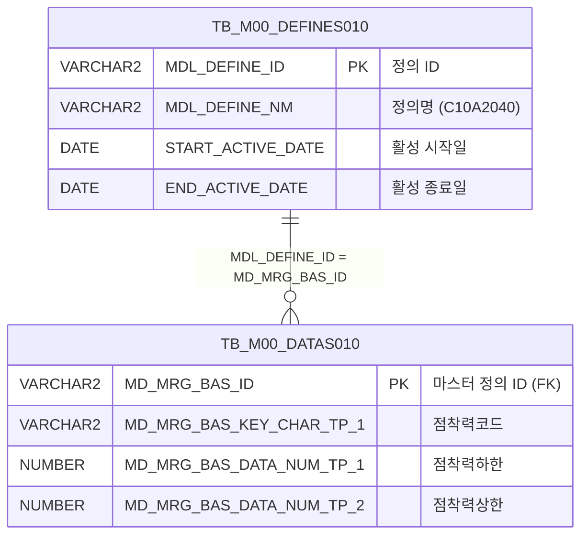

<h1 style="font-size: 40px; text-align: center; font-weight:
   bold; margin: 30px 0;">
  C107000020tab12 레거시 시스템 분석 종합 보고서
</h1>


# 1. 시스템 개요
- **서비스 ID**: C107000020tab12
- **업무명**: 보호필름점착력기준 조회
- **분석 일시**: 2026-03-17 10:26 KST
- **분석 시간**: 약 5분
- **전체 Activity 수**: 2개 (Built-in 2개, Custom 0개)
- **분석자**: Claude Opus 4.6 + Sonnet (Phase 4)
- **분석 도구**: /analyze-service C107000020tab12
- **문서 버전**: 1.0

# 📊 비즈니스 프로세스 분석

## 시스템 목적

C107000020tab12는 C10(도장) 모듈의 **보호필름 점착력 기준** 마스터 데이터를 조회하는 탭 콘텐츠 화면이다. 부모 화면 C107000020의 탭12로 배치되며, 보호필름 제품의 점착력 코드별 허용 범위(하한/상한)를 표 형태로 제공한다.

이 화면은 M00APUSER 스키마의 마스터 데이터 관리 프레임워크(DEFINES010/DATAS010)에서 `C10A2040` 정의에 해당하는 데이터를 조회한다. 점착력 기준값은 도장 공정에서 보호필름 품질 판정의 기준이 되며, 오퍼레이터가 생산 중 점착력 측정값이 허용 범위 내에 있는지 확인하는 데 활용된다.

서비스 구조가 Router → FormSearch(SELECT) 단일 체인으로 구성된 단순 조회 서비스이므로, 워크플로우 다이어그램은 생략한다.

## 주요 유즈케이스

### UC-01: 보호필름 점착력 기준 조회

- **Actor**: 도장 공정 오퍼레이터 / 품질 관리자
- **목적**: 보호필름 점착력 코드별 허용 범위(하한/상한)를 확인하여 생산 중 품질 판정 기준으로 활용

- **전제조건**:
  - 사용자가 시스템에 로그인되어 있음
  - 부모 화면 C107000020이 로드되어 있음
  - M00APUSER 스키마에 C10A2040 정의가 활성 상태(START_ACTIVE_DATE ≤ SYSDATE < END_ACTIVE_DATE)

- **주요 흐름**:
  1. 부모 화면 C107000020에서 tab12(보호필름점착력기준) 탭 선택
  2. 탭 콘텐츠 JSP 로드 완료 시 onXLE 이벤트 발생
  3. onLoadGrid 함수에서 부모 화면의 C107000020_Form_1 파라미터를 가져와 자동 조회 실행
  4. C107000020tab12.select 쿼리로 점착력 코드별 하한/상한 데이터 조회
  5. Grid에 보호필름점착력코드, 점착력하한, 점착력상한 목록 표시

- **대체 흐름**:
  - C10A2040 정의가 비활성 상태인 경우: 조회 결과 없음
  - 마스터 데이터가 미등록된 경우: 빈 그리드 표시

- **후행조건**:
  - 점착력 기준 데이터가 Grid에 표시됨
  - 컨텍스트 메뉴를 통해 엑셀 다운로드 가능

### UC-02: 컨텍스트 메뉴 기능 활용

- **Actor**: 도장 공정 오퍼레이터 / 품질 관리자
- **목적**: 조회된 점착력 기준 데이터에 대해 컬럼 이동, 필터, 엑셀 다운로드 등 부가 기능 활용

- **전제조건**:
  - UC-01이 완료되어 Grid에 데이터가 표시된 상태

- **주요 흐름**:
  1. Grid 위에서 마우스 우클릭하여 컨텍스트 메뉴 표시
  2. 원하는 기능 선택 (컬럼이동/헤더필터/편집가능/엑셀다운로드)
  3. onGridContextMenuClick 핸들러가 선택된 기능 실행

- **대체 흐름**:
  - 엑셀다운로드(excel_grid) 선택 시: 현재 Grid 데이터를 엑셀 파일로 내보내기

- **후행조건**:
  - 선택한 기능이 Grid에 적용됨

### UC-03: 수동 재조회

- **Actor**: 도장 공정 오퍼레이터
- **목적**: 부모 화면에서 조건 변경 후 점착력 기준 데이터를 다시 조회

- **전제조건**:
  - 부모 화면 C107000020의 Form에서 조건이 변경됨

- **주요 흐름**:
  1. 부모 화면에서 조회 버튼 클릭 또는 조건 변경
  2. find 함수 호출
  3. C107000020_Form_1의 파라미터로 C107000020tab12_Grid_1 데이터 재로드
  4. Grid에 갱신된 데이터 표시

- **대체 흐름**:
  - 조회 결과 없음: 빈 Grid 표시, 메시지박스에 안내 메시지

- **후행조건**:
  - 최신 기준 데이터가 Grid에 반영됨

---
## 비즈니스 로직 상세

### 1. 마스터 데이터 프레임워크 기반 기준값 관리

- **목적**: M00APUSER의 범용 마스터 데이터 관리 프레임워크(DEFINES010/DATAS010)를 활용하여 보호필름 점착력 기준값을 관리
- **처리 케이스**:

  **[케이스 1: 활성 정의 기반 데이터 조회]**
  ```
    조건: TB_M00_DEFINES010에서 MDL_DEFINE_NM = 'C10A2040'이고
          START_ACTIVE_DATE ≤ SYSDATE < END_ACTIVE_DATE인 활성 정의 존재
    처리:
      1. DEFINES010에서 활성 상태의 C10A2040 정의 ID(MDL_DEFINE_ID) 조회
      2. DATAS010에서 해당 정의 ID와 매칭되는 데이터 행 조회 (MD_MRG_BAS_ID = MDL_DEFINE_ID)
      3. 범용 컬럼을 업무 의미로 매핑:
         - MD_MRG_BAS_KEY_CHAR_TP_1 → 보호필름점착력코드(PTT_FLM_PRD_ADH_CD)
         - MD_MRG_BAS_DATA_NUM_TP_1 → 점착력하한(PTT_FLM_PRD_ADH_LLV)
         - MD_MRG_BAS_DATA_NUM_TP_2 → 점착력상한(PTT_FLM_PRD_ADH_ULV)
      4. 점착력코드 기준 오름차순 정렬
  ```

  **[케이스 2: 비활성 또는 미등록 정의]**
  ```
    조건: C10A2040 정의가 비활성이거나 미등록
    처리:
      1. DEFINES010 서브쿼리 결과가 0건
      2. DATAS010과 조인 시 매칭 행 없음
      3. 빈 결과셋 반환 → Grid에 데이터 없음 표시
  ```

### 2. 범용 컬럼 ↔ 업무 컬럼 매핑 규칙

- **목적**: DEFINES010/DATAS010 프레임워크의 범용 컬럼명을 도장 업무에 맞는 의미 있는 컬럼명으로 변환
- **매핑 테이블**:

  ```
  범용 컬럼 (DATAS010)            → 업무 컬럼 (화면 표시)
  ─────────────────────────────────────────────────────
  MD_MRG_BAS_KEY_CHAR_TP_1       → PTT_FLM_PRD_ADH_CD  (보호필름점착력코드)
  MD_MRG_BAS_DATA_NUM_TP_1       → PTT_FLM_PRD_ADH_LLV (점착력하한, NUMBER)
  MD_MRG_BAS_DATA_NUM_TP_2       → PTT_FLM_PRD_ADH_ULV (점착력상한, NUMBER)
  ```

  이 매핑은 SQL의 SELECT 절에서 컬럼 별칭(alias)으로 처리되며, 물리적 테이블 구조 변경 없이 논리적 의미를 부여하는 패턴이다.

---

# 💾 데이터 요구사항

## 핵심 테이블

### 1. TB_M00_DATAS010 (M00APUSER) - 마스터 데이터 값 저장

| 컬럼명 | 타입 | PK | 설명 |
|--------|------|----|------|
| MD_MRG_BAS_ID | VARCHAR2 | ✅ | 마스터 정의 ID (DEFINES010.MDL_DEFINE_ID 참조) |
| MD_MRG_BAS_KEY_CHAR_TP_1 | VARCHAR2 | | 키 문자 타입 1 → 보호필름점착력코드 |
| MD_MRG_BAS_DATA_NUM_TP_1 | NUMBER | | 데이터 숫자 타입 1 → 점착력하한 |
| MD_MRG_BAS_DATA_NUM_TP_2 | NUMBER | | 데이터 숫자 타입 2 → 점착력상한 |

### 2. TB_M00_DEFINES010 (M00APUSER) - 마스터 데이터 정의 관리

| 컬럼명 | 타입 | PK | 설명 |
|--------|------|----|------|
| MDL_DEFINE_ID | VARCHAR2 | ✅ | 정의 ID |
| MDL_DEFINE_NM | VARCHAR2 | | 정의명 (이 서비스에서 'C10A2040' 사용) |
| START_ACTIVE_DATE | DATE | | 활성 시작일시 |
| END_ACTIVE_DATE | DATE | | 활성 종료일시 |

## 데이터 플로우

### 1. 조회

```
[보호필름 점착력 기준 조회]
탭 진입 (onXLE 이벤트) 또는 부모 화면 조회 버튼 클릭
→ C107000020tab12.select
  FROM M00APUSER.TB_M00_DATAS010 DATAS010,
       (SELECT MDL_DEFINE_ID
        FROM M00APUSER.TB_M00_DEFINES010
        WHERE MDL_DEFINE_NM = 'C10A2040'
          AND START_ACTIVE_DATE <= SYSDATE
          AND SYSDATE < END_ACTIVE_DATE) DEFINES010
  WHERE DEFINES010.MDL_DEFINE_ID = DATAS010.MD_MRG_BAS_ID
  ORDER BY DATAS010.MD_MRG_BAS_KEY_CHAR_TP_1
→ Grid에 점착력코드별 하한/상한 목록 표시
```

## SQL 일람표

| SQL 이름 | 쿼리 ID | 타입 | 출처 | 테이블 |
|---------|---------|------|------|--------|
| 보호필름 점착력 기준 조회 | C107000020tab12.select | SELECT | Service | TB_M00_DATAS010, TB_M00_DEFINES010 |

## ER 다이어그램 (핵심 관계)



관계 설명:
- TB_M00_DEFINES010이 마스터 정의 테이블로, 'C10A2040' 정의를 통해 보호필름 점착력 기준 데이터셋을 정의
- TB_M00_DATAS010은 정의별 실제 데이터 값을 저장하며, MDL_DEFINE_ID ↔ MD_MRG_BAS_ID로 1:N 관계

---

# 🖥️ 사용자 인터페이스 요구사항

## 화면 레이아웃 상세

### Layout 구조 (절대좌표 배치)

```javascript
{
  layoutType: "absolute",
  components: [
    {
      id: "C107000020tab12_Grid_1",
      type: "grid",
      position: { left: "0px", top: "0px", width: "976px", height: "492px" }
    },
    {
      id: "C107000020tab12_messagebox",
      type: "messagebox",
      position: { left: "0px", top: "493px", width: "976px", height: "18px" }
    },
    {
      id: "C107000020tab12_Form_1",
      type: "form",
      position: { left: "0px", top: "450px", width: "282px", height: "30px" },
      note: "필드 없음 (빈 Form)"
    }
  ]
}
```

## 입출력 요소

### Form 컴포넌트

**C107000020tab12_Form_1**
- 필드 없음 (빈 Form XML)
- 검색 파라미터는 부모 화면의 C107000020_Form_1에서 가져옴

### Grid 컴포넌트

**C107000020tab12_Grid_1 (보호필름 점착력 기준 목록)**
- 편집 가능 여부: 아니오 (전체 읽기 전용)
- Split: 없음
- 페이징: pageset 적용 (rowCnt: 20)
- 컨텍스트 메뉴: 활성
- Smart Rendering: 활성
- 멀티선택: 활성
- 주요 컬럼 (3개):

  **기본 정보 (헤더 1행: 조건 | 결과 | #cspan, 2행: 보호필름점착력코드 | 점착력하한 | 점착력상한)**:
  - PTT_FLM_PRD_ADH_CD: ro - 보호필름점착력코드 (15%, 중앙정렬, 1행 헤더 "조건")
  - PTT_FLM_PRD_ADH_LLV: ro - 점착력하한 (15%, 중앙정렬, 1행 헤더 "결과" colspan 시작)
  - PTT_FLM_PRD_ADH_ULV: ro - 점착력상한 (15%, 중앙정렬, 1행 헤더 #cspan으로 "결과"와 병합)

### Messagebox 컴포넌트

**C107000020tab12_messagebox**
- 위치: Grid 하단 (top: 493px)
- 크기: 976x18px
- 용도: 조회 결과 메시지 표시 (건수 등)

## 화면 동작 흐름

### 1. 화면 초기 로딩 (탭 진입)
```
1. 부모 화면 C107000020에서 tab12 탭 선택
2. C107000020tab12.jsp 로드
3. Grid XML 로드 완료 시 onXLE 이벤트 발생
4. onLoadGrid 함수 실행:
   - C107000020_Form_1 (부모 폼)의 파라미터 가져오기
   - handleDataProcess.do를 통해 C107000020tab12-service 호출 (find 명령)
   - C107000020tab12.select 쿼리 실행
5. Grid에 점착력 기준 데이터 바인딩
6. onXLE 이벤트 핸들러 해제 (1회성 자동 조회)
7. 메시지박스에 조회 결과 건수 표시
```

### 2. 수동 조회 (부모 화면 연동)
```
1. 부모 화면 C107000020에서 조회 버튼 클릭
2. find 함수 호출
3. C107000020_Form_1의 파라미터 구성
4. basicGridData.do를 통해 C107000020tab12_Grid_1 데이터 로드
5. Grid 갱신 및 메시지박스 업데이트
```

### 3. 컨텍스트 메뉴 활용
```
1. Grid 위에서 마우스 우클릭
2. 컨텍스트 메뉴 표시:
   - move_grid: 컬럼이동
   - filter_grid: 헤더필터
   - editable_grid: 편집가능 토글
   - excel_grid: 엑셀다운로드
3. onGridContextMenuClick 핸들러에서 선택 항목 처리
```

## JavaScript 모듈

**C107000020tab12.jsp (인라인 스크립트)**
- find(): 부모 폼 C107000020_Form_1의 파라미터로 Grid 데이터 조회
- add(): 컨텍스트 메뉴 - 선택된 referenceItem 그리드에 새 행 추가
- remove(): 컨텍스트 메뉴 - 그리드에서 행 삭제
- copy(): 컨텍스트 메뉴 - 선택된 행 클립보드 복사
- undo(): 컨텍스트 메뉴 - 이전 작업 취소
- redo(): 컨텍스트 메뉴 - 취소 작업 재실행
- onGridContextMenuClick(): 컨텍스트 메뉴 항목 분기 처리 (move_grid, filter_grid, editable_grid, excel_grid)
- findMessage(): Grid 행의 appMsg 사용자 데이터를 메시지박스에 표시
- onLoadGrid(): Grid XML 로드 완료 시 자동 조회 (onXLE 이벤트 기반, 1회 실행 후 해제)

## 주요 이벤트 핸들러

**onXLE (Grid 초기 로드 완료)**
- 이벤트 타입: Grid XML Load End
- 처리 내용:
  1. onLoadGrid 함수 호출
  2. 부모 화면 C107000020_Form_1에서 검색 파라미터 추출
  3. find 명령으로 C107000020tab12-service 호출
  4. Grid 데이터 바인딩
  5. onXLE 이벤트 핸들러 해제 (중복 호출 방지)

**onGridContextMenuClick (컨텍스트 메뉴 클릭)**
- 이벤트 타입: Context Menu Item Click
- 처리 내용:
  1. 클릭된 메뉴 항목 ID 확인
  2. move_grid: 컬럼 이동 모드 활성화
  3. filter_grid: 헤더 필터 토글
  4. editable_grid: 편집 가능 모드 토글
  5. excel_grid: 엑셀 다운로드 실행

---

# 📌 특이사항 및 주의사항

## 1. 범용 마스터 데이터 프레임워크 사용
- **DEFINES010/DATAS010 패턴**: 보호필름 점착력 기준을 별도 테이블이 아닌 M00APUSER의 범용 마스터 데이터 프레임워크(C10A2040 정의)로 관리한다. 이 패턴은 물리 테이블 추가 없이 마스터 데이터 유형을 확장할 수 있지만, 범용 컬럼명(MD_MRG_BAS_KEY_CHAR_TP_1 등)이 직관적이지 않아 SQL에서 반드시 의미 있는 별칭을 부여해야 한다.
- **활성 기간 관리**: DEFINES010의 START_ACTIVE_DATE/END_ACTIVE_DATE로 정의의 유효기간을 관리하며, SYSDATE 기준으로 활성 여부를 판단한다. 정의가 만료되면 데이터 조회가 불가능해지므로 주의가 필요하다.

## 2. 부모-자식 화면 간 파라미터 의존성
- **외부 폼 참조**: 이 탭 콘텐츠 화면은 자체 검색 폼이 비어있고(C107000020tab12_Form_1에 필드 없음), 부모 화면의 C107000020_Form_1에서 검색 파라미터를 가져온다. 화면을 독립적으로 운영할 수 없는 구조이며, 부모 화면의 폼 구조 변경 시 영향을 받는다.
- **onXLE 1회성 자동 조회**: onLoadGrid에서 Grid XML 로드 완료 시 자동 조회를 수행한 후 onXLE 이벤트를 해제한다. 이는 탭 전환 시 중복 조회를 방지하기 위한 패턴이다.

## 3. Grid 헤더 colspan 병합 패턴
- **2행 헤더 구조**: Grid 컬럼이 2행 헤더를 사용하며, 1행에서 "결과" 헤더가 PTT_FLM_PRD_ADH_LLV와 PTT_FLM_PRD_ADH_ULV 컬럼을 #cspan으로 병합하고 있다. 2행 attachedHeader에서 "점착력하한", "점착력상한"으로 개별 표시한다. 현대화 시 동일한 헤더 병합 구조를 유지해야 한다.

## 4. DAO 스키마 불일치
- **서비스 XML에서는 mesdao(MESAPUSER)** 를 사용하지만, 실제 SQL에서는 `M00APUSER.TB_M00_DATAS010`, `M00APUSER.TB_M00_DEFINES010`으로 **M00APUSER 스키마를 직접 명시**하고 있다. mesdao의 MESAPUSER 스키마에서 M00APUSER 테이블에 접근하기 위해 스키마명을 SQL에 하드코딩한 패턴이다. masterdao를 사용하는 것이 더 적합할 수 있다.

## 5. 컬럼 너비 단위
- Grid 컬럼 너비가 `%` 단위로 설정되어 있으며(colWidthUnit: "%"), 각 컬럼이 15%로 설정되어 전체 45%만 사용한다. 나머지 55%는 빈 공간으로 남으며, 화면 해상도에 따라 레이아웃이 달라질 수 있다.

---

# 📚 참고 문서

- **Service XML**: `src/service/C107000020tab12-service.xml`
- **Query SQL**: `src/query/C107000020tab12-query.glue_sql`
- **JSP**: `WebContents/C107000020tab12.jsp`
- **Grid XML**: `WebContents/header/kr/C107000020tab12/C107000020tab12_Grid_1.xml`
- **Form XML**: `WebContents/header/kr/C107000020tab12/C107000020tab12_Form_1.xml`
- **Messagebox XML**: `WebContents/header/kr/C107000020tab12/C107000020tab12_messagebox.xml`
