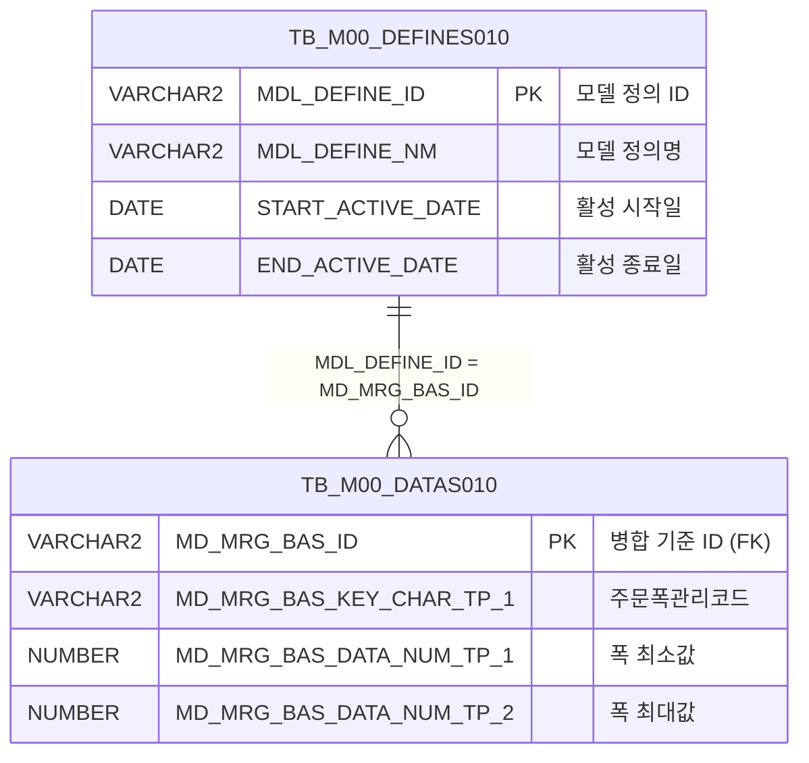

<h1 style="font-size: 40px; text-align: center; font-weight:
   bold; margin: 30px 0;">
  C107000020tab13 레거시 시스템 분석 종합 보고서
</h1>


# 1. 시스템 개요
- **서비스 ID**: C107000020tab13
- **업무명**: 고객사양폭공차기준
- **분석 일시**: 2026-03-17 (KST)
- **전체 Activity 수**: 2개 (Built-in 2개, Custom 0개)
- **분석자**: Claude Opus 4.6
- **분석 도구**: /analyze-service C107000020tab13
- **문서 버전**: 1.0

# 📊 비즈니스 프로세스 분석

## 시스템 목적

C107000020tab13은 C10 모듈(냉연/도금 MES)의 **고객사양 폭공차 기준** 마스터 데이터 조회 탭 화면이다. 부모 화면 C107000020의 13번째 탭으로 포함되며, 주문 폭 관리 코드별 폭 톨레란스(허용오차) 범위(Min/Max)를 조회하는 역할을 수행한다.

이 화면은 마스터 데이터 정의 테이블(TB_M00_DEFINES010)에서 `C10A2181` 정의를 기반으로 데이터 테이블(TB_M00_DATAS010)의 폭 톨레란스 기준값을 조회한다. 생산 공정에서 제품의 폭 규격 판정 시 허용오차 기준으로 활용되며, 주문별 폭 관리 코드에 따라 최소/최대 허용 폭 범위를 확인할 수 있다.

Custom Activity 없이 Built-in FormSearch Activity와 PosDefaultRouter만으로 구성된 단순 조회 서비스이므로, 워크플로우 다이어그램은 생략한다.

## 주요 유즈케이스

### UC-01: 고객사양 폭공차 기준 조회

- **Actor**: 품질관리 담당자 / 생산 오퍼레이터
- **목적**: 주문 폭 관리 코드별 폭 톨레란스 허용 범위(Min/Max)를 조회하여 제품 규격 판정 기준을 확인

- **전제조건**:
  - 사용자가 시스템에 로그인되어 있음
  - 부모 화면 C107000020에 진입한 상태
  - TB_M00_DEFINES010에 C10A2181 정의가 활성 상태로 등록되어 있음

- **주요 흐름**:
  1. 사용자가 C107000020 화면에서 tab13(고객사양폭공차기준) 탭 선택
  2. 탭 진입 시 onLoadGrid 이벤트 자동 발생
  3. 부모 폼(C107000020_Form_1)의 파라미터를 사용하여 C107000020tab13.select 쿼리 실행
  4. TB_M00_DEFINES010에서 C10A2181 활성 정의 ID 조회
  5. TB_M00_DATAS010과 조인하여 주문폭관리코드(ORD_WTH_MNG_CD), 폭Min(WTH_TLN_LLV), 폭Max(WTH_TLN_ULV) 조회
  6. Grid에 조회 결과 표시 및 messagebox에 건수 메시지 표시

- **대체 흐름**:
  - C10A2181 정의가 비활성 상태인 경우: 조회 결과 없음 (빈 그리드)
  - 데이터 미등록 시: 그리드에 데이터 없이 빈 상태로 표시

- **후행조건**:
  - 주문폭관리코드별 폭 톨레란스 기준이 Grid에 표시됨
  - 사용자가 컨텍스트 메뉴를 통해 엑셀 다운로드 등 후속 작업 가능

### UC-02: 그리드 컨텍스트 메뉴 활용

- **Actor**: 품질관리 담당자
- **목적**: 그리드의 컨텍스트 메뉴를 통해 컬럼 이동, 헤더 필터, 편집모드 전환, 엑셀 다운로드 등의 부가 기능 활용

- **전제조건**:
  - UC-01의 조회가 완료되어 Grid에 데이터가 표시된 상태

- **주요 흐름**:
  1. 사용자가 그리드 영역에서 우클릭하여 컨텍스트 메뉴 표시
  2. 원하는 메뉴 항목 선택:
     - `move_grid`: 컬럼 이동 활성/비활성 토글
     - `filter_grid`: 헤더 필터 활성화
     - `editable_grid`: 편집 모드 활성/비활성 토글
     - `excel_grid`: 엑셀 파일 다운로드 (gridexcel 서블릿 호출)
  3. 선택한 기능이 그리드에 적용됨

- **대체 흐름**:
  - 엑셀 다운로드 시 서버 오류: 에러 페이지 표시

- **후행조건**:
  - 선택한 기능이 그리드에 반영됨

### UC-03: 수동 데이터 재조회

- **Actor**: 품질관리 담당자
- **목적**: 부모 폼의 조건 변경 후 탭 데이터를 수동으로 재조회

- **전제조건**:
  - C107000020tab13 탭이 활성 상태

- **주요 흐름**:
  1. 사용자가 부모 폼(C107000020_Form_1)의 조건값 변경
  2. 조회 버튼 클릭 → find 함수 호출
  3. uiCommon.parameters4로 부모 폼 파라미터 구성
  4. C107000020tab13_Grid_1.loadData로 그리드 데이터 재로드
  5. findMessage에서 appMsg를 messagebox에 표시

- **대체 흐름**:
  - 조건 변경 없이 조회: 기존과 동일한 결과 반환

- **후행조건**:
  - 갱신된 조건에 따른 데이터가 Grid에 표시됨

---
## 비즈니스 로직 상세

### 1. 마스터 데이터 정의 기반 폭 톨레란스 조회

- **목적**: C10A2181 정의에 등록된 주문 폭 관리 코드별 허용 폭 범위(Min/Max)를 조회하여 제품 규격 판정의 기준을 제공

- **처리 케이스**:

  **[케이스 1: 활성 정의 기반 데이터 조회]**
  ```
    조건: TB_M00_DEFINES010에서 MDL_DEFINE_NM = 'C10A2181'이고
          START_ACTIVE_DATE <= SYSDATE < END_ACTIVE_DATE (활성 상태)
    처리:
      1. DEFINES010에서 활성 정의의 MDL_DEFINE_ID 추출
      2. DATAS010에서 MD_MRG_BAS_ID = MDL_DEFINE_ID 조건으로 데이터 조인
      3. MD_MRG_BAS_KEY_CHAR_TP_1 → ORD_WTH_MNG_CD (주문폭관리코드) 매핑
      4. MD_MRG_BAS_DATA_NUM_TP_1 → WTH_TLN_LLV (폭 최소값) 매핑
      5. MD_MRG_BAS_DATA_NUM_TP_2 → WTH_TLN_ULV (폭 최대값) 매핑
      6. 주문폭관리코드 기준 오름차순 정렬
  ```

  **[케이스 2: 비활성 정의]**
  ```
    조건: C10A2181 정의가 만료되었거나 아직 활성화되지 않은 경우
    처리:
      1. DEFINES010 서브쿼리 결과가 0건
      2. INNER JOIN으로 인해 전체 결과 0건 반환
      3. 그리드에 빈 데이터 표시
  ```

### 2. 제네릭 마스터 데이터 모델 활용

- **목적**: TB_M00_DEFINES010/TB_M00_DATAS010은 M00(마스터) 모듈의 범용 데이터 정의 테이블로, 정의명(C10A2181)을 키로 다양한 유형의 마스터 데이터를 저장

- **데이터 매핑 규칙**:
  ```
  MD_MRG_BAS_KEY_CHAR_TP_1 → 문자형 키 값 1 (주문폭관리코드)
  MD_MRG_BAS_DATA_NUM_TP_1 → 수치형 데이터 값 1 (폭 최소값)
  MD_MRG_BAS_DATA_NUM_TP_2 → 수치형 데이터 값 2 (폭 최대값)
  ```
  범용 컬럼을 비즈니스 의미 있는 별칭으로 매핑하여 사용하는 패턴이다.

---

# 💾 데이터 요구사항

## 핵심 테이블

### 1. TB_M00_DEFINES010 - (마스터 데이터 정의 관리)
| 컬럼명 | 타입 | PK | 설명 |
|--------|------|----|-----|
| MDL_DEFINE_ID | VARCHAR2 | ✅ | 모델 정의 ID |
| MDL_DEFINE_NM | VARCHAR2 | | 모델 정의명 (예: C10A2181) |
| START_ACTIVE_DATE | DATE | | 활성 시작일 |
| END_ACTIVE_DATE | DATE | | 활성 종료일 |

### 2. TB_M00_DATAS010 - (마스터 데이터 값 저장)
| 컬럼명 | 타입 | PK | 설명 |
|--------|------|----|-----|
| MD_MRG_BAS_ID | VARCHAR2 | ✅ | 병합 기준 ID (DEFINES010.MDL_DEFINE_ID 참조) |
| MD_MRG_BAS_KEY_CHAR_TP_1 | VARCHAR2 | | 문자형 키 1 → ORD_WTH_MNG_CD (주문폭관리코드) |
| MD_MRG_BAS_DATA_NUM_TP_1 | NUMBER | | 수치형 데이터 1 → WTH_TLN_LLV (폭 최소값) |
| MD_MRG_BAS_DATA_NUM_TP_2 | NUMBER | | 수치형 데이터 2 → WTH_TLN_ULV (폭 최대값) |

## 데이터 플로우

### 1. 조회

```
[폭공차 기준 조회]
탭 진입 또는 조회 버튼 클릭
→ C107000020tab13.select
  FROM M00APUSER.TB_M00_DATAS010 DATAS010
  INNER JOIN (SELECT MDL_DEFINE_ID
              FROM M00APUSER.TB_M00_DEFINES010
              WHERE MDL_DEFINE_NM = 'C10A2181'
              AND START_ACTIVE_DATE <= SYSDATE
              AND SYSDATE < END_ACTIVE_DATE) DEFINES010
    ON DEFINES010.MDL_DEFINE_ID = DATAS010.MD_MRG_BAS_ID
  ORDER BY DATAS010.MD_MRG_BAS_KEY_CHAR_TP_1
→ Grid에 주문폭관리코드별 폭Min/Max 표시
```

## SQL 일람표

| SQL 이름 | 쿼리 ID | 타입 | 출처 | 테이블 |
|---------|---------|-----|-------|-------|
| 폭공차 기준 조회 | C107000020tab13.select | SELECT | Service | TB_M00_DATAS010, TB_M00_DEFINES010 |

## ER 다이어그램 (핵심 관계)



관계 설명:
- TB_M00_DEFINES010이 중심 테이블로, 마스터 데이터 정의(C10A2181)를 관리
- TB_M00_DATAS010은 DEFINES010의 MDL_DEFINE_ID를 MD_MRG_BAS_ID로 참조하여 실제 데이터 값 저장 (1:N 관계)

---

# 🖥️ 사용자 인터페이스 요구사항

## 화면 레이아웃 상세

### Layout 구조
```javascript
// initLayout 없음 - 컴포넌트가 절대 위치(position:absolute)로 직접 배치
// 부모 탭(C107000020)의 탭 콘텐츠 영역 내에서 배치됨
{
  type: "absolute",
  components: [
    {
      id: "C107000020tab13_Grid_1",
      type: "grid",
      position: { left: "0px", top: "0px", width: "976px", height: "492px" }
    },
    {
      id: "C107000020tab13_messagebox",
      type: "messagebox",
      position: { left: "0px", top: "493px", width: "976px", height: "18px" }
    },
    {
      id: "C107000020tab13_Form_1",
      type: "form",
      position: { left: "0px", top: "450px", width: "282px", height: "30px" }
      // Form XML이 비어있음 - 부모 폼(C107000020_Form_1) 참조
    }
  ]
}
```

## 입출력 요소

### Form 컴포넌트
**C107000020tab13_Form_1**
- Form XML이 비어있음 (`<items/>`)
- 검색 파라미터는 부모 탭의 **C107000020_Form_1**에서 참조
- `uiCommon.parameters4('C107000020_Form_1', 'C107000020tab13_Grid_1', ...)` 호출로 부모 폼 파라미터 사용

### Grid 컴포넌트

**C107000020tab13_Grid_1 (폭공차 기준 목록)**
- 편집 가능 여부: 아니오 (읽기 전용, 컨텍스트 메뉴로 편집모드 전환 가능)
- Split: 0 (고정 컬럼 없음)
- 페이징: 20건 단위
- Smart Rendering: 활성
- 멀티 선택: 활성
- 컨텍스트 메뉴: 활성
- 주요 컬럼 (3개):

  **기본 정보**:
  - ORD_WTH_MNG_CD: ro - 주문폭관리코드/조건 (15%, 중앙정렬, 헤더 2행: "조건" / "주문폭관리코드")
  - WTH_TLN_LLV: ro - 폭Min/결과 (15%, 중앙정렬, 헤더 2행: "결과" / "폭Min")
  - WTH_TLN_ULV: ro - 폭Max (15%, 중앙정렬, 헤더 2행: #cspan(결과와 병합) / "폭Max")

  **헤더 구조 (2행)**:
  | 조건 | 결과 (colspan=2) |
  |------|-----------------|
  | 주문폭관리코드 | 폭Min | 폭Max |

## 화면 동작 흐름

### 1. 화면 초기 로딩 (탭 진입)
```
1. 부모 화면 C107000020에서 tab13 탭 클릭
2. C107000020tab13.jsp 로드
3. ui.initializeDHTMLX() 호출 → pageConfiguration 기반 컴포넌트 초기화
4. Grid XLE 이벤트 등록: onXLE = items['C107000020tab13_Grid_1'].onXLEEvent(onLoadGrid)
5. 그리드 초기 로드 완료 시 onLoadGrid 자동 실행:
   - uiCommon.parameters4('C107000020_Form_1', 'C107000020tab13_Grid_1', 'find')로 파라미터 구성
   - items['C107000020tab13_Grid_1'].loadData(findUrl) 호출
   - XLE 이벤트 해제: getDhxGrid().detachEvent(onXLE) (1회만 자동 조회)
6. findMessage에서 appMsg를 messagebox에 표시
```

### 2. 수동 재조회 (find)
```
1. 부모 폼(C107000020_Form_1)의 조건 변경
2. 조회 버튼 클릭 → find(eventName, formDivObj, referenceItem) 호출
3. uiCommon.parameters4('C107000020_Form_1', 'C107000020tab13_Grid_1', customparam + eventName)
4. items['C107000020tab13_Grid_1'].loadData(findUrl)
5. 서버에서 C107000020tab13.select 쿼리 실행
6. Grid에 결과 바인딩 → findMessage로 건수 메시지 표시
```

### 3. 컨텍스트 메뉴 조작
```
1. 그리드 영역 우클릭 → contextmenu.xml 기반 메뉴 표시
2. 메뉴 항목 클릭 → onGridContextMenuClick(id, gridObj, menuObj) 호출
3. 항목별 처리:
   - move_grid: gridObj.enableColumnMove(true/false) 토글
   - filter_grid: gridObj.enableHeaderMenu() (체크 시만 활성)
   - editable_grid: gridObj.setEditable(true/false) 토글
   - excel_grid: gridObj.toExcel('/gridexcel', 'color') → 엑셀 다운로드
```

## JavaScript 모듈

**C107000020tab13.jsp** (인라인 스크립트)
- find(eventName, formDivObj, referenceItem): 폭공차 기준 조회 (uiCommon.parameters4로 부모 폼 파라미터 구성 → Grid loadData)
- add(referenceItem): 그리드 신규 행 추가 (items[referenceItem].addRow)
- remove(referenceItem): 그리드 선택 행 삭제 (items[referenceItem].removeRow)
- copy(referenceItem): 그리드 행 클립보드 복사 (items[referenceItem].copyRowContent)
- undo(referenceItem): 실행 취소 (items[referenceItem].undo)
- redo(referenceItem): 다시 실행 (items[referenceItem].redo)
- onGridContextMenuClick(id, gridObj, menuObj): 컨텍스트 메뉴 항목 처리 (컬럼이동/헤더필터/편집모드/엑셀)
- findMessage(referenceItem): appMsg를 messagebox에 표시 (uiCommon.message 호출)
- onLoadGrid(): 그리드 초기 로드 완료 시 자동 조회 실행 후 XLE 이벤트 해제

**외부 참조**:
- c10.ui.js: C10 모듈 공통 UI 유틸리티
- glue.ui.bootstrap.js: GLUE 프레임워크 UI 부트스트랩

## 주요 이벤트 핸들러

**onLoadGrid (그리드 초기 로드)**
- 이벤트 타입: XLE Event (onXLEEvent)
- 처리 내용:
  1. 부모 폼(C107000020_Form_1) 파라미터로 조회 URL 구성
  2. Grid loadData로 데이터 조회
  3. XLE 이벤트 해제 (detachEvent) → 이후 탭 전환 시 자동 재조회 방지

**find (조회 버튼)**
- 이벤트 타입: Form Find Button
- 처리 내용:
  1. uiCommon.parameters4로 부모 폼 파라미터 + Grid ID + eventName 조합
  2. Grid loadData로 handleDataProcess.do 호출
  3. 서버에서 C107000020tab13-service 실행 → C107000020tab13.select 쿼리 수행

**onGridContextMenuClick (컨텍스트 메뉴)**
- 이벤트 타입: Grid Context Menu Click
- 처리 내용:
  1. 클릭된 메뉴 ID와 체크 상태 확인
  2. move_grid: 컬럼 이동 활성/비활성
  3. filter_grid: 헤더 메뉴 필터 활성
  4. editable_grid: 편집 모드 토글
  5. excel_grid: 엑셀 다운로드 실행

# 📌 특이사항 및 주의사항

## 1. 부모 폼 참조 패턴
- **부모 폼 의존**: C107000020tab13_Form_1은 XML이 비어있으며(`<items/>`), 실제 검색 파라미터는 부모 탭의 `C107000020_Form_1`에서 가져온다. `uiCommon.parameters4('C107000020_Form_1', ...)` 호출로 부모 폼의 파라미터를 직접 참조하는 패턴이다.
- **주의**: 부모 폼의 필드 구조가 변경되면 이 탭의 조회 동작에도 영향을 미친다.

## 2. 범용 마스터 데이터 테이블 사용
- **제네릭 컬럼 매핑**: TB_M00_DATAS010의 범용 컬럼(`MD_MRG_BAS_KEY_CHAR_TP_1`, `MD_MRG_BAS_DATA_NUM_TP_1` 등)을 비즈니스 의미 있는 별칭(`ORD_WTH_MNG_CD`, `WTH_TLN_LLV` 등)으로 매핑하여 사용한다.
- **정의 기반 활성 관리**: `C10A2181` 정의의 START_ACTIVE_DATE/END_ACTIVE_DATE로 데이터 유효 기간을 관리하므로, 정의가 만료되면 조회 결과가 0건이 된다.
- **스키마**: M00APUSER 스키마의 마스터 데이터 테이블을 직접 참조한다 (masterdao가 아닌 mesdao에서 스키마 명시 접근).

## 3. 1회성 자동 조회 및 XLE 이벤트 해제
- **자동 조회 패턴**: 그리드 초기 로드 완료 시 onXLEEvent로 onLoadGrid를 등록하여 자동 조회를 수행한다. 조회 후 `detachEvent(onXLE)`로 이벤트를 해제하여 이후 탭 전환 시 중복 자동 조회를 방지한다.
- **flag 변수 미사용**: 전역 변수 `flag = false`가 선언되어 있으나 실제 코드에서 사용되지 않는 미사용 변수이다.

## 4. 그리드 헤더 2행 구조
- **컬럼 스팬**: WTH_TLN_ULV 컬럼의 header가 `#cspan`으로 설정되어, WTH_TLN_LLV의 "결과" 헤더와 병합된다. attachHeader 행에서 "폭Min", "폭Max"로 구분 표시하는 2행 헤더 구조이다.

## 5. 편집 기능의 이중성
- **기본 읽기 전용**: 모든 컬럼이 `ro`(read only) 타입이나, 컨텍스트 메뉴의 `editable_grid` 옵션으로 편집 모드 전환 가능
- **저장 기능 부재**: 편집 모드로 전환 후 데이터를 변경하더라도, 서비스에 저장(INSERT/UPDATE) 쿼리가 없어 변경사항이 DB에 반영되지 않는다.

# 📚 참고 문서

- **Service XML**: `src/service/C107000020tab13-service.xml`
- **Query SQL**: `src/query/C107000020tab13-query.glue_sql`
- **JSP**: `WebContents/C107000020tab13.jsp`
- **Grid XML**: `WebContents/header/kr/C107000020tab13/C107000020tab13_Grid_1.xml`
- **Form XML**: `WebContents/header/kr/C107000020tab13/C107000020tab13_Form_1.xml`
- **공통 JS**: `WebContents/js/c10.ui.js`
