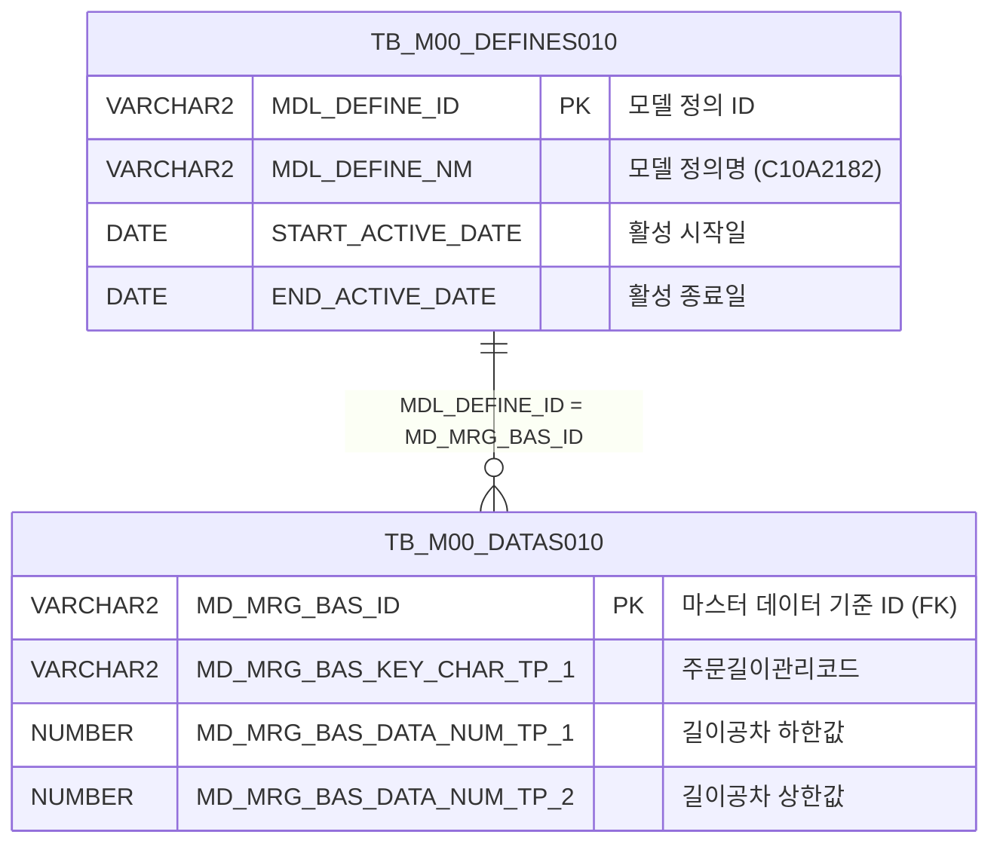

<h1 style="font-size: 40px; text-align: center; font-weight:
   bold; margin: 30px 0;">
  C107000020tab14 레거시 시스템 분석 종합 보고서
</h1>


# 1. 시스템 개요
- **서비스 ID**: C107000020tab14
- **업무명**: 고객사양길이공차기준
- **분석 일시**: 2026-03-17 10:32 KST
- **분석 시간**: 약 3분
- **전체 Activity 수**: 2 (Built-in: 2, Custom: 0)
- **분석자**: Claude Opus 4.6 / Sonnet
- **분석 도구**: /analyze-service C107000020tab14
- **문서 버전**: 1.0

# 📊 비즈니스 프로세스 분석

## 시스템 목적

본 서비스는 C107000020(주문관리) 화면의 14번째 탭으로, **고객사양 길이공차 기준** 마스터 데이터를 조회하는 읽기 전용 화면이다. 주문 길이 관리 코드별 톨레란스(공차) 범위(최소값, 최대값)를 표 형태로 표시하여, 영업/생산 담당자가 고객 주문의 길이 허용 범위를 확인할 수 있도록 한다.

데이터 원천은 M00APUSER 스키마의 마스터 데이터 정의 테이블(TB_M00_DEFINES010, TB_M00_DATAS010)이며, 업무기준 코드 `C10A2182`에 해당하는 활성 정의를 기반으로 길이공차 데이터를 조회한다. 별도의 데이터 입력/수정 기능 없이 순수 조회 전용으로 동작하며, 조회 파라미터는 상위 탭(C107000020)의 Form에서 전달받는다.

## 주요 유즈케이스

### UC-01: 고객사양 길이공차 기준 조회
- **Actor**: 영업 담당자, 생산관리 담당자
- **목적**: 주문 길이 관리 코드별 톨레란스(공차) 허용 범위(Min/Max)를 확인하여 고객 주문 사양 검토에 활용

- **전제조건**:
  - C107000020 화면에 로그인 및 진입되어 있음
  - 상위 탭(C107000020)의 Form에 조회 조건이 설정되어 있음
  - 업무기준 C10A2182 정의가 활성화(START_ACTIVE_DATE ~ END_ACTIVE_DATE 범위 내)되어 있음

- **주요 흐름**:
  1. 사용자가 C107000020 화면에서 tab14(고객사양길이공차기준) 탭 선택
  2. Grid XLE(XML Load End) 이벤트 발생 시 onLoadGrid 함수가 자동으로 조회 실행
  3. 상위 탭의 C107000020_Form_1 파라미터를 uiCommon.parameters4로 전달
  4. handleDataProcess.do → C107000020tab14-service → C107000020tab14.select 쿼리 실행
  5. TB_M00_DEFINES010에서 C10A2182 활성 정의 조회 후 TB_M00_DATAS010과 조인
  6. 주문길이관리코드별 길이Min/길이Max 결과를 Grid에 표시

- **대체 흐름**:
  - 조회 결과가 없는 경우: 빈 Grid 표시
  - C10A2182 정의가 비활성 상태: 데이터 조회 불가 (빈 결과)

- **후행조건**:
  - Grid에 주문 길이 관리 코드별 공차 기준 목록이 표시됨
  - 사용자가 데이터를 확인할 수 있는 상태 (편집 불가)

### UC-02: 컨텍스트 메뉴를 통한 조회 편의 기능 사용
- **Actor**: 영업 담당자, 생산관리 담당자
- **목적**: Grid 컨텍스트 메뉴를 통해 컬럼 이동, 필터, 엑셀 다운로드 등 편의 기능을 활용

- **전제조건**:
  - Grid에 데이터가 조회되어 있음

- **주요 흐름**:
  1. Grid 영역에서 우클릭하여 컨텍스트 메뉴 호출
  2. 원하는 기능 선택 (컬럼이동/헤더필터/편집가능/엑셀다운로드)
  3. 선택 기능에 따른 동작 수행

- **대체 흐름**:
  - 엑셀다운로드 선택 시: Grid 데이터를 Excel 파일로 다운로드

- **후행조건**:
  - 선택한 기능이 Grid에 적용됨

### UC-03: 상위 탭에서 재조회
- **Actor**: 영업 담당자
- **목적**: 상위 탭(C107000020)에서 조건 변경 후 재조회 시 tab14 데이터도 갱신

- **전제조건**:
  - C107000020 화면의 tab14가 활성화되어 있음

- **주요 흐름**:
  1. 상위 탭의 Form에서 조회 조건 변경
  2. 조회(find) 버튼 클릭
  3. find 함수가 C107000020_Form_1의 파라미터를 Grid_1에 전달하여 재조회
  4. 갱신된 데이터가 Grid에 표시됨

- **대체 흐름**:
  - 변경된 조건에 해당 데이터 없음: 빈 Grid 표시

- **후행조건**:
  - Grid에 변경된 조건 기준의 길이공차 데이터가 표시됨

---

## 비즈니스 로직 상세

### 1. 업무기준 C10A2182 기반 길이공차 데이터 조회

- **목적**: 마스터 데이터 정의 테이블에서 활성화된 C10A2182 정의를 기준으로 주문 길이 관리 코드별 톨레란스(공차) 범위를 조회
- **처리 케이스**:

  **[케이스 1: 활성 정의 필터링]**
  ```
    조건: TB_M00_DEFINES010에서 MDL_DEFINE_NM = 'C10A2182'
          AND START_ACTIVE_DATE <= SYSDATE
          AND SYSDATE < END_ACTIVE_DATE
    처리:
      1. 활성 기간 내의 MDL_DEFINE_ID를 서브쿼리로 추출
      2. TB_M00_DATAS010과 MD_MRG_BAS_ID = MDL_DEFINE_ID 조건으로 조인
      3. MD_MRG_BAS_KEY_CHAR_TP_1 → ORD_LTH_MNG_CD (주문길이관리코드)
      4. MD_MRG_BAS_DATA_NUM_TP_1 → LTH_TLN_LLV (길이공차 하한값)
      5. MD_MRG_BAS_DATA_NUM_TP_2 → LTH_TLN_ULV (길이공차 상한값)
      6. ORD_LTH_MNG_CD 기준 오름차순 정렬
  ```

  **[케이스 2: 비활성 정의]**
  ```
    조건: C10A2182 정의가 활성 기간 외인 경우
    처리:
      1. 서브쿼리 결과가 0건
      2. 조인 결과 빈 결과셋 반환
      3. Grid에 데이터 없음 표시
  ```

- **데이터 매핑 규칙**:
  ```
  TB_M00_DATAS010의 범용 컬럼 → 비즈니스 컬럼 매핑:
    MD_MRG_BAS_KEY_CHAR_TP_1 → ORD_LTH_MNG_CD (주문길이관리코드, 문자형)
    MD_MRG_BAS_DATA_NUM_TP_1 → LTH_TLN_LLV (길이 톨레란스 하한값, 숫자형)
    MD_MRG_BAS_DATA_NUM_TP_2 → LTH_TLN_ULV (길이 톨레란스 상한값, 숫자형)
  ```

---

# 💾 데이터 요구사항

## 핵심 테이블

### 1. TB_M00_DEFINES010 - (마스터 데이터 정의 테이블)
| 컬럼명 | 타입 | PK | 설명 |
|--------|------|----|-----|
| MDL_DEFINE_ID | VARCHAR2 | ✅ | 모델 정의 ID |
| MDL_DEFINE_NM | VARCHAR2 |  | 모델 정의명 (예: C10A2182) |
| START_ACTIVE_DATE | DATE |  | 활성 시작일 |
| END_ACTIVE_DATE | DATE |  | 활성 종료일 |

### 2. TB_M00_DATAS010 - (마스터 데이터 상세 테이블)
| 컬럼명 | 타입 | PK | 설명 |
|--------|------|----|-----|
| MD_MRG_BAS_ID | VARCHAR2 | ✅ | 마스터 데이터 병합 기준 ID (DEFINES010.MDL_DEFINE_ID 참조) |
| MD_MRG_BAS_KEY_CHAR_TP_1 | VARCHAR2 |  | 키 문자형 1 → ORD_LTH_MNG_CD (주문길이관리코드) |
| MD_MRG_BAS_DATA_NUM_TP_1 | NUMBER |  | 데이터 숫자형 1 → LTH_TLN_LLV (길이공차 하한값) |
| MD_MRG_BAS_DATA_NUM_TP_2 | NUMBER |  | 데이터 숫자형 2 → LTH_TLN_ULV (길이공차 상한값) |

## 데이터 플로우

### 1. 조회
```
[고객사양 길이공차 기준 조회]
탭 진입 (Grid XLE 이벤트) 또는 상위 Form 조회 버튼 클릭
→ C107000020tab14.select
  FROM M00APUSER.TB_M00_DATAS010 DATAS010
  INNER JOIN (SELECT MDL_DEFINE_ID
              FROM M00APUSER.TB_M00_DEFINES010
              WHERE MDL_DEFINE_NM = 'C10A2182'
              AND START_ACTIVE_DATE <= SYSDATE
              AND SYSDATE < END_ACTIVE_DATE) DEFINES010
    ON DEFINES010.MDL_DEFINE_ID = DATAS010.MD_MRG_BAS_ID
  ORDER BY DATAS010.MD_MRG_BAS_KEY_CHAR_TP_1
→ Grid_1에 주문길이관리코드별 공차 범위 목록 표시
```

## SQL 일람표

| SQL 이름 | 쿼리 ID | 타입 | 출처 | 테이블 |
|---------|---------|-----|-------|-------|
| 길이공차 기준 조회 | C107000020tab14.select | SELECT | Service | TB_M00_DATAS010, TB_M00_DEFINES010 |

## ER 다이어그램 (핵심 관계)



관계 설명:
- TB_M00_DEFINES010이 마스터 정의 테이블로 업무기준(C10A2182)을 관리
- TB_M00_DATAS010이 정의에 속한 상세 데이터를 저장하며 MDL_DEFINE_ID = MD_MRG_BAS_ID로 1:N 관계

---

# 🖥️ 사용자 인터페이스 요구사항

## 화면 레이아웃 상세

### Layout 구조
```
별도 Layout 오브젝트 없이 div 기반 절대위치 배치 (C107000020의 tab14 콘텐츠)

+------------------------------------------+
|  Grid_1 (976 x 492px)                    |
|  고객사양길이공차기준 조회 그리드           |
|  (읽기 전용, 3컬럼)                       |
+------------------------------------------+
|  messagebox (976 x 18px)                  |
+------------------------------------------+
|  Form_1 (282 x 30px, 숨김/파라미터 전달용) |
+------------------------------------------+
```

## 입출력 요소

### Form 컴포넌트
**C107000020tab14_Form_1**
- XML이 비어 있음 (`<items/>` 만 존재)
- 자체 필드 없이 상위 탭(C107000020_Form_1)의 파라미터를 전달받는 용도
- URL: basicGridData.do

### Grid 컴포넌트

**C107000020tab14_Grid_1 (고객사양 길이공차 기준 목록)**
- 편집 가능 여부: 아니오 (전체 읽기 전용 - ro)
- Split: 0 (고정 컬럼 없음)
- 2행 헤더 구성 (attachHeader로 병합)
  - 1행: 조건 | 결과 | (결과와 cspan 병합)
  - 2행: 주문길이관리코드 | 길이Min | 길이Max
- rowCnt: 20 (페이지당 20행)
- vertical: true (세로 스크롤)
- contextmenu: true (컨텍스트 메뉴 활성)
- pageset: true (페이지네이션 활성)
- 참조 테이블: VI_M00_C10A2030
- 주요 컬럼 (3개):

  **조회 결과 컬럼**:
  - ORD_LTH_MNG_CD: ro - 주문길이관리코드 (15%, 중앙정렬, 헤더: 조건/주문길이관리코드)
  - LTH_TLN_LLV: ro - 길이 톨레란스 하한값 (15%, 중앙정렬, 헤더: 결과/길이Min)
  - LTH_TLN_ULV: ro - 길이 톨레란스 상한값 (15%, 중앙정렬, 헤더: #cspan/길이Max)

## 화면 동작 흐름

### 1. 화면 초기 로딩 (탭 진입)
```
1. 사용자가 C107000020 화면에서 tab14(고객사양길이공차기준) 클릭
2. JSP 로드 및 Grid/Form/messagebox 컴포넌트 초기화
3. Grid_1 XLE(XML Load End) 이벤트 발생
4. onLoadGrid 함수 실행 → 자동 조회 1회 실행 후 이벤트 해제
5. uiCommon.parameters4(C107000020_Form_1) 호출하여 상위 Form 파라미터 구성
6. handleDataProcess.do → C107000020tab14-service 호출
7. Grid_1에 길이공차 기준 목록 표시
8. appMsg를 messagebox에 표시 (findMessage)
```

### 2. 상위 탭에서 재조회
```
1. 상위 탭(C107000020)에서 조회 조건 변경 후 조회 버튼 클릭
2. find 함수 호출
3. uiCommon.parameters4(C107000020_Form_1) 호출하여 파라미터 구성
4. handleDataProcess.do → C107000020tab14-service 호출
5. Grid_1 데이터 갱신
6. messagebox에 결과 메시지 표시
```

### 3. 컨텍스트 메뉴 사용
```
1. Grid_1 영역에서 우클릭
2. 컨텍스트 메뉴 표시 (컬럼이동/헤더필터/편집가능/엑셀다운로드)
3. onGridContextMenuClick 핸들러에서 선택 메뉴 처리:
   - move_grid: 컬럼 순서 이동
   - filter_grid: 헤더 필터 토글
   - editable_grid: 편집 가능 모드 토글
   - excel_grid: 엑셀 다운로드
```

## JavaScript 모듈

**C107000020tab14.jsp (인라인 스크립트)**
- find(): 상위 Form(C107000020_Form_1) 파라미터로 Grid_1 데이터 조회 (uiCommon.parameters4 호출)
- onLoadGrid(): Grid XLE 이벤트 핸들러 - 초기 자동 조회 실행 후 이벤트 해제
- findMessage(): Grid appMsg 데이터를 messagebox에 표시
- onGridContextMenuClick(id, ind): 컨텍스트 메뉴 클릭 처리 (move_grid/filter_grid/editable_grid/excel_grid)
- add(): 신규 행 추가 (CRUD 메뉴)
- remove(): 선택 행 삭제 (CRUD 메뉴)
- copy(): 클립보드 복사 (CRUD 메뉴)
- undo(): 실행취소 (CRUD 메뉴)
- redo(): 다시실행 (CRUD 메뉴)

## 주요 이벤트 핸들러

**onLoadGrid (Grid 초기 로딩)**
- 이벤트 타입: Grid XLE (XML Load End)
- 처리 내용:
  1. Grid_1의 XLE 이벤트 발생 시 자동 호출
  2. find() 함수 실행하여 데이터 조회
  3. 이벤트 핸들러 해제 (1회성 실행)

**find (조회 실행)**
- 이벤트 타입: Form find 버튼 클릭 / 자동 호출
- 처리 내용:
  1. 상위 탭 Form(C107000020_Form_1)에서 파라미터 추출
  2. uiCommon.parameters4로 파라미터 구성
  3. handleDataProcess.do로 C107000020tab14-service 호출
  4. Grid_1에 결과 데이터 바인딩

**onGridContextMenuClick (컨텍스트 메뉴)**
- 이벤트 타입: Grid 우클릭 → 메뉴 선택
- 처리 내용:
  1. 선택된 메뉴 ID에 따라 분기
  2. move_grid: uiCommon.gridMoveColumn 호출
  3. filter_grid: uiCommon.gridFilterRow 호출
  4. editable_grid: uiCommon.gridEditable 호출
  5. excel_grid: uiCommon.gridExcel 호출

---

# 📌 특이사항 및 주의사항

## 1. 범용 마스터 테이블의 비즈니스 컬럼 매핑
- **범용 컬럼 사용**: TB_M00_DATAS010은 범용 마스터 데이터 테이블로, `MD_MRG_BAS_KEY_CHAR_TP_1`, `MD_MRG_BAS_DATA_NUM_TP_1` 등 범용 컬럼명을 사용한다. 실제 비즈니스 의미(주문길이관리코드, 길이공차 하한/상한)는 SQL의 alias로만 구분되므로, 테이블 구조만으로는 비즈니스 의미 파악이 어렵다.
- **업무기준 코드 의존**: C10A2182라는 업무기준 코드가 하드코딩되어 있어, 이 코드의 의미와 관리 체계를 별도로 파악해야 한다.

## 2. 상위 탭 의존적 파라미터 전달 구조
- **자체 Form 없음**: Form_1의 XML이 비어 있어(`<items/>`) 자체 입력 필드가 없다. 조회 파라미터는 상위 탭(C107000020)의 C107000020_Form_1에서 `uiCommon.parameters4`를 통해 전달받는다. 따라서 tab14를 독립적으로 사용할 수 없으며, 반드시 상위 화면의 컨텍스트가 필요하다.

## 3. Grid 헤더 2행 병합 구조
- **attachHeader 사용**: Grid_1은 기본 헤더(조건/결과/#cspan)와 attachHeader(주문길이관리코드/길이Min/길이Max)로 2행 헤더를 구성한다. `#cspan`을 사용하여 "결과" 헤더가 LTH_TLN_LLV와 LTH_TLN_ULV 두 컬럼을 병합한다. 이 구조는 DHTMLX Grid의 특수 기능으로, UI 현대화 시 동일한 병합 헤더 구현이 필요하다.

## 4. 활성 기간 기반 데이터 필터링
- **시간 의존적 조회**: SYSDATE 기준으로 START_ACTIVE_DATE와 END_ACTIVE_DATE 사이의 활성 정의만 조회하므로, 정의의 활성 기간이 만료되면 데이터가 조회되지 않는다. 운영 시 업무기준 활성 기간 관리가 중요하다.

## 5. 읽기 전용이나 CRUD 메뉴 존재
- **불필요한 CRUD 메뉴**: 모든 컬럼이 ro(읽기 전용)임에도 불구하고 JavaScript에 add/remove/copy/undo/redo 등 CRUD 메뉴 함수가 정의되어 있다. 이는 JSP 템플릿에서 자동 생성된 것으로 보이며, 실제 저장(save) 서비스가 없어 데이터 변경은 불가능하다.

---

# 📚 참고 문서

- **Query SQL**: `src/query/C107000020tab14-query.glue_sql`
- **Service XML**: `src/service/C107000020tab14-service.xml`
- **JSP**: `WebContents/C107000020tab14.jsp`
- **Grid XML**: `WebContents/header/kr/C107000020tab14/C107000020tab14_Grid_1.xml`
- **Form XML**: `WebContents/header/kr/C107000020tab14/C107000020tab14_Form_1.xml`
