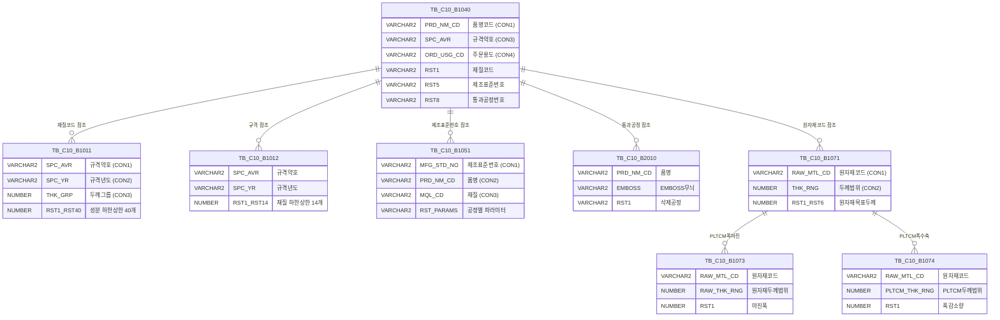

<h1 style="font-size: 40px; text-align: center; font-weight:
   bold; margin: 30px 0;">
  C107000030 레거시 시스템 분석 종합 보고서
</h1>


# 1. 시스템 개요
- **서비스 ID**: C107000030
- **업무명**: 업무기준조회(판단)
- **분석 일시**: 2026-03-17 10:33 KST
- **분석 시간**: 약 10분
- **전체 Activity 수**: 0개 (빈 서비스 - 각 탭이 별도 서비스 사용)
- **분석자**: Claude Opus 4.6 / Claude Sonnet 4.6
- **분석 도구**: /analyze-service C107000030
- **문서 버전**: 1.0

# 📊 비즈니스 프로세스 분석

## 시스템 목적

업무기준조회(판단) 화면은 C10 모듈(설계/스케줄)의 **업무기준 판단 결과를 조회**하는 읽기 전용 화면이다. 제품 설계 시 적용되는 각종 업무기준(설계KEY, 규격 성분/재질 사양, 인수도, 폭마진/감소량, 압연 두께 보정, 통과공정 삭제, 제조표준, 포장재 중량 등)의 판단 결과를 20개 탭으로 분류하여 표시한다.

각 탭은 **조건(CON) + 비교값(MIN/MAX)** 쌍과 **결과값(RST)** 으로 구성된 그리드를 통해, 특정 주문/제품에 대해 업무기준 테이블(TB_C10_B10xx)에서 매칭된 판단 결과를 보여준다. 이 화면은 설계 자동화 시스템이 주문 정보를 기반으로 적용한 업무기준 판정 내역을 조회하는 용도로, 데이터 수정 기능은 없다.

메인 서비스(C107000030-service)는 `initial="end"`로 설정된 빈 서비스이며, 실제 데이터 조회는 각 탭의 개별 서비스(C107000030tab01-service ~ C107000030tab20-service)에서 수행된다. 메인 화면의 Form에서 입력된 파라미터(예: 코일ID, 주문번호 등)를 `uiCommon.parameters4`를 통해 각 탭 그리드에 전달하는 구조이다.

## 주요 유즈케이스

### UC-01: 설계KEY 판단 결과 조회
- **Actor**: 설계 담당자 / 스케줄 담당자
- **목적**: 특정 주문에 대해 설계KEY 업무기준(C10B1040)의 판단 조건과 결과를 확인하여 설계 적용 내역을 검증

- **전제조건**:
  - 사용자가 시스템에 로그인되어 있음
  - 조회 대상 주문/제품에 대한 업무기준 판단이 완료됨
  - 메인 Form에 조회 파라미터(코일ID 등)가 입력됨

- **주요 흐름**:
  1. 사용자가 메인 Form(C107000030_Form_1)에 조회 파라미터 입력
  2. "설계KEY" 탭(tab01) 선택 시 XLE 이벤트(onLoadGrid)에 의해 자동 조회 실행
  3. `uiCommon.parameters4('C107000030_Form_1', 'C107000030tab01_Grid_1', eventName)` 호출
  4. C107000030tab01-service를 통해 TB_C10_B1040 테이블에서 판단 결과 조회
  5. Grid에 품명/제품/규격약호/주문용도/고객사 등 13개 조건 컬럼과 재질코드/원자재코드/제조표준번호/통과공정번호/확정구분/품질MSG 등 13개 결과 컬럼 표시

- **대체 흐름**:
  - 조회 결과 없음: 빈 그리드 표시
  - 컨텍스트 메뉴에서 엑셀 출력 가능 (excel_grid)

- **후행조건**:
  - 판단 결과가 읽기 전용 그리드에 표시됨
  - 사용자가 다른 탭으로 이동하여 추가 업무기준 확인 가능

### UC-02: 규격 성분/재질 사양 판단 결과 조회
- **Actor**: 품질 담당자 / 설계 담당자
- **목적**: 규격 성분사양(C10B1011)과 규격 재질사양(C10B1012)의 판단 결과를 확인하여 주문에 적용된 화학성분 및 기계적 성질 범위 검증

- **전제조건**:
  - 메인 Form에 조회 파라미터 입력 완료
  - 해당 규격에 대한 업무기준 판단 데이터 존재

- **주요 흐름**:
  1. "규격성분사양" 탭(tab02) 선택
  2. 자동 조회 실행 → Grid에 규격약호/규격년도/두께그룹 조건과 C/Si/Mn/P/S/Cr/Ni/Cu/Al/Ti/Nb/V/N/Mo/Sn/W/Co/B/Pb/Ca 각 하한/상한 40개 성분 결과 표시
  3. "규격재질사양" 탭(tab03) 선택
  4. 자동 조회 실행 → Grid에 규격약호/규격년도/두께그룹 조건과 YP/TS/EL/HRB/ERI 하한상한, 굴곡, 시편채취 정보 등 14개 결과 표시

- **대체 흐름**:
  - 컨텍스트 메뉴에서 필터 적용 가능 (filter_grid)
  - 컬럼 이동 가능 (move_grid)

- **후행조건**:
  - 규격 성분/재질 판단 결과가 그리드에 표시됨

### UC-03: 폭마진/감소량 업무기준 조회
- **Actor**: 공정 담당자 / 설계 담당자
- **목적**: PLTCM/CGL/EGL/CCL/정전 공정별 폭마진량 및 폭감소량 업무기준 판단 결과를 확인하여 설계 시 적용된 폭 보정 내역 검증

- **전제조건**:
  - 메인 Form에 조회 파라미터 입력 완료

- **주요 흐름**:
  1. 관련 탭 선택 (tab09~tab15 중 해당 공정 탭)
  2. 자동 조회 실행
  3. 각 공정별 조건(원자재코드, 두께범위, 폭범위 등)과 폭마진/감소량 결과 표시
  4. 공정별 탭 구성:
     - PLTCM폭마진(tab09): 원자재코드/원자재두께범위/PLTCM출측폭범위 → 마진폭
     - PLTCM폭수축(tab10): 원자재코드/PLTCM두께범위/PLTCM폭범위 → 폭감소량
     - CGL폭감소량(tab11): 공정/품명/재질/원자재코드/PLTCM두께범위/제품폭범위 → 폭감소량
     - EGL폭감소량(tab12): 동일 구조
     - CCL폭감소량(tab13): 품명/재질/PLTCM두께범위/제품폭범위 → 폭감소량
     - 정전폭감소량(tab14): 동일 구조
     - 정전폭마진량(tab15): 주문Edge/품명/제품형태/코팅방식/수지타입/두께범위 → 폭감소량

- **대체 흐름**:
  - 해당 공정이 통과공정으로 삭제된 경우 결과 없음

- **후행조건**:
  - 폭마진/감소량 판단 결과 확인 완료

### UC-04: 제조표준/통과공정/압연두께보정 조회
- **Actor**: 공정 담당자 / 설계 담당자
- **목적**: 제조표준 공정 파라미터, 통과공정 삭제 기준, 압연 두께 Set치 보정 등의 판단 결과를 확인

- **전제조건**:
  - 메인 Form에 조회 파라미터 입력 완료

- **주요 흐름**:
  1. "압연두께Set치보정" 탭(tab16) → 품명/규격/주문용도/고객사/두께구분/두께관리코드/도금량코드/두께범위/폭범위 조건 + 두께보정치/단위 결과
  2. "통과공정삭제" 탭(tab17) → 품명/B-Marking/주문내경/내경링종류/표면처리/도금량/EMBOSS/포장단중/코일외경/두께범위/폭범위/수지타입/광택도/보호필름/재질/주문EDGE/주문길이/제품형태/권취방법/최종수요가/주문용도 등 다수 조건 + 삭제공정 결과
  3. "제조표준기준" 탭(tab18) → 제조표준번호/품명/재질/두께범위/폭범위 조건 + 일반ANN/H-CON ANN/#2~#5 CGL 공정별 파라미터 결과

- **대체 흐름**:
  - 컨텍스트 메뉴에서 편집 가능 모드 전환 가능 (editable_grid) - 단, 실제 저장 기능은 없음

- **후행조건**:
  - 제조 관련 업무기준 판단 결과 확인 완료

---

# 🖥️ 사용자 인터페이스 요구사항

## 화면 레이아웃 상세

### Layout 구조 (initLayout)
```javascript
{
  itemType: "flat",  // absolute positioning 기반
  components: [
    {
      id: "C107000030_Form_1",
      type: "form",
      position: {top: 0, left: 0, width: 980, height: 30},
      xml: "./header/kr/C107000030/C107000030_Form_1.xml",
      url: "basicGridData.do",
      referenceItem: "C107000030_Tabbar_1",
      service: "C107000030-service"
    },
    {
      id: "C107000030_Tabbar_1",
      type: "tabbar",
      position: {top: 31, left: 0, width: 980, height: 562},
      xml: "./header/kr/C107000030/C107000030_Tabbar_1.xml",
      skin: "modern",
      service: "C107000030-service",
      tabs: [
        // 20개 탭 (각각 iframe으로 별도 JSP 로드)
      ]
    }
  ]
}
```

## 입출력 요소

### Form 컴포넌트
**C107000030_Form_1**
- winClose: Button - 닫기 버튼 → 화면 닫기
- 조회 파라미터를 포함하며 `uiCommon.parameters4`를 통해 각 탭 Grid에 전달

### Tabbar 컴포넌트
**C107000030_Tabbar_1** (20개 탭, 2행 배치, iframe 모드)

| 행 | 탭ID | 라벨 | JSP | 업무기준코드 | 너비 |
|---|------|------|-----|------------|------|
| 1 | TAB_C10B1040 | 설계KEY | tab01.jsp | C10B1040 | 70px |
| 1 | TAB_C10B1011 | 규격성분사양 | tab02.jsp | C10B1011 | 95px |
| 1 | TAB_C10B1012 | 규격재질사양 | tab03.jsp | C10B1012 | 95px |
| 1 | TAB_C10B1013 | 규격인수도 | tab04.jsp | C10B1013 | 95px |
| 1 | TAB_C10B1014 | 규격별주문용도 | tab05.jsp | C10B1014 | 95px |
| 1 | TAB_C10B1031 | 사내성분사양 | tab06.jsp | C10B1031 | 95px |
| 1 | TAB_C10B1032 | 사내재질사양 | tab07.jsp | C10B1032 | 95px |
| 1 | TAB_C10B1071 | 원자재두께 | tab08.jsp | C10B1071 | 95px |
| 1 | TAB_C10B1064 | 원자재발주기준 | tab20.jsp | C10B1064 | 95px |
| 1 | TAB_C10B1073 | PLTCM폭마진 | tab09.jsp | C10B1073 | 95px |
| 2 | TAB_C10B1074 | PLTCM폭수축 | tab10.jsp | C10B1074 | 95px |
| 2 | TAB_C10B1075 | CGL폭감소량 | tab11.jsp | C10B1075 | 95px |
| 2 | TAB_C10B1076 | EGL폭감소량 | tab12.jsp | C10B1076 | 95px |
| 2 | TAB_C10B1078 | CCL폭감소량 | tab13.jsp | C10B1078 | 95px |
| 2 | TAB_C10B1077 | 정전폭감소량 | tab14.jsp | C10B1077 | 95px |
| 2 | TAB_C10B1079 | 정전폭마진량 | tab15.jsp | C10B1079 | 95px |
| 2 | TAB_C10B2060 | 압연두께Set치보정 | tab16.jsp | C10B2060 | 95px |
| 2 | TAB_C10B2010 | 통과공정삭제 | tab17.jsp | C10B2010 | 95px |
| 2 | TAB_C10B1051 | 제조표준기준 | tab18.jsp | C10B1051 | 95px |
| 2 | TAB_C10B1081 | 포장재중량 | tab19.jsp | C10B1081 | 90px |

### Grid 컴포넌트

모든 탭의 Grid는 동일한 구조 패턴을 따름: **조건(CON+MIN/MAX) + 결과(RST)** 읽기 전용

**C107000030tab01_Grid_1 (설계KEY - C10B1040)**
- 편집 가능 여부: 아니오 (읽기 전용, ro/ron)
- Split: 없음
- 컨텍스트 메뉴: 사용 (컬럼이동/필터/편집가능/엑셀출력)
- 페이지 설정: 사용 (rowCnt: 19)
- 주요 컬럼 (43개, 2행 헤더):

  **순서 정보**:
  - SEQ: ro - 순번 (4px, 우측정렬)

  **조건 컬럼** (13개 조건-비교값 쌍):
  - CON1/MIN1: ro - 품명 연산/비교값 (5px/6px, 중앙정렬)
  - CON2/MIN2: ro - 제품 연산/비교값 (5px/6px, 중앙정렬)
  - CON3/MIN3: ro - 규격약호 연산/비교값 (5px/15px, 중앙/좌측정렬)
  - CON4/MIN4: ro - 주문용도 연산/비교값 (5px/6px, 중앙정렬)
  - CON5/MIN5: ro - 고객사 연산/비교값 (7px/6px, 중앙정렬)
  - CON6/MIN6: ro - 고객사양서번호 연산/비교값 (8px/8px, 중앙정렬)
  - CON7/MIN7: ro - 엠보스무늬 연산/비교값 (6px/8px, 중앙정렬)
  - CON8/MIN8: ro - Spangle 연산/비교값 (6px/6px, 중앙정렬)
  - CON9/MIN9: ro - 도금량 연산/비교값 (6px/6px, 중앙정렬)
  - CON10/MIN10: ro - 표면처리 연산/비교값 (8px/10px, 중앙/좌측정렬)
  - CON11/MIN11: ro - 색상코드 연산/비교값 (5px/6px, 중앙정렬)
  - CON12/MIN12/MAX12: ro/ron - 두께범위 연산/비교값Min/비교값Max (7px/6px/6px, 중앙/우측정렬, 소수점3자리)
  - CON13/MIN13/MAX13: ro - 폭범위 연산/비교값Min/비교값Max (7px/6px/6px, 중앙/우측정렬)

  **결과 컬럼** (13개):
  - RST1: ro - 재질코드 (8px, 중앙정렬)
  - RST2: ro - 원자재코드1 (8px, 중앙정렬)
  - RST3: ro - 원자재코드2 (8px, 중앙정렬)
  - RST4: ro - 원자재코드3 (8px, 중앙정렬)
  - RST5: ro - 제조표준번호1 (8px, 중앙정렬)
  - RST6: ro - 제조표준번호2 (8px, 중앙정렬)
  - RST7: ro - 제조표준번호3 (8px, 중앙정렬)
  - RST8: ro - 통과공정번호 (8px, 중앙정렬)
  - RST9: ro - 확정구분 (8px, 중앙정렬)
  - RST10: ro - 품질MSG1 (8px, 중앙정렬)
  - RST11: ro - 품질MSG2 (8px, 중앙정렬)
  - RST12: ro - 품질MSG3 (8px, 중앙정렬)
  - RST13: ro - 품질정전MSG (8px, 중앙정렬)

**C107000030tab02_Grid_1 (규격성분사양 - C10B1011)**
- 편집 가능 여부: 아니오
- 조건 컬럼: 규격약호(CON1/MIN1), 규격년도(CON2/MIN2), 두께그룹(CON3/MIN3/MAX3, ron 0.000)
- 결과 컬럼: RST1~RST40 (ron, 0.0000) - C/Si/Mn/P/S/Cr/Ni/Cu/Al/Ti/Nb/V/N/Mo/Sn/W/Co/B/Pb/Ca 각 하한/상한 40개

**C107000030tab03_Grid_1 (규격재질사양 - C10B1012)**
- 조건 컬럼: 규격약호, 규격년도, 두께그룹(Min/Max)
- 결과 컬럼: RST1~RST14 - YP하한/상한, TS하한/상한, EL하한/상한, HRB하한/상한, ERI하한/상한, 굴곡, 시편채취위치, 시편채취길이, 시편가공코드

**C107000030tab04_Grid_1 (규격인수도 - C10B1013)**
- 조건 컬럼: 인수도규격, 품명, 제품형태, EDGE, 두께그룹(Min/Max), 폭그룹(Min/Max), 길이그룹(Min/Max)
- 결과 컬럼: RST1~RST14 - 두께Min/Max, 폭Min/Max, 길이Min/Max, 반곡, 중곡, 외곡, 직선도, 직각도, 대각선공차, 급준도, TeleScope

**C107000030tab05_Grid_1 (규격별주문용도 - C10B1014)**
- 조건 컬럼: 규격약호, 두께그룹(Min/Max), 주문용도
- 결과 컬럼: RST1 - 체크유무

**C107000030tab06_Grid_1 (사내성분사양 - C10B1031)**
- 조건 컬럼: 품명, 재질기호, 두께그룹(Min/Max, ron 0.000)
- 결과 컬럼: RST1~RST40 (ron, 0.000) - C/Si/Mn/P/S/Cr/Ni/Cu/Al/Ti/Nb/V/N/Mo/Sn/W/Co/B/Pb/Ca 각 하한/상한

**C107000030tab07_Grid_1 (사내재질사양 - C10B1032)**
- 조건 컬럼: 품명, 재질기호, 두께그룹(Min/Max, ron 0.000)
- 결과 컬럼: RST1~RST14 - YP/TS/연신율/HRB/ERI 하한상한, 굴곡, 시편채취위치/길이, 시편가공코드

**C107000030tab08_Grid_1 (원자재두께 - C10B1071)**
- 조건 컬럼: 원자재코드, 두께범위(Min/Max, ron 0.000), 폭범위(Min/Max, ron 0000.0)
- 결과 컬럼: RST1~RST6 (ron, 0.00) - 원자재목표두께, 원자재목표두께1~5

**C107000030tab09_Grid_1 (PLTCM폭마진 - C10B1073)**
- 조건 컬럼: 원자재코드, 원자재두께범위(Min/Max, ron 0.000), PLTCM출측폭범위(Min/Max, ron 0000.0)
- 결과 컬럼: RST1 - 마진폭

**C107000030tab10_Grid_1 (PLTCM폭수축 - C10B1074)**
- 조건 컬럼: 원자재코드, PLTCM두께범위(Min/Max, ron 0.000), PLTCM폭범위(Min/Max, ron 0000.0)
- 결과 컬럼: RST1 - 폭감소량

**C107000030tab11_Grid_1 (CGL폭감소량 - C10B1075)**
- 조건 컬럼: 공정, 품명코드, 재질코드, 원자재코드, PLTCM두께범위(Min/Max, ron 0.000), 제품폭범위(Min/Max, ron 0000.0)
- 결과 컬럼: RST1 - 폭감소량

**C107000030tab12_Grid_1 (EGL폭감소량 - C10B1076)**
- 조건 컬럼: 공정, 품명코드, 재질코드, 원자재코드, PLTCM두께범위(Min/Max), 제품폭범위(Min/Max)
- 결과 컬럼: RST1 - 폭감소량

**C107000030tab13_Grid_1 (CCL폭감소량 - C10B1078)**
- 조건 컬럼: 품명코드, 재질코드, PLTCM두께범위(Min/Max, ron 0.000), 제품폭범위(Min/Max, ron 0000.0)
- 결과 컬럼: RST1 - 폭감소량

**C107000030tab14_Grid_1 (정전폭감소량 - C10B1077)**
- 조건 컬럼: 품명코드, 재질코드, PLTCM두께범위(Min/Max, ron 0.000), 제품폭범위(Min/Max, ron 0000.0)
- 결과 컬럼: RST1 - 폭감소량

**C107000030tab15_Grid_1 (정전폭마진량 - C10B1079)**
- 조건 컬럼: 주문Edge, 품명코드, 제품형태, 코팅방식, 수지타입, 두께범위(Min/Max, ron 0000.0)
- 결과 컬럼: RST1 - 폭감소량

**C107000030tab16_Grid_1 (압연두께Set치보정 - C10B2060)**
- 조건 컬럼: 품명, 규격기관, 규격약호, 주문용도, 고객사, 주문두께구분, 두께관리코드, 도금량코드, 두께범위(Min/Max, ron 0.000), 폭범위(Min/Max, ron 0000.0)
- 결과 컬럼: RST1 - 두께보정치, RST2 - 단위

**C107000030tab17_Grid_1 (통과공정삭제 - C10B2010)**
- 조건 컬럼: 품명, B/Marking, 주문내경, 내경링종류, 표면처리코드, 도금량지정, EMBOSS무늬, 포장단중하한값, 코일외경, 두께범위(Min/Max), 폭범위(Min/Max), 수지타입, 광택도코드, 보호필름, 재질코드, 주문EDGE, 주문길이, 제품형태, 권취방법, 최종수요가, 주문용도
- 결과 컬럼: 삭제공정

**C107000030tab18_Grid_1 (제조표준기준 - C10B1051)**
- 조건 컬럼: 제조표준번호, 품명, 재질, 두께범위(Min/Max), 폭범위(Min/Max)
- 결과 컬럼: 일반ANN 소둔로/CYCLE, H-CON ANN, #2~#5 CGL 공정 파라미터 다수

**C107000030tab19_Grid_1 (포장재중량 - C10B1081)**
- 조건 컬럼: 포장방법, 폭범위(Min/Max, ron 0000.0), 포장단중(Min/Max), 길이범위(Min/Max, ron 0000.0)
- 결과 컬럼: RST1 - 포장재중량

**C107000030tab20_Grid_1 (원자재발주기준 - C10B1064)**
- 조건 컬럼: 원자재코드, 두께그룹, 원자재Maker
- 결과 컬럼: 원자재규격약호, 성분 하한/상한(C~Ca 40개), YP/TS/EL/HRB 하한/상한, 도금량코드

## 화면 동작 흐름

### 1. 화면 초기 로딩
```
1. 화면 진입 (C107000030.jsp)
2. ui.initializeDHTMLX() 호출 → pageConfiguration 파싱
3. C107000030_Form_1 로드 (basicGridData.do, C107000030-service)
   - 닫기(winClose) 버튼만 포함된 상단 폼 렌더링
4. C107000030_Tabbar_1 로드 (./header/kr/C107000030/C107000030_Tabbar_1.xml)
   - 20개 탭 생성 (skin: modern, align: left, hrefMode: iframe)
   - 첫 번째 탭 "설계KEY" (TAB_C10B1040) 자동 선택
5. 선택된 탭 iframe에 C107000030tab01.jsp 로드
6. XLE 이벤트(onLoadGrid)에 의해 탭 Grid 자동 조회 실행
```

### 2. 탭 전환 및 데이터 조회
```
1. 사용자가 다른 탭 클릭 (예: "규격성분사양")
2. Tabbar가 해당 탭의 JSP를 iframe으로 로드
3. 탭 JSP 로드 완료 시 XLE 이벤트(onLoadGrid) 발생
4. find(eventName) 호출
   → items[referenceItem].activeTabFrame().contentWindow.find(eventName)
5. 탭 내부에서 uiCommon.parameters4('C107000030_Form_1', '{tabId}_Grid_1', eventName) 실행
   - 메인 Form(C107000030_Form_1)에서 파라미터 추출
   - handleDataProcess.do URL로 해당 탭 서비스 호출
6. 조회 결과가 탭 내 Grid에 표시
```

### 3. 컨텍스트 메뉴 기능
```
1. Grid 영역에서 우클릭 → 컨텍스트 메뉴 표시
2. 메뉴 항목 선택:
   - "컬럼이동" (move_grid): gridObj.enableColumnMove(true/false) 토글
   - "필터" (filter_grid): gridObj.enableHeaderMenu() 활성화
   - "편집가능" (editable_grid): gridObj.setEditable(true/false) 토글
   - "엑셀출력" (excel_grid): gridObj.toExcel('/gridexcel', 'color') 호출
```

## JavaScript 모듈

**C107000030.jsp** (메인 화면 인라인 스크립트)
- find(eventName, formDivObj, referenceItem): Form 조회 버튼 이벤트 → activeTabFrame의 contentWindow.find() 호출
- refresh(referenceItem): 새로고침 → clearDataProcess() + uiCommon.parameters()로 재조회
- add(referenceItem): 새 행 추가 → addRow()
- remove(referenceItem): 행 삭제 → removeRow()
- copy(referenceItem): 행 클립보드 복사 → copyRowContent()
- undo(referenceItem): 실행 취소
- redo(referenceItem): 다시 실행
- onGridContextMenuClick(id, gridObj, menuObj): 컨텍스트 메뉴 처리 (move_grid/filter_grid/editable_grid/excel_grid)
- findMessage(referenceItem): 상태 메시지 표시 → uiCommon.message()

**각 탭 JSP** (C107000030tab01~tab20.jsp)
- find(eventName): 탭 내 조회 → uiCommon.parameters4('C107000030_Form_1', '{tabId}_Grid_1', eventName)
- onLoadGrid: XLE 이벤트 핸들러 → 탭 로드 시 자동 조회 실행

## 주요 이벤트 핸들러

**find (Form 조회 버튼)**
- 이벤트 타입: Form Button Click
- 처리 내용:
  1. 메인 Form에서 이벤트 수신
  2. 현재 활성 탭의 iframe 참조 획득 (activeTabFrame)
  3. 활성 탭의 contentWindow.find(eventName) 호출
  4. 탭 내부에서 uiCommon.parameters4로 파라미터 구성 후 Grid 데이터 로드

**onLoadGrid (탭 로드 시 자동 조회)**
- 이벤트 타입: XLE Event (Grid Load Complete)
- 처리 내용:
  1. 탭 JSP가 iframe에 로드 완료
  2. Grid의 onXLEEvent(onLoadGrid) 핸들러 실행
  3. 메인 Form 파라미터를 자동으로 조회에 사용
  4. Grid에 데이터 바인딩

**onGridContextMenuClick (컨텍스트 메뉴)**
- 이벤트 타입: Grid Right Click → Menu Item Click
- 처리 내용:
  1. 메뉴 항목 ID 확인 (move_grid/filter_grid/editable_grid/excel_grid)
  2. 체크박스 상태 확인 (getCheckboxState)
  3. 해당 기능 토글 또는 실행

---

# 📊 핵심 워크플로우 다이어그램

```mermaid
flowchart TD
    A["C107000030 화면 진입"]:::start --> B["메인 서비스\ninitial=end\n(빈 서비스)"]:::proc
    B --> C["C107000030_Form_1\n조회 파라미터 입력"]:::proc
    C --> D["C107000030_Tabbar_1\n20개 탭 (2행 배치)"]:::proc
    D --> E{"활성 탭 선택"}:::decision
    E --> F["tab01: 설계KEY\nTB_C10_B1040"]:::proc
    E --> G["tab02: 규격성분사양\nTB_C10_B1011"]:::proc
    E --> H["tab03~20:\n각 업무기준 테이블 조회"]:::proc
    F --> I["uiCommon.parameters4\n메인 Form→탭 Grid"]:::save
    G --> I
    H --> I
    I --> J["Grid 표시\nCON+MIN/MAX → RST\n(읽기 전용)"]:::start

    classDef start fill:#808080,color:#fff
    classDef proc fill:#4169E1,color:#fff
    classDef decision fill:#408040,color:#fff
    classDef save fill:#005080,color:#fff
```



## ER 다이어그램 (업무기준 테이블 관계)



관계 설명:
- **TB_C10_B1040** (설계KEY): 핵심 업무기준. 품명/규격/용도/고객사 등 13개 조건으로 재질코드, 원자재코드, 제조표준번호, 통과공정번호 등 결정
- **TB_C10_B1011/B1012**: 규격 성분/재질 사양. 설계KEY에서 결정된 규격약호 기반으로 성분 범위와 재질 범위 제공
- **TB_C10_B1051**: 제조표준기준. 설계KEY의 제조표준번호를 기준으로 공정별 파라미터 제공
- **TB_C10_B1071~B1079**: 원자재/폭마진/감소량. 설계KEY의 원자재코드 기반으로 두께/폭 보정치 제공
- **TB_C10_B2010**: 통과공정삭제. 다수 조건으로 삭제 대상 공정 결정

---

# 📌 특이사항 및 주의사항

## 1. 빈 서비스 + 탭별 독립 서비스 구조
- **메인 서비스(C107000030-service)가 `initial="end"` 빈 서비스**: Activity가 하나도 없으며, 실제 비즈니스 로직은 각 탭의 개별 서비스(C107000030tab01-service ~ C107000030tab20-service)에서 수행된다. 이는 메인 화면이 순수 UI 컨테이너 역할만 수행하는 독특한 패턴이다.
- **20개 탭 = 20개 독립 서비스**: 각 탭이 별도의 service.xml과 query.glue_sql을 가지므로, 이 화면의 완전한 분석을 위해서는 C107000030tab01~tab20 서비스를 각각 분석해야 한다.

## 2. 크로스 프레임 파라미터 전달 패턴
- **`uiCommon.parameters4`를 통한 메인→탭 파라미터 공유**: 메인 Form(C107000030_Form_1)의 파라미터를 iframe 내부의 탭 Grid에 전달하는 크로스 프레임 통신 패턴을 사용한다. `parameters4` 함수는 부모 프레임의 Form ID를 직접 참조하여 파라미터를 추출하므로, Form ID가 변경되면 모든 20개 탭 JSP를 수정해야 한다.

## 3. 업무기준 조건-결과 패턴의 일관성
- **CON(조건연산자) + MIN/MAX(비교값) → RST(결과)**: 모든 탭 Grid가 동일한 패턴을 따른다. CON 컬럼에는 비교 연산자(=, >=, <= 등)가 표시되고, MIN/MAX 컬럼에는 비교 대상 값이 표시되며, RST 컬럼에는 판단 결과값이 표시된다. 이 패턴은 업무기준 엔진(TB_C10_B10xx 테이블)의 판단 로직을 화면에 그대로 반영한 것이다.

## 4. 컨텍스트 메뉴의 편집 가능 토글 기능
- **읽기 전용 화면이지만 편집 모드 전환 가능**: 컨텍스트 메뉴의 `editable_grid` 옵션으로 Grid를 편집 모드로 전환할 수 있으나, 저장 서비스가 연결되어 있지 않으므로 실제 데이터 수정은 불가능하다. 이는 표준 컨텍스트 메뉴 템플릿(`contextmenu.xml`)이 일괄 적용된 결과로 보인다.

## 5. 탭 순서와 JSP 매핑 불일치
- **tab20.jsp가 "원자재발주기준" 탭에 매핑**: Tabbar XML에서 TAB_C10B1064(원자재발주기준)는 9번째 탭이지만 tab20.jsp에 연결되어 있다. 탭 표시 순서와 JSP 파일 번호가 일치하지 않아, 유지보수 시 혼동 가능성이 있다.

## 6. 대량 컬럼 Grid (성분사양 탭)
- **규격성분사양(tab02)과 사내성분사양(tab06)의 Grid는 각각 40개 이상의 결과 컬럼**을 가진다. C/Si/Mn/P/S/Cr/Ni/Cu/Al/Ti/Nb/V/N/Mo/Sn/W/Co/B/Pb/Ca 20개 성분의 하한/상한 값을 표시하므로, 조건 컬럼까지 합치면 총 48개 이상의 컬럼이 된다. 이는 가로 스크롤이 많이 필요한 구조이다.

---

# 📚 참고 문서

- **Service XML**: `src/service/C107000030-service.xml` (빈 서비스)
- **탭 Service XML**: `src/service/C107000030tab01-service.xml` ~ `C107000030tab20-service.xml`
- **JSP**: `WebContents/C107000030.jsp` (메인), `WebContents/C107000030tab01.jsp` ~ `C107000030tab20.jsp` (탭)
- **Form XML**: `WebContents/header/kr/C107000030/C107000030_Form_1.xml`
- **Tabbar XML**: `WebContents/header/kr/C107000030/C107000030_Tabbar_1.xml`
- **공통 JS**: `WebContents/js/c10.ui.js`
