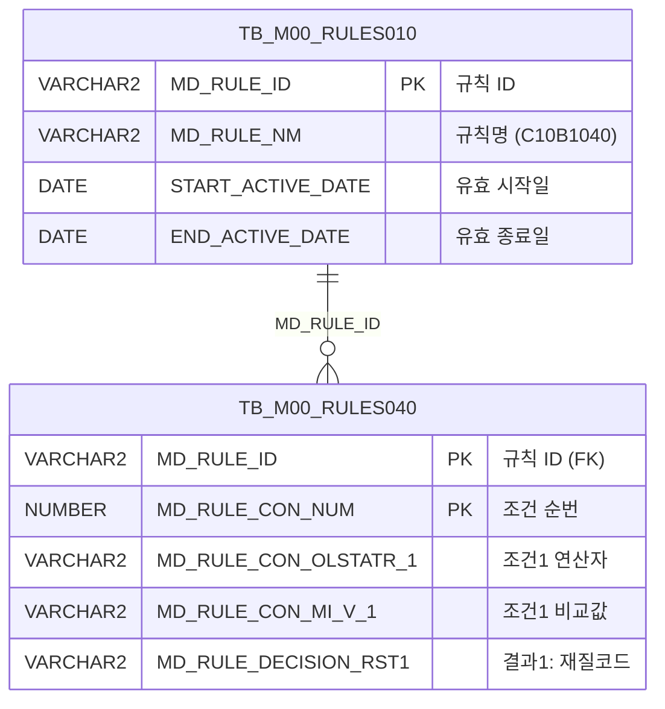

<h1 style="font-size: 40px; text-align: center; font-weight:
   bold; margin: 30px 0;">
  C107000030tab01 레거시 시스템 분석 종합 보고서
</h1>


# 1. 시스템 개요
- **서비스 ID**: C107000030tab01
- **업무명**: 설계KEY 조회
- **분석 일시**: 2026-03-17 10:34 (KST)
- **분석 시간**: ~3분
- **전체 Activity 수**: 2개 (Router 1, FormSearch 1)
- **분석자**: Claude Opus 4.6
- **분석 도구**: /analyze-service C107000030tab01
- **문서 버전**: 1.0

# 📊 비즈니스 프로세스 분석

## 시스템 목적

본 서비스는 **설계KEY(C10B1040) 규칙 조건 및 의사결정 결과 조회** 화면의 탭 콘텐츠이다. 설계KEY는 제품의 품명, 제품코드, 규격약호, 주문용도, 고객사, 고객사양서번호, 엠보스무늬, Spangle, 도금량, 표면처리, 색상코드, 두께범위, 폭범위 등 13개 조건 항목에 대한 연산자와 비교값을 조합하여 제품 설계 규칙을 정의하고, 해당 규칙에 따른 13가지 의사결정 결과(재질코드, 원자재코드1~3, 제조표준번호1~3, 통과공정번호, 확정구분, 품질MSG1~3, 품질정전MSG)를 표시한다.

이 화면은 부모 화면 `C107000030`의 탭(tab01) 내에서 동작하며, 부모 화면의 검색 폼(`C107000030_Form_1`)으로부터 파라미터를 전달받아 규칙 데이터를 조회한다. 마스터 데이터 관리 시스템(M00APUSER)의 규칙 엔진 테이블(TB_M00_RULES010, TB_M00_RULES040)을 기반으로 현재 유효한 설계KEY 규칙을 조회하며, 두께범위/폭범위 조건에 대해서는 `FUNC_GET_YEONSAN` 함수를 통해 연산자를 변환하여 표시한다.

## 주요 유즈케이스

### UC-01: 설계KEY 규칙 조회
- **Actor**: 설계/생산기술 담당자
- **목적**: C10B1040 규칙에 등록된 모든 설계KEY 조건과 의사결정 결과를 한눈에 조회하여 제품별 설계 규칙을 확인

- **전제조건**:
  - 사용자가 시스템에 로그인되어 있음
  - 부모 화면 C107000030이 로드되어 있음
  - TB_M00_RULES010에 'C10B1040' 규칙이 유효 기간 내로 등록되어 있음

- **주요 흐름**:
  1. 사용자가 부모 화면에서 설계KEY 탭(tab01) 선택
  2. 탭 로드 시 Grid XML 로드 완료 이벤트(onXLE)에 의해 자동 조회 실행
  3. 부모 폼(C107000030_Form_1)의 파라미터를 수집하여 서비스 호출
  4. C107000030tab01-service → Router → FormSearch(조회) Activity 실행
  5. C107000030tab01.select 쿼리로 RULES010/RULES040 테이블 JOIN 조회
  6. 42개 컬럼 Grid에 규칙 조건(CON1~13)과 비교값(MIN1~13, MAX12~13) 및 의사결정 결과(RST1~13) 표시

- **대체 흐름**:
  - 유효한 C10B1040 규칙이 없는 경우: 빈 Grid 표시
  - 부모 폼 파라미터가 없는 경우: 전체 규칙 조회

- **후행조건**:
  - Grid에 설계KEY 규칙 데이터가 표시됨
  - 사용자가 컨텍스트 메뉴를 통해 필터링, 엑셀 내보내기 등 수행 가능

### UC-02: Grid 컨텍스트 메뉴 활용
- **Actor**: 설계/생산기술 담당자
- **목적**: 조회된 설계KEY 데이터에 대해 열 이동, 필터, 편집 모드 전환, 엑셀 내보내기 등 부가 기능 활용

- **전제조건**:
  - Grid에 데이터가 조회되어 있음

- **주요 흐름**:
  1. Grid 영역에서 마우스 우클릭으로 컨텍스트 메뉴 호출
  2. 메뉴 항목 선택:
     - `move_grid`: 컬럼 드래그 이동 ON/OFF 토글
     - `filter_grid`: 헤더 필터 메뉴 활성화
     - `editable_grid`: 편집 모드 ON/OFF 토글
     - `excel_grid`: 엑셀 파일로 내보내기 (gridexcel 서블릿 호출)

- **대체 흐름**:
  - 이미 활성화된 기능 재선택 시: 토글로 비활성화

- **후행조건**:
  - 선택한 기능이 Grid에 적용됨

### UC-03: 텍스트 필터를 통한 규칙 검색
- **Actor**: 설계/생산기술 담당자
- **목적**: 특정 조건값(품명, 규격약호, 고객사 등)으로 Grid 데이터를 필터링하여 원하는 설계 규칙을 빠르게 찾기

- **전제조건**:
  - Grid에 데이터가 조회되어 있음
  - 3단 헤더의 3번째 행에 필터 입력란이 표시됨

- **주요 흐름**:
  1. Grid 헤더 3행의 텍스트 필터(#text_filter) 또는 숫자 필터(#numeric_filter)에 검색값 입력
  2. 품명(MIN1), 제품(MIN2), 규격약호(MIN3), 주문용도(MIN4), 고객사(MIN5), 고객사양서번호(MIN6), 엠보스무늬(MIN7), Spangle(MIN8), 도금량(MIN9), 표면처리(MIN10), 색상코드(MIN11) → 텍스트 필터
  3. 두께범위(MIN12, MAX12), 폭범위(MIN13, MAX13) → 숫자 필터
  4. 입력 즉시 클라이언트 사이드 필터링 적용

- **대체 흐름**:
  - 필터 조건에 맞는 데이터가 없는 경우: 빈 Grid 표시

- **후행조건**:
  - 필터 조건에 맞는 데이터만 Grid에 표시됨

---
## 비즈니스 로직 상세

### 1. 규칙 엔진 기반 설계KEY 매칭 조건 구조

- **목적**: 13개 제품 속성(품명, 제품코드, 규격약호, 주문용도, 고객사, 고객사양서번호, 엠보스무늬, Spangle, 도금량, 표면처리, 색상코드, 두께범위, 폭범위)에 대한 연산자(=, LIKE, BETWEEN 등)와 비교값 쌍을 통해 설계KEY 매칭 규칙 정의

- **처리 케이스**:

  **[케이스 1: 일반 조건 (CON1~CON11)]**
  ```
    조건: 품명~색상코드까지 11개 항목
    처리:
      1. 각 조건(CON)은 연산자(=, <>, LIKE 등)를 저장
      2. 각 비교값(MIN)은 단일 비교 대상값을 저장
      3. 규칙 매칭 시 [CON연산자] [MIN비교값] 조합으로 평가
  ```

  **[케이스 2: 범위 조건 (CON12~CON13 - 두께범위/폭범위)]**
  ```
    조건: 두께범위(12), 폭범위(13) 항목
    처리:
      1. 연산자(CON)는 FUNC_GET_YEONSAN 함수를 통해 변환 표시
      2. MIN값과 MAX값 모두 존재 (범위 조건이므로)
      3. 두께범위: MIN12(하한, 소수점 3자리), MAX12(상한, 소수점 3자리)
      4. 폭범위: MIN13(하한), MAX13(상한)
  ```

  **[케이스 3: 의사결정 결과 (RST1~RST13)]**
  ```
    조건: 위 조건 조합에 매칭되면 적용되는 결과값
    처리:
      1. RST1: 재질코드, RST2: 원자재코드1, RST3: 원자재코드2
      4. RST4: 원자재코드3, RST5: 제조표준번호1, RST6: 제조표준번호2
      7. RST7: 제조표준번호3, RST8: 통과공정번호, RST9: 확정구분
      10. RST10: 품질MSG1, RST11: 품질MSG2, RST12: 품질MSG3
      13. RST13: 품질정전MSG
  ```

### 2. FUNC_GET_YEONSAN 연산자 변환 함수

- **목적**: 두께범위(CON12)와 폭범위(CON13)의 연산자 코드를 사람이 읽을 수 있는 연산 표현으로 변환
- **처리 케이스**:

  **[케이스 1: 연산자 코드 변환]**
  ```
    조건: RULES040.MD_RULE_CON_OLSTATR_12 또는 _13에 저장된 연산자 코드값
    처리:
      1. UPPER() 함수로 대문자 변환
      2. M00APUSER.FUNC_GET_YEONSAN() 함수 호출
      3. 연산자 코드 → 한글/기호 연산 표현으로 변환 (예: 'BT' → '이상~미만')
  ```

- **예외 처리**:
  - 연산자 코드가 NULL인 경우: NULL 반환 (빈 값으로 표시)

### 3. 규칙 유효 기간 필터링

- **목적**: 현재 시점에서 유효한 C10B1040 규칙만 조회
- **처리 케이스**:

  **[케이스 1: 유효 기간 확인]**
  ```
    조건: SYSDATE 기준 유효 기간 체크
    처리:
      1. TB_M00_RULES010에서 MD_RULE_NM = 'C10B1040' 조건으로 규칙 ID 조회
      2. START_ACTIVE_DATE <= SYSDATE AND SYSDATE < END_ACTIVE_DATE 조건으로 유효 기간 필터
      3. 유효한 규칙 ID로 RULES040 테이블과 JOIN하여 상세 규칙 조회
  ```

---

# 💾 데이터 요구사항

## 핵심 테이블

### 1. TB_M00_RULES010 - (규칙 마스터 테이블)
| 컬럼명 | 타입 | PK | 설명 |
|--------|------|----|-----|
| MD_RULE_ID | VARCHAR2 | ✅ | 규칙 ID (PK) |
| MD_RULE_NM | VARCHAR2 | | 규칙명 (예: 'C10B1040') |
| START_ACTIVE_DATE | DATE | | 규칙 유효 시작일 |
| END_ACTIVE_DATE | DATE | | 규칙 유효 종료일 |

### 2. TB_M00_RULES040 - (규칙 상세 조건/결과 테이블)
| 컬럼명 | 타입 | PK | 설명 |
|--------|------|----|-----|
| MD_RULE_ID | VARCHAR2 | ✅ | 규칙 ID (FK→RULES010) |
| MD_RULE_CON_NUM | NUMBER | ✅ | 규칙 조건 순번 |
| MD_RULE_CON_OLSTATR_1 | VARCHAR2 | | 조건1 연산자 (품명) |
| MD_RULE_CON_MI_V_1 | VARCHAR2 | | 조건1 비교값 (품명) |
| MD_RULE_CON_OLSTATR_2 | VARCHAR2 | | 조건2 연산자 (제품) |
| MD_RULE_CON_MI_V_2 | VARCHAR2 | | 조건2 비교값 (제품) |
| MD_RULE_CON_OLSTATR_3 | VARCHAR2 | | 조건3 연산자 (규격약호) |
| MD_RULE_CON_MI_V_3 | VARCHAR2 | | 조건3 비교값 (규격약호) |
| MD_RULE_CON_OLSTATR_4 | VARCHAR2 | | 조건4 연산자 (주문용도) |
| MD_RULE_CON_MI_V_4 | VARCHAR2 | | 조건4 비교값 (주문용도) |
| MD_RULE_CON_OLSTATR_5 | VARCHAR2 | | 조건5 연산자 (고객사) |
| MD_RULE_CON_MI_V_5 | VARCHAR2 | | 조건5 비교값 (고객사) |
| MD_RULE_CON_OLSTATR_6 | VARCHAR2 | | 조건6 연산자 (고객사양서번호) |
| MD_RULE_CON_MI_V_6 | VARCHAR2 | | 조건6 비교값 (고객사양서번호) |
| MD_RULE_CON_OLSTATR_7 | VARCHAR2 | | 조건7 연산자 (엠보스무늬) |
| MD_RULE_CON_MI_V_7 | VARCHAR2 | | 조건7 비교값 (엠보스무늬) |
| MD_RULE_CON_OLSTATR_8 | VARCHAR2 | | 조건8 연산자 (Spangle) |
| MD_RULE_CON_MI_V_8 | VARCHAR2 | | 조건8 비교값 (Spangle) |
| MD_RULE_CON_OLSTATR_9 | VARCHAR2 | | 조건9 연산자 (도금량) |
| MD_RULE_CON_MI_V_9 | VARCHAR2 | | 조건9 비교값 (도금량) |
| MD_RULE_CON_OLSTATR_10 | VARCHAR2 | | 조건10 연산자 (표면처리) |
| MD_RULE_CON_MI_V_10 | VARCHAR2 | | 조건10 비교값 (표면처리) |
| MD_RULE_CON_OLSTATR_11 | VARCHAR2 | | 조건11 연산자 (색상코드) |
| MD_RULE_CON_MI_V_11 | VARCHAR2 | | 조건11 비교값 (색상코드) |
| MD_RULE_CON_OLSTATR_12 | VARCHAR2 | | 조건12 연산자 (두께범위) |
| MD_RULE_CON_MI_V_12 | NUMBER | | 조건12 최소값 (두께 하한) |
| MD_RULE_CON_MAX_V_12 | NUMBER | | 조건12 최대값 (두께 상한) |
| MD_RULE_CON_OLSTATR_13 | VARCHAR2 | | 조건13 연산자 (폭범위) |
| MD_RULE_CON_MI_V_13 | NUMBER | | 조건13 최소값 (폭 하한) |
| MD_RULE_CON_MAX_V_13 | NUMBER | | 조건13 최대값 (폭 상한) |
| MD_RULE_DECISION_RST1 | VARCHAR2 | | 결과1: 재질코드 |
| MD_RULE_DECISION_RST2 | VARCHAR2 | | 결과2: 원자재코드1 |
| MD_RULE_DECISION_RST3 | VARCHAR2 | | 결과3: 원자재코드2 |
| MD_RULE_DECISION_RST4 | VARCHAR2 | | 결과4: 원자재코드3 |
| MD_RULE_DECISION_RST5 | VARCHAR2 | | 결과5: 제조표준번호1 |
| MD_RULE_DECISION_RST6 | VARCHAR2 | | 결과6: 제조표준번호2 |
| MD_RULE_DECISION_RST7 | VARCHAR2 | | 결과7: 제조표준번호3 |
| MD_RULE_DECISION_RST8 | VARCHAR2 | | 결과8: 통과공정번호 |
| MD_RULE_DECISION_RST9 | VARCHAR2 | | 결과9: 확정구분 |
| MD_RULE_DECISION_RST10 | VARCHAR2 | | 결과10: 품질MSG1 |
| MD_RULE_DECISION_RST11 | VARCHAR2 | | 결과11: 품질MSG2 |
| MD_RULE_DECISION_RST12 | VARCHAR2 | | 결과12: 품질MSG3 |

## 데이터 플로우

### 1. 조회

```
[설계KEY 규칙 조회]
탭(tab01) 로드 / 조회 버튼 클릭
→ C107000030tab01.select
  FROM M00APUSER.TB_M00_RULES040 RULES040
  INNER JOIN (SELECT MD_RULE_ID FROM M00APUSER.TB_M00_RULES010
              WHERE MD_RULE_NM = 'C10B1040'
                AND START_ACTIVE_DATE <= SYSDATE
                AND SYSDATE < END_ACTIVE_DATE) RULES010
    ON RULES010.MD_RULE_ID = RULES040.MD_RULE_ID
  -- CON12, CON13은 M00APUSER.FUNC_GET_YEONSAN(UPPER(연산자))로 변환
→ Grid_1에 42개 컬럼(SEQ + CON/MIN 13쌍 + MAX 2개 + RST 13개) 표시
```

## SQL 일람표

| SQL 이름 | 쿼리 ID | 타입 | 출처 | 테이블 |
|---------|---------|-----|-------|-------|
| 설계KEY 규칙 조회 | C107000030tab01.select | SELECT | Service | TB_M00_RULES040, TB_M00_RULES010 |

## PL/SQL 함수/프로시저

| # | 호출명 | 유형 | 용도 | 상세 분석 |
|---|--------|------|------|----------|
| 1 | FUNC_GET_YEONSAN | 함수(Standalone) | 연산자 코드를 한글/기호 표현으로 변환 (두께범위/폭범위 조건 컬럼에 사용) | [분석 보고서](../../../dbms/M00APUSER/function/FUNC_GET_YEONSAN_analysis_report.md) |

## ER 다이어그램 (핵심 관계)



관계 설명:
- **TB_M00_RULES010**이 규칙 마스터 테이블로 규칙 ID와 유효 기간을 관리
- **TB_M00_RULES040**은 규칙 상세 테이블로 각 규칙의 조건(13개)과 결과(13개)를 행 단위로 저장
- RULES010 → RULES040: `MD_RULE_ID` 기반 1:N 관계 (하나의 규칙에 여러 조건/결과 행)

---

# 🖥️ 사용자 인터페이스 요구사항

## 화면 레이아웃 상세

### Layout 구조 (절대 위치 기반)
```javascript
{
  components: [
    {
      id: "C107000030tab01_Grid_1",
      type: "grid",
      position: { left: 0, top: 0, width: 976, height: 492 }
    },
    {
      id: "C107000030tab01_messagebox",
      type: "messagebox",
      position: { left: 0, top: 493, width: 976, height: 18 }
    },
    {
      id: "C107000030tab01_Form_1",
      type: "form",
      position: { left: 0, top: 450, width: 282, height: 30 },
      note: "빈 Form - 파라미터는 부모 C107000030_Form_1에서 전달"
    }
  ]
}
```

## 입출력 요소

### Form 컴포넌트
**C107000030tab01_Form_1**
- Form XML이 비어있음 (items 태그만 존재)
- 검색 파라미터는 부모 탭 폼(`C107000030_Form_1`)에서 `uiCommon.parameters4()`를 통해 전달됨

### Grid 컴포넌트

**C107000030tab01_Grid_1 (설계KEY 규칙 목록)**
- 편집 가능 여부: 아니오 (읽기 전용, 컨텍스트 메뉴로 편집 모드 전환 가능)
- Split: 없음 (고정 컬럼 0개)
- 설정: skin=dhx_skyblue, multiselect=true, smartRendering=true, 컬럼 폭 단위=%
- 3단 헤더: 1행(카테고리명), 2행(연산/비교값 구분), 3행(텍스트/숫자 필터)
- 컨텍스트 메뉴: 활성화 (contextmenu.xml)
- 페이지셋: 활성화
- 주요 컬럼 (42개):

  **순번**:
  - SEQ: ro - 규칙 조건 순번 (4%, 우측정렬)

  **품명 (조건1)**:
  - CON1: ro - 연산자 (5%, 중앙정렬)
  - MIN1: ro - 비교값 (6%, 중앙정렬, 텍스트 필터)

  **제품 (조건2)**:
  - CON2: ro - 연산자 (5%, 중앙정렬)
  - MIN2: ro - 비교값 (6%, 중앙정렬, 텍스트 필터)

  **규격약호 (조건3)**:
  - CON3: ro - 연산자 (5%, 중앙정렬)
  - MIN3: ro - 비교값 (15%, 좌측정렬, 텍스트 필터)

  **주문용도 (조건4)**:
  - CON4: ro - 연산자 (5%, 중앙정렬)
  - MIN4: ro - 비교값 (6%, 중앙정렬, 텍스트 필터)

  **고객사 (조건5)**:
  - CON5: ro - 연산자 (7%, 중앙정렬)
  - MIN5: ro - 비교값 (6%, 중앙정렬, 텍스트 필터)

  **고객사양서번호 (조건6)**:
  - CON6: ro - 연산자 (8%, 중앙정렬)
  - MIN6: ro - 비교값 (8%, 중앙정렬, 텍스트 필터)

  **엠보스무늬 (조건7)**:
  - CON7: ro - 연산자 (6%, 중앙정렬)
  - MIN7: ro - 비교값 (8%, 중앙정렬, 텍스트 필터)

  **Spangle (조건8)**:
  - CON8: ro - 연산자 (6%, 중앙정렬)
  - MIN8: ro - 비교값 (6%, 중앙정렬, 텍스트 필터)

  **도금량 (조건9)**:
  - CON9: ro - 연산자 (6%, 중앙정렬)
  - MIN9: ro - 비교값 (6%, 중앙정렬, 텍스트 필터)

  **표면처리 (조건10)**:
  - CON10: ro - 연산자 (8%, 중앙정렬)
  - MIN10: ro - 비교값 (10%, 좌측정렬, 텍스트 필터)

  **색상코드 (조건11)**:
  - CON11: ro - 연산자 (5%, 중앙정렬)
  - MIN11: ro - 비교값 (6%, 중앙정렬, 텍스트 필터)

  **두께범위 (조건12)**:
  - CON12: ro - 연산자, FUNC_GET_YEONSAN 변환 적용 (7%, 중앙정렬)
  - MIN12: ron - 최소값 (6%, 우측정렬, 포맷 0.000, 숫자 필터)
  - MAX12: ron - 최대값 (6%, 우측정렬, 포맷 0.000, 숫자 필터)

  **폭범위 (조건13)**:
  - CON13: ro - 연산자, FUNC_GET_YEONSAN 변환 적용 (7%, 중앙정렬)
  - MIN13: ro - 최소값 (6%, 우측정렬, 숫자 필터)
  - MAX13: ro - 최대값 (6%, 우측정렬, 숫자 필터)

  **의사결정 결과**:
  - RST1: ro - 재질코드 (8%, 중앙정렬)
  - RST2: ro - 원자재코드1 (8%, 중앙정렬)
  - RST3: ro - 원자재코드2 (8%, 중앙정렬)
  - RST4: ro - 원자재코드3 (8%, 중앙정렬)
  - RST5: ro - 제조표준번호1 (8%, 중앙정렬)
  - RST6: ro - 제조표준번호2 (8%, 중앙정렬)
  - RST7: ro - 제조표준번호3 (8%, 중앙정렬)
  - RST8: ro - 통과공정번호 (8%, 중앙정렬)
  - RST9: ro - 확정구분 (8%, 중앙정렬)
  - RST10: ro - 품질MSG1 (8%, 중앙정렬)
  - RST11: ro - 품질MSG2 (8%, 중앙정렬)
  - RST12: ro - 품질MSG3 (8%, 중앙정렬)
  - RST13: ro - 품질정전MSG (8%, 중앙정렬)


## 화면 동작 흐름

### 1. 화면 초기 로딩 (탭 진입)
```
1. 부모 화면 C107000030에서 tab01 선택
2. C107000030tab01.jsp 로드
3. ui.initializeDHTMLX() 호출 → pageConfiguration 기반 DHTMLX 컴포넌트 초기화
4. Grid_1 XML 로드 완료 이벤트(onXLE) 핸들러 등록
   - onXLE = items['C107000030tab01_Grid_1'].onXLEEvent(onLoadGrid)
5. Grid XML(C107000030tab01_Grid_1.xml) 로드 완료 시 onLoadGrid() 자동 실행
6. onLoadGrid() 내부:
   - uiCommon.parameters4('C107000030_Form_1', 'C107000030tab01_Grid_1', '' + 'find') 호출
   - 부모 폼의 파라미터를 수집하여 findUrl 생성
   - items['C107000030tab01_Grid_1'].loadData(findUrl) 호출
   - onXLE 이벤트 핸들러 해제 (1회만 실행)
7. 서비스 호출 → C107000030tab01.select 쿼리 실행 → Grid_1에 데이터 바인딩
8. 상태바(messagebox)에 조회 결과 메시지 표시 (findMessage)
```

### 2. 수동 조회 (부모 폼 기반)
```
1. 부모 화면 C107000030의 폼(C107000030_Form_1)에서 조건 변경
2. 부모 화면 또는 탭 내 find 이벤트 트리거
3. find(eventName, formDivObj, referenceItem) 함수 실행
4. uiCommon.parameters4('C107000030_Form_1', 'C107000030tab01_Grid_1', '' + eventName) 호출
5. items['C107000030tab01_Grid_1'].loadData(findUrl) 호출
6. 서비스 호출 → Grid_1 데이터 갱신
```

### 3. 컨텍스트 메뉴 사용
```
1. Grid_1 영역에서 마우스 우클릭
2. contextmenu.xml 기반 메뉴 표시
3. onGridContextMenuClick(id, gridObj, menuObj) 함수 실행
4. 선택 메뉴에 따라:
   - move_grid: 체크 상태에 따라 enableColumnMove(true/false)
   - filter_grid: enableHeaderMenu() 활성화
   - editable_grid: 체크 상태에 따라 setEditable(true/false)
   - excel_grid: toExcel('/gridexcel', 'color')로 엑셀 다운로드
```


## JavaScript 모듈

**C107000030tab01.jsp** (인라인 스크립트)
- find(eventName, formDivObj, referenceItem): 조회 기능 (uiCommon.parameters4로 부모 폼 파라미터 수집 → Grid_1 loadData 호출)
- add(referenceItem): 그리드 신규 행 추가 (items[referenceItem].addRow())
- remove(referenceItem): 그리드 행 삭제 (items[referenceItem].removeRow())
- copy(referenceItem): 그리드 행 클립보드 복사 (items[referenceItem].copyRowContent())
- undo(referenceItem): 작업 실행 취소 (items[referenceItem].undo())
- redo(referenceItem): 작업 재실행 (items[referenceItem].redo())
- onGridContextMenuClick(id, gridObj, menuObj): 컨텍스트 메뉴 처리 (열이동/필터/편집가능/엑셀출력)
- findMessage(referenceItem): 메시지박스에 appMsg 표시 (uiCommon.message 호출)
- onLoadGrid(): Grid XML 로드 완료 시 자동 조회 실행 및 onXLE 이벤트 해제

**외부 스크립트**:
- `./dhtmlx/codebase/glue.ui.bootstrap.js`: GLUE UI 프레임워크 부트스트랩
- `./js/c10.ui.js`: C10 모듈 공통 UI 유틸리티

## 주요 이벤트 핸들러

**find (조회)**
- 이벤트 타입: Form find button click
- 처리 내용:
  1. 부모 폼(C107000030_Form_1)의 파라미터 수집
  2. uiCommon.parameters4()로 findUrl 생성
  3. Grid_1.loadData(findUrl) 호출하여 데이터 로드

**onLoadGrid (Grid 초기 로드 완료)**
- 이벤트 타입: Grid onXLE 이벤트 (XML Load End)
- 처리 내용:
  1. uiCommon.parameters4('C107000030_Form_1', 'C107000030tab01_Grid_1', '' + 'find') 호출
  2. Grid_1.loadData(findUrl) 호출하여 자동 조회
  3. onXLE 이벤트 핸들러 해제 (detachEvent) - 최초 1회만 실행

**onGridContextMenuClick (컨텍스트 메뉴)**
- 이벤트 타입: Grid Context Menu Click
- 처리 내용:
  1. 메뉴 ID와 체크박스 상태 확인
  2. move_grid: 컬럼 이동 ON/OFF 토글
  3. filter_grid: 헤더 필터 메뉴 활성화
  4. editable_grid: 편집 모드 ON/OFF 토글
  5. excel_grid: 엑셀 내보내기 (gridexcel 서블릿)

---

# 📌 특이사항 및 주의사항

## 1. RST13 컬럼 매핑 오류 (잠재적 버그)
- **SQL 컬럼 매핑 중복**: 쿼리에서 RST13이 `MD_RULE_DECISION_RST12`를 참조하고 있음 (47행: `,RULES040.MD_RULE_DECISION_RST12  RST13`). 정상적이라면 `MD_RULE_DECISION_RST13`이어야 함. 이로 인해 RST13(품질정전MSG) 컬럼에 RST12(품질MSG3)와 동일한 값이 표시될 수 있음. 데이터 정합성 검증이 필요.

## 2. 부모 탭 의존적 파라미터 구조
- **검색 파라미터 외부 의존**: 자체 Form XML이 비어있어 검색 파라미터를 전적으로 부모 화면(C107000030)의 폼에 의존. `uiCommon.parameters4('C107000030_Form_1', ...)` 호출로 부모 폼 파라미터를 직접 참조. 부모 화면 변경 시 본 탭 화면도 영향을 받는 강한 결합 구조.

## 3. FUNC_GET_YEONSAN 함수 외부 스키마 호출
- **크로스 스키마 함수 호출**: SQL에서 `M00APUSER.FUNC_GET_YEONSAN()` 함수를 직접 호출하여 CON12, CON13 연산자를 변환. 해당 함수의 가용성이 쿼리 실행에 직접 영향을 미치며, 함수 변경 시 설계KEY 화면의 연산자 표시에 영향. M00APUSER 스키마에 대한 EXECUTE 권한이 필요.

## 4. 규칙 유효 기간 서브쿼리 패턴
- **인라인 뷰 기반 유효 기간 필터**: RULES010 테이블을 인라인 뷰로 감싸서 유효 기간 필터링을 수행하는 패턴. `START_ACTIVE_DATE <= SYSDATE AND SYSDATE < END_ACTIVE_DATE` 조건으로 반개구간(half-open interval) 적용. 종료일을 미포함(exclusive)하여 날짜 경계에서 중복이 발생하지 않도록 설계.

## 5. onXLE 이벤트 1회 실행 후 해제 패턴
- **1회성 이벤트 핸들러**: `onLoadGrid()` 함수 내에서 `detachEvent(onXLE)`를 호출하여 Grid XML 로드 완료 이벤트를 1회 실행 후 해제. 이후 탭 전환 시 재조회는 `find()` 함수를 통해 수행. 이 패턴은 중복 조회를 방지하기 위한 것이나, 탭 재진입 시 자동 조회가 동작하지 않을 수 있음.

---

# 📚 참고 문서

- **Query SQL**: `src/query/C107000030tab01-query.glue_sql`
- **Service XML**: `src/service/C107000030tab01-service.xml`
- **JSP**: `WebContents/C107000030tab01.jsp`
- **Grid XML**: `WebContents/header/kr/C107000030tab01/C107000030tab01_Grid_1.xml`
- **Form XML**: `WebContents/header/kr/C107000030tab01/C107000030tab01_Form_1.xml`
- **JS (공통)**: `WebContents/js/c10.ui.js`
