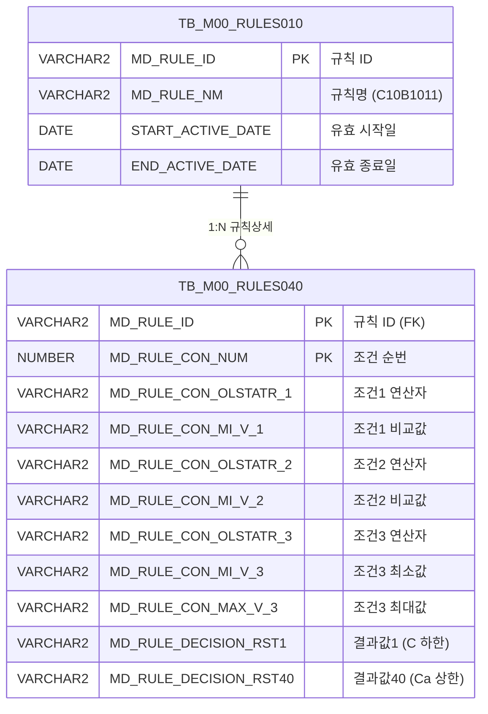

<h1 style="font-size: 40px; text-align: center; font-weight:
   bold; margin: 30px 0;">
  C107000030tab02 레거시 시스템 분석 종합 보고서
</h1>


# 1. 시스템 개요
- **서비스 ID**: C107000030tab02
- **업무명**: 규격성분사양 조회
- **분석 일시**: 2026-03-17 10:34 KST
- **분석 시간**: ~5분
- **전체 Activity 수**: 2개 (Built-in)
- **분석자**: Claude Opus 4.6 / Sonnet
- **분석 도구**: /analyze-service C107000030tab02
- **문서 버전**: 1.0

# 📊 비즈니스 프로세스 분석

## 시스템 목적

본 서비스는 **규격성분사양 조회** 화면으로, C10(냉연) 모듈의 규격 관리 화면(C107000030)의 탭 화면 중 하나이다. 의사결정 규칙 엔진(Rules Engine) 테이블 `TB_M00_RULES040`에 등록된 **C10B1011 규칙**의 규격별 성분 사양 데이터를 조회한다.

이 화면은 규격약호, 규격년도, 두께그룹의 3가지 조건에 따른 20개 화학성분(C, Si, Mn, P, S, Cr, Ni, Cu, Al, Ti, Nb, V, N, Mo, Sn, W, Co, B, Pb, Ca)의 하한/상한 기준값을 매트릭스 형태로 보여준다. 철강 제품의 화학 성분 규격 기준을 설정·관리하기 위한 참조 데이터 화면이며, 부모 화면(C107000030)의 검색 조건을 공유하여 탭 전환 시 자동으로 데이터를 조회한다.

## 주요 유즈케이스

### UC-01: 규격성분사양 조회
- **Actor**: 품질관리 담당자 / 공정기술 담당자
- **목적**: 특정 규격에 대한 화학 성분별 하한/상한 기준값을 조회하여 제품 생산 시 성분 규격 적합 여부를 확인

- **전제조건**:
  - 사용자가 시스템에 로그인되어 있음
  - 부모 화면(C107000030)에서 검색 조건이 설정되어 있음
  - C10B1011 규칙이 Rules Engine에 등록되어 있고 유효기간 내에 있음

- **주요 흐름**:
  1. 부모 화면(C107000030)에서 "규격성분사양" 탭을 클릭하여 진입
  2. 탭 화면 로딩 시 Grid XML 로딩 완료 후 `onLoadGrid` 자동 실행
  3. 부모 폼(C107000030_Form_1)의 검색 파라미터를 참조하여 `C107000030tab02.select` 쿼리 실행
  4. TB_M00_RULES040과 TB_M00_RULES010을 조인하여 C10B1011 규칙의 조건-결과 데이터 조회
  5. Grid에 규격약호/규격년도/두께그룹 조건별 20개 성분의 하한/상한 값을 매트릭스 형태로 표시

- **대체 흐름**:
  - 조회 결과가 없는 경우: 빈 Grid 표시
  - C10B1011 규칙이 유효기간 외인 경우: 데이터 없음 (WHERE 조건 미충족)

- **후행조건**:
  - 조회된 규격성분 데이터가 48컬럼 Grid에 표시됨
  - 사용자가 컨텍스트 메뉴를 통해 필터링, 컬럼 이동, Excel 내보내기 가능

### UC-02: 그리드 데이터 필터링 및 정렬
- **Actor**: 품질관리 담당자
- **목적**: 조회된 규격성분 데이터에서 특정 규격약호나 두께 범위에 해당하는 데이터만 필터링하여 확인

- **전제조건**:
  - Grid에 데이터가 조회되어 있음

- **주요 흐름**:
  1. 헤더의 텍스트 필터에 규격약호(MIN1) 또는 규격년도(MIN2) 입력
  2. 두께그룹(MIN3) 수치 필터로 특정 범위 지정
  3. 필터 조건에 맞는 행만 Grid에 표시

- **대체 흐름**:
  - 컨텍스트 메뉴 → "filter_grid" 선택으로 헤더 메뉴 활성화 후 컬럼별 정렬

- **후행조건**:
  - 필터링된 데이터만 Grid에 표시됨

### UC-03: Excel 내보내기
- **Actor**: 품질관리 담당자
- **목적**: 규격성분사양 데이터를 Excel 파일로 내보내어 보고서 작성이나 외부 시스템 활용에 사용

- **전제조건**:
  - Grid에 데이터가 조회되어 있음

- **주요 흐름**:
  1. Grid에서 마우스 우클릭하여 컨텍스트 메뉴 호출
  2. "excel_grid" 메뉴 항목 클릭
  3. `gridexcel` 서블릿 호출로 Excel 파일 생성 및 다운로드

- **대체 흐름**:
  - 데이터가 없는 경우: 빈 Excel 파일 다운로드

- **후행조건**:
  - 색상 정보 포함된 Excel 파일이 사용자 PC에 다운로드됨

---
## 비즈니스 로직 상세

### 1. 규칙 엔진 기반 성분 사양 매핑

- **목적**: 의사결정 규칙 엔진(Rules Engine)에서 C10B1011 규칙을 기반으로 3개 조건(규격약호, 규격년도, 두께그룹)에 따른 40개 성분 결과값(하한/상한)을 매핑하여 조회
- **처리 케이스**:

  **[케이스 1: 유효 규칙 필터링]**
  ```
    조건: C10B1011 규칙 중 현재 날짜가 유효기간(START_ACTIVE_DATE ~ END_ACTIVE_DATE) 내인 것
    처리:
      1. TB_M00_RULES010에서 MD_RULE_NM = 'C10B1011' 조건으로 규칙 ID 조회
      2. START_ACTIVE_DATE <= SYSDATE AND SYSDATE < END_ACTIVE_DATE 조건으로 현재 유효한 규칙만 필터링
      3. 조회된 MD_RULE_ID로 TB_M00_RULES040과 INNER JOIN
  ```

  **[케이스 2: 조건-결과 매핑 구조]**
  ```
    조건: 각 RULES040 행은 3개 조건 + 40개 결과로 구성
    처리:
      1. 조건1(CON1/MIN1): 규격약호 - 연산자(=, LIKE 등)와 비교값
      2. 조건2(CON2/MIN2): 규격년도 - 연산자와 비교값
      3. 조건3(CON3/MIN3/MAX3): 두께그룹 - 연산자, 최소값, 최대값 (범위 조건)
      4. 결과(RST1~RST40): 20개 성분 × 하한/상한 = 40개 결과값
         - RST1/RST2: C(탄소) 하한/상한
         - RST3/RST4: Si(규소) 하한/상한
         - RST5/RST6: Mn(망간) 하한/상한
         - ... (이하 동일 패턴)
         - RST39/RST40: Ca(칼슘) 하한/상한
  ```

### 2. FUNC_GET_YEONSAN 함수 기반 연산자 변환

- **목적**: 조건3(두께그룹)의 연산자 코드를 사람이 읽을 수 있는 연산 기호로 변환
- **처리 케이스**:

  **[케이스 1: 연산자 코드 변환]**
  ```
    조건: MD_RULE_CON_OLSTATR_3 컬럼에 저장된 연산자 코드
    처리:
      1. UPPER() 함수로 대문자 변환
      2. M00APUSER.FUNC_GET_YEONSAN() 함수 호출로 연산 기호 변환
         (예: 'GE' → '>=', 'LE' → '<=' 등)
      3. CON3 컬럼에 변환된 연산 기호 표시
  ```

---

# 💾 데이터 요구사항

## 핵심 테이블

### 1. TB_M00_RULES040 (M00APUSER) - 의사결정 규칙 상세 (조건-결과 매핑)
| 컬럼명 | 타입 | PK | 설명 |
|--------|------|----|-----|
| MD_RULE_ID | VARCHAR2 | ✅ | 규칙 ID (FK → RULES010) |
| MD_RULE_CON_NUM | NUMBER | ✅ | 조건 순번 (SEQ) |
| MD_RULE_CON_OLSTATR_1 | VARCHAR2 | | 조건1 연산자 (규격약호) |
| MD_RULE_CON_MI_V_1 | VARCHAR2 | | 조건1 비교값 (규격약호 값) |
| MD_RULE_CON_OLSTATR_2 | VARCHAR2 | | 조건2 연산자 (규격년도) |
| MD_RULE_CON_MI_V_2 | VARCHAR2 | | 조건2 비교값 (규격년도 값) |
| MD_RULE_CON_OLSTATR_3 | VARCHAR2 | | 조건3 연산자 (두께그룹, FUNC_GET_YEONSAN으로 변환) |
| MD_RULE_CON_MI_V_3 | VARCHAR2 | | 조건3 최소값 (두께 하한) |
| MD_RULE_CON_MAX_V_3 | VARCHAR2 | | 조건3 최대값 (두께 상한) |
| MD_RULE_DECISION_RST1 | VARCHAR2 | | C 하한 |
| MD_RULE_DECISION_RST2 | VARCHAR2 | | C 상한 |
| MD_RULE_DECISION_RST3~RST40 | VARCHAR2 | | Si~Ca 하한/상한 (짝수번=하한, 홀수번=상한) |

### 2. TB_M00_RULES010 (M00APUSER) - 의사결정 규칙 마스터
| 컬럼명 | 타입 | PK | 설명 |
|--------|------|----|-----|
| MD_RULE_ID | VARCHAR2 | ✅ | 규칙 ID |
| MD_RULE_NM | VARCHAR2 | | 규칙명 (C10B1011) |
| START_ACTIVE_DATE | DATE | | 유효 시작일 |
| END_ACTIVE_DATE | DATE | | 유효 종료일 |

## 데이터 플로우

### 1. 조회
```
[규격성분사양 조회]
탭 진입 (부모 화면에서 탭 클릭)
→ C107000030tab02.select
  FROM M00APUSER.TB_M00_RULES040 RULES040
  INNER JOIN (
    SELECT MD_RULE_ID
    FROM M00APUSER.TB_M00_RULES010
    WHERE MD_RULE_NM = 'C10B1011'
      AND START_ACTIVE_DATE <= SYSDATE
      AND SYSDATE < END_ACTIVE_DATE
  ) RULES010
  ON RULES010.MD_RULE_ID = RULES040.MD_RULE_ID
→ M00APUSER.FUNC_GET_YEONSAN(UPPER(MD_RULE_CON_OLSTATR_3)) 호출로 연산자 코드 변환
→ Grid에 48컬럼 매트릭스 표시 (SEQ + 조건3개 + 결과40개)
```

## SQL 일람표
| SQL 이름 | 쿼리 ID | 타입 | 출처 | 테이블 |
|---------|---------|-----|-------|-------|
| 규격성분사양 조회 | C107000030tab02.select | SELECT | Service | TB_M00_RULES040, TB_M00_RULES010 |

## PL/SQL 함수/프로시저

| # | 호출명 | 유형 | 용도 | 상세 분석 |
|---|--------|------|------|----------|
| 1 | M00APUSER.FUNC_GET_YEONSAN | 스탠드얼론 함수 | 연산자 코드를 연산 기호로 변환 (BETWEEN1→<=값<=, BETWEEN2→<=값< 등) | [분석 보고서](../../../dbms/M00APUSER/function/FUNC_GET_YEONSAN_analysis_report.md) |

## ER 다이어그램 (핵심 관계)



관계 설명:
- TB_M00_RULES010이 규칙 마스터로 규칙 ID 기반 1:N 관계
- TB_M00_RULES040은 각 규칙의 조건-결과 상세 행을 관리
- FUNC_GET_YEONSAN 함수가 CON3 연산자 변환에 사용됨

---

# 🖥️ 사용자 인터페이스 요구사항

## 화면 레이아웃 상세

### Layout 구조
```javascript
// initLayout 미사용 - 절대좌표(absolute position) 배치
{
  type: "absolute",
  components: [
    {
      id: "C107000030tab02_Grid_1",
      type: "grid",
      position: { left: "0px", top: "0px", width: "976px", height: "492px" }
    },
    {
      id: "C107000030tab02_Form_1",
      type: "form",
      position: { left: "0px", top: "450px", width: "282px", height: "30px" },
      note: "비어있음 - 부모 폼(C107000030_Form_1) 참조"
    },
    {
      id: "C107000030tab02_messagebox",
      type: "messagebox",
      position: { left: "0px", top: "493px", width: "976px", height: "18px" }
    }
  ]
}
```

## 입출력 요소

### Form 컴포넌트
**C107000030tab02_Form_1**
- XML이 비어있음 (`<items/>` 만 존재)
- 검색 파라미터는 부모 화면의 `C107000030_Form_1`에서 전달됨
- 실제 검색 조건은 부모 폼의 파라미터를 `uiCommon.parameters4`로 참조

### Grid 컴포넌트

**C107000030tab02_Grid_1 (규격성분사양 매트릭스)**
- 편집 가능 여부: 아니오 (읽기 전용, 컨텍스트 메뉴로 편집 토글 가능)
- Split: 없음 (split=0)
- 스마트 렌더링: 활성화
- 컨텍스트 메뉴: 활성화
- 페이지셋: 활성화 (19행 단위)
- 3단 복합 헤더 (규격약호/규격년도/두께그룹 그룹 + 성분별 하한/상한)
- 주요 컬럼 (48개):

  **순번**:
  - SEQ: ro - 조건 순번 (4%, 우측정렬)

  **조건 - 규격약호**:
  - CON1: ro - 연산자 (5%, 중앙정렬)
  - MIN1: ro - 비교값 (15%, 좌측정렬, 텍스트 필터)

  **조건 - 규격년도**:
  - CON2: ro - 연산자 (5%, 중앙정렬)
  - MIN2: ro - 비교값 (6%, 중앙정렬, 텍스트 필터)

  **조건 - 두께그룹**:
  - CON3: ro - 연산자 (8%, 중앙정렬, FUNC_GET_YEONSAN 변환값)
  - MIN3: ron - 최소값 (6%, 우측정렬, 포맷 0.000, 수치 필터)
  - MAX3: ron - 최대값 (6%, 우측정렬, 포맷 0.000, 수치 필터)

  **성분 결과 (RST1~RST40, 각 6%, 중앙정렬, 포맷 0.0000)**:
  - RST1: ron - C 하한
  - RST2: ron - C 상한
  - RST3: ron - Si 하한
  - RST4: ron - Si 상한
  - RST5: ron - Mn 하한
  - RST6: ron - Mn 상한
  - RST7: ron - P 하한
  - RST8: ron - P 상한
  - RST9: ron - S 하한
  - RST10: ron - S 상한
  - RST11: ron - Cr 하한
  - RST12: ron - Cr 상한
  - RST13: ron - Ni 하한
  - RST14: ron - Ni 상한
  - RST15: ron - Cu 하한
  - RST16: ron - Cu 상한
  - RST17: ron - Al 하한
  - RST18: ron - Al 상한
  - RST19: ron - Ti 하한
  - RST20: ron - Ti 상한
  - RST21: ron - Nb 하한
  - RST22: ron - Nb 상한
  - RST23: ron - V 하한
  - RST24: ron - V 상한
  - RST25: ron - N 하한
  - RST26: ron - N 상한
  - RST27: ron - Mo 하한
  - RST28: ron - Mo 상한
  - RST29: ron - Sn 하한
  - RST30: ron - Sn 상한
  - RST31: ron - W 하한
  - RST32: ron - W 상한
  - RST33: ron - Co 하한
  - RST34: ron - Co 상한
  - RST35: ron - B 하한
  - RST36: ron - B 상한
  - RST37: ron - Pb 하한
  - RST38: ron - Pb 상한
  - RST39: ron - Ca 하한
  - RST40: ron - Ca 상한

## 화면 동작 흐름

### 1. 화면 초기 로딩 (탭 진입)
```
1. 부모 화면(C107000030)에서 "규격성분사양" 탭 클릭
2. C107000030tab02.jsp 로드
3. ui.initializeDHTMLX() 호출 - DHTMLX 컴포넌트 초기화
4. Grid XML(C107000030tab02_Grid_1.xml) 로딩 시작
5. Grid XML 로딩 완료 시 onXLE 이벤트 → onLoadGrid() 콜백 실행
6. uiCommon.parameters4('C107000030_Form_1','C107000030tab02_Grid_1', '' + 'find') 호출
   - 부모 폼(C107000030_Form_1)의 검색 조건을 파라미터로 구성
7. items['C107000030tab02_Grid_1'].loadData(findUrl) 실행
8. handleDataProcess.do → C107000030tab02-service 호출
9. PosDefaultRouter(분기) → FormSearch(조회) → C107000030tab02.select 쿼리 실행
10. Grid에 규격성분 데이터 표시
11. onXLE 이벤트 해제 (detachEvent) - 최초 1회만 자동 조회
```

### 2. 수동 조회 (부모 폼 조건 변경 후)
```
1. 부모 화면(C107000030)에서 검색 조건 변경
2. find(eventName, formDivObj, referenceItem) 함수 호출
3. uiCommon.parameters4('C107000030_Form_1','C107000030tab02_Grid_1', customparam + eventName)
4. items['C107000030tab02_Grid_1'].loadData(findUrl) 실행
5. C107000030tab02.select 쿼리 재실행
6. Grid 데이터 갱신
```

### 3. 컨텍스트 메뉴 조작
```
1. Grid 영역에서 마우스 우클릭
2. 컨텍스트 메뉴 표시 (contextmenu.xml 기반)
3. 메뉴 항목 선택에 따른 처리:
   - "move_grid": 컬럼 드래그 이동 활성화/비활성화
   - "filter_grid": 헤더 필터 메뉴 활성화
   - "editable_grid": 그리드 편집 모드 토글
   - "excel_grid": gridexcel 서블릿 호출하여 Excel 다운로드 (색상 포함)
```

## JavaScript 모듈

**C107000030tab02.jsp** (인라인 스크립트)
- find(eventName, formDivObj, referenceItem): 부모 폼 파라미터로 Grid 데이터 조회 (uiCommon.parameters4 호출)
- add(referenceItem): Grid에 새 행 추가
- remove(referenceItem): Grid에서 선택 행 삭제
- copy(referenceItem): Grid 행 클립보드 복사
- undo(referenceItem): 실행 취소
- redo(referenceItem): 다시 실행
- onGridContextMenuClick(id, gridObj, menuObj): 컨텍스트 메뉴 항목 처리 (컬럼이동, 필터, 편집, Excel)
- findMessage(referenceItem): appMsg 사용자 데이터를 messagebox에 표시
- onLoadGrid(): Grid XML 로딩 완료 후 자동 데이터 조회 실행 및 onXLE 이벤트 해제

## 주요 이벤트 핸들러

**onLoadGrid (Grid XML 로딩 완료)**
- 이벤트 타입: onXLE (XML Loading End)
- 처리 내용:
  1. 부모 폼(C107000030_Form_1) 파라미터 구성
  2. Grid 데이터 로딩 (find 명령 실행)
  3. onXLE 이벤트 해제 (detachEvent) - 최초 1회만 실행

**onGridContextMenuClick (컨텍스트 메뉴 클릭)**
- 이벤트 타입: Context Menu Click
- 처리 내용:
  1. 메뉴 항목 ID에 따라 분기 (move_grid, filter_grid, editable_grid, excel_grid)
  2. 체크박스 상태(getCheckboxState) 확인
  3. 해당 기능 활성화/비활성화 토글

**findMessage (메시지 표시)**
- 이벤트 타입: 서비스 응답 후 콜백
- 처리 내용:
  1. referenceItem의 getUserData에서 "appMsg" 추출
  2. uiCommon.message로 messagebox에 표시
  3. true 반환

---

# 📌 특이사항 및 주의사항

## 1. 부모 화면 의존적 탭 구조
- 이 화면은 독립적으로 동작하지 않으며, 부모 화면(C107000030)의 `C107000030_Form_1` 폼 파라미터에 전적으로 의존한다. `uiCommon.parameters4`의 첫 번째 인자가 부모 폼 ID이므로, 부모 폼이 없으면 검색 파라미터가 구성되지 않는다. 현대화 시 탭 간 파라미터 전달 메커니즘을 별도 설계해야 한다.

## 2. Rules Engine 테이블 활용 패턴
- 일반적인 업무 테이블 대신 범용 의사결정 규칙 엔진(TB_M00_RULES010/040)을 사용하여 규격성분 데이터를 관리한다. `MD_RULE_NM = 'C10B1011'`이라는 규칙명으로 식별하며, 유효기간(`START_ACTIVE_DATE ~ END_ACTIVE_DATE`) 기반으로 버전 관리가 이루어진다. 40개 결과 컬럼(RST1~RST40)을 20개 성분의 하한/상한 쌍으로 매핑하는 암묵적 규칙이 있어, 이 매핑 관계가 코드에 문서화되어 있지 않다.

## 3. FUNC_GET_YEONSAN 함수의 스키마 간 호출
- SQL에서 `M00APUSER.FUNC_GET_YEONSAN(UPPER(...))` 형태로 다른 스키마의 함수를 직접 호출한다. 이 함수는 연산자 코드를 연산 기호로 변환하는 역할이며, 현재 미분석 상태이다. 함수가 변경되거나 삭제되면 이 화면의 CON3 컬럼에 직접적인 영향을 미친다.

## 4. onXLE 이벤트 1회 실행 후 해제 패턴
- `onLoadGrid` 함수 내에서 `detachEvent(onXLE)`를 호출하여 최초 1회만 자동 조회를 수행하고 이후에는 이벤트를 해제한다. 이는 탭 전환 시마다 불필요한 자동 조회를 방지하기 위한 패턴이지만, 비표준적 접근으로 유지보수 시 혼동을 줄 수 있다.

## 5. 48컬럼 대량 데이터 그리드
- 단일 Grid에 48개 컬럼이 존재하며, 3단 복합 헤더를 사용한다. 수평 스크롤이 필수적이며, 스마트 렌더링이 활성화되어 있어 대량 데이터에서도 성능을 유지한다. 그러나 컬럼 너비가 %단위로 지정되어 있어 화면 크기에 따라 컬럼이 매우 좁아질 수 있다.

---

# 📚 참고 문서

- **Query SQL**: `src/query/C107000030tab02-query.glue_sql`
- **JSP**: `WebContents/C107000030tab02.jsp`
- **Service XML**: `src/service/C107000030tab02-service.xml`
- **Grid XML**: `WebContents/header/kr/C107000030tab02/C107000030tab02_Grid_1.xml`
- **Form XML**: `WebContents/header/kr/C107000030tab02/C107000030tab02_Form_1.xml`
