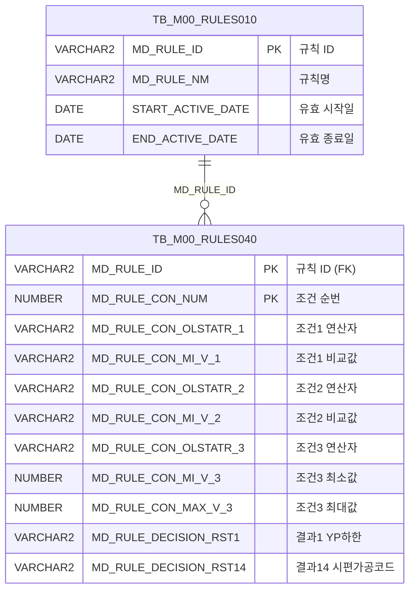

<h1 style="font-size: 40px; text-align: center; font-weight:
   bold; margin: 30px 0;">
  C107000030tab03 레거시 시스템 분석 종합 보고서
</h1>


# 1. 시스템 개요
- **서비스 ID**: C107000030tab03
- **업무명**: 규격재질사양
- **분석 일시**: 2026-03-17 10:38 KST
- **전체 Activity 수**: 2 (Built-in: 2, Custom: 0)
- **분석자**: Claude Opus 4.6
- **분석 도구**: /analyze-service C107000030tab03
- **문서 버전**: 1.0

# 📊 비즈니스 프로세스 분석

## 시스템 목적

C107000030tab03은 **규격재질사양** 조회 화면으로, 부모 화면 C107000030의 세 번째 탭(tab03)에 해당한다. C10 모듈(도금공정)에서 사용하는 규격별 재질 사양 기준을 조회하는 기능을 제공한다.

이 화면은 M00(마스터) 스키마의 **의사결정 규칙 엔진(RULES)** 테이블을 활용하여, 규칙 ID 'C10B1012'에 정의된 조건(규격약호, 규격년도, 두께그룹)과 그에 따른 14개 의사결정 결과값(YP/TS/EL/HRB/ERI 상하한값, 굴곡, 시편 정보 등)을 Grid로 표시한다. 조건값의 연산자(OLSTATR) 필드에 대해 `FUNC_GET_YEONSAN` 함수를 통해 연산자 코드를 사람이 읽을 수 있는 형태로 변환한다.

이 서비스는 읽기 전용 조회 서비스로, 데이터 변경(INSERT/UPDATE/DELETE) 기능은 없다. 조회 조건은 부모 탭(C107000030_Form_1)의 Form에서 상속받아 사용한다.

<!-- 단순 조회 서비스: Custom Activity 0개, SELECT 쿼리만 사용 → 워크플로우 다이어그램 생략 -->

## 주요 유즈케이스

### UC-01: 규격재질사양 조회
- **Actor**: 도금공정 품질 담당자 / 오퍼레이터
- **목적**: C10B1012 규칙에 정의된 규격별 재질 사양 기준(조건-결과 매핑)을 조회하여 제품 품질 기준을 확인

- **전제조건**:
  - 부모 화면 C107000030에 로그인 및 접근
  - tab03 탭이 활성화된 상태
  - M00APUSER.TB_M00_RULES010에 'C10B1012' 규칙이 유효 기간 내에 등록되어 있음

- **주요 흐름**:
  1. 탭 활성화 시 자동으로 onLoadGrid 이벤트 발생
  2. 부모 Form(C107000030_Form_1)의 파라미터를 uiCommon.parameters4로 구성
  3. C107000030tab03.select 쿼리 실행 — RULES010에서 C10B1012 규칙 ID 조회 후 RULES040과 조인
  4. 3개 조건(규격약호, 규격년도, 두께그룹)과 14개 결과값(YP/TS/EL/HRB/ERI 상하한, 굴곡, 시편 정보)을 Grid에 표시
  5. 조건3(CON3)의 연산자 코드는 FUNC_GET_YEONSAN 함수로 변환하여 표시

- **대체 흐름**:
  - C10B1012 규칙이 유효 기간 외인 경우: 빈 Grid 표시
  - 조회 결과 없음: 빈 Grid 표시, messagebox에 메시지 출력

- **후행조건**:
  - Grid에 규격재질사양 기준 데이터가 표시됨
  - 사용자가 컨텍스트 메뉴로 필터, 정렬, 엑셀 저장 등 부가 기능 사용 가능

### UC-02: 그리드 컨텍스트 메뉴 활용
- **Actor**: 도금공정 품질 담당자
- **목적**: 조회된 규격재질사양 데이터에 대해 컬럼 이동, 필터, 편집 모드 전환, 엑셀 저장 등 부가 기능 수행

- **전제조건**:
  - UC-01 완료 후 Grid에 데이터가 표시된 상태

- **주요 흐름**:
  1. Grid에서 마우스 우클릭하여 컨텍스트 메뉴 표시 (contextmenu.xml 기반)
  2. 원하는 기능 선택:
     - **move_grid**: 컬럼 드래그 이동 활성화/비활성화 (체크박스 토글)
     - **filter_grid**: 헤더 메뉴 필터 활성화
     - **editable_grid**: Grid 편집 모드 전환 (읽기전용 ↔ 편집가능)
     - **excel_grid**: 현재 Grid 데이터를 엑셀 파일로 저장

- **대체 흐름**:
  - 엑셀 저장 시 서버 연동 실패: 에러 메시지 표시

- **후행조건**:
  - 선택한 기능이 Grid에 적용됨

### UC-03: 부모 탭 조회 조건 변경 후 재조회
- **Actor**: 도금공정 품질 담당자
- **목적**: 부모 화면(C107000030)의 조회 조건을 변경한 후 규격재질사양 탭의 데이터를 갱신

- **전제조건**:
  - 부모 화면 C107000030에서 조회 조건(Form_1)이 변경된 상태

- **주요 흐름**:
  1. 부모 화면에서 조회 버튼 클릭 또는 find 이벤트 호출
  2. find 함수에서 C107000030_Form_1의 파라미터와 eventName을 customparam으로 결합
  3. uiCommon.parameters4로 Grid 조회 URL 구성
  4. C107000030tab03_Grid_1에 loadData로 데이터 재로드
  5. 갱신된 데이터가 Grid에 표시

- **대체 흐름**:
  - 조회 결과 없음: 빈 Grid로 갱신

- **후행조건**:
  - Grid에 변경된 조건에 맞는 규격재질사양 데이터 표시

---
## 비즈니스 로직 상세

### 1. 의사결정 규칙 엔진(RULES) 기반 재질사양 조회

- **목적**: C10B1012 규칙 ID를 기준으로 규격별 조건-결과 매핑 데이터를 조회하여 도금공정의 재질 사양 기준을 제공
- **처리 케이스**:

  **[케이스 1: 규칙 유효성 검증]**
  ```
    조건: RULES010 테이블에서 MD_RULE_NM = 'C10B1012'
    처리:
      1. START_ACTIVE_DATE <= SYSDATE AND SYSDATE < END_ACTIVE_DATE로 유효 기간 검증
      2. 유효한 MD_RULE_ID를 서브쿼리로 추출
      3. RULES040 테이블과 MD_RULE_ID로 조인
  ```

  **[케이스 2: 3개 조건 컬럼 매핑]**
  ```
    조건: 각 조건(CON1~CON3)에 대해 연산자와 비교값 쌍으로 구성
    처리:
      1. CON1: MD_RULE_CON_OLSTATR_1 (규격약호 연산자) + MD_RULE_CON_MI_V_1 (규격약호 비교값)
      2. CON2: MD_RULE_CON_OLSTATR_2 (규격년도 연산자) + MD_RULE_CON_MI_V_2 (규격년도 비교값)
      3. CON3: FUNC_GET_YEONSAN(UPPER(MD_RULE_CON_OLSTATR_3)) (두께그룹 연산자 - 함수 변환)
             + MD_RULE_CON_MI_V_3 (두께그룹 최소값) + MD_RULE_CON_MAX_V_3 (두께그룹 최대값)
  ```

  **[케이스 3: 14개 의사결정 결과 매핑]**
  ```
    조건: 조건 매칭 시 적용할 재질 사양값
    처리:
      1. RST1~RST14: MD_RULE_DECISION_RST1 ~ RST14
      2. 각 결과값은 YP 하한/상한, TS 하한/상한, EL 하한/상한,
         HRB 하한/상한, ERI 하한/상한, 굴곡, 시편채취위치, 시편채취길이, 시편가공코드에 매핑
  ```

### 2. 연산자 코드 변환 (FUNC_GET_YEONSAN)

- **목적**: 규칙 조건의 연산자 코드(OLSTATR)를 사람이 읽을 수 있는 연산자 기호로 변환
- **처리 케이스**:

  **[케이스 1: 연산자 변환]**
  ```
    조건: CON3 필드의 MD_RULE_CON_OLSTATR_3 값이 연산자 코드인 경우
    처리:
      1. UPPER() 함수로 대문자 변환
      2. M00APUSER.FUNC_GET_YEONSAN 스탠드얼론 함수 호출
      3. 연산자 코드 → 기호 변환 (예: 'EQ' → '=', 'GE' → '>=', 'LE' → '<=' 등 추정)
  ```

---

# 💾 데이터 요구사항

## 핵심 테이블

### 1. TB_M00_RULES040 - (의사결정 규칙 조건/결과 상세)
| 컬럼명 | 타입 | PK | 설명 |
|--------|------|----|-----|
| MD_RULE_ID | VARCHAR2 | ✅ | 규칙 ID (FK → RULES010) |
| MD_RULE_CON_NUM | NUMBER | ✅ | 조건 순번 (SEQ) |
| MD_RULE_CON_OLSTATR_1 | VARCHAR2 | | 조건1 연산자 (규격약호) |
| MD_RULE_CON_MI_V_1 | VARCHAR2 | | 조건1 비교값 (규격약호) |
| MD_RULE_CON_OLSTATR_2 | VARCHAR2 | | 조건2 연산자 (규격년도) |
| MD_RULE_CON_MI_V_2 | VARCHAR2 | | 조건2 비교값 (규격년도) |
| MD_RULE_CON_OLSTATR_3 | VARCHAR2 | | 조건3 연산자 (두께그룹) |
| MD_RULE_CON_MI_V_3 | NUMBER | | 조건3 최소값 (두께그룹 하한) |
| MD_RULE_CON_MAX_V_3 | NUMBER | | 조건3 최대값 (두께그룹 상한) |
| MD_RULE_DECISION_RST1 | VARCHAR2 | | 의사결정 결과1 (YP 하한값) |
| MD_RULE_DECISION_RST2 | VARCHAR2 | | 의사결정 결과2 (YP 상한값) |
| MD_RULE_DECISION_RST3 | VARCHAR2 | | 의사결정 결과3 (TS 하한값) |
| MD_RULE_DECISION_RST4 | VARCHAR2 | | 의사결정 결과4 (TS 상한값) |
| MD_RULE_DECISION_RST5 | VARCHAR2 | | 의사결정 결과5 (EL 하한값) |
| MD_RULE_DECISION_RST6 | VARCHAR2 | | 의사결정 결과6 (EL 상한값) |
| MD_RULE_DECISION_RST7 | VARCHAR2 | | 의사결정 결과7 (HRB 하한값) |
| MD_RULE_DECISION_RST8 | VARCHAR2 | | 의사결정 결과8 (HRB 상한값) |
| MD_RULE_DECISION_RST9 | VARCHAR2 | | 의사결정 결과9 (ERI 하한값) |
| MD_RULE_DECISION_RST10 | VARCHAR2 | | 의사결정 결과10 (ERI 상한값) |
| MD_RULE_DECISION_RST11 | VARCHAR2 | | 의사결정 결과11 (굴곡) |
| MD_RULE_DECISION_RST12 | VARCHAR2 | | 의사결정 결과12 (시편채취위치) |
| MD_RULE_DECISION_RST13 | VARCHAR2 | | 의사결정 결과13 (시편채취길이) |
| MD_RULE_DECISION_RST14 | VARCHAR2 | | 의사결정 결과14 (시편가공코드) |

### 2. TB_M00_RULES010 - (의사결정 규칙 마스터)
| 컬럼명 | 타입 | PK | 설명 |
|--------|------|----|-----|
| MD_RULE_ID | VARCHAR2 | ✅ | 규칙 ID |
| MD_RULE_NM | VARCHAR2 | | 규칙명 (예: 'C10B1012') |
| START_ACTIVE_DATE | DATE | | 유효 시작일 |
| END_ACTIVE_DATE | DATE | | 유효 종료일 |

## 데이터 플로우

### 1. 조회

```
[규격재질사양 조회 - 탭 활성화 시 자동 실행]
탭 활성화 (onLoadGrid)
→ C107000030tab03.select
  FROM M00APUSER.TB_M00_RULES040 RULES040
  INNER JOIN (SELECT MD_RULE_ID
              FROM M00APUSER.TB_M00_RULES010
              WHERE MD_RULE_NM = 'C10B1012'
                AND START_ACTIVE_DATE <= SYSDATE
                AND SYSDATE < END_ACTIVE_DATE) RULES010
    ON RULES010.MD_RULE_ID = RULES040.MD_RULE_ID
  -- CON3에 M00APUSER.FUNC_GET_YEONSAN(UPPER(MD_RULE_CON_OLSTATR_3)) 적용
→ Grid에 3개 조건 + 14개 결과값 표시

[부모 Form 조건 변경 후 재조회]
부모 Form(C107000030_Form_1) 조건 변경 → 조회 버튼 클릭
→ find() 함수 호출
→ uiCommon.parameters4('C107000030_Form_1', 'C107000030tab03_Grid_1', customparam + eventName)
→ C107000030tab03.select 재실행
→ Grid 데이터 갱신
```

## SQL 일람표

| SQL 이름 | 쿼리 ID | 타입 | 출처 | 테이블 |
|---------|---------|-----|-------|-------|
| 규격재질사양 조회 | C107000030tab03.select | SELECT | Service | TB_M00_RULES040, TB_M00_RULES010 |

## PL/SQL 함수/프로시저

| # | 호출명 | 유형 | 용도 | 상세 분석 |
|---|--------|------|------|----------|
| 1 | FUNC_GET_YEONSAN | 스탠드얼론 함수 | 연산자 코드(OLSTATR)를 사람이 읽을 수 있는 연산자 기호로 변환 | [분석 보고서](../../../dbms/M00APUSER/function/FUNC_GET_YEONSAN_analysis_report.md) |

## ER 다이어그램 (핵심 관계)



관계 설명:
- **TB_M00_RULES010**이 규칙 마스터로, 규칙명(C10B1012)과 유효 기간을 관리
- **TB_M00_RULES040**은 규칙 상세로, MD_RULE_ID를 통해 RULES010과 1:N 관계
- 각 규칙 조건 행(RULES040)은 3개 조건과 14개 결과값을 보유

---

# 🖥️ 사용자 인터페이스 요구사항

## 화면 레이아웃 상세

### Layout 구조
```
레이아웃 없이 div 기반 절대 배치 (position: absolute)
┌────────────────────────────────────────┐
│  Grid_1 (976×492px, top:0)              │
│  규격재질사양 그리드 (22컬럼)             │
│  3단 멀티헤더                            │
│                                         │
│                                         │
├────────────────────────────────────────┤
│  messagebox (976×18px, top:493)          │
└────────────────────────────────────────┘
  Form_1 (282×30px, top:450) - 빈 폼 (부모 Form에서 상속)
```

## 입출력 요소

### Form 컴포넌트
**C107000030tab03_Form_1**
- 필드 없음 (빈 Form) — 조회 파라미터는 부모 탭의 C107000030_Form_1에서 상속

### Grid 컴포넌트

**C107000030tab03_Grid_1 (규격재질사양)**
- 편집 가능 여부: 아니오 (읽기 전용, 컨텍스트 메뉴로 편집 모드 전환 가능)
- Split: 0 (고정 컬럼 없음)
- 스마트 렌더링: 활성화 (awaitedRowHeight: 22)
- 멀티셀렉트: 활성화
- 컨텍스트 메뉴: 활성화
- 페이징: 활성화 (rowCnt: 19)
- 날짜 포맷: %Y-%m-%d
- 컬럼 너비 단위: %
- 주요 컬럼 (22개):

  **3단 멀티 헤더 구조**:
  - 1행: SEQ | 규격약호(CON1+MIN1) | 규격년도(CON2+MIN2) | 두께그룹(CON3+MIN3+MAX3) | YP하한~시편가공코드(RST1~RST14)
  - 2행: (rspan) | 연산+비교값 | 연산+비교값 | 연산+비교값+비교값 | (rspan)
  - 3행: (rspan) | (필터) | (필터) | (숫자필터+숫자필터) | (rspan)

  **조건 정보**:
  - SEQ: ro - 조건 순번 (4%, 우측정렬, sort:str)
  - CON1: ro - 규격약호 연산자 (5%, 중앙정렬, sort:str)
  - MIN1: ro - 규격약호 비교값 (15%, 좌측정렬, sort:str, 텍스트필터)
  - CON2: ro - 규격년도 연산자 (5%, 중앙정렬, sort:str)
  - MIN2: ro - 규격년도 비교값 (6%, 중앙정렬, sort:str, 텍스트필터)
  - CON3: ro - 두께그룹 연산자 (8%, 중앙정렬, sort:str, FUNC_GET_YEONSAN 변환)
  - MIN3: ron - 두께그룹 최소값 (6%, 우측정렬, sort:str, format:0.000, 숫자필터)
  - MAX3: ron - 두께그룹 최대값 (6%, 우측정렬, sort:str, format:0.000, 숫자필터)

  **의사결정 결과 (재질 사양)**:
  - RST1: ron - YP 하한값 (6%, 중앙정렬, sort:str)
  - RST2: ro - YP 상한값 (6%, 중앙정렬, sort:str)
  - RST3: ro - TS 하한값 (6%, 중앙정렬, sort:str)
  - RST4: ro - TS 상한값 (6%, 중앙정렬, sort:str)
  - RST5: ro - EL 하한값 (6%, 중앙정렬, sort:str)
  - RST6: ro - EL 상한값 (6%, 중앙정렬, sort:str)
  - RST7: ro - HRB 하한값 (6%, 중앙정렬, sort:str)
  - RST8: ro - HRB 상한값 (6%, 중앙정렬, sort:str)
  - RST9: ro - ERI 하한값 (6%, 중앙정렬, sort:str)
  - RST10: ro - ERI 상한값 (6%, 중앙정렬, sort:str)
  - RST11: ro - 굴곡 (6%, 중앙정렬, sort:str)
  - RST12: ro - 시편채취위치 (6%, 중앙정렬, sort:str)
  - RST13: ro - 시편채취길이 (6%, 중앙정렬, sort:str)
  - RST14: ro - 시편가공코드 (6%, 중앙정렬, sort:str)

## 화면 동작 흐름

### 1. 화면 초기 로딩 (탭 활성화 시)
```
1. 부모 화면(C107000030)에서 tab03 탭 활성화
2. ui.initializeDHTMLX() 호출 → DHTMLX 컴포넌트 초기화
3. Grid_1에 onXLE 이벤트 등록 → onLoadGrid 핸들러 연결
4. Grid XML 로드 완료 시 onLoadGrid 자동 실행
5. uiCommon.parameters4('C107000030_Form_1', 'C107000030tab03_Grid_1', 'find')로 URL 구성
6. Grid_1.loadData(findUrl) → C107000030tab03-service 호출 → C107000030tab03.select 실행
7. 조회 결과를 Grid에 바인딩 (3단 멀티헤더 구조)
8. onXLE 이벤트 detach (중복 호출 방지)
```

### 2. 부모 Form 조건 변경 후 재조회
```
1. 부모 화면(C107000030)에서 조회 조건 변경
2. 부모의 find 이벤트가 tab03의 find() 함수 호출
3. find(eventName, formDivObj, referenceItem) 실행
4. uiCommon.parameters4('C107000030_Form_1', 'C107000030tab03_Grid_1', customparam + eventName)
5. Grid_1.loadData(findUrl) → 데이터 재조회
6. Grid 데이터 갱신
```

### 3. 컨텍스트 메뉴 활용
```
1. Grid에서 마우스 우클릭 → contextmenu.xml 기반 메뉴 표시
2. 메뉴 항목 선택:
   - move_grid: gridObj.enableColumnMove(isChecked) → 컬럼 드래그 이동 토글
   - filter_grid: gridObj.enableHeaderMenu() → 헤더 필터 메뉴 활성화
   - editable_grid: gridObj.setEditable(isChecked) → 읽기전용/편집 모드 전환
   - excel_grid: gridObj.toExcel('/gridexcel', 'color') → 엑셀 파일 저장
```

## JavaScript 모듈

**C107000030tab03.jsp** (인라인 스크립트)
- find(eventName, formDivObj, referenceItem): 조회 기능 (uiCommon.parameters4로 파라미터 구성 → Grid loadData)
- add(referenceItem): 신규 행 추가 (items[referenceItem].addRow())
- remove(referenceItem): 행 삭제 (items[referenceItem].removeRow())
- copy(referenceItem): 행 클립보드 복사 (items[referenceItem].copyRowContent())
- undo(referenceItem): 실행 취소
- redo(referenceItem): 다시 실행
- onGridContextMenuClick(id, gridObj, menuObj): 컨텍스트 메뉴 클릭 핸들러 (move/filter/editable/excel)
- findMessage(referenceItem): 메시지박스 표시 (uiCommon.message 호출, appMsg 사용자 데이터)
- onLoadGrid(): 그리드 초기 로드 (자동 조회 + onXLE detach)

## 주요 이벤트 핸들러

**find (조회 버튼 클릭)**
- 이벤트 타입: Form Find Button
- 처리 내용:
  1. customparam 빈 문자열 초기화
  2. uiCommon.parameters4('C107000030_Form_1', 'C107000030tab03_Grid_1', customparam + eventName) 호출
  3. items['C107000030tab03_Grid_1'].loadData(findUrl)로 데이터 로드

**onLoadGrid (Grid 초기 로드)**
- 이벤트 타입: onXLE (XML Load End)
- 처리 내용:
  1. uiCommon.parameters4로 'find' 이벤트 파라미터 구성
  2. Grid_1에 loadData 실행
  3. getDhxGrid().detachEvent(onXLE)로 이벤트 해제 (1회성 실행)

**onGridContextMenuClick (컨텍스트 메뉴)**
- 이벤트 타입: Context Menu Click
- 처리 내용:
  1. menuObj.getCheckboxState(id)로 체크 상태 확인
  2. id에 따라 분기: move_grid/filter_grid/editable_grid/excel_grid
  3. 각 기능 활성화/비활성화

---

# 📌 특이사항 및 주의사항

## 1. 부모 Form 참조 패턴
- tab03은 자체 Form에 필드가 없고, **부모 화면(C107000030)의 C107000030_Form_1**을 직접 참조하여 조회 파라미터를 구성한다
- `uiCommon.parameters4('C107000030_Form_1', ...)` — 자기 Form이 아닌 부모 Form ID를 하드코딩하여 사용
- 탭 간 Form 공유 패턴으로, 부모 Form 구조 변경 시 모든 하위 탭에 영향

## 2. 규칙 엔진(RULES) 기반 설계
- 단순 테이블 조회가 아닌 **M00 의사결정 규칙 엔진**(TB_M00_RULES010/040)을 활용
- 규칙명 'C10B1012'가 SQL에 **하드코딩**되어 있어, 규칙명 변경 시 쿼리 수정 필요
- 유효 기간(START_ACTIVE_DATE ~ END_ACTIVE_DATE)으로 규칙 버전 관리 — SYSDATE 기준으로 현재 유효한 규칙만 조회

## 3. FUNC_GET_YEONSAN 미분석 함수 의존성
- CON3 컬럼에서 M00APUSER.FUNC_GET_YEONSAN 스탠드얼론 함수를 호출하여 연산자 코드를 변환
- 이 함수는 현재 미분석 상태로, 내부 변환 로직(연산자 코드 → 기호 매핑)의 정확한 동작은 추가 분석 필요
- 함수에 UPPER()를 적용하여 대소문자 구분 없이 처리

## 4. onXLE 이벤트 1회성 실행 패턴
- Grid 초기 로드 시 onXLE(XML Load End) 이벤트를 등록하고, 로드 완료 후 즉시 detachEvent로 해제
- 이는 Grid XML 설정 로드 완료 후 자동 조회를 1회만 실행하기 위한 패턴
- `var onXLE = items['...'].onXLEEvent(onLoadGrid)` → 이벤트 ID를 변수에 저장하여 detach에 사용

## 5. 편집 기능 (읽기전용이지만 전환 가능)
- 기본적으로 모든 컬럼이 ro(읽기전용) 또는 ron(읽기전용 숫자)이지만, 컨텍스트 메뉴의 editable_grid로 편집 모드 전환 가능
- add/remove/copy/undo/redo 함수가 정의되어 있으나, 실제 저장(save) 서비스가 없어 편집 데이터의 영속화는 불가능
- 이는 프레임워크 표준 템플릿에서 불필요한 함수가 그대로 남아있는 것으로 추정

## 6. 두께그룹 조건의 범위값 구조
- 조건1(규격약호)과 조건2(규격년도)는 단일 비교값(MI_V)만 사용
- 조건3(두께그룹)은 **최소값(MI_V_3)과 최대값(MAX_V_3) 범위값**을 함께 사용하며, ron 타입으로 소수점 3자리(0.000) 포맷 적용
- Grid 3행 헤더에 #numeric_filter가 적용되어 숫자 범위 필터링 가능

---

# 📚 참고 문서

- **Query SQL**: `src/query/C107000030tab03-query.glue_sql`
- **Service XML**: `src/service/C107000030tab03-service.xml`
- **JSP**: `WebContents/C107000030tab03.jsp`
- **Grid XML**: `WebContents/header/kr/C107000030tab03/C107000030tab03_Grid_1.xml`
- **Form XML**: `WebContents/header/kr/C107000030tab03/C107000030tab03_Form_1.xml`
- **Messagebox XML**: `WebContents/header/kr/C107000030tab03/C107000030tab03_messagebox.xml`
- **공통 JS**: `WebContents/js/c10.ui.js`
