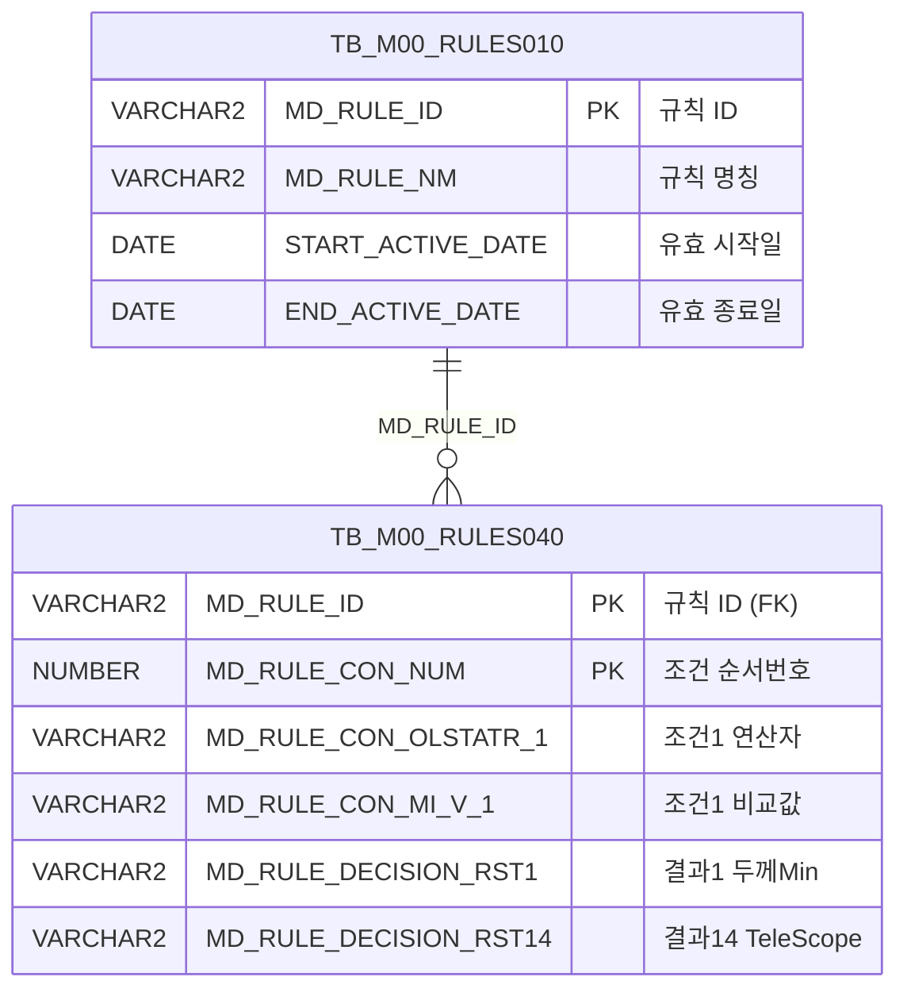

<h1 style="font-size: 40px; text-align: center; font-weight:
   bold; margin: 30px 0;">
  C107000030tab04 레거시 시스템 분석 종합 보고서
</h1>


# 1. 시스템 개요
- **서비스 ID**: C107000030tab04
- **업무명**: 규격인수도 (탭04)
- **분석 일시**: 2026-03-17 (KST)
- **전체 Activity 수**: 2 (Built-in: 2)
- **분석자**: Claude Opus 4.6 / Sonnet 4.6
- **분석 도구**: /analyze-service C107000030tab04
- **문서 버전**: 1.0

# 📊 비즈니스 프로세스 분석

## 시스템 목적

C107000030tab04 서비스는 C10(냉연) 공정의 **규격인수도 조건 및 의사결정 결과를 조회**하는 탭 화면이다. 상위 화면 C107000030의 4번째 탭으로, M00(마스터) 스키마의 규칙 엔진 테이블(`TB_M00_RULES010`, `TB_M00_RULES040`)에서 **C10B1013** 규칙 ID에 해당하는 인수도 규격 조건을 조회한다.

이 화면은 제품의 두께, 폭, 길이 등 물리적 규격에 대한 인수도 기준(조건 7개)과 그에 따른 의사결정 결과(반곡, 중곡, 외곡, 직선도, 직각도, 대각선공차, 급준도, TeleScope 등 14개)를 매트릭스 형태로 표시한다. 조건 항목 중 두께그룹(CON5)과 폭그룹(CON6)은 `FUNC_GET_YEONSAN` 함수를 통해 연산자 코드를 사람이 읽을 수 있는 연산 기호로 변환하여 표시한다.

Custom Activity가 없고 단순 조회(Router → FormSearch)로만 구성된 서비스이므로 워크플로우 다이어그램은 생략한다.

## 주요 유즈케이스

### UC-01: 규격인수도 조건 조회
- **Actor**: 품질관리 담당자, 공정 오퍼레이터
- **목적**: C10B1013 규칙에 등록된 규격인수도 조건과 의사결정 결과를 확인하여 제품 품질 판정 기준을 파악

- **전제조건**:
  - 사용자가 상위 화면 C107000030에 접근하여 탭04를 선택한 상태
  - TB_M00_RULES010에 C10B1013 규칙이 등록되어 있고 유효 기간 내에 있음

- **주요 흐름**:
  1. 탭04 선택 시 그리드 초기화 완료 이벤트(onXLEEvent) 발생
  2. 상위 탭의 Form(C107000030_Form_1)에서 검색 파라미터 참조
  3. C107000030tab04.select 쿼리 실행 — TB_M00_RULES010에서 C10B1013 규칙 ID 조회 후 TB_M00_RULES040과 조인
  4. 7개 조건(인수도규격, 품명, 제품형태, EDGE, 두께그룹, 폭그룹, 길이그룹)과 14개 결과(두께Min/Max, 폭Min/Max, 길이Min/Max, 반곡~TeleScope)가 Grid에 표시

- **대체 흐름**:
  - C10B1013 규칙이 유효 기간 외인 경우: 조회 결과 없음
  - FUNC_GET_YEONSAN 함수 호출 실패 시: 연산자 컬럼이 NULL로 표시

- **후행조건**:
  - 규격인수도 조건 매트릭스가 Grid에 표시됨
  - 사용자가 컨텍스트 메뉴를 통해 엑셀 내보내기 가능

### UC-02: 그리드 데이터 활용 (엑셀 내보내기)
- **Actor**: 품질관리 담당자
- **목적**: 조회된 규격인수도 조건을 엑셀로 내보내어 오프라인에서 활용

- **전제조건**:
  - Grid에 데이터가 로드되어 있음

- **주요 흐름**:
  1. Grid 영역에서 마우스 우클릭하여 컨텍스트 메뉴 표시
  2. "엑셀 내보내기" 항목 선택
  3. gridObj.toExcel('/gridexcel', 'color') 호출
  4. 서버에서 엑셀 파일 생성 후 다운로드

- **대체 흐름**:
  - 데이터 없는 상태에서 내보내기 시: 빈 엑셀 파일 생성

- **후행조건**:
  - 엑셀 파일이 사용자 PC에 다운로드됨

### UC-03: 그리드 컬럼 이동/편집 모드 전환
- **Actor**: 품질관리 담당자
- **목적**: 그리드 컬럼 순서를 변경하거나 편집 모드를 활성화하여 데이터 검토 편의성 향상

- **전제조건**:
  - Grid에 데이터가 로드되어 있음

- **주요 흐름**:
  1. Grid 영역에서 우클릭하여 컨텍스트 메뉴 표시
  2. "이동" 체크 시 컬럼 드래그 이동 활성화, "편집" 체크 시 셀 편집 활성화
  3. "필터" 체크 시 헤더 필터 메뉴 활성화

- **대체 흐름**:
  - 체크 해제 시 해당 기능 비활성화

- **후행조건**:
  - 사용자가 원하는 레이아웃으로 그리드를 커스터마이징한 상태

---
## 비즈니스 로직 상세

### 1. 규칙 엔진 기반 인수도 규격 조건 매핑

- **목적**: C10B1013 규칙에 정의된 7개 조건과 14개 의사결정 결과를 매트릭스 형태로 조회
- **처리 케이스**:

  **[케이스 1: 규칙 유효성 검증]**
  ```
    조건: TB_M00_RULES010에서 MD_RULE_NM = 'C10B1013'
    처리:
      1. START_ACTIVE_DATE <= SYSDATE 조건 확인
      2. SYSDATE < END_ACTIVE_DATE 조건 확인
      3. 유효 기간 내 규칙의 MD_RULE_ID 추출
      4. TB_M00_RULES040과 INNER JOIN하여 조건/결과 행 조회
  ```

  **[케이스 2: 연산자 코드 변환 (CON5, CON6)]**
  ```
    조건: 두께그룹(CON5), 폭그룹(CON6) 조건의 연산자 코드가 영문 코드로 저장됨
    처리:
      1. RULES040.MD_RULE_CON_OLSTATR_5 값을 UPPER 처리
      2. M00APUSER.FUNC_GET_YEONSAN 함수 호출하여 연산 기호로 변환
      3. 변환 결과를 CON5 컬럼에 표시 (예: 'GE' → '≥', 'LE' → '≤')
      4. CON6도 동일 방식으로 처리
  ```

  **[케이스 3: 조건별 범위값 구조]**
  ```
    조건 1~4 (인수도규격, 품명, 제품형태, EDGE):
      - 연산자(CON1~4) + 단일 비교값(MIN1~4) 구조
    조건 5~7 (두께그룹, 폭그룹, 길이그룹):
      - 연산자(CON5~7) + 최소값(MIN5~7) + 최대값(MAX5~7) 범위 구조
  ```

### 2. FUNC_GET_YEONSAN 함수를 통한 연산자 변환

- **목적**: 영문 연산자 코드를 수학적 연산 기호로 변환하여 가독성 향상
- **처리 케이스**:

  **[케이스 1: 연산자 코드 → 기호 변환]**
  ```
    처리:
      1. 입력값을 UPPER 처리하여 대문자로 통일
      2. M00APUSER.FUNC_GET_YEONSAN 함수에서 코드 매핑 수행
      3. 변환 예시: EQ → =, GE → ≥, LE → ≤, GT → >, LT → <, BETWEEN → ≤ X ≤
  ```

---

# 💾 데이터 요구사항

## 핵심 테이블

### 1. TB_M00_RULES010 - (규칙 마스터 테이블)
| 컬럼명 | 타입 | PK | 설명 |
|--------|------|----|------|
| MD_RULE_ID | VARCHAR2 | ✅ | 규칙 ID (PK) |
| MD_RULE_NM | VARCHAR2 | | 규칙 명칭 (예: C10B1013) |
| START_ACTIVE_DATE | DATE | | 규칙 유효 시작일 |
| END_ACTIVE_DATE | DATE | | 규칙 유효 종료일 |

### 2. TB_M00_RULES040 - (규칙 조건/결과 상세 테이블)
| 컬럼명 | 타입 | PK | 설명 |
|--------|------|----|------|
| MD_RULE_ID | VARCHAR2 | ✅ | 규칙 ID (FK → RULES010) |
| MD_RULE_CON_NUM | NUMBER | ✅ | 조건 순서번호 |
| MD_RULE_CON_OLSTATR_1 | VARCHAR2 | | 조건1 연산자 (인수도규격) |
| MD_RULE_CON_MI_V_1 | VARCHAR2 | | 조건1 비교값 |
| MD_RULE_CON_OLSTATR_2 | VARCHAR2 | | 조건2 연산자 (품명) |
| MD_RULE_CON_MI_V_2 | VARCHAR2 | | 조건2 비교값 |
| MD_RULE_CON_OLSTATR_3 | VARCHAR2 | | 조건3 연산자 (제품형태) |
| MD_RULE_CON_MI_V_3 | VARCHAR2 | | 조건3 비교값 |
| MD_RULE_CON_OLSTATR_4 | VARCHAR2 | | 조건4 연산자 (EDGE) |
| MD_RULE_CON_MI_V_4 | VARCHAR2 | | 조건4 비교값 |
| MD_RULE_CON_OLSTATR_5 | VARCHAR2 | | 조건5 연산자 코드 (두께그룹) |
| MD_RULE_CON_MI_V_5 | NUMBER | | 조건5 최소값 |
| MD_RULE_CON_MAX_V_5 | NUMBER | | 조건5 최대값 |
| MD_RULE_CON_OLSTATR_6 | VARCHAR2 | | 조건6 연산자 코드 (폭그룹) |
| MD_RULE_CON_MI_V_6 | NUMBER | | 조건6 최소값 |
| MD_RULE_CON_MAX_V_6 | NUMBER | | 조건6 최대값 |
| MD_RULE_CON_OLSTATR_7 | VARCHAR2 | | 조건7 연산자 (길이그룹) |
| MD_RULE_CON_MI_V_7 | NUMBER | | 조건7 최소값 |
| MD_RULE_CON_MAX_V_7 | NUMBER | | 조건7 최대값 |
| MD_RULE_DECISION_RST1 | VARCHAR2 | | 결과1 (두께Min) |
| MD_RULE_DECISION_RST2 | VARCHAR2 | | 결과2 (두께Max) |
| MD_RULE_DECISION_RST3 | VARCHAR2 | | 결과3 (폭Min) |
| MD_RULE_DECISION_RST4 | VARCHAR2 | | 결과4 (폭Max) |
| MD_RULE_DECISION_RST5 | VARCHAR2 | | 결과5 (길이Min) |
| MD_RULE_DECISION_RST6 | VARCHAR2 | | 결과6 (길이Max) |
| MD_RULE_DECISION_RST7 | VARCHAR2 | | 결과7 (반곡) |
| MD_RULE_DECISION_RST8 | VARCHAR2 | | 결과8 (중곡) |
| MD_RULE_DECISION_RST9 | VARCHAR2 | | 결과9 (외곡) |
| MD_RULE_DECISION_RST10 | VARCHAR2 | | 결과10 (직선도) |
| MD_RULE_DECISION_RST11 | VARCHAR2 | | 결과11 (직각도) |
| MD_RULE_DECISION_RST12 | VARCHAR2 | | 결과12 (대각선공차) |
| MD_RULE_DECISION_RST13 | VARCHAR2 | | 결과13 (급준도) |
| MD_RULE_DECISION_RST14 | VARCHAR2 | | 결과14 (TeleScope) |

## 데이터 플로우

### 1. 조회

```
[규격인수도 조건 조회]
탭04 진입 (onLoadGrid → 자동 조회)
→ C107000030tab04.select
  FROM M00APUSER.TB_M00_RULES040 RULES040
  INNER JOIN (SELECT MD_RULE_ID FROM M00APUSER.TB_M00_RULES010
              WHERE MD_RULE_NM = 'C10B1013'
              AND START_ACTIVE_DATE <= SYSDATE
              AND SYSDATE < END_ACTIVE_DATE) RULES010
  ON RULES010.MD_RULE_ID = RULES040.MD_RULE_ID
  → CON5, CON6: M00APUSER.FUNC_GET_YEONSAN() 호출하여 연산자 기호 변환
→ Grid_1에 조건(7개) + 결과(14개) 매트릭스 표시
```

## SQL 일람표

| SQL 이름 | 쿼리 ID | 타입 | 출처 | 테이블 |
|---------|---------|-----|-------|-------|
| 규격인수도 조건/결과 조회 | C107000030tab04.select | SELECT | Service | TB_M00_RULES040, TB_M00_RULES010 |

## PL/SQL 함수/프로시저

| # | 호출명 | 유형 | 용도 | 상세 분석 |
|---|--------|------|------|----------|
| 1 | FUNC_GET_YEONSAN | 함수 | 연산자 코드를 수학적 연산 기호로 변환 | [분석 보고서](../../../dbms/M00APUSER/function/FUNC_GET_YEONSAN_analysis_report.md) |

## ER 다이어그램 (핵심 관계)



관계 설명:
- TB_M00_RULES010이 규칙 마스터로 규칙 ID와 유효 기간을 관리
- TB_M00_RULES040이 규칙 상세로 MD_RULE_ID를 통해 1:N 관계 (한 규칙에 여러 조건 행)
- FUNC_GET_YEONSAN 함수는 M00APUSER 스키마에 소속된 독립 함수로, 연산자 코드 변환에 사용

---

# 🖥️ 사용자 인터페이스 요구사항

## 화면 레이아웃 상세

### Layout 구조 (Flat 배치)
```javascript
{
  itemType: "flat",
  description: "레이아웃 컴포넌트 없이 개별 div에 직접 배치",
  components: [
    {
      id: "C107000030tab04_Grid_1",
      type: "grid",
      position: { left: 0, top: 0, width: 976, height: 492 }
    },
    {
      id: "C107000030tab04_messagebox",
      type: "messagebox",
      position: { left: 0, top: 493, width: 976, height: 18 }
    },
    {
      id: "C107000030tab04_Form_1",
      type: "form",
      position: { left: 0, top: 450, width: 282, height: 30 },
      note: "빈 Form - 검색 파라미터는 상위 탭 C107000030_Form_1에서 참조"
    }
  ]
}
```

## 입출력 요소

### Form 컴포넌트
**C107000030tab04_Form_1**
- Form XML이 비어있음 (`<items/>`) — 검색 조건 파라미터는 상위 탭의 `C107000030_Form_1`에서 참조
- `uiCommon.parameters4('C107000030_Form_1', ...)` 호출로 상위 Form의 파라미터를 직접 사용

### Grid 컴포넌트

**C107000030tab04_Grid_1 (규격인수도 조건/결과 매트릭스)**
- 편집 가능 여부: 아니오 (읽기 전용, 컨텍스트 메뉴로 편집 모드 전환 가능)
- Split: 0 (고정 컬럼 없음)
- 초기 표시 행수: 19행
- Smart Rendering: 활성화
- 컬럼 너비 단위: % (전체 대비 비율)
- 테이블 참조: C10B1013
- 3단 복합 헤더 구조
- 주요 컬럼 (32개):

  **순서번호**:
  - SEQ: ro - 조건 순서번호 (4%, 우측정렬)

  **인수도규격 조건 (조건 1~4: 연산자+단일비교값)**:
  - CON1: ro - 인수도규격 연산자 (5%, 중앙정렬)
  - MIN1: ro - 인수도규격 비교값 (15%, 좌측정렬)
  - CON2: ro - 품명 연산자 (5%, 중앙정렬)
  - MIN2: ro - 품명 비교값 (6%, 중앙정렬)
  - CON3: ro - 제품형태 연산자 (8%, 중앙정렬)
  - MIN3: ro - 제품형태 비교값 (6%, 중앙정렬)
  - CON4: ro - EDGE 연산자 (8%, 중앙정렬)
  - MIN4: ro - EDGE 비교값 (6%, 중앙정렬)

  **범위 조건 (조건 5~7: 연산자+최소값+최대값)**:
  - CON5: ro - 두께그룹 연산자 (8%, 중앙정렬) — FUNC_GET_YEONSAN 변환
  - MIN5: ron - 두께그룹 최소값 (6%, 우측정렬, 소수점 3자리)
  - MAX5: ron - 두께그룹 최대값 (6%, 우측정렬, 소수점 3자리)
  - CON6: ro - 폭그룹 연산자 (8%, 중앙정렬) — FUNC_GET_YEONSAN 변환
  - MIN6: ron - 폭그룹 최소값 (6%, 우측정렬)
  - MAX6: ron - 폭그룹 최대값 (6%, 우측정렬)
  - CON7: ro - 길이그룹 연산자 (8%, 중앙정렬)
  - MIN7: ron - 길이그룹 최소값 (6%, 우측정렬)
  - MAX7: ron - 길이그룹 최대값 (6%, 우측정렬)

  **의사결정 결과 (14개)**:
  - RST1: ron - 두께Min (6%, 중앙정렬)
  - RST2: ro - 두께Max (6%, 중앙정렬)
  - RST3: ro - 폭Min (6%, 중앙정렬)
  - RST4: ro - 폭Max (6%, 중앙정렬)
  - RST5: ro - 길이Min (6%, 중앙정렬)
  - RST6: ro - 길이Max (6%, 중앙정렬)
  - RST7: ro - 반곡 (6%, 중앙정렬)
  - RST8: ro - 중곡 (6%, 중앙정렬)
  - RST9: ro - 외곡 (6%, 중앙정렬)
  - RST10: ro - 직선도 (6%, 중앙정렬)
  - RST11: ro - 직각도 (6%, 중앙정렬)
  - RST12: ro - 대각선공차 (6%, 중앙정렬)
  - RST13: ro - 급준도 (6%, 중앙정렬)
  - RST14: ro - TeleScope (6%, 중앙정렬)

  **3단 헤더 구조**:
  - 1단: SEQ | 인수도규격 (CON1~MIN1 colspan) | 품명 (CON2~MIN2) | 제품형태 (CON3~MIN3) | EDGE (CON4~MIN4) | 두께그룹 (CON5~MAX5) | 폭그룹 (CON6~MAX6) | 길이그룹 (CON7~MAX7) | 결과 (RST1~RST14)
  - 2단: SEQ | 연산/비교값 | 연산/비교값 | 연산/비교값 | 연산/비교값 | 연산/비교값/비교값 | 연산/비교값/비교값 | 연산/비교값/비교값 | 두께Min~TeleScope 개별 컬럼
  - 3단: SEQ | text_filter | text_filter | text_filter | text_filter | numeric_filter 2개 | numeric_filter 2개 | numeric_filter 2개 | rspan (결과 컬럼)

## 화면 동작 흐름

### 1. 화면 초기 로딩 (탭 진입)
```
1. 상위 화면 C107000030에서 탭04 선택
2. C107000030tab04.jsp 로드
3. ui.initializeDHTMLX() 호출 — DHTMLX 컴포넌트 초기화
4. Grid_1 onXLEEvent(onLoadGrid) 이벤트 바인딩
5. 그리드 초기화 완료 시 onLoadGrid() 자동 실행:
   - uiCommon.parameters4('C107000030_Form_1', 'C107000030tab04_Grid_1', 'find') 호출
   - 상위 Form의 검색 조건을 파라미터로 구성
   - items['C107000030tab04_Grid_1'].loadData(findUrl) 실행
   - detachEvent(onXLE)로 초기 로딩 이벤트 1회만 실행되도록 제거
6. C107000030tab04.select 쿼리 결과가 Grid에 바인딩
7. 상태바(messagebox)에 appMsg 메시지 표시
```

### 2. 수동 조회 (find 버튼)
```
1. 상위 Form(C107000030_Form_1)에서 조건 변경
2. find 이벤트 발생 (상위 화면의 조회 버튼 클릭)
3. find(eventName, formDivObj, referenceItem) 함수 호출
4. uiCommon.parameters4('C107000030_Form_1', 'C107000030tab04_Grid_1', customparam + eventName)
5. items['C107000030tab04_Grid_1'].loadData(findUrl)
6. 서버에서 C107000030tab04.select 쿼리 실행
7. Grid에 결과 데이터 갱신
```

### 3. 컨텍스트 메뉴 활용
```
1. Grid 영역에서 마우스 우클릭
2. 컨텍스트 메뉴 표시 (contextmenu.xml 기반)
3. 메뉴 항목 선택:
   - move_grid: 컬럼 이동 토글 (enableColumnMove)
   - filter_grid: 헤더 필터 메뉴 활성화 (enableHeaderMenu)
   - editable_grid: 셀 편집 모드 토글 (setEditable)
   - excel_grid: 엑셀 내보내기 (toExcel)
4. onGridContextMenuClick(id, gridObj, menuObj) 핸들러에서 체크 상태에 따라 토글 처리
```

## JavaScript 모듈

**C107000030tab04.jsp** (인라인 스크립트)
- find(eventName, formDivObj, referenceItem): 조회 기능 — `uiCommon.parameters4('C107000030_Form_1', ...)` 호출 후 Grid 데이터 로드
- add(referenceItem): 신규 행 추가 (items[referenceItem].addRow())
- remove(referenceItem): 행 삭제 (items[referenceItem].removeRow())
- copy(referenceItem): 행 클립보드 복사 (items[referenceItem].copyRowContent())
- undo(referenceItem): 실행 취소 (items[referenceItem].undo())
- redo(referenceItem): 다시 실행 (items[referenceItem].redo())
- onGridContextMenuClick(id, gridObj, menuObj): 컨텍스트 메뉴 이벤트 처리 (이동/필터/편집/엑셀)
- findMessage(referenceItem): 메시지박스 표시 — `uiCommon.message('C107000030tab04_messagebox', ...)`
- onLoadGrid(): 그리드 초기화 완료 시 자동 조회 실행 및 이벤트 detach

**c10.ui.js** (공통 유틸리티 스크립트 — 외부 참조)

## 주요 이벤트 핸들러

**onXLEEvent → onLoadGrid (그리드 초기 로딩)**
- 이벤트 타입: Grid XLE (XML Load End) 이벤트
- 처리 내용:
  1. 상위 Form(C107000030_Form_1) 파라미터 구성
  2. Grid_1 데이터 자동 로드 (find 명령)
  3. detachEvent(onXLE)로 1회 실행 후 이벤트 제거

**onGridContextMenuClick (컨텍스트 메뉴 클릭)**
- 이벤트 타입: Grid Context Menu Click
- 처리 내용:
  1. menuObj.getCheckboxState(id)로 체크 상태 확인
  2. move_grid: enableColumnMove(true/false) 토글
  3. filter_grid: enableHeaderMenu() 활성화
  4. editable_grid: setEditable(true/false) 토글
  5. excel_grid: toExcel('/gridexcel', 'color') 엑셀 내보내기

**findMessage (메시지 표시)**
- 이벤트 타입: 조회 완료 후 콜백
- 처리 내용:
  1. referenceItem.getUserData("", "appMsg")로 서버 응답 메시지 추출
  2. uiCommon.message("C107000030tab04_messagebox", msg) 호출
  3. 상태바에 메시지 표시

---

# 📌 특이사항 및 주의사항

## 1. 상위 탭 Form 의존성
- 이 화면(C107000030tab04)은 **자체 Form이 비어있고**, 검색 파라미터를 상위 탭의 `C107000030_Form_1`에서 직접 참조한다. `uiCommon.parameters4('C107000030_Form_1', ...)` 호출로 상위 Form의 값을 가져오므로, 상위 Form 구조 변경 시 이 탭의 조회 기능에 직접적인 영향을 미친다.

## 2. 규칙 엔진 유효 기간 의존성
- SQL에서 `START_ACTIVE_DATE <= SYSDATE AND SYSDATE < END_ACTIVE_DATE` 조건으로 유효 기간을 검증한다. C10B1013 규칙의 유효 기간이 만료되면 **조회 결과가 0건**이 되어 사용자가 데이터를 볼 수 없다. 규칙 갱신 시 기존 규칙의 종료일과 신규 규칙의 시작일이 정확히 연계되어야 한다.

## 3. FUNC_GET_YEONSAN 함수 호출 (CON5, CON6에만 적용)
- 7개 조건 중 CON5(두께그룹)와 CON6(폭그룹)만 `FUNC_GET_YEONSAN` 함수를 통해 연산자 변환을 수행하고, 나머지 조건(CON1~4, CON7)은 원시 값을 그대로 표시한다. 이는 두께/폭 조건의 연산자가 영문 코드(예: GE, LE)로 저장되어 변환이 필요한 반면, 나머지는 이미 표시 가능한 형태로 저장되어 있음을 의미한다.

## 4. 초기 로딩 이벤트 1회 실행 패턴
- `onXLEEvent(onLoadGrid)`로 그리드 초기화 완료 시 자동 조회를 수행하고, 즉시 `detachEvent(onXLE)`로 이벤트를 제거하여 **최초 1회만 실행**되도록 구현했다. 이후 조회는 상위 Form의 find 이벤트를 통해 수동으로 수행된다.

## 5. M00APUSER 스키마 크로스 스키마 조회
- 이 서비스는 MESAPUSER 스키마의 `mesdao`를 사용하지만, 실제 SQL은 `M00APUSER.TB_M00_RULES010`, `M00APUSER.TB_M00_RULES040`, `M00APUSER.FUNC_GET_YEONSAN`을 직접 참조한다. 스키마 접두사를 명시적으로 사용하여 크로스 스키마 접근을 수행하고 있다.

---

# 📚 참고 문서

- **Query SQL**: `src/query/C107000030tab04-query.glue_sql`
- **Service XML**: `src/service/C107000030tab04-service.xml`
- **JSP**: `WebContents/C107000030tab04.jsp`
- **JS**: `WebContents/js/c10.ui.js` (공통 유틸리티)
- **Grid XML**: `WebContents/header/kr/C107000030tab04/C107000030tab04_Grid_1.xml`
- **Form XML**: `WebContents/header/kr/C107000030tab04/C107000030tab04_Form_1.xml`
- **PL/SQL 분석**: `docs/analysis/dbms/M00APUSER/function/FUNC_GET_YEONSAN_analysis_report.md`
