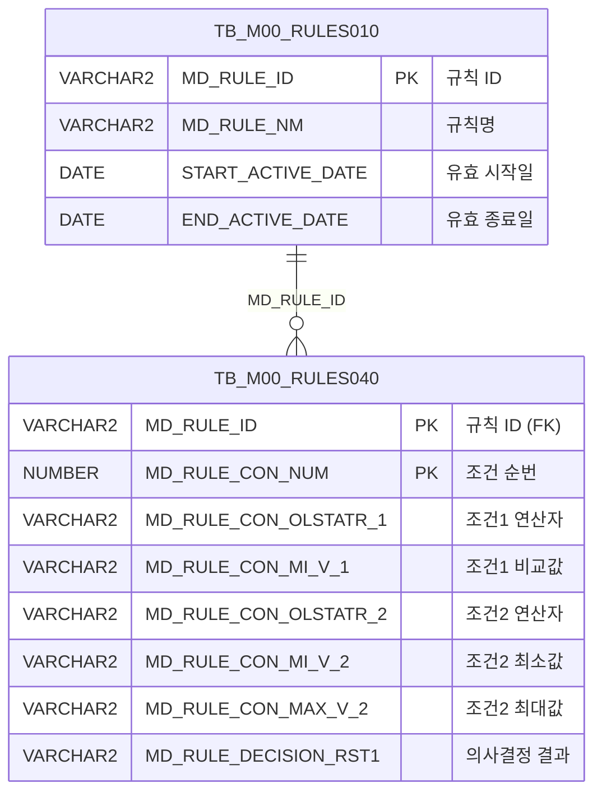

<h1 style="font-size: 40px; text-align: center; font-weight:
   bold; margin: 30px 0;">
  C107000030tab05 레거시 시스템 분석 종합 보고서
</h1>


# 1. 시스템 개요
- **서비스 ID**: C107000030tab05
- **업무명**: 규격별 주문용도 조회
- **분석 일시**: 2026-03-17 10:40 KST
- **분석 시간**: 약 3분
- **전체 Activity 수**: 2 (Built-in: 2, Custom: 0)
- **분석자**: Claude Opus 4.6 / Claude Sonnet 4.6
- **분석 도구**: /analyze-service C107000030tab05
- **문서 버전**: 1.0

# 📊 비즈니스 프로세스 분석

## 시스템 목적

C107000030tab05는 C10 모듈(동국제강 MES)의 **규격별 주문용도 관리 화면의 탭 화면**으로, 부모 화면 C107000030의 5번째 탭에 해당한다. 규칙엔진(Rules Engine) 기반의 의사결정 테이블 `C10B1014`를 조회하여, 규격약호·두께그룹·주문용도 3가지 조건에 대한 매칭 규칙과 그 결과(체크유무)를 그리드에 표시하는 단순 조회 전용 화면이다.

이 화면은 규격별 주문용도 판정 기준을 운영자가 확인할 수 있도록 제공하며, M00APUSER 스키마의 Rules Engine 테이블(TB_M00_RULES010, TB_M00_RULES040)에 정의된 조건-결과 매핑 데이터를 읽기 전용으로 표시한다. 두께그룹 조건의 연산자 값에는 `FUNC_GET_YEONSAN` 함수를 통해 UPPER 변환된 연산자 기호를 한글 연산명으로 치환하여 사용자 가독성을 높인다.

## 주요 유즈케이스

### UC-01: 규격별 주문용도 규칙 조회
- **Actor**: C10 공정 운영자
- **목적**: C10B1014 규칙에 정의된 규격약호/두께그룹/주문용도 조건별 체크 결과를 조회하여 현재 적용 중인 판정 기준 확인

- **전제조건**:
  - 사용자가 MES 시스템에 로그인되어 있음
  - 부모 화면 C107000030이 로딩되어 있음
  - TB_M00_RULES010에 `C10B1014` 규칙이 등록되어 있고, 현재 유효기간 내에 있음 (START_ACTIVE_DATE <= SYSDATE < END_ACTIVE_DATE)

- **주요 흐름**:
  1. 사용자가 부모 화면에서 5번째 탭(규격별 주문용도)을 선택
  2. 탭 활성화 시 `onLoadGrid` 이벤트에 의해 자동으로 조회 실행
  3. 시스템이 `C107000030tab05.select` 쿼리를 실행하여 C10B1014 규칙의 조건-결과 매핑 데이터 조회
  4. 3개 조건(규격약호 연산/비교값, 두께그룹 연산/비교값 범위, 주문용도 연산/비교값)과 1개 결과(체크유무)를 Grid에 표시

- **대체 흐름**:
  - C10B1014 규칙이 유효기간 만료된 경우: 조회 결과 0건, 빈 그리드 표시
  - 부모 화면 Form에서 조회 조건 변경 후 재조회 시: `find` 함수를 통해 C107000030_Form_1 파라미터 기반 재조회

- **후행조건**:
  - 규칙 데이터가 Grid에 표시됨 (읽기 전용)
  - 사용자가 컨텍스트 메뉴를 통해 엑셀 내보내기 가능

### UC-02: 그리드 데이터 엑셀 내보내기
- **Actor**: C10 공정 운영자
- **목적**: 조회된 규칙 데이터를 엑셀 파일로 내보내어 오프라인 참조 또는 보고 목적으로 활용

- **전제조건**:
  - 그리드에 조회 데이터가 표시되어 있음

- **주요 흐름**:
  1. 그리드에서 마우스 우클릭하여 컨텍스트 메뉴 활성화
  2. "엑셀 내보내기" 메뉴 항목 선택
  3. `onGridContextMenuClick` 핸들러에서 `toExcel` 기능 실행
  4. 현재 그리드 데이터가 엑셀 파일로 다운로드

- **대체 흐름**:
  - 조회 데이터가 없는 경우: 빈 엑셀 파일 생성

- **후행조건**:
  - 엑셀 파일이 사용자 PC에 다운로드됨

### UC-03: 그리드 데이터 필터링
- **Actor**: C10 공정 운영자
- **목적**: 다량의 규칙 데이터 중 특정 조건에 해당하는 행만 필터링하여 확인

- **전제조건**:
  - 그리드에 조회 데이터가 표시되어 있음

- **주요 흐름**:
  1. 그리드 3번째 헤더 행의 필터 영역에 텍스트 또는 숫자 입력
  2. MIN1(규격약호 비교값) 컬럼: 텍스트 필터로 규격약호 검색
  3. MIN2/MAX2(두께그룹 비교값) 컬럼: 숫자 필터로 두께 범위 검색
  4. MIN3(주문용도 비교값) 컬럼: 텍스트 필터로 주문용도 검색
  5. 필터 조건에 맞는 행만 그리드에 표시

- **대체 흐름**:
  - 필터 조건에 해당하는 행이 없는 경우: 빈 그리드 표시

- **후행조건**:
  - 필터링된 결과가 그리드에 표시됨

---
## 비즈니스 로직 상세

### 1. 규칙엔진 기반 조건-결과 매핑 조회

- **목적**: Rules Engine(TB_M00_RULES010/040)에 정의된 C10B1014 규칙의 3가지 조건과 1가지 의사결정 결과를 조회하여 규격별 주문용도 판정 기준을 제공
- **처리 케이스**:

  **[케이스 1: 유효 규칙 조회]**
  ```
    조건: TB_M00_RULES010에서 MD_RULE_NM = 'C10B1014'이고
          START_ACTIVE_DATE <= SYSDATE < END_ACTIVE_DATE인 규칙 존재
    처리:
      1. RULES010에서 유효한 C10B1014 규칙의 MD_RULE_ID 조회
      2. RULES040과 MD_RULE_ID로 조인하여 조건/결과 상세 조회
      3. 조건1(규격약호): 연산자(CON1) + 비교값(MIN1)
      4. 조건2(두께그룹): 연산자(CON2) + 최소값(MIN2) + 최대값(MAX2)
      5. 조건3(주문용도): 연산자(CON3) + 비교값(MIN3)
      6. 의사결정 결과(RST1): 체크유무
  ```

  **[케이스 2: 유효 규칙 없음]**
  ```
    조건: C10B1014 규칙이 유효기간 만료 또는 미등록
    처리:
      1. 서브쿼리(RULES010) 결과 0건
      2. 조인 결과 없음 → 빈 결과셋 반환
  ```

### 2. 연산자 기호→한글 변환 (FUNC_GET_YEONSAN)

- **목적**: 규칙 조건의 연산자 코드(영문 기호)를 한글 연산명으로 변환하여 사용자 가독성 향상
- **처리 케이스**:

  **[케이스 1: 연산자 변환]**
  ```
    조건: MD_RULE_CON_OLSTATR_2 (두께그룹 연산자) 값이 존재
    처리:
      1. UPPER() 함수로 대문자 통일
      2. M00APUSER.FUNC_GET_YEONSAN() 함수 호출
      3. 연산자 기호를 한글명으로 변환 (예: '>=' → '이상', '<=' → '이하' 등)
      4. 변환된 한글 연산명을 CON2 컬럼으로 반환
  ```

  **[케이스 2: NULL 처리]**
  ```
    조건: MD_RULE_CON_OLSTATR_2가 NULL
    처리:
      1. UPPER(NULL) = NULL
      2. FUNC_GET_YEONSAN(NULL) 호출 시 NULL 또는 빈 문자열 반환
  ```

---

# 💾 데이터 요구사항

## 핵심 테이블

### 1. TB_M00_RULES010 - (규칙 마스터)
| 컬럼명 | 타입 | PK | 설명 |
|--------|------|----|-----|
| MD_RULE_ID | VARCHAR2 | ✅ | 규칙 ID (PK) |
| MD_RULE_NM | VARCHAR2 |  | 규칙명 (예: 'C10B1014') |
| START_ACTIVE_DATE | DATE |  | 유효 시작일 |
| END_ACTIVE_DATE | DATE |  | 유효 종료일 |

### 2. TB_M00_RULES040 - (규칙 조건/결과 상세)
| 컬럼명 | 타입 | PK | 설명 |
|--------|------|----|-----|
| MD_RULE_ID | VARCHAR2 | ✅ | 규칙 ID (FK → RULES010) |
| MD_RULE_CON_NUM | NUMBER | ✅ | 조건 순번 |
| MD_RULE_CON_OLSTATR_1 | VARCHAR2 |  | 조건1 연산자 (규격약호) |
| MD_RULE_CON_MI_V_1 | VARCHAR2 |  | 조건1 비교값 (규격약호) |
| MD_RULE_CON_OLSTATR_2 | VARCHAR2 |  | 조건2 연산자 (두께그룹) |
| MD_RULE_CON_MI_V_2 | VARCHAR2 |  | 조건2 최소값 (두께그룹) |
| MD_RULE_CON_MAX_V_2 | VARCHAR2 |  | 조건2 최대값 (두께그룹) |
| MD_RULE_CON_OLSTATR_3 | VARCHAR2 |  | 조건3 연산자 (주문용도) |
| MD_RULE_CON_MI_V_3 | VARCHAR2 |  | 조건3 비교값 (주문용도) |
| MD_RULE_DECISION_RST1 | VARCHAR2 |  | 의사결정 결과1 (체크유무) |

## 데이터 플로우

### 1. 조회

```
[규격별 주문용도 규칙 조회]
탭 활성화 / 조회 버튼 클릭
→ C107000030tab05.select
  FROM M00APUSER.TB_M00_RULES040 RULES040
  INNER JOIN (SELECT MD_RULE_ID
              FROM M00APUSER.TB_M00_RULES010
              WHERE MD_RULE_NM='C10B1014'
                AND START_ACTIVE_DATE <= SYSDATE
                AND SYSDATE < END_ACTIVE_DATE) RULES010
    ON RULES010.MD_RULE_ID = RULES040.MD_RULE_ID
  ※ CON2 컬럼: FUNC_GET_YEONSAN(UPPER(MD_RULE_CON_OLSTATR_2))로 연산자 한글 변환
→ Grid에 조건(규격약호/두께그룹/주문용도) + 결과(체크유무) 표시
```

## SQL 일람표
| SQL 이름 | 쿼리 ID | 타입 | 출처 | 테이블 |
|---------|---------|-----|-------|-------|
| 규격별 주문용도 규칙 조회 | C107000030tab05.select | SELECT | Service | TB_M00_RULES040, TB_M00_RULES010 |

## PL/SQL 함수/프로시저
| # | 호출명 | 유형 | 용도 | 상세 분석 |
|---|--------|------|------|----------|
| 1 | M00APUSER.FUNC_GET_YEONSAN | 함수 | 연산자 기호를 한글 연산명으로 변환 | [분석 보고서](../../../dbms/M00APUSER/function/FUNC_GET_YEONSAN_analysis_report.md) |

## ER 다이어그램 (핵심 관계)



관계 설명:
- **TB_M00_RULES010**이 규칙 마스터로 규칙의 유효기간과 명칭을 관리
- **TB_M00_RULES040**이 조건/결과 상세로, MD_RULE_ID를 통해 RULES010과 1:N 관계
- 하나의 규칙(C10B1014)에 여러 조건-결과 행이 매핑됨

---

# 🖥️ 사용자 인터페이스 요구사항

## 화면 레이아웃 상세

### Layout 구조 (absolute 배치)
```javascript
{
  type: "absolute",       // 절대 위치 배치
  title: "규격별 주문용도",
  components: [
    {
      id: "C107000030tab05_Grid_1",
      type: "grid",
      position: { left: 0, top: 0, width: 976, height: 492 }
    },
    {
      id: "C107000030tab05_Form_1",
      type: "form",
      position: { left: 0, top: 450, width: 282, height: 30 }
      // 빈 Form - 부모 화면 C107000030_Form_1의 파라미터 참조
    },
    {
      id: "C107000030tab05_messagebox",
      type: "messagebox",
      position: { left: 0, top: 493, width: 976, height: 18 }
    }
  ]
}
```

## 입출력 요소

### Form 컴포넌트
**C107000030tab05_Form_1**
- 빈 Form (자체 필드 없음) - 부모 화면 C107000030_Form_1의 조회 파라미터를 참조하여 데이터 로드

### Grid 컴포넌트

**C107000030tab05_Grid_1 (규격별 주문용도 그리드)**
- 편집 가능 여부: 아니오 (모든 컬럼 읽기 전용)
- Split: 0 (고정 컬럼 없음)
- 3단 헤더 구조 (그룹핑 + 연산/비교값 + 필터)
- 컨텍스트 메뉴, 페이지셋 기능 활성화
- 주요 컬럼 (9개):

  **순번**:
  - SEQ: ro - 조건 순번 (4%, 우측정렬)

  **규격약호**:
  - CON1: ro - 규격약호 연산자 (5%, 중앙정렬)
  - MIN1: ro - 규격약호 비교값 (15%, 좌측정렬, 텍스트 필터)

  **두께그룹**:
  - CON2: ro - 두께그룹 연산자 (5%, 중앙정렬) ※ FUNC_GET_YEONSAN 변환값
  - MIN2: ro - 두께그룹 최소값 (6%, 중앙정렬, 숫자 필터)
  - MAX2: ro - 두께그룹 최대값 (6%, 중앙정렬, 숫자 필터)

  **주문용도**:
  - CON3: ro - 주문용도 연산자 (5%, 중앙정렬)
  - MIN3: ro - 주문용도 비교값 (12%, 중앙정렬, 텍스트 필터)

  **체크유무**:
  - RST1: ron - 의사결정 결과 (6%, 중앙정렬)

### Messagebox 컴포넌트
**C107000030tab05_messagebox**
- 상태바 역할 (976x18px)
- 조회 결과 건수 등 앱 메시지 표시

## 화면 동작 흐름

### 1. 화면 초기 로딩
```
1. 부모 화면 C107000030에서 5번째 탭 선택
2. C107000030tab05.jsp 로드
3. pageConfiguration 기반 absolute 레이아웃 초기화
4. C107000030tab05_Grid_1 초기화 (XML 로드)
5. onLoadGrid 이벤트 발생 → find 함수 자동 호출
6. C107000030_Form_1 파라미터로 handleDataProcess.do 서비스 호출
7. C107000030tab05.select 쿼리 실행
8. Grid에 규격별 주문용도 규칙 데이터 표시
9. messagebox에 조회 결과 메시지 표시
```

### 2. 수동 조회 (부모 화면 조회 버튼)
```
1. 부모 화면 C107000030의 Form_1에서 조회 조건 변경
2. 조회 버튼 클릭 → find 함수 호출
3. C107000030_Form_1 파라미터 수집
4. handleDataProcess.do → C107000030tab05-service 호출
5. PosDefaultRouter(분기) → FormSearch(조회) Activity 실행
6. C107000030tab05.select 쿼리 실행
7. Grid 데이터 갱신
8. messagebox에 조회 결과 건수 메시지 표시 (findMessage)
```

### 3. 컨텍스트 메뉴 동작
```
1. Grid 영역에서 마우스 우클릭
2. 컨텍스트 메뉴 표시 (컬럼 이동, 헤더 필터, 편집 토글, 엑셀 내보내기)
3. onGridContextMenuClick 핸들러 실행
4. 선택 항목에 따른 기능 수행:
   - enableColumnMove: 컬럼 드래그 이동 활성화
   - enableHeaderMenu: 헤더 필터 메뉴 활성화
   - setEditable: 편집 모드 토글 (기본 읽기 전용)
   - toExcel: 현재 그리드 데이터 엑셀 파일로 내보내기
```

## JavaScript 모듈

**C107000030tab05.jsp** (탭 화면 내장 스크립트)
- find(): 부모 화면 C107000030_Form_1 파라미터 기반 Grid 데이터 조회
- add(): 그리드 행 추가
- remove(): 그리드 행 삭제
- copy(): 그리드 행 클립보드 복사
- undo(): 실행 취소
- redo(): 다시 실행
- onGridContextMenuClick(id, zoneId, cas): 컨텍스트 메뉴 처리 (컬럼 이동, 필터, 편집 토글, 엑셀)
- findMessage(msg): 메시지박스에 앱 메시지 표시 (uiCommon.message 호출)
- onLoadGrid(): 그리드 초기 로드 완료 후 자동 조회 실행

## 주요 이벤트 핸들러

**find (조회)**
- 이벤트 타입: Form 조회 버튼 클릭 또는 onLoadGrid 콜백
- 처리 내용:
  1. 부모 화면 C107000030_Form_1에서 파라미터 수집
  2. handleDataProcess.do URL로 C107000030tab05-service 호출
  3. PosDefaultRouter → FormSearch Activity 실행
  4. C107000030tab05.select 쿼리로 규칙 데이터 조회
  5. Grid_1에 결과 바인딩

**onLoadGrid (그리드 로드 완료)**
- 이벤트 타입: Grid onXLE (XML Load End)
- 처리 내용:
  1. 그리드 초기화 완료 감지
  2. find 함수 자동 호출하여 데이터 로드

**onGridContextMenuClick (컨텍스트 메뉴)**
- 이벤트 타입: Grid 우클릭 메뉴 선택
- 처리 내용:
  1. 선택된 메뉴 ID 확인
  2. enableColumnMove / enableHeaderMenu / setEditable / toExcel 중 해당 기능 실행

---

# 📌 특이사항 및 주의사항

## 1. 부모-탭 화면 간 파라미터 공유 구조
- 이 화면(tab05)은 자체 Form 필드가 없으며, 부모 화면 C107000030의 `C107000030_Form_1` 파라미터를 참조하여 조회를 수행한다. Form XML이 빈 `<items/>`로 정의되어 있어, 탭 전환 시 부모 Form의 상태에 따라 조회 결과가 달라질 수 있다.

## 2. Rules Engine 기반 간접 참조
- SQL에서 직접 C10 모듈 테이블을 참조하지 않고, M00APUSER 스키마의 Rules Engine 테이블(TB_M00_RULES010/040)을 통해 'C10B1014' 규칙명으로 간접 참조한다. 규칙의 유효기간(START_ACTIVE_DATE ~ END_ACTIVE_DATE)에 의해 조회 결과가 시점에 따라 달라질 수 있으며, 규칙이 만료되면 조회 결과가 0건이 된다.

## 3. FUNC_GET_YEONSAN 함수를 통한 연산자 변환
- 두께그룹 조건의 연산자(CON2)만 `M00APUSER.FUNC_GET_YEONSAN(UPPER(...))` 함수를 통해 한글 변환되며, 규격약호 연산자(CON1)와 주문용도 연산자(CON3)는 원본 코드 그대로 표시된다. 이는 조건별 연산자 표현 방식이 일관되지 않아 사용자 혼란을 야기할 수 있다.

## 4. 읽기 전용이나 편집 관련 JS 함수 존재
- 모든 Grid 컬럼이 읽기 전용(ro/ron)으로 정의되어 있으나, `add()`, `remove()`, `copy()`, `undo()`, `redo()` 등 편집 관련 JavaScript 함수가 존재한다. 컨텍스트 메뉴의 `setEditable`로 편집 모드 전환이 가능할 수 있으나, 저장 서비스가 없으므로 실질적 데이터 수정은 불가능하다.

## 5. 조인 방식의 비표준 패턴
- SQL에서 서브쿼리를 인라인 뷰로 FROM 절에 배치하여 ANSI JOIN이 아닌 Oracle 전통 조인(WHERE 절 조인)을 사용한다. 현대적 SQL 스타일로 전환 시 INNER JOIN ... ON 구문으로 변경이 필요하다.

---

# 📚 참고 문서

- **Query SQL**: `src/query/C107000030tab05-query.glue_sql`
- **Service XML**: `src/service/C107000030tab05-service.xml`
- **JSP**: `WebContents/C107000030tab05.jsp`
- **PL/SQL 분석**: `docs/analysis/dbms/M00APUSER/function/FUNC_GET_YEONSAN_analysis_report.md`
