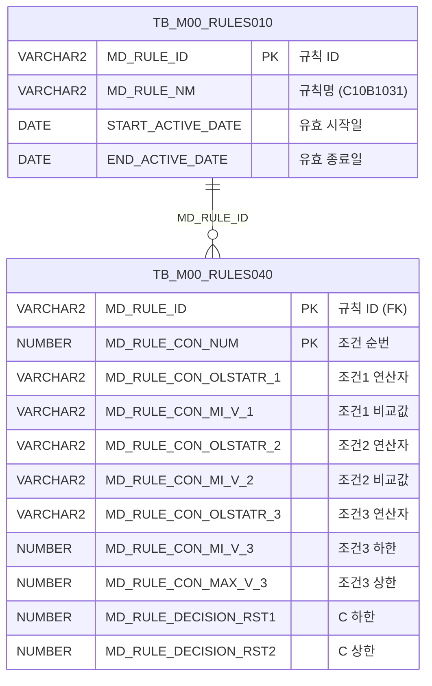

<h1 style="font-size: 40px; text-align: center; font-weight:
   bold; margin: 30px 0;">
  C107000030tab06 레거시 시스템 분석 종합 보고서
</h1>


# 1. 시스템 개요
- **서비스 ID**: C107000030tab06
- **업무명**: 사내성분사양
- **분석 일시**: 2026-03-17 10:42 KST
- **분석 시간**: ~3분
- **전체 Activity 수**: 2개 (Built-in 2개)
- **분석자**: Claude Opus 4.6 / Sonnet 4.6
- **분석 도구**: /analyze-service C107000030tab06
- **문서 버전**: 1.0

# 비즈니스 프로세스 분석

## 시스템 목적

C107000030tab06은 C10(냉연) 공정의 **사내 성분사양 조회 화면**으로, 상위 화면 C107000030(품명 관리)의 6번째 탭이다. 의사결정 규칙 엔진(RULES)에 등록된 **C10B1031 규칙**의 조건-결과 매핑 데이터를 조회하여 품명별 성분 사양 기준을 확인하는 용도이다.

이 화면은 M00APUSER 스키마의 의사결정 규칙 테이블(TB_M00_RULES010, TB_M00_RULES040)을 사용하여, C10B1031 규칙에 정의된 3개의 조건(품명, 재질기호, 두께그룹)과 20종 성분(C, Si, Mn, P, S, Cr, Ni, Cu, Al, Ti, Nb, V, N, Mo, Sn, W, Co, B, Pb, Ca)의 하한/상한 값 40개 결과를 매트릭스 형태로 표시한다. 읽기 전용 조회 화면이므로 데이터 수정 기능은 없다.

조건 컬럼 중 CON3(두께그룹 연산자)은 `FUNC_GET_YEONSAN` 함수를 통해 영문 연산자 코드를 한글 연산자명으로 변환하여 표시한다.

## 주요 유즈케이스

### UC-01: 사내 성분사양 조회
- **Actor**: 냉연 품질관리 담당자
- **목적**: C10B1031 규칙에 등록된 품명별 성분 사양 기준(하한/상한)을 확인하여 제품 품질 기준 관리

- **전제조건**:
  - 상위 화면 C107000030에 접속한 상태
  - C10B1031 규칙이 TB_M00_RULES010에 등록되어 있음
  - 규칙의 유효기간(START_ACTIVE_DATE ~ END_ACTIVE_DATE)이 현재 시점을 포함

- **주요 흐름**:
  1. 상위 화면 C107000030에서 tab06(사내성분사양) 탭 클릭
  2. Grid 로드 완료 시 `onLoadGrid` 이벤트 자동 실행
  3. 상위 Form(C107000030_Form_1)의 파라미터를 `uiCommon.parameters4`로 전달
  4. C107000030tab06.select 쿼리 실행 → TB_M00_RULES010에서 C10B1031 규칙 ID 조회 → TB_M00_RULES040에서 조건-결과 매핑 데이터 로드
  5. 48개 컬럼(SEQ, 조건3개, 결과40개) Grid에 표시

- **대체 흐름**:
  - C10B1031 규칙이 미등록 또는 유효기간 만료 시: 빈 Grid 표시
  - 조회 결과 없음: messagebox에 "조회된 데이터가 없습니다" 표시

- **후행조건**:
  - Grid에 성분 사양 기준 데이터가 표시됨
  - 사용자가 컨텍스트 메뉴를 통해 엑셀 다운로드 가능

### UC-02: 성분 사양 데이터 필터링
- **Actor**: 냉연 품질관리 담당자
- **목적**: 특정 품명/재질기호/두께그룹 조건에 해당하는 성분 사양만 필터링하여 확인

- **전제조건**:
  - UC-01에 의해 Grid에 데이터가 로드되어 있음

- **주요 흐름**:
  1. Grid 헤더의 텍스트 필터(품명 비교값, 재질기호 비교값)에 검색어 입력
  2. Grid 헤더의 숫자 필터(두께그룹 비교값)에 범위 입력
  3. 클라이언트 측 필터링으로 해당 조건 행만 표시

- **대체 흐름**:
  - 필터 조건에 해당하는 데이터 없음: 빈 Grid 표시

- **후행조건**:
  - 필터링된 데이터만 Grid에 표시됨

### UC-03: 성분 사양 데이터 엑셀 내보내기
- **Actor**: 냉연 품질관리 담당자
- **목적**: 성분 사양 데이터를 엑셀 파일로 다운로드하여 외부 활용

- **전제조건**:
  - UC-01에 의해 Grid에 데이터가 로드되어 있음

- **주요 흐름**:
  1. Grid 위에서 우클릭하여 컨텍스트 메뉴 표시
  2. "엑셀다운" 메뉴 선택 (`onGridContextMenuClick` → `excel_grid`)
  3. Grid 데이터가 엑셀 파일로 다운로드됨

- **대체 흐름**:
  - 데이터가 없는 상태에서 엑셀 다운로드 시도: 빈 엑셀 파일 생성

- **후행조건**:
  - 엑셀 파일이 사용자 PC에 다운로드됨

---
## 비즈니스 로직 상세

### 1. 의사결정 규칙 기반 성분 사양 조회

- **목적**: C10B1031 규칙 ID에 해당하는 조건-결과 매핑 데이터를 조회하여 품명/재질/두께 조건별 성분 하한/상한 기준을 제공
- **처리 케이스**:

  **[케이스 1: 유효 규칙 기반 조건-결과 매핑 조회]**
  ```
    조건: TB_M00_RULES010에서 MD_RULE_NM = 'C10B1031' AND 현재 시점이 유효기간 내
    처리:
      1. TB_M00_RULES010 서브쿼리로 C10B1031 규칙의 MD_RULE_ID 조회
         - START_ACTIVE_DATE <= SYSDATE < END_ACTIVE_DATE 조건으로 현재 유효한 규칙만 선택
      2. TB_M00_RULES040과 MD_RULE_ID로 조인하여 조건-결과 행 전체 조회
      3. 3개 조건 컬럼 추출:
         - CON1: MD_RULE_CON_OLSTATR_1 (품명 연산자)
         - MIN1: MD_RULE_CON_MI_V_1 (품명 비교값)
         - CON2: MD_RULE_CON_OLSTATR_2 (재질기호 연산자)
         - MIN2: MD_RULE_CON_MI_V_2 (재질기호 비교값)
         - CON3: FUNC_GET_YEONSAN(UPPER(MD_RULE_CON_OLSTATR_3)) (두께그룹 연산자 → 한글 변환)
         - MIN3: MD_RULE_CON_MI_V_3 (두께 하한)
         - MAX3: MD_RULE_CON_MAX_V_3 (두께 상한)
      4. 40개 결과 컬럼 추출: RST1~RST40 (MD_RULE_DECISION_RST1~RST40)
         - 20종 성분(C, Si, Mn, P, S, Cr, Ni, Cu, Al, Ti, Nb, V, N, Mo, Sn, W, Co, B, Pb, Ca) × 하한/상한 쌍
  ```

### 2. 연산자 코드 한글 변환 (FUNC_GET_YEONSAN)

- **목적**: 영문 연산자 코드(예: EQ, GE, LE 등)를 한글 연산자명으로 변환하여 사용자 가독성 향상
- **처리 케이스**:

  **[케이스 1: 연산자 변환]**
  ```
    조건: MD_RULE_CON_OLSTATR_3 값이 존재
    처리:
      1. UPPER() 함수로 대문자 변환
      2. M00APUSER.FUNC_GET_YEONSAN 함수 호출
      3. 변환 결과를 CON3 컬럼으로 표시
  ```

  **[분석 보고서 참조]**: [FUNC_GET_YEONSAN 상세 분석](../../../dbms/M00APUSER/function/FUNC_GET_YEONSAN_analysis_report.md)

---

# 데이터 요구사항

## 핵심 테이블

### 1. TB_M00_RULES010 - (의사결정 규칙 마스터)
| 컬럼명 | 타입 | PK | 설명 |
|--------|------|----|-----|
| MD_RULE_ID | VARCHAR2 | ✅ | 규칙 ID (PK) |
| MD_RULE_NM | VARCHAR2 |  | 규칙 이름 (예: 'C10B1031') |
| START_ACTIVE_DATE | DATE |  | 규칙 유효 시작일 |
| END_ACTIVE_DATE | DATE |  | 규칙 유효 종료일 |

### 2. TB_M00_RULES040 - (의사결정 규칙 조건-결과 매핑)
| 컬럼명 | 타입 | PK | 설명 |
|--------|------|----|-----|
| MD_RULE_ID | VARCHAR2 | ✅ | 규칙 ID (FK → RULES010) |
| MD_RULE_CON_NUM | NUMBER | ✅ | 조건 순번 (SEQ) |
| MD_RULE_CON_OLSTATR_1 | VARCHAR2 |  | 조건1 연산자 (품명) |
| MD_RULE_CON_MI_V_1 | VARCHAR2 |  | 조건1 비교값 (품명) |
| MD_RULE_CON_OLSTATR_2 | VARCHAR2 |  | 조건2 연산자 (재질기호) |
| MD_RULE_CON_MI_V_2 | VARCHAR2 |  | 조건2 비교값 (재질기호) |
| MD_RULE_CON_OLSTATR_3 | VARCHAR2 |  | 조건3 연산자 (두께그룹) |
| MD_RULE_CON_MI_V_3 | NUMBER |  | 조건3 하한값 (두께) |
| MD_RULE_CON_MAX_V_3 | NUMBER |  | 조건3 상한값 (두께) |
| MD_RULE_DECISION_RST1 | NUMBER |  | 결과1 - C하한 |
| MD_RULE_DECISION_RST2 | NUMBER |  | 결과2 - C상한 |
| MD_RULE_DECISION_RST3~RST40 | NUMBER |  | 결과3~40 - Si~Ca 하한/상한 |

## 데이터 플로우

### 1. 조회

```
[탭 진입 시 사내성분사양 자동 조회]
tab06 진입 (또는 상위 Form 조회 버튼 클릭)
→ C107000030tab06.select
  FROM M00APUSER.TB_M00_RULES040 RULES040
  INNER JOIN (SELECT MD_RULE_ID FROM M00APUSER.TB_M00_RULES010
              WHERE MD_RULE_NM = 'C10B1031'
              AND START_ACTIVE_DATE <= SYSDATE
              AND SYSDATE < END_ACTIVE_DATE) RULES010
    ON RULES010.MD_RULE_ID = RULES040.MD_RULE_ID
  -- CON3 컬럼: M00APUSER.FUNC_GET_YEONSAN(UPPER(MD_RULE_CON_OLSTATR_3)) 함수 호출
→ Grid_1에 조건 3개 + 결과 40개 = 48컬럼 매트릭스 표시
```

## SQL 일람표
| SQL 이름 | 쿼리 ID | 타입 | 출처 | 테이블 |
|---------|---------|-----|-------|-------|
| 사내성분사양 조회 | C107000030tab06.select | SELECT | Service | TB_M00_RULES040, TB_M00_RULES010 |

## PL/SQL 함수/프로시저
| # | 호출명 | 유형 | 용도 | 상세 분석 |
|---|--------|------|------|----------|
| 1 | FUNC_GET_YEONSAN | 함수 | 연산자 코드 → 한글 변환 | [분석 보고서](../../../dbms/M00APUSER/function/FUNC_GET_YEONSAN_analysis_report.md) |

## ER 다이어그램 (핵심 관계)



관계 설명:
- TB_M00_RULES010이 의사결정 규칙 마스터로 규칙 ID 및 유효기간 관리
- TB_M00_RULES040은 MD_RULE_ID를 FK로 참조하여 규칙별 조건-결과 매핑 데이터 저장 (1:N 관계)
- 조회 시 규칙명('C10B1031')과 유효기간 조건으로 RULES010에서 필터링 후 RULES040과 조인

---

# 사용자 인터페이스 요구사항

## 화면 레이아웃 상세

### Layout 구조
```javascript
{
  type: "absolute",  // 레이아웃 컨테이너 없이 절대 위치 배치
  components: [
    {
      id: "C107000030tab06_Grid_1",
      type: "grid",
      position: { left: 0, top: 0, width: 976, height: 492 }
    },
    {
      id: "C107000030tab06_messagebox",
      type: "messagebox",
      position: { left: 0, top: 493, width: 976, height: 18 }
    },
    {
      id: "C107000030tab06_Form_1",
      type: "form",
      position: { left: 0, top: 450, width: 282, height: 30 },
      note: "빈 Form - 상위 탭(C107000030_Form_1)에서 파라미터 전달"
    }
  ]
}
```

## 입출력 요소

### Form 컴포넌트
**C107000030tab06_Form_1**
- 빈 Form (XML이 `<items/>`)
- 상위 화면 C107000030_Form_1의 파라미터를 `uiCommon.parameters4`로 전달받아 사용

### Grid 컴포넌트

**C107000030tab06_Grid_1 (사내성분사양 매트릭스)**
- 편집 가능 여부: 아니오 (전체 읽기 전용)
- Split: 없음 (0)
- 헤더: 3단 구조 (1단: 조건/성분 대분류, 2단: 연산/비교값, 3단: 필터)
- 필터: 텍스트 필터(품명 비교값, 재질기호 비교값), 숫자 필터(두께 비교값)
- 컨텍스트 메뉴: 활성화 (컬럼이동, 헤더필터, 편집모드, 엑셀다운)
- 페이지셋: 활성화 (19행 단위)
- Smart Rendering: 활성화
- 주요 컬럼 (48개):

  **조건 컬럼 (SEQ + 조건 7개)**:
  - SEQ: ro - 조건 순번 (4%, 우측정렬)
  - CON1: ro - 품명 연산자 (5%, 중앙정렬)
  - MIN1: ro - 품명 비교값 (6%, 좌측정렬)
  - CON2: ro - 재질기호 연산자 (5%, 중앙정렬)
  - MIN2: ro - 재질기호 비교값 (6%, 중앙정렬)
  - CON3: ro - 두께그룹 연산자, FUNC_GET_YEONSAN 변환값 (8%, 중앙정렬)
  - MIN3: ron - 두께 하한값 (6%, 중앙정렬, 소수점 3자리)
  - MAX3: ron - 두께 상한값 (6%, 중앙정렬, 소수점 3자리)

  **성분 결과 컬럼 (RST1~RST40, 20종 성분 × 하한/상한)**:
  - RST1: ron - C 하한 (6%, 중앙정렬, 소수점 3자리)
  - RST2: ron - C 상한 (6%, 중앙정렬, 소수점 3자리)
  - RST3: ron - Si 하한 (6%, 중앙정렬, 소수점 3자리)
  - RST4: ron - Si 상한 (6%, 중앙정렬, 소수점 3자리)
  - RST5: ron - Mn 하한 (6%, 중앙정렬, 소수점 3자리)
  - RST6: ron - Mn 상한 (6%, 중앙정렬, 소수점 3자리)
  - RST7: ron - P 하한 (6%, 중앙정렬, 소수점 3자리)
  - RST8: ron - P 상한 (6%, 중앙정렬, 소수점 3자리)
  - RST9: ron - S 하한 (6%, 중앙정렬, 소수점 3자리)
  - RST10: ron - S 상한 (6%, 중앙정렬, 소수점 3자리)
  - RST11: ron - Cr 하한 (6%, 중앙정렬, 소수점 3자리)
  - RST12: ron - Cr 상한 (6%, 중앙정렬, 소수점 3자리)
  - RST13: ron - Ni 하한 (6%, 중앙정렬, 소수점 3자리)
  - RST14: ron - Ni 상한 (6%, 중앙정렬, 소수점 3자리)
  - RST15: ron - Cu 하한 (6%, 중앙정렬, 소수점 3자리)
  - RST16: ron - Cu 상한 (6%, 중앙정렬, 소수점 3자리)
  - RST17: ron - Al 하한 (6%, 중앙정렬, 소수점 3자리)
  - RST18: ron - Al 상한 (6%, 중앙정렬, 소수점 3자리)
  - RST19: ron - Ti 하한 (6%, 중앙정렬, 소수점 3자리)
  - RST20: ron - Ti 상한 (6%, 중앙정렬, 소수점 3자리)
  - RST21: ron - Nb 하한 (6%, 중앙정렬, 소수점 3자리)
  - RST22: ron - Nb 상한 (6%, 중앙정렬, 소수점 3자리)
  - RST23: ron - V 하한 (6%, 중앙정렬, 소수점 3자리)
  - RST24: ron - V 상한 (6%, 중앙정렬, 소수점 3자리)
  - RST25: ron - N 하한 (6%, 중앙정렬, 소수점 3자리)
  - RST26: ron - N 상한 (6%, 중앙정렬, 소수점 3자리)
  - RST27: ron - Mo 하한 (6%, 중앙정렬, 소수점 3자리)
  - RST28: ron - Mo 상한 (6%, 중앙정렬, 소수점 3자리)
  - RST29: ron - Sn 하한 (6%, 중앙정렬, 소수점 3자리)
  - RST30: ron - Sn 상한 (6%, 중앙정렬, 소수점 3자리)
  - RST31: ron - W 하한 (6%, 중앙정렬, 소수점 3자리)
  - RST32: ron - W 상한 (6%, 중앙정렬, 소수점 3자리)
  - RST33: ron - Co 하한 (6%, 중앙정렬, 소수점 3자리)
  - RST34: ron - Co 상한 (6%, 중앙정렬, 소수점 3자리)
  - RST35: ron - B 하한 (6%, 중앙정렬, 소수점 3자리)
  - RST36: ron - B 상한 (6%, 중앙정렬, 소수점 3자리)
  - RST37: ron - Pb 하한 (6%, 중앙정렬, 소수점 3자리)
  - RST38: ron - Pb 상한 (6%, 중앙정렬, 소수점 3자리)
  - RST39: ron - Ca 하한 (6%, 중앙정렬, 소수점 3자리)
  - RST40: ron - Ca 상한 (6%, 중앙정렬, 소수점 3자리)

## 화면 동작 흐름

### 1. 화면 초기 로딩 (탭 진입)
```
1. 상위 화면 C107000030에서 tab06(사내성분사양) 탭 클릭
2. C107000030tab06.jsp 로드
3. Grid_1 XML 로드 완료 → onLoadGrid 이벤트 자동 실행
4. uiCommon.parameters4(C107000030_Form_1, "find") 호출
   - 상위 Form의 파라미터를 조합하여 전달
5. C107000030tab06-service 호출 (find 명령)
   - Router(분기) → 조회 Activity 실행
   - C107000030tab06.select 쿼리 실행
6. Grid_1에 조건-결과 매트릭스 데이터 바인딩
7. messagebox에 조회 결과 메시지 표시 (findMessage)
```

### 2. 상위 Form 재조회
```
1. 상위 화면 C107000030_Form_1에서 조회 버튼 클릭
2. find() 함수 호출
3. uiCommon.parameters4(C107000030_Form_1, "find") 호출
4. C107000030tab06_Grid_1.loadData() 실행
5. Grid 데이터 갱신
6. messagebox 메시지 갱신
```

### 3. Grid 컨텍스트 메뉴 동작
```
1. Grid 위에서 우클릭 → 컨텍스트 메뉴 표시
2. 메뉴 선택에 따라 분기 (onGridContextMenuClick):
   - move_grid: 컬럼 이동 모드 활성화
   - filter_grid: 헤더 필터 표시/숨김 토글
   - editable_grid: 편집 모드 전환 (읽기전용 ↔ 편집)
   - excel_grid: 엑셀 파일 다운로드
```

## JavaScript 모듈

**C107000030tab06.jsp** (탭 화면 스크립트)
- find(): 상위 Form(C107000030_Form_1) 파라미터 조합 후 Grid_1 데이터 로드 (uiCommon.parameters4 호출)
- onLoadGrid(): Grid XML 로드 완료 이벤트 → find() 자동 호출
- add(): 컨텍스트 메뉴 - Grid 행 추가
- remove(): 컨텍스트 메뉴 - Grid 선택 행 삭제
- copy(): 컨텍스트 메뉴 - 선택 행 클립보드 복사
- undo(): 컨텍스트 메뉴 - Grid 변경 취소
- redo(): 컨텍스트 메뉴 - Grid 변경 다시 실행
- onGridContextMenuClick(id): 컨텍스트 메뉴 클릭 핸들러 (move_grid, filter_grid, editable_grid, excel_grid 분기)
- findMessage(): appMsg 사용자 데이터를 messagebox에 표시

## 주요 이벤트 핸들러

**onLoadGrid (Grid XML 로드 완료)**
- 이벤트 타입: XLE (XML Load End)
- 처리 내용:
  1. Grid_1 로드 완료 감지
  2. C107000030_Form_1의 파라미터 조합
  3. find() 호출하여 자동 조회 실행
  4. Grid_1에 데이터 바인딩

**onGridContextMenuClick (컨텍스트 메뉴 선택)**
- 이벤트 타입: Context Menu Click
- 처리 내용:
  1. 선택된 메뉴 ID 확인
  2. move_grid: 컬럼 드래그 이동 모드 활성화
  3. filter_grid: 헤더 필터 행 토글
  4. editable_grid: Grid 편집 모드 전환
  5. excel_grid: Grid 데이터 엑셀 다운로드

---

# 특이사항 및 주의사항

## 1. 의사결정 규칙 엔진(RULES) 테이블 의존성
- 이 화면은 MES 자체 테이블이 아닌 **M00APUSER 스키마의 범용 의사결정 규칙 테이블**(TB_M00_RULES010, TB_M00_RULES040)을 사용한다. 규칙명 `C10B1031`로 하드코딩되어 있으므로, 규칙명 변경 시 쿼리 수정이 필요하다.

## 2. 유효기간 기반 규칙 필터링
- `START_ACTIVE_DATE <= SYSDATE AND SYSDATE < END_ACTIVE_DATE` 조건으로 현재 유효한 규칙만 조회한다. 종료일 비교에 `<`(미만)를 사용하므로 END_ACTIVE_DATE 당일 00:00:00부터 규칙이 비활성화된다. 동일 규칙명으로 여러 유효기간이 등록된 경우 복수 결과가 반환될 수 있다.

## 3. 상위 화면 파라미터 의존 구조
- C107000030tab06은 자체 검색 Form이 없고(빈 `<items/>` XML), 상위 화면 C107000030_Form_1에서 전달받은 파라미터를 `uiCommon.parameters4`로 조합하여 사용한다. 독립 실행이 불가능한 탭 종속 화면이다.

## 4. 40개 결과 컬럼의 성분 매핑 하드코딩
- RST1~RST40 컬럼이 20종 성분(C, Si, Mn, P, S, Cr, Ni, Cu, Al, Ti, Nb, V, N, Mo, Sn, W, Co, B, Pb, Ca)의 하한/상한으로 매핑되어 있으나, 이 매핑은 Grid 헤더에만 정의되어 있다. 성분 순서나 종류가 변경되면 Grid XML 헤더를 수동으로 수정해야 한다.

## 5. FUNC_GET_YEONSAN 스키마 명시 호출
- SQL에서 `M00APUSER.FUNC_GET_YEONSAN`으로 스키마를 명시적으로 지정하여 호출한다. mesdao를 통해 MESAPUSER 스키마로 접속하므로, M00APUSER 스키마의 함수를 직접 호출하기 위해 스키마 접두사가 필요하다.

---

# 참고 문서

- **Service XML**: `src/service/C107000030tab06-service.xml`
- **Query SQL**: `src/query/C107000030tab06-query.glue_sql`
- **JSP**: `WebContents/C107000030tab06.jsp`
- **Grid XML**: `WebContents/header/kr/C107000030tab06/C107000030tab06_Grid_1.xml`
- **Form XML**: `WebContents/header/kr/C107000030tab06/C107000030tab06_Form_1.xml`
- **PL/SQL 분석**: `docs/analysis/dbms/M00APUSER/function/FUNC_GET_YEONSAN_analysis_report.md`
