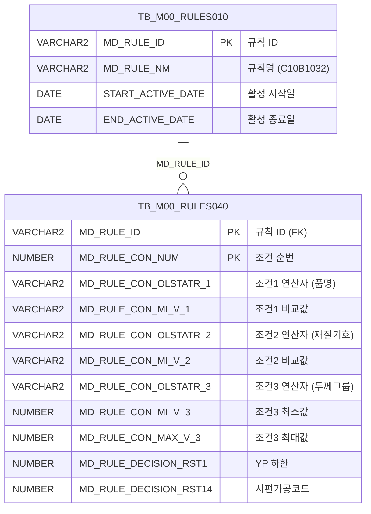

<h1 style="font-size: 40px; text-align: center; font-weight:
   bold; margin: 30px 0;">
  C107000030tab07 레거시 시스템 분석 종합 보고서
</h1>


# 1. 시스템 개요
- **서비스 ID**: C107000030tab07
- **업무명**: 사내재질사양 (Rules Engine 기반 재질 조건/결과 조회)
- **분석 일시**: 2026-03-17 (KST)
- **전체 Activity 수**: 2개 (Built-in: 2, Custom: 0)
- **분석자**: Claude Opus 4.6 / Claude Sonnet 4.6
- **분석 도구**: /analyze-service C107000030tab07
- **문서 버전**: 1.0

# 📊 비즈니스 프로세스 분석

## 시스템 목적

본 서비스는 동국제강 MES C10 모듈에서 **사내재질사양** 정보를 조회하는 화면(탭)이다. 부모 화면 C107000030의 7번째 탭으로 동작하며, Rules Engine(C10B1032 규칙)에 정의된 품명/재질기호/두께그룹 조건과 이에 대응하는 14개 의사결정 결과(YP하한/상한, TS하한/상한, 연신율하한/상한, HRB하한/상한, ERI하한/상한, 굴곡, 시편채취위치, 시편채취지시길이, 시편가공코드)를 조회한다.

이 화면은 생산 현장에서 코일의 재질 시험 기준을 확인하는 데 사용된다. 품명, 재질기호, 두께 범위 등의 조건 조합에 따라 어떤 기계적 특성(항복점, 인장강도, 연신율, 경도 등)의 허용 범위가 적용되는지를 Rules Engine 테이블(TB_M00_RULES040)을 통해 관리하고 조회한다.

<!-- 단순 조회 서비스: Custom Activity 0개, SELECT 쿼리만, Router→단일 조회 체인 → 워크플로우 다이어그램 생략 -->

## 주요 유즈케이스

### UC-01: 사내재질사양 조회
- **Actor**: 검사 담당자 / 품질 관리자
- **목적**: 품명·재질기호·두께그룹 조건 조합에 따른 재질 시험 기준값(YP, TS, 연신율, HRB, ERI, 굴곡, 시편 관련)을 확인

- **전제조건**:
  - 부모 화면(C107000030)이 로드되어 있음
  - C107000030_Form_1에 조회 파라미터가 설정되어 있음
  - Rules Engine에 C10B1032 규칙이 등록되어 있음

- **주요 흐름**:
  1. 사용자가 부모 탭(C107000030)에서 tab07(사내재질사양) 탭을 선택
  2. 탭 로드 시 onLoadGrid 이벤트가 발생하여 자동 조회 실행
  3. 부모 폼(C107000030_Form_1)의 파라미터를 uiCommon.parameters4로 구성
  4. C107000030tab07-service 호출 → C107000030tab07.select 쿼리 실행
  5. TB_M00_RULES010에서 'C10B1032' 규칙 ID 조회 (활성 기간 내)
  6. TB_M00_RULES040에서 해당 규칙의 조건(3개) 및 의사결정 결과(14개) 조회
  7. FUNC_GET_YEONSAN 함수로 두께그룹 연산자 코드를 기호로 변환
  8. Grid에 결과 표시 (3단 헤더: 품명/재질기호/두께그룹 그룹 + 결과 컬럼)

- **대체 흐름**:
  - C10B1032 규칙이 미등록 또는 비활성: 조회 결과 없음 표시
  - 부모 폼 파라미터 없음: 전체 데이터 조회

- **후행조건**:
  - Grid에 재질사양 조건/결과 데이터가 표시됨
  - 사용자가 컨텍스트 메뉴로 필터링/엑셀 내보내기 가능

### UC-02: 그리드 필터링을 통한 특정 조건 탐색
- **Actor**: 검사 담당자
- **목적**: 다수의 규칙 행 중 특정 품명·재질기호·두께 범위에 해당하는 행을 빠르게 찾기

- **전제조건**:
  - UC-01이 완료되어 Grid에 데이터가 표시된 상태

- **주요 흐름**:
  1. 사용자가 Grid 3행(필터 행)의 텍스트 필터에 품명 또는 재질기호 입력
  2. 두께그룹 컬럼의 숫자 필터에 두께 범위 입력
  3. Grid가 실시간으로 필터링되어 해당 조건의 행만 표시
  4. 결과 컬럼(RST1~RST14)에서 재질 시험 기준값 확인

- **대체 흐름**:
  - 필터 조건에 해당하는 행 없음: 빈 Grid 표시

- **후행조건**:
  - 필터링된 결과가 Grid에 표시됨

### UC-03: 엑셀 내보내기
- **Actor**: 품질 관리자
- **목적**: 사내재질사양 데이터를 엑셀 파일로 다운로드하여 오프라인 참조 또는 보고서 작성에 활용

- **전제조건**:
  - UC-01이 완료되어 Grid에 데이터가 표시된 상태

- **주요 흐름**:
  1. 사용자가 Grid에서 우클릭하여 컨텍스트 메뉴 표시
  2. "엑셀" 메뉴 항목 클릭
  3. onGridContextMenuClick 핸들러가 toExcel 함수 호출
  4. Grid 데이터가 엑셀 파일로 변환되어 다운로드

- **대체 흐름**:
  - Grid 데이터 없음: 빈 엑셀 파일 생성

- **후행조건**:
  - 엑셀 파일이 사용자 PC에 다운로드됨

---
## 비즈니스 로직 상세

### 1. Rules Engine 기반 재질사양 조건-결과 매핑

- **목적**: 품명, 재질기호, 두께그룹의 3가지 조건 조합에 대해 14개 재질 시험 기준값을 매핑하여 조회
- **처리 케이스**:

  **[케이스 1: 활성 규칙 필터링]**
  ```
    조건: TB_M00_RULES010에서 MD_RULE_NM = 'C10B1032' AND 현재 시각이 활성 기간 내
    처리:
      1. START_ACTIVE_DATE <= SYSDATE < END_ACTIVE_DATE 조건으로 활성 규칙 ID 조회
      2. 조회된 MD_RULE_ID로 TB_M00_RULES040 조인
      3. 비활성 규칙은 자동 제외
  ```

  **[케이스 2: 3개 조건 컬럼 매핑]**
  ```
    조건 매핑:
      CON1 (품명): MD_RULE_CON_OLSTATR_1 (연산자), MD_RULE_CON_MI_V_1 (비교값)
      CON2 (재질기호): MD_RULE_CON_OLSTATR_2 (연산자), MD_RULE_CON_MI_V_2 (비교값)
      CON3 (두께그룹): MD_RULE_CON_OLSTATR_3 → FUNC_GET_YEONSAN으로 변환,
                       MD_RULE_CON_MI_V_3 (최소값), MD_RULE_CON_MAX_V_3 (최대값)
  ```

  **[케이스 3: 14개 의사결정 결과]**
  ```
    결과 매핑:
      RST1 (YP하한), RST2 (YP상한), RST3 (TS하한), RST4 (TS상한),
      RST5 (연신율하한), RST6 (연신율상한), RST7 (HRB하한), RST8 (HRB상한),
      RST9 (ERI하한), RST10 (ERI상한), RST11 (굴곡),
      RST12 (시편채취위치), RST13 (시편채취지시길이), RST14 (시편가공코드)
    처리: TB_M00_RULES040의 MD_RULE_DECISION_RST1~RST14 컬럼에서 직접 조회
  ```

### 2. 연산자 코드 → 기호 변환 (FUNC_GET_YEONSAN)

- **목적**: 두께그룹 조건의 BETWEEN 연산자 코드를 사람이 읽을 수 있는 수학 기호로 변환
- **처리 케이스**:

  | 입력 코드 | 출력 기호 | 의미 |
  |-----------|----------|------|
  | BETWEEN1 | `<=값<=` | 최소값 이상, 최대값 이하 (양쪽 포함) |
  | BETWEEN2 | `<=값<` | 최소값 이상, 최대값 미만 |
  | BETWEEN3 | `<값<=` | 최소값 초과, 최대값 이하 |
  | BETWEEN4 | `<값<` | 최소값 초과, 최대값 미만 |
  | 기타 | 입력값 그대로 반환 | 매핑되지 않은 연산자는 원본 유지 |

- **예외 처리**:
  - 함수 내부 예외 발생 시 NULL 반환 (WHEN OTHERS → NULL)
  - 입력값에 UPPER() 적용 후 호출하므로 대소문자 무관

## PL/SQL 함수/프로시저

| # | 호출명 | 유형 | 용도 | 상세 분석 |
|---|--------|------|------|----------|
| 1 | FUNC_GET_YEONSAN | 함수 | 연산자 코드(BETWEEN1~4)를 수학 기호(<=값<=, <=값< 등)로 변환 | [분석 보고서](../../../dbms/M00APUSER/function/FUNC_GET_YEONSAN_analysis_report.md) |

---

# 💾 데이터 요구사항

## 핵심 테이블

### 1. TB_M00_RULES040 - 규칙 상세 조건/결과 테이블
| 컬럼명 | 타입 | PK | 설명 |
|--------|------|----|------|
| MD_RULE_ID | VARCHAR2 | ✅ | 규칙 ID (TB_M00_RULES010 FK) |
| MD_RULE_CON_NUM | NUMBER | ✅ | 조건 순번 (SEQ) |
| MD_RULE_CON_OLSTATR_1 | VARCHAR2 | | 조건1 연산자 (품명) |
| MD_RULE_CON_MI_V_1 | VARCHAR2 | | 조건1 비교값 (품명) |
| MD_RULE_CON_OLSTATR_2 | VARCHAR2 | | 조건2 연산자 (재질기호) |
| MD_RULE_CON_MI_V_2 | VARCHAR2 | | 조건2 비교값 (재질기호) |
| MD_RULE_CON_OLSTATR_3 | VARCHAR2 | | 조건3 연산자 코드 (두께그룹, BETWEEN1~4) |
| MD_RULE_CON_MI_V_3 | NUMBER | | 조건3 최소값 (두께그룹 하한) |
| MD_RULE_CON_MAX_V_3 | NUMBER | | 조건3 최대값 (두께그룹 상한) |
| MD_RULE_DECISION_RST1 | NUMBER | | YP 하한 |
| MD_RULE_DECISION_RST2 | NUMBER | | YP 상한 |
| MD_RULE_DECISION_RST3 | NUMBER | | TS 하한 |
| MD_RULE_DECISION_RST4 | NUMBER | | TS 상한 |
| MD_RULE_DECISION_RST5 | NUMBER | | 연신율 하한 |
| MD_RULE_DECISION_RST6 | NUMBER | | 연신율 상한 |
| MD_RULE_DECISION_RST7 | NUMBER | | HRB 하한 |
| MD_RULE_DECISION_RST8 | NUMBER | | HRB 상한 |
| MD_RULE_DECISION_RST9 | NUMBER | | ERI 하한 |
| MD_RULE_DECISION_RST10 | NUMBER | | ERI 상한 |
| MD_RULE_DECISION_RST11 | NUMBER | | 굴곡 |
| MD_RULE_DECISION_RST12 | VARCHAR2 | | 시편채취위치 |
| MD_RULE_DECISION_RST13 | NUMBER | | 시편채취지시길이 |
| MD_RULE_DECISION_RST14 | VARCHAR2 | | 시편가공코드 |

### 2. TB_M00_RULES010 - 규칙 마스터 테이블
| 컬럼명 | 타입 | PK | 설명 |
|--------|------|----|------|
| MD_RULE_ID | VARCHAR2 | ✅ | 규칙 ID |
| MD_RULE_NM | VARCHAR2 | | 규칙명 (예: 'C10B1032') |
| START_ACTIVE_DATE | DATE | | 활성 시작일 |
| END_ACTIVE_DATE | DATE | | 활성 종료일 |

## 데이터 플로우

### 1. 조회

```
[탭 로드 시 사내재질사양 조회]
탭 선택 (tab07)
→ onLoadGrid 이벤트 → find() 호출
→ uiCommon.parameters4('C107000030_Form_1', 'C107000030tab07_Grid_1', ...)
→ C107000030tab07.select
  FROM M00APUSER.TB_M00_RULES040 RULES040,
       (SELECT MD_RULE_ID
          FROM M00APUSER.TB_M00_RULES010
         WHERE MD_RULE_NM = 'C10B1032'
           AND START_ACTIVE_DATE <= SYSDATE
           AND SYSDATE < END_ACTIVE_DATE) RULES010
  WHERE RULES010.MD_RULE_ID = RULES040.MD_RULE_ID
  -- CON3 컬럼에 FUNC_GET_YEONSAN(UPPER(MD_RULE_CON_OLSTATR_3)) 적용
→ Grid에 조건(3개) + 결과(14개) 표시
```

## SQL 일람표

| SQL 이름 | 쿼리 ID | 타입 | 출처 | 테이블 |
|---------|---------|-----|-------|-------|
| 사내재질사양 조회 | C107000030tab07.select | SELECT | Service | TB_M00_RULES040, TB_M00_RULES010 |

## ER 다이어그램 (핵심 관계)



관계 설명:
- TB_M00_RULES010이 규칙 마스터로 규칙 ID, 규칙명, 활성 기간을 관리
- TB_M00_RULES040이 규칙 상세로 MD_RULE_ID를 통해 마스터와 1:N 관계
- 하나의 규칙(C10B1032)에 다수의 조건-결과 행이 존재

---

# 🖥️ 사용자 인터페이스 요구사항

## 화면 레이아웃 상세

### Layout 구조 (initLayout)
```javascript
{
  // 부모 탭(C107000030)의 tab07 영역에 배치
  // flat 구조: Grid, messagebox, Form 순서
  components: [
    {
      id: "C107000030tab07_Grid_1",
      type: "grid",
      position: { left: "0px", top: "0px", width: "976px", height: "492px" }
    },
    {
      id: "C107000030tab07_messagebox",
      type: "messagebox",
      position: { left: "0px", top: "493px", width: "976px", height: "18px" }
    },
    {
      id: "C107000030tab07_Form_1",
      type: "form",
      position: { left: "0px", top: "450px", width: "282px", height: "30px" },
      note: "빈 Form - 실제 파라미터는 부모 C107000030_Form_1 참조"
    }
  ]
}
```

## 입출력 요소

### Form 컴포넌트
**C107000030tab07_Form_1**
- 빈 Form (items 태그만 존재)
- 실제 조회 파라미터는 부모 탭의 `C107000030_Form_1` 폼을 참조
- URL: basicGridData.do

### Grid 컴포넌트

**C107000030tab07_Grid_1 (사내재질사양 목록)**
- 편집 가능 여부: 아니오 (읽기 전용, 컨텍스트 메뉴로 편집 모드 토글 가능)
- Split: 0 (고정 컬럼 없음)
- 3단 헤더 구조 (그룹 헤더 + 세부 헤더 + 필터 행)
- Smart Rendering: true, 행 높이: 22px
- 컬럼 너비 단위: % (colwidthUnit)
- 주요 컬럼 (22개):

  **순번**:
  - SEQ: ro - 순번 (4%, 우측정렬)

  **조건 - 품명**:
  - CON1: ro - 품명 연산자 (5%, 중앙정렬, 헤더그룹: 품명-연산)
  - MIN1: ro - 품명 비교값 (10%, 좌측정렬, 헤더그룹: 품명-비교값)

  **조건 - 재질기호**:
  - CON2: ro - 재질기호 연산자 (5%, 중앙정렬, 헤더그룹: 재질기호-연산, 텍스트필터)
  - MIN2: ro - 재질기호 비교값 (6%, 중앙정렬, 헤더그룹: 재질기호-비교값, 텍스트필터)

  **조건 - 두께그룹**:
  - CON3: ro - 두께그룹 연산자 기호 (10%, 중앙정렬, 헤더그룹: 두께그룹-연산, FUNC_GET_YEONSAN 변환값)
  - MIN3: ron - 두께그룹 최소값 (6%, 중앙정렬, 소수점3자리, 숫자필터, 헤더그룹: 두께그룹-비교값)
  - MAX3: ron - 두께그룹 최대값 (6%, 중앙정렬, 소수점3자리, 숫자필터, 헤더그룹: 두께그룹-비교값)

  **결과 - 기계적 특성**:
  - RST1: ron - YP 하한 (6%, 중앙정렬)
  - RST2: ron - YP 상한 (6%, 중앙정렬)
  - RST3: ron - TS 하한 (6%, 중앙정렬)
  - RST4: ron - TS 상한 (6%, 중앙정렬)
  - RST5: ron - 연신율 하한 (6%, 중앙정렬)
  - RST6: ron - 연신율 상한 (6%, 중앙정렬)
  - RST7: ron - HRB 하한 (6%, 중앙정렬)
  - RST8: ron - HRB 상한 (6%, 중앙정렬)
  - RST9: ron - ERI 하한 (6%, 중앙정렬)
  - RST10: ron - ERI 상한 (6%, 중앙정렬)
  - RST11: ron - 굴곡 (6%, 중앙정렬)

  **결과 - 시편 정보**:
  - RST12: ron - 시편채취위치 (6%, 중앙정렬)
  - RST13: ron - 시편채취지시길이 (6%, 중앙정렬)
  - RST14: ron - 시편가공코드 (6%, 중앙정렬)

**컨텍스트 메뉴**:
- move_grid (checkbox): 컬럼 이동 활성화
- filter_grid (checkbox): 헤더 메뉴 필터 활성화
- editable_grid (checkbox): 편집 모드 토글
- excel_grid (action): 엑셀 내보내기

## 화면 동작 흐름

### 1. 화면 초기 로딩 (탭 선택 시)
```
1. 부모 화면(C107000030)에서 tab07 탭 선택
2. C107000030tab07.jsp 로드
3. onLoadGrid 이벤트 발생 (onXLEEvent)
4. uiCommon.parameters4('C107000030_Form_1', 'C107000030tab07_Grid_1', ...) 호출
   - 부모 탭의 Form_1에서 조회 파라미터 추출
5. C107000030tab07-service 호출 (handleDataProcess.do)
6. C107000030tab07.select 쿼리 실행
   - TB_M00_RULES010에서 C10B1032 활성 규칙 ID 조회
   - TB_M00_RULES040과 조인하여 조건/결과 데이터 조회
7. Grid에 3단 헤더 + 데이터 바인딩
8. onLoadGrid 이벤트 detach (1회성 실행)
```

### 2. 재조회 (부모 폼 조건 변경 시)
```
1. 부모 탭의 Form_1에서 조건 변경
2. find() 함수 호출
3. uiCommon.parameters4('C107000030_Form_1', 'C107000030tab07_Grid_1', ...) 호출
4. C107000030tab07-service 재호출
5. Grid 데이터 갱신
6. findMessage() 호출 → messagebox에 조회 결과 건수 표시
```

### 3. 컨텍스트 메뉴 조작
```
1. 사용자가 Grid에서 우클릭
2. 컨텍스트 메뉴 표시 (컬럼이동, 필터, 편집, 엑셀)
3. onGridContextMenuClick 핸들러에서 선택 항목 처리:
   - move_grid: enableColumnMove 토글 (드래그로 컬럼 순서 변경)
   - filter_grid: enableHeaderMenu 토글 (컬럼별 필터 메뉴)
   - editable_grid: setEditable 토글 (셀 편집 활성화)
   - excel_grid: toExcel 실행 (엑셀 다운로드)
```

## JavaScript 모듈

**C107000030tab07.jsp** (탭 내장 스크립트)
- find(): 부모 폼(C107000030_Form_1) 파라미터로 Grid_1 데이터 조회 (uiCommon.parameters4 호출)
- onLoadGrid(): Grid 초기 로드 시 자동 조회 실행 후 이벤트 detach
- findMessage(): messagebox에 결과 메시지 표시
- add(): 그리드에 새 행 추가
- remove(): 그리드에서 행 삭제
- copy(): 그리드 행 클립보드 복사
- undo(): 실행 취소
- redo(): 다시 실행
- onGridContextMenuClick(): 컨텍스트 메뉴 항목 처리 (컬럼이동/필터/편집/엑셀)

## 주요 이벤트 핸들러

**onLoadGrid (탭 로드 시 자동 조회)**
- 이벤트 타입: Grid onXLEEvent
- 처리 내용:
  1. C107000030_Form_1 파라미터로 Grid_1 데이터 로드
  2. uiCommon.parameters4 호출하여 파라미터 구성
  3. Grid loadData 실행
  4. 이벤트 detach (1회성 실행)

**onGridContextMenuClick (컨텍스트 메뉴)**
- 이벤트 타입: Grid Context Menu Click
- 처리 내용:
  1. 클릭된 메뉴 항목 ID 확인
  2. move_grid: 컬럼 이동 토글
  3. filter_grid: 헤더 필터 메뉴 토글
  4. editable_grid: 셀 편집 모드 토글
  5. excel_grid: 엑셀 내보내기 실행

---

# 📌 특이사항 및 주의사항

## 1. 부모 탭 폼 참조 패턴
- 이 탭은 자체 Form(C107000030tab07_Form_1)이 비어있으며, 실제 조회 파라미터는 부모 탭의 `C107000030_Form_1`을 참조한다
- `uiCommon.parameters4('C107000030_Form_1', 'C107000030tab07_Grid_1', ...)` 패턴으로 부모 폼 → 자식 그리드 연결
- 부모 탭의 Form 구조 변경 시 이 탭의 조회 기능에 직접 영향

## 2. Rules Engine 의존성
- 규칙명 'C10B1032'가 SQL에 하드코딩되어 있음 (WHERE MD_RULE_NM='C10B1032')
- 규칙의 활성 기간(START_ACTIVE_DATE ~ END_ACTIVE_DATE)에 의해 조회 가능 여부가 결정됨
- 규칙이 만료되거나 미등록이면 데이터가 조회되지 않음

## 3. M00APUSER 스키마 크로스 참조
- 쿼리에서 M00APUSER 스키마의 테이블(TB_M00_RULES010, TB_M00_RULES040)과 함수(FUNC_GET_YEONSAN)를 직접 참조
- MESAPUSER가 아닌 M00APUSER 스키마이므로 DAO 설정(mesdao)과 스키마가 불일치할 수 있으나, 쿼리에서 스키마를 명시적으로 지정하여 해결

## 4. 3단 헤더 구조의 복잡성
- Grid가 3단 헤더를 사용하여 조건 컬럼(품명/재질기호/두께그룹)을 그룹화하고, 세부 컬럼(연산/비교값)과 필터 행을 구분
- #rspan, #cspan으로 헤더 셀 병합 처리
- 두께그룹은 연산/비교값/비교값(MIN3/MAX3) 3컬럼으로 범위 표현

## 5. FUNC_GET_YEONSAN 함수를 통한 연산자 표시
- CON3 컬럼은 DB에 'BETWEEN1'~'BETWEEN4' 형태의 코드로 저장되지만, 화면에는 `<=값<=`, `<=값<` 등 수학 기호로 표시
- UPPER() 적용 후 함수 호출하므로 대소문자 무관
- 매핑되지 않은 코드는 원본 그대로 표시

---

# 📚 참고 문서

- **Query SQL**: `src/query/C107000030tab07-query.glue_sql`
- **Service XML**: `src/service/C107000030tab07-service.xml`
- **JSP**: `WebContents/C107000030tab07.jsp`
- **Grid XML**: `WebContents/header/kr/C107000030tab07/C107000030tab07_Grid_1.xml`
- **Form XML**: `WebContents/header/kr/C107000030tab07/C107000030tab07_Form_1.xml`
- **PL/SQL 분석**: `docs/analysis/dbms/M00APUSER/function/FUNC_GET_YEONSAN_analysis_report.md`
