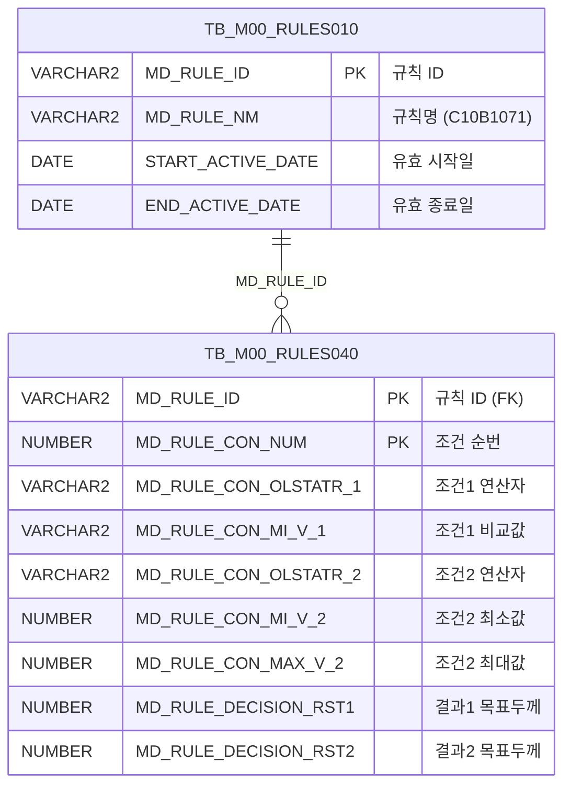

<h1 style="font-size: 40px; text-align: center; font-weight:
   bold; margin: 30px 0;">
  C107000030tab08 레거시 시스템 분석 종합 보고서
</h1>


# 1. 시스템 개요
- **서비스 ID**: C107000030tab08
- **업무명**: 원자재두께관리
- **분석 일시**: 2026-03-17 10:46 KST
- **전체 Activity 수**: 2 (Built-in 2개, Custom 0개)
- **분석자**: Claude Opus 4.6 / Claude Sonnet
- **분석 도구**: /analyze-service C107000030tab08
- **문서 버전**: 1.0

# 📊 비즈니스 프로세스 분석

## 시스템 목적

본 서비스는 C10(냉연) 모듈의 원자재두께관리 화면으로, Rules Engine(C10B1071 규칙) 기반의 원자재 목표두께 결정 테이블을 조회하는 기능을 제공한다. 부모 화면(C107000030) 하위의 탭 화면(tab08)으로 동작한다.

원자재코드, 두께범위, 폭범위 등 3개 조건 축과 그에 대응하는 5개 원자재목표두께 결과값을 매트릭스 형태로 표시한다. Rules Engine의 의사결정 테이블(TB_M00_RULES040)에 정의된 규칙을 기반으로, 조건별 연산자(BETWEEN1~4)를 사람이 읽을 수 있는 기호(<=값<=, <=값< 등)로 변환하여 표시한다.

이 화면은 읽기 전용 조회 화면으로, 데이터 수정 기능 없이 현재 활성화된 C10B1071 규칙의 조건-결과 매핑 현황을 확인하는 용도로 사용된다.

<!-- 단순 조회 서비스: Custom Activity 0개, SELECT만 사용, Router → 단일 조회 구조이므로 워크플로우 다이어그램 생략 -->

## 주요 유즈케이스

### UC-01: 원자재 목표두께 규칙 조회
- **Actor**: 냉연 공정 관리자 / 품질 관리자
- **목적**: C10B1071 규칙에 정의된 원자재코드-두께-폭 조건별 목표두께 매핑 현황을 확인하여 생산 설계 기준 데이터를 파악

- **전제조건**:
  - 사용자가 시스템에 로그인되어 있음
  - 부모 화면(C107000030)에 접근 권한이 있음
  - C10B1071 규칙이 TB_M00_RULES010/040에 등록되어 있고 유효기간 내임

- **주요 흐름**:
  1. 사용자가 부모 화면(C107000030)에서 tab08 탭을 선택
  2. 탭 진입 시 onLoadGrid(onXLEEvent)에 의해 자동 조회 실행
  3. C107000030tab08.select 쿼리가 실행되어 C10B1071 규칙의 조건-결과 데이터 조회
  4. FUNC_GET_YEONSAN 함수로 연산자 코드(BETWEEN1~4)를 기호(<=값<=, <=값< 등)로 변환
  5. Grid에 조건(원자재코드, 두께범위, 폭범위)과 결과(목표두께 1~5) 매트릭스 표시

- **대체 흐름**:
  - C10B1071 규칙이 유효기간 외인 경우: 조회 결과 없음
  - 부모 화면에서 재조회 시: find 함수로 부모 Form(C107000030_Form_1) 파라미터를 참조하여 Grid 재조회

- **후행조건**:
  - Grid에 원자재 목표두께 규칙 데이터가 표시됨
  - 사용자가 컨텍스트 메뉴로 엑셀 내보내기 가능

### UC-02: 그리드 데이터 엑셀 내보내기
- **Actor**: 냉연 공정 관리자 / 품질 관리자
- **목적**: 조회된 원자재 목표두께 규칙을 엑셀 파일로 내보내어 오프라인 검토 또는 보고서 작성에 활용

- **전제조건**:
  - UC-01이 완료되어 Grid에 데이터가 표시된 상태

- **주요 흐름**:
  1. Grid에서 우클릭하여 컨텍스트 메뉴 표시
  2. "엑셀 내보내기" 메뉴 항목 선택
  3. onGridContextMenuClick 핸들러에서 toExcel 동작 실행
  4. 현재 Grid 데이터가 엑셀 파일로 다운로드

- **대체 흐름**:
  - 데이터가 없는 경우: 빈 엑셀 파일 생성

- **후행조건**:
  - 엑셀 파일이 사용자 PC에 다운로드됨

### UC-03: 그리드 필터링을 통한 특정 조건 확인
- **Actor**: 냉연 공정 관리자 / 품질 관리자
- **목적**: 다수의 규칙 행 중 특정 두께범위 또는 폭범위에 해당하는 목표두께를 빠르게 찾기

- **전제조건**:
  - UC-01이 완료되어 Grid에 데이터가 표시된 상태

- **주요 흐름**:
  1. Grid 헤더 3행의 텍스트/숫자 필터에 검색 조건 입력
  2. 원자재코드(CON1)는 텍스트 필터, 두께범위(MIN2/MAX2) 및 폭범위(MIN3/MAX3)는 숫자 필터 사용
  3. 필터 조건에 맞는 행만 Grid에 표시

- **대체 흐름**:
  - 필터 조건에 맞는 데이터가 없는 경우: 빈 Grid 표시

- **후행조건**:
  - 필터링된 결과만 Grid에 표시됨

---
## 비즈니스 로직 상세

### 1. Rules Engine 기반 조건-결과 매핑 조회

- **목적**: TB_M00_RULES010/040 테이블에 정의된 C10B1071 규칙의 의사결정 테이블을 조회하여 원자재코드, 두께, 폭 조건에 따른 목표두께 결정 기준 제공

- **처리 케이스**:

  **[케이스 1: 유효 규칙 필터링]**
  ```
  조건: TB_M00_RULES010.MD_RULE_NM = 'C10B1071'
        AND START_ACTIVE_DATE <= SYSDATE
        AND SYSDATE < END_ACTIVE_DATE
  처리:
    1. RULES010에서 유효기간 내 C10B1071 규칙의 MD_RULE_ID 조회
    2. 해당 MD_RULE_ID로 RULES040의 상세 조건/결과 레코드 조인
    3. 각 레코드의 조건번호(MD_RULE_CON_NUM)를 SEQ로 반환
  ```

  **[케이스 2: 연산자 코드→기호 변환 (FUNC_GET_YEONSAN)]**
  ```
  조건: CON2, CON3 컬럼의 연산자 코드가 BETWEEN1~4인 경우
  처리:
    1. UPPER()로 대문자 변환 후 FUNC_GET_YEONSAN 함수 호출
    2. 변환 매핑:
       BETWEEN1 → '<=값<='  (양쪽 포함)
       BETWEEN2 → '<=값<'   (최소 이상, 최대 미만)
       BETWEEN3 → '<값<='   (최소 초과, 최대 이하)
       BETWEEN4 → '<값<'    (양쪽 미포함)
    3. 매핑되지 않은 코드는 원본 반환
    4. 예외 발생 시 NULL 반환
  ```

### 2. 3축 조건 구조

- **목적**: 원자재 목표두께 결정을 위한 다차원 조건 매트릭스 구성
- **처리 케이스**:

  **[조건 1: 원자재코드 (CON1)]**
  ```
  컬럼: MD_RULE_CON_OLSTATR_1
  의미: 원자재코드 (문자열 값)
  비교값: MD_RULE_CON_MI_V_1 (MIN1) - 단일 비교값
  ```

  **[조건 2: 두께범위 (CON2)]**
  ```
  컬럼: MD_RULE_CON_OLSTATR_2 → FUNC_GET_YEONSAN으로 연산 기호 변환
  의미: 두께 범위 연산자
  비교값: MD_RULE_CON_MI_V_2 (MIN2), MD_RULE_CON_MAX_V_2 (MAX2)
  포맷: 소수점 3자리 (0.000)
  ```

  **[조건 3: 폭범위 (CON3)]**
  ```
  컬럼: MD_RULE_CON_OLSTATR_3 → FUNC_GET_YEONSAN으로 연산 기호 변환
  의미: 폭 범위 연산자
  비교값: MD_RULE_CON_MI_V_3 (MIN3), MD_RULE_CON_MAX_V_3 (MAX3)
  포맷: 정수 4자리 + 소수점 1자리 (0000.0)
  ```

  **[결과: 원자재목표두께 1~5 (RST1~RST5) + RST6]**
  ```
  컬럼: MD_RULE_DECISION_RST1 ~ RST6
  의미: 조건 조합에 따른 의사결정 결과값 (최대 6개)
  포맷: 소수점 2자리 (0.00)
  ```

---

# 💾 데이터 요구사항

## 핵심 테이블

### 1. TB_M00_RULES010 - (Rules Engine 규칙 마스터)
| 컬럼명 | 타입 | PK | 설명 |
|--------|------|----|-----|
| MD_RULE_ID | VARCHAR2 | ✅ | 규칙 ID (PK) |
| MD_RULE_NM | VARCHAR2 | | 규칙명 (예: C10B1071) |
| START_ACTIVE_DATE | DATE | | 규칙 유효 시작일 |
| END_ACTIVE_DATE | DATE | | 규칙 유효 종료일 |

### 2. TB_M00_RULES040 - (Rules Engine 규칙 조건/결과 상세)
| 컬럼명 | 타입 | PK | 설명 |
|--------|------|----|-----|
| MD_RULE_ID | VARCHAR2 | ✅ | 규칙 ID (FK → RULES010) |
| MD_RULE_CON_NUM | NUMBER | ✅ | 조건 순번 (SEQ) |
| MD_RULE_CON_OLSTATR_1 | VARCHAR2 | | 조건1 연산자 (원자재코드) |
| MD_RULE_CON_MI_V_1 | VARCHAR2 | | 조건1 비교값 (원자재코드 값) |
| MD_RULE_CON_OLSTATR_2 | VARCHAR2 | | 조건2 연산자 (두께범위, BETWEEN1~4) |
| MD_RULE_CON_MI_V_2 | NUMBER | | 조건2 최소값 (두께 최소) |
| MD_RULE_CON_MAX_V_2 | NUMBER | | 조건2 최대값 (두께 최대) |
| MD_RULE_CON_OLSTATR_3 | VARCHAR2 | | 조건3 연산자 (폭범위, BETWEEN1~4) |
| MD_RULE_CON_MI_V_3 | NUMBER | | 조건3 최소값 (폭 최소) |
| MD_RULE_CON_MAX_V_3 | NUMBER | | 조건3 최대값 (폭 최대) |
| MD_RULE_DECISION_RST1 | NUMBER | | 의사결정 결과1 (목표두께1) |
| MD_RULE_DECISION_RST2 | NUMBER | | 의사결정 결과2 (목표두께2) |
| MD_RULE_DECISION_RST3 | NUMBER | | 의사결정 결과3 (목표두께3) |
| MD_RULE_DECISION_RST4 | NUMBER | | 의사결정 결과4 (목표두께4) |
| MD_RULE_DECISION_RST5 | NUMBER | | 의사결정 결과5 (목표두께5) |
| MD_RULE_DECISION_RST6 | NUMBER | | 의사결정 결과6 |

## 데이터 플로우

### 1. 조회

```
[원자재 목표두께 규칙 조회]
탭 화면 진입 (자동 조회)
→ C107000030tab08.select
  FROM M00APUSER.TB_M00_RULES040 RULES040
  INNER JOIN (SELECT MD_RULE_ID FROM M00APUSER.TB_M00_RULES010
              WHERE MD_RULE_NM='C10B1071'
              AND START_ACTIVE_DATE <= SYSDATE
              AND SYSDATE < END_ACTIVE_DATE) RULES010
  ON RULES010.MD_RULE_ID = RULES040.MD_RULE_ID
→ FUNC_GET_YEONSAN으로 CON2, CON3 연산자 코드를 기호로 변환
→ Grid에 조건-결과 매트릭스 표시
```

## SQL 일람표

| SQL 이름 | 쿼리 ID | 타입 | 출처 | 테이블 |
|---------|---------|-----|------|-------|
| 원자재 목표두께 규칙 조회 | C107000030tab08.select | SELECT | Service | TB_M00_RULES040, TB_M00_RULES010 |

## PL/SQL 함수/프로시저

| # | 호출명 | 유형 | 용도 | 상세 분석 |
|---|--------|------|------|----------|
| 1 | FUNC_GET_YEONSAN | 스탠드얼론 함수 | 연산자 코드(BETWEEN1~4)를 연산 기호(<=값<= 등)로 변환 | [분석 보고서](../../../dbms/M00APUSER/function/FUNC_GET_YEONSAN_analysis_report.md) |

## ER 다이어그램 (핵심 관계)



관계 설명:
- TB_M00_RULES010이 규칙 마스터 테이블로 규칙 ID/명칭/유효기간을 관리
- TB_M00_RULES040은 규칙 상세 조건/결과 테이블로 MD_RULE_ID 기반 1:N 관계
- C10B1071 규칙명으로 필터링하여 원자재두께관리 전용 데이터만 조회

---

# 🖥️ 사용자 인터페이스 요구사항

## 화면 레이아웃 상세

### Layout 구조
```javascript
{
  itemType: "layout",
  dirType: "absolute",  // 절대 위치 배치
  components: [
    {
      id: "C107000030tab08_Grid_1",
      type: "grid",
      position: { left: "0px", top: "0px", width: "976px", height: "492px" }
    },
    {
      id: "C107000030tab08_Form_1",
      type: "form",
      position: { left: "0px", top: "450px", width: "282px", height: "30px" }
    },
    {
      id: "C107000030tab08_messagebox",
      type: "messagebox",
      position: { left: "0px", top: "493px", width: "976px", height: "18px" }
    }
  ]
}
```

## 입출력 요소

### Form 컴포넌트
**C107000030tab08_Form_1**
- 빈 폼 (필드 없음) - 실제 검색 파라미터는 부모 탭의 C107000030_Form_1에서 참조

### Grid 컴포넌트

**C107000030tab08_Grid_1 (원자재 목표두께 규칙 목록)**
- 편집 가능 여부: 아니오 (전체 읽기 전용)
- Split: 0 (고정 컬럼 없음)
- 3단계 그룹 헤더 구조
- 필터: 텍스트 필터 (CON1), 숫자 필터 (MIN2, MAX2, MIN3, MAX3)
- 컨텍스트 메뉴: 열 이동, 필터, 편집, 엑셀 내보내기
- 스마트 렌더링: 활성화
- 주요 컬럼 (15개):

  **기본 정보**:
  - SEQ: ro - 조건 순번 (4%, 우측정렬)

  **원자재코드 그룹**:
  - CON1: ro - 원자재코드 조건 연산자 (5%, 중앙정렬)
  - MIN1: ro - 원자재코드 비교값 (15%, 좌측정렬)

  **두께범위 그룹**:
  - CON2: ro - 두께범위 연산자 기호 (8%, 중앙정렬, FUNC_GET_YEONSAN 변환)
  - MIN2: ron - 두께 최소값 (6%, 중앙정렬, 포맷: 0.000)
  - MAX2: ron - 두께 최대값 (6%, 중앙정렬, 포맷: 0.000)

  **폭범위 그룹**:
  - CON3: ro - 폭범위 연산자 기호 (8%, 중앙정렬, FUNC_GET_YEONSAN 변환)
  - MIN3: ron - 폭 최소값 (6%, 중앙정렬, 포맷: 0000.0)
  - MAX3: ron - 폭 최대값 (6%, 중앙정렬, 포맷: 0000.0)

  **원자재목표두께 그룹 (결과)**:
  - RST1: ron - 원자재목표두께 결과 (6%, 중앙정렬, 포맷: 0.00)
  - RST2: ron - 원자재목표두께1 (6%, 중앙정렬, 포맷: 0.00)
  - RST3: ron - 원자재목표두께2 (6%, 중앙정렬, 포맷: 0.00)
  - RST4: ron - 원자재목표두께3 (6%, 중앙정렬, 포맷: 0.00)
  - RST5: ron - 원자재목표두께4 (6%, 중앙정렬, 포맷: 0.00)
  - RST6: ron - 원자재목표두께5 (6%, 중앙정렬, 포맷: 0.00)

## 화면 동작 흐름

### 1. 화면 초기 로딩 (탭 진입)
```
1. 부모 화면(C107000030)에서 tab08 탭 선택
2. onLoadGrid 함수가 onXLEEvent로 바인딩됨
3. Grid 초기화 완료 시 onXLEEvent 발생
4. onLoadGrid에서 find() 호출하여 자동 조회 실행
5. 부모 폼(C107000030_Form_1)의 파라미터 참조
6. C107000030tab08.select 쿼리 실행
7. Grid에 조건-결과 매트릭스 데이터 바인딩
8. onXLEEvent 핸들러 detach (1회만 실행)
9. 상태바(messagebox)에 조회 결과 메시지 표시
```

### 2. 재조회 (부모 화면에서 조회 트리거)
```
1. 부모 화면에서 조회 조건 변경 후 조회 실행
2. find() 함수 호출
3. 부모 폼(C107000030_Form_1)에서 검색 파라미터 구성
4. basicGridData.do URL로 서비스 호출
5. C107000030tab08-service → 분기(Router) → 조회(FormSearch) 실행
6. C107000030tab08.select 쿼리 실행
7. Grid 데이터 갱신
8. findMessage 콜백으로 상태바 메시지 업데이트
```

### 3. 컨텍스트 메뉴 활용
```
1. Grid 영역에서 우클릭
2. 컨텍스트 메뉴 표시 (열 이동, 필터, 편집 가능, 엑셀 내보내기)
3. 메뉴 항목 선택
4. onGridContextMenuClick 핸들러에서 선택 동작 실행:
   - enableColumnMove: 열 순서 변경 활성화
   - enableHeaderMenu: 헤더 메뉴 활성화
   - setEditable: 편집 모드 전환
   - toExcel: 엑셀 파일 다운로드
```

## JavaScript 모듈

**C107000030tab08.jsp** (탭 화면 스크립트)
- find(): 부모 폼(C107000030_Form_1) 파라미터로 Grid 데이터 조회 (referenceForm 참조)
- add(): Grid에 새 행 추가
- remove(): Grid에서 행 삭제
- copy(): 행 내용 클립보드 복사
- undo(): 실행 취소
- redo(): 다시 실행
- onGridContextMenuClick(): 컨텍스트 메뉴 클릭 처리 (열 이동, 필터, 편집, 엑셀)
- findMessage(): 상태바(messagebox)에 앱 메시지 표시
- onLoadGrid(): 초기 로드 시 자동 조회 실행 후 이벤트 핸들러 detach

## 주요 이벤트 핸들러

**onLoadGrid (그리드 초기 로드)**
- 이벤트 타입: onXLEEvent (Grid XLE 이벤트)
- 처리 내용:
  1. Grid 초기화 완료 시 자동 트리거
  2. find() 호출하여 C107000030tab08.select 조회 실행
  3. 조회 완료 후 onXLEEvent 핸들러 detach
  4. 이후 동일 이벤트 발생 시 재실행 방지

**onGridContextMenuClick (컨텍스트 메뉴)**
- 이벤트 타입: Grid Context Menu Click
- 처리 내용:
  1. 메뉴 항목 ID에 따라 분기 처리
  2. 열 이동(enableColumnMove), 필터(enableHeaderMenu), 편집(setEditable), 엑셀(toExcel) 중 하나 실행

---

# 📌 특이사항 및 주의사항

## 1. 부모-자식 탭 간 폼 파라미터 참조 패턴
- tab08은 자체 Form(C107000030tab08_Form_1)이 빈 폼으로, 실제 검색 파라미터를 부모 화면의 C107000030_Form_1에서 가져오는 크로스 컴포넌트 참조 패턴을 사용한다. 현대화 시 부모-자식 간 데이터 전달 구조를 명확히 설계해야 한다.

## 2. onXLEEvent 기반 1회성 자동 조회 패턴
- Grid 초기화 완료 시 onXLEEvent로 자동 조회를 실행한 후 즉시 이벤트 핸들러를 detach하는 패턴을 사용한다. 이는 DHTMLX 프레임워크 특유의 초기화 타이밍 이슈를 우회하기 위한 것으로, 현대화 시 컴포넌트 생명주기(mounted/created) 기반으로 대체해야 한다.

## 3. Rules Engine 의존성 (M00APUSER 스키마)
- 본 서비스는 MES 자체 테이블이 아닌 M00APUSER 스키마의 Rules Engine 테이블(TB_M00_RULES010/040)에 전적으로 의존한다. C10B1071 규칙의 유효기간(START_ACTIVE_DATE ~ END_ACTIVE_DATE) 관리가 중요하며, 규칙이 만료되면 조회 결과가 빈 상태가 된다.

## 4. FUNC_GET_YEONSAN 함수의 연산자 변환 하드코딩
- BETWEEN1~4 코드만 처리하며, 새로운 연산자 코드 추가 시 함수 수정이 필요하다. 매핑되지 않은 코드는 원본 반환, 예외 시 NULL 반환하므로 화면에 빈 셀이 표시될 수 있다.

## 5. 3단계 그룹 헤더 + 필터 구조
- Grid가 3단계 그룹 헤더(원자재코드/두께범위/폭범위/원자재목표두께 → 연산/비교값 → 필터)를 사용하는 복잡한 구조로, 현대화 시 동일한 다단계 헤더 표현이 필요하다.

---

# 📚 참고 문서

- **Query SQL**: `src/query/C107000030tab08-query.glue_sql`
- **Service XML**: `src/service/C107000030tab08-service.xml`
- **JSP**: `WebContents/C107000030tab08.jsp`
- **Grid XML**: `WebContents/header/kr/C107000030tab08/C107000030tab08_Grid_1.xml`
- **Form XML**: `WebContents/header/kr/C107000030tab08/C107000030tab08_Form_1.xml`
- **PL/SQL 분석**: `docs/analysis/dbms/M00APUSER/function/FUNC_GET_YEONSAN_analysis_report.md`
